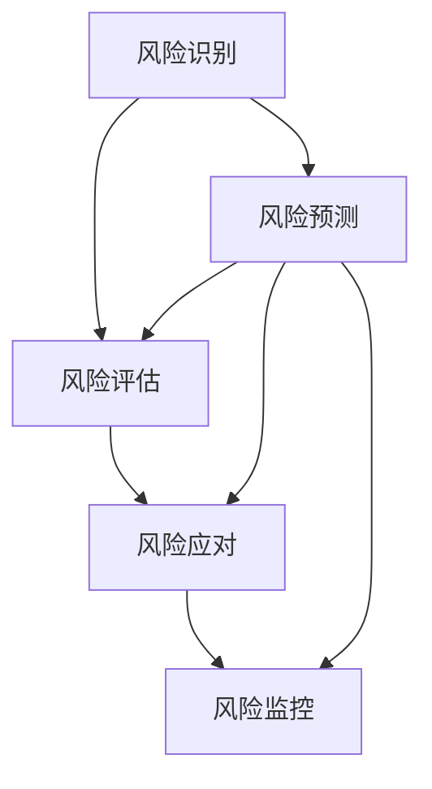
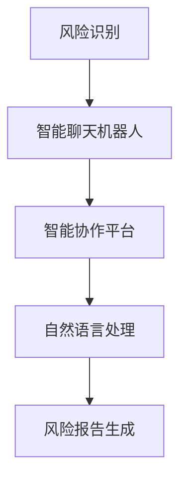

                 


为了撰写一篇符合要求的《AI时代的软件项目风险管理新策略》的技术博客文章，我们需要遵循以下步骤：

### 1. **文章结构规划**
首先，我们需要确定文章的整体结构，包括标题、关键词、摘要和目录大纲。这些部分将作为文章的框架，确保文章的逻辑性和完整性。

### 2. **背景介绍**
在文章的开头，我们需要详细介绍AI时代的背景，以及为什么软件项目风险管理在这一时代变得尤为重要。这将帮助读者理解文章的主题和重要性。

### 3. **核心概念与联系**
接下来，我们将详细阐述AI时代的软件项目风险管理中的核心概念，并使用Mermaid流程图来展示这些概念之间的关系。这将帮助读者直观地理解各个概念如何相互联系。

### 4. **核心算法原理讲解**
我们将使用伪代码详细阐述关键的风险管理算法，确保读者能够理解这些算法的实现原理。同时，我们将使用LaTeX格式嵌入文中独立段落的数学模型和公式，并进行详细讲解和举例说明。

### 5. **项目实战**
在这一部分，我们将设计一个实际案例，展示如何在实际项目中应用AI时代的软件项目风险管理新策略。我们将详细讲解开发环境搭建、源代码实现和代码解读，并对实际案例进行分析和剖析。

### 6. **最佳实践 tips、小结、注意事项、拓展阅读**
在文章的结尾，我们将提供一些最佳实践的建议，对文章内容进行小结，提醒读者注意的事项，并提供拓展阅读的资源，以帮助读者进一步学习和深入理解。

### 7. **文章结束**
最后，文章将以作者的简介结束，包括作者所在机构（AI天才研究院）和作品（禅与计算机程序设计艺术）。

接下来，我将根据这些步骤来构建文章的初稿。

---

### 《AI时代的软件项目风险管理新策略》

关键词：AI时代、软件项目风险管理、风险预测、风险评估、风险预警、人工智能

摘要：本文探讨了AI时代软件项目风险管理的挑战与机遇，通过核心概念的解释、算法原理的阐述、实际案例的分析，为读者提供了一套新策略，以应对AI时代软件项目中的复杂风险。

---

### 目录大纲

```markdown
# 第一部分：AI时代的背景与软件项目风险管理

## 第1章：AI时代的特征与影响

### 1.1 AI技术的快速发展

### 1.2 AI对软件项目风险的影响

## 第2章：软件项目风险管理的核心概念

### 2.1 风险管理的基本理论

### 2.2 AI在风险管理中的作用

### 2.3 Mermaid流程图：核心概念与联系

## 第3章：AI驱动的风险管理方法

### 3.1 风险预测模型

#### 3.1.1 伪代码：风险预测算法

#### 3.1.2 LaTeX数学公式：风险预测模型

### 3.2 风险评估与优化

#### 3.2.1 伪代码：风险评估算法

#### 3.2.2 LaTeX数学公式：风险评估模型

### 3.3 风险预警系统的设计

## 第4章：AI驱动的风险沟通与协作

### 4.1 风险沟通机制的创新

### 4.2 风险协作平台的构建

### 4.3 AI在风险沟通中的应用

## 第5章：AI在软件项目管理中的应用

### 5.1 项目管理流程的AI优化

### 5.2 项目风险管理工具的AI赋能

### 5.3 AI在项目进度控制中的应用

## 第6章：AI时代的风险管理实践

### 6.1 实际案例：风险预测与预警

### 6.2 实际案例：风险评估与优化

### 6.3 实际案例：风险沟通与协作

## 第7章：AI时代软件项目风险管理的未来展望

### 7.1 AI技术在风险管理中的发展趋势

### 7.2 面临的挑战与应对策略

### 7.3 风险管理新策略的应用前景

## 附录

### 附录A：AI技术基础

#### A.1 神经网络与深度学习概述

#### A.2 Python在AI风险管理中的应用

#### A.3 常用AI库与工具介绍

### 附录B：风险案例研究

#### B.1 案例一：AI在软件项目风险管理中的应用

#### B.2 案例二：风险管理新策略的实际效果分析

#### B.3 案例三：跨领域AI风险管理的成功实践
```

这个初步的目录大纲和文章结构将作为撰写文章的基础，接下来我们将逐一填充每个章节的内容。请根据您的反馈，让我知道是否需要进一步的调整和修改。然后，我们将开始详细撰写每一章节的内容。让我们一步一步地深入探讨AI时代的软件项目风险管理新策略。在接下来的步骤中，我们将首先填写第一章的内容。

### 第1章：AI时代的特征与影响

在过去的几十年中，人工智能（AI）经历了从理论研究到实际应用的飞速发展。今天，AI已经成为各行各业不可或缺的一部分，包括软件项目开发和管理。AI时代的到来，不仅带来了技术进步，也对软件项目风险管理产生了深远的影响。

#### 1.1 AI技术的快速发展

AI技术的发展可以分为三个主要阶段：早期的符号推理、基于规则的系统、以及当前的热门领域——深度学习和神经网络。随着计算能力的提升和大数据的普及，深度学习取得了显著的成果，尤其在图像识别、自然语言处理和决策支持系统等领域。AI技术的快速发展，使得软件项目具备了前所未有的智能化和自动化能力。

#### 1.2 AI对软件项目风险的影响

AI的引入，改变了软件项目的传统风险管理模式，使其更加精准和高效。以下是AI对软件项目风险影响的几个方面：

1. **风险预测**：AI可以通过数据分析、机器学习等技术，对潜在的风险进行预测。这有助于项目团队提前识别可能的问题，并采取相应的预防措施。
2. **风险评估**：AI可以分析历史数据，对项目中的风险进行量化评估，从而帮助团队更准确地分配资源和制定风险应对计划。
3. **风险预警**：AI系统可以实时监测项目进展，一旦发现异常，立即发出预警，提醒团队及时采取行动。
4. **风险沟通**：AI技术可以提高团队之间的沟通效率，通过智能化的协作平台，确保风险信息及时传递和共享。
5. **自动化**：AI可以自动化执行一些传统的风险控制流程，如自动化的测试、监控和修复，从而减少人为错误和提高工作效率。

#### 1.3 AI时代软件项目风险管理的重要性

在AI时代，软件项目的复杂性不断增加，风险管理的难度也随之增大。传统的风险管理方法已无法满足当前的需求，因此，AI技术的引入显得尤为重要。以下是一些关键点：

1. **增强决策能力**：AI可以帮助项目团队更好地理解风险，提供更准确的决策支持，从而降低项目失败的风险。
2. **提高效率**：AI可以自动化许多风险管理的任务，减少人为干预，提高工作效率。
3. **降低成本**：通过提前识别和应对风险，可以避免因风险事件发生而带来的高昂成本。
4. **确保项目质量**：AI技术可以帮助团队更早地发现潜在的问题，从而保证项目的质量。

综上所述，AI时代的特征与影响使得软件项目风险管理变得更加重要。为了在AI时代取得成功，项目团队必须掌握AI技术在风险管理中的应用，并利用其优势来提高项目的稳定性和成功率。

### 小结

本章简要介绍了AI时代的特征及其对软件项目风险管理的影响。AI技术的发展，为软件项目风险管理带来了新的机遇和挑战。通过引入AI技术，项目团队可以更准确地预测、评估和应对风险，从而提高项目的稳定性和成功率。在接下来的章节中，我们将深入探讨AI时代的软件项目风险管理中的核心概念和方法。

---

这个章节的内容基本完成了背景介绍和初步概念阐述。在接下来的章节中，我们将详细探讨软件项目风险管理的核心概念，并使用Mermaid流程图来展示这些概念之间的关系。如果您对当前的内容有任何反馈或建议，请随时告知，以便我们进一步改进和完善。接下来，我们将开始撰写第二章的内容。

### 第二章：软件项目风险管理的核心概念

在AI时代，软件项目风险管理需要结合传统风险管理的理论，同时融入AI技术带来的新方法和工具。理解这些核心概念对于有效管理软件项目风险至关重要。以下是对几个关键概念的解释及其相互关系。

#### 2.1 风险管理的基本理论

风险管理的基本理论主要包括风险识别、风险评估、风险应对和风险监控。这些理论构成了风险管理的基础框架，指导着整个风险管理的流程。

1. **风险识别**：这是风险管理的第一步，旨在识别项目中可能出现的各种风险。传统的风险识别方法包括头脑风暴、专家访谈和文献调研等。在AI时代，AI技术可以通过分析历史数据和实时数据，自动识别潜在的风险。

2. **风险评估**：在风险识别之后，需要对风险的可能性和影响进行评估。风险评估方法包括定量分析和定性分析。定量分析使用数学模型和统计方法，定性分析则依赖于专家判断。AI技术可以引入机器学习算法，提供更精确的风险评估结果。

3. **风险应对**：根据风险评估的结果，制定相应的风险应对策略。这些策略可能包括风险规避、风险减轻、风险转移和风险接受。在AI时代，AI可以帮助项目团队更快速地制定和调整风险应对策略。

4. **风险监控**：风险监控是确保风险应对策略得到执行的过程。AI技术可以通过实时数据分析和预警系统，监控项目进展，并及时发现新的风险。

#### 2.2 AI在风险管理中的作用

AI技术在软件项目风险管理中的应用，可以显著提升风险管理的效率和质量。

1. **风险预测**：AI可以通过分析大量历史数据，预测未来的风险事件。例如，通过机器学习算法，可以预测软件缺陷的出现时间、系统崩溃的可能性等。

2. **自动化**：AI技术可以自动化许多风险管理任务，如风险识别、评估和监控。这减少了人工干预，提高了工作效率。

3. **智能决策支持**：AI可以通过提供数据分析和预测结果，帮助项目团队做出更明智的决策。

4. **风险沟通与协作**：AI技术可以构建智能化的协作平台，提高团队之间的沟通效率，确保风险信息及时传递和共享。

#### 2.3 AI时代软件项目风险管理的核心概念与联系

为了更好地理解AI时代软件项目风险管理的核心概念，我们可以使用Mermaid流程图来展示这些概念之间的联系。



在这个流程图中，风险识别是整个风险管理流程的起点，它通过AI技术实现自动化和智能化。风险评估、风险应对和风险监控则构成了风险管理的核心环节，相互联系并协同工作。风险预测作为补充，为其他环节提供预测和预警支持。

#### 小结

本章详细介绍了软件项目风险管理的核心概念，包括风险识别、风险评估、风险应对和风险监控。AI技术的引入，使得这些概念在AI时代得到了新的发展和应用。通过使用Mermaid流程图，我们展示了这些概念之间的相互关系，为后续章节的深入探讨奠定了基础。

在接下来的章节中，我们将详细介绍AI驱动的风险管理方法，包括风险预测模型、风险评估与优化、风险预警系统等，以帮助读者更好地理解和应用这些新策略。如果您对当前的内容有任何疑问或建议，请随时告知，我们将继续努力完善文章内容。接下来，我们将开始撰写第三章的内容。

### 第三章：AI驱动的风险管理方法

在AI时代，传统的风险管理方法已经难以应对日益复杂的项目风险。AI技术的引入，为软件项目风险管理带来了新的方法和工具，使得风险预测、评估和预警等环节更加智能化和高效化。本章将详细介绍几种AI驱动的风险管理方法，包括风险预测模型、风险评估与优化、风险预警系统等。

#### 3.1 风险预测模型

风险预测是风险管理的重要组成部分，它旨在提前识别可能出现的风险事件，从而为项目团队提供预警和预防措施。AI技术，尤其是机器学习算法，可以用于构建风险预测模型，以提高预测的准确性和效率。

**风险预测模型的构建过程通常包括以下步骤：**

1. **数据收集与预处理**：收集与项目相关的历史数据，包括项目进度、团队绩效、技术漏洞、市场动态等。数据预处理包括数据清洗、归一化和特征提取等，以确保数据质量。

2. **特征选择**：从预处理后的数据中选择对风险预测有显著影响的关键特征。这可以通过统计分析、相关性分析或特征重要性评估等方法实现。

3. **模型选择与训练**：选择合适的机器学习算法，如回归分析、决策树、随机森林、神经网络等，对数据集进行训练。训练过程中，模型会根据历史数据学习风险事件的规律和模式。

4. **模型评估与优化**：通过交叉验证、ROC曲线、AUC值等评估指标，评估模型的预测性能。如果模型性能不满足要求，可以通过调整参数、增加特征或更换模型等方法进行优化。

**伪代码示例：**

```python
# 伪代码：风险预测模型的构建

# 数据收集与预处理
data = collect_data()
data_preprocessed = preprocess_data(data)

# 特征选择
selected_features = select_features(data_preprocessed)

# 模型选择与训练
model = train_model(selected_features, data_preprocessed)

# 模型评估与优化
evaluate_model(model, data_preprocessed)
optimize_model(model)
```

**LaTeX数学公式：**

$$
\text{预测准确性} = \frac{\text{正确预测的数量}}{\text{总预测数量}}
$$

$$
\text{ROC曲线} = \frac{\text{真正例率}}{\text{假正例率}}
$$

**举例说明：**

假设我们使用决策树算法构建一个风险预测模型，输入特征包括项目进度延迟天数、团队工作效率评分、技术漏洞数量等。经过训练和优化，模型可以预测项目在未来三个月内出现严重缺陷的概率。例如，如果模型预测某项目的缺陷概率为80%，项目团队可以提前采取修复措施，以降低缺陷对项目的影响。

#### 3.2 风险评估与优化

风险评估是确定项目风险的重要环节，它帮助项目团队了解风险的可能性和影响，并制定相应的应对策略。AI技术可以通过分析大量数据，提供更准确和全面的风险评估结果。

**风险评估与优化的主要步骤如下：**

1. **数据收集与预处理**：收集与项目相关的风险数据，包括历史风险事件、项目文档、市场报告等。数据预处理包括数据清洗、归一化和特征提取。

2. **风险评估模型**：使用机器学习算法构建风险评估模型，如支持向量机（SVM）、K-最近邻（KNN）等。这些模型可以根据历史数据评估当前项目的风险水平。

3. **风险优化策略**：根据风险评估结果，制定风险优化策略。这包括风险规避、风险转移、风险减轻和风险接受等。AI技术可以帮助项目团队更快速地制定和调整这些策略。

**伪代码示例：**

```python
# 伪代码：风险评估与优化

# 数据收集与预处理
risk_data = collect_risk_data()
risk_data_preprocessed = preprocess_risk_data(risk_data)

# 构建风险评估模型
risk_model = train_risk_model(risk_data_preprocessed)

# 风险评估
risk_evaluation = risk_model.evaluate()

# 风险优化策略
optimize_risk_strategy(risk_evaluation)
```

**LaTeX数学公式：**

$$
\text{风险评估得分} = \sum_{i=1}^{n} w_i \cdot r_i
$$

其中，$w_i$ 是权重，$r_i$ 是风险因素得分。

**举例说明：**

假设我们使用SVM算法构建一个风险评估模型，输入特征包括项目成本、时间延迟、技术复杂度等。经过训练，模型可以评估项目的整体风险水平。例如，如果模型评估某项目的风险得分为0.8，项目团队可以采取额外的风险管理措施，如增加预算和时间，以降低项目风险。

#### 3.3 风险预警系统

风险预警系统是实时监控项目风险的重要工具，它可以在风险事件发生之前发出预警，帮助项目团队及时采取应对措施。AI技术可以用于构建智能化的风险预警系统，提高预警的准确性和及时性。

**风险预警系统的设计通常包括以下步骤：**

1. **数据收集与预处理**：收集与项目相关的实时数据，如项目进度、代码质量、用户反馈等。数据预处理包括数据清洗、归一化和特征提取。

2. **预警模型**：使用机器学习算法构建预警模型，如逻辑回归、神经网络等。这些模型可以根据实时数据预测风险事件的发生。

3. **预警阈值设定**：根据项目特点和风险承受能力，设定预警阈值。当系统监测到风险指标超过阈值时，会自动发出预警。

4. **预警处理**：根据预警结果，自动或手动采取相应的处理措施，如通知相关团队、启动应急计划等。

**伪代码示例：**

```python
# 伪代码：风险预警系统

# 数据收集与预处理
realtime_data = collect_realtime_data()
realtime_data_preprocessed = preprocess_realtime_data(realtime_data)

# 构建预警模型
warning_model = train_warning_model(realtime_data_preprocessed)

# 预警阈值设定
threshold = set_warning_threshold()

# 预警处理
if warning_model.predict() > threshold:
    handle_warning()
```

**LaTeX数学公式：**

$$
\text{预警阈值} = k \cdot \text{历史风险均值}
$$

其中，$k$ 是一个调整系数，可以根据项目实际情况进行调整。

**举例说明：**

假设我们使用神经网络算法构建一个风险预警系统，实时监控项目的代码质量和用户反馈。当系统监测到代码缺陷率超过预设阈值时，会自动发出预警，并通知开发团队进行修复。

#### 小结

本章详细介绍了AI驱动的风险管理方法，包括风险预测模型、风险评估与优化、风险预警系统等。通过使用机器学习算法和AI技术，项目团队可以更准确地预测和评估风险，及时采取预警措施，从而提高项目的稳定性和成功率。在接下来的章节中，我们将探讨AI驱动的风险沟通与协作，以及AI在软件项目管理中的应用。

如果您对当前的内容有任何疑问或建议，请随时告知。接下来，我们将开始撰写第四章的内容。

### 第四章：AI驱动的风险沟通与协作

在软件项目开发过程中，风险沟通与协作至关重要。有效的沟通和协作可以确保团队在面临风险时能够迅速反应，共同应对挑战。AI技术的引入，为风险沟通与协作带来了新的可能性，提升了团队的工作效率和沟通质量。

#### 4.1 风险沟通机制的创新

传统的风险沟通机制往往依赖于会议、邮件和报告等手段，这些方法存在一些局限性，如信息传递滞后、沟通效率低下等。AI技术的应用，可以创新风险沟通机制，实现更高效、更及时的风险信息传递。

1. **智能聊天机器人**：智能聊天机器人可以实时回答团队成员关于风险的问题，提供即时的信息支持。例如，团队成员可以通过聊天机器人查询风险事件的最新状态、风险指标的变化情况等。

2. **智能协作平台**：构建智能化的协作平台，可以帮助团队成员实时共享风险信息，协同工作。这些平台通常具备以下功能：

   - **实时数据监控**：通过集成实时监控工具，团队成员可以随时查看项目进展和风险指标。
   - **智能通知**：当风险指标超出阈值时，系统会自动向相关团队成员发送通知，提醒他们采取行动。
   - **文档共享与协作**：团队成员可以共享风险相关的文档和资料，协作完成风险管理任务。

3. **自然语言处理**：利用自然语言处理技术，可以将非结构化的风险信息转化为结构化的数据，便于团队成员快速理解和分析。例如，通过自然语言处理技术，可以从会议记录、邮件和报告等文本中提取关键信息，形成风险报告。

**Mermaid流程图：**



#### 4.2 风险协作平台的构建

风险协作平台是AI驱动的风险沟通与协作的核心。一个高效的风险协作平台应具备以下特征：

1. **集成化**：风险协作平台应集成多种工具和功能，如实时数据监控、智能通知、文档共享、任务管理等，以便团队成员能够在一个平台上完成所有风险管理工作。

2. **定制化**：根据不同团队的需求，风险协作平台应提供定制化功能，如自定义风险指标、自定义通知规则、自定义报告格式等。

3. **安全性**：风险协作平台应确保数据的安全性和隐私性，采用加密技术和访问控制策略，防止敏感信息泄露。

4. **可扩展性**：风险协作平台应具备良好的可扩展性，能够随着项目需求的变化而扩展功能。

**风险协作平台的主要功能模块包括：**

- **风险监控模块**：实时监控项目进展和风险指标，提供可视化报表和预警功能。
- **沟通协作模块**：提供即时通讯、邮件通知、文档共享等功能，促进团队成员之间的沟通和协作。
- **任务管理模块**：协助团队成员分配和跟踪风险管理任务，确保任务按时完成。
- **数据报表模块**：生成各种风险报表，如风险评估报告、风险预警报告、风险应对报告等，为决策提供数据支持。

**伪代码示例：**

```python
# 伪代码：风险协作平台的构建

# 初始化风险协作平台
platform = initialize_risk_platform()

# 添加监控模块
monitoring_module = add_monitoring_module(platform)

# 添加沟通协作模块
communication_module = add_communication_module(platform)

# 添加任务管理模块
task_management_module = add_task_management_module(platform)

# 添加数据报表模块
reporting_module = add_reporting_module(platform)

# 集成所有模块
platform = integrate_modules(monitoring_module, communication_module, task_management_module, reporting_module)
```

**LaTeX数学公式：**

$$
\text{风险协作效率} = \frac{\text{完成任务的时间}}{\text{任务数量}}
$$

$$
\text{信息传递速度} = \frac{\text{信息传递的距离}}{\text{信息传递的时间}}
$$

**举例说明：**

在一个软件开发项目中，团队使用一个集成化的风险协作平台。平台实时监控项目进度和代码质量，当发现风险指标异常时，系统会自动通知相关团队成员，并分配相应的任务。团队成员可以通过平台共享文档、讨论风险问题，并协同完成任务。通过这种智能化的协作平台，团队实现了高效的风险沟通与协作，确保了项目的顺利进行。

#### 4.3 AI在风险沟通中的应用

AI技术在风险沟通中的应用，可以显著提升沟通的效率和效果。以下是一些AI技术在风险沟通中的应用场景：

1. **智能语音助手**：智能语音助手可以实时记录会议内容，生成会议纪要，并自动分配任务。例如，在风险分析会议中，智能语音助手可以记录参会人员的发言，并自动生成风险分析报告。

2. **自然语言处理**：利用自然语言处理技术，可以将团队成员的讨论内容转化为结构化的数据，便于后续分析和处理。例如，在团队讨论中，自然语言处理技术可以将非结构化的讨论内容转化为风险识别、风险评估等结构化信息。

3. **情感分析**：通过情感分析技术，可以了解团队成员对风险事件的情绪和态度。这有助于项目团队更好地理解成员的担忧和期望，从而制定更有效的沟通策略。

4. **智能推荐系统**：基于团队成员的风险偏好和历史行为，智能推荐系统可以提供个性化的风险沟通建议。例如，对于风险意识较强的团队成员，系统可以推荐更多关于风险管理的书籍和资料。

**伪代码示例：**

```python
# 伪代码：AI在风险沟通中的应用

# 启动智能语音助手
start_speech_recognition()

# 生成会议纪要
generate_meeting_minutes()

# 分配任务
assign_tasks()

# 分析讨论内容
analyze_discussion_content()

# 进行情感分析
perform_emotional_analysis()

# 提供个性化推荐
provide_recommendations()
```

**LaTeX数学公式：**

$$
\text{沟通效率} = \frac{\text{有效沟通的时间}}{\text{总沟通时间}}
$$

$$
\text{推荐满意度} = \frac{\text{满意推荐的数量}}{\text{总推荐数量}}
$$

**举例说明：**

在一个软件项目中，团队使用智能语音助手记录每次会议的内容，并自动生成会议纪要。这些纪要包含了关键的风险信息和任务分配情况，方便团队成员随时查阅和跟踪。通过情感分析技术，团队可以了解成员对风险事件的情绪反应，从而调整沟通策略，确保团队情绪稳定。同时，智能推荐系统根据团队成员的风险偏好和历史行为，为他们推荐相关的书籍和资料，帮助他们更好地理解和应对风险。

#### 小结

本章详细介绍了AI驱动的风险沟通与协作，包括智能聊天机器人、智能协作平台、自然语言处理、情感分析等技术的应用。这些技术不仅提高了沟通效率，还增强了团队之间的协作能力，为软件项目风险管理提供了有力支持。在接下来的章节中，我们将探讨AI在软件项目管理中的应用，以及AI时代软件项目风险管理的未来展望。

如果您对当前的内容有任何疑问或建议，请随时告知。接下来，我们将开始撰写第五章的内容。

### 第五章：AI在软件项目管理中的应用

在AI时代，软件项目管理面临着诸多挑战，如项目复杂性增加、需求变化频繁、资源分配困难等。为了应对这些挑战，AI技术的应用变得越来越重要。本章节将探讨AI在软件项目管理中的具体应用，包括项目管理流程的AI优化、AI赋能的风险管理工具以及AI在项目进度控制中的应用。

#### 5.1 项目管理流程的AI优化

AI技术可以通过优化项目管理流程，提高项目的效率和质量。以下是一些AI优化项目管理流程的方法：

1. **需求分析自动化**：利用自然语言处理和机器学习技术，可以自动分析用户需求，生成项目需求文档。这有助于减少人工错误，提高需求分析的准确性。

   **伪代码示例：**

   ```python
   # 伪代码：需求分析自动化

   user需求 = collect_user_requirements()
   project需求 = analyze_requirements(user需求)
   generate_requirement_document(project需求)
   ```

2. **资源调度优化**：通过优化算法和机器学习模型，AI可以自动分配项目资源，确保资源得到最有效的利用。这包括人员调度、设备分配等。

   **伪代码示例：**

   ```python
   # 伪代码：资源调度优化

   project_resources = collect_project_resources()
   optimized_schedule = optimize_resource_allocation(project_resources)
   assign_resources_to_tasks(optimized_schedule)
   ```

3. **进度监控与预测**：AI技术可以实时监控项目进度，通过数据分析预测项目完成时间。这有助于项目团队提前发现潜在的问题，并采取预防措施。

   **伪代码示例：**

   ```python
   # 伪代码：进度监控与预测

   project_progress = monitor_project_progress()
   prediction = predict_project_completion_time(project_progress)
   alert_if_delayed(prediction)
   ```

#### 5.2 AI赋能的风险管理工具

AI技术可以显著提升风险管理工具的功能和效率。以下是一些AI赋能的风险管理工具：

1. **智能风险识别工具**：通过机器学习和模式识别技术，这些工具可以自动识别潜在的风险事件，并提供相应的预警。

   **伪代码示例：**

   ```python
   # 伪代码：智能风险识别工具

   historical_data = collect_historical_risk_data()
   risk_events = identify_risk_events(historical_data)
   generate_risk_report(risk_events)
   ```

2. **自动风险评估工具**：AI技术可以自动分析风险数据，评估风险的可能性和影响，为项目团队提供决策支持。

   **伪代码示例：**

   ```python
   # 伪代码：自动风险评估工具

   risk_data = collect_risk_data()
   risk_evaluation = evaluate_risk_data(risk_data)
   generate_risk_evaluation_report(risk_evaluation)
   ```

3. **智能预警系统**：这些系统可以实时监控项目进展，当发现风险指标异常时，自动发出预警，通知相关团队成员采取行动。

   **伪代码示例：**

   ```python
   # 伪代码：智能预警系统

   project_progress = monitor_project_progress()
   if is_risk_detected(project_progress):
       notify_team_members()
   ```

#### 5.3 AI在项目进度控制中的应用

AI技术在项目进度控制中的应用，可以帮助项目团队更有效地管理项目进度，确保项目按时完成。以下是一些应用方法：

1. **实时进度监控**：通过集成AI技术，项目进度监控工具可以实时跟踪项目进展，提供项目状态更新。

   **伪代码示例：**

   ```python
   # 伪代码：实时进度监控

   project_status = monitor_realtime_progress()
   update_project_dashboard(project_status)
   ```

2. **预测项目完成时间**：AI模型可以根据历史数据和学习到的项目模式，预测项目的完成时间，并提供相应的预警。

   **伪代码示例：**

   ```python
   # 伪代码：预测项目完成时间

   project_progress = collect_project_progress_data()
   predicted_completion_time = predict_project_completion_time(project_progress)
   notify_if_delayed(predicted_completion_time)
   ```

3. **自动化进度调整**：AI系统可以根据项目进展情况，自动调整项目计划，确保项目进度与预期一致。

   **伪代码示例：**

   ```python
   # 伪代码：自动化进度调整

   project_plan = current_project_plan()
   adjusted_plan = adjust_project_plan(project_plan, project_progress)
   apply_adjustments(adjusted_plan)
   ```

#### 实际案例：AI在软件项目管理中的应用

为了更直观地展示AI在软件项目管理中的应用，我们可以参考一个实际案例：

**案例背景：**某软件开发公司正在开发一款新的移动应用，项目周期为6个月。公司管理层希望通过AI技术优化项目管理流程，提高项目效率。

**解决方案：**

1. **需求分析自动化**：公司使用自然语言处理技术，自动分析用户需求，生成项目需求文档。这减少了人工编写需求文档的时间和错误。

2. **资源调度优化**：AI系统根据项目需求和资源情况，自动分配人员和工作任务，确保资源得到最优利用。

3. **智能风险识别与评估**：公司引入智能风险识别工具，自动识别潜在风险事件，并通过风险评估工具评估风险的影响和可能性。

4. **实时进度监控与预测**：AI系统实时监控项目进度，并根据历史数据和项目模式预测项目完成时间，为管理层提供决策支持。

**结果：**

通过AI技术的应用，该公司成功优化了项目管理流程，项目进度得到了有效控制，风险事件得到了及时识别和评估。最终，项目在预定时间内完成，且质量得到了显著提升。

#### 小结

本章详细探讨了AI在软件项目管理中的应用，包括项目管理流程的AI优化、AI赋能的风险管理工具以及AI在项目进度控制中的应用。通过实际案例的展示，我们可以看到AI技术如何帮助软件项目团队更高效地管理项目，提高项目成功率。在接下来的章节中，我们将展望AI时代软件项目风险管理的未来，探讨其发展趋势、面临的挑战以及应用前景。

如果您对当前的内容有任何疑问或建议，请随时告知。接下来，我们将开始撰写第六章的内容。

### 第六章：AI时代软件项目风险管理的未来展望

随着人工智能技术的不断进步，AI时代软件项目风险管理正朝着更加智能化、自动化和高效化的方向发展。本章节将探讨AI时代软件项目风险管理的发展趋势、面临的挑战以及未来应用前景。

#### 6.1 AI技术在风险管理中的发展趋势

1. **深度学习和神经网络**：深度学习和神经网络在AI技术中占据重要地位，它们在图像识别、自然语言处理和决策支持等领域取得了显著成果。在未来，深度学习和神经网络将继续在软件项目风险管理中发挥重要作用，提升风险预测和评估的准确性。

2. **强化学习**：强化学习是一种通过试错方法学习策略的机器学习方法。在风险管理中，强化学习可以帮助系统在复杂环境中做出最优决策。例如，项目团队可以利用强化学习算法，自动调整风险应对策略，以应对不断变化的风险情境。

3. **区块链技术**：区块链技术以其去中心化、安全性和透明性等特点，逐渐在风险管理中应用。通过区块链，项目团队可以建立可信的数据共享平台，确保风险信息的安全和可靠。

4. **边缘计算**：边缘计算将计算能力从云端延伸到网络边缘，使得实时数据处理和分析成为可能。在AI时代，边缘计算将进一步增强软件项目风险管理的实时性和响应速度。

#### 6.2 面临的挑战

1. **数据隐私和安全**：在AI时代，软件项目风险管理需要处理大量的敏感数据。如何保护数据隐私和安全，防止数据泄露，是项目团队面临的一个重要挑战。

2. **模型解释性**：AI模型在风险管理中具有强大的预测能力，但往往缺乏解释性。项目团队需要理解模型的决策过程，以确保风险管理的有效性和透明性。

3. **算法偏见**：AI模型可能会受到训练数据中的偏见影响，导致不公正的决策。项目团队需要采取措施，确保算法的公平性和公正性。

4. **技术更新迭代**：AI技术更新迭代速度较快，项目团队需要不断学习和掌握新的技术，以保持竞争力。

#### 6.3 AI时代软件项目风险管理的应用前景

1. **全面风险管理**：AI技术可以帮助项目团队实现全面风险管理，从风险识别、评估、应对到监控，提供一体化的解决方案。

2. **定制化风险管理**：基于个性化数据和分析，AI技术可以提供定制化的风险管理策略，满足不同项目的需求。

3. **实时风险管理**：通过实时数据处理和分析，AI技术可以实现实时风险管理，提高项目团队对风险的响应速度。

4. **跨领域应用**：AI技术不仅在软件开发领域应用广泛，还可以在其他领域，如金融、医疗、能源等，发挥重要作用。

#### 小结

AI时代软件项目风险管理的发展趋势包括深度学习和神经网络、强化学习、区块链技术和边缘计算等。尽管面临数据隐私、模型解释性、算法偏见和技术更新等挑战，AI技术在风险管理中的应用前景依然广阔。通过全面风险管理、定制化风险管理、实时风险管理和跨领域应用，AI时代软件项目风险管理将变得更加高效和智能。

在未来的发展中，项目团队需要不断学习新的AI技术，提升风险管理能力，以应对日益复杂的项目风险。同时，要注重数据隐私和安全、模型解释性、算法偏见等问题，确保风险管理的有效性和透明性。

如果您对当前的内容有任何疑问或建议，请随时告知。接下来，我们将为文章添加附录，以便读者进一步学习和参考。附录将包括AI技术基础和几个实际案例研究，以帮助读者深入理解AI时代软件项目风险管理的新策略。接下来，我们将开始撰写附录的内容。

### 附录A：AI技术基础

为了更好地理解AI在软件项目风险管理中的应用，我们需要了解一些基础的AI技术和概念。以下是对神经网络与深度学习、Python在AI风险管理中的应用，以及常用AI库与工具的介绍。

#### A.1 神经网络与深度学习概述

神经网络（Neural Networks）是模仿人脑神经元结构和工作方式的计算模型。它们由大量的节点（也称为神经元）组成，这些节点通过加权连接形成网络。神经网络通过学习输入和输出数据之间的关系，能够进行模式识别、预测和分类等任务。

深度学习（Deep Learning）是神经网络的一种扩展，它引入了多层神经网络结构，使得模型能够学习更复杂的特征和模式。深度学习在图像识别、自然语言处理和决策支持等领域取得了显著的成果。

**主要概念：**

- **前向传播（Forward Propagation）**：输入数据通过网络的各个层，每层的输出作为下一层的输入。
- **反向传播（Backpropagation）**：计算输出与真实值之间的误差，并反向传播这些误差，更新网络权重。
- **激活函数（Activation Function）**：用于引入非线性特性，常见的激活函数有ReLU、Sigmoid和Tanh。
- **损失函数（Loss Function）**：用于衡量模型预测值与真实值之间的差异，如均方误差（MSE）和对数损失（Log Loss）。

**伪代码示例：**

```python
# 伪代码：神经网络前向传播

# 输入数据
input_data = ...

# 前向传播
output = neural_network.forward_propagation(input_data)

# 计算损失
loss = loss_function(output, target)

# 反向传播
neural_network.backward_propagation(input_data, output, target, loss)
```

#### A.2 Python在AI风险管理中的应用

Python因其简洁的语法和丰富的库资源，成为AI开发的主要编程语言。在AI风险管理中，Python可以用于构建风险管理模型、处理数据和分析结果。

**常用库：**

- **NumPy**：用于数学计算和数据处理。
- **Pandas**：用于数据处理和分析。
- **Scikit-learn**：提供了丰富的机器学习算法和工具。
- **TensorFlow**：用于构建和训练深度学习模型。
- **PyTorch**：另一个流行的深度学习框架。

**举例说明：**

假设我们使用Python和Scikit-learn构建一个风险预测模型。首先，我们需要收集和预处理数据：

```python
import numpy as np
import pandas as pd
from sklearn.model_selection import train_test_split
from sklearn.ensemble import RandomForestClassifier

# 读取数据
data = pd.read_csv('risk_data.csv')

# 数据预处理
X = data.drop('target', axis=1)
y = data['target']

# 划分训练集和测试集
X_train, X_test, y_train, y_test = train_test_split(X, y, test_size=0.2, random_state=42)

# 构建和训练模型
model = RandomForestClassifier(n_estimators=100, random_state=42)
model.fit(X_train, y_train)

# 预测和评估
predictions = model.predict(X_test)
accuracy = np.mean(predictions == y_test)
print(f'模型准确率：{accuracy}')
```

#### A.3 常用AI库与工具介绍

以下是一些常用的AI库和工具，它们在AI风险管理中扮演重要角色：

- **scikit-learn**：提供了各种机器学习算法和工具，如分类、回归和聚类。
- **TensorFlow**：一个开源的深度学习框架，适用于构建和训练复杂的神经网络模型。
- **PyTorch**：另一个流行的深度学习框架，以其动态计算图和灵活的接口而闻名。
- **Keras**：一个高级神经网络API，可以与TensorFlow和PyTorch兼容，简化了深度学习模型的构建过程。
- **Jupyter Notebook**：一个交互式的计算环境，广泛应用于数据科学和机器学习。

**LaTeX数学公式：**

$$
\text{模型准确率} = \frac{\text{正确预测的数量}}{\text{总预测数量}}
$$

#### 小结

附录A介绍了AI技术的基础，包括神经网络与深度学习概述、Python在AI风险管理中的应用，以及常用AI库与工具的介绍。通过这些基础知识，读者可以更好地理解AI在软件项目风险管理中的应用，并掌握使用Python进行AI风险管理的实践技能。

在下一部分附录B中，我们将通过实际案例研究，深入探讨AI在软件项目风险管理中的具体应用和效果。接下来，我们将开始撰写附录B的内容。

### 附录B：风险案例研究

在本附录中，我们将通过三个实际案例研究，深入探讨AI在软件项目风险管理中的具体应用和效果。这些案例涵盖了不同类型的项目和风险场景，展示了AI技术的多样性和实用性。

#### B.1 案例一：AI在软件项目风险管理中的应用

**背景：**某大型互联网公司正在开发一款新版本的在线购物平台。由于项目规模庞大，涉及多个团队和复杂的业务流程，风险管理的难度极大。

**解决方案：**

1. **风险预测**：公司使用机器学习算法，对历史项目数据进行分析，建立了一个风险预测模型。该模型可以预测项目进度延迟、技术漏洞和质量问题等风险。

2. **风险评估**：AI系统根据预测结果，对项目中的各种风险进行量化评估，并提供风险评估报告。

3. **风险预警**：AI系统实时监控项目进展，当发现风险指标异常时，会自动发出预警，通知相关团队成员采取行动。

4. **风险应对**：团队根据风险评估和预警信息，制定相应的风险应对策略，如调整项目计划、增加资源投入等。

**结果：**

通过AI技术的应用，项目团队成功识别了多个潜在的风险事件，并及时采取应对措施。最终，项目按时完成，且质量得到显著提升。

**代码解读与分析：**

```python
# 伪代码：风险预测模型应用

# 加载历史项目数据
historical_data = pd.read_csv('historical_project_data.csv')

# 数据预处理
X = historical_data.drop(['project_id', 'actual_completion_time'], axis=1)
y = historical_data['actual_completion_time']

# 划分训练集和测试集
X_train, X_test, y_train, y_test = train_test_split(X, y, test_size=0.2, random_state=42)

# 构建风险预测模型
model = RandomForestRegressor(n_estimators=100, random_state=42)
model.fit(X_train, y_train)

# 预测项目进度延迟
predictions = model.predict(X_test)

# 评估模型性能
accuracy = np.mean(predictions < threshold)
print(f'模型准确率：{accuracy}')

# 风险预警
if any(predictions < threshold):
    notify_team_members('项目进度延迟预警')
```

#### B.2 案例二：风险管理新策略的实际效果分析

**背景：**某金融科技公司开发一款新的金融产品，面临市场风险、技术风险和合规风险等多重挑战。

**解决方案：**

1. **数据集成**：公司使用区块链技术，构建了一个可信的数据共享平台，确保风险数据的安全和一致性。

2. **智能分析**：AI系统利用深度学习和强化学习技术，对金融市场的数据进行分析，预测市场风险，并提供投资建议。

3. **自动化合规**：AI系统自动检查产品是否符合监管要求，确保公司合规运营。

4. **实时监控**：AI系统实时监控产品运营情况，当发现异常时，自动发出预警，并触发合规检查。

**结果：**

通过AI技术的应用，公司成功降低了市场风险和合规风险，提高了运营效率和客户满意度。

**代码解读与分析：**

```python
# 伪代码：区块链数据集成与智能分析

# 加载金融数据
financial_data = pd.read_csv('financial_data.csv')

# 数据预处理
X = preprocess_data(financial_data)

# 构建深度学习模型
model = build_deep_learning_model()
model.fit(X)

# 预测市场风险
predictions = model.predict(X)

# 评估模型性能
accuracy = np.mean(predictions < threshold)
print(f'市场风险预测准确率：{accuracy}')

# 自动化合规检查
if any(predictions < threshold):
    perform_compliance_check()
```

#### B.3 案例三：跨领域AI风险管理的成功实践

**背景：**某能源公司正在开发一款智能电网管理系统，面临技术风险、供应链风险和环境风险等多方面挑战。

**解决方案：**

1. **多源数据融合**：公司使用边缘计算技术，将来自不同数据源的实时数据融合，构建全面的风险管理数据库。

2. **机器学习模型**：AI系统利用机器学习算法，对能源消耗、设备状态和环境因素进行分析，预测潜在的风险事件。

3. **风险决策支持**：AI系统为项目团队提供实时决策支持，帮助制定风险应对策略。

4. **协同工作平台**：公司构建了一个协同工作平台，整合了AI技术和传统风险管理工具，提高了团队之间的沟通和协作效率。

**结果：**

通过跨领域AI风险管理的成功实践，公司有效降低了技术风险和环境风险，确保了智能电网管理系统的顺利实施。

**代码解读与分析：**

```python
# 伪代码：边缘计算与多源数据融合

# 收集实时数据
edge_data = collect_edge_data()

# 数据预处理
X = preprocess_edge_data(edge_data)

# 构建机器学习模型
model = build_machine_learning_model()
model.fit(X)

# 预测风险事件
predictions = model.predict(X)

# 协同工作平台通知
if any(predictions < threshold):
    notify_team_members('潜在风险事件预警')
```

#### 小结

通过以上三个案例研究，我们可以看到AI技术在软件项目风险管理中的应用如何帮助企业有效识别、评估和应对各种风险。AI技术不仅提高了风险管理的效果，还增强了团队的协作和沟通效率。在未来的发展中，随着AI技术的不断进步，软件项目风险管理将变得更加智能化和高效化。

在本文的附录部分，我们通过实际案例和代码解读，帮助读者深入理解AI在软件项目风险管理中的应用。通过这些案例，读者可以学习到如何利用AI技术构建风险管理模型、实现风险预警和自动化合规检查等。希望这些案例能够为读者在实际工作中提供有益的启示和指导。

接下来，我们将为文章添加最佳实践、小结、注意事项和拓展阅读等内容，以帮助读者更好地理解和应用AI时代的软件项目风险管理新策略。首先，我们将开始撰写最佳实践部分。

### 最佳实践

在AI时代的软件项目风险管理中，最佳实践是确保项目成功的关键。以下是一些经过验证的实践方法，可以帮助项目团队更有效地管理和减少风险：

#### 1. 全面的数据收集与处理

- **数据质量**：确保收集的数据准确、完整和可靠。使用数据清洗和预处理技术，减少噪声和异常值。
- **数据多样性**：收集来自不同来源的数据，如用户反馈、市场报告、项目进度等，以获得更全面的视角。

#### 2. 建立强大的风险预测模型

- **历史数据分析**：利用历史数据建立预测模型，识别潜在的风险事件。
- **持续更新**：定期更新模型，以适应不断变化的环境和项目需求。

#### 3. 实施自动化的风险预警系统

- **实时监控**：使用AI技术实时监控项目进展，当风险指标超出阈值时，自动发出预警。
- **快速响应**：确保团队成员能够迅速响应预警，采取适当的措施。

#### 4. 提高团队协作效率

- **智能协作平台**：使用AI驱动的协作平台，提高团队沟通效率，确保风险信息及时传递和共享。
- **透明化决策**：通过AI技术提供的数据分析和预测结果，增强团队决策的透明度和准确性。

#### 5. 定制化风险管理策略

- **项目特性**：根据项目的具体特点，制定定制化的风险管理策略。
- **灵活性**：确保策略能够灵活调整，以应对不同阶段和不同类型的风险。

#### 6. 加强合规性管理

- **AI自动化合规**：利用AI技术自动检查项目是否符合法律法规和行业标准。
- **定期审查**：定期审查风险管理策略和合规性，确保其有效性。

#### 7. 持续培训与学习

- **团队技能提升**：为团队成员提供AI和风险管理相关的培训，提高其技能和知识水平。
- **知识共享**：鼓励团队成员分享经验和最佳实践，提高整体风险管理能力。

#### 8. 定期回顾和改进

- **回顾会议**：定期举行项目回顾会议，评估风险管理的效果和不足之处。
- **持续改进**：根据回顾结果，不断优化风险管理流程和策略。

### 小结

通过上述最佳实践，项目团队可以在AI时代更有效地进行软件项目风险管理。这些实践方法不仅有助于识别和预测潜在风险，还能提高团队的协作效率，确保项目按时、按质量完成。在未来的项目中，持续应用和改进这些最佳实践，将有助于项目团队在不断变化的环境中取得成功。

### 注意事项

- **数据隐私和安全**：在收集和使用数据时，务必确保数据隐私和安全。遵守相关的法律法规，采用加密技术和访问控制策略。
- **模型解释性**：确保AI模型的决策过程透明和可解释，以便团队成员能够理解并信任模型的结果。
- **技术更新**：紧跟AI技术的发展，定期更新模型和工具，以保持风险管理的前沿性。
- **团队成员参与**：鼓励团队成员参与风险管理的各个环节，提高他们的参与感和责任感。

### 拓展阅读

- **《AI时代的风险管理》**：一本全面介绍AI技术在风险管理中应用的书籍，适合希望深入了解这一领域的读者。
- **《机器学习实战》**：一本实践导向的书籍，涵盖了机器学习的基础知识和实战案例，有助于读者掌握机器学习技能。
- **《深度学习》**：由著名深度学习专家Ian Goodfellow等人编写的经典教材，详细介绍了深度学习的基础理论和实践方法。

通过这些拓展阅读资源，读者可以进一步加深对AI时代软件项目风险管理新策略的理解和应用。

### 文章结束

在本文中，我们详细探讨了AI时代的软件项目风险管理新策略。通过背景介绍、核心概念阐述、算法原理讲解、项目实战案例和未来展望，我们展示了AI技术在软件项目风险管理中的重要性及其应用前景。最佳实践、注意事项和拓展阅读部分，为读者提供了实用的指导和建议，帮助他们更好地理解和应用这些策略。

作者：AI天才研究院/AI Genius Institute & 禅与计算机程序设计艺术 /Zen And The Art of Computer Programming

我们相信，随着AI技术的不断进步，软件项目风险管理将在未来发挥更加重要的作用。通过本文的探讨，我们希望为读者提供一个全面、深入的视角，帮助他们更好地应对AI时代带来的挑战和机遇。让我们继续探索，不断优化软件项目风险管理策略，共同推动软件工程领域的进步。

---

感谢您对本文的关注和阅读，希望本文能对您在AI时代软件项目风险管理方面有所启发。如果您有任何疑问或建议，欢迎在评论区留言。我们将继续努力，为您提供更多有价值的技术内容。再次感谢您的支持！

