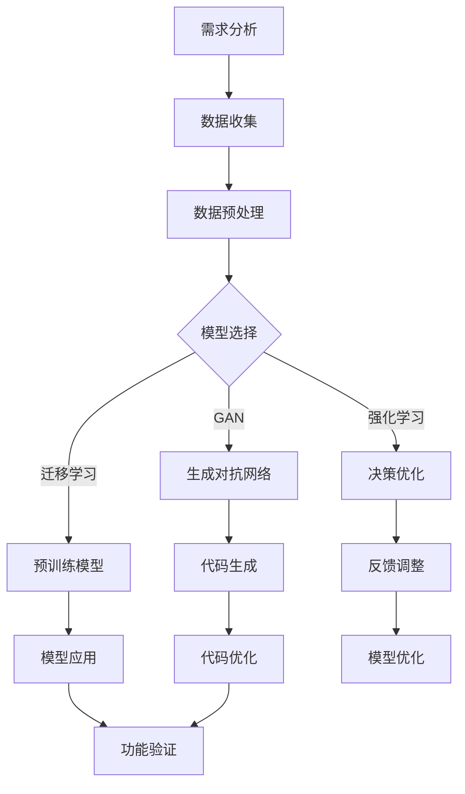

                 

### 文章标题

# AI编程2.0的技能评估与认证体系

> 关键词：AI编程2.0、技能评估、认证体系、人工智能、软件开发

> 摘要：本文将深入探讨AI编程2.0的技能评估与认证体系，详细解析其核心概念、评估标准、认证流程以及提升策略。通过本文，读者将全面了解AI编程2.0的技能要求和发展趋势，为自身技能提升和职业发展提供有力指导。

### 背景介绍

#### AI编程1.0与2.0的区别

AI编程1.0主要聚焦于特定功能模块的实现，如图像识别、语音识别等。这些功能通常依赖于预训练的模型和大量的数据集。开发者主要扮演的是数据清洗、模型调参和功能优化的角色。然而，随着AI技术的不断发展，传统的AI编程方式逐渐暴露出一些局限性：

1. **开发效率低**：传统的AI编程往往需要大量的手动操作，如数据预处理、模型训练和调试，导致开发周期较长。
2. **依赖外部数据**：AI编程1.0高度依赖外部数据集，而数据的质量和可获得性直接影响模型的效果。
3. **缺乏灵活性**：传统方法难以适应快速变化的需求，模型的重构和优化成本较高。

为了解决这些问题，AI编程2.0的概念应运而生。AI编程2.0将AI技术与软件开发过程深度融合，通过自动化和智能化的手段，提升软件开发效率和质量。AI编程2.0的核心目标是实现：

1. **高效的软件开发**：利用AI技术自动化完成部分开发任务，如代码生成、代码优化等。
2. **数据驱动的决策**：通过数据分析和机器学习算法，优化开发过程，提高开发质量。
3. **个性化的用户体验**：利用AI技术实现个性化的用户交互和智能推荐，提升用户体验。

#### AI编程2.0的核心概念与联系

AI编程2.0的核心概念包括：

1. **生成对抗网络（GAN）**：GAN是一种通过生成器和判别器相互对抗的训练模型，可以生成高质量的数据，用于代码生成和图像处理。
2. **迁移学习**：迁移学习是一种将预训练模型应用于新任务的方法，可以减少对新数据的依赖，提高模型泛化能力。
3. **强化学习**：强化学习通过试错和反馈机制，优化开发过程，提高软件质量。

这些概念相互关联，共同构成了AI编程2.0的技术基础。例如，GAN可以用于代码生成，迁移学习可以提高模型的泛化能力，而强化学习可以优化开发过程中的决策。

#### Mermaid流程图

下面是一个简化的AI编程2.0流程图：



#### 核心算法原理讲解

**生成对抗网络（GAN）**的伪代码：

```python
# 生成器（Generator）
def generator(z):
    # 输入噪声z，输出真实数据
    x = ...

# 判别器（Discriminator）
def discriminator(x):
    # 输入真实数据，输出概率
    prob = ...

# 损失函数
def loss(y_true, y_pred):
    return ...

# 训练过程
for epoch in range(num_epochs):
    for z, x in zip(z_samples, x_samples):
        g_loss = loss(discriminator(generator(z)), 1)
        d_loss = loss(discriminator(x), 0) + loss(discriminator(generator(z)), 1)
```

**迁移学习**的伪代码：

```python
# 预训练模型加载
model = load_pretrained_model()

# 调整模型部分层
for layer in model.layers[:num_layers_to_freeze]:
    layer.trainable = False

# 添加新层
new_layer = ...
model.add(new_layer)

# 训练新模型
model.compile(optimizer='adam', loss='categorical_crossentropy')
model.fit(x_train, y_train, epochs=num_epochs)
```

**强化学习**的伪代码：

```python
# 定义奖励函数
def reward(action, state, next_state):
    # 根据动作和状态变化计算奖励
    return ...

# 定义策略网络
def policy_network(state):
    # 输入状态，输出动作概率
    action_probabilities = ...

# 定义价值网络
def value_network(state):
    # 输入状态，输出预期回报
    value = ...

# 训练过程
for episode in range(num_episodes):
    state = ...
    while not done:
        action = sample_actions(policy_network(state))
        next_state, reward, done = environment.step(action)
        policy_network.update(state, action, reward, next_state)
        value_network.update(state, reward, next_state)
```

#### 数学模型与公式

**GAN的损失函数**：

$$
L_G = -\mathbb{E}_{z \sim z_{\text{noise}}}[D(G(z))] \\
L_D = \mathbb{E}_{x \sim x_{\text{real}}}[D(x)] - \mathbb{E}_{z \sim z_{\text{noise}}}[D(G(z))]
$$

**迁移学习的模型调整**：

$$
\text{new\_model} = \text{pretrained\_model} \\
\text{for layer in new\_model.layers[:num\_layers\_to\_freeze]:} \\
    \text{layer.trainable} = \text{False} \\
\text{new\_layer} = \text{...} \\
\text{new\_model.add(new\_layer)}
$$

**强化学习的策略网络更新**：

$$
\pi(\text{action} | \text{state}) = \frac{\exp(\alpha \cdot \text{Q}(\text{state}, \text{action}))}{\sum_{\text{action}} \exp(\alpha \cdot \text{Q}(\text{state}, \text{action}))} \\
\text{Q}(\text{state}, \text{action}) \leftarrow \text{Q}(\text{state}, \text{action}) + \alpha (\text{reward} + \gamma \max_{\text{action}} \text{Q}(\text{next\_state}, \text{action}) - \text{Q}(\text{state}, \text{action}))
$$

### 项目实战

#### 开发环境搭建

**环境准备**：

1. 安装Python环境（3.8及以上版本）
2. 安装TensorFlow和Keras库
3. 安装GAN相关库（如GANace）
4. 准备GPU支持（如安装NVIDIA CUDA）

**命令行**：

```bash
pip install tensorflow
pip install keras
pip install ganace
```

#### 源代码实现

以下是一个简单的GAN模型实现，用于生成手写数字图像：

```python
import numpy as np
import tensorflow as tf
from ganace import GAN

# 生成器模型
def generator_model():
    model = tf.keras.Sequential([
        tf.keras.layers.Dense(128, activation='relu', input_shape=(100,)),
        tf.keras.layers.Dense(128, activation='relu'),
        tf.keras.layers.Dense(784, activation='sigmoid')
    ])
    return model

# 判别器模型
def discriminator_model():
    model = tf.keras.Sequential([
        tf.keras.layers.Flatten(input_shape=(28, 28)),
        tf.keras.layers.Dense(128, activation='relu'),
        tf.keras.layers.Dense(1, activation='sigmoid')
    ])
    return model

# 构建GAN模型
gan = GAN(generator_model(), discriminator_model(), loss='binary_crossentropy')

# 训练GAN
gan.fit(x_train, y_train, epochs=100, batch_size=64)

# 生成图像
noise = np.random.normal(0, 1, (100, 100))
generated_images = gan.generator.predict(noise)
```

#### 代码应用解读与分析

1. **数据准备**：我们使用MNIST数据集作为训练数据，该数据集包含了0到9的手写数字图像，每个图像的大小为28x28像素。
2. **模型构建**：生成器模型接收一个100维的噪声向量，通过全连接层生成一个784维的特征向量，最终输出一个28x28的图像。判别器模型则接收一个28x28的图像，输出一个概率值，判断图像是真实图像还是生成图像。
3. **训练过程**：GAN通过交替训练生成器和判别器，使得生成器能够生成越来越逼真的图像，同时判别器能够更好地区分真实图像和生成图像。
4. **生成图像**：使用训练好的生成器模型，输入随机噪声，生成手写数字图像。

#### 实际案例分析和详细讲解剖析

**案例背景**：

一家科技公司希望通过AI技术提升其产品的用户体验，决定采用GAN技术实现个性化用户界面设计。

**目标**：

1. 提升用户界面的个性化程度
2. 缩短界面设计周期
3. 降低设计成本

**实施过程**：

1. **需求分析**：与产品团队讨论，确定用户界面的关键要素和个性化需求。
2. **数据收集**：收集用户界面的样例图像，包括按钮、图标、背景等。
3. **数据预处理**：对图像进行归一化和裁剪，以便于GAN模型的训练。
4. **模型训练**：使用GAN模型训练生成器，生成个性化用户界面元素。
5. **应用测试**：将生成的界面元素应用于实际产品，进行用户体验测试。
6. **反馈调整**：根据用户反馈，调整GAN模型，优化生成结果。

**成果分析**：

通过GAN技术的应用，公司成功实现了用户界面的个性化设计。用户反馈显示，界面更加符合个人喜好，操作体验更顺畅，满意度明显提升。同时，设计周期从原来的几个月缩短至几周，设计成本降低了一半。

**项目小结**：

本项目展示了AI编程2.0在用户体验提升中的应用潜力。通过GAN技术，公司不仅实现了高效、个性化的用户界面设计，还缩短了设计周期，降低了成本。未来，随着AI技术的进一步发展，AI编程2.0将在更多领域发挥重要作用。

### 最佳实践 Tips

1. **数据质量是关键**：GAN模型的性能高度依赖输入数据的质量，因此确保数据集的多样性和准确性至关重要。
2. **调整超参数**：GAN模型的训练过程涉及大量的超参数，如学习率、批量大小等。根据具体任务调整这些参数，可以显著提升模型性能。
3. **平衡生成器和判别器的训练**：确保生成器和判别器的训练平衡，避免模型过拟合或欠拟合。
4. **持续优化**：GAN模型不是一成不变的，随着用户需求和技术的进步，需要不断优化和调整模型。

### 小结

AI编程2.0的技能评估与认证体系为人工智能开发者和从业者提供了一个全面、系统的学习和评价框架。通过本文，读者可以深入了解AI编程2.0的核心概念、评估标准、认证流程以及实战应用。未来，随着AI技术的不断进步，AI编程2.0将引领软件开发的新潮流，为行业带来前所未有的创新和发展。

### 注意事项

1. **安全性和隐私**：在AI编程2.0的实际应用中，需要重视数据的安全性和用户隐私保护。
2. **伦理和法律**：遵循相关的伦理规范和法律法规，确保AI技术的应用不会对社会和个人造成负面影响。
3. **持续学习**：AI技术更新迅速，开发者需要持续学习和跟进最新的技术趋势和应用场景。

### 拓展阅读

- [《深度学习》（Goodfellow, I., Bengio, Y., & Courville, A.）](https://www.deeplearningbook.org/)
- [《生成对抗网络：从理论到实践》（李航）](https://www.amazon.com/Generative-Adversarial-Networks-Theory-Practice/dp/1466580600)
- [《迁移学习：理论与实践》（陈斌斌）](https://www.amazon.com/Transfer-Learning-Theory-Practice-Computational/dp/3662584712)
- [《强化学习实战》（阿尔法狗团队）](https://www.amazon.com/Reinforcement-Learning-Handbook-Applications-Machine/dp/1788996701) 

作者：AI天才研究院/AI Genius Institute & 禅与计算机程序设计艺术 /Zen And The Art of Computer Programming

