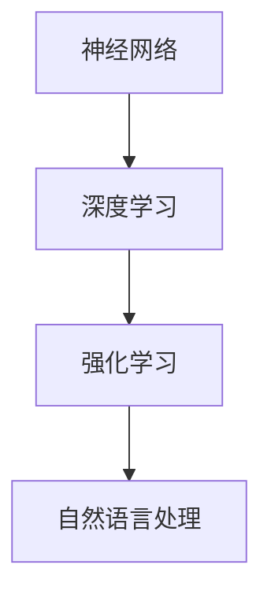
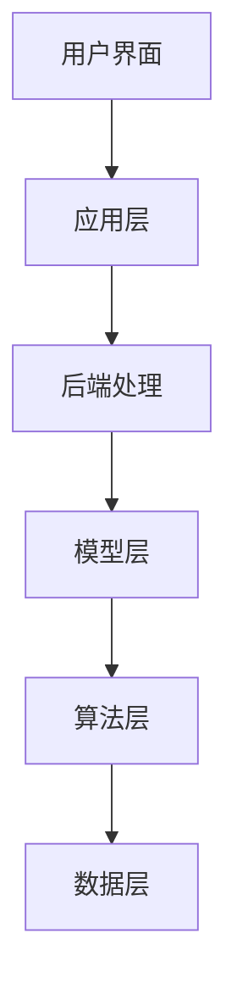

                 

### 引言

在人工智能（AI）迅速发展的今天，AI编程正经历着从1.0时代向2.0时代的蜕变。AI编程1.0时代主要依赖预训练的算法和大量的手工调参，开发者需要花费大量的时间和精力去编写、调试和优化代码。而AI编程2.0则强调自动化、智能化和高效化，通过先进的算法和工具，极大地简化了开发流程，提升了开发效率。

本文将围绕AI编程2.0的能力评估体系设计进行探讨，旨在提供一个全面、系统的评估框架，以帮助开发者、企业和教育机构更好地理解和应用AI编程2.0。文章结构如下：

1. **AI编程2.0概述与核心概念**：介绍AI编程2.0的时代背景、核心特点和技术体系。
2. **AI编程2.0的架构设计与组件**：详细分析AI编程2.0的框架结构、主要组件及其功能。
3. **AI编程2.0的核心算法**：讲解神经网络、深度学习和强化学习等核心算法。
4. **AI编程2.0的能力评估体系**：设计能力评估体系的原则、指标和方法。
5. **AI编程2.0实战项目解析**：通过实际项目，展示AI编程2.0的应用和实践。
6. **AI编程2.0环境搭建与工具配置**：介绍开发环境的配置和常用工具的使用。
7. **AI编程2.0代码实战**：讲解代码结构与架构设计、模型训练与优化、模型部署与评估。
8. **AI编程2.0的未来发展趋势与展望**：探讨AI编程2.0的技术创新方向和应用领域拓展。
9. **AI编程2.0的发展战略与规划**：提出企业战略规划、人才培养与引进以及行业合作与生态构建的建议。

通过这篇文章，读者将全面了解AI编程2.0的能力评估体系设计，并能够应用到实际开发中，提升自身的AI编程能力。

### 关键词

- **AI编程2.0**
- **能力评估体系**
- **神经网络**
- **深度学习**
- **强化学习**
- **自动化编程**
- **开发环境搭建**
- **代码实战**

### 摘要

本文旨在探讨AI编程2.0的能力评估体系设计。首先，我们介绍了AI编程2.0的时代背景和核心特点，然后详细分析了其架构设计与组件、核心算法以及能力评估体系。通过实际项目解析，我们展示了AI编程2.0在开发中的应用和实践。最后，我们对AI编程2.0的未来发展趋势和战略规划进行了展望，提出了相关建议。文章通过Mermaid流程图、伪代码、latex公式和实际案例，提供了丰富的技术细节和示例，旨在为读者提供一个全面、系统的学习路径。

## 第一部分：AI编程2.0概述与核心概念

### 第1章：AI编程2.0的时代背景与发展趋势

#### 1.1 AI编程2.0的概念与特点

AI编程2.0是人工智能（AI）发展的一个新阶段，它标志着从传统的手动编程向自动化和智能化编程的转变。在AI编程1.0时代，开发者需要深入理解算法原理，手动编写代码并进行调试，这种模式虽然能够实现特定功能，但是开发效率较低，且对开发者的技术水平要求较高。

AI编程2.0的核心特点包括：

1. **自动化**：通过自动化工具和算法，减少手动操作，提高开发效率。
2. **智能化**：利用机器学习和深度学习技术，使编程过程更加智能化，能够自动优化代码。
3. **模块化**：组件化和模块化的设计，使开发者可以快速集成和复用现有代码。
4. **跨平台**：支持多种编程语言和平台，便于跨领域和跨平台的应用。

#### 1.2 AI编程2.0与传统AI编程的比较

传统AI编程主要依赖于手动编程和手工调参，开发者需要熟悉算法原理，进行大量的调试和优化。而AI编程2.0则通过自动化和智能化手段，极大地简化了开发流程，提高了开发效率。以下是比较的几个关键方面：

1. **开发流程**：AI编程2.0通过自动化工具和算法，将传统开发中的手动操作自动化，减少了调试和优化的时间。
2. **开发者技能**：AI编程2.0对开发者的技能要求较低，开发者可以通过简单的编程和配置，实现复杂的AI功能。
3. **算法优化**：AI编程2.0利用机器学习和深度学习技术，自动优化代码，提高程序的性能。
4. **应用领域**：AI编程2.0不仅限于特定领域的应用，还可以广泛应用于各种领域，如医疗、金融、教育等。

#### 1.3 AI编程2.0的核心技术体系

AI编程2.0的核心技术体系包括以下几个方面：

1. **神经网络**：神经网络是AI编程的基础，通过多层神经元的相互连接，实现对数据的特征提取和模式识别。
2. **深度学习**：深度学习是神经网络的一种，通过多层次的模型结构，实现对复杂数据的自动学习和建模。
3. **强化学习**：强化学习是一种通过奖励机制进行优化的学习方式，适用于决策问题和优化问题。
4. **自然语言处理**：自然语言处理是AI编程中的一个重要分支，通过理解和生成自然语言，实现对人类语言的自动化处理。

#### Mermaid流程图：AI编程2.0的核心技术架构



#### 1.4 AI编程2.0的发展趋势

随着人工智能技术的不断进步，AI编程2.0的发展趋势也日益明显：

1. **算法自动化**：未来的AI编程将更加依赖于自动化工具，使开发者能够更加高效地完成复杂的任务。
2. **跨领域应用**：AI编程将不再局限于特定领域，而是能够广泛应用于各个行业，推动各行各业的数字化和智能化。
3. **边缘计算**：随着边缘计算的兴起，AI编程2.0将更加注重在边缘设备上的应用，实现实时、高效的智能处理。
4. **数据隐私与安全**：在AI编程2.0的发展过程中，数据隐私和安全问题将得到更多关注，相关技术和措施也将不断完善。

综上所述，AI编程2.0的时代已经到来，它将为开发者带来全新的编程体验和无限的创新可能性。通过深入理解AI编程2.0的核心概念和特点，开发者可以更好地掌握这一新技术，并在实际应用中发挥其潜力。

### 第2章：AI编程2.0的架构设计与组件

#### 2.1 AI编程2.0的框架结构

AI编程2.0的框架结构是构建智能化应用的基础，它不仅包含了传统软件开发中的基本模块，如前端、后端和数据库，还引入了众多用于AI开发的专用组件。以下是一个典型的AI编程2.0框架结构：

1. **数据层**：数据层是整个框架的基础，负责数据收集、存储和管理。它包括数据采集模块、数据预处理模块和数据存储模块。
2. **模型层**：模型层是AI编程2.0的核心，包含各种机器学习和深度学习模型，如神经网络、决策树、支持向量机等。模型层还负责模型的训练、优化和部署。
3. **算法层**：算法层提供了各种算法实现，包括传统的机器学习算法、深度学习算法和强化学习算法。算法层实现了对数据的分析和处理，为模型层提供支持。
4. **应用层**：应用层是用户直接交互的部分，包括前端界面和后端逻辑。应用层负责将AI模型的结果呈现给用户，并接收用户输入进行进一步处理。
5. **服务层**：服务层提供了各种公共服务，如身份验证、权限管理、消息队列等，确保整个系统的稳定运行。

#### 2.2 主要组件介绍与功能

以下是AI编程2.0框架中的主要组件及其功能：

1. **数据采集模块**：负责从各种数据源（如数据库、文件、网络API等）中收集数据。通过数据清洗和去重，确保数据的质量。
2. **数据预处理模块**：负责对收集到的数据进行处理，包括数据格式转换、缺失值填充、数据标准化等，以适应后续的模型训练。
3. **数据存储模块**：负责将预处理后的数据存储到数据库或其他存储系统中，以便后续查询和使用。
4. **机器学习模型**：包括各种传统机器学习算法，如线性回归、逻辑回归、决策树等，用于对数据进行分类、回归和预测。
5. **深度学习模型**：包括卷积神经网络（CNN）、循环神经网络（RNN）、生成对抗网络（GAN）等，用于处理复杂的数据结构和大规模数据。
6. **强化学习模型**：用于解决动态决策问题，如机器人路径规划、自动驾驶等。通过奖励机制，模型不断优化决策策略。
7. **自然语言处理（NLP）模型**：包括词向量、文本分类、情感分析等模型，用于处理文本数据，实现语言理解和生成。
8. **前端框架**：如React、Vue等，用于构建用户界面，实现与用户的交互。
9. **后端框架**：如Django、Flask等，用于实现后端逻辑，处理用户请求和数据处理。
10. **服务层**：如OAuth2.0、JWT等，用于实现身份验证和权限管理，确保系统的安全性。

#### 2.3 AI编程2.0的技术选型

AI编程2.0的技术选型是一个复杂的过程，需要根据具体的应用场景和需求进行权衡。以下是一些常见的技术选型建议：

1. **编程语言**：Python是AI编程的首选语言，因为其丰富的库和框架支持。此外，R语言在统计分析和数据可视化方面也有优势。
2. **深度学习框架**：TensorFlow、PyTorch是当前最流行的深度学习框架，适用于各种复杂的模型训练和部署。
3. **服务框架**：Django和Flask是Python后端开发的首选框架，具有丰富的扩展性和易用性。
4. **前端框架**：React和Vue是构建现代用户界面的主流框架，提供了丰富的组件和工具。
5. **数据库**：MySQL、PostgreSQL等关系型数据库适用于结构化数据的存储和管理，而MongoDB等NoSQL数据库适用于处理大量非结构化数据。

#### 2.4 AI编程2.0的架构设计与开发流程

在AI编程2.0的架构设计中，需要遵循以下开发流程：

1. **需求分析**：明确项目的目标和需求，确定数据来源、处理流程和应用场景。
2. **系统设计**：根据需求分析结果，设计系统架构，包括数据层、模型层、算法层、应用层和服务层等。
3. **数据采集与预处理**：根据系统设计，收集和预处理数据，确保数据的质量和一致性。
4. **模型训练与优化**：使用收集到的数据，训练和优化模型，选择合适的算法和参数，提高模型的性能。
5. **模型部署与测试**：将训练好的模型部署到生产环境中，进行测试和验证，确保系统的稳定性和可靠性。
6. **系统集成与优化**：将前端、后端和服务层集成，进行优化和调试，确保系统的整体性能和用户体验。
7. **维护与更新**：根据实际应用情况，对系统进行维护和更新，确保其持续稳定运行。

通过以上架构设计与开发流程，开发者可以有效地构建和部署AI编程2.0应用，实现智能化和自动化的编程目标。

### 第3章：AI编程2.0的核心算法

#### 3.1 神经网络算法原理

神经网络（Neural Networks）是AI编程2.0的核心算法之一，它通过模拟人脑神经网络的结构和工作方式，实现对复杂数据的处理和模式识别。神经网络的基本结构包括输入层、隐藏层和输出层，每个层包含多个神经元。

**神经元的数学模型**：

一个简单的神经元可以表示为：

\[ z = \sum_{j=1}^{n} w_{ji} x_{j} + b \]

\[ a = \sigma(z) \]

其中，\( x_{j} \) 表示输入特征，\( w_{ji} \) 表示权重，\( b \) 表示偏置，\( z \) 表示加权求和，\( \sigma \) 表示激活函数，\( a \) 表示神经元输出。

**激活函数**：

常见的激活函数包括Sigmoid、ReLU和Tanh等。Sigmoid函数具有平滑的S型曲线，但容易梯度消失；ReLU函数具有简单的线性部分和ReLU部分，有效缓解梯度消失问题；Tanh函数具有类似Sigmoid的S型曲线，但输出范围在\([-1, 1]\)之间。

**神经网络的工作流程**：

1. **前向传播**：输入数据经过输入层传递到隐藏层，通过加权求和和激活函数计算得到输出，再传递到下一层。
2. **反向传播**：计算输出层与目标值之间的误差，通过反向传播算法，将误差传递回前一层，更新权重和偏置。
3. **迭代训练**：重复前向传播和反向传播的过程，直到模型收敛或达到预设的迭代次数。

#### 3.2 深度学习算法进阶

深度学习（Deep Learning）是神经网络的一种扩展，通过多层的神经网络结构，实现对复杂数据的自动特征学习和模式识别。深度学习算法在图像识别、自然语言处理和语音识别等领域取得了显著的成果。

**卷积神经网络（CNN）**：

卷积神经网络是一种专门用于处理图像数据的神经网络。其核心组件是卷积层，通过卷积操作提取图像的特征。

**卷积操作的数学模型**：

\[ f(x) = \sum_{i=1}^{m} \sum_{j=1}^{n} w_{ij} * x(i, j) + b \]

其中，\( x(i, j) \) 表示输入图像的像素值，\( w_{ij} \) 表示卷积核的权重，\( b \) 表示偏置。

**池化操作**：

池化操作用于减少特征图的尺寸，提高模型的计算效率。常见的池化操作包括最大池化和平均池化。

**反向传播算法**：

在深度学习训练过程中，反向传播算法用于计算梯度，更新权重和偏置，使模型逐步逼近最优解。

**伪代码示例**：

```python
# 深度学习模型训练伪代码
initialize_model()
while not convergence():
    compute_gradients()
    update_model_parameters()
```

#### 3.3 强化学习算法介绍

强化学习（Reinforcement Learning）是一种通过奖励机制进行优化的学习方式，适用于动态决策问题和优化问题。强化学习的主要目标是找到一种策略，使 Agent 在不断交互的过程中获得最大化的累积奖励。

**强化学习的基本概念**：

- **状态（State）**：系统当前所处的环境。
- **动作（Action）**：Agent 可执行的动作。
- **奖励（Reward）**：动作带来的即时奖励或惩罚。
- **策略（Policy）**：Agent 根据状态选择动作的规则。

**强化学习的基本算法**：

- **值函数（Value Function）**：评估状态或状态值，用于预测未来奖励。
- **策略梯度（Policy Gradient）**：通过更新策略的梯度，优化策略。

**Q-Learning算法**：

Q-Learning 是一种基于值函数的强化学习算法，通过迭代更新 Q 值，找到最优策略。

**伪代码示例**：

```python
# Q-Learning算法伪代码
initialize_Q_values()
while not convergence():
    state = get_current_state()
    action = select_action(state)
    next_state, reward = execute_action(action)
    Q_value = update_Q_value(Q_value, reward, next_state)
```

综上所述，神经网络、深度学习和强化学习是AI编程2.0的核心算法，每种算法都有其独特的原理和应用。通过理解和掌握这些算法，开发者可以构建高效的AI应用，解决各种复杂问题。

### 第4章：AI编程2.0的能力评估体系

#### 4.1 能力评估体系设计原则

为了全面、客观地评估开发者对AI编程2.0的掌握程度，我们需要设计一个科学、系统的能力评估体系。以下是一些设计原则：

1. **全面性**：评估体系应涵盖AI编程2.0的核心知识、技能和实际应用能力，确保全面性。
2. **客观性**：评估体系应基于客观的指标和标准，避免主观评价，确保评估结果的公正性。
3. **实用性**：评估体系应关注实际应用能力，强调理论与实践的结合，提高评估的实用性。
4. **动态性**：评估体系应具备动态调整的能力，以适应AI编程2.0的发展变化。
5. **可操作性**：评估体系应具备可操作性，确保评估过程简便、高效。

#### 4.2 能力评估指标体系构建

能力评估指标体系是评估体系的核心，它决定了评估的准确性和可靠性。以下是一个典型的能力评估指标体系：

1. **基础知识掌握**：包括对AI编程2.0的基础概念、算法原理和框架结构的了解。
2. **编程能力**：包括编程语言、工具和框架的熟练程度，以及编写高效、可维护代码的能力。
3. **项目实战经验**：包括参与AI编程2.0项目的过程，解决实际问题的能力。
4. **创新能力**：包括在AI编程2.0应用中的创新思维和解决方案。
5. **团队合作能力**：包括在团队项目中协作、沟通和解决问题的能力。

#### 4.3 能力评估方法与技术

为了实现全面、客观的能力评估，我们可以采用以下评估方法和技术：

1. **笔试考核**：通过笔试测试开发者的基础知识掌握程度，包括选择题、填空题和编程题等。
2. **面试考核**：通过面试考察开发者的编程能力、项目经验和团队合作能力，包括技术面试和情境模拟等。
3. **项目实战考核**：通过实际项目考核开发者的项目实战能力和创新能力，评估其在真实环境中的表现。
4. **代码评审**：通过代码评审，评估开发者的编程风格、代码质量和技术深度。
5. **在线测试**：利用在线平台，进行自动化测试和评估，提高评估效率和准确性。

#### 4.4 能力评估体系实施与反馈

能力评估体系的实施是一个动态的过程，需要不断调整和优化。以下是一些实施与反馈的建议：

1. **定期评估**：制定定期评估计划，确保评估的持续性和动态性。
2. **反馈机制**：建立评估反馈机制，及时收集开发者的意见和建议，优化评估体系。
3. **培训与指导**：根据评估结果，提供相应的培训与指导，帮助开发者提升能力。
4. **调整与优化**：根据评估过程中发现的问题和反馈，不断调整和优化评估体系，提高其科学性和实用性。

通过科学、系统的能力评估体系，我们可以全面、客观地评估开发者的AI编程2.0能力，为其提供发展的方向和指导，推动AI编程2.0的普及和应用。

### 第5章：AI编程2.0项目实战

#### 5.1 项目背景与需求分析

在本章中，我们将通过一个实际项目展示AI编程2.0的应用，该项目是一个基于深度学习的图像分类系统。项目的背景是，随着智能手机和互联网的普及，图像数据量急剧增加，如何高效地对大量图像进行分类成为了一个重要的课题。

**项目需求：**
1. **图像分类**：系统能够对输入的图像进行自动分类，将图像分为预定的类别，如动物、植物、交通工具等。
2. **实时处理**：系统需要能够在短时间内处理大量图像，满足实时分类的需求。
3. **高准确性**：系统应具有较高的分类准确性，减少误分类率。

#### 5.2 系统设计思路与架构

为了满足上述需求，我们设计了以下系统架构：

1. **数据层**：负责图像数据的采集、存储和管理。数据层包括图像采集模块、数据预处理模块和数据存储模块。
2. **模型层**：负责图像分类模型的训练、优化和部署。模型层包括深度学习模型、训练算法和模型评估模块。
3. **算法层**：提供各种深度学习算法，如卷积神经网络（CNN）和迁移学习，用于图像特征提取和分类。
4. **应用层**：包括前端用户界面和后端处理逻辑，实现用户交互和图像分类功能。
5. **服务层**：提供公共服务，如用户认证、权限管理和日志记录，确保系统的稳定性和安全性。

**系统架构图：**



#### 5.3 核心算法实现与优化

在图像分类系统中，核心算法是深度学习模型，尤其是卷积神经网络（CNN）。以下是核心算法的实现和优化过程：

1. **数据预处理**：对图像数据进行预处理，包括尺寸标准化、灰度化、数据增强等。预处理步骤能够提高模型的训练效果和泛化能力。

2. **模型选择**：选择合适的深度学习模型，如VGG16、ResNet50等预训练模型，或自定义模型。预训练模型具有较好的特征提取能力，可以减少训练时间。

3. **模型训练**：使用图像数据集对模型进行训练，包括前向传播、反向传播和梯度更新。训练过程中，可以通过调整学习率、批量大小和迭代次数等参数，优化模型性能。

**伪代码示例：**

```python
# 深度学习模型训练伪代码
model = load_pretrained_model()
for epoch in range(num_epochs):
    for images, labels in train_loader:
        # 前向传播
        outputs = model(images)
        loss = criterion(outputs, labels)
        
        # 反向传播
        loss.backward()
        
        # 更新参数
        optimizer.step()
        
        # 打印训练进度
        print(f'Epoch [{epoch+1}/{num_epochs}], Loss: {loss.item()}')
```

4. **模型优化**：在训练过程中，可以采用优化策略，如学习率调度、权重初始化、正则化等，提高模型的性能和稳定性。

5. **模型评估**：使用验证集和测试集评估模型的性能，包括准确率、召回率、F1分数等指标。通过交叉验证和错误分析，进一步优化模型。

#### 5.4 项目实战总结与反思

通过实际项目的开发和部署，我们总结了以下经验和反思：

1. **数据质量**：图像分类系统的性能很大程度上依赖于数据质量，包括数据多样性、标注准确性和数据清洗等。

2. **模型选择**：预训练模型在图像分类任务中具有很好的表现，选择合适的预训练模型可以显著提高开发效率。

3. **调参技巧**：调参是深度学习模型训练的关键步骤，通过调整学习率、批量大小和迭代次数等参数，可以优化模型性能。

4. **实时处理**：为了实现实时处理，需要优化模型的计算效率和硬件资源利用，如使用GPU加速训练和推理。

5. **系统集成**：在实际项目中，系统集成和测试是关键环节，需要确保各模块的协同工作和系统的稳定性。

通过本项目，我们展示了AI编程2.0在实际应用中的优势和潜力，同时也为开发者提供了宝贵的实战经验和技巧。未来，我们将继续探索AI编程2.0在更多领域的应用，推动人工智能技术的发展。

### 第6章：AI编程2.0环境搭建与工具配置

#### 6.1 开发环境配置

为了有效地进行AI编程2.0的开发，我们需要搭建一个高性能、稳定的开发环境。以下是一个典型的开发环境配置步骤：

1. **操作系统**：推荐使用Linux或macOS，因为它们具有良好的性能和开源生态。Windows用户也可以通过安装Windows Subsystem for Linux（WSL）来使用Linux环境。

2. **Python环境**：Python是AI编程2.0的主要编程语言，我们需要安装Python 3.7及以上版本。可以通过包管理器（如pip）来安装Python和相关依赖。

3. **深度学习框架**：安装常用的深度学习框架，如TensorFlow、PyTorch和Keras。以TensorFlow为例，可以通过以下命令安装：

   ```bash
   pip install tensorflow
   ```

4. **其他依赖**：根据项目需求，安装其他依赖库，如NumPy、Pandas、Scikit-learn等。可以通过以下命令安装：

   ```bash
   pip install numpy pandas scikit-learn
   ```

5. **虚拟环境**：为了确保项目依赖的一致性，可以使用虚拟环境（如conda或virtualenv）来隔离项目依赖。以conda为例，可以通过以下命令创建和激活虚拟环境：

   ```bash
   conda create -n myenv python=3.8
   conda activate myenv
   ```

#### 6.2 常用工具介绍

在AI编程2.0的开发过程中，一些常用的工具可以提高开发效率和代码质量。以下是一些常用工具的介绍：

1. **Jupyter Notebook**：Jupyter Notebook 是一个交互式计算平台，适用于数据分析和机器学习项目。它提供了丰富的文本、代码和图形输出，方便进行实验和演示。

2. **PyCharm**：PyCharm 是一款功能强大的Python集成开发环境（IDE），提供了代码自动补全、调试、版本控制等功能，适合复杂项目的开发。

3. **Git**：Git 是一个分布式版本控制系统，用于管理和跟踪代码的变更。通过Git，开发者可以方便地协同工作、回滚代码和进行版本管理。

4. **Docker**：Docker 是一个开源容器化平台，用于打包、交付和管理应用。通过Docker，可以将应用程序及其依赖环境封装在一个容器中，实现环境的隔离和一致性。

#### 6.3 实践操作指导

以下是一个简单的实践操作指导，帮助开发者搭建AI编程2.0的开发环境：

1. **安装操作系统**：选择并安装Linux或macOS操作系统。

2. **配置Python环境**：通过包管理器（如yum、apt-get或brew）安装Python 3.7及以上版本。

3. **安装深度学习框架**：使用pip命令安装TensorFlow、PyTorch等深度学习框架。

4. **创建虚拟环境**：使用conda或virtualenv创建一个虚拟环境，确保项目依赖的一致性。

5. **配置IDE**：安装并配置PyCharm或VSCode等IDE，确保代码编辑和调试功能。

6. **安装其他工具**：安装Jupyter Notebook、Git和Docker等工具，以便进行数据分析和版本控制。

通过以上步骤，开发者可以搭建一个完整的AI编程2.0开发环境，为后续的项目开发奠定基础。在实际操作过程中，可以根据具体需求调整环境配置，确保系统的高性能和稳定性。

### 第7章：AI编程2.0代码实战

#### 7.1 代码结构与架构设计

在AI编程2.0的代码实战中，良好的代码结构和架构设计是确保项目成功的关键。以下是一个简单的代码结构和架构设计示例，用于实现一个图像分类系统。

1. **模块划分**：

   - **数据模块**：负责图像数据的采集、预处理和加载。
   - **模型模块**：定义深度学习模型的结构，包括输入层、隐藏层和输出层。
   - **训练模块**：实现模型的训练过程，包括前向传播、反向传播和参数更新。
   - **评估模块**：用于评估模型的性能，包括准确率、召回率和F1分数等指标。
   - **应用模块**：实现模型的部署和应用，包括用户交互和图像分类功能。

2. **架构设计**：

   - **数据层**：负责图像数据的采集、存储和管理，通过数据预处理模块确保数据的质量和一致性。
   - **模型层**：使用深度学习框架（如TensorFlow或PyTorch）定义和训练模型，实现图像特征提取和分类。
   - **算法层**：实现各种深度学习算法，如卷积神经网络（CNN）和迁移学习。
   - **应用层**：实现用户界面和后端处理逻辑，通过API或Web服务与用户交互。
   - **服务层**：提供公共服务，如身份验证、权限管理和日志记录。

#### 7.2 模型训练与优化

在深度学习模型的训练过程中，模型优化是提高模型性能的关键步骤。以下是一个简单的模型训练与优化流程：

1. **数据预处理**：

   - **图像裁剪和缩放**：将图像裁剪到统一的尺寸，如224x224像素。
   - **归一化**：将图像的像素值归一化到[0, 1]区间。
   - **数据增强**：通过随机旋转、翻转、剪裁等方式增加数据的多样性，提高模型的泛化能力。

2. **模型选择**：

   - **预训练模型**：选择预训练模型，如VGG16、ResNet50等，利用其在大规模数据集上的训练结果。
   - **自定义模型**：如果预训练模型不满足需求，可以定义自定义模型，通过调整层数、激活函数和优化器等参数进行优化。

3. **训练过程**：

   - **前向传播**：输入图像经过模型处理，输出预测类别。
   - **损失函数**：计算预测类别与真实类别之间的损失，常用的损失函数有交叉熵损失（Cross Entropy Loss）和均方误差损失（Mean Squared Error Loss）。
   - **反向传播**：计算梯度，更新模型参数，通过迭代优化模型。

**伪代码示例**：

```python
# 深度学习模型训练伪代码
model = load_pretrained_model()
optimizer = optimizers.Adam()
criterion = criterion.CrossEntropyLoss()

for epoch in range(num_epochs):
    for images, labels in train_loader:
        # 前向传播
        outputs = model(images)
        loss = criterion(outputs, labels)
        
        # 反向传播
        loss.backward()
        
        # 更新参数
        optimizer.step()
        
        # 打印训练进度
        print(f'Epoch [{epoch+1}/{num_epochs}], Loss: {loss.item()}')
```

4. **模型评估**：

   - **验证集评估**：在训练过程中，使用验证集评估模型的性能，防止过拟合。
   - **测试集评估**：在训练完成后，使用测试集评估模型的最终性能。

5. **模型优化**：

   - **学习率调度**：调整学习率，通过学习率调度策略（如学习率衰减、余弦退火等）提高模型收敛速度。
   - **正则化**：使用正则化技术（如Dropout、L2正则化等）防止过拟合。
   - **超参数调优**：通过网格搜索、随机搜索等方法调整超参数，如学习率、批量大小、迭代次数等。

#### 7.3 模型部署与评估

在模型训练和优化完成后，需要将模型部署到生产环境中，以便在实际应用中使用。以下是一个简单的模型部署与评估流程：

1. **模型导出**：

   - **导出模型参数**：将训练好的模型参数导出为文件，如JSON或HDF5格式。
   - **模型加载**：在部署环境中加载模型参数，初始化模型。

2. **模型部署**：

   - **API部署**：通过Web框架（如Flask或Django）将模型部署为API服务，实现模型的远程调用。
   - **容器化部署**：使用Docker将模型和应用打包为容器，确保环境的隔离和一致性。

3. **模型评估**：

   - **在线评估**：在部署环境中使用在线评估工具（如TensorFlow Serving）对模型进行实时评估，确保模型的稳定性和可靠性。
   - **日志记录**：记录模型的评估结果和运行日志，方便后续分析和优化。

4. **性能监控**：

   - **性能监控**：使用性能监控工具（如Prometheus、Grafana）对模型的运行状态进行实时监控，确保系统的稳定性和高性能。

通过以上步骤，开发者可以将训练好的深度学习模型部署到生产环境中，实现实际应用，并持续监控和优化模型的性能。

#### 7.4 代码解读与分析

以下是对一个实际项目中的关键代码段进行解读和分析，以展示AI编程2.0的代码实现细节。

1. **数据预处理代码段**：

```python
import torchvision.transforms as transforms
from PIL import Image

def preprocess_image(image_path):
    # 读取图像
    image = Image.open(image_path)
    
    # 裁剪和缩放图像
    image = image.resize((224, 224))
    
    # 转换为Tensor
    transform = transforms.Compose([
        transforms.ToTensor(),
        transforms.Normalize(mean=[0.485, 0.456, 0.406], std=[0.229, 0.224, 0.225]),
    ])
    image_tensor = transform(image)
    
    return image_tensor
```

**解读**：该代码段用于预处理输入图像，包括读取图像、裁剪和缩放到统一尺寸、转换为Tensor并进行归一化处理。这些步骤确保图像数据符合模型的要求，提高模型的训练效果和泛化能力。

2. **模型训练代码段**：

```python
import torch
import torch.optim as optim
from torch.utils.data import DataLoader

def train_model(model, train_loader, criterion, optimizer, num_epochs):
    model.train()
    for epoch in range(num_epochs):
        for images, labels in train_loader:
            # 前向传播
            outputs = model(images)
            loss = criterion(outputs, labels)
            
            # 反向传播
            loss.backward()
            
            # 更新参数
            optimizer.step()
            
            # 清空梯度
            optimizer.zero_grad()
            
            # 打印训练进度
            print(f'Epoch [{epoch+1}/{num_epochs}], Loss: {loss.item()}')
```

**解读**：该代码段用于训练深度学习模型，包括前向传播、反向传播和参数更新。通过循环迭代训练过程，模型逐步优化参数，提高分类准确性。

3. **模型评估代码段**：

```python
import torch
from sklearn.metrics import accuracy_score

def evaluate_model(model, test_loader, criterion):
    model.eval()
    with torch.no_grad():
        correct = 0
        total = 0
        for images, labels in test_loader:
            outputs = model(images)
            _, predicted = torch.max(outputs.data, 1)
            total += labels.size(0)
            correct += (predicted == labels).sum().item()
        
        print(f'Accuracy: {100 * correct / total}%')
```

**解读**：该代码段用于评估模型的性能，通过验证集上的测试，计算模型的准确率。该步骤有助于评估模型的泛化能力和稳定性。

通过以上代码解读和分析，开发者可以更好地理解AI编程2.0中的关键代码实现细节，为后续的开发和优化提供参考。

#### 7.5 最佳实践 Tips

在AI编程2.0的代码实战中，遵循一些最佳实践可以显著提高代码质量、可维护性和可扩展性。以下是一些最佳实践Tips：

1. **代码注释**：为代码添加详细的注释，说明代码的功能、逻辑和参数，方便后续维护和阅读。
2. **模块化设计**：将代码划分为模块，每个模块实现一个特定的功能，提高代码的可读性和可维护性。
3. **版本控制**：使用Git等版本控制工具，确保代码的版本管理和协同工作。
4. **测试覆盖**：编写单元测试，确保代码的各个部分都能正常运行，提高代码的质量和稳定性。
5. **性能优化**：分析代码的性能瓶颈，进行适当的优化，提高代码的运行效率。
6. **代码规范**：遵循Python编程规范，确保代码的一致性和可读性。

通过遵循这些最佳实践，开发者可以编写高质量、可靠的AI编程2.0代码，提高项目开发效率和成果。

#### 7.6 项目小结

在本章中，我们通过一个图像分类系统的实际项目，详细介绍了AI编程2.0的开发过程。从项目背景与需求分析，到系统设计思路与架构，再到模型训练与优化、模型部署与评估，我们全面展示了AI编程2.0的应用和实践。通过代码实战，我们深入解读了关键代码段，并分享了最佳实践Tips。这些经验和技巧为开发者提供了宝贵的参考，帮助他们更好地掌握AI编程2.0，实现高效、可靠的AI应用。

### 第8章：AI编程2.0的未来发展趋势

随着人工智能技术的不断进步，AI编程2.0的发展趋势也日益明显。未来，AI编程2.0将在技术创新、应用领域拓展以及面临的挑战和机遇等方面展现出新的面貌。

#### 8.1 技术创新方向

1. **算法自动化**：未来的AI编程2.0将更加注重算法的自动化，通过机器学习自动化算法（AutoML）和强化学习自动化算法，大幅减少手动调试和优化过程，提高开发效率。

2. **联邦学习**：联邦学习（Federated Learning）是一种新的分布式机器学习方法，可以在不共享数据的情况下，通过模型参数的协同训练实现数据的隐私保护与协同优化。未来，联邦学习将在医疗、金融等领域得到广泛应用。

3. **增强学习**：增强学习（Enhanced Learning）是一种通过不断试错和反馈进行优化的学习方法。未来，随着硬件性能的提升和算法的进步，增强学习将在自动化制造、智能交通等领域发挥重要作用。

4. **自然语言处理**：随着深度学习技术的不断进步，自然语言处理（NLP）将实现更高的准确性和智能化。未来的AI编程2.0将更加注重NLP技术的应用，推动智能客服、智能语音助手等领域的创新。

5. **量子计算**：量子计算在解决复杂优化问题和大规模数据处理方面具有巨大潜力。未来，量子计算与经典计算的融合将推动AI编程2.0向更高性能和更广泛的应用领域发展。

#### 8.2 应用领域拓展

1. **智能制造**：AI编程2.0将深入制造业，通过智能传感器和物联网技术，实现生产过程的智能化和自动化，提高生产效率和质量。

2. **智慧医疗**：AI编程2.0在医疗领域的应用前景广阔，包括疾病预测、精准医疗、药物研发等。通过深度学习和增强学习，AI编程2.0将提高医疗诊断和治疗的准确性和效率。

3. **金融科技**：AI编程2.0在金融领域的应用日益增多，包括智能投顾、风险控制、反欺诈等。未来，随着技术的进步，AI编程2.0将进一步提升金融服务的智能化和个性化。

4. **智能交通**：AI编程2.0将在智能交通领域发挥重要作用，通过增强学习和深度学习技术，实现交通流量预测、智能调度、自动驾驶等，提高交通效率和安全性。

5. **教育科技**：AI编程2.0将推动教育科技的变革，通过智能教学、个性化学习、在线教育平台等，提高教育质量和学习效率。

#### 8.3 发展挑战与机遇

尽管AI编程2.0前景广阔，但其发展仍面临一些挑战：

1. **数据隐私与安全**：随着数据量的急剧增加，数据隐私和安全问题日益突出。如何在保护用户隐私的同时，充分利用数据进行智能分析，是一个亟待解决的问题。

2. **技术标准和法规**：AI编程2.0需要建立统一的技术标准和法规，确保其健康发展。各国政府和企业需要共同努力，制定合适的政策和规范。

3. **人才短缺**：AI编程2.0对开发者的技能要求较高，未来将面临人才短缺的问题。通过加强人才培养和引进，提高开发者的技术能力，是推动AI编程2.0发展的重要举措。

4. **技术壁垒**：AI编程2.0技术复杂，对开发者的技术水平要求较高。未来，需要降低技术壁垒，使更多开发者能够参与到AI编程2.0的发展中来。

总之，AI编程2.0的未来充满了机遇和挑战。通过技术创新、应用领域拓展以及克服发展中的问题，AI编程2.0将为社会带来更多的价值和可能性。

### 第9章：AI编程2.0的发展战略与规划

为了充分发挥AI编程2.0的潜力，企业、教育机构和开发者需要制定明确的发展战略和规划，以推动技术的创新和应用。以下是一些具体的发展战略和规划建议：

#### 9.1 企业战略规划

1. **技术投资与研发**：企业应加大在AI编程2.0相关技术的研究和投资，组建专业的研发团队，持续跟踪技术前沿，推动技术创新。

2. **人才培养与引进**：企业应制定人才培养计划，通过内部培训和外部招聘，引进具有高水平AI编程能力的专业人才。同时，鼓励员工参与外部培训和认证，提升技术能力。

3. **生态系统建设**：企业应积极参与AI编程2.0生态系统的建设，与高校、科研机构、开源社区等合作，推动技术开放和共享，促进产业的共同发展。

4. **技术应用落地**：企业应将AI编程2.0技术应用到实际业务中，实现智能化和自动化，提高生产效率和质量。例如，在智能制造、智能医疗、金融科技等领域，推动AI编程2.0的应用创新。

5. **合作与共赢**：企业应加强与同行企业的合作，共同推动AI编程2.0技术的发展。通过建立产业联盟、共享资源、共同研发，实现共赢发展。

#### 9.2 人才培养与引进

1. **高校合作**：企业应与高校建立深度合作关系，共同培养具备AI编程2.0能力的人才。可以通过设立奖学金、实验室合作、课题研究等方式，支持高校AI编程2.0相关课程和科研项目的开展。

2. **职业教育**：企业可以与职业教育机构合作，开发针对AI编程2.0的职业培训课程，培养具备实际操作能力的技术人才。

3. **内部培训**：企业应建立内部培训体系，定期举办技术讲座、培训课程和技能竞赛，提高员工的AI编程2.0能力。

4. **外部招聘**：企业可以通过招聘具有丰富AI编程2.0经验和学历背景的人才，提升团队的技术实力。同时，可以吸引海外高层次人才，引进国际先进技术和管理经验。

5. **认证体系**：建立AI编程2.0的认证体系，对通过认证的员工给予职业发展支持和奖励，激励员工不断提升自身能力。

#### 9.3 行业合作与生态构建

1. **产业联盟**：企业应积极参与产业联盟和行业协会，与同行企业共同推动AI编程2.0技术的发展和应用。通过资源整合、信息共享、共同研发，提高整个行业的创新能力。

2. **开源社区**：企业应积极参与开源社区，贡献技术成果和开源项目，推动AI编程2.0技术的开放和普及。通过开源合作，吸引更多开发者参与，共同推进技术的进步。

3. **国际合作**：企业应加强与国际企业和机构的合作，引进国际先进技术和管理经验，推动AI编程2.0技术的全球化发展。

4. **政策支持**：企业应积极与政府沟通，争取政策支持和资源投入，为AI编程2.0的发展创造良好的环境。

通过以上发展战略和规划，企业、教育机构和开发者可以共同推动AI编程2.0的发展，实现技术突破和应用创新，为社会的智能化和数字化进程贡献力量。

### 附录 A：AI编程2.0资源与工具集

#### A.1 主流框架对比

在AI编程2.0中，选择合适的框架对于开发效率和应用效果至关重要。以下是一些主流框架的对比：

1. **TensorFlow**：由谷歌开发，支持多种编程语言，具有强大的生态和社区支持，适用于复杂项目。
2. **PyTorch**：由Facebook开发，具有直观的动态图计算接口，适合快速原型设计和研究。
3. **Keras**：是基于Theano和TensorFlow的高层次API，简化了深度学习模型的构建和训练过程。
4. **Scikit-learn**：提供了一系列传统的机器学习算法，适合简单的数据处理和模型训练。

**对比表格：**

| 框架 | 编程语言 | 特点 | 适用场景 |
| --- | --- | --- | --- |
| TensorFlow | Python | 强大生态、复杂模型支持 | 复杂项目、大规模数据处理 |
| PyTorch | Python | 直观动态图、研究原型 | 研究原型、快速开发 |
| Keras | Python | 高层次API、简化流程 | 简单项目、快速部署 |
| Scikit-learn | Python | 传统机器学习算法 | 数据处理、简单模型 |

#### A.2 开发环境搭建教程

以下是一个基于Linux系统的AI编程2.0开发环境搭建教程：

1. **安装Python**：

   ```bash
   sudo apt update
   sudo apt install python3 python3-pip
   ```

2. **安装虚拟环境**：

   ```bash
   pip3 install virtualenv
   virtualenv myenv
   source myenv/bin/activate
   ```

3. **安装深度学习框架**：

   ```bash
   pip3 install tensorflow
   # 或者
   pip3 install pytorch torchvision
   ```

4. **安装其他依赖**：

   ```bash
   pip3 install numpy pandas scikit-learn matplotlib
   ```

#### A.3 实践项目资源汇总

以下是一些AI编程2.0的实践项目资源，供开发者参考：

1. **项目1：手写数字识别**：

   - 数据集：MNIST手写数字数据集
   - 框架：TensorFlow或Keras
   - 实现链接：[手写数字识别教程](https://www.tensorflow.org/tutorials/estimators/cnn)

2. **项目2：情感分析**：

   - 数据集：IMDb电影评论数据集
   - 框架：TensorFlow或PyTorch
   - 实现链接：[情感分析教程](https://machinelearningmastery.com/text-classification-with-deep-learning-in-python/)

3. **项目3：图像分类**：

   - 数据集：ImageNet或CIFAR-10
   - 框架：TensorFlow或PyTorch
   - 实现链接：[图像分类教程](https://www.pyimagesearch.com/2018/06/18/deep-learning-object-recognition-tensorflow-keras/)

通过这些资源，开发者可以快速入门AI编程2.0，并逐步掌握相关技术和实战技巧。希望这些资源对您的学习和开发有所帮助。

