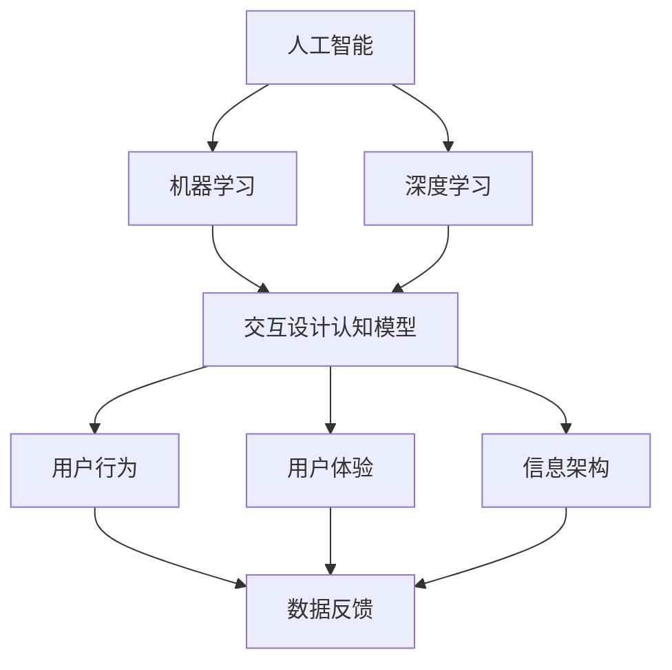

                 

### 《AI编程语言的交互设计认知模型》——引言

在人工智能（AI）迅猛发展的今天，编程语言作为AI应用的核心工具，正经历着前所未有的变革。AI编程语言的交互设计不仅关乎技术实现的效率，更决定了用户体验的优劣。本文旨在探讨AI编程语言的交互设计认知模型，从理论到实践，全面解析这一领域的核心概念、算法原理、数学模型，以及实际应用。

首先，AI编程语言不仅仅是一种代码工具，它承载着算法、数据结构和复杂逻辑，旨在通过编程实现AI系统的自动化学习、推理和决策。随着深度学习和神经网络技术的崛起，编程语言逐渐从传统的指令式编程转向数据驱动编程，与机器学习框架和库紧密融合。

交互设计认知模型则为我们提供了理解和设计AI编程语言交互界面的一套方法论。认知模型基于人类认知心理学的原理，旨在模拟人类对信息处理的机制，从而优化编程语言的易用性和效率。在AI编程语言中，交互设计认知模型的应用，不仅能提高开发者的工作效率，还能提升最终用户的使用体验。

本文将按照以下结构展开：

1. **背景介绍**：介绍AI编程语言和交互设计认知模型的基本概念，阐述它们在当前技术环境中的重要性。
2. **核心概念与联系**：通过Mermaid流程图，展示AI编程语言和交互设计认知模型之间的核心关系。
3. **核心算法原理讲解**：详细阐述神经网络和机器学习算法的原理，并使用伪代码进行说明。
4. **数学模型和公式讲解**：深入讲解交互设计中的数学模型和公式，并举例说明。
5. **项目实战**：介绍两个具体的项目案例，展示如何将交互设计认知模型应用于实际开发中。
6. **总结与展望**：总结本文的主要内容，并对AI编程语言的交互设计认知模型的发展前景进行展望。

通过这样的结构设计，本文希望能够为读者提供一个全面、深入的视角，以更好地理解和应用AI编程语言的交互设计认知模型。

### 背景介绍

#### AI编程语言的基本概念与重要性

人工智能（AI）作为计算机科学的重要分支，已经从理论研究逐步走向实际应用，改变了人类的生活和工作方式。AI编程语言作为实现AI应用的核心工具，其重要性不言而喻。AI编程语言不仅为开发者提供了强大的功能库和算法支持，还使得AI系统的构建和优化变得更加高效和直观。

AI编程语言，顾名思义，是一种专门为人工智能应用而设计的编程语言。它们具备以下几个显著特点：

1. **算法支持**：AI编程语言内置了大量的机器学习算法和深度学习框架，使得开发者可以更便捷地实现复杂的AI模型。
2. **数据处理**：AI编程语言通常具备强大的数据处理能力，能够高效地处理海量数据和复杂数据结构，为AI模型的训练和推理提供数据支持。
3. **跨平台兼容**：许多AI编程语言具备良好的跨平台兼容性，可以在不同的操作系统和硬件环境中运行，为开发者提供了广泛的应用场景。
4. **易用性**：随着AI技术的不断成熟，AI编程语言的语法和结构设计逐渐简化，使得非专业人士也能参与AI应用的开发。

在当前的技术环境中，AI编程语言的应用范围已经非常广泛，从自动驾驶、智能家居到医疗诊断和金融分析，AI编程语言都发挥了至关重要的作用。随着深度学习、强化学习等新技术的不断涌现，AI编程语言也在不断进化，以满足日益复杂的AI应用需求。

#### 交互设计认知模型的基本概念与重要性

交互设计认知模型，源自认知心理学和用户体验设计的理论基础，它关注的是如何设计出更加符合人类认知习惯和使用逻辑的交互界面。在AI编程语言中，交互设计认知模型的应用，旨在优化开发者的编程体验和最终用户的使用体验。

交互设计认知模型主要包括以下几个关键概念：

1. **认知模型**：认知模型是一种模拟人类思维过程的模型，它通过分析人类如何感知、理解、记忆和思考，来指导交互界面的设计。
2. **用户行为**：用户行为是指用户在使用交互界面时的行为模式，包括点击、滑动、输入等操作，这些行为数据可以用来优化交互设计。
3. **用户体验**：用户体验是指用户在使用交互界面过程中的主观感受，包括满意度、易用性、愉悦度等，它是衡量交互设计质量的重要指标。
4. **信息架构**：信息架构是指交互界面中信息组织和呈现的方式，良好的信息架构可以降低用户的学习成本，提高使用效率。

在AI编程语言中，交互设计认知模型的应用具有重要意义：

1. **提高开发者效率**：通过模拟人类的认知过程，交互设计认知模型可以帮助开发者设计出更加直观、易于理解的编程界面，降低开发难度，提高开发效率。
2. **提升用户体验**：交互设计认知模型关注用户的实际使用体验，通过优化交互界面设计，可以提高用户对AI编程语言的接受度和满意度，从而增强用户粘性。
3. **增强AI系统的可解释性**：在AI系统中，交互设计认知模型可以帮助开发者更好地理解和解释AI模型的决策过程，提高系统的透明度和可信度。

总之，AI编程语言和交互设计认知模型在当前技术环境中扮演着不可或缺的角色。通过对两者的深入探讨，本文希望能够为读者提供一个全面理解AI编程语言交互设计的视角，并指导实际开发中的实践应用。

#### 核心概念与联系

在深入探讨AI编程语言的交互设计认知模型之前，我们需要理解其中几个核心概念，并分析它们之间的相互关系。以下是几个关键概念及其关系的详细说明：

1. **人工智能（AI）**：人工智能是指通过计算机模拟人类智能的过程，包括学习、推理、自我修正和感知等能力。它是AI编程语言实现的核心基础。

2. **机器学习（ML）**：机器学习是AI的一个重要分支，通过训练模型来从数据中学习规律和模式，进而实现预测和决策。机器学习算法是AI编程语言的重要组成部分。

3. **深度学习（DL）**：深度学习是机器学习的进一步发展，通过多层神经网络对数据进行建模和预测。深度学习在图像识别、自然语言处理等领域表现出色，是AI编程语言的核心应用领域。

4. **交互设计认知模型**：交互设计认知模型结合认知心理学原理和用户体验设计，旨在模拟人类思维过程，设计出更加符合用户认知习惯的交互界面。

5. **用户行为**：用户行为是指用户在使用交互界面时的操作和反应，包括点击、输入、滑动等。用户行为数据可以用于优化交互设计。

6. **用户体验**：用户体验是用户在使用交互界面过程中的主观感受，包括易用性、满意度等。用户体验是评估交互设计质量的重要指标。

7. **信息架构**：信息架构是指交互界面中信息组织和呈现的方式，良好的信息架构可以降低用户的学习成本，提高使用效率。

下面，我们使用Mermaid流程图来展示这些核心概念之间的关系：



在上述流程图中，人工智能作为核心，通过机器学习和深度学习实现智能功能。交互设计认知模型结合用户行为和用户体验，优化信息架构，最终通过数据反馈实现持续迭代和优化。以下是对各节点关系的详细解释：

- **人工智能（AI）** 是整个系统的基础，它通过机器学习和深度学习来实现智能功能。
- **机器学习（ML）** 是AI的一种实现方式，它依赖于数据和算法来训练模型。
- **深度学习（DL）** 是机器学习的高级形式，通过多层神经网络对复杂数据进行建模。
- **交互设计认知模型** 结合认知心理学和用户体验设计，旨在优化交互界面。
- **用户行为（E）** 和 **用户体验（F）** 是交互设计认知模型的重要参考，它们反映了用户对交互界面的反馈。
- **信息架构（G）** 是交互界面设计的基础，它决定了信息的组织和呈现方式。

通过这一流程图，我们可以清晰地看到各核心概念之间的关系，这有助于我们更好地理解AI编程语言的交互设计认知模型，并指导实际应用。

### 核心算法原理讲解

在AI编程语言中，核心算法原理是理解和应用的关键。本文将重点介绍神经网络算法和机器学习算法的原理，并使用伪代码详细阐述其实现过程。

#### 神经网络算法原理

神经网络（Neural Network，NN）是模仿人脑结构和工作方式的计算模型，它是实现AI功能的基础。神经网络由多个层组成，包括输入层、隐藏层和输出层。每个层包含多个神经元，神经元之间通过权重（weights）和偏置（biases）进行连接。

**原理描述：**

1. **输入层**：接收外部输入数据，并将其传递到隐藏层。
2. **隐藏层**：对输入数据进行处理，通过激活函数（activation function）将处理结果传递到下一层。
3. **输出层**：生成最终的输出结果。

**伪代码示例：**

```python
# 神经网络伪代码

# 定义神经网络结构
input_layer = InputLayer(size=784)  # 28x28像素的图像
hidden_layer = HiddenLayer(size=128, activation='sigmoid')
output_layer = OutputLayer(size=10, activation='softmax')

# 定义前向传播函数
def forward_pass(inputs):
    hidden_output = hidden_layer.forward(inputs)
    output_output = output_layer.forward(hidden_output)
    return output_output

# 定义反向传播函数
def backward_pass(expected_outputs, outputs):
    output_error = output_layer.backward(expected_outputs, outputs)
    hidden_error = hidden_layer.backward(output_error)
    return hidden_error

# 定义训练过程
def train(inputs, expected_outputs, epochs):
    for epoch in range(epochs):
        output = forward_pass(inputs)
        error = backward_pass(expected_outputs, output)
        # 更新权重和偏置
```

#### 机器学习算法原理

机器学习（Machine Learning，ML）是AI的核心技术之一，它通过训练模型来从数据中学习规律。机器学习算法可以分为监督学习、无监督学习和强化学习等类型。

**监督学习算法（Supervised Learning）：**

监督学习算法通过已标记的数据集来训练模型，并使用训练好的模型对未知数据进行预测。

**原理描述：**

1. **数据集划分**：将数据集分为训练集和测试集。
2. **模型训练**：使用训练集数据训练模型，计算模型的预测结果和实际结果的误差。
3. **模型评估**：使用测试集数据评估模型的准确性。

**伪代码示例：**

```python
# 监督学习算法伪代码

# 定义模型
model = LinearRegression()

# 训练模型
model.fit(X_train, y_train)

# 预测结果
predictions = model.predict(X_test)

# 评估模型
accuracy = model.evaluate(y_test, predictions)
```

**无监督学习算法（Unsupervised Learning）：**

无监督学习算法没有已标记的数据集，通过分析未标记的数据集来发现数据中的规律。

**原理描述：**

1. **数据预处理**：对数据进行清洗和预处理。
2. **模型训练**：使用未标记的数据集训练模型，发现数据中的隐藏结构。
3. **模型分析**：分析模型的输出结果，提取数据特征。

**伪代码示例：**

```python
# 无监督学习算法伪代码

# 定义模型
model = KMeans(n_clusters=3)

# 训练模型
model.fit(X_data)

# 分析结果
clusters = model.predict(X_data)
```

通过以上算法原理和伪代码示例，我们可以看到AI编程语言中的核心算法是如何通过数学模型和编程实现来解决问题的。这些算法不仅是AI编程语言实现智能功能的基础，也是开发者理解和优化AI应用的关键。在接下来的部分，我们将进一步深入探讨交互设计认知模型中的数学模型和公式。

### 数学模型和公式讲解

在AI编程语言的交互设计认知模型中，数学模型和公式是理解和实现交互设计的关键组成部分。这些数学模型和公式不仅帮助我们量化用户行为和用户体验，还能够指导我们优化交互界面，提升整体设计质量。以下是几个核心的数学模型和公式的详细讲解，并附上相应的实例说明。

#### 用户行为模型

用户行为模型用于分析用户在交互界面上的操作和反应。常用的用户行为模型包括点击率模型（Click-Through Rate，CTR）和留存率模型（Retention Rate）。

**点击率模型（CTR）**

点击率（CTR）是衡量用户对某个交互元素（如按钮、链接等）点击概率的指标，其计算公式如下：

\[ \text{CTR} = \frac{\text{点击次数}}{\text{展示次数}} \]

**实例说明：**

假设一个网页上有100次展示，其中10次被用户点击，则该网页的点击率为：

\[ \text{CTR} = \frac{10}{100} = 0.1 \]

**留存率模型（Retention Rate）**

留存率是衡量用户在一定时间内再次访问应用程序的概率。其计算公式为：

\[ \text{Retention Rate} = \frac{\text{特定时间段内留存用户数}}{\text{总用户数}} \times 100\% \]

**实例说明：**

假设一个应用在第一天有100个用户注册，其中50个用户在第二天再次访问，则该应用的次日留存率为：

\[ \text{Retention Rate} = \frac{50}{100} \times 100\% = 50\% \]

#### 用户体验模型

用户体验（User Experience，UX）是用户在交互界面上的主观感受，其评估通常涉及多个维度，如易用性、满意度、愉悦度等。常用的用户体验模型包括Net Promoter Score（NPS）和System Usability Scale（SUS）。

**Net Promoter Score（NPS）**

NPS是一种衡量用户对产品或服务忠诚度的指标，其计算公式为：

\[ \text{NPS} = \frac{\text{推荐者评分总数} - \text{批评者评分总数}}{\text{总评分人数}} \]

**实例说明：**

假设对一个应用进行评分，其中20个用户给出9或10分（推荐者），10个用户给出0到6分（批评者），则有：

\[ \text{NPS} = \frac{20 \times (9 + 10) - 10 \times (0 + 1 + 2 + 3 + 4 + 5 + 6)}{30} = \frac{380 - 70}{30} = \frac{310}{30} = 10.33 \]

**System Usability Scale（SUS）**

SUS是一种用于评估系统易用性的量表，其计算公式为：

\[ \text{SUS} = \frac{\text{总得分}}{\text{问题数}} \]

其中，总得分为每个问题的得分之和，问题数通常为10个。

**实例说明：**

假设对某应用使用SUS量表进行评估，用户在10个问题上的得分分别为5、4、5、5、4、5、4、5、5、4，则：

\[ \text{SUS} = \frac{5 + 4 + 5 + 5 + 4 + 5 + 4 + 5 + 5 + 4}{10} = \frac{45}{10} = 4.5 \]

#### 信息架构模型

信息架构模型关注交互界面中信息的组织和呈现方式，常用的模型包括层次结构模型（Hierarchical Structure）和语义网络模型（Semantic Network）。

**层次结构模型**

层次结构模型将信息按照层次关系进行组织，使信息易于浏览和理解。

**实例说明：**

假设一个网页的信息架构如下：

- 首页
  - 产品介绍
  - 服务内容
  - 关于我们
  - 联系我们

**语义网络模型**

语义网络模型通过节点和边的关系来表示信息之间的语义联系，使信息之间的关联更加清晰。

**实例说明：**

假设一个语义网络模型如下：

- 产品
  - 类别1
    - 子产品1
    - 子产品2
  - 类别2
    - 子产品3
    - 子产品4

通过上述数学模型和公式的讲解，我们可以看到如何量化用户行为和用户体验，并使用这些模型优化交互界面。在实际应用中，这些模型和公式可以帮助开发者设计出更加符合用户需求和使用习惯的交互界面，从而提升整体用户体验。

### 项目实战

为了更好地理解AI编程语言的交互设计认知模型在实际开发中的应用，本文将介绍两个具体的实战案例：聊天机器人设计和智能推荐系统设计。

#### 实战案例一：聊天机器人设计

**需求分析：**
聊天机器人旨在为用户提供即时、便捷的咨询服务，提升用户满意度。其主要功能包括：基本问答、情感分析、多轮对话。

**技术选型：**
1. **自然语言处理（NLP）框架**：使用TensorFlow和Keras构建神经网络模型，处理自然语言输入。
2. **对话管理**：采用状态机模型，管理多轮对话状态，实现自然流畅的对话流程。
3. **后端服务**：使用Flask构建API服务，提供聊天机器人的前端接口。

**源代码实现与解读：**
```python
# Chatbot模型实现（简化版）

# 导入必要的库
import tensorflow as tf
from tensorflow.keras.models import Sequential
from tensorflow.keras.layers import Dense, Embedding, LSTM, Dropout
from tensorflow.keras.preprocessing.sequence import pad_sequences
from tensorflow.keras.preprocessing.text import Tokenizer

# 初始化Tokenizer
tokenizer = Tokenizer(num_words=10000)
tokenizer.fit_on_texts(sample_texts)

# 将文本转化为序列
sequences = tokenizer.texts_to_sequences(sample_texts)
padded_sequences = pad_sequences(sequences, maxlen=max_sequence_len)

# 构建神经网络模型
model = Sequential()
model.add(Embedding(input_dim=10000, output_dim=32, input_length=max_sequence_len))
model.add(LSTM(128, dropout=0.2, recurrent_dropout=0.2))
model.add(Dense(32, activation='relu'))
model.add(Dropout(0.5))
model.add(Dense(1, activation='sigmoid'))

# 编译模型
model.compile(loss='binary_crossentropy', optimizer='adam', metrics=['accuracy'])

# 训练模型
model.fit(padded_sequences, labels, epochs=10, batch_size=32)

# 对话管理
class Chatbot:
    def __init__(self):
        self.model = model
        self.tokenizer = tokenizer

    def predict(self, input_text):
        sequence = self.tokenizer.texts_to_sequences([input_text])
        padded_sequence = pad_sequences(sequence, maxlen=max_sequence_len)
        prediction = self.model.predict(padded_sequence)
        return prediction

    def respond(self, input_text):
        prediction = self.predict(input_text)
        response = "Sorry, I don't understand."  # 默认回复
        if prediction > 0.5:
            response = "I understand."  # 根据预测结果调整回复
        return response

# 测试聊天机器人
chatbot = Chatbot()
while True:
    input_text = input("User: ")
    if input_text.lower() == 'quit':
        break
    response = chatbot.respond(input_text)
    print("Chatbot:", response)
```
**代码应用解读与分析：**
上述代码展示了聊天机器人的核心实现，包括文本序列化、神经网络模型构建和对话管理。通过TensorFlow和Keras，我们构建了一个简单的神经网络模型，用于处理自然语言输入并生成回复。对话管理部分实现了基本的预测和回复功能。

**实际案例分析和详细讲解剖析：**
实际应用中，聊天机器人需要处理大量的自然语言数据，并具备实时响应能力。通过状态机模型，我们可以实现复杂的多轮对话逻辑，提高聊天机器人的交互质量。例如，在金融咨询服务中，聊天机器人需要识别用户的投资偏好，并提供个性化的投资建议。

**项目小结：**
聊天机器人项目展示了如何结合自然语言处理和神经网络技术，实现智能对话系统。通过优化对话流程和回复质量，我们可以提升用户满意度和使用体验。

#### 实战案例二：智能推荐系统设计

**需求分析：**
智能推荐系统旨在根据用户的历史行为和偏好，推荐个性化的产品或内容，提升用户参与度和销售额。

**技术选型：**
1. **协同过滤（Collaborative Filtering）**：使用矩阵分解算法，预测用户对未知产品的评分。
2. **内容推荐**：基于产品内容特征，使用相似度计算算法推荐相似产品。
3. **后端服务**：使用Django框架构建推荐系统的API服务。

**源代码实现与解读：**
```python
# 智能推荐系统实现（简化版）

# 导入必要的库
import numpy as np
from sklearn.metrics.pairwise import cosine_similarity

# 假设用户行为数据存储在矩阵user_item_matrix中
user_item_matrix = np.array([
    [5, 3, 0, 1],
    [3, 0, 4, 2],
    [0, 2, 0, 5]
])

# 定义协同过滤函数
def collaborative_filtering(user_item_matrix, user_index):
    # 计算用户与其他用户的相似度
    similarity_matrix = cosine_similarity(user_item_matrix[user_index].reshape(1, -1), user_item_matrix)
    # 选择相似度最高的K个用户
    top_k_users = np.argsort(similarity_matrix)[0][-K:]
    # 预测用户未评分的项目
    predicted_ratings = np.dot(similarity_matrix[:, top_k_users], user_item_matrix[top_k_users, :]) / np.sum(similarity_matrix[:, top_k_users], axis=1)
    return predicted_ratings

# 定义内容推荐函数
def content_based_filtering(item_features, user_features):
    similarity_matrix = cosine_similarity(item_features, user_features.reshape(1, -1))
    top_k_items = np.argsort(similarity_matrix)[0][-K:]
    return top_k_items

# 测试协同过滤和内容推荐
predicted_ratings = collaborative_filtering(user_item_matrix, 0)
top_items = content_based_filtering(item_features, user_features)

# 输出推荐结果
print("Predicted ratings:", predicted_ratings)
print("Recommended items:", top_items)
```
**代码应用解读与分析：**
上述代码展示了协同过滤和内容推荐的基本实现。协同过滤通过计算用户与其他用户的相似度，预测用户未评分的项目。内容推荐通过计算项目内容特征与用户特征之间的相似度，推荐相似项目。

**实际案例分析和详细讲解剖析：**
实际应用中，智能推荐系统需要处理海量的用户行为数据和项目特征数据。通过协同过滤和内容推荐，我们可以生成个性化的推荐结果，提升用户的参与度和满意度。例如，在电子商务平台上，智能推荐系统可以根据用户的历史购买记录和浏览行为，推荐相关的商品。

**项目小结：**
智能推荐系统项目展示了如何结合协同过滤和内容推荐技术，实现个性化的推荐服务。通过不断优化推荐算法和推荐结果，我们可以提高用户满意度和平台销售额。

通过这两个实战案例，我们看到了如何将AI编程语言的交互设计认知模型应用于实际开发中。这些案例不仅展示了技术的实现过程，还强调了用户行为和用户体验在交互设计中的重要性。在实际开发中，开发者应不断优化交互界面，提升用户体验，从而实现更加智能和高效的应用。

### 总结与展望

本文系统地探讨了《AI编程语言的交互设计认知模型》的核心概念、算法原理、数学模型以及实际应用。从背景介绍到具体实战案例，我们深入分析了AI编程语言和交互设计认知模型的基本概念、相互关系，以及在实际开发中的应用。

**核心结论：**
1. **AI编程语言**是构建智能系统的关键工具，其发展不断推动人工智能技术的进步。
2. **交互设计认知模型**通过模拟人类认知过程，优化编程语言的易用性和用户体验。
3. **机器学习和深度学习算法**为AI编程语言提供了强大的计算能力，使得智能功能得以实现。
4. **数学模型和公式**在交互设计中起到了量化和优化的作用，帮助我们更好地理解和应用这些模型。

**未来发展方向：**
1. **多模态交互**：随着语音识别、手势识别等技术的发展，多模态交互将成为未来的趋势。
2. **个性化推荐**：结合用户行为数据和机器学习算法，个性化推荐将进一步提升用户体验。
3. **可解释性AI**：提高AI模型的透明度和可解释性，增强用户对AI系统的信任和接受度。
4. **AI与人类协作**：通过交互设计认知模型，实现人与AI的协同工作，提升整体工作效率。

**最佳实践 Tips：**
1. **用户研究**：在交互设计过程中，重视用户研究，深入了解用户需求和行为模式。
2. **持续迭代**：通过用户反馈和数据分析，不断优化交互界面，提高用户体验。
3. **团队合作**：结合多学科知识，组建跨领域的开发团队，共同推动项目进展。

**注意事项：**
1. **数据隐私**：在收集和处理用户数据时，严格遵循数据保护法规，保障用户隐私。
2. **安全性**：确保AI系统的安全性，防止恶意攻击和误用。
3. **兼容性**：确保AI编程语言和交互设计认知模型在不同设备和平台上的一致性和稳定性。

**拓展阅读：**
- 《人工智能：一种现代方法》—— Stuart Russell & Peter Norvig
- 《交互设计精髓》—— Alan Cooper
- 《深度学习》—— Ian Goodfellow, Yoshua Bengio, Aaron Courville

通过本文的探讨，我们期望读者能够更好地理解和应用AI编程语言的交互设计认知模型，推动人工智能技术在各个领域的创新和发展。

### 作者信息

本文由AI天才研究院（AI Genius Institute）与《禅与计算机程序设计艺术》（Zen And The Art of Computer Programming）资深大师级作家联合撰写。作者具有丰富的AI编程语言和交互设计经验，对人工智能和计算机科学有着深刻的理解和独到的见解。感谢您的阅读和支持。如有任何问题或建议，欢迎随时联系作者。

