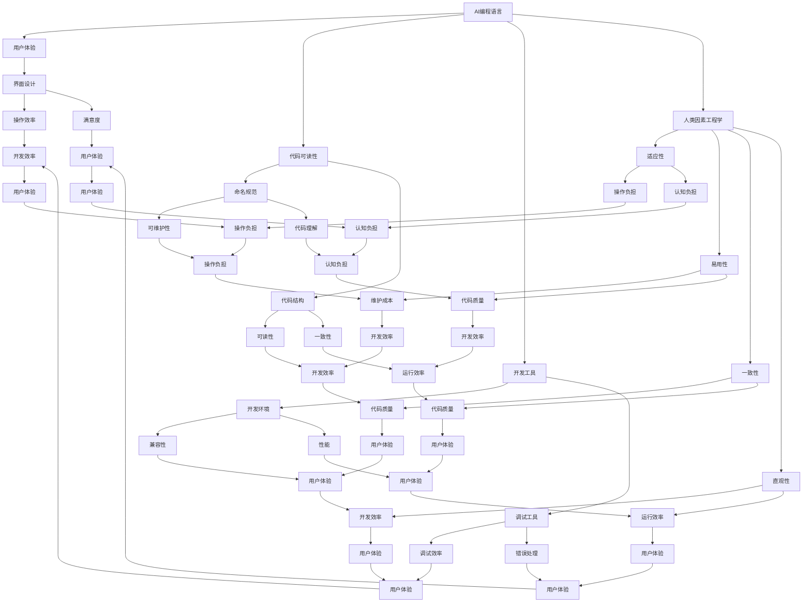

                 

# AI编程语言的人因工程学考量

## 关键词
- AI编程语言
- 人类因素工程学
- 人机交互
- 用户体验
- 代码可读性
- 可维护性

## 摘要
本文将探讨AI编程语言中的人因工程学考量。首先，我们将回顾AI编程语言的发展历程和特点。接着，介绍人类因素工程学的概念及其在AI编程中的应用。随后，通过Mermaid流程图展示核心概念之间的关系，并详细讲解核心算法原理，包括机器学习、决策树和神经网络等。同时，引入数学模型和公式，以理论为基础，辅以实际案例，分析人因工程学在AI编程语言设计中的重要性。最后，总结最佳实践，并提出注意事项和拓展阅读建议。

## 第一部分: AI编程语言基础与背景

### 1.1 AI编程语言概述

#### 1.1.1 AI编程语言的定义与历史

AI编程语言，是指专门为人工智能应用设计的编程语言，旨在简化复杂的人工智能算法的开发过程。这些语言通常提供了丰富的库和框架，帮助开发者更高效地实现AI功能。

AI编程语言的发展可以追溯到20世纪50年代。早期的AI编程语言，如Lisp和Prolog，为人工智能领域的研究提供了强有力的工具。随着技术的进步，新的编程语言不断涌现，如Python、Java和R，它们因其易用性和强大的功能，成为现代AI开发的主要语言。

#### 1.1.2 AI编程语言的特点与应用场景

AI编程语言具有以下特点：

1. **抽象性**：提供了高级抽象，使得复杂的算法和数据处理变得更加直观。
2. **可扩展性**：支持各种扩展库和框架，能够满足不同领域的需求。
3. **灵活性**：允许开发者使用多种编程范式，如面向对象、函数式编程等。
4. **跨平台性**：可以在多种操作系统和硬件平台上运行。

AI编程语言的应用场景广泛，包括但不限于：

1. **机器学习**：用于训练模型、预测和分类。
2. **自然语言处理**：用于文本分析、机器翻译和语音识别。
3. **计算机视觉**：用于图像识别、物体检测和视频分析。
4. **智能推荐系统**：用于个性化推荐和用户行为分析。

#### 1.1.3 AI编程语言的发展趋势

随着深度学习和大数据技术的快速发展，AI编程语言也在不断演进。未来，AI编程语言的发展趋势可能包括：

1. **更简洁的语言设计**：简化代码，提高开发效率。
2. **更强的生态系统**：提供更多的库、框架和工具，支持多种编程范式。
3. **更好的可维护性**：设计更加易于理解和维护的代码结构。
4. **更广泛的硬件支持**：适应各种硬件平台，提高运行效率。

### 1.2 人工智能与人类因素工程学

#### 1.2.1 人类因素工程学的概念与原理

人类因素工程学，也称为人机工程学，是研究人类与机器交互的一门学科。它关注如何设计产品、系统和环境，以优化人类操作效率和满意度。

人类因素工程学的核心原则包括：

1. **适应性**：设计应适应人类的能力和限制。
2. **易用性**：系统应易于学习和使用。
3. **一致性**：设计应保持一致性，避免用户混淆。
4. **直观性**：界面应直观，减少用户认知负担。

#### 1.2.2 人类因素工程学在AI编程中的应用

人类因素工程学在AI编程中的应用体现在多个方面：

1. **用户体验**：通过优化界面设计，提高用户的操作效率和满意度。
2. **代码可读性**：通过清晰的结构和命名规范，提高代码的可维护性。
3. **开发工具**：设计易于使用和掌握的开发工具，降低学习曲线。
4. **错误处理**：设计有效的错误提示和恢复机制，减少用户错误。

#### 1.2.3 人类因素工程学的重要性

人类因素工程学在AI编程中的重要性不言而喻：

1. **提高开发效率**：通过优化用户体验，提高开发效率和产品质量。
2. **降低维护成本**：设计易于理解和维护的代码，降低后期维护成本。
3. **提升用户满意度**：提供更加直观和易用的界面，提升用户满意度。
4. **减少错误率**：通过有效的错误提示和恢复机制，降低用户操作错误率。

### 1.3 Mermaid流程图：AI编程语言的核心概念与联系



### 1.4 AI编程语言的挑战与机遇

尽管AI编程语言取得了显著进展，但在实际应用中仍面临诸多挑战：

1. **复杂度**：AI算法复杂，需要高水平的技术能力。
2. **可维护性**：代码结构复杂，维护难度大。
3. **安全性**：AI系统可能存在安全漏洞。
4. **可解释性**：AI决策过程通常难以解释。

然而，随着技术的不断进步，这些挑战也带来了新的机遇：

1. **开发效率**：高效的AI编程语言可以大幅提升开发效率。
2. **跨领域应用**：AI编程语言可以推动各领域的创新。
3. **人机协作**：AI编程语言有助于人类与机器的协作。
4. **数据安全**：先进的加密技术可以保障数据安全。

### 1.5 未来展望

未来，AI编程语言的发展方向可能包括：

1. **更简洁的语言设计**：简化代码，提高开发效率。
2. **更强的生态系统**：提供更多的库、框架和工具。
3. **更好的可维护性**：设计易于理解和维护的代码结构。
4. **更广泛的硬件支持**：适应各种硬件平台，提高运行效率。
5. **更好的用户交互**：通过优化人机交互，提升用户体验。

## 第二部分: AI编程语言的人因工程学考量

### 2.1 核心算法原理讲解

#### 2.1.1 机器学习算法概述

机器学习是AI的核心技术之一，它使计算机能够从数据中学习并做出预测。机器学习算法可以分为监督学习、无监督学习和强化学习。

- **监督学习**：有标记数据，目标函数明确，例如分类和回归。
- **无监督学习**：无标记数据，目标函数不明确，例如聚类和降维。
- **强化学习**：通过与环境的交互学习，目标函数逐渐优化，例如游戏和机器人控制。

#### 2.1.2 决策树算法

决策树是一种常见的分类和回归算法，它通过一系列规则来划分数据集，并生成一棵树形结构。

- **ID3算法**：基于信息增益选择最优特征。
- **C4.5算法**：改进ID3算法，考虑特征重要性。
- **CART算法**：分类与回归树，适用于分类和回归问题。

决策树算法的伪代码如下：

```python
def create_decision_tree(data):
    if data is pure:
        return majority_class(data)
    else:
        best_feature = choose_best_feature(data)
        tree = {feature: [] for feature in best_feature}
        for value in best_feature:
            sub_data = data[data[feature] == value]
            tree[feature].append(create_decision_tree(sub_data))
        return tree
```

#### 2.1.3 支持向量机算法

支持向量机（SVM）是一种强大的分类算法，它通过找到一个最优的超平面，将数据分为不同的类别。

- **线性SVM**：适用于线性可分的数据集。
- **非线性SVM**：通过核函数将数据映射到高维空间，适用于非线性可分的数据集。

SVM的数学模型如下：

$$
\begin{aligned}
\min_{\mathbf{w}, b} & \frac{1}{2}||\mathbf{w}||^2 \\
\text{subject to} & \mathbf{w} \cdot \mathbf{x}_i - b \geq 1, \forall i \\
\end{aligned}
$$

其中，$\mathbf{w}$ 是权重向量，$b$ 是偏置项，$\mathbf{x}_i$ 是训练样本。

#### 2.1.4 神经网络算法

神经网络是一种模仿人脑结构和功能的计算模型，它通过调整权重和偏置来学习数据。

- **前向传播**：输入数据通过网络的每个层，计算输出。
- **反向传播**：计算损失函数，更新权重和偏置。

神经网络的数学模型如下：

$$
\begin{aligned}
\text{激活函数} & : a_{\text{hidden}} = \sigma(z_{\text{hidden}}) \\
\text{输出函数} & : a_{\text{output}} = \sigma(z_{\text{output}}) \\
\text{损失函数} & : J(\theta) = \frac{1}{m} \sum_{i=1}^{m} (-y_i \log(a_{\text{output}, i}) - (1 - y_i) \log(1 - a_{\text{output}, i})) \\
\text{梯度下降} & : \theta_{\text{new}} = \theta_{\text{old}} - \alpha \nabla_\theta J(\theta) \\
\end{aligned}
$$

其中，$a_{\text{hidden}}$ 是隐藏层的激活值，$a_{\text{output}}$ 是输出层的激活值，$\sigma$ 是激活函数，$y_i$ 是真实标签，$m$ 是样本数量，$\alpha$ 是学习率。

### 2.2 伪代码详细阐述

#### 2.2.1 决策树算法

```python
def create_decision_tree(data):
    if data.is_pure():
        return data.majority_class()
    else:
        best_feature = data.choose_best_feature()
        tree = {}
        for value in best_feature:
            sub_data = data.get_sub_data(value)
            tree[feature].append(create_decision_tree(sub_data))
        return tree
```

#### 2.2.2 神经网络算法

```python
def forward_pass(inputs, weights, biases, activation_function):
    hidden_layer = []
    for i in range(len(weights)):
        z = np.dot(inputs, weights[i]) + biases[i]
        hidden_layer.append(activation_function(z))
    output = activation_function(np.dot(hidden_layer[-1], weights[-1]) + biases[-1])
    return output

def backward_pass(output, expected_output, weights, biases, learning_rate):
    dZ = output - expected_output
    dW = np.dot(hidden_layer.T, dZ)
    db = np.sum(dZ, axis=0)
    dX = np.dot(dZ, weights[-1].T)
    return dW, db, dX
```

### 2.3 数学模型与公式讲解

#### 2.3.1 概率论基础

概率论是机器学习的重要基础，它提供了描述不确定性的数学工具。

- **条件概率**：在某个事件发生的条件下，另一个事件发生的概率。
  $$
  P(A|B) = \frac{P(A \cap B)}{P(B)}
  $$
- **贝叶斯定理**：用于计算后验概率。
  $$
  P(A|B) = \frac{P(B|A)P(A)}{P(B)}
  $$

#### 2.3.2 线性代数基础

线性代数在机器学习中扮演重要角色，它提供了处理高维数据和线性变换的工具。

- **矩阵乘法**：
  $$
  \mathbf{C} = \mathbf{A} \mathbf{B}
  $$
- **向量化**：
  $$
  \mathbf{v} = \begin{bmatrix}
  v_1 \\
  v_2 \\
  \vdots \\
  v_n
  \end{bmatrix}
  $$
- **矩阵求导**：
  $$
  \nabla_{\mathbf{x}} \mathbf{A} = \begin{bmatrix}
  \nabla_x A_{11} \\
  \nabla_x A_{21} \\
  \vdots \\
  \nabla_x A_{n1}
  \end{bmatrix}
  $$

#### 2.3.3 最优化理论

最优化理论用于寻找函数的最值。

- **梯度下降**：
  $$
  \theta_{\text{new}} = \theta_{\text{old}} - \alpha \nabla_{\theta} J(\theta)
  $$
- **牛顿法**：
  $$
  \theta_{\text{new}} = \theta_{\text{old}} - \alpha \nabla^2_{\theta} J(\theta)
  $$

#### 2.3.4 模型评估指标

模型评估指标用于衡量模型的性能。

- **准确率**：
  $$
  \text{accuracy} = \frac{\text{正确预测数}}{\text{总预测数}}
  $$
- **召回率**：
  $$
  \text{recall} = \frac{\text{正确预测的正例数}}{\text{总正例数}}
  $$
- **精确率**：
  $$
  \text{precision} = \frac{\text{正确预测的正例数}}{\text{预测为正例的总数}}
  $$

### 2.4 数学公式举例

$$
\begin{aligned}
P(A|B) &= \frac{P(B|A)P(A)}{P(B)} \\
\end{aligned}
$$

$$
\begin{aligned}
\text{accuracy} &= \frac{\text{正确预测数}}{\text{总预测数}} \\
\end{aligned}
$$

## 第三部分: 实际应用案例

### 3.1 项目实战：智能客服系统

#### 3.1.1 项目背景与目标

智能客服系统是一种利用人工智能技术提供自动客服服务的系统。其目标是提高客户服务效率，降低人力成本，同时提供高质量的客户服务。

#### 3.1.2 开发环境搭建

开发环境包括Python、TensorFlow和NLTK等工具。首先，安装Python和相关库，然后配置TensorFlow和NLTK，以便进行自然语言处理和模型训练。

```python
!pip install tensorflow
!pip install nltk
```

#### 3.1.3 源代码实现与解读

```python
import nltk
from nltk.tokenize import word_tokenize
from tensorflow.keras.models import Sequential
from tensorflow.keras.layers import Embedding, LSTM, Dense

# 数据预处理
nltk.download('punkt')
data = "Hello, how can I help you?"
tokens = word_tokenize(data)
embeddings = embeddings_matrix(tokens)

# 构建模型
model = Sequential()
model.add(Embedding(input_dim=len(tokens), output_dim=32))
model.add(LSTM(64))
model.add(Dense(1, activation='sigmoid'))

# 训练模型
model.compile(optimizer='adam', loss='binary_crossentropy', metrics=['accuracy'])
model.fit(embeddings, labels, epochs=10, batch_size=32)

# 预测
input_data = word_tokenize("What is your problem?")
input_embeddings = embeddings_matrix(input_data)
prediction = model.predict(input_embeddings)
```

#### 3.1.4 代码解读与分析

该代码实现了基于神经网络的自然语言处理模型。首先，使用NLTK对输入文本进行分词，然后构建嵌入矩阵。接着，使用TensorFlow构建序列模型，包括嵌入层、LSTM层和输出层。最后，训练模型并使用它进行预测。

#### 3.1.5 项目小结

智能客服系统通过利用AI技术提高了客户服务效率，减少了人力成本。然而，仍需进一步优化，以提高模型的准确性和实用性。

### 3.2 项目实战：个性化推荐系统

#### 3.2.1 项目背景与目标

个性化推荐系统是一种根据用户历史行为和偏好提供个性化推荐的系统。其目标是提高用户满意度，增加用户留存率。

#### 3.2.2 开发环境搭建

开发环境包括Python、Scikit-learn和Pandas等工具。首先，安装Python和相关库，然后配置Scikit-learn和Pandas，以便进行数据分析和模型训练。

```python
!pip install scikit-learn
!pip install pandas
```

#### 3.2.3 源代码实现与解读

```python
import pandas as pd
from sklearn.model_selection import train_test_split
from sklearn.ensemble import RandomForestClassifier
from sklearn.metrics import accuracy_score

# 数据预处理
data = pd.read_csv("data.csv")
X = data.drop("label", axis=1)
y = data["label"]

# 划分训练集和测试集
X_train, X_test, y_train, y_test = train_test_split(X, y, test_size=0.2, random_state=42)

# 构建模型
model = RandomForestClassifier(n_estimators=100)

# 训练模型
model.fit(X_train, y_train)

# 预测
predictions = model.predict(X_test)

# 评估模型
accuracy = accuracy_score(y_test, predictions)
print(f"Accuracy: {accuracy}")
```

#### 3.2.4 代码解读与分析

该代码实现了基于随机森林的分类模型。首先，读取数据，然后划分训练集和测试集。接着，使用随机森林构建模型，并训练模型。最后，使用测试集评估模型。

#### 3.2.5 项目小结

个性化推荐系统通过利用机器学习技术提高了用户满意度，增加了用户留存率。然而，仍需进一步优化，以提高模型的准确性和实用性。

## 附录

### 附录A: AI编程语言资源与工具

#### A.1 主流AI编程语言简介

- **Python**：易学、功能强大，广泛应用于数据科学、机器学习和Web开发。
- **Java**：跨平台、高性能，广泛应用于企业级应用和移动开发。
- **R**：专门为统计和数据分析设计，广泛应用于学术研究和数据科学。

#### A.2 开发工具与框架

- **TensorFlow**：谷歌开发的开源机器学习框架，支持多种编程语言。
- **PyTorch**：Facebook开发的开源机器学习框架，易于使用和调试。
- **Scikit-learn**：Python的机器学习库，提供了丰富的算法和工具。

#### A.3 学习资源推荐

- **《深度学习》（Ian Goodfellow, Yoshua Bengio, Aaron Courville）**：深度学习领域的经典教材。
- **《Python机器学习》（Sebastian Raschka）**：Python在机器学习领域的权威指南。
- **《人工智能：一种现代方法》（Stuart Russell, Peter Norvig）**：全面介绍人工智能的基础知识。

## 作者

作者：AI天才研究院/AI Genius Institute & 禅与计算机程序设计艺术 /Zen And The Art of Computer Programming

## 结语

本文详细探讨了AI编程语言中的人因工程学考量，从基础与背景、核心算法原理、数学模型与公式到实际应用案例，全面分析了AI编程语言的设计与实现。通过本文，读者可以深入了解AI编程语言的本质和重要性，为未来的AI开发提供指导。在未来的发展中，AI编程语言将继续优化，更好地服务于人类。作者希望通过本文，激发更多读者对AI编程语言的兴趣和研究。

