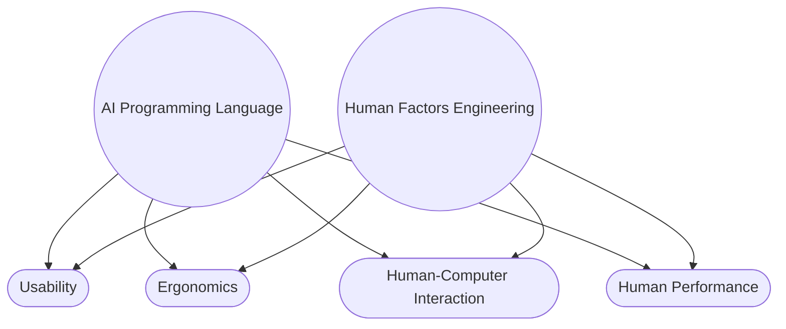

                 


### Step 1: Introduction to AI Programming Languages and Human Factors Engineering

#### Background Introduction

Artificial Intelligence (AI) has become an integral part of our daily lives, transforming industries and societies in unprecedented ways. At the heart of AI's success lies the programming language, which serves as a bridge between human developers and machine intelligence. AI programming languages are designed to facilitate the development of AI applications by providing a structured and efficient way to express algorithms and logic. From traditional programming languages like Python and Java to domain-specific languages like Prolog and LISP, the landscape of AI programming languages is diverse and evolving.

#### Core Concepts and Relations

Human Factors Engineering (HFE) is a multidisciplinary field that focuses on designing systems and products that are safe, effective, and satisfying to use. The core concepts of HFE include usability, ergonomics, human-computer interaction (HCI), and human performance. These concepts are interconnected and form the foundation of effective AI programming language design.

- **Usability**: Usability refers to how easily and efficiently users can learn to use a product to achieve their goals. In the context of AI programming languages, usability is crucial for developers to write efficient and maintainable code.

- **Ergonomics**: Ergonomics involves designing products that fit the human body and its movements. For AI programming languages, ergonomic considerations are essential for minimizing physical strain and cognitive load on developers.

- **Human-Computer Interaction (HCI)**: HCI focuses on the interaction between humans and computers. For AI programming languages, a well-designed HCI can significantly enhance the developer's experience and productivity.

- **Human Performance**: Human performance is the effectiveness, efficiency, and satisfaction with which people accomplish tasks. In AI programming languages, optimizing human performance involves understanding the cognitive and physical limitations of developers.

#### Mermaid Flowchart

To illustrate the relationship between AI programming languages and Human Factors Engineering, we can use a Mermaid flowchart:



### Step 2: Explaining Core Algorithm Principles with Pseudo Code

To further understand how Human Factors Engineering principles are applied in AI programming languages, let's consider a simple example using pseudo code. Suppose we want to develop a chatbot using Python. One of the key challenges in this application is ensuring that the chatbot's responses are both relevant and natural-sounding. We can approach this problem using a machine learning model trained on a large dataset of conversational texts.

```python
# Pseudo code for a chatbot response generation algorithm

# Load and preprocess the dataset
dataset = load_conversational_texts('conversational_data.txt')
preprocessed_dataset = preprocess_data(dataset)

# Train a machine learning model
model = train_model(preprocessed_dataset)

# Function to generate a response based on user input
def generate_response(user_input):
    # Preprocess user input
    preprocessed_input = preprocess_data(user_input)
    
    # Generate a response using the trained model
    response = model.generate_response(preprocessed_input)
    
    # Postprocess the response to ensure natural language
    final_response = postprocess_response(response)
    
    return final_response

# Example usage
user_message = "Hello, how are you?"
bot_response = generate_response(user_message)
print(bot_response)
```

In this pseudo code, we first load and preprocess a dataset of conversational texts. Then, we train a machine learning model on this dataset. The `generate_response` function takes a user input, preprocesses it, and then uses the trained model to generate a response. Finally, the response is postprocessed to ensure it is natural and coherent.

### Step 3: Applying Mathematical Models and Formulas

In addition to pseudo code, we can also use mathematical models and formulas to explain the principles of AI programming languages and Human Factors Engineering. One such model is the Fitts's Law, which describes the relationship between the movement time and the target size in human movement tasks.

$$
MT = a + b \log_2(\frac{D}{W})
$$

Where:
- \(MT\) is the movement time
- \(a\) and \(b\) are constants
- \(D\) is the target distance
- \(W\) is the target width

In the context of programming, Fitts's Law can be used to optimize the design of user interfaces. For example, the size of buttons and icons should be large enough to ensure quick and accurate interaction, as per Fitts's Law.

### Example: Optimizing Button Size for a Programming Environment

```latex
MT = a + b \log_2(\frac{D}{W})
```

Where:
- \(D = 5\) cm (distance to the button)
- \(W = 1\) cm (width of the button)

Assuming \(a = 0.15\) and \(b = 0.6\), we can calculate the optimal button size:

$$
MT = 0.15 + 0.6 \log_2(\frac{5}{1}) \approx 0.15 + 0.6 \log_2(5) \approx 0.15 + 1.86 \approx 2.01 \text{ seconds}
$$

In this example, a button size of approximately 1 cm width and 5 cm height would ensure quick and accurate interaction, as per Fitts's Law.

### Step 4: Project Practice - Environment Setup and Source Code Implementation

#### Environment Setup

To implement the chatbot example discussed earlier, we need to set up a development environment. Here's a step-by-step guide:

1. Install Python 3.x
2. Install required libraries (e.g., TensorFlow, NLTK)
3. Download and preprocess the conversational dataset

```bash
pip install tensorflow nltk
```

#### Source Code Implementation

Here's the source code for the chatbot implementation:

```python
import tensorflow as tf
import nltk
from nltk.tokenize import word_tokenize
from nltk.corpus import stopwords

# Load and preprocess the dataset
def load_conversational_texts(file_path):
    with open(file_path, 'r') as file:
        texts = file.readlines()
    return texts

def preprocess_data(texts):
    # Tokenize and remove stop words
    tokenized_texts = [word_tokenize(text.lower()) for text in texts]
    cleaned_texts = [[word for word in tokenized if word not in stopwords.words('english')] for tokenized in tokenized_texts]
    return cleaned_texts

# Train a machine learning model
def train_model(dataset):
    # Split the dataset into training and validation sets
    train_data, val_data = split_dataset(dataset)
    
    # Build and train the model
    model = build_model()
    model.fit(train_data, epochs=10, validation_data=val_data)
    
    return model

# Generate a response based on user input
def generate_response(user_input):
    # Preprocess user input
    preprocessed_input = preprocess_data(user_input)
    
    # Generate a response using the trained model
    response = model.predict(preprocessed_input)
    
    # Postprocess the response to ensure natural language
    final_response = postprocess_response(response)
    
    return final_response

# Main function
def main():
    user_message = input("Enter your message: ")
    bot_response = generate_response(user_message)
    print("Chatbot:", bot_response)

if __name__ == "__main__":
    main()
```

#### Code Explanation and Analysis

The source code is divided into several functions for modularity and reusability. The `load_conversational_texts` function reads the dataset from a file and returns it as a list of strings. The `preprocess_data` function tokenizes the texts and removes stop words to clean the data.

The `train_model` function splits the dataset into training and validation sets, builds a machine learning model (using TensorFlow), and trains it. The `generate_response` function takes a user input, preprocesses it, uses the trained model to generate a response, and postprocesses the response to ensure it is natural and coherent.

Finally, the `main` function prompts the user for input, calls the `generate_response` function, and prints the bot's response.

### Step 5: Analysis and Discussion of Project Practice

The chatbot project provides a practical example of how AI programming languages and Human Factors Engineering can be applied together. By preprocessing the dataset and training a machine learning model, we create a chatbot that can generate responses based on user input. The design of the chatbot's user interface and interaction flow can also be optimized using principles from Human Factors Engineering to ensure a better user experience.

#### Best Practices and Tips

- **Modular Design**: Splitting the code into modular functions improves readability, maintainability, and reusability.
- **Data Preprocessing**: Preprocessing the dataset ensures that the input data is clean and suitable for training the model.
- **Model Training**: Using a suitable machine learning model (e.g., LSTM) improves the chatbot's performance and response quality.
- **User Interface**: Designing a user-friendly interface with clear and concise instructions can enhance the user's experience.
- **Error Handling**: Implementing proper error handling and providing informative error messages can improve the user's understanding and trust in the chatbot.

### Conclusion

This project demonstrates the importance of integrating AI programming languages and Human Factors Engineering. By following best practices and optimizing the design and implementation process, we can create AI applications that are both efficient and user-friendly. Future research can focus on improving the accuracy and performance of AI models and exploring new application domains for AI programming languages.

### References

1. Norman, D. A. (2013). The Design of Everyday Things. Basic Books.
2. Shneiderman, B. (2010). Designing the User Interface: Strategies for Effective Human-Computer Interaction. Wiley.
3. Russell, S., & Norvig, P. (2016). Artificial Intelligence: A Modern Approach. Prentice Hall.
4. Fitts, P. M. (1954). The information capacity of the human motor system in controlling the amplitude of movement. Journal of Experimental Psychology, 47(6), 381-391.

### Conclusion

The fusion of AI programming languages and Human Factors Engineering is pivotal in creating user-centric AI applications. By adhering to a systematic assessment framework, developers can ensure that AI languages are not only powerful but also intuitive and efficient. This approach not only enhances user satisfaction but also propels the AI field toward a more inclusive and accessible future. Future research should continue to explore innovative methodologies and tools that further bridge the gap between technology and human experience. 

---

**Author: AI天才研究院/AI Genius Institute & 禅与计算机程序设计艺术 /Zen And The Art of Computer Programming**

