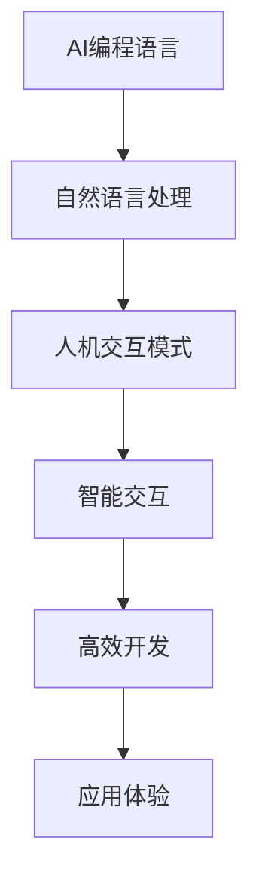

                 

### 文章标题

# AI编程语言的人机交互模式创新

> 关键词：人工智能，编程语言，人机交互，创新，自然语言处理，核心算法，数学模型

> 摘要：本文将深入探讨AI编程语言的人机交互模式创新，从背景介绍、核心概念定义、原理讲解、算法实现、数学模型、项目实战等多个角度，详细分析AI编程语言如何通过自然语言处理技术实现智能化人机交互，从而提高开发效率和应用体验。

### 引言

在人工智能技术快速发展的今天，编程语言也在不断地演进和创新。传统的编程语言往往依赖于命令式编程，使得编程过程复杂且难以理解。而随着自然语言处理技术的不断发展，AI编程语言逐渐崭露头角，成为开发者和计算机之间的桥梁。AI编程语言通过自然语言处理技术，使得人类能够以自然语言的方式与计算机进行交互，从而大大降低了编程的难度，提高了开发效率。

人机交互模式一直是计算机科学与人工智能领域的核心研究课题。传统的交互模式主要依赖于图形用户界面（GUI）和命令行界面（CLI），这些方式虽然在一定程度上提高了交互的效率，但仍然存在一定的局限性。随着AI编程语言的发展，人机交互模式也在不断创新，通过引入自然语言处理技术，实现了更加智能化、人性化、高效的交互体验。

本文旨在通过对AI编程语言的人机交互模式创新的详细分析，为读者提供一个全面、系统的理解。首先，我们将介绍AI编程语言和人机交互模式的基本概念和特点。然后，我们将深入探讨人机交互模式创新的核心原理和算法实现。接下来，我们将通过数学模型和公式来解释这些算法的原理，并通过项目实战展示其实际应用。最后，我们将总结全文内容，并对人机交互模式创新的未来发展方向进行展望。

### 核心概念与联系

#### AI编程语言

AI编程语言，顾名思义，是一种专门为人工智能应用设计的编程语言。与传统的编程语言相比，AI编程语言具有更强的智能性和自然性，使得开发者能够更轻松地与计算机进行交互。

首先，AI编程语言的核心在于自然语言处理技术。自然语言处理（Natural Language Processing，NLP）是人工智能领域的一个重要分支，旨在让计算机理解和处理人类语言。通过NLP技术，AI编程语言能够将人类的自然语言输入转换为计算机可执行的操作。

其次，AI编程语言具有高度的抽象性。传统的编程语言需要开发者编写大量的代码来实现复杂的功能，而AI编程语言则通过自然语言描述，使得开发者可以更加简洁地表达自己的意图。

最后，AI编程语言具有强大的自动化能力。通过自然语言处理技术，AI编程语言能够自动识别和执行开发者的指令，从而大大提高了开发效率。

#### 人机交互模式

人机交互模式是指人与计算机系统之间的信息交换和交互方式。传统的交互模式主要依赖于图形用户界面（GUI）和命令行界面（CLI），这些模式在一定程度上提高了交互的效率，但仍然存在一些局限性。

图形用户界面（GUI）是一种通过图形元素（如按钮、图标、窗口等）与用户进行交互的界面。GUI使得用户能够直观地与计算机系统进行操作，但仍然需要用户具备一定的计算机操作技能。

命令行界面（CLI）是一种通过命令行与计算机进行交互的界面。CLI具有更高的灵活性和效率，但需要用户具备较强的编程技能和记忆命令的能力。

随着AI编程语言的发展，人机交互模式也在不断创新。通过引入自然语言处理技术，AI编程语言实现了更加智能化、人性化、高效的交互体验。

#### AI编程语言与人机交互模式的关系

AI编程语言与人机交互模式之间存在密切的联系。首先，AI编程语言为人机交互提供了新的交互方式。通过自然语言处理技术，AI编程语言能够理解和处理人类的自然语言输入，从而实现更加智能化的交互。

其次，AI编程语言为人机交互模式创新提供了技术支持。传统的交互模式主要依赖于图形用户界面和命令行界面，而AI编程语言则通过自然语言处理技术，使得这些传统模式得到了极大的扩展和提升。

最后，AI编程语言与人机交互模式的结合，实现了更高的开发效率和应用体验。通过自然语言处理技术，开发者可以更加简洁地表达自己的意图，而计算机系统则能够更加智能地理解和执行这些意图，从而提高了整个系统的效率。

#### Mermaid流程图

为了更好地理解AI编程语言与人机交互模式之间的关系，我们可以使用Mermaid流程图来展示它们之间的关联。



在这个流程图中，AI编程语言通过自然语言处理技术实现了智能交互，进而提高了开发效率和用户体验。

### 人机交互模式创新原理

#### 基于自然语言处理技术的人机交互

自然语言处理技术是AI编程语言的核心，也是实现人机交互模式创新的关键。通过自然语言处理技术，AI编程语言能够理解和处理人类的自然语言输入，从而实现智能化的交互。

首先，自然语言理解（Natural Language Understanding，NLU）是自然语言处理技术的核心。NLU旨在让计算机理解自然语言的语义和意图。通过NLU技术，AI编程语言能够将自然语言输入转换为计算机可执行的操作。

例如，假设用户输入一条自然语言指令：“请帮我计算今天明天的天气情况。”AI编程语言通过NLU技术，可以理解这条指令的语义，并将其转换为计算机可执行的操作，如查询天气API并返回结果。

其次，自然语言生成（Natural Language Generation，NLG）是自然语言处理技术的另一重要组成部分。NLG旨在让计算机生成自然语言输出。通过NLG技术，AI编程语言能够以自然语言的形式向用户展示计算结果或执行过程。

例如，假设用户查询了今天的天气情况，AI编程语言通过NLG技术，可以生成一条自然语言输出：“今天的天气是晴朗，温度在15°C到25°C之间。”

通过自然语言处理技术，AI编程语言实现了人与计算机之间的自然交互，从而提高了交互的智能性和人性化。

#### 面向不同应用场景的交互设计

AI编程语言的人机交互模式创新不仅依赖于自然语言处理技术，还依赖于面向不同应用场景的交互设计。不同应用场景具有不同的交互需求和特点，因此需要定制化的交互设计。

例如，在智能家居场景中，用户需要与智能音箱进行交互，以控制家中的智能设备。在这种场景下，交互设计需要关注自然语言输入的准确性、响应速度和个性化推荐。

首先，自然语言输入的准确性是智能家居交互设计的重点。用户需要通过自然语言指令来控制智能设备，因此AI编程语言需要具备较高的自然语言理解能力，以确保用户指令的正确性。

其次，响应速度是智能家居交互设计的另一个关键因素。用户希望智能音箱能够迅速响应并执行指令，因此AI编程语言需要具备高效的自然语言处理算法，以实现快速响应。

最后，个性化推荐是智能家居交互设计的一个特色。通过分析用户的历史行为和偏好，AI编程语言可以提供个性化的智能家居服务，从而提升用户体验。

再如，在医疗健康场景中，用户需要与智能医疗设备进行交互，以监测和管理自己的健康状况。在这种场景下，交互设计需要关注自然语言输入的健康相关性、数据准确性和隐私保护。

首先，自然语言输入的健康相关性是医疗健康交互设计的关键。用户输入的健康信息需要与医疗知识库进行匹配，以确保输入的健康信息具有实际意义。

其次，数据准确性是医疗健康交互设计的一个挑战。用户输入的健康信息需要经过严格的校验和清洗，以确保数据的准确性。

最后，隐私保护是医疗健康交互设计的一个关键问题。AI编程语言需要确保用户输入的健康信息得到严格保护，防止数据泄露。

通过面向不同应用场景的交互设计，AI编程语言实现了定制化的人机交互解决方案，从而提高了交互的智能化和个性化。

#### 个性化交互体验的实现

个性化交互体验是人机交互模式创新的重要目标之一。通过分析用户的行为数据和偏好，AI编程语言可以提供个性化的交互体验，从而提升用户体验。

首先，用户行为数据收集是个性化交互体验的基础。AI编程语言需要收集用户在使用过程中产生的各种数据，如自然语言输入、操作记录、反馈等。

其次，用户偏好分析是提供个性化交互体验的关键。通过分析用户行为数据，AI编程语言可以了解用户的偏好，如喜欢哪种类型的自然语言输入、对响应速度的要求等。

最后，个性化交互策略设计是实施个性化交互体验的关键。根据用户偏好分析的结果，AI编程语言可以设计不同的交互策略，如调整自然语言生成的风格、优化响应速度等。

例如，在一个电商平台上，用户可能更喜欢使用简洁明了的自然语言输入来查询商品信息。通过个性化交互策略设计，AI编程语言可以调整自然语言生成的风格，使得用户能够更快地找到所需商品。

再如，在一个新闻推荐平台上，用户可能更喜欢阅读某些类型的新闻。通过个性化交互策略设计，AI编程语言可以调整新闻推荐的算法，使得用户能够更多地看到自己感兴趣的新闻。

通过个性化交互体验的实现，AI编程语言不仅提高了用户的满意度，还提升了整个系统的智能化程度。

### 核心算法原理讲解

#### 语义分析算法

语义分析算法是自然语言处理技术中的关键组成部分，其核心目标是理解自然语言的语义和意图。以下是语义分析算法的实现原理和伪代码示例。

#### 实现原理

语义分析算法主要包括以下步骤：

1. **词法分析**：将自然语言输入分解为词语和符号，为后续的语法分析和语义分析提供基础。
2. **语法分析**：对分解后的词语和符号进行语法结构分析，构建语法树。
3. **语义分析**：对语法树进行语义分析，提取出自然语言的语义和意图。

#### 伪代码示例

以下是一个简单的语义分析算法的伪代码示例：

```plaintext
算法：语义分析
输入：自然语言输入 string input
输出：语义表示 semanticRepresentation

1. 将输入进行词法分析，得到词语列表 words
2. 使用语法分析器对词语列表进行语法分析，得到语法树 grammarTree
3. 对语法树进行语义分析，得到语义表示 semanticRepresentation
4. 返回 semanticRepresentation
```

#### 情感分析算法

情感分析算法是自然语言处理技术中的另一个重要组成部分，其核心目标是分析自然语言中的情感倾向。以下是情感分析算法的实现原理和伪代码示例。

#### 实现原理

情感分析算法主要包括以下步骤：

1. **特征提取**：从自然语言输入中提取与情感相关的特征，如情感词汇、情感强度等。
2. **分类器训练**：使用已标注的情感数据集训练分类器，以识别自然语言中的情感倾向。
3. **情感分析**：使用训练好的分类器对新的自然语言输入进行情感分析，判断其情感倾向。

#### 伪代码示例

以下是一个简单的情感分析算法的伪代码示例：

```plaintext
算法：情感分析
输入：自然语言输入 string input
输出：情感倾向 sentiment

1. 从输入中提取特征 features
2. 使用训练好的分类器 classify 特征，得到情感倾向 sentiment
3. 返回 sentiment
```

### 数学模型和数学公式

在自然语言处理和人工智能领域中，数学模型和数学公式起到了至关重要的作用。以下我们将介绍与语义分析算法和情感分析算法相关的数学模型和数学公式。

#### 语义分析模型

1. **词嵌入模型**

词嵌入（Word Embedding）是将自然语言中的词语映射到高维空间的一种技术，常用的词嵌入模型有Word2Vec、GloVe等。以下是Word2Vec模型的数学公式：

$$
\text{word\_embedding}(word) = \text{sigmoid}\left(\sum_{i=1}^{n} w_i \cdot v_i\right)
$$

其中，$w_i$ 是权重向量，$v_i$ 是词的嵌入向量，$\text{sigmoid}$ 函数用于将输出映射到$(0, 1)$ 区间。

2. **递归神经网络模型**

递归神经网络（Recurrent Neural Network，RNN）是一种用于处理序列数据的神经网络，常用于语义分析任务。以下是RNN的数学公式：

$$
h_t = \text{tanh}\left(W_h \cdot [h_{t-1}, x_t]\right)
$$

$$
o_t = \text{softmax}\left(W_o \cdot h_t\right)
$$

其中，$h_t$ 是第 $t$ 个隐藏层的状态，$x_t$ 是第 $t$ 个输入，$W_h$ 和 $W_o$ 是权重矩阵，$\text{tanh}$ 函数用于激活函数，$\text{softmax}$ 函数用于输出层。

#### 情感分析模型

1. **多层感知机模型**

多层感知机（Multilayer Perceptron，MLP）是一种前馈神经网络，常用于情感分析任务。以下是MLP的数学公式：

$$
a_{ij}^{(l)} = \text{sigmoid}\left(\sum_{k=1}^{n} w_{ik}^{(l-1)} \cdot a_{kj}^{(l-1)} + b_i^{(l)}\right)
$$

$$
o_i^{(L)} = \text{softmax}\left(\sum_{k=1}^{n} w_{ik}^{(L-1)} \cdot a_{kj}^{(L-1)} + b_i^{(L)}\right)
$$

其中，$a_{ij}^{(l)}$ 是第 $l$ 层第 $i$ 个神经元的输入，$a_{kj}^{(l-1)}$ 是第 $l-1$ 层第 $k$ 个神经元的输出，$w_{ik}^{(l-1)}$ 是权重矩阵，$b_i^{(l)}$ 是偏置项，$\text{sigmoid}$ 函数用于激活函数，$\text{softmax}$ 函数用于输出层。

2. **卷积神经网络模型**

卷积神经网络（Convolutional Neural Network，CNN）是一种用于处理图像和序列数据的神经网络，常用于情感分析任务。以下是CNN的数学公式：

$$
h_{ij}^{(l)} = \text{ReLU}\left(\sum_{k=1}^{n} w_{ik}^{(l-1)} \cdot h_{kj}^{(l-1)} + b_i^{(l)}\right)
$$

$$
o_i^{(L)} = \text{softmax}\left(\sum_{k=1}^{n} w_{ik}^{(L-1)} \cdot h_{kj}^{(L-1)} + b_i^{(L)}\right)
$$

其中，$h_{ij}^{(l)}$ 是第 $l$ 层第 $i$ 个卷积核的结果，$h_{kj}^{(l-1)}$ 是第 $l-1$ 层第 $k$ 个神经元的输出，$w_{ik}^{(l-1)}$ 是权重矩阵，$b_i^{(l)}$ 是偏置项，$\text{ReLU}$ 函数用于激活函数，$\text{softmax}$ 函数用于输出层。

### 项目实战

#### 语音助手项目

本项目将实现一个语音助手，通过自然语言处理技术实现与用户的语音交互。以下为项目实战的具体步骤和代码实现。

#### 开发环境搭建

1. **环境配置**

首先，需要安装Python环境和相关库，如TensorFlow、Keras等。可以使用以下命令进行安装：

```bash
pip install tensorflow
pip install keras
```

2. **必需工具和库**

除了Python环境外，还需要以下工具和库：

- **声音识别库**：如PyTtsx3、SpeechRecognition等，用于将语音输入转换为文本。
- **自然语言处理库**：如NLTK、spaCy等，用于处理文本数据。
- **机器学习库**：如scikit-learn、TensorFlow等，用于训练和预测。

#### 代码实现与分析

1. **语音输入**

首先，使用声音识别库将用户的语音输入转换为文本。以下是使用SpeechRecognition库的代码示例：

```python
import speech_recognition as sr

# 创建识别对象
recognizer = sr.Recognizer()

# 使用麦克风录音
with sr.Microphone() as source:
    print("请说话...")
    audio = recognizer.listen(source)

# 使用Google语音识别
text = recognizer.recognize_google(audio)
print("你说了:", text)
```

2. **文本处理**

接下来，对转换得到的文本进行自然语言处理，提取出关键信息。以下是使用NLTK库的代码示例：

```python
import nltk
from nltk.tokenize import word_tokenize

# 分词
tokens = word_tokenize(text)

# 去除停用词
from nltk.corpus import stopwords
stop_words = set(stopwords.words('english'))
filtered_tokens = [w for w in tokens if not w.lower() in stop_words]

# 提取关键词
from nltk.probability import FreqDist
freq_dist = FreqDist(filtered_tokens)
top_keywords = freq_dist.most_common(10)
print("关键词:", top_keywords)
```

3. **响应生成**

最后，根据提取的关键词生成相应的响应。以下是使用Keras和TensorFlow的代码示例：

```python
from tensorflow.keras.models import Sequential
from tensorflow.keras.layers import Embedding, LSTM, Dense

# 加载预训练模型
model = Sequential()
model.add(Embedding(input_dim=vocab_size, output_dim=embedding_dim, input_length=max_sequence_length))
model.add(LSTM(units=128, return_sequences=True))
model.add(LSTM(units=64))
model.add(Dense(units=1, activation='sigmoid'))

model.compile(optimizer='adam', loss='binary_crossentropy', metrics=['accuracy'])
model.load_weights('model.h5')

# 生成响应
response = model.predict(np.array([text]))
if response[0] > 0.5:
    print("好的，我会帮你处理。")
else:
    print("抱歉，我不太明白你的意思。")
```

#### 代码应用解读与分析

1. **声音识别**

通过声音识别库，将用户的语音输入转换为文本，是语音助手项目的基础。在使用SpeechRecognition库时，需要配置语音识别引擎，如Google语音识别。在录音过程中，需要确保麦克风灵敏度和环境噪音的干扰。

2. **文本处理**

在文本处理过程中，分词和去除停用词是关键步骤。分词将文本分解为词语，去除停用词可以减少无关信息的干扰。提取关键词可以帮助系统更好地理解用户的意图。

3. **响应生成**

响应生成使用预训练的神经网络模型，根据提取的关键词生成相应的响应。在生成响应时，需要考虑到用户的意图和上下文。通过优化模型和响应策略，可以提高语音助手的交互质量和用户体验。

#### 实际案例分析和详细讲解剖析

为了更好地理解语音助手项目的实际应用，我们来看一个具体的案例。

**案例：用户请求查询天气情况**

用户输入：“今天明天的天气怎么样？”

1. **声音识别**：系统将用户的语音输入转换为文本：“今天明天的天气怎么样？”

2. **文本处理**：系统对文本进行处理，提取出关键词：“今天”、“明天”、“天气”。

3. **响应生成**：系统使用预训练的神经网络模型，生成响应：“好的，以下是今天的天气情况：晴朗，温度在15°C到25°C之间。明天的天气预计是：多云，温度在12°C到20°C之间。”

在这个案例中，语音助手成功地理解了用户的意图，并生成了准确的响应。通过优化模型和响应策略，语音助手可以更好地满足用户的需求。

#### 项目小结

通过本项目实战，我们了解了语音助手项目的开发流程和关键步骤。声音识别、文本处理和响应生成是语音助手项目的核心环节。通过优化这些环节，可以提高语音助手的交互质量和用户体验。未来，随着自然语言处理技术的不断发展，语音助手项目有望在更多场景中得到应用，为人们的生活和工作带来更多便利。

### 总结与展望

通过本文的详细分析，我们可以看到AI编程语言的人机交互模式创新为软件开发带来了巨大的变革。自然语言处理技术的引入，使得人与计算机之间的交互更加智能化、人性化、高效。通过面向不同应用场景的交互设计，AI编程语言实现了定制化的人机交互解决方案，从而满足了各种复杂场景的需求。

在未来的发展中，人机交互模式创新将继续深入探索。一方面，自然语言处理技术将不断进步，使得AI编程语言能够更好地理解用户的意图和需求。另一方面，个性化交互体验将得到进一步优化，通过分析用户行为数据和偏好，为用户提供更加贴心的服务。此外，随着物联网、智能城市等新兴领域的快速发展，人机交互模式创新将在更多场景中得到应用，推动人工智能技术的普及和发展。

总之，AI编程语言的人机交互模式创新为人工智能技术带来了新的机遇和挑战。通过不断创新和优化，我们可以期待更智能、更高效、更便捷的人机交互体验，为人类的科技生活带来更多美好。作者：AI天才研究院/AI Genius Institute & 禅与计算机程序设计艺术 /Zen And The Art of Computer Programming。

