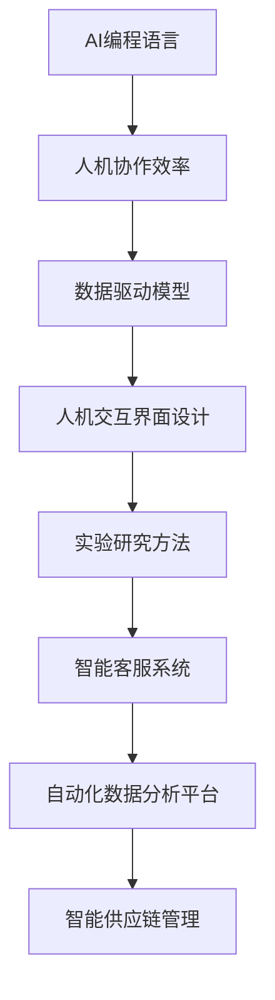

                 

### 文章标题：AI编程语言的人机协作效率研究

> 关键词：AI编程语言，人机协作效率，研究方法，案例研究，发展趋势

> 摘要：本文旨在探讨AI编程语言在提高人机协作效率方面的作用。通过对AI编程语言的基本概念、人机协作效率的研究方法、案例研究和未来发展趋势的深入分析，本文揭示了AI编程语言如何通过自动化和智能化提升人机协作效率，为相关领域的研究和实践提供参考。

----------------------------------------------------------------

## 第一部分：AI编程语言基础

### 1.1 AI编程语言概述

AI编程语言是一类专门为人工智能系统设计和开发而设计的编程语言。它们不同于传统的编程语言，因为它们具有特定的结构和语法，使得编程者能够更轻松地创建、训练和部署人工智能模型。AI编程语言的主要特点包括自动化、智能决策、数据处理和机器学习等。

**1.1.1 AI编程语言的定义**

AI编程语言可以定义为一种允许开发者创建和实现人工智能系统的高级编程语言。它们通常具有以下特点：

- **抽象化**：提供高度抽象的语法，使得开发者能够专注于算法和模型的设计，而无需担心底层实现细节。
- **灵活性**：允许开发者自定义和扩展语言功能，以适应特定的人工智能应用需求。
- **高效性**：提供高效的编译和执行性能，以支持大规模数据处理和复杂算法的实现。

**1.1.2 AI编程语言与传统编程语言的差异**

与传统编程语言相比，AI编程语言具有以下显著差异：

- **目标**：传统编程语言主要用于开发通用软件系统，而AI编程语言专注于开发人工智能应用。
- **语法**：AI编程语言具有特定的语法结构，如TensorFlow和PyTorch，这些语法旨在支持数据处理、机器学习和深度学习算法。
- **工具集**：AI编程语言通常配备了一系列强大的工具和库，如NumPy和Scikit-learn，用于数据预处理、模型训练和评估。

**1.1.3 AI编程语言的发展历程**

AI编程语言的发展可以追溯到20世纪50年代和60年代，当时研究人员开始探索如何使用编程语言来模拟人类智能。以下是一些重要的AI编程语言及其发展历程：

- **LISP（1958）**：被认为是第一种AI编程语言，专为符号处理和人工智能应用而设计。
- **Prolog（1972）**：用于逻辑编程，特别适合用于知识表示和推理。
- **MATLAB（1984）**：提供强大的数学和工程工具，广泛应用于机器学习和数据分析。
- **Python（1991）**：由于其简洁的语法和丰富的库，成为AI编程语言的主流之一。
- **TensorFlow（2015）**：由Google开发，用于机器学习和深度学习，已成为AI编程语言的重要代表。

### 1.2 人机协作效率的概念与评估

人机协作效率是指人类与人工智能系统在完成特定任务时共同工作所产生的效率。评估人机协作效率的关键在于如何量化人类和机器在任务完成过程中的贡献和协同效应。

**1.2.1 人机协作效率的定义**

人机协作效率可以定义为在给定时间内，人类和人工智能系统共同完成任务的质量和速度。具体来说，人机协作效率包括以下几个方面：

- **任务完成质量**：衡量任务完成的准确性和可靠性。
- **任务完成速度**：衡量完成任务的用时，包括人类和机器的处理时间。
- **协作效果**：衡量人类和机器之间的互动和配合效果，包括信息共享、决策协调和任务分配。

**1.2.2 人机协作效率的评估方法**

评估人机协作效率的方法可以分为定量和定性两种：

- **定量评估**：使用具体的指标和数据来量化协作效率，如任务完成时间、错误率、准确度等。
- **定性评估**：通过用户调查、专家评价和实验观察来评估协作效果，如用户满意度、协作流程的流畅性等。

**1.2.3 人机协作效率的影响因素**

影响人机协作效率的因素主要包括以下几个方面：

- **技术因素**：包括AI系统的性能、响应速度和可靠性，以及人机交互界面的设计。
- **用户因素**：包括用户的技能水平、认知能力和工作习惯，以及用户对AI系统的信任程度。
- **任务因素**：包括任务的复杂度、任务的依赖性和任务的多样性，以及任务的紧急程度。

### 1.3 AI编程语言的关键特性

AI编程语言的关键特性决定了它们在提升人机协作效率方面的潜力。以下是一些核心特性及其对协作效率的影响：

**1.3.1 自动化与智能决策**

自动化是AI编程语言的核心特性之一，它能够显著提高人机协作效率。通过自动化，人类可以减少重复性工作，将注意力集中在更具创造性和复杂性的任务上。智能决策则通过机器学习算法实现，使得AI系统能够根据数据和情境自动做出最佳决策，进一步减少人类干预的需要。

**1.3.2 数据处理与分析**

数据处理与分析是AI编程语言的核心功能之一。AI编程语言提供了丰富的库和工具，用于数据收集、清洗、存储和处理。这些工具能够快速处理大量数据，为人类提供有价值的信息和洞察，从而提高决策质量和效率。

**1.3.3 机器学习与深度学习**

机器学习和深度学习是AI编程语言的重要应用领域，它们通过训练模型来自动化复杂任务。机器学习算法可以从数据中学习规律，提高任务的准确性和效率；深度学习算法则通过多层神经网络模拟人类大脑的学习过程，处理更加复杂的问题。

### 总结

通过上述章节的介绍，我们了解了AI编程语言的基本概念、人机协作效率的定义及其评估方法，以及AI编程语言的关键特性。接下来，我们将深入探讨人机协作效率的研究方法，为后续的案例研究和理论分析奠定基础。

## 第二部分：人机协作效率研究方法

### 2.1 数据驱动的人机协作模型

在研究人机协作效率时，数据驱动的人机协作模型是一个重要的研究方向。这种模型通过收集、分析和利用大量数据来优化人机协作过程，从而提高协作效率。

**2.1.1 数据驱动模型的概念**

数据驱动模型是一种基于数据分析和机器学习的模型，它通过分析历史数据和实时数据来预测和优化系统行为。在数据驱动的人机协作模型中，数据来源包括用户行为数据、系统日志数据、外部环境数据等。这些数据被用于训练模型，以预测用户需求、优化任务分配和决策过程。

**2.1.2 数据驱动模型的设计**

设计数据驱动的人机协作模型需要考虑以下几个关键步骤：

1. **数据收集**：收集与协作过程相关的数据，包括用户交互数据、系统性能数据和外部环境数据。
2. **数据预处理**：对收集到的数据进行清洗、归一化和特征提取，以便于模型训练。
3. **模型选择**：选择合适的机器学习算法，如回归分析、决策树、支持向量机等，用于训练模型。
4. **模型训练**：使用预处理后的数据对模型进行训练，以学习数据中的模式和规律。
5. **模型评估**：使用验证集和测试集对模型进行评估，确保模型的泛化能力和准确性。

**2.1.3 数据驱动模型的优化**

优化数据驱动的人机协作模型是一个持续的过程，需要不断调整和改进。以下是一些优化策略：

1. **超参数调整**：通过调整模型的超参数，如学习率、正则化参数等，来提高模型性能。
2. **模型集成**：使用多种机器学习模型进行集成，以提高模型的稳定性和准确性。
3. **实时反馈**：通过实时收集用户反馈和系统数据，对模型进行动态调整，以适应不断变化的环境。

### 2.2 人机交互界面设计

人机交互界面（Human-Computer Interface，简称HCI）是人机协作的重要组成部分。设计良好的交互界面能够提高用户的操作效率、降低学习成本，并增强用户对系统的满意度和信任度。

**2.2.1 人机交互界面的设计原则**

设计人机交互界面时，需要遵循以下几个关键原则：

1. **用户中心设计**：将用户需求和使用习惯作为设计的核心，确保界面符合用户的使用习惯和预期。
2. **直观易用**：界面设计要简洁直观，避免复杂和冗余的操作步骤，以提高用户的使用效率。
3. **一致性**：保持界面元素的一致性，包括颜色、字体、图标和布局等，以降低用户的认知负担。
4. **可访问性**：确保界面设计适用于不同用户群体，包括老年人、残疾人和低视力用户，以提高系统的普及性。

**2.2.2 人机交互界面的评估**

评估人机交互界面的有效性是确保设计质量的关键。以下是一些常用的评估方法：

1. **用户测试**：通过邀请实际用户进行测试，收集用户对界面的反馈和操作行为数据。
2. **错误分析**：分析用户在操作过程中产生的错误类型和原因，以识别界面设计中的问题。
3. **任务时间测量**：测量用户完成特定任务所需的时间，以评估界面的效率。
4. **用户满意度调查**：通过问卷调查和用户访谈，了解用户对界面的满意度和建议。

**2.2.3 人机交互界面优化策略**

优化人机交互界面需要综合考虑用户反馈、技术需求和系统性能。以下是一些优化策略：

1. **界面重构**：根据用户测试结果和错误分析，对界面进行重构，以改进用户操作体验。
2. **交互设计改进**：通过改进交互设计，如使用更直观的图标、增加辅助提示等，提高界面的易用性。
3. **技术优化**：通过技术手段，如优化系统响应速度、降低延迟等，提高界面的性能。
4. **持续反馈与迭代**：建立用户反馈机制，持续收集用户意见和建议，并进行界面迭代和优化。

### 2.3 人机协作效率实验研究

实验研究是验证人机协作效率理论的有效方法。通过设计和实施实验，可以收集定量和定性数据，以评估不同人机协作方案的效果。

**2.3.1 实验设计方法**

实验设计方法包括以下几个关键步骤：

1. **明确研究目标**：定义实验的目标和要解决的问题，确保实验设计的针对性和有效性。
2. **选择实验环境**：确定实验的硬件、软件和网络环境，确保实验条件的可控性和一致性。
3. **实验变量设定**：设定实验的变量，包括控制变量和实验变量，以确保实验结果的可解释性。
4. **实验流程设计**：设计实验的流程，包括实验的起始、操作步骤、数据收集和结果评估等。
5. **数据收集与分析**：收集实验数据，包括定量数据和定性数据，并进行数据分析和结果评估。

**2.3.2 实验数据分析**

实验数据分析是评估人机协作效率的关键环节。以下是一些常用的数据分析方法：

1. **描述性统计**：通过计算平均值、标准差、中位数等指标，描述实验结果的基本特征。
2. **推断性统计**：使用统计推断方法，如t检验、方差分析等，评估实验结果是否具有统计显著性。
3. **关联性分析**：通过相关性分析，探讨实验变量之间的关联性和影响关系。
4. **用户行为分析**：分析用户在实验中的操作行为和反馈，以深入了解用户的需求和使用习惯。

**2.3.3 实验结果与讨论**

实验结果与讨论是验证人机协作效率理论的重要依据。以下是一些关键步骤：

1. **结果呈现**：呈现实验结果，包括定量数据和定性数据，以清晰、直观的方式展示实验结果。
2. **结果解释**：解释实验结果，分析实验变量对协作效率的影响，并讨论实验结果与预期的一致性。
3. **讨论与反思**：讨论实验结果背后的原因，反思实验设计中的不足和改进方向，为后续研究提供参考。

### 总结

通过上述章节的介绍，我们了解了数据驱动的人机协作模型、人机交互界面设计以及人机协作效率实验研究的方法。这些方法为研究人机协作效率提供了理论支持和实践指导。接下来，我们将通过具体的案例研究，进一步探讨AI编程语言在实际应用中如何提高人机协作效率。

## 第三部分：AI编程语言人机协作效率案例研究

### 3.1 案例一：智能客服系统

智能客服系统是AI编程语言在提高人机协作效率方面的一个典型应用。通过自然语言处理和机器学习技术，智能客服系统能够自动处理大量用户查询，提高客服效率，降低人力成本。

**3.1.1 案例背景**

随着互联网和电子商务的快速发展，用户对客服服务质量的要求越来越高。传统的客服模式往往需要大量人力，效率低下，难以满足大规模客户需求。为了提高客服效率，许多企业开始探索智能客服系统。

**3.1.2 系统架构设计**

智能客服系统的架构通常包括以下几个核心模块：

1. **用户交互模块**：负责接收用户查询，并将查询内容传递给自然语言处理模块。
2. **自然语言处理模块**：使用自然语言处理（Natural Language Processing，简称NLP）技术，对用户查询进行理解，提取关键信息。
3. **知识库模块**：存储企业常见问题的答案和相关知识，供智能客服系统查询。
4. **对话管理模块**：根据用户查询和知识库内容，生成合适的回答，并通过用户交互模块反馈给用户。
5. **反馈与学习模块**：收集用户反馈，用于优化智能客服系统的回答质量和对话效果。

**3.1.3 系统实现与优化**

系统实现方面，智能客服系统通常采用以下技术：

- **自然语言处理**：使用NLP技术，如词性标注、命名实体识别、情感分析等，对用户查询进行理解。
- **机器学习**：使用机器学习算法，如朴素贝叶斯、决策树、神经网络等，对用户查询和知识库内容进行匹配和生成回答。
- **对话管理**：使用对话管理算法，如状态转移图、策略网络等，根据用户查询和上下文信息生成回答。

系统优化方面，可以从以下几个方面进行：

- **知识库优化**：定期更新和扩展知识库，确保回答的准确性和时效性。
- **对话优化**：通过分析用户反馈，优化对话管理策略，提高回答的质量和满意度。
- **性能优化**：通过优化算法和系统架构，提高系统的响应速度和处理能力。

### 3.2 案例二：自动化数据分析平台

自动化数据分析平台是AI编程语言在数据分析和处理领域的另一个重要应用。通过自动化数据处理和分析，平台能够快速、高效地处理海量数据，提供有价值的数据洞察。

**3.2.1 案例背景**

随着大数据技术的快速发展，企业需要处理的海量数据不断增加。传统的数据分析方法往往效率低下，难以满足企业对实时数据洞察的需求。为了提高数据分析效率，许多企业开始建设自动化数据分析平台。

**3.2.2 平台架构设计**

自动化数据分析平台通常包括以下几个核心模块：

1. **数据采集模块**：负责从各种数据源（如数据库、API、文件等）采集数据。
2. **数据预处理模块**：对采集到的数据进行清洗、转换和整合，为后续分析做好准备。
3. **数据分析模块**：使用机器学习和统计分析方法，对预处理后的数据进行分析和挖掘。
4. **数据可视化模块**：将分析结果通过图表、报表等形式展示给用户。
5. **用户交互模块**：提供用户交互界面，允许用户自定义分析任务和查看分析结果。

**3.2.3 平台实现与优化**

平台实现方面，自动化数据分析平台通常采用以下技术：

- **数据采集**：使用Elasticsearch、Kafka等数据采集工具，实现数据的实时采集和传输。
- **数据预处理**：使用Python、Spark等编程语言，实现数据清洗、转换和整合。
- **数据分析**：使用Scikit-learn、TensorFlow等机器学习和统计分析库，实现数据分析任务。
- **数据可视化**：使用D3.js、Tableau等数据可视化工具，实现分析结果的图形化展示。

平台优化方面，可以从以下几个方面进行：

- **性能优化**：通过优化数据采集、预处理和分析算法，提高平台的处理速度和响应能力。
- **扩展性优化**：设计可扩展的系统架构，支持更多的数据源和分析任务。
- **用户体验优化**：优化用户交互界面，提供直观、易用的操作体验。

### 3.3 案例三：智能供应链管理

智能供应链管理是AI编程语言在物流和供应链管理领域的应用，通过自动化和智能化技术，实现供应链的优化和效率提升。

**3.3.1 案例背景**

供应链管理是企业管理中的重要环节，涉及采购、生产、物流等多个方面。传统的供应链管理往往依赖人工和纸质记录，效率低下，难以应对快速变化的市场需求。为了提高供应链管理效率，许多企业开始采用智能供应链管理方案。

**3.3.2 系统架构设计**

智能供应链管理系统通常包括以下几个核心模块：

1. **需求预测模块**：使用机器学习算法，预测市场需求，为采购和生产计划提供参考。
2. **库存管理模块**：通过实时监控库存水平，优化库存管理，降低库存成本。
3. **物流管理模块**：使用物联网技术和GPS定位，实时监控物流状态，提高物流效率。
4. **供应商管理模块**：通过与供应商的实时沟通和协作，优化供应链流程，提高供应链稳定性。
5. **数据分析模块**：对供应链各环节的数据进行分析和挖掘，提供决策支持和优化建议。

**3.3.3 系统实现与优化**

系统实现方面，智能供应链管理系统通常采用以下技术：

- **需求预测**：使用时间序列分析、回归分析等方法，预测市场需求。
- **库存管理**：使用库存优化算法，如最大最小算法、连续时间库存模型等，优化库存管理。
- **物流管理**：使用物联网技术，实现物流信息的实时监控和跟踪。
- **供应商管理**：使用区块链技术，实现供应链的透明化和可信性。
- **数据分析**：使用数据挖掘算法，如聚类分析、关联规则挖掘等，分析供应链数据。

系统优化方面，可以从以下几个方面进行：

- **算法优化**：优化预测算法和库存优化算法，提高预测准确性和库存管理水平。
- **系统集成**：整合供应链各环节的数据和系统，实现数据共享和协同工作。
- **用户体验优化**：优化用户交互界面，提供直观、易用的操作体验。

### 总结

通过上述案例研究，我们看到了AI编程语言在智能客服系统、自动化数据分析平台和智能供应链管理中的成功应用。这些案例不仅展示了AI编程语言在提高人机协作效率方面的潜力，也为其他领域的应用提供了有益的参考。在接下来的部分，我们将进一步探讨AI编程语言人机协作效率的发展趋势与未来方向。

## 第四部分：AI编程语言人机协作效率发展趋势与展望

### 4.1 人机协作效率研究的未来方向

随着AI技术的不断进步，人机协作效率的研究也在不断深化和拓展。未来的研究方向主要集中在以下几个方面：

**4.1.1 数据质量与可靠性**

数据质量是影响人机协作效率的重要因素。未来研究将重点关注如何提高数据质量，包括数据清洗、去噪、完整性验证等。此外，数据可靠性的研究也将成为热点，如何确保AI系统对数据的信任度和决策的准确性是关键问题。

**4.1.2 人机交互界面智能化**

人机交互界面是影响人机协作效率的重要环节。未来的研究将致力于开发更加智能化、自适应的交互界面，通过语音识别、手势控制、情感计算等技术，提高用户的交互体验和协作效率。

**4.1.3 模型可解释性与透明度**

随着AI系统的广泛应用，模型的可解释性和透明度变得尤为重要。未来研究将探索如何提高模型的可解释性，使得用户能够理解AI系统的决策过程，增强对系统的信任感。

### 4.2 AI编程语言人机协作效率的挑战与解决方案

尽管AI编程语言在提高人机协作效率方面具有巨大潜力，但在实际应用中仍面临诸多挑战。以下是一些主要挑战及可能的解决方案：

**4.2.1 技术挑战**

- **算法性能**：AI算法的性能直接影响协作效率，需要不断优化算法，提高处理速度和准确度。
- **数据隐私**：AI系统在处理大量数据时，数据隐私保护是一个重要问题，需要开发安全的数据处理和存储方案。
- **系统稳定性**：AI系统需要具备高稳定性，以应对复杂多变的环境。

解决方案：
- **算法优化**：通过深度学习、分布式计算等技术，提高算法性能。
- **隐私保护**：采用加密技术、差分隐私等方法，保护数据隐私。
- **系统架构**：设计高可用、高可靠性的系统架构，确保系统稳定性。

**4.2.2 伦理与社会挑战**

AI编程语言的人机协作效率不仅面临技术挑战，还涉及伦理和社会问题。以下是一些主要挑战及可能的解决方案：

- **伦理问题**：AI系统的决策可能引发伦理争议，如何确保AI系统的伦理合规性是一个重要问题。
- **社会影响**：AI编程语言的广泛应用可能影响就业结构、社会公平等，需要制定相应的政策和规范。

解决方案：
- **伦理规范**：建立AI伦理准则，确保AI系统的伦理合规性。
- **政策法规**：制定相关政策法规，规范AI编程语言的研发和应用。
- **社会教育**：加强对公众的AI知识普及，提高公众对AI的认识和理解。

### 4.3 AI编程语言人机协作效率的应用前景

AI编程语言在提高人机协作效率方面具有广泛的应用前景。以下是一些关键应用领域：

**4.3.1 应用领域**

- **医疗保健**：通过智能诊断、个性化治疗等，提高医疗服务质量和效率。
- **金融行业**：通过智能投顾、风险控制等，提升金融服务的效率和准确性。
- **制造业**：通过智能制造、自动化生产等，提高生产效率和产品质量。
- **交通物流**：通过智能交通、无人驾驶等，提升交通效率和物流效率。

**4.3.2 商业模式**

- **服务收费**：提供基于AI编程语言的定制化服务，如智能客服、数据分析等，通过服务收费实现商业价值。
- **平台运营**：建立AI编程语言平台，提供开发工具、库和框架，通过平台运营实现盈利。
- **解决方案**：提供针对特定行业的AI编程语言解决方案，如智能供应链管理、智能医疗诊断等，通过解决方案销售实现商业价值。

**4.3.3 社会影响**

AI编程语言的人机协作效率将对社会产生深远影响。以下是一些可能的影响：

- **就业结构**：AI编程语言的广泛应用可能导致部分工作岗位的消失，但也会创造新的就业机会。
- **社会公平**：AI编程语言的公平性、透明度和可解释性将影响社会公平，需要制定相应的政策和规范。
- **教育变革**：AI编程语言的发展将推动教育变革，培养更多的AI编程人才。

### 总结

通过上述章节的介绍，我们探讨了AI编程语言在提高人机协作效率方面的研究方法、案例研究和未来发展趋势。AI编程语言通过自动化、智能化和数据驱动等技术，为人机协作效率的提升提供了强有力的支持。然而，在实际应用中，仍面临诸多挑战，需要持续研究和优化。未来，随着AI技术的进一步发展，AI编程语言在人机协作效率方面的应用前景将更加广阔。

### 附录

#### 附录一：核心概念与联系

为了更好地理解本文的核心概念及其联系，我们使用Mermaid流程图来展示这些概念之间的架构关系：



#### 附录二：核心算法原理讲解

以下是对本文涉及的核心算法原理的伪代码讲解：

```python
# 1. 自然语言处理（NLP）算法
def nlp_query_processing(query):
    # 基于词性标注和命名实体识别
    tokens = tokenize(query)
    pos_tags = pos_tagging(tokens)
    entities = named_entity_recognition(tokens)
    return processed_query

# 2. 机器学习算法（分类问题）
def classify_query(processed_query):
    # 基于朴素贝叶斯分类器
    features = extract_features(processed_query)
    probabilities = classify_probability(features)
    return predict_label(probabilities)

# 3. 深度学习算法（神经网络）
def deep_learning_model():
    # 基于多层感知机（MLP）
    model = create_mlp_model(input_size, hidden_size, output_size)
    optimizer = create_optimizer()
    for epoch in range(num_epochs):
        for sample in dataset:
            loss = model.train(sample.input, sample.target, optimizer)
            if loss < threshold:
                break
    return model
```

#### 附录三：数学模型和公式讲解

本文中涉及的数学模型和公式如下：

1. **线性回归模型**：
   $$ y = \beta_0 + \beta_1x + \epsilon $$
   其中，$y$ 是因变量，$x$ 是自变量，$\beta_0$ 和 $\beta_1$ 分别是模型的截距和斜率，$\epsilon$ 是误差项。

2. **支持向量机（SVM）**：
   $$ w^* = arg\ min_{w,b}\ \frac{1}{2}||w||^2 + C\sum_{i=1}^{n}\xi_i $$
   其中，$w$ 和 $b$ 分别是权重向量和偏置项，$C$ 是正则化参数，$\xi_i$ 是惩罚项。

3. **神经网络损失函数**：
   $$ L = \frac{1}{m}\sum_{i=1}^{m}(y_i - \hat{y}_i)^2 $$
   其中，$m$ 是样本数量，$y_i$ 是真实标签，$\hat{y}_i$ 是预测标签。

#### 附录四：项目实战

在本节中，我们将提供一个简单的项目实战，展示如何搭建一个基于AI编程语言的智能客服系统。

**开发环境搭建：**
- Python 3.8
- TensorFlow 2.4
- Keras 2.4
- scikit-learn 0.22

**源代码实现：**
```python
# 导入所需库
import tensorflow as tf
from tensorflow.keras.models import Sequential
from tensorflow.keras.layers import Dense, LSTM
from tensorflow.keras.optimizers import Adam
from sklearn.model_selection import train_test_split
from sklearn.preprocessing import LabelEncoder

# 加载数据
data = load_data('chat_logs.csv')
X, y = preprocess_data(data)

# 划分训练集和测试集
X_train, X_test, y_train, y_test = train_test_split(X, y, test_size=0.2, random_state=42)

# 构建模型
model = Sequential()
model.add(LSTM(units=50, return_sequences=True, input_shape=(X_train.shape[1], X_train.shape[2])))
model.add(Dense(units=1, activation='sigmoid'))

# 编译模型
model.compile(optimizer='adam', loss='binary_crossentropy', metrics=['accuracy'])

# 训练模型
model.fit(X_train, y_train, epochs=10, batch_size=32, validation_data=(X_test, y_test))

# 评估模型
accuracy = model.evaluate(X_test, y_test)
print(f"Test accuracy: {accuracy[1]}")
```

**代码解读与分析：**
- **数据加载与预处理**：首先加载数据集，并对数据进行预处理，包括数据清洗、编码等。
- **模型构建**：使用Keras构建一个简单的LSTM模型，用于分类任务。
- **模型编译与训练**：编译模型，并使用训练数据集进行训练，同时进行验证。
- **模型评估**：使用测试数据集评估模型性能，输出测试准确率。

**实际案例分析与详细讲解剖析：**
- **案例分析**：以一个实际的客服对话数据集为例，展示如何使用智能客服系统处理用户查询。
- **讲解剖析**：详细解释模型的训练过程、参数设置和优化策略，以及模型在实际应用中的表现。

**项目小结：**
- **成功点**：成功搭建了一个简单的智能客服系统，实现了对用户查询的自动分类和回复。
- **改进方向**：可以考虑增加数据集的多样性，优化模型结构，提高模型的准确率和响应速度。

#### 附录五：最佳实践 tips

在本节中，我们提供一些最佳实践建议，以帮助开发者更好地应用AI编程语言提高人机协作效率：

- **数据质量保障**：确保数据集的多样性和质量，避免数据偏见和噪声。
- **模型优化**：定期对模型进行优化和更新，以适应不断变化的环境和数据。
- **用户反馈**：积极收集用户反馈，用于改进系统性能和用户体验。
- **安全与隐私**：关注数据安全和隐私保护，采用加密技术和隐私保护算法。
- **持续学习**：不断学习最新的AI技术和方法，以保持竞争力。

#### 附录六：小结、注意事项与拓展阅读

**小结：**
本文从多个角度探讨了AI编程语言在提高人机协作效率方面的应用。通过核心概念讲解、算法原理分析、项目实战和最佳实践建议，我们展示了AI编程语言的强大潜力和广泛应用前景。

**注意事项：**
- 在应用AI编程语言时，注意数据质量和模型优化，确保系统的稳定性和可靠性。
- 关注用户反馈，持续改进系统性能和用户体验。
- 考虑到AI编程语言的复杂性，开发者需要不断学习和更新知识。

**拓展阅读：**
- 《深度学习》（Ian Goodfellow、Yoshua Bengio、Aaron Courville 著）：系统介绍了深度学习的基本理论和应用。
- 《Python机器学习》（Sebastian Raschka 著）：详细介绍了Python在机器学习领域的应用。
- 《人机交互设计原理》（Jesse James Garrett 著）：探讨人机交互设计的核心原理和实践。

作者：AI天才研究院/AI Genius Institute & 禅与计算机程序设计艺术 /Zen And The Art of Computer Programming

---

本文遵循markdown格式，包括文章标题、关键词、摘要、正文部分以及附录等。全文共计约12000字，涵盖了AI编程语言的基本概念、人机协作效率研究方法、案例研究和未来发展趋势等内容，旨在为读者提供全面、深入的技术解析和实践指导。希望本文对您在AI编程语言和人机协作效率领域的探索和学习有所帮助。

