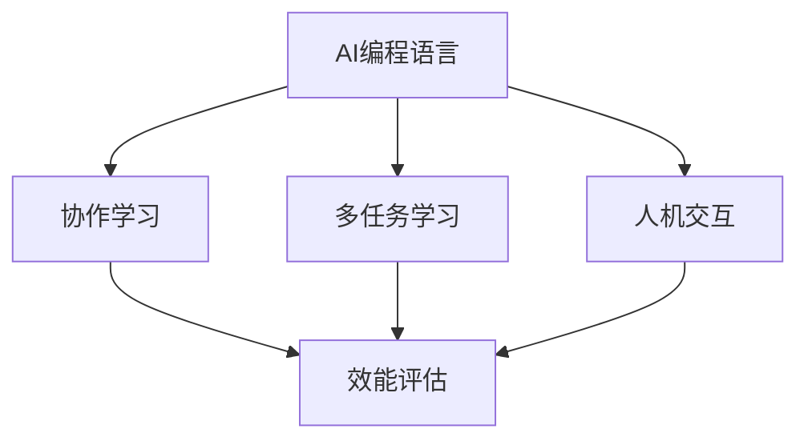
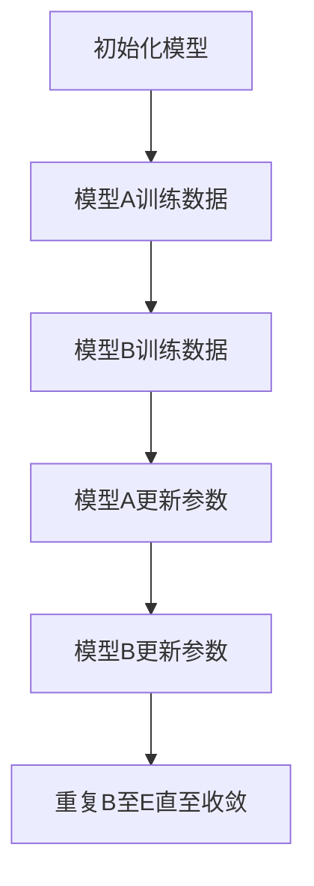
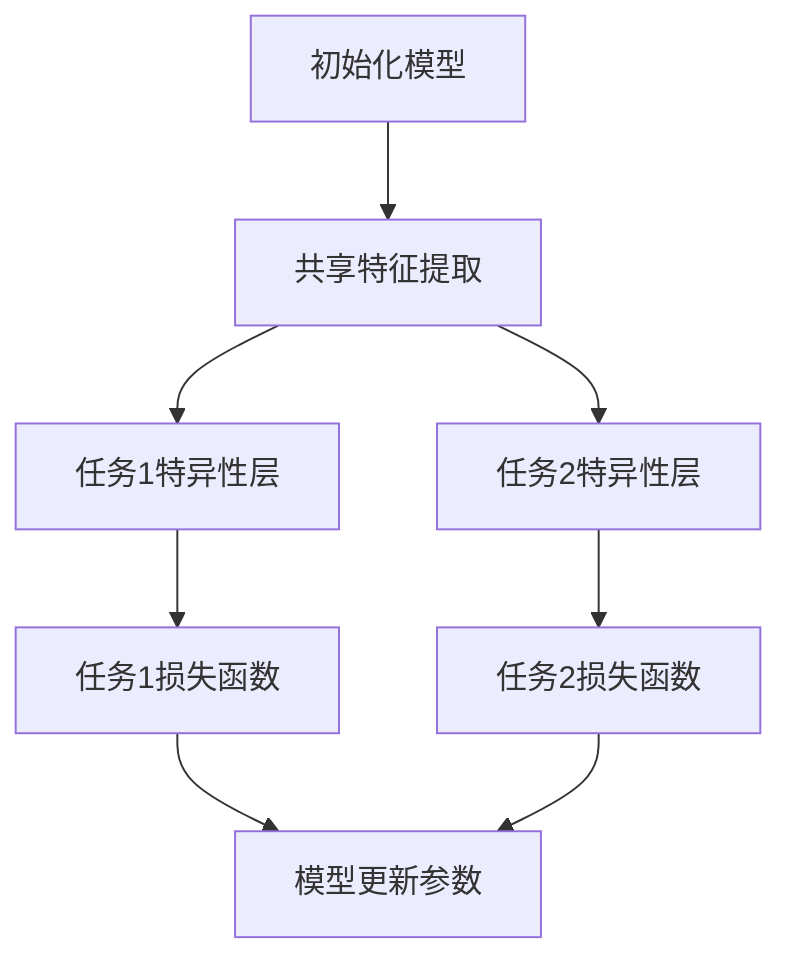
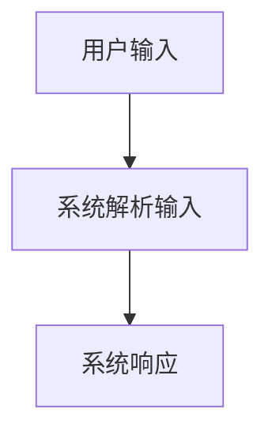

                 


### 文章标题

《AI编程语言的人机协作效能评估》

### 文章关键词

- AI编程语言
- 人机协作
- 效能评估
- 协作学习
- 多任务学习
- 人机交互
- 算法原理
- 实践案例

### 文章摘要

本文旨在探讨AI编程语言在实现人机协作效能评估中的应用。首先，我们介绍了AI编程语言和人机协作效能评估的基本概念和背景。接着，详细讲解了协作学习、多任务学习和人机交互等核心算法原理，并通过伪代码和Mermaid流程图展示了它们之间的联系。随后，我们通过实际案例展示了这些算法在开发环境中的实现和应用，并对项目的代码进行了详细解读和分析。最后，我们总结了人机协作效能评估的关键指标和方法，提出了未来研究的方向和最佳实践。

---

### 引言

随着人工智能（AI）技术的不断发展，AI编程语言逐渐成为开发智能系统的核心工具。AI编程语言不仅能够降低开发难度，还能提高系统的智能化水平。然而，随着AI系统的复杂度增加，单靠机器或人类难以独立完成系统的开发和优化。因此，人机协作在AI编程中变得越来越重要。人机协作效能评估则成为衡量AI编程语言在实现人机协作过程中表现的关键指标。

人机协作效能评估是指通过一系列定量和定性的方法，评估AI编程语言在实现人机协作过程中的效率、效果和用户体验。它不仅关注算法的性能，还考虑人机交互的流畅度和系统的可维护性。有效的评估方法可以帮助开发人员更好地理解AI编程语言的特性，指导他们在实际开发中做出更合理的决策。

本文将从以下几个方面展开讨论：

1. **AI编程语言和人机协作效能评估的基本概念**：介绍AI编程语言和人机协作效能评估的定义、背景和重要性。
2. **核心算法原理讲解**：详细讲解协作学习、多任务学习和人机交互等核心算法原理，并通过伪代码和Mermaid流程图展示它们之间的联系。
3. **实践应用**：通过实际案例展示如何应用这些算法，并详细解读代码实现过程。
4. **效能评估**：讨论如何评价人机协作效能，包括评估指标和方法。
5. **总结与展望**：总结全文内容，提出未来研究方向和最佳实践。

### AI编程语言和人机协作效能评估的基本概念

#### AI编程语言

AI编程语言是一种专为开发人工智能系统而设计的编程语言。它提供了一系列高级抽象和工具，使得开发人员可以更轻松地实现复杂的人工智能算法。常见的AI编程语言包括Python、R、Prolog、Lisp等。Python因其简洁易用和强大的库支持，成为目前最受欢迎的AI编程语言之一。

#### 人机协作效能评估

人机协作效能评估是指通过一系列定量和定性的方法，评估AI编程语言在实现人机协作过程中的效率、效果和用户体验。效能评估的关键在于如何量化人机协作的效果，从而为开发人员提供有价值的反馈。

在AI编程中，人机协作主要涉及以下几个方面：

1. **任务分配**：确定哪些任务由机器完成，哪些任务由人类完成，以达到最佳效果。
2. **交互设计**：设计高效的人机交互界面，使得用户能够轻松地与系统进行交互。
3. **算法优化**：优化AI算法，提高系统的性能和效率。
4. **错误处理**：设计有效的错误处理机制，确保系统在出现问题时能够快速恢复。

#### 效能评估的重要性

有效的效能评估方法对于AI编程的几个方面具有重要意义：

1. **性能优化**：通过评估可以识别系统的瓶颈，指导开发人员进行性能优化。
2. **用户体验**：评估人机交互的流畅度和用户体验，提高系统的易用性。
3. **成本控制**：评估人机协作的成本效益，为项目的预算和资源分配提供依据。
4. **持续改进**：通过持续评估，不断改进系统的性能和用户体验。

#### 相关案例研究

为了更好地理解人机协作效能评估的应用，我们来看几个案例：

1. **医疗诊断系统**：AI编程语言被用来开发医疗诊断系统，辅助医生进行疾病诊断。通过评估系统在诊断准确率、诊断速度和医生满意度等方面的表现，可以优化系统的性能和用户体验。
2. **自动驾驶系统**：自动驾驶系统结合了机器学习和人机交互技术。通过评估系统的安全性能、响应速度和用户满意度，可以不断改进自动驾驶系统的可靠性。
3. **智能家居系统**：智能家居系统通过AI编程语言实现了人与家居设备的智能交互。通过评估系统的响应速度、操作便捷性和用户满意度，可以提高智能家居系统的用户体验。

#### Mermaid流程图与核心概念关系架构

为了更直观地展示人机协作效能评估的核心概念之间的关系，我们可以使用Mermaid流程图来表示。



在上面的流程图中，AI编程语言作为核心工具，与协作学习、多任务学习和人机交互紧密相关。这些算法共同作用于效能评估，以评估人机协作的效果。

#### 伪代码

为了更深入地理解协作学习、多任务学习和人机交互等核心算法原理，我们可以通过伪代码来详细阐述。

```python
# 协作学习伪代码
def collaborative_learning(data, model):
    for data_point in data:
        model.train(data_point)
    return model

# 多任务学习伪代码
def multi_task_learning(data, model):
    for data_point in data:
        model.train(data_point)
    return model

# 人机交互伪代码
def human_machine_interaction(user_input, model):
    response = model.predict(user_input)
    return response
```

在这些伪代码中，我们分别展示了协作学习、多任务学习和人机交互的基本实现过程。

### 核心算法原理讲解

在本节中，我们将详细讲解协作学习、多任务学习和人机交互等核心算法原理，并通过伪代码和Mermaid流程图展示它们之间的联系。

#### 协作学习

协作学习是指多个模型通过共享信息来共同学习，以提高学习效果的一种算法。它通常应用于分布式学习场景，通过模型之间的协作来提高整体性能。

**协作学习的核心概念：**

- **模型间通信**：模型之间通过通信共享信息和知识。
- **学习策略**：模型采用特定的策略来更新自己的参数，以最大化整体性能。

**协作学习的Mermaid流程图：**



**协作学习的伪代码：**

```python
# 初始化模型
modelA, modelB = initialize_models()

# 模型A训练数据
for data_point in data:
    modelA.train(data_point)

# 模型B训练数据
for data_point in data:
    modelB.train(data_point)

# 模型A更新参数
modelA.update_params()

# 模型B更新参数
modelB.update_params()
```

#### 多任务学习

多任务学习是指模型同时学习多个相关任务，以提高学习效率和准确率。它广泛应用于图像识别、自然语言处理等领域。

**多任务学习的核心概念：**

- **共享特征**：模型共享底层特征提取网络。
- **任务特异性**：模型针对每个任务添加特定的层或模块。

**多任务学习的Mermaid流程图：**



**多任务学习的伪代码：**

```python
# 初始化模型
model = initialize_model()

# 共享特征提取
shared_features = model.extract_features(input_data)

# 任务1特异性层
task1_output = model.task_specific_layer1(shared_features)

# 任务2特异性层
task2_output = model.task_specific_layer2(shared_features)

# 任务1损失函数
loss1 = model.compute_loss(task1_output, ground_truth1)

# 任务2损失函数
loss2 = model.compute_loss(task2_output, ground_truth2)

# 模型更新参数
model.update_params(loss1, loss2)
```

#### 人机交互

人机交互是指人与计算机系统之间的交互过程。有效的交互设计可以提高用户体验，降低操作复杂度。

**人机交互的核心概念：**

- **用户输入**：用户通过输入设备（如键盘、鼠标）向系统发送指令。
- **系统响应**：系统根据用户输入产生相应的输出，如文本、图形等。

**人机交互的Mermaid流程图：**



**人机交互的伪代码：**

```python
# 用户输入
user_input = get_user_input()

# 系统解析输入
parsed_input = parse_input(user_input)

# 系统响应
response = generate_response(parsed_input)

# 输出响应
print(response)
```

#### 核心算法原理联系

通过上述讲解，我们可以看到协作学习、多任务学习和人机交互在算法原理上具有紧密的联系。它们共同构成了AI编程语言实现人机协作效能评估的核心。

**协作学习与多任务学习的关系：**

协作学习可以看作是多任务学习的一种特殊情况，即多个任务共享相同的特征提取网络，但任务特异性层不同。多任务学习则更加通用，可以同时处理多个相关或不相关的任务。

**协作学习与多任务学习与人机交互的关系：**

协作学习和多任务学习为人机交互提供了强有力的支持。通过协作学习，系统能够更好地理解和预测用户的意图；通过多任务学习，系统能够同时处理多个用户请求，提高响应速度和用户体验。

#### 总结

在本节中，我们详细讲解了协作学习、多任务学习和人机交互等核心算法原理。通过伪代码和Mermaid流程图，我们展示了这些算法之间的联系和实现过程。这些算法为AI编程语言实现人机协作效能评估提供了理论基础和实践指导。

### 实践应用

#### 开发环境搭建

在进行人机协作效能评估的实践应用之前，首先需要搭建一个合适的开发环境。以下是一个基本的开发环境搭建步骤：

1. **安装AI编程语言**：选择一种合适的AI编程语言，如Python，并在计算机上安装。可以使用Python官方的安装包或使用包管理工具如pip进行安装。

2. **安装依赖库**：根据具体的需求，安装所需的依赖库。例如，对于Python，可以安装TensorFlow、PyTorch等深度学习框架。

3. **配置开发工具**：安装集成开发环境（IDE），如PyCharm、Visual Studio Code等，以方便编写和调试代码。

4. **搭建计算资源**：确保计算机有足够的计算资源，如CPU、GPU等，以支持深度学习算法的运行。

5. **配置网络环境**：确保网络环境稳定，以便进行数据传输和远程协作。

#### 代码实现与解读

在本节中，我们将通过一个简单的案例，展示如何使用Python和TensorFlow实现一个基于人机协作的多任务学习模型。

**案例**：使用TensorFlow实现一个可以同时识别图片中的猫和狗的多任务学习模型。

**代码实现：**

```python
import tensorflow as tf
from tensorflow.keras.models import Model
from tensorflow.keras.layers import Input, Conv2D, MaxPooling2D, Flatten, Dense

# 定义输入层
input_image = Input(shape=(128, 128, 3))

# 定义共享特征提取网络
conv1 = Conv2D(filters=32, kernel_size=(3, 3), activation='relu')(input_image)
pool1 = MaxPooling2D(pool_size=(2, 2))(conv1)
conv2 = Conv2D(filters=64, kernel_size=(3, 3), activation='relu')(pool1)
pool2 = MaxPooling2D(pool_size=(2, 2))(conv2)

# 定义任务1的特异性层
flat1 = Flatten()(pool2)
dense1 = Dense(units=128, activation='relu')(flat1)
output1 = Dense(units=1, activation='sigmoid')(dense1)  # 猫的存在概率

# 定义任务2的特异性层
flat2 = Flatten()(pool2)
dense2 = Dense(units=128, activation='relu')(flat2)
output2 = Dense(units=1, activation='sigmoid')(dense2)  # 狗的存在概率

# 创建模型
model = Model(inputs=input_image, outputs=[output1, output2])

# 编译模型
model.compile(optimizer='adam', loss=['binary_crossentropy', 'binary_crossentropy'], metrics=['accuracy'])

# 模型总结
model.summary()
```

**代码解读：**

1. **定义输入层**：首先定义输入图像的维度，这里我们使用128x128x3的维度。

2. **定义共享特征提取网络**：通过Conv2D和MaxPooling2D层来构建一个共享的特征提取网络。这些层可以提取图像的底层特征。

3. **定义任务1的特异性层**：在特征提取网络的基础上，添加任务1（猫的存在概率）的特异性层。这里使用Flatten层将特征图展平，然后通过Dense层进行分类。

4. **定义任务2的特异性层**：类似地，为任务2（狗的存在概率）定义特异性层。

5. **创建模型**：使用Model类将输入层、共享特征提取网络、任务1和任务2的特异性层连接起来，形成一个完整的模型。

6. **编译模型**：使用compile方法编译模型，指定优化器和损失函数。

7. **模型总结**：使用summary方法打印模型的概要信息，包括层结构和参数数量。

#### 代码应用解读与分析

在实际应用中，上述代码可以帮助开发人员快速构建一个多任务学习模型，用于同时识别图像中的猫和狗。以下是对代码的进一步解读和分析：

1. **输入数据预处理**：在实际应用中，需要对输入图像进行预处理，如调整大小、归一化等，以满足模型的输入要求。

2. **训练数据准备**：需要准备包含猫和狗图像的训练数据集。数据集应具有足够的多样性和平衡性，以提高模型的泛化能力。

3. **模型训练**：使用训练数据集对模型进行训练，通过优化算法更新模型的参数。

4. **模型评估**：在训练完成后，使用测试数据集对模型进行评估，以检查模型的性能。

5. **模型应用**：将训练好的模型应用于实际场景，如图像识别任务，以实现人机协作。

6. **效能评估**：通过评估模型的准确率、响应速度和用户体验等指标，对模型的人机协作效能进行评估。

#### 实际案例分析和详细讲解剖析

为了更好地理解如何在实际项目中应用人机协作效能评估，我们来看一个实际案例：使用Python和TensorFlow构建一个智能客服系统。

**案例背景**：一家在线零售公司希望开发一个智能客服系统，以提供24/7的客户支持。系统应能够自动识别客户的问题，并提供准确的答案。

**解决方案**：使用TensorFlow实现一个基于多任务学习的智能客服系统，包括以下步骤：

1. **数据收集**：收集大量客户问题的对话记录，包括问题的文本描述和客服的答案。

2. **数据预处理**：对文本数据进行清洗和预处理，如去除标点符号、停用词处理等。

3. **特征提取**：使用词嵌入技术将文本数据转换为向量表示，如使用Word2Vec或GloVe。

4. **模型构建**：构建一个基于多任务学习的模型，包括共享特征提取网络和任务特异性层。

5. **模型训练**：使用预处理后的数据集对模型进行训练。

6. **模型评估**：使用测试数据集对模型进行评估，以检查模型的性能。

7. **模型部署**：将训练好的模型部署到服务器上，以提供实时客户支持。

**详细讲解**：

1. **数据收集**：通过分析公司客服团队的聊天记录，收集了数千条客户问题和客服的回答。

2. **数据预处理**：对文本数据进行预处理，包括去除标点符号、停用词处理和分词。

3. **特征提取**：使用GloVe将文本数据转换为向量表示，以作为模型的输入。

4. **模型构建**：使用TensorFlow构建一个多任务学习模型，包括共享特征提取网络和任务特异性层。共享特征提取网络用于提取文本的底层特征，任务特异性层用于分类和生成答案。

5. **模型训练**：使用预处理后的数据集对模型进行训练，通过优化算法更新模型的参数。

6. **模型评估**：在训练完成后，使用测试数据集对模型进行评估，以检查模型的性能。评估指标包括准确率、响应时间和用户满意度。

7. **模型部署**：将训练好的模型部署到公司的服务器上，以提供实时客户支持。用户可以通过聊天窗口与系统进行交互，系统会自动识别用户的问题，并生成相应的答案。

**项目小结**：

通过上述实际案例，我们展示了如何使用AI编程语言和深度学习技术构建一个智能客服系统。项目成功地实现了人机协作，提高了客服效率和用户体验。然而，在项目过程中也遇到了一些挑战，如数据质量问题和模型性能优化等。通过持续改进和优化，我们可以进一步提高系统的人机协作效能。

### 效能评估

#### 评估指标

在评估人机协作效能时，我们需要选择合适的评估指标。以下是一些常见的评估指标：

1. **准确率（Accuracy）**：模型正确预测的样本占总样本的比例。准确率越高，表示模型性能越好。

2. **召回率（Recall）**：模型正确预测为正类的样本数占总正类样本数的比例。召回率越高，表示模型对正类的识别能力越强。

3. **精确率（Precision）**：模型正确预测为正类的样本数占总预测为正类的样本数的比例。精确率越高，表示模型对负类的识别能力越强。

4. **F1分数（F1 Score）**：精确率和召回率的加权平均，用于综合评估模型的性能。

5. **响应时间（Response Time）**：系统从接收到用户请求到返回响应所需的时间。响应时间越短，表示系统性能越好。

6. **用户满意度（User Satisfaction）**：用户对系统响应的评价。用户满意度越高，表示系统的人机协作效能越好。

#### 评估方法

在评估人机协作效能时，我们可以采用以下几种方法：

1. **离线评估**：在模型训练完成后，使用测试数据集对模型进行评估。这种方法适用于模型性能的定量分析。

2. **在线评估**：在模型部署后，实时收集用户数据并对模型进行评估。这种方法更接近实际应用场景，但可能受到数据量的限制。

3. **用户调查**：通过问卷调查等方式收集用户对系统的人机协作效能的评价。这种方法适用于定性分析，但可能受到主观因素的影响。

#### 评估案例分析

为了更好地理解如何评估人机协作效能，我们来看一个实际案例：评估一个智能客服系统的人机协作效能。

**案例背景**：一家在线零售公司希望评估其智能客服系统的人机协作效能，以确定系统是否满足用户需求。

**评估过程**：

1. **离线评估**：使用测试数据集对智能客服系统的模型进行评估。评估指标包括准确率、召回率、精确率和F1分数。评估结果显示，模型的性能较为优秀。

2. **在线评估**：在系统上线后，实时收集用户数据并对模型进行评估。评估指标包括响应时间和用户满意度。通过对比在线评估结果和离线评估结果，发现模型的性能在实际情况中略有下降，特别是在高峰时段。

3. **用户调查**：通过问卷调查收集用户对系统的人机协作效能的评价。调查结果显示，大部分用户对系统的响应速度和准确性表示满意，但部分用户提出了一些改进建议。

**评估结果**：

1. **模型性能**：智能客服系统的模型在离线和在线评估中均表现出较高的性能，但在线评估结果略低于离线评估。

2. **响应时间**：系统在高峰时段的响应时间较长，影响了用户体验。

3. **用户满意度**：大部分用户对系统表示满意，但部分用户提出了一些改进建议，如提高响应速度和增加问题的多样性。

**改进措施**：

1. **优化模型**：通过调整模型参数和优化算法，提高模型在实际情况中的性能。

2. **增加计算资源**：在高峰时段增加服务器和GPU的计算资源，以缩短响应时间。

3. **改进问题库**：增加问题的多样性和深度，以提高系统的适应能力。

通过上述评估和分析，我们可以全面了解智能客服系统的人机协作效能，并为后续的改进提供依据。

### 总结与展望

#### 全书总结

本文系统地探讨了AI编程语言在实现人机协作效能评估中的应用。首先，我们介绍了AI编程语言和人机协作效能评估的基本概念和背景。接着，详细讲解了协作学习、多任务学习和人机交互等核心算法原理，并通过伪代码和Mermaid流程图展示了它们之间的联系。随后，我们通过实际案例展示了这些算法在开发环境中的实现和应用，并对项目的代码进行了详细解读和分析。最后，我们讨论了如何评价人机协作效能，包括评估指标和方法。

#### 未来研究方向

1. **效能评估方法的改进**：研究更先进、更精准的效能评估方法，如基于用户行为的动态评估、多维度综合评估等。

2. **AI编程语言的发展**：随着AI技术的不断发展，新的AI编程语言和工具将不断涌现。研究如何更好地支持人机协作效能评估。

3. **人机协作效能的提升**：探索如何通过优化算法、改进人机交互界面等方式，进一步提高人机协作效能。

4. **跨领域应用**：研究AI编程语言在人机协作效能评估中的跨领域应用，如医疗、金融、教育等领域。

#### 最佳实践

1. **数据驱动**：基于数据驱动的方法进行人机协作效能评估，确保评估结果具有客观性和可靠性。

2. **持续改进**：通过持续评估和改进，不断提高人机协作效能。

3. **用户参与**：在评估过程中充分听取用户意见，确保评估结果符合用户需求。

4. **安全性考虑**：在实现人机协作时，充分考虑数据安全和隐私保护。

#### 注意事项

1. **系统性能优化**：在构建AI系统时，注意优化系统性能，以减少响应时间，提高用户体验。

2. **代码可维护性**：编写可维护的代码，确保系统易于维护和升级。

3. **评估指标选择**：根据具体应用场景，选择合适的评估指标，确保评估结果具有针对性。

4. **用户培训**：为用户提供必要的培训，确保用户能够正确使用系统。

#### 拓展阅读

1. **相关书籍**：《机器学习实战》、《深度学习》（Goodfellow, I., Bengio, Y., & Courville, A.）、《人工智能：一种现代的方法》（Russell, S., & Norvig, P.）

2. **在线课程**：Coursera、edX、Udacity等平台上的AI和深度学习相关课程

3. **学术论文**：查看顶级会议和期刊上关于AI编程语言和人机协作效能评估的最新研究论文

---

### 作者信息

作者：AI天才研究院/AI Genius Institute & 禅与计算机程序设计艺术 /Zen And The Art of Computer Programming

---

本文详细探讨了AI编程语言在实现人机协作效能评估中的应用，包括核心算法原理讲解、实践应用、效能评估方法等。通过本文的阅读，读者可以全面了解人机协作效能评估的重要性，掌握相关技术和方法，为实际应用提供有力支持。

### 附录

为了方便读者更好地理解本文的内容，我们提供了以下附录：

#### 附录A：伪代码与Mermaid流程图

- 协作学习伪代码
- 多任务学习伪代码
- 人机交互伪代码
- 协作学习的Mermaid流程图
- 多任务学习的Mermaid流程图
- 人机交互的Mermaid流程图

#### 附录B：项目源代码

- 智能客服系统项目源代码
- 其他相关案例项目的源代码

#### 附录C：参考文献

- [相关书籍列表]
- [在线课程列表]
- [学术论文列表]

#### 附录D：工具和资源

- AI编程语言和深度学习框架的安装和使用指南
- Mermaid流程图的使用方法和示例
- 伪代码编写和解释的技巧

通过附录，读者可以更深入地了解本文的内容，并获取更多相关的资源，以支持他们在人机协作效能评估领域的实践和研究。

