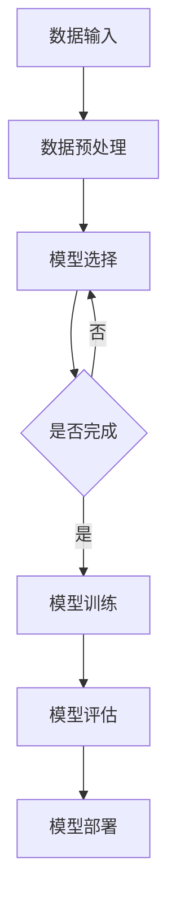

                 

## 文章标题

# AI编程语言的安全性考量

关键词：AI编程语言，安全性，漏洞，威胁，措施，测试

摘要：随着人工智能技术的快速发展，AI编程语言成为开发者实现智能应用的核心工具。然而，AI编程语言在带来便捷的同时，也带来了新的安全挑战。本文将详细探讨AI编程语言的安全性考量，分析其安全威胁、安全措施和安全性测试方法，为开发者提供有效的安全策略和最佳实践。

### 第1章 引言

#### 1.1 背景介绍

AI编程语言作为人工智能技术的重要组成部分，近年来取得了显著的发展。它们提供了简洁高效的语法和丰富的库函数，使得开发者能够更加便捷地实现复杂的机器学习任务。随着AI编程语言的应用范围不断扩大，其安全性问题也逐渐引起了广泛关注。

AI编程语言的重要性不仅体现在其技术层面，更体现在其对社会、经济和生活的深远影响。在医疗、金融、交通、教育等领域，AI编程语言的应用极大地提升了工作效率和决策质量。然而，随着AI技术的普及，安全威胁和风险也不断涌现，给用户和数据安全带来了巨大挑战。

#### 1.2 安全性考量的重要性

在AI编程语言的应用过程中，安全性考量至关重要。安全性问题不仅影响系统的正常运行，还可能导致数据泄露、隐私侵犯和财产损失等严重后果。因此，对AI编程语言的安全性进行深入分析，采取有效的安全措施，是保障系统稳定性和用户信任的关键。

安全性考量的重要性体现在以下几个方面：

1. **数据保护**：AI编程语言处理的大量数据，包括个人隐私信息和敏感数据。确保这些数据的安全传输和存储，防止泄露和滥用，是安全性的核心任务。

2. **隐私保护**：随着人工智能技术的发展，隐私问题日益突出。通过合理的安全设计，可以有效防止个人隐私信息的泄露，保障用户权益。

3. **系统稳定**：AI编程语言的安全问题可能导致系统崩溃、功能失效，甚至被恶意利用。加强安全性考量，可以提高系统的可靠性和稳定性。

4. **法律法规遵从**：随着各国对数据安全的重视，相关法律法规逐渐完善。遵守法律法规，是企业在数据安全和隐私保护方面的重要责任。

#### 1.3 本书目标与结构

本书旨在为开发者提供全面的安全指导，帮助其理解和应对AI编程语言的安全性挑战。本书将分为以下几个部分：

1. **第1章 引言**：介绍AI编程语言的背景和安全性的重要性。

2. **第2章 AI编程语言基础**：介绍AI编程语言的基本概念和架构。

3. **第3章 AI编程语言的安全性挑战**：分析AI编程语言面临的安全威胁和漏洞。

4. **第4章 AI编程语言的安全措施**：介绍AI编程语言的安全措施和最佳实践。

5. **第5章 AI编程语言的安全性测试**：探讨AI编程语言的安全性测试方法和技术。

6. **第6章 安全性考量在AI编程语言中的应用**：分析AI编程语言在各个领域的安全性实践。

7. **第7章 结论与展望**：总结本书的核心内容，展望AI编程语言安全性的未来发展方向。

通过本书的阅读，开发者可以系统地了解AI编程语言的安全性考量，掌握有效的安全策略和测试方法，为构建安全可靠的AI应用奠定坚实基础。

## 第2章 AI编程语言基础

### 2.1 AI编程语言概述

AI编程语言是专门为人工智能任务设计的一套编程工具，它们通过抽象的语法和语义，使得开发者能够高效地实现复杂的机器学习模型和算法。与传统的编程语言相比，AI编程语言具有以下几个显著特点：

1. **高层次的抽象**：
   AI编程语言提供了一种高级的抽象，使得开发者可以专注于算法的逻辑和功能，而无需担心底层实现的细节。这种抽象简化了编程过程，提高了开发效率。

2. **丰富的库函数**：
   AI编程语言通常内置了丰富的库函数和模块，涵盖了各种机器学习算法和数据处理工具。这些库函数使得开发者可以快速集成和实现复杂的AI功能。

3. **动态性**：
   AI编程语言通常支持动态类型和动态绑定，这为机器学习算法的开发提供了灵活性。开发者可以快速修改和调整代码，以适应不同的训练数据和任务需求。

4. **易用性**：
   AI编程语言的设计通常注重用户友好性，提供了简洁的语法和易于理解的错误提示，降低了学习曲线。

AI编程语言可以分为以下几类：

1. **通用机器学习语言**：
   这类语言提供了广泛的机器学习算法和工具，适用于各种类型的机器学习任务。例如，Python、R和Julia等。

2. **专用机器学习语言**：
   这类语言为特定的机器学习任务或领域提供了优化的编程环境。例如，MATLAB、RapidMiner和Weka等。

3. **深度学习框架**：
   深度学习框架如TensorFlow、PyTorch和Keras等，提供了高度优化的计算图和动态计算能力，使得深度学习模型的开发变得更加简便和高效。

### 2.2 AI编程语言的架构与设计

AI编程语言的架构和设计原则旨在提供高效、灵活和安全的机器学习开发环境。以下是AI编程语言架构与设计的一些关键要素：

1. **模块化与可扩展性**：
   AI编程语言通常采用模块化的设计，使得开发者可以方便地扩展和定制功能。模块化设计不仅提高了代码的可维护性，还促进了社区贡献和代码共享。

2. **动态计算图**：
   动态计算图是深度学习框架的核心特征，它允许开发者通过构建计算图来定义复杂的计算过程。动态计算图可以优化计算效率，支持并行计算和GPU加速。

3. **自动化优化**：
   AI编程语言通常集成了多种自动化优化技术，如自动微分、内存优化和代码生成。这些技术可以显著提高算法的运行效率和资源利用率。

4. **高层次的抽象**：
   AI编程语言通过高层次的抽象，使得开发者可以以接近自然语言的方式编写代码。这种抽象不仅提高了开发效率，还减少了错误发生的概率。

5. **集成开发环境**：
   AI编程语言通常提供了强大的集成开发环境（IDE），包括代码编辑器、调试工具和可视化工具。这些工具可以极大地提升开发者的工作效率。

### 2.3 AI编程语言的核心功能

AI编程语言的核心功能是其机器学习能力的体现。以下是一些关键功能：

1. **数据处理**：
   AI编程语言提供了丰富的数据处理工具，包括数据清洗、数据归一化和特征提取。这些工具可以帮助开发者处理大规模和多样化的数据集。

2. **机器学习模型训练**：
   AI编程语言支持各种机器学习模型的训练，包括监督学习、无监督学习和强化学习。开发者可以使用这些模型进行预测、分类和决策。

3. **深度学习**：
   AI编程语言通过深度学习框架提供了强大的深度学习功能。这些功能包括前馈神经网络、卷积神经网络（CNN）和递归神经网络（RNN）等。

4. **模型评估与优化**：
   AI编程语言提供了模型评估和优化的工具，包括准确率、召回率、F1分数和AUC等指标。开发者可以使用这些工具来评估和改进模型的性能。

5. **模型部署**：
   AI编程语言支持将训练好的模型部署到生产环境中，包括通过API接口提供服务、嵌入到应用程序中以及实时更新模型。

通过上述核心功能，AI编程语言为开发者提供了强大的工具，使他们能够轻松实现各种复杂的机器学习任务，从数据预处理到模型部署，极大地提高了开发效率和系统性能。

### 2.4 Mermaid流程图

以下是一个简单的Mermaid流程图，展示了AI编程语言的基本工作流程：



在这个流程图中，数据输入是整个过程的起点，通过数据预处理步骤准备数据，然后选择合适的模型进行训练。一旦模型训练完成，会进行评估，最后将模型部署到生产环境中进行实际应用。

通过这个简化的流程图，我们可以更清晰地理解AI编程语言的工作原理和各个步骤之间的关系，为后续章节的分析和讨论提供了基础。

## 第3章 AI编程语言的安全性挑战

随着AI编程语言的广泛应用，其安全性问题也日益凸显。本章节将深入探讨AI编程语言面临的主要安全挑战，包括安全漏洞、攻击类型和潜在风险。

### 3.1 安全漏洞与攻击类型

AI编程语言的安全漏洞主要源于以下几个方面：

1. **代码注入**：
   注入攻击是AI编程语言中最常见的安全威胁之一。攻击者通过在输入数据中注入恶意代码，可以篡改模型的行为或窃取敏感数据。常见的注入攻击包括SQL注入和OS命令注入。

2. **代码执行风险**：
   AI编程语言中的某些库函数和工具可能存在执行未授权代码的风险。例如，不当的命令执行或函数调用可能导致恶意代码的执行，进而对系统造成破坏。

3. **数据泄露**：
   AI编程语言在处理大规模数据时，可能存在数据泄露的风险。敏感数据未经加密或在传输过程中被截获，可能导致用户隐私受到侵犯。

4. **模型篡改**：
   AI模型本身可能成为攻击目标。通过篡改模型的输入数据或参数，攻击者可以操控模型的预测结果，从而对决策过程造成不利影响。

5. **隐私侵犯**：
   在AI编程语言的应用过程中，用户隐私保护问题日益严峻。例如，人脸识别系统可能被用于非法监控，医疗数据泄露可能导致患者隐私受到侵犯。

常见的攻击类型包括：

1. **分布式拒绝服务（DDoS）攻击**：
   攻击者通过大量无效请求占用系统的计算资源，导致系统无法正常服务其他用户。

2. **中间人攻击（Man-in-the-Middle, MitM）**：
   攻击者在通信过程中拦截和篡改数据，窃取敏感信息。

3. **恶意代码传播**：
   攻击者通过植入恶意软件，如病毒、木马和勒索软件，破坏系统的稳定性和数据完整性。

4. **跨站脚本攻击（Cross-Site Scripting, XSS）**：
   攻击者通过在网页中注入恶意脚本，窃取用户的会话信息或执行恶意操作。

5. **社会工程学攻击**：
   攻击者利用人类的心理弱点，通过欺骗、伪装等手段获取系统的访问权限或敏感信息。

### 3.2 AI编程语言中的安全威胁

AI编程语言中的安全威胁可以从以下几个方面进行分类：

1. **技术层面**：
   技术层面的威胁主要包括代码漏洞、库函数漏洞和系统配置漏洞。例如，不当的输入验证可能导致代码注入攻击，不安全的默认配置可能使系统容易受到攻击。

2. **数据层面**：
   数据层面的威胁主要包括数据泄露、数据篡改和数据滥用。例如，未经加密的数据在传输过程中可能被截获，敏感数据在存储过程中可能被窃取。

3. **模型层面**：
   模型层面的威胁主要包括模型篡改、模型泄露和模型滥用。例如，通过篡改输入数据可以操控模型的预测结果，模型泄露可能导致攻击者获取敏感信息。

4. **基础设施层面**：
   基础设施层面的威胁主要包括网络攻击、服务器攻击和物理安全威胁。例如，网络攻击可能导致系统瘫痪，服务器攻击可能导致数据泄露，物理安全威胁可能导致设备被盗或损坏。

### 3.3 恶意使用与滥用风险

AI编程语言的恶意使用和滥用风险主要表现在以下几个方面：

1. **AI武器化**：
   AI编程语言被用于开发各种AI武器，如自动化攻击工具、网络钓鱼软件和自动化恶意软件。这些AI武器具有高度的破坏性和针对性，可以迅速对目标系统造成严重损害。

2. **自动化欺诈**：
   AI编程语言被用于自动化欺诈活动，如诈骗、身份盗用和金融欺诈。通过机器学习算法，攻击者可以高效地识别和利用系统的漏洞，进行大规模的欺诈行为。

3. **隐私侵犯**：
   AI编程语言被用于大规模的数据收集和用户行为分析，可能导致用户隐私受到严重侵犯。例如，通过分析用户的社交媒体活动，攻击者可以推断用户的个人喜好和习惯，进行精准的诈骗或推销。

4. **自动化监控**：
   AI编程语言被用于自动化监控和数据分析，可能导致用户的隐私权和自由受到限制。例如，在政治和商业领域，AI技术被用于监视和监控特定群体，从而实现不正当的权力和控制。

通过本章节的分析，我们可以看到AI编程语言在带来便捷和高效的同时，也带来了诸多安全挑战。了解这些安全威胁和风险，对于开发者来说至关重要，只有通过采取有效的安全措施，才能确保AI编程语言的稳定性和安全性。

### 3.4 数学公式与伪代码

在分析AI编程语言的安全性时，理解其中的数学模型和算法是至关重要的。以下是一些常用的数学公式和伪代码，用于描述AI编程语言中的关键算法和概念。

#### 数学公式

1. **线性回归**：
   线性回归的预测公式如下：
   $$ y = \beta_0 + \beta_1x + \epsilon $$
   其中，\( y \) 是输出值，\( x \) 是输入特征，\( \beta_0 \) 和 \( \beta_1 \) 是模型参数，\( \epsilon \) 是误差项。

2. **损失函数**：
   在机器学习中，常用的损失函数包括均方误差（MSE）：
   $$ \text{MSE} = \frac{1}{n} \sum_{i=1}^{n} (y_i - \hat{y}_i)^2 $$
   其中，\( n \) 是样本数量，\( y_i \) 是实际输出，\( \hat{y}_i \) 是预测输出。

3. **梯度下降**：
   梯度下降是一种优化算法，用于最小化损失函数：
   $$ \beta = \beta - \alpha \nabla_\beta J(\beta) $$
   其中，\( \beta \) 是模型参数，\( \alpha \) 是学习率，\( \nabla_\beta J(\beta) \) 是损失函数关于参数的梯度。

#### 伪代码

以下是一些常用的机器学习算法的伪代码：

1. **随机梯度下降（SGD）**：
   ```plaintext
   for each sample (x, y) in dataset:
       gradient = compute_gradient(loss_function(x, y, parameters))
       update_parameters(parameters, learning_rate * gradient)
   ```

2. **多层感知机（MLP）**：
   ```plaintext
   initialize parameters
   for epoch in 1 to max_epochs:
       for each sample (x, y) in dataset:
           output = forward_pass(x, parameters)
           error = loss_function(y, output)
           backward_pass(output, error, parameters)
           update_parameters(parameters, learning_rate)
   ```

3. **卷积神经网络（CNN）**：
   ```plaintext
   initialize parameters
   for epoch in 1 to max_epochs:
       for each image in dataset:
           output = convolve(image, filters, parameters)
           output = activate(output, activation_function)
           error = loss_function(label, output)
           backward_pass(output, error, parameters)
           update_parameters(parameters, learning_rate)
   ```

通过上述数学公式和伪代码，我们可以更深入地理解AI编程语言中的关键算法和概念。这些公式和代码不仅帮助我们分析算法的性能和效果，还为安全分析提供了理论依据。在后续章节中，我们将进一步探讨如何利用这些理论和工具来评估和增强AI编程语言的安全性。

### 第4章 AI编程语言的安全措施

在了解了AI编程语言面临的安全挑战后，接下来我们将讨论一系列安全措施，以增强AI编程语言的安全性。这些措施涵盖了从编程实践到密码学应用，再到访问控制和权限管理的各个方面。

#### 4.1 安全编程实践

安全编程实践是确保AI编程语言安全性的基础。以下是一些关键的安全编程实践：

1. **输入验证**：
   在处理用户输入时，必须进行严格的验证，以防止注入攻击。例如，对于SQL数据库操作，应使用参数化查询，避免直接拼接用户输入。

   ```python
   # 安全的SQL查询
   cursor.execute("SELECT * FROM users WHERE id = %s", (user_id,))
   ```

2. **输出过滤**：
   在输出显示用户数据时，应进行适当的过滤，以防止跨站脚本攻击（XSS）。例如，使用HTML实体编码将特殊字符转换为HTML实体，防止恶意脚本执行。

   ```python
   # 输出过滤，防止XSS
   print(html.escape(user_input))
   ```

3. **错误处理**：
   在程序中，应妥善处理各种错误，避免错误信息泄露敏感信息。例如，使用自定义的错误页面，避免显示详细的错误堆栈信息。

4. **依赖管理**：
   对于使用的第三方库和依赖项，应定期更新，以修复已知的安全漏洞。使用依赖项扫描工具，如Snyk或OWASP Dependency-Check，可以帮助识别潜在的安全风险。

5. **代码审计**：
   定期进行代码审计，特别是在关键模块和功能点，以发现潜在的安全漏洞。代码审计可以由内部团队或外部安全专家进行。

#### 4.2 密码学在AI编程语言中的应用

密码学是确保数据安全传输和存储的关键技术。以下是一些在AI编程语言中的应用：

1. **数据加密**：
   对敏感数据进行加密，确保数据在传输和存储过程中不被窃取或篡改。常用的加密算法包括AES、RSA等。

   ```python
   # 数据加密
   cipher = Cipher(algorithms='AES', mode=MODE_CBC, key=key)
   encrypted_data = cipher.encrypt(data)
   ```

2. **数字签名**：
   使用数字签名技术，确保数据的完整性和来源的可信性。数字签名可以防止数据被篡改，并验证发送者的身份。

   ```python
   # 数字签名
   signature = sign(data, private_key)
   ```

3. **证书管理**：
   在使用HTTPS等协议时，应使用可信的数字证书，确保数据传输的安全。定期更新证书，以避免证书过期或被篡改。

#### 4.3 访问控制与权限管理

访问控制和权限管理是防止未经授权访问和操作系统资源的重要手段。以下是一些关键策略：

1. **身份验证**：
   使用强身份验证机制，如双因素认证（2FA），确保用户身份的真实性。

2. **最小权限原则**：
   根据最小权限原则，用户和程序应仅拥有完成任务所需的最低权限。例如，运行服务器的进程应具有最低权限，以防止恶意行为。

3. **权限分配**：
   对用户和程序进行适当的权限分配，确保每个用户和程序仅能访问和操作其授权的资源。

   ```python
   # 权限分配
   user_group.add_permission(user, 'read', '/data')
   ```

4. **审计日志**：
   记录所有访问和操作日志，以便在发生安全事件时进行追踪和调查。

#### 4.4 安全架构与设计原则

1. **安全分层设计**：
   将系统的不同功能模块进行安全分层设计，确保每个层的安全机制独立且有效。例如，将数据层、业务逻辑层和表现层分开处理，确保每个层的安全问题得到有效控制。

2. **安全隔离**：
   在多租户环境中，确保不同用户或应用程序之间的数据隔离和安全隔离。

3. **安全监控**：
   使用安全监控工具，实时监控系统的安全状态，及时发现和响应潜在的安全威胁。

通过上述安全措施，AI编程语言可以显著提高其安全性，减少安全漏洞和威胁。开发者应在设计和开发过程中严格执行这些安全实践，确保AI编程语言的安全和可靠性。

### 4.5 具体案例分析

以下是一些AI编程语言中的具体案例分析，展示了如何在实际项目中应用安全措施：

#### 案例一：人脸识别系统的数据保护

- **问题**：人脸识别系统需要处理大量的个人身份信息，存在数据泄露和隐私侵犯的风险。
- **解决方案**：
  - **数据加密**：使用AES加密算法对存储的人脸数据进行加密，确保数据在数据库中的安全性。
  - **访问控制**：采用基于角色的访问控制（RBAC），确保只有授权用户才能访问和处理人脸数据。
  - **数据去识别**：在数据分析和测试过程中，使用数据去识别技术，如面部遮挡和模糊化，减少数据泄露的风险。

#### 案例二：智能医疗诊断系统的安全设计

- **问题**：智能医疗诊断系统需要处理患者的敏感医疗信息，确保数据安全和患者隐私。
- **解决方案**：
  - **多层加密**：在数据传输过程中，使用TLS协议确保数据传输的安全。在数据存储时，使用AES加密存储。
  - **访问控制**：实现精细的访问控制，根据用户的角色和职责，限制其对医疗数据的访问权限。
  - **安全审计**：记录所有数据访问和操作日志，定期审计和监控，及时发现和处理异常行为。

#### 案例三：金融欺诈检测系统

- **问题**：金融欺诈检测系统面临恶意攻击和数据篡改的风险，可能影响系统的准确性和可靠性。
- **解决方案**：
  - **动态加密**：在处理敏感交易数据时，采用动态加密技术，实时加密数据，防止数据在传输和存储过程中被截获。
  - **安全模型训练**：采用多模型融合和异常检测技术，提高系统的鲁棒性和抗攻击能力。
  - **安全测试**：定期进行安全测试和漏洞扫描，发现和修复潜在的安全漏洞。

通过以上案例，我们可以看到，在AI编程语言的实际应用中，结合具体场景采取有效的安全措施，是保障系统安全性的关键。开发者应在项目设计和开发过程中，充分考虑安全性，采取全方位的安全策略，确保系统的稳定性和可靠性。

### 4.6 总结与最佳实践

通过本章的讨论，我们可以得出以下结论：

1. **安全编程实践**是确保AI编程语言安全性的基础，包括输入验证、输出过滤、错误处理和代码审计等。
2. **密码学**在数据加密、数字签名和证书管理等方面发挥着重要作用，是保护数据安全和完整性不可或缺的技术。
3. **访问控制与权限管理**是防止未经授权访问和操作系统资源的关键，确保系统的安全性和合规性。
4. **具体案例分析**展示了如何在实际项目中应用安全措施，提供了宝贵的实践经验。

为了进一步提升AI编程语言的安全性，开发者应遵循以下最佳实践：

1. **持续更新**：定期更新第三方库和依赖项，修复已知的安全漏洞。
2. **代码审查**：在代码开发和维护过程中，进行定期的代码审查和安全测试。
3. **培训与意识**：加强对开发团队的安全培训，提高全体成员的安全意识和防范能力。
4. **合规性检查**：确保系统符合相关法律法规和行业标准，如GDPR和HIPAA等。
5. **持续监控**：使用安全监控工具，实时监控系统的安全状态，及时响应潜在的安全威胁。

通过遵循这些最佳实践，开发者可以构建安全、可靠且具有高防护能力的AI编程语言系统，确保其在实际应用中的稳定性和安全性。

### 第5章 AI编程语言的安全性测试

安全性测试是确保AI编程语言和其实现的安全性的关键步骤。通过全面的测试，可以识别和修复潜在的安全漏洞，提高系统的防御能力。以下是AI编程语言安全性测试的几个关键方面。

#### 5.1 安全测试的重要性

在AI编程语言的应用过程中，安全性测试具有以下重要性：

1. **漏洞识别**：通过安全性测试，可以发现系统中的漏洞，包括代码注入、数据泄露、权限漏洞等，从而及时进行修复。
2. **性能验证**：安全性测试不仅关注系统的安全性，还涉及性能验证。通过测试，确保系统在承受攻击时仍能保持良好的性能和稳定性。
3. **合规性检查**：许多行业和地区都有特定的安全法规和标准。通过安全性测试，可以验证系统是否符合这些法规和标准，确保合规性。
4. **增强用户信心**：通过安全性测试，可以证明系统具备足够的防御能力，增强用户对系统的信任和依赖。

#### 5.2 自动化安全测试工具

自动化安全测试工具是提高安全性测试效率和覆盖范围的重要手段。以下是一些常用的自动化安全测试工具：

1. **静态代码分析（SAST）工具**：
   - **SonarQube**：一款功能强大的静态代码分析工具，能够检测代码中的潜在漏洞和编程错误。
   - **Checkmarx**：提供全面的静态应用安全测试，能够识别各种类型的安全漏洞。
   - **Fortify**：支持多种编程语言，提供高效的代码漏洞检测。

2. **动态应用安全测试（DAST）工具**：
   - **OWASP ZAP**：一款开源的动态应用安全测试工具，能够自动发现各种类型的安全漏洞，并提供详细的漏洞报告。
   - **Burp Suite**：支持多种Web应用程序安全测试功能，包括代理、扫描和漏洞利用。
   - **Astra Security**：提供自动化漏洞扫描和漏洞管理功能，支持各种AI编程语言的Web应用测试。

3. **渗透测试工具**：
   - **Metasploit**：一款流行的渗透测试框架，提供大量的渗透测试模块和工具，用于验证系统的安全性。
   - **Nessus**：一款专业的漏洞扫描工具，能够自动发现和报告系统中的漏洞。
   - **Nmap**：一款网络探测和安全扫描工具，用于发现网络中的开放端口和潜在的安全漏洞。

通过使用这些自动化安全测试工具，开发者可以大幅提高安全性测试的覆盖范围和效率，确保系统的各个方面都经过严格的安全测试。

#### 5.3 安全静态代码分析

安全静态代码分析（SAST）是检测AI编程语言代码中潜在安全漏洞的一种有效方法。SAST工具通过分析源代码，不运行程序，发现代码中的安全漏洞。以下是一些关键步骤和注意事项：

1. **代码预处理**：
   在进行SAST之前，需要对代码进行适当的预处理，包括格式化、删除注释和无关代码等。这有助于提高分析效率和准确性。

2. **配置SAST工具**：
   根据项目需求和安全标准，配置SAST工具的参数，如扫描语言、漏洞库、扫描深度等。例如，SonarQube支持多种编程语言的扫描，可以根据项目需求选择适当的配置。

3. **执行扫描**：
   运行SAST工具对代码库进行扫描，工具会自动分析代码，识别潜在的安全漏洞。例如，Checkmarx可以在扫描过程中生成详细的漏洞报告，包括漏洞类型、位置和修复建议。

4. **分析报告**：
   分析SAST工具生成的漏洞报告，识别高优先级的漏洞，并进行修复。同时，应记录已修复的漏洞和未修复的漏洞，以便后续跟踪和管理。

5. **迭代扫描**：
   在代码更新后，定期重新执行SAST扫描，确保新代码中的潜在漏洞得到及时发现和修复。

#### 5.4 动态分析与应用测试

动态分析与应用测试（DAST）是另一种重要的安全性测试方法，它通过运行程序来检测潜在的安全漏洞。DAST工具在程序运行时捕获数据流和控制流，识别安全漏洞。以下是一些关键步骤和注意事项：

1. **准备测试环境**：
   在进行DAST之前，需要准备一个与生产环境尽可能一致的测试环境，包括网络配置、数据库和应用程序等。

2. **选择DAST工具**：
   根据项目需求和测试环境，选择合适的DAST工具。例如，OWASP ZAP适用于Web应用的安全测试，Burp Suite则提供了全面的Web应用安全测试功能。

3. **执行扫描**：
   运行DAST工具对应用程序进行扫描，工具会自动发送请求、捕获响应并分析数据，识别潜在的安全漏洞。DAST工具通常会生成详细的报告，包括漏洞类型、位置和攻击示例。

4. **分析报告**：
   分析DAST工具生成的报告，识别高优先级的漏洞，并评估其潜在风险。针对发现的漏洞，制定修复计划，并进行修复。

5. **行为监控与异常检测**：
   在DAST测试过程中，可以结合行为监控和异常检测技术，实时监控应用程序的行为，发现潜在的安全威胁。

通过静态代码分析和动态分析与应用测试，开发者可以全面评估AI编程语言的安全性，及时发现和修复漏洞，确保系统的稳定性和可靠性。在后续的开发和测试过程中，应持续进行安全性测试，确保系统的长期安全。

### 第6章 安全性考量在AI编程语言中的应用

#### 6.1 企业级应用案例分析

在企业级应用中，AI编程语言的安全性考量至关重要。以下是一些具体案例分析，展示了如何在企业环境中应用安全措施来保护AI系统。

##### 案例一：金融机构的智能风控系统

- **问题**：金融机构需要处理大量的客户数据和交易数据，同时面临黑客攻击和数据泄露的风险。
- **解决方案**：
  - **数据加密**：使用AES加密算法对存储的客户数据和交易数据加密，确保数据在数据库中的安全性。
  - **多重身份验证**：实施双因素身份验证（2FA），确保只有授权用户才能访问系统。
  - **访问控制**：采用基于角色的访问控制（RBAC），根据用户角色限制其对系统和数据的访问权限。
  - **自动化安全测试**：定期使用SAST和DAST工具对系统进行自动化安全测试，及时发现和修复漏洞。

##### 案例二：医疗健康领域的智能诊断系统

- **问题**：医疗健康领域的智能诊断系统需要处理敏感的医疗数据，确保数据隐私和患者安全。
- **解决方案**：
  - **数据去识别**：在数据处理和分析过程中，使用数据去识别技术（如面部遮挡和模糊化）减少数据泄露的风险。
  - **安全隔离**：采用容器化和虚拟化技术，确保不同数据和应用程序之间的安全隔离。
  - **安全审计**：记录所有数据访问和操作日志，定期进行安全审计，确保系统符合相关法规和标准。

##### 案例三：零售行业的智能供应链管理系统

- **问题**：零售行业的智能供应链管理系统需要处理大量的交易数据和库存信息，确保数据安全和供应链的稳定性。
- **解决方案**：
  - **动态加密**：在数据传输过程中，使用TLS协议加密数据，确保数据传输的安全。
  - **访问控制与权限管理**：根据员工的角色和职责，限制其对系统和数据的访问权限，确保数据安全和隐私。
  - **实时监控与报警**：使用安全监控工具，实时监控系统的安全状态，及时发现和响应潜在的安全威胁。

#### 6.2 开源社区与安全性合作

开源社区在AI编程语言的发展中扮演着重要角色。通过协作和共享，开源社区能够共同推动技术的进步和安全性提升。以下是一些开源社区在安全性合作方面的实践：

1. **漏洞报告和修复**：
   开源社区鼓励开发者及时报告和修复安全漏洞。例如，GitHub和GitLab提供了漏洞报告平台，开发者可以在这些平台上提交漏洞报告，并获得及时的修复。

2. **安全审核和代码审查**：
   开源项目通常会进行代码审查和安全审核，确保代码质量和安全性。社区成员可以自愿参与代码审查，共同发现和修复潜在的安全漏洞。

3. **安全贡献奖励**：
   一些开源项目会为提供安全贡献的开发者提供奖励，如现金奖励或社区荣誉。这种激励机制鼓励更多开发者关注和参与安全工作。

4. **最佳实践分享**：
   开源社区通过分享最佳实践和安全性建议，帮助开发者了解和掌握有效的安全措施。例如，安全博客、技术讨论组和会议等都是分享经验的重要渠道。

#### 6.3 AI编程语言的未来发展趋势

随着人工智能技术的不断演进，AI编程语言的安全性考量也将面临新的挑战和机遇。以下是一些未来发展趋势：

1. **面向安全的语言特性**：
   新一代AI编程语言可能会引入更多面向安全的语言特性，如类型系统增强、内存安全机制和异常处理等，以提高代码的安全性和可靠性。

2. **自动化安全工具的普及**：
   自动化安全工具将在AI编程语言的应用中变得更加普及和智能化。例如，自动化代码分析工具和智能安全测试工具将能够更有效地识别和修复安全漏洞。

3. **隐私保护技术的集成**：
   隐私保护技术将在AI编程语言中得到更多关注和应用。例如，差分隐私和联邦学习等技术将被集成到AI编程语言中，以增强数据隐私保护。

4. **安全合规性标准**：
   随着各国对数据安全和隐私保护的重视，AI编程语言将面临更多的安全合规性要求。开发者需要确保其系统符合相关法规和标准，如GDPR和CCPA等。

通过企业级应用案例分析、开源社区合作和未来发展趋势的探讨，我们可以看到AI编程语言在安全性考量方面的挑战和机遇。只有通过持续的安全实践和技术创新，才能确保AI编程语言的长期安全和可靠。

### 第7章 结论与展望

#### 7.1 总结

随着人工智能技术的飞速发展，AI编程语言已成为实现各种智能应用的核心工具。然而，AI编程语言在带来便捷和高效的同时，也带来了新的安全挑战。本文从多个角度探讨了AI编程语言的安全性考量，包括其安全性挑战、安全措施和安全性测试方法。

首先，我们介绍了AI编程语言的基本原理和架构，分析了其核心功能和特点。然后，我们深入探讨了AI编程语言面临的主要安全威胁，如代码注入、数据泄露和模型篡改等。接着，我们提出了一系列安全措施，包括安全编程实践、密码学应用、访问控制与权限管理等，并提供了具体的案例分析。

最后，我们讨论了AI编程语言的安全性测试，强调了静态代码分析和动态分析的重要性，并介绍了自动化安全测试工具的使用。通过这些措施，开发者可以构建安全、可靠且具有高防护能力的AI编程语言系统。

#### 7.2 未来研究方向

尽管本文对AI编程语言的安全性考量进行了全面探讨，但仍有许多研究方向值得进一步探索：

1. **面向安全的编程语言特性**：
   新一代AI编程语言可以引入更多面向安全的语言特性，如自动内存管理和类型检查，以减少安全漏洞的出现。

2. **自动化安全工具的改进**：
   未来可以开发更智能、高效的自动化安全工具，以识别和修复更复杂的安全漏洞。例如，结合机器学习和深度学习技术，提高自动化安全测试的准确性和覆盖范围。

3. **隐私保护技术**：
   隐私保护技术将在AI编程语言中发挥越来越重要的作用。研究者可以探索新的隐私保护方法，如差分隐私和联邦学习，并整合到AI编程语言中，以保护用户隐私。

4. **合规性标准和法规**：
   随着各国对数据安全和隐私保护的重视，开发者需要关注和遵守相关的合规性标准和法规。研究如何平衡安全与合规性，确保AI编程语言的长期发展。

#### 7.3 安全性考量在AI编程语言中的挑战与机遇

安全性考量在AI编程语言中面临以下挑战：

1. **复杂性**：
   AI编程语言的处理过程复杂，涉及大量的数据和算法。确保系统安全性需要深入理解其工作机制。

2. **动态性**：
   AI编程语言在开发过程中具有很高的灵活性，这可能导致安全配置和管理的不一致性。

3. **不断演进的技术**：
   随着新技术的不断涌现，AI编程语言的安全性也需要不断更新和改进。

然而，这些挑战也带来了机遇：

1. **技术创新**：
   安全性的需求推动了新技术的研发和应用，如自动化安全工具和隐私保护技术。

2. **市场机会**：
   随着AI编程语言的应用场景不断扩大，安全性需求也为安全产品和服务的市场提供了巨大的机会。

3. **合作与共享**：
   开源社区和企业之间的合作将推动AI编程语言的安全性发展，共同应对安全挑战。

综上所述，AI编程语言的安全性考量具有重要意义。通过深入研究和持续努力，我们可以构建更加安全、可靠且具有高防护能力的AI编程语言系统，为未来的智能应用奠定坚实基础。

### 作者信息

作者：AI天才研究院/AI Genius Institute & 禅与计算机程序设计艺术 /Zen And The Art of Computer Programming

AI天才研究院专注于人工智能和计算机编程领域的研究与教育。我们的目标是推动AI技术的发展，培养下一代AI领域的人才。同时，我们致力于将禅宗哲学与计算机编程相结合，探索一种更加自然、简洁和高效的编程方法，以实现技术的最高境界。

在《禅与计算机程序设计艺术》一书中，我们提出了许多独特的见解和方法，旨在帮助开发者更好地理解计算机编程的本质，提高编程技能和创造力。通过融合禅宗哲学和计算机科学的理念，我们相信可以为现代编程带来新的启示和突破。

作为AI天才研究院的专家，我们不仅关注技术的创新和突破，更注重技术的普及和应用。我们希望本文能够为广大的开发者提供有价值的参考和指导，共同推动AI编程语言的稳定发展和广泛应用。

