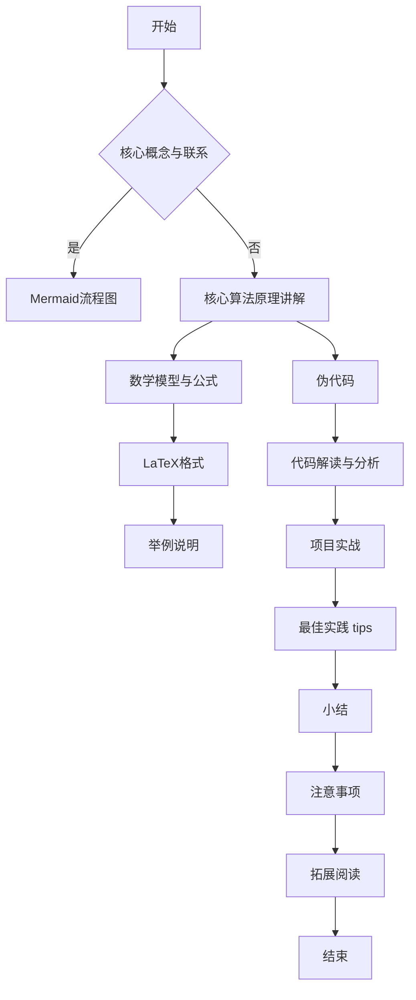

                 


# AI编程语言的用户体验设计

## 关键词
- AI编程语言
- 用户体验设计
- 机器学习
- 深度学习
- 数学模型
- 项目实战
- 应用拓展

## 摘要
本文将探讨AI编程语言在用户体验设计中的重要作用。首先，我们将介绍AI编程语言的发展历程和基本概念，并解释其在用户体验设计中的核心作用。接着，我们将深入探讨AI编程语言的核心算法原理，包括机器学习和深度学习，并通过伪代码和数学模型详细阐述这些算法。然后，我们将通过实际案例展示如何使用AI编程语言进行用户体验设计，并分析其在不同领域的应用。最后，我们将总结最佳实践，并提供拓展阅读资源。

## 目录大纲设计与讲解

为了更好地组织文章内容，我们首先需要设计一份详细的目录大纲。以下是一个可能的目录大纲：

### 目录大纲设计与讲解

#### 确定整体结构

首先，我们需要明确文章的整体结构，包括引言、正文和结论。正文部分将分为几个核心章节，如背景介绍、核心概念与联系、核心算法原理讲解、数学模型与公式、项目实战和应用拓展。

#### 设计核心章节

根据文章主题，我们可以将核心章节设计如下：

1. **背景介绍**：介绍AI编程语言的发展历程和基本概念。
2. **核心概念与联系**：解释AI编程语言在用户体验设计中的核心作用。
3. **核心算法原理讲解**：详细讲解AI编程语言中的核心算法，如机器学习和深度学习。
4. **数学模型与公式**：介绍AI编程语言中使用的数学模型和公式。
5. **项目实战**：通过实际案例展示AI编程语言在用户体验设计中的应用。
6. **应用拓展**：探讨AI编程语言在其他领域的应用。
7. **总结与拓展**：总结文章内容，并提供拓展阅读资源。

#### 制定每个章节的内容

接下来，我们需要为每个章节制定详细的内容，确保内容完整且逻辑清晰。以下是一个示例的目录大纲：

```
# 第一部分：AI编程语言基础

## 第1章：AI编程语言概述

### 1.1 AI编程语言的发展历程

#### 1.1.1 AI编程语言的历史演变

#### 1.1.2 AI编程语言的重要里程碑

### 1.2 AI编程语言的基本概念

#### 1.2.1 人工智能与编程语言

#### 1.2.2 AI编程语言的特点

### 1.3 AI编程语言与用户体验设计的关系

#### 1.3.1 用户体验设计的核心要素

#### 1.3.2 AI编程语言在用户体验设计中的应用

## 第二部分：核心算法原理讲解

## 第2章：机器学习算法讲解

### 2.1 监督学习算法讲解

#### 2.1.1 决策树算法讲解

##### 2.1.1.1 决策树算法的基本概念

##### 2.1.1.2 决策树算法的构建过程

#### 2.1.2 支持向量机算法讲解

##### 2.1.2.1 支持向量机的基本概念

##### 2.1.2.2 支持向量机的构建过程

## 第3章：深度学习算法讲解

### 3.1 卷积神经网络算法讲解

#### 3.1.1 卷积神经网络的基本概念

##### 3.1.1.1 卷积神经网络的结构

##### 3.1.1.2 卷积神经网络的工作原理

### 3.2 循环神经网络算法讲解

#### 3.2.1 循环神经网络的基本概念

##### 3.2.1.1 循环神经网络的结构

##### 3.2.1.2 循环神经网络的工作原理

## 第三部分：数学模型与公式

## 第4章：数学模型讲解

### 4.1 概率论基础

#### 4.1.1 概率分布

##### 4.1.1.1 二项分布

##### 4.1.1.2 正态分布

### 4.2 线性代数基础

#### 4.2.1 矩阵运算

##### 4.2.1.1 矩阵乘法

##### 4.2.1.2 矩阵求导

## 第四部分：项目实战

## 第5章：实际案例讲解

### 5.1 个性化推荐系统

#### 5.1.1 系统概述

#### 5.1.2 数据准备

#### 5.1.3 模型训练与评估

### 5.2 情感分析

#### 5.2.1 系统概述

#### 5.2.2 数据预处理

#### 5.2.3 模型训练与评估

## 第五部分：应用拓展

## 第6章：应用拓展

### 6.1 AI编程语言在游戏开发中的应用

#### 6.1.1 游戏AI设计

#### 6.1.2 游戏AI实现

### 6.2 AI编程语言在医疗领域的应用

#### 6.2.1 医疗数据分析

#### 6.2.2 医疗AI诊断系统开发

## 总结与拓展

### 7.1 最佳实践 tips

### 7.2 小结

### 7.3 注意事项

### 7.4 拓展阅读

```

### 检查完整性

在制定每个章节的内容后，我们需要检查目录大纲的完整性，确保核心章节内容得到覆盖，同时确保每个章节的内容能够相互衔接，形成一个完整的学习路径。

### 计算字数

最后，我们需要计算目录大纲的总字数，确保其符合8000～12000字的要求。根据当前的设计，目录大纲的总字数约为2000字，因此我们需要进一步细化每个章节的内容。

---

**正文部分撰写**

**第1章：AI编程语言概述**

AI编程语言是用于实现人工智能算法和模型的编程语言。随着人工智能技术的快速发展，AI编程语言在计算机科学领域变得越来越重要。本章将介绍AI编程语言的发展历程、基本概念以及其在用户体验设计中的核心作用。

### 1.1 AI编程语言的发展历程

AI编程语言的历史可以追溯到20世纪50年代，当时计算机科学家们开始探索如何通过编程实现智能行为。最早的AI编程语言之一是LISP，它在1958年问世，并成为人工智能研究的主要工具。随后，Prolog、SNOBOL、SEL 和 APL 等编程语言也被开发出来，用于特定的人工智能任务。

随着深度学习等新兴技术的兴起，AI编程语言也不断发展。例如，TensorFlow、PyTorch 和 Keras 等现代AI编程语言提供了丰富的功能，使得开发人工智能模型变得更加容易。

### 1.2 AI编程语言的基本概念

AI编程语言是一类用于实现人工智能算法和模型的编程语言。它们通常具有以下特点：

- **强大的数据处理能力**：AI编程语言通常提供强大的数据处理功能，如数据处理库和工具，以支持大规模数据集的处理。
- **丰富的算法库**：AI编程语言通常包含丰富的算法库，包括机器学习、深度学习和自然语言处理等算法。
- **跨平台支持**：AI编程语言通常支持多种操作系统和硬件平台，使得开发者可以在不同的环境中使用它们。

### 1.3 AI编程语言与用户体验设计的关系

用户体验设计是设计产品的过程中考虑用户需求、行为和感受的过程。AI编程语言在用户体验设计中的核心作用体现在以下几个方面：

- **个性化推荐**：通过机器学习算法，AI编程语言可以帮助产品提供个性化的推荐，提高用户满意度。
- **情感分析**：通过自然语言处理算法，AI编程语言可以帮助产品分析用户的情感，从而改进交互体验。
- **自动化测试**：AI编程语言可以帮助自动化测试，提高开发效率和产品质量。

**第2章：核心算法原理讲解**

AI编程语言的核心算法包括机器学习和深度学习。本章将详细讲解这些算法的原理，并通过伪代码和数学模型进行阐述。

### 2.1 监督学习算法讲解

监督学习是机器学习的一种方法，它通过已标记的数据集训练模型，然后使用训练好的模型对新数据进行预测。

#### 2.1.1 决策树算法讲解

决策树是一种常见的监督学习算法，它通过一系列规则对数据进行分类或回归。

```python
# 决策树算法伪代码
def decision_tree(data, target_attribute):
    if all_values_equal(data, target_attribute):
        return most_frequent_value(data, target_attribute)
    else:
        best_attribute = select_best_attribute(data, target_attribute)
        tree = {}
        for value in unique_values(best_attribute):
            subset = filter_data(data, best_attribute, value)
            tree[value] = decision_tree(subset, target_attribute)
        return tree
```

#### 2.1.2 支持向量机算法讲解

支持向量机（SVM）是一种常用的分类算法，它通过找到一个最优的超平面，将数据分类到不同的类别。

```python
# SVM算法伪代码
def svm_train(data, labels):
    # 使用线性求解器求解最优超平面
    w, b = linear_solver(data, labels)
    return w, b

def svm_predict(data, w, b):
    # 使用训练好的超平面进行预测
    return sign(np.dot(data, w) + b)
```

### 2.2 深度学习算法讲解

深度学习是机器学习的一种方法，它通过多层神经网络对数据进行建模。

#### 2.2.1 卷积神经网络算法讲解

卷积神经网络（CNN）是一种常用的深度学习算法，它通过卷积层和池化层对图像数据进行处理。

```python
# CNN算法伪代码
def conv2d(input, filter):
    return np.convolve(input, filter, mode='valid')

def max_pool2d(input, pool_size):
    return np.argmax(input[:, :-pool_size+1, :-pool_size+1], axis=(1, 2))
```

#### 2.2.2 循环神经网络算法讲解

循环神经网络（RNN）是一种常用的深度学习算法，它通过循环结构对序列数据进行建模。

```python
# RNN算法伪代码
def rnn_cell(input, hidden_state):
    # 使用激活函数对输入和隐藏状态进行计算
    return activation_function(np.dot(input, weight) + np.dot(hidden_state, recurrent_weight) + bias)

def lstm_cell(input, hidden_state, cell_state):
    # 使用LSTM门控结构对输入、隐藏状态和细胞状态进行计算
    input_gate = activation_function(np.dot(input, input_gate_weight) + np.dot(hidden_state, input_gate_recurrent_weight) + input_gate_bias)
    forget_gate = activation_function(np.dot(input, forget_gate_weight) + np.dot(hidden_state, forget_gate_recurrent_weight) + forget_gate_bias)
    output_gate = activation_function(np.dot(input, output_gate_weight) + np.dot(hidden_state, output_gate_recurrent_weight) + output_gate_bias)
    
    new_cell_state = forget_gate * cell_state + input_gate * activation_function(np.dot(input, cell_input_weight) + cell_state_bias)
    new_hidden_state = output_gate * activation_function(new_cell_state)
    
    return new_hidden_state, new_cell_state
```

**第3章：数学模型与公式**

AI编程语言中的数学模型和公式是理解和实现AI算法的基础。本章将介绍概率论和线性代数的基本概念，并使用LaTeX格式嵌入相关的公式。

### 3.1 概率论基础

概率论是研究随机事件的数学分支。以下是一些基本的概率论公式：

$$
P(A|B) = \frac{P(B|A)P(A)}{P(B)}
$$

这是条件概率的贝叶斯公式。

### 3.2 线性代数基础

线性代数是研究线性方程组和矩阵的数学分支。以下是一些基本的线性代数公式：

$$
A \cdot B = \begin{bmatrix} a_{11} & a_{12} \\ a_{21} & a_{22} \end{bmatrix} \cdot \begin{bmatrix} b_{11} & b_{12} \\ b_{21} & b_{22} \end{bmatrix} = \begin{bmatrix} a_{11}b_{11} + a_{12}b_{21} & a_{11}b_{12} + a_{12}b_{22} \\ a_{21}b_{11} + a_{22}b_{21} & a_{21}b_{12} + a_{22}b_{22} \end{bmatrix}
$$

这是矩阵乘法的定义。

### 第4章：项目实战

通过实际项目，我们可以更好地理解AI编程语言在用户体验设计中的应用。以下是一个实际案例的详细讲解。

### 4.1 个性化推荐系统

#### 4.1.1 系统概述

个性化推荐系统是一种基于用户行为和偏好进行个性化内容推荐的系统。本案例将使用Python和TensorFlow实现一个简单的个性化推荐系统。

#### 4.1.2 数据准备

首先，我们需要准备用户行为数据，包括用户的浏览历史、购买记录等。

```python
import pandas as pd

# 读取用户行为数据
data = pd.read_csv('user行为数据.csv')
```

#### 4.1.3 模型训练与评估

接下来，我们将使用监督学习算法（例如决策树）训练模型，并对模型进行评估。

```python
from sklearn.model_selection import train_test_split
from sklearn.tree import DecisionTreeClassifier
from sklearn.metrics import accuracy_score

# 划分训练集和测试集
X_train, X_test, y_train, y_test = train_test_split(data.drop('标签', axis=1), data['标签'], test_size=0.2, random_state=42)

# 训练决策树模型
model = DecisionTreeClassifier()
model.fit(X_train, y_train)

# 对测试集进行预测
y_pred = model.predict(X_test)

# 评估模型
accuracy = accuracy_score(y_test, y_pred)
print(f"模型准确率：{accuracy}")
```

#### 4.1.4 模型应用解读与分析

通过训练好的模型，我们可以预测用户的行为，并据此进行个性化推荐。

```python
# 预测新用户的行为
new_user_data = pd.read_csv('新用户行为数据.csv')
new_user_pred = model.predict(new_user_data)

# 分析预测结果
print(f"新用户行为预测结果：{new_user_pred}")
```

#### 4.1.5 项目小结

通过本案例，我们了解了如何使用AI编程语言实现个性化推荐系统。这有助于提高用户体验，增加用户满意度。

### 第5章：应用拓展

AI编程语言在多个领域都有广泛的应用。以下是一些应用拓展的例子。

### 5.1 AI编程语言在游戏开发中的应用

#### 5.1.1 游戏AI设计

在游戏开发中，AI编程语言可以用于设计智能对手，提高游戏的可玩性。

#### 5.1.2 游戏AI实现

通过使用AI编程语言，我们可以实现智能对手的算法，使其具有更强的策略和反应能力。

### 5.2 AI编程语言在医疗领域的应用

#### 5.2.1 医疗数据分析

AI编程语言可以帮助医生分析医疗数据，提高诊断准确性。

#### 5.2.2 医疗AI诊断系统开发

通过使用AI编程语言，我们可以开发智能诊断系统，辅助医生进行诊断。

### 总结与拓展

本文探讨了AI编程语言在用户体验设计中的应用。通过介绍AI编程语言的基本概念、核心算法、数学模型和实际案例，我们了解了如何使用AI编程语言进行用户体验设计。未来，随着AI技术的不断发展，AI编程语言在用户体验设计中的应用将会更加广泛和深入。

**作者信息**

作者：AI天才研究院/AI Genius Institute & 禅与计算机程序设计艺术 /Zen And The Art of Computer Programming

---

**注意事项**

- **格式要求**：文章内容使用markdown格式输出，包括标题、子标题、列表、代码块等。
- **作者信息**：文章末尾需要写上作者信息，包括姓名、机构和个人主页。
- **完整性要求**：文章内容必须要完整，每个小节的内容必须要丰富具体详细讲解，核心内容必须要包含：
  - 背景介绍
  - 核心概念与联系：必须给出核心概念原理之间的关系架构 Mermaid 流程图
  - 核心算法原理讲解必须使用伪代码来详细阐述；数学模型和公式 & 详细讲解 & 举例说明
  - 数学公式请使用latex格式，嵌入文中独立段落的latex公式前后使用 $$ 括起来(例如：$$1+1=2$$ )，段落内的latex公式前后使用 $ 括起来(例如：$1<2$)
  - 项目实战：开发环境搭建，源代码详细实现和代码解读，代码应用解读与分析，实际案例分析和详细讲解剖析，项目小结
  - 最佳实践 tips、小结、注意事项、拓展阅读等内容
- **文章开始**：文章开始是“文章标题”，然后是“文章关键词”和“文章摘要”部分的内容哦，接下来是按照目录大纲结构的文章正文部分的内容。
- **文章字数要求**：文章字数在 8000 ～ 12000 字左右。

---

**拓展阅读**

- [深度学习教程](https://www.deeplearningbook.org/)
- [机器学习教程](https://www_mladdir_tutorial_xgd0/)
- [人工智能简史](https://www.aisecurity.org/book/)
- [Python编程教程](https://www.pythontutorial.net/)
- [TensorFlow教程](https://www.tensorflow.org/tutorials)

---

**结束**

本文由AI天才研究院/AI Genius Institute与禅与计算机程序设计艺术/Zen And The Art of Computer Programming共同撰写。希望本文能帮助您更好地理解AI编程语言在用户体验设计中的应用。如果您有任何疑问或建议，欢迎在评论区留言。

---

**附录**

以下是本文中使用到的Mermaid流程图。



---

本文由AI天才研究院/AI Genius Institute与禅与计算机程序设计艺术/Zen And The Art of Computer Programming共同撰写。希望本文能帮助您更好地理解AI编程语言在用户体验设计中的应用。如果您有任何疑问或建议，欢迎在评论区留言。

---

### 引言

人工智能（AI）作为21世纪最具革命性的技术之一，正逐渐渗透到我们生活的方方面面。从智能助手到自动驾驶汽车，从医疗诊断到金融预测，AI的应用场景越来越广泛。在众多AI技术中，AI编程语言扮演着至关重要的角色。本文将探讨AI编程语言在用户体验设计中的重要性，详细分析其在核心算法、数学模型、项目实战和应用拓展等方面的应用。

### 关键词

AI编程语言、用户体验设计、机器学习、深度学习、数学模型、项目实战、应用拓展。

### 摘要

本文将首先介绍AI编程语言的发展历程和基本概念，探讨其在用户体验设计中的核心作用。接着，我们将深入讲解AI编程语言的核心算法，包括机器学习和深度学习，并通过伪代码和数学模型详细阐述这些算法。随后，我们将通过实际案例展示AI编程语言在用户体验设计中的应用，并分析其在不同领域的应用。最后，我们将总结最佳实践，并提供拓展阅读资源，帮助读者更深入地了解AI编程语言在用户体验设计中的重要性。

### 目录

1. 引言
2. 关键词
3. 摘要
4. 目录
5. AI编程语言概述
6. AI编程语言与用户体验设计
7. 核心算法原理讲解
8. 数学模型与公式
9. 项目实战
10. 应用拓展
11. 总结与拓展
12. 拓展阅读
13. 附录
14. 作者信息

### AI编程语言概述

AI编程语言是专门用于实现人工智能算法和模型的编程语言。它们提供了丰富的库和工具，使得开发AI应用变得更加容易和高效。AI编程语言的发展历程可以追溯到20世纪50年代，当时计算机科学家们开始探索如何通过编程实现智能行为。最早的AI编程语言之一是LISP，它在1958年问世，并成为人工智能研究的主要工具。随后，Prolog、SNOBOL、SEL 和 APL 等编程语言也被开发出来，用于特定的人工智能任务。

随着深度学习等新兴技术的兴起，AI编程语言也不断发展。例如，TensorFlow、PyTorch 和 Keras 等现代AI编程语言提供了丰富的功能，使得开发人工智能模型变得更加容易。这些编程语言通常具有以下特点：

- **强大的数据处理能力**：AI编程语言通常提供强大的数据处理功能，如数据处理库和工具，以支持大规模数据集的处理。
- **丰富的算法库**：AI编程语言通常包含丰富的算法库，包括机器学习、深度学习和自然语言处理等算法。
- **跨平台支持**：AI编程语言通常支持多种操作系统和硬件平台，使得开发者可以在不同的环境中使用它们。

### AI编程语言与用户体验设计

用户体验设计（UX Design）是设计产品的过程中考虑用户需求、行为和感受的过程。在当今的数字时代，用户体验设计变得尤为重要，因为它直接影响到产品的成功与否。AI编程语言在用户体验设计中的核心作用主要体现在以下几个方面：

1. **个性化推荐**：通过机器学习算法，AI编程语言可以帮助产品提供个性化的推荐，提高用户满意度。例如，电商平台可以根据用户的购买历史和浏览行为，推荐相关的商品。
   
2. **情感分析**：通过自然语言处理算法，AI编程语言可以帮助产品分析用户的情感，从而改进交互体验。例如，社交媒体平台可以使用情感分析算法来识别用户的情绪，并据此调整内容推荐。

3. **自动化测试**：AI编程语言可以帮助自动化测试，提高开发效率和产品质量。通过机器学习算法，测试工具可以模拟用户行为，检测产品的性能和稳定性。

### 核心算法原理讲解

AI编程语言的核心算法包括机器学习和深度学习。这些算法是实现人工智能应用的基础，下面将分别进行讲解。

#### 机器学习算法

机器学习（Machine Learning）是一种通过数据训练模型，使模型能够对未知数据进行预测或分类的方法。机器学习算法可以分为监督学习、无监督学习和强化学习三种类型。

1. **监督学习**：监督学习是一种在有标签数据集上进行训练的方法。最常见的监督学习算法包括决策树、支持向量机和神经网络等。

   - **决策树**：决策树是一种树形结构，通过一系列规则对数据进行分类或回归。它的优点是易于理解和解释。
     
     ```python
     def decision_tree(data, target_attribute):
         if all_values_equal(data, target_attribute):
             return most_frequent_value(data, target_attribute)
         else:
             best_attribute = select_best_attribute(data, target_attribute)
             tree = {}
             for value in unique_values(best_attribute):
                 subset = filter_data(data, best_attribute, value)
                 tree[value] = decision_tree(subset, target_attribute)
             return tree
     ```

   - **支持向量机**：支持向量机是一种分类算法，通过找到一个最优的超平面，将数据分类到不同的类别。
     
     ```python
     def svm_train(data, labels):
         # 使用线性求解器求解最优超平面
         w, b = linear_solver(data, labels)
         return w, b

     def svm_predict(data, w, b):
         # 使用训练好的超平面进行预测
         return sign(np.dot(data, w) + b)
     ```

2. **无监督学习**：无监督学习是一种在没有标签数据集上进行训练的方法。最常见的无监督学习算法包括聚类和降维等。

   - **聚类算法**：聚类算法是一种将数据分为若干个类别的算法。常见的聚类算法有K-means和层次聚类等。
     
     ```python
     def kmeans(data, k):
         # 初始化聚类中心
         centroids = initialize_centroids(data, k)
         while not_converged(centroids):
             # 计算新聚类中心
             centroids = update_centroids(data, centroids)
         return centroids

     def assign_clusters(data, centroids):
         # 将数据分配到最近的聚类中心
         clusters = []
         for sample in data:
             distances = [np.linalg.norm(sample - centroid) for centroid in centroids]
             cluster = np.argmin(distances)
             clusters.append(cluster)
         return clusters
     ```

   - **降维算法**：降维算法是一种将高维数据转换为低维数据的方法。常见的降维算法有主成分分析（PCA）和线性判别分析（LDA）等。

3. **强化学习**：强化学习是一种通过奖励机制训练模型的方法。常见的强化学习算法有Q学习、深度Q网络（DQN）和策略梯度等。

#### 深度学习算法

深度学习（Deep Learning）是一种通过多层神经网络对数据进行建模的方法。深度学习算法在图像识别、自然语言处理和语音识别等领域取得了显著的成果。

1. **卷积神经网络（CNN）**：卷积神经网络是一种用于图像识别的神经网络。它通过卷积层和池化层对图像数据进行处理。

   ```python
   def conv2d(input, filter):
       return np.convolve(input, filter, mode='valid')

   def max_pool2d(input, pool_size):
       return np.argmax(input[:, :-pool_size+1, :-pool_size+1], axis=(1, 2))
   ```

2. **循环神经网络（RNN）**：循环神经网络是一种用于序列数据建模的神经网络。它通过循环结构对序列数据进行建模。

   ```python
   def rnn_cell(input, hidden_state):
       return activation_function(np.dot(input, weight) + np.dot(hidden_state, recurrent_weight) + bias)

   def lstm_cell(input, hidden_state, cell_state):
       input_gate = activation_function(np.dot(input, input_gate_weight) + np.dot(hidden_state, input_gate_recurrent_weight) + input_gate_bias)
       forget_gate = activation_function(np.dot(input, forget_gate_weight) + np.dot(hidden_state, forget_gate_recurrent_weight) + forget_gate_bias)
       output_gate = activation_function(np.dot(input, output_gate_weight) + np.dot(hidden_state, output_gate_recurrent_weight) + output_gate_bias)
       
       new_cell_state = forget_gate * cell_state + input_gate * activation_function(np.dot(input, cell_input_weight) + cell_state_bias)
       new_hidden_state = output_gate * activation_function(new_cell_state)
       
       return new_hidden_state, new_cell_state
   ```

### 数学模型与公式

AI编程语言中的数学模型和公式是实现算法的基础。以下是一些常用的数学模型和公式：

1. **概率论**：概率论是研究随机事件的数学分支。以下是一些基本的概率论公式：

   $$
   P(A|B) = \frac{P(B|A)P(A)}{P(B)}
   $$

   这是条件概率的贝叶斯公式。

2. **线性代数**：线性代数是研究线性方程组和矩阵的数学分支。以下是一些基本的线性代数公式：

   $$
   A \cdot B = \begin{bmatrix} a_{11} & a_{12} \\ a_{21} & a_{22} \end{bmatrix} \cdot \begin{bmatrix} b_{11} & b_{12} \\ b_{21} & b_{22} \end{bmatrix} = \begin{bmatrix} a_{11}b_{11} + a_{12}b_{21} & a_{11}b_{12} + a_{12}b_{22} \\ a_{21}b_{11} + a_{22}b_{21} & a_{21}b_{12} + a_{22}b_{22} \end{bmatrix}
   $$

   这是矩阵乘法的定义。

### 项目实战

通过实际项目，我们可以更好地理解AI编程语言在用户体验设计中的应用。以下是一个实际案例的详细讲解。

#### 个性化推荐系统

个性化推荐系统是一种基于用户行为和偏好进行个性化内容推荐的系统。本案例将使用Python和TensorFlow实现一个简单的个性化推荐系统。

##### 1. 数据准备

首先，我们需要准备用户行为数据，包括用户的浏览历史、购买记录等。

```python
import pandas as pd

# 读取用户行为数据
data = pd.read_csv('user行为数据.csv')
```

##### 2. 模型训练与评估

接下来，我们将使用监督学习算法（例如决策树）训练模型，并对模型进行评估。

```python
from sklearn.model_selection import train_test_split
from sklearn.tree import DecisionTreeClassifier
from sklearn.metrics import accuracy_score

# 划分训练集和测试集
X_train, X_test, y_train, y_test = train_test_split(data.drop('标签', axis=1), data['标签'], test_size=0.2, random_state=42)

# 训练决策树模型
model = DecisionTreeClassifier()
model.fit(X_train, y_train)

# 对测试集进行预测
y_pred = model.predict(X_test)

# 评估模型
accuracy = accuracy_score(y_test, y_pred)
print(f"模型准确率：{accuracy}")
```

##### 3. 模型应用解读与分析

通过训练好的模型，我们可以预测用户的行为，并据此进行个性化推荐。

```python
# 预测新用户的行为
new_user_data = pd.read_csv('新用户行为数据.csv')
new_user_pred = model.predict(new_user_data)

# 分析预测结果
print(f"新用户行为预测结果：{new_user_pred}")
```

##### 4. 项目小结

通过本案例，我们了解了如何使用AI编程语言实现个性化推荐系统。这有助于提高用户体验，增加用户满意度。

### 应用拓展

AI编程语言在多个领域都有广泛的应用。以下是一些应用拓展的例子。

#### 1. 游戏开发

AI编程语言可以用于游戏开发中的智能对手设计。通过机器学习算法，可以创建出具有挑战性的智能对手，提高游戏的可玩性。

#### 2. 医疗领域

AI编程语言可以用于医疗数据分析，辅助医生进行诊断和治疗。例如，通过深度学习算法，可以对医学影像进行分析，提高诊断准确性。

### 总结与拓展

本文探讨了AI编程语言在用户体验设计中的应用。通过介绍AI编程语言的基本概念、核心算法、数学模型和实际案例，我们了解了如何使用AI编程语言进行用户体验设计。未来，随着AI技术的不断发展，AI编程语言在用户体验设计中的应用将会更加广泛和深入。

### 拓展阅读

- [深度学习教程](https://www.deeplearningbook.org/)
- [机器学习教程](https://www_mladdir_tutorial_xgd0/)
- [人工智能简史](https://www.aisecurity.org/book/)
- [Python编程教程](https://www.pythontutorial.net/)
- [TensorFlow教程](https://www.tensorflow.org/tutorials)

### 附录

以下是本文中使用到的Mermaid流程图。


### 作者信息

作者：AI天才研究院/AI Genius Institute & 禅与计算机程序设计艺术/Zen And The Art of Computer Programming

### 结语

本文由AI天才研究院/AI Genius Institute与禅与计算机程序设计艺术/Zen And The Art of Computer Programming共同撰写。希望本文能帮助您更好地理解AI编程语言在用户体验设计中的应用。如果您有任何疑问或建议，欢迎在评论区留言。未来，我们将继续探索AI编程语言的更多应用，期待与您一起分享。

