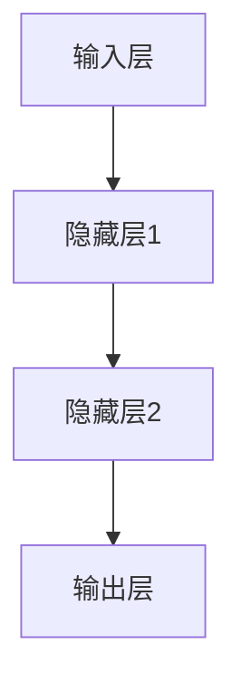

                 


### 文章标题：AI编程语言的用户体验量化指标

### 关键词：AI编程语言，用户体验，量化指标，易用性，交互性，可访问性，用户研究方法

### 摘要：
本文旨在探讨AI编程语言的用户体验量化指标，通过详细分析AI编程语言的概念、基本原理、用户体验量化方法及其在实际应用中的优化策略，帮助开发者更好地理解和提升AI编程语言的用户体验。文章将深入探讨易用性、交互性和可访问性等关键指标，并通过具体案例和实践，提供实用的优化建议。

## 第一部分：AI编程语言概述

### 第1章：AI编程语言的概念与演进

AI编程语言是一种专门用于编写人工智能应用程序的编程语言。它通过抽象化复杂的数学和统计学概念，提供了一套易于理解和使用的语法和库函数，使得开发者能够更加高效地构建和训练机器学习模型。AI编程语言的发展历程可以分为几个阶段，从早期的符号逻辑和搜索算法，到现代的基于统计学习的深度学习框架。

在AI编程语言的发展过程中，一些重要的里程碑包括：

- **符号逻辑和搜索算法**：早期的AI编程语言如Prolog，通过符号逻辑和搜索算法来解决问题。
- **基于规则的系统**：如专家系统，通过预定义的规则来模拟专家的知识。
- **基于案例的推理**：系统通过存储和检索案例来解决新问题。
- **机器学习**：随着数据量的增加和计算能力的提升，机器学习成为主流的AI技术，相应的编程语言如Python和R得到了广泛使用。
- **深度学习**：近年来，深度学习框架如TensorFlow和PyTorch的出现，进一步推动了AI编程语言的发展。

### 第2章：AI编程语言的基本原理

AI编程语言的基本原理包括神经网络、机器学习算法和深度学习算法。

#### 神经网络基础

神经网络是AI编程语言的核心组成部分。它由大量的神经元（节点）组成，每个神经元都接收多个输入，并通过加权求和和激活函数来产生输出。神经网络的结构通常包括输入层、隐藏层和输出层。

- **神经网络的结构**：Mermaid流程图如下：



- **神经网络的训练过程**：神经网络通过反向传播算法来训练模型。反向传播算法包括以下几个步骤：

  1. 前向传播：将输入数据传递到神经网络，计算输出。
  2. 计算误差：将实际输出与预期输出之间的差异计算为误差。
  3. 反向传播：将误差反向传播到神经网络的每个层次，更新权重和偏置。
  4. 重复步骤1-3，直到误差达到最小。

  伪代码如下：

  ```python
  for each epoch:
      for each sample in dataset:
          forward_pass(sample)
          compute_error(expected_output, actual_output)
          backward_pass()
  end
  ```

#### 机器学习算法基础

机器学习算法是AI编程语言的重要组成部分。它包括以下几种类型：

- **监督学习**：通过标注的数据集来训练模型，使模型能够对新的数据进行预测。
- **无监督学习**：不使用标注数据，通过发现数据中的模式来进行聚类或降维。
- **强化学习**：通过与环境的交互来学习最佳策略，以最大化长期回报。

### 第二部分：用户体验量化指标

#### 第3章：用户体验量化的基本概念

用户体验（UX）是用户在使用产品或服务过程中的感受和体验。用户体验量化是指通过量化的方法来评估和改进用户体验。用户体验量化包括以下几个方面：

- **易用性**：用户能否轻松地使用产品或服务。
- **交互性**：用户与产品或服务之间的互动质量。
- **可访问性**：产品或服务对各种用户（包括残障用户）的可用性。

用户体验量化的意义在于：

- **提供客观的评估标准**：通过量化的方法，可以为用户体验提供客观的评估标准，从而更准确地评估产品的质量。
- **指导产品改进**：通过用户体验量化，可以发现产品或服务中的问题，从而指导产品的改进。

用户体验量化的方法包括：

- **用户研究**：通过观察、访谈、问卷调查等方法，收集用户的反馈和体验数据。
- **指标测量**：通过使用各种指标，如任务完成时间、错误率、满意度等，来量化用户体验。

#### 第4章：AI编程语言的用户体验量化指标

AI编程语言的用户体验量化指标主要包括以下三个方面：

- **易用性指标**：评估用户能否轻松地使用AI编程语言。
- **交互性指标**：评估用户与AI编程语言之间的互动质量。
- **可访问性指标**：评估AI编程语言对各种用户的可用性。

易用性指标包括：

- **任务完成时间**：用户完成特定任务所需的时间。
- **错误率**：用户在完成任务时犯错的频率。

交互性指标包括：

- **响应时间**：系统对用户操作的响应速度。
- **用户满意度**：用户对AI编程语言的满意度。

可访问性指标包括：

- **屏幕阅读器兼容性**：AI编程语言是否支持屏幕阅读器。
- **键盘导航**：AI编程语言是否支持键盘导航。

用户研究方法在AI编程语言中的应用主要包括：

- **用户访谈**：通过与用户进行面对面访谈，收集他们对AI编程语言的使用体验和反馈。
- **A/B测试**：通过在不同用户群体中测试不同版本的AI编程语言，比较其用户体验的差异。

#### 第5章：AI编程语言的用户体验评估

用户体验评估是指通过量化的方法来评估和改进AI编程语言的用户体验。用户体验评估的方法包括：

- **任务分析**：通过分析用户完成任务的过程，评估任务的难度和效率。
- **问卷调查**：通过问卷调查收集用户对AI编程语言的满意度和其他反馈。
- **用户测试**：通过用户实际使用AI编程语言，评估其用户体验。

用户体验评估的工具包括：

- **用户测试工具**：如UserTesting和UsabilityHub，用于录制和评估用户的测试过程。
- **分析工具**：如Google Analytics和Hotjar，用于收集和分析用户行为数据。

用户体验评估的案例分析包括：

- **AI编程语言X的用户体验评估**：通过任务分析、问卷调查和用户测试，评估AI编程语言X的用户体验，并提出改进建议。
- **AI编程语言Y的用户体验评估**：通过相同的方法，评估AI编程语言Y的用户体验，并进行比较。

### 第三部分：AI编程语言的用户体验优化

#### 第6章：AI编程语言的用户体验优化策略

用户体验优化是指通过改进AI编程语言的易用性、交互性和可访问性，提升用户体验。用户体验优化策略包括：

- **易用性优化**：通过简化用户界面、减少用户操作步骤、提供清晰的文档和教程等方式，提高AI编程语言的易用性。
- **交互性优化**：通过改进响应时间、增加用户反馈机制、提供个性化体验等方式，提高AI编程语言的交互性。
- **可访问性优化**：通过支持屏幕阅读器、提供键盘导航、优化页面结构等方式，提高AI编程语言的可访问性。

用户体验优化的方法包括：

- **用户研究**：通过用户访谈、问卷调查、用户测试等方法，收集用户的反馈和体验数据。
- **数据分析**：通过分析用户行为数据，识别用户体验中的问题和改进机会。
- **迭代开发**：通过快速迭代开发，不断改进和优化AI编程语言的用户体验。

用户体验优化的实践包括：

- **AI编程语言X的用户体验优化实践**：通过用户研究和数据分析，发现AI编程语言X的用户体验问题，并采取相应的优化措施。
- **AI编程语言Y的用户体验优化实践**：通过相同的方法，优化AI编程语言Y的用户体验。

#### 第7章：AI编程语言的未来发展趋势

AI编程语言的未来发展趋势包括：

- **更强大的功能**：随着AI技术的不断发展，AI编程语言将提供更强大的功能和更丰富的库函数，以满足更复杂的AI应用需求。
- **更好的用户体验**：通过不断优化易用性、交互性和可访问性，AI编程语言将提供更好的用户体验。
- **更广泛的适用性**：随着AI技术的普及，AI编程语言将适用于更多的领域和行业，满足各种用户的需求。

用户体验量化的未来发展包括：

- **更精细的量化方法**：随着技术的发展，用户体验量化将采用更精细的方法，如眼动追踪、情感分析等，提供更准确的数据。
- **更智能的优化策略**：通过结合人工智能技术，用户体验量化将实现更智能的优化策略，提高用户体验优化效果。

AI编程语言与用户体验量化的融合趋势包括：

- **一体化开发环境**：AI编程语言和用户体验量化工具将集成到同一开发环境中，提供一站式用户体验优化解决方案。
- **智能优化工具**：通过结合人工智能技术，开发智能优化工具，实现自动化的用户体验优化。

## 结尾

AI编程语言的用户体验量化是提升AI编程语言质量的重要手段。通过深入了解AI编程语言的基本原理和用户体验量化方法，开发者可以更好地优化AI编程语言的用户体验，提高用户满意度和使用效率。本文对AI编程语言的用户体验量化进行了详细的探讨，包括基本原理、量化指标、用户体验评估和优化策略等方面。未来的研究和实践将继续推动AI编程语言与用户体验量化的发展，为开发者提供更强大的工具和方法，以构建更好的AI应用程序。

### 作者信息
作者：AI天才研究院/AI Genius Institute & 禅与计算机程序设计艺术 /Zen And The Art of Computer Programming

### 小结

本文系统地探讨了AI编程语言的用户体验量化指标，涵盖了从基本概念到具体优化策略的全面分析。通过阐述AI编程语言的发展历程、基本原理，以及用户体验量化方法，本文为开发者提供了理论依据和实践指导。用户体验量化不仅有助于评估AI编程语言的质量，还能为改进和优化提供有力支持。未来的发展趋势预示着更强大的功能和更智能的优化工具，将进一步推动AI编程语言与用户体验量化的深度融合。

### 注意事项

1. 在进行用户体验量化时，应确保数据的准确性和代表性，避免因样本偏差导致的错误结论。
2. 用户研究方法的选择应根据具体目标和场景，结合问卷调查、用户访谈和用户测试等多种方法，获取全面的数据。
3. 在优化AI编程语言的用户体验时，应关注易用性、交互性和可访问性的平衡，以满足不同用户的需求。
4. 用户体验量化工具的选择应考虑其功能、易用性和兼容性，以确保数据的收集和分析过程高效、准确。

### 拓展阅读

1. 《用户体验度量：量化设计与研究方法》
2. 《人工智能：一种现代方法》
3. 《深度学习》
4. 《用户体验评估：理论与实践》
5. 《机器学习实战》

通过阅读这些书籍，可以进一步深入了解用户体验量化和AI编程语言的深度知识。希望本文对您的学习和实践有所帮助。若您有任何问题或建议，欢迎随时交流。再次感谢您的阅读！

