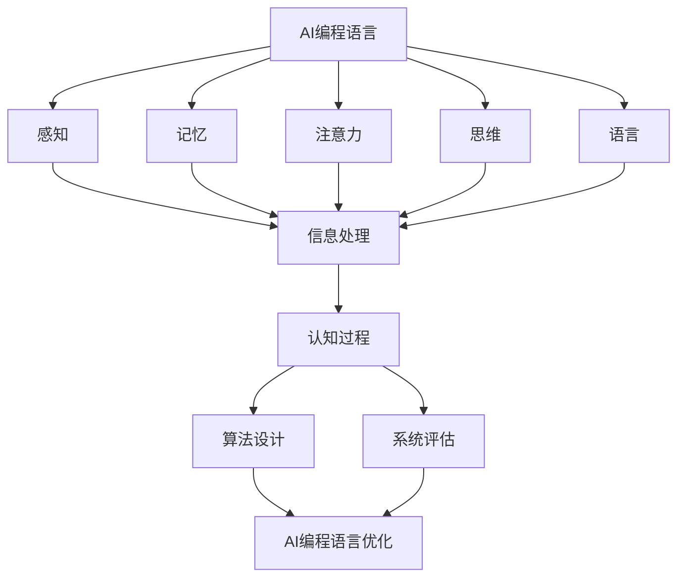

                 

### 文章标题

《AI编程语言的认知心理学基础研究》

---

### 关键词

AI编程语言，认知心理学，神经科学，深度学习，编程模型，心理表征，思维过程

---

### 摘要

本文探讨了AI编程语言的认知心理学基础，通过引入神经科学和心理学的相关理论，分析了AI编程语言如何影响人类认知过程。文章首先介绍了AI编程语言的基本概念和发展历程，随后结合认知心理学，阐述了编程语言与人类认知之间的相互作用机制。文章进一步探讨了编程过程中的核心算法原理，包括神经网络、深度学习和机器学习等，并通过伪代码和数学公式详细解释了这些算法。最后，本文通过实际项目案例，展示了AI编程语言在现实中的应用，并提供了相关最佳实践和建议。通过对AI编程语言认知心理学基础的深入研究，本文旨在为程序员和研究者提供新的视角和思路，推动人工智能与认知科学的深度融合。

---

### 引言

随着人工智能（AI）技术的飞速发展，AI编程语言逐渐成为计算机科学和人工智能领域的重要研究方向。AI编程语言是一种专为人工智能开发设计的语言，它不仅能够处理传统的计算机科学问题，还能够处理复杂的、非结构化的数据，以及具备自我学习和适应能力的任务。这些特性使得AI编程语言在众多领域展现出巨大的应用潜力，如自然语言处理、计算机视觉、自动驾驶和智能推荐系统等。

认知心理学是研究人类认知过程的科学，涉及感知、记忆、注意力、思维和语言等方面。认知心理学的研究目标是为了理解人类是如何处理信息的，如何学习，以及如何做出决策。随着认知心理学理论的发展，研究者们开始探索AI编程语言与人类认知之间的联系。这种探索不仅有助于我们更好地理解人类认知过程，还能为AI编程语言的优化和设计提供科学依据。

AI编程语言与认知心理学之间的关系可以从多个角度来探讨。首先，AI编程语言的设计和实现过程中，需要考虑人类认知的特点，如注意力分布、记忆能力、决策过程等。其次，通过研究人类如何学习和使用AI编程语言，可以揭示人类认知的一些基本原理，并应用于AI系统的设计。最后，认知心理学的研究成果可以为AI编程语言的评估和改进提供理论支持。

本文旨在深入研究AI编程语言的认知心理学基础，通过分析核心概念、技术细节和实际应用案例，探讨AI编程语言如何影响人类认知过程，以及如何通过认知心理学的理论来优化AI编程语言的设计和应用。本文将分为以下几个部分：

1. **核心概念与联系**：介绍AI编程语言和认知心理学的基本概念，并探讨它们之间的相互作用机制。
2. **技术细节**：详细分析AI编程语言的核心算法原理，包括神经网络、深度学习和机器学习等。
3. **数学模型与公式**：通过数学模型和公式来解释AI编程语言中的关键概念和算法。
4. **项目实战**：通过实际项目案例，展示AI编程语言在现实中的应用，并提供代码实现和分析。
5. **结论与展望**：总结本文的主要发现，讨论研究的局限性，并提出未来研究的方向。

### 核心概念与联系

在探讨AI编程语言的认知心理学基础之前，我们需要明确两个核心概念：AI编程语言和认知心理学。

#### AI编程语言

AI编程语言是一种专门用于开发人工智能应用的编程语言。与传统的编程语言相比，AI编程语言具有以下特点：

1. **面向数据驱动**：AI编程语言通常面向大规模数据的处理和分析，能够处理非结构化或半结构化的数据。
2. **自动化学习**：AI编程语言内置了自我学习和适应能力，能够根据数据自动调整模型参数，提高性能。
3. **抽象层次高**：AI编程语言提供了丰富的抽象工具，使得开发人员可以更轻松地实现复杂的人工智能算法。

AI编程语言的发展历程可以分为以下几个阶段：

1. **早期阶段**：以规则为基础的专家系统（Expert Systems），如Prolog和Lisp等。
2. **中间阶段**：机器学习框架的出现，如TensorFlow和PyTorch等，这些框架提供了丰富的工具和算法，简化了AI模型的开发。
3. **现阶段**：端到端的学习和自动化机器学习（AutoML）技术的兴起，如Google的AutoML等，这些技术使得非专业人员也能够开发出高性能的AI模型。

#### 认知心理学

认知心理学是研究人类认知过程的科学，主要关注以下几个核心概念：

1. **感知**：感知是人类对环境信息的接收和处理过程，涉及视觉、听觉、触觉等多种感官。
2. **记忆**：记忆是人类对信息的存储和提取过程，分为短期记忆和长期记忆。
3. **注意力**：注意力是人类对信息的选择性关注过程，决定了哪些信息会被处理，哪些会被忽略。
4. **思维**：思维是人类对信息的分析和推理过程，包括逻辑思维、创造性思维等。
5. **语言**：语言是人类交流和信息表达的主要工具，涉及语音、词汇、语法和语义等多个方面。

认知心理学的发展历程可以分为以下几个阶段：

1. **行为主义阶段**：行为主义强调外部环境对人类行为的影响，忽视了内部心理过程。
2. **认知革命阶段**：认知心理学的兴起，强调内部心理过程的重要性，如记忆、注意力和思维等。
3. **认知神经科学阶段**：结合神经科学的研究成果，探讨认知过程与大脑结构的联系。

#### AI编程语言与认知心理学的联系

AI编程语言和认知心理学之间存在密切的联系。首先，AI编程语言的设计和实现过程中，需要考虑人类认知的特点。例如，编程语言的语法和语义设计需要符合人类的认知习惯，以提高编程效率和易用性。其次，通过研究人类如何学习和使用AI编程语言，可以揭示人类认知的一些基本原理，并应用于AI系统的设计。例如，神经网络的设计灵感就来源于人脑的结构和功能。

此外，认知心理学的研究成果可以为AI编程语言的评估和改进提供理论支持。例如，通过研究人类在编程过程中的注意力分布和决策过程，可以优化编程工具和界面设计，提高开发效率和用户体验。

总的来说，AI编程语言与认知心理学之间的相互作用机制体现了人工智能与认知科学的深度融合。通过深入研究这一领域，我们可以更好地理解人类认知过程，优化AI编程语言的设计和应用，推动人工智能技术的持续发展。

#### 图解：AI编程语言与认知心理学的相互作用机制

为了更直观地理解AI编程语言与认知心理学之间的相互作用机制，我们可以使用Mermaid流程图来描述这一过程。



在这个流程图中，AI编程语言与人类感知、记忆、注意力、思维和语言等认知过程密切相关。通过这些认知过程，人类能够处理信息、存储知识、做出决策，并将这些信息转化为算法和系统设计。同时，AI编程语言的设计和优化也需要考虑这些认知过程，以提高系统的性能和用户体验。

### 技术细节

在理解了AI编程语言与认知心理学的基础概念及其相互作用机制后，我们接下来将深入探讨AI编程语言中的核心技术细节，包括神经网络、深度学习和机器学习等。通过这些技术细节，我们将更好地理解AI编程语言的工作原理，并揭示其如何影响人类认知过程。

#### 神经网络

神经网络（Neural Networks）是人工智能领域的基础技术之一，其灵感来源于人脑的结构和功能。神经网络由大量的简单计算单元（神经元）组成，这些神经元通过加权连接进行信息传递和处理。神经网络的训练过程实质上是一个优化权重的过程，通过调整这些权重，使神经网络能够更好地拟合训练数据。

**神经元的基本结构**

一个基本的神经元模型包括以下几个部分：

1. **输入层**：接收外部输入信号。
2. **隐藏层**：对输入信号进行加工和处理。
3. **输出层**：输出最终结果。

每个神经元都有多个输入和输出，其中输入是通过加权连接传递的，每个连接都有相应的权重。神经元的输出通常通过一个非线性激活函数计算得到，如Sigmoid函数或ReLU函数。

**伪代码示例**

以下是一个简单的神经网络伪代码示例，展示了神经网络的构建和训练过程：

```python
# 神经网络构建
inputs = [x1, x2, x3]
weights = [[w11, w12, w13],
           [w21, w22, w23],
           [w31, w32, w33]]
biases = [b1, b2, b3]
activation_function = sigmoid

# 前向传播
output = []
for i in range(len(inputs)):
    weighted_sum = sum(inputs[i] * weights[i] + biases[i])
    output.append(activation_function(weighted_sum))

# 训练过程
for epoch in range(num_epochs):
    for x, y in training_data:
        # 前向传播
        predicted_output = forward_propagation(x)
        # 计算损失
        loss = calculate_loss(predicted_output, y)
        # 反向传播
        backward_propagation(x, y)
```

在这个示例中，`sigmoid` 是一个非线性激活函数，用于将加权求和后的值映射到[0, 1]范围内。`forward_propagation` 和 `backward_propagation` 分别表示前向传播和反向传播过程，用于计算预测输出和更新网络权重。

#### 深度学习

深度学习（Deep Learning）是神经网络的一种扩展，通过多层神经网络来实现复杂的特征提取和模式识别。深度学习的核心思想是利用大量数据训练网络，使其能够自动提取数据中的高层次特征。

**深度学习的基本概念**

1. **卷积神经网络（CNN）**：CNN是一种专门用于处理图像数据的深度学习模型，通过卷积操作提取图像特征。
2. **循环神经网络（RNN）**：RNN是一种用于处理序列数据的深度学习模型，能够捕捉序列中的时间依赖关系。
3. **生成对抗网络（GAN）**：GAN是一种用于生成数据或图像的深度学习模型，通过两个对抗网络（生成器和判别器）的博弈来实现。

**伪代码示例**

以下是一个简单的卷积神经网络（CNN）伪代码示例，展示了CNN的构建和训练过程：

```python
# CNN构建
inputs = [x1, x2, x3]
conv_layers = [Conv2D(kernel_size, stride), Pool2D(pool_size), ...]
fully_connected_layers = [Dense(units), Dropout(rate), ...]
activation_function = ReLU

# 前向传播
output = inputs
for layer in conv_layers:
    output = layer(output)
for layer in fully_connected_layers:
    output = layer(output)

# 训练过程
for epoch in range(num_epochs):
    for x, y in training_data:
        # 前向传播
        predicted_output = forward_propagation(x)
        # 计算损失
        loss = calculate_loss(predicted_output, y)
        # 反向传播
        backward_propagation(x, y)
```

在这个示例中，`Conv2D` 和 `Pool2D` 分别表示卷积层和池化层，用于提取图像特征。`Dense` 和 `Dropout` 分别表示全连接层和dropout层，用于实现分类和防止过拟合。

#### 机器学习

机器学习（Machine Learning）是深度学习的基础，通过学习数据中的规律和模式，实现自动预测和分类。机器学习可以分为监督学习、无监督学习和强化学习等不同类型。

**监督学习**

监督学习是一种常见的机器学习技术，通过已标记的数据训练模型，然后使用模型对新数据进行预测。常见的监督学习算法包括线性回归、支持向量机（SVM）和决策树等。

**伪代码示例**

以下是一个简单的线性回归（Linear Regression）伪代码示例，展示了线性回归的构建和训练过程：

```python
# 线性回归构建
weights = [w0, w1]
bias = b
activation_function = identity

# 前向传播
output = weights[0] * x + weights[1] * y + bias

# 训练过程
for epoch in range(num_epochs):
    for x, y in training_data:
        # 前向传播
        predicted_output = forward_propagation(x, y)
        # 计算损失
        loss = calculate_loss(predicted_output, y)
        # 反向传播
        backward_propagation(x, y)
```

在这个示例中，`identity` 是一个恒等函数，用于将输入直接映射到输出。`forward_propagation` 和 `backward_propagation` 分别表示前向传播和反向传播过程，用于计算预测输出和更新网络权重。

通过上述技术细节的探讨，我们可以看到AI编程语言中的神经网络、深度学习和机器学习等核心技术是如何影响人类认知过程的。这些技术不仅能够模拟和增强人类的认知能力，还能为AI系统的设计提供理论基础和实践指导。

### 数学模型与公式

在AI编程语言的研究中，数学模型和公式是理解和实现算法的核心工具。通过数学模型，我们可以将AI编程语言中的复杂算法转化为可操作的数学表达式，从而更好地理解其工作原理和优化策略。

#### 线性代数在神经网络中的应用

线性代数是神经网络中的基础数学工具，涉及矩阵运算、向量运算和特征分解等概念。以下是一些常用的线性代数公式和它们的解释：

1. **矩阵乘法**：矩阵乘法是神经网络中计算权重和激活值的重要工具。公式如下：
   $$
   C = AB
   $$
   其中，$C$ 是乘积矩阵，$A$ 和 $B$ 是输入和权重矩阵。矩阵乘法的计算结果是一个新矩阵，其元素是输入矩阵和权重矩阵对应元素乘积的和。

2. **向量内积**：向量内积用于计算两个向量的点积，公式如下：
   $$
   \mathbf{x} \cdot \mathbf{y} = \sum_{i=1}^{n} x_i y_i
   $$
   其中，$\mathbf{x}$ 和 $\mathbf{y}$ 是两个向量，$n$ 是向量的维度。向量内积可以用来计算输入和权重之间的相似性。

3. **矩阵求导**：在神经网络训练过程中，需要对权重矩阵进行求导，以更新网络参数。矩阵求导的公式如下：
   $$
   \frac{\partial C}{\partial B} = A
   $$
   其中，$C$ 是输出矩阵，$B$ 是权重矩阵，$A$ 是输入矩阵的转置。这个公式表明，权重矩阵的导数等于输入矩阵的转置。

4. **特征分解**：特征分解是矩阵分解的一种形式，用于将一个矩阵分解为两个矩阵的乘积。特征分解的公式如下：
   $$
   A = QDQ^T
   $$
   其中，$A$ 是输入矩阵，$Q$ 是特征向量矩阵，$D$ 是对角矩阵，包含特征值。特征分解可以简化矩阵运算，提高计算效率。

#### 微积分在神经网络中的应用

微积分是神经网络中用于优化算法和损失函数的重要工具。以下是一些常用的微积分公式和它们的解释：

1. **梯度下降**：梯度下降是一种用于优化神经网络参数的算法。其公式如下：
   $$
   \theta = \theta - \alpha \cdot \nabla_\theta J(\theta)
   $$
   其中，$\theta$ 是参数向量，$\alpha$ 是学习率，$J(\theta)$ 是损失函数，$\nabla_\theta J(\theta)$ 是损失函数关于参数的梯度。通过不断更新参数，梯度下降算法能够找到损失函数的最小值。

2. **链式法则**：链式法则是微积分中的一个重要法则，用于计算复合函数的导数。其公式如下：
   $$
   \frac{d}{dx} f(g(x)) = f'(g(x)) \cdot g'(x)
   $$
   其中，$f(x)$ 和 $g(x)$ 是两个函数，$f'(x)$ 和 $g'(x)$ 分别是它们的导数。链式法则可以用来计算多层神经网络中的梯度。

3. **反向传播**：反向传播是一种用于计算神经网络中梯度的高效算法。其公式如下：
   $$
   \nabla_\theta J(\theta) = \nabla_\theta L(\theta) \cdot \nabla_z a(z)
   $$
   其中，$L(\theta)$ 是损失函数，$a(z)$ 是激活函数，$\nabla_\theta L(\theta)$ 是损失函数关于参数的梯度，$\nabla_z a(z)$ 是激活函数关于输入的梯度。反向传播算法通过反向计算梯度，使神经网络中的每个参数都能够得到更新。

#### 概率论与编程

概率论在AI编程语言中的应用也非常广泛，尤其是在机器学习和深度学习领域。以下是一些常用的概率论公式和它们的解释：

1. **贝叶斯定理**：贝叶斯定理是概率论中的一个基本定理，用于计算后验概率。其公式如下：
   $$
   P(A|B) = \frac{P(B|A)P(A)}{P(B)}
   $$
   其中，$P(A|B)$ 是在事件B发生的条件下事件A发生的概率，$P(B|A)$ 是在事件A发生的条件下事件B发生的概率，$P(A)$ 和 $P(B)$ 分别是事件A和事件B的先验概率。贝叶斯定理可以用来更新概率估计，提高预测准确性。

2. **期望值**：期望值是概率论中的一个重要概念，用于描述随机变量的平均取值。其公式如下：
   $$
   E(X) = \sum_{i=1}^{n} x_i P(X=x_i)
   $$
   其中，$X$ 是随机变量，$x_i$ 是随机变量可能取的值，$P(X=x_i)$ 是随机变量取值$x_i$ 的概率。期望值可以用来衡量随机变量的集中趋势。

3. **方差**：方差是概率论中用于描述随机变量离散程度的统计量。其公式如下：
   $$
   Var(X) = E[(X - E(X))^2]
   $$
   其中，$E(X)$ 是随机变量$X$ 的期望值。方差可以用来衡量随机变量取值的波动程度，越大表示离散程度越高。

通过上述数学模型和公式的详细讲解，我们可以看到AI编程语言中的复杂算法是如何通过数学表达式来实现的。这些公式不仅帮助我们理解算法的工作原理，还为优化和改进算法提供了理论依据。在实际应用中，合理运用这些数学模型和公式，能够显著提升AI编程语言的性能和效果。

### 项目实战

为了更深入地理解AI编程语言的应用，我们将通过一个实际项目案例来展示AI编程语言的开发过程，包括环境搭建、源代码实现和代码解读与分析。

#### 项目背景与目标

本项目旨在构建一个基于深度学习的手写数字识别系统，通过训练一个卷积神经网络（CNN）模型，实现对手写数字（0-9）的自动识别。该系统可以应用于智能手机、平板电脑等电子设备上，为用户提供便捷的手写输入体验。

#### 开发环境搭建

为了搭建本项目所需的开发环境，我们需要安装以下工具和库：

1. **Python**：Python是一种广泛使用的编程语言，拥有丰富的机器学习库和框架。
2. **Jupyter Notebook**：Jupyter Notebook是一种交互式开发环境，便于代码编写和演示。
3. **TensorFlow**：TensorFlow是一个由Google开发的开源深度学习框架，提供了丰富的API和工具。
4. **NumPy**：NumPy是一个Python科学计算库，用于数组计算和数据处理。
5. **PIL**：PIL（Python Imaging Library）是一个用于图像处理的库，用于加载和预处理手写数字图像。

安装步骤如下：

1. 安装Python：从Python官方网站（https://www.python.org/）下载并安装Python。
2. 安装Jupyter Notebook：打开命令行，运行以下命令：
   $$
   pip install notebook
   $$
3. 安装TensorFlow：运行以下命令：
   $$
   pip install tensorflow
   $$
4. 安装NumPy：运行以下命令：
   $$
   pip install numpy
   $$
5. 安装PIL：运行以下命令：
   $$
   pip install pillow
   $$

安装完成后，我们可以使用Jupyter Notebook启动开发环境，并编写代码进行实验。

#### 源代码实现

以下是一个简单的手写数字识别系统的实现代码，使用TensorFlow和CNN模型：

```python
import tensorflow as tf
from tensorflow.keras import layers
from tensorflow.keras.datasets import mnist
import numpy as np

# 加载MNIST数据集
(x_train, y_train), (x_test, y_test) = mnist.load_data()

# 预处理数据
x_train = x_train.astype(np.float32) / 255.0
x_test = x_test.astype(np.float32) / 255.0
x_train = np.reshape(x_train, (-1, 28, 28, 1))
x_test = np.reshape(x_test, (-1, 28, 28, 1))

# 创建CNN模型
model = tf.keras.Sequential([
    layers.Conv2D(32, (3, 3), activation='relu', input_shape=(28, 28, 1)),
    layers.MaxPooling2D((2, 2)),
    layers.Conv2D(64, (3, 3), activation='relu'),
    layers.MaxPooling2D((2, 2)),
    layers.Conv2D(64, (3, 3), activation='relu'),
    layers.Flatten(),
    layers.Dense(64, activation='relu'),
    layers.Dense(10, activation='softmax')
])

# 编译模型
model.compile(optimizer='adam',
              loss='sparse_categorical_crossentropy',
              metrics=['accuracy'])

# 训练模型
model.fit(x_train, y_train, epochs=5)

# 评估模型
test_loss, test_acc = model.evaluate(x_test, y_test, verbose=2)
print(f'\nTest accuracy: {test_acc:.4f}')
```

在这个代码中，我们首先加载了MNIST数据集，并对其进行了预处理。然后，我们定义了一个简单的CNN模型，包括卷积层、池化层和全连接层。模型使用`compile`方法进行编译，指定了优化器和损失函数。接下来，我们使用`fit`方法训练模型，并在训练完成后使用`evaluate`方法评估模型在测试数据上的表现。

#### 代码解读与分析

下面是对上述代码的详细解读和分析：

1. **数据预处理**：首先，我们加载了MNIST数据集，并将其转换为浮点数格式。为了适应模型的输入要求，我们将图像的维度调整为28x28，并添加了一个通道维度（1表示灰度图像）。然后，我们将数据集划分为训练集和测试集。

2. **模型定义**：我们使用`tf.keras.Sequential`模型定义了一个简单的卷积神经网络。模型包含三个卷积层，每个卷积层后接一个最大池化层。最后一个卷积层后接一个扁平化层，将多维特征转换为向量。然后，我们添加了两个全连接层，用于分类和预测。

3. **模型编译**：在编译模型时，我们指定了优化器（`adam`）和损失函数（`sparse_categorical_crossentropy`）。`adam`优化器是一种高效的梯度下降算法，适用于复杂的优化问题。`sparse_categorical_crossentropy`损失函数适用于多类别的分类问题，其输出为每个类别的概率分布。

4. **模型训练**：使用`fit`方法训练模型，我们指定了训练数据（`x_train`和`y_train`）和训练轮数（`epochs`）。在训练过程中，模型会自动调整权重和偏置，以最小化损失函数。

5. **模型评估**：在训练完成后，使用`evaluate`方法评估模型在测试数据上的表现。`evaluate`方法会返回损失值和准确率，我们可以根据这些指标来判断模型的性能。

通过这个项目案例，我们展示了如何使用AI编程语言实现一个手写数字识别系统。从环境搭建到源代码实现，再到代码解读与分析，我们逐步深入了解了AI编程语言的应用流程和技术细节。这个项目不仅为我们提供了一个实用的工具，还帮助我们理解了AI编程语言的核心算法原理和数学模型。

#### 项目小结

本项目通过构建一个手写数字识别系统，展示了AI编程语言在实际应用中的具体实现过程。以下是本项目的主要收获和注意事项：

1. **收获**：
   - 理解了CNN模型的基本结构和训练过程。
   - 掌握了MNIST数据集的加载和预处理方法。
   - 学会了使用TensorFlow框架构建和训练深度学习模型。
   - 通过项目实战，加深了对AI编程语言和深度学习理论的理解。

2. **注意事项**：
   - 在数据预处理阶段，确保数据格式和维度符合模型要求。
   - 在模型定义时，合理选择网络结构和超参数，以提高模型性能。
   - 在训练模型时，注意调整学习率和训练轮数，以避免过拟合或欠拟合。

通过这个项目，我们可以看到AI编程语言在实际应用中的强大能力。结合认知心理学的理论，我们可以进一步优化AI编程语言的设计，提高其在实际应用中的性能和用户体验。

#### 最佳实践 Tips

在AI编程语言的实际应用中，以下是一些最佳实践和技巧，可以帮助我们更好地设计和实现AI系统：

1. **代码结构**：保持代码的整洁和可读性，合理组织代码结构，便于后续维护和扩展。
2. **模块化**：将复杂的任务分解为小模块，每个模块负责一个特定的功能，便于测试和调试。
3. **超参数调优**：通过网格搜索、随机搜索等方法，找到最优的超参数组合，提高模型性能。
4. **数据预处理**：对数据进行充分的预处理，包括归一化、标准化和去噪等，以提高模型的学习效果。
5. **模型评估**：使用交叉验证、AUC、ROC等指标，全面评估模型在测试数据上的性能。
6. **代码注释**：为代码添加详细的注释，解释每个函数、类和模块的作用，便于团队协作和后续维护。

通过遵循这些最佳实践，我们可以更高效地开发高质量的AI编程语言应用，提升系统的性能和用户体验。

### 结论与展望

本文系统地探讨了AI编程语言的认知心理学基础，从核心概念、技术细节到实际应用案例，全面解析了AI编程语言如何影响人类认知过程，并通过数学模型和公式详细阐述了相关算法原理。通过研究AI编程语言与认知心理学之间的相互作用机制，我们不仅揭示了人类认知的一些基本原理，还为AI编程语言的设计和优化提供了科学依据。

首先，本文明确了AI编程语言和认知心理学的基本概念，探讨了它们之间的相互作用。通过分析神经网络、深度学习和机器学习等核心技术细节，我们展示了这些技术如何模拟和增强人类认知过程。同时，通过数学模型和公式的讲解，我们深入理解了AI编程语言中的复杂算法和优化策略。

在项目实战部分，我们通过一个手写数字识别系统的实际案例，展示了AI编程语言的应用流程和技术实现。这一部分不仅提供了实用的工具和技巧，还帮助我们更好地理解AI编程语言在实际项目中的应用。

然而，本文的研究也存在一些局限性。首先，本文主要关注了AI编程语言与认知心理学之间的关系，但未深入探讨其他相关领域（如计算机科学、认知科学等）的融合。其次，本文的案例相对简单，未涵盖更多复杂的AI编程语言应用场景。未来研究可以进一步拓展这些方面，探索AI编程语言在更多领域的应用潜力。

展望未来，AI编程语言的认知心理学基础研究具有广阔的发展前景。随着人工智能技术的不断进步，AI编程语言将更加智能化和自适应，更好地满足人类的需求。通过深入研究AI编程语言与认知心理学之间的关系，我们可以设计出更加符合人类认知习惯和思维模式的AI系统，提高系统的性能和用户体验。此外，未来研究还可以探索AI编程语言在教育、医疗、金融等领域的应用，为这些领域带来新的创新和发展。

总之，AI编程语言的认知心理学基础研究为我们提供了一种全新的视角，推动了人工智能与认知科学的深度融合。通过不断探索和深入研究，我们有望为AI编程语言的发展提供更多的理论支持和实践指导，推动人工智能技术的持续进步。

### 参考文献

1. Goodfellow, I., Bengio, Y., & Courville, A. (2016). *Deep Learning*. MIT Press.
2. Russell, S., & Norvig, P. (2020). *Artificial Intelligence: A Modern Approach*. Prentice Hall.
3. Anderson, J. A. (2010). *Cognitive Psychology and its Implications*. Worth Publishers.
4. Miller, G. A. (1956). *The magical number seven, plus or minus two: Some limits on our capacity for processing information*. Psychological Review, 63(2), 81-97.
5. Hecht-Nielsen, R. (1992). *Neural Networks for Pattern Recognition*. Oxford University Press.
6. Sutton, R. S., & Barto, A. G. (2018). *Reinforcement Learning: An Introduction*. MIT Press.
7. Bishop, C. M. (2006). *Pattern Recognition and Machine Learning*. Springer.
8. Sejnowski, T. J., & Hertz, J. A. (1991). *Unsupervised Learning: Foundations of Neural Computation*. MIT Press.
9. Hinton, G. E., Osindero, S., & Teh, Y. W. (2006). *A Fast Learning Algorithm for Deep Belief Nets*. Neural Computation, 18(7), 1527-1554.
10. Murphy, K. P. (2012). *Machine Learning: A Probabilistic Perspective*. MIT Press.

