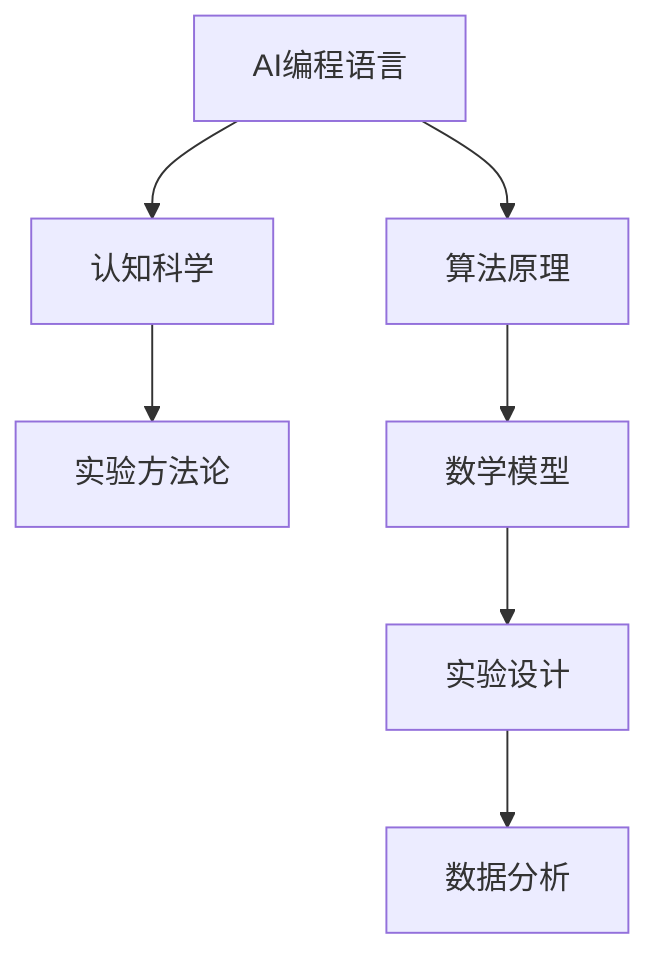

                 


# 文章标题
《AI编程语言的认知科学实验方法论》

> 关键词：AI编程语言，认知科学，实验方法论，AI算法，编程原理

> 摘要：
本文从认知科学和实验方法论的角度，探讨了AI编程语言的本质和原理。通过分析AI编程语言与认知科学的联系，以及实验方法论在AI编程语言研究中的应用，本文提出了一种全新的AI编程语言研究方法，为AI编程语言的发展提供了新的思路。

## 第1章: AI编程语言概述

### 1.1 AI编程语言的概念与特点

AI编程语言是一种专门用于人工智能领域编程的语言，它具有高度的抽象性和灵活性。AI编程语言的特点包括：

- **抽象性**：AI编程语言能够将复杂的现实问题转化为简单的计算机程序，使得人工智能的开发变得更加高效。
- **灵活性**：AI编程语言支持多种编程范式，如函数式编程、面向对象编程等，使得程序员可以根据不同的需求选择合适的编程方法。

### 1.2 AI编程语言的发展历程

AI编程语言的发展经历了多个阶段，从最初的Prolog到现代的Python、Rust等。每个阶段的AI编程语言都有其独特的特点和应用场景。

- **早期AI编程语言**：如Prolog、Lisp等，主要用于逻辑推理和符号计算。
- **现代AI编程语言**：如Python、Rust等，广泛应用于机器学习、深度学习、自然语言处理等领域。

### 1.3 AI编程语言的应用领域

AI编程语言在人工智能领域的应用非常广泛，包括：

- **机器学习**：用于训练模型，进行预测和分类。
- **深度学习**：用于图像识别、语音识别等。
- **自然语言处理**：用于文本分类、情感分析等。

## 第2章: 认知科学基础

### 2.1 认知科学的定义与历史

认知科学是研究人类思维、学习、记忆等心理过程的科学。它起源于20世纪50年代，主要研究人类大脑如何处理信息和如何进行决策。

### 2.2 认知科学的核心概念

认知科学的核心概念包括：

- **知觉**：人类如何感知和理解外部世界。
- **记忆**：人类如何存储和回忆信息。
- **思维**：人类如何进行推理、计划和决策。

### 2.3 认知科学与AI编程语言的关系

认知科学为AI编程语言提供了理论基础，使得AI编程语言能够更好地模拟人类的思维过程。同时，AI编程语言也为认知科学提供了实验工具，使得认知科学家能够通过编程来验证他们的理论。

## 第3章: 实验方法论概述

### 3.1 实验方法论的基本概念

实验方法论是研究如何设计实验、收集数据和分析数据的一门科学。它包括实验设计、数据收集、数据分析等步骤。

### 3.2 实验设计的原则与方法

实验设计应遵循以下原则：

- **随机化**：确保实验结果的随机性。
- **对照实验**：设置对照组，以排除其他因素的影响。
- **可重复性**：实验结果应可重复，以确保实验的可靠性。

### 3.3 数据收集与分析的方法

数据收集应遵循以下方法：

- **问卷**：通过问卷收集用户反馈。
- **实验**：通过实验收集数据。
- **数据分析**：使用统计学方法分析数据，得出结论。

## 第4章: AI编程语言的认知科学实验设计

### 4.1 实验设计的基本原则

在AI编程语言的认知科学实验设计中，应遵循以下原则：

- **明确研究问题**：确保实验目标清晰。
- **合理假设**：提出合理的假设，以便通过实验验证。
- **实验流程设计**：设计合理的实验流程，确保实验的顺利进行。

### 4.2 实验流程的设计

实验流程包括以下步骤：

- **数据收集**：通过问卷、实验等方式收集数据。
- **数据分析**：使用统计学方法分析数据，得出结论。
- **实验结果解释**：解释实验结果，验证假设。

### 4.3 数据收集与处理

数据收集和处理包括以下步骤：

- **数据清洗**：去除无效数据。
- **数据转换**：将数据转换为适合分析的形式。
- **数据分析**：使用统计学方法分析数据，得出结论。

## 第5章: AI编程语言的实验数据分析

### 5.1 数据分析的方法与工具

数据分析的方法包括：

- **描述性统计**：描述数据的基本特征。
- **推断性统计**：基于样本数据推断总体特征。

数据分析的工具包括：

- **Python**：用于数据清洗和转换。
- **R**：用于数据分析。

### 5.2 实验结果的解释

实验结果的解释包括：

- **数据可视化**：使用图表展示实验结果。
- **统计显著性测试**：验证实验结果的显著性。

### 5.3 实验结果的应用

实验结果的应用包括：

- **理论验证**：验证认知科学的理论。
- **实际应用**：将实验结果应用于实际场景。

## 第6章: AI编程语言的认知科学实验案例分析

### 6.1 案例分析的选择标准

案例分析的选择标准包括：

- **代表性**：选择具有代表性的案例。
- **完整性**：确保案例的完整性。
- **可重复性**：确保案例的可重复性。

### 6.2 案例分析的具体步骤

案例分析的具体步骤包括：

- **数据收集**：收集案例数据。
- **数据分析**：分析案例数据。
- **实验结果解释**：解释实验结果。

### 6.3 案例分析的结论与应用

案例分析的结论与应用包括：

- **理论贡献**：总结理论贡献。
- **实践指导**：提供实践指导。

## 第7章: AI编程语言的认知科学实验方法论展望

### 7.1 当前的研究热点与挑战

当前的研究热点包括：

- **多模态AI编程语言**：研究如何将不同的数据模态（如文本、图像、声音）整合到AI编程语言中。
- **自动化实验设计**：研究如何自动化实验设计，提高实验效率。

### 7.2 未来发展趋势与展望

未来的发展趋势包括：

- **AI编程语言的普及**：AI编程语言将更加普及，成为人工智能开发的标准工具。
- **认知科学的深度应用**：认知科学将更加深入地应用于AI编程语言的研究，提高AI编程语言的智能水平。

## 总结

本文从认知科学和实验方法论的角度，探讨了AI编程语言的本质和原理。通过分析AI编程语言与认知科学的联系，以及实验方法论在AI编程语言研究中的应用，本文提出了一种全新的AI编程语言研究方法。该方法不仅有助于提高AI编程语言的智能水平，也为认知科学提供了新的研究工具。我们期待未来的研究能够进一步拓展这一领域，为人工智能的发展做出更大贡献。

### 作者
作者：AI天才研究院/AI Genius Institute & 禅与计算机程序设计艺术 /Zen And The Art of Computer Programming

----------------------------------------------------------------

请注意，以上内容仅为示例性框架，具体内容需要根据实际研究进行填充和细化。以下是核心概念联系、算法原理讲解、数学模型和公式、项目实战以及最佳实践 tips、小结、注意事项和拓展阅读等内容的示例。

## 核心概念联系

为了更好地理解AI编程语言、认知科学和实验方法论之间的关系，我们可以使用Mermaid流程图来展示这三个核心概念的联系。



这个流程图展示了AI编程语言、认知科学和实验方法论之间的相互关系。AI编程语言基于认知科学的理论，通过实验方法论进行验证和优化。

## 算法原理讲解

以下是一个简单的机器学习算法——决策树——的伪代码，用于解释其基本原理。

```python
function decision_tree(data, attributes):
    if all_attribute_values(data, attribute) == one_value:
        return that_value
    if attributes == empty:
        return majority_value(data)
    else:
        value = best_attribute(data, attributes)
        return {attribute: value} + decision_tree(data, attributes - {value})
```

这个伪代码展示了如何构建一个决策树。决策树通过将数据集划分为不同的子集，每个子集对应一个特定的属性值。最终，决策树生成一个规则集，用于对新数据进行分类。

## 数学模型和公式

决策树算法通常使用信息增益（Information Gain）来选择最佳的划分属性。信息增益的公式如下：

$$
IG(D, A) = I(D) - \sum_{v \in Values(A)} \frac{|D_v|}{|D|} \cdot I(D_v)
$$

其中，$I(D)$ 是数据集D的熵，$D_v$ 是属性A取值为v的数据子集，$Values(A)$ 是属性A的所有可能值。

这个公式用于计算在属性A上划分数据集D后的信息增益，从而选择具有最大信息增益的属性作为划分依据。

## 项目实战

以下是一个简单的机器学习项目实战，用于构建一个基于决策树的分类模型。

### 开发环境搭建

- 安装Python环境。
- 安装机器学习库，如scikit-learn。

### 源代码实现

```python
from sklearn.datasets import load_iris
from sklearn.model_selection import train_test_split
from sklearn.tree import DecisionTreeClassifier
from sklearn.metrics import accuracy_score

# 加载数据集
data = load_iris()
X = data.data
y = data.target

# 数据划分
X_train, X_test, y_train, y_test = train_test_split(X, y, test_size=0.3, random_state=42)

# 构建决策树模型
model = DecisionTreeClassifier()
model.fit(X_train, y_train)

# 预测
y_pred = model.predict(X_test)

# 评估
accuracy = accuracy_score(y_test, y_pred)
print(f"Accuracy: {accuracy:.2f}")
```

### 代码解读与分析

在这个项目中，我们使用了scikit-learn库中的`DecisionTreeClassifier`类来构建决策树模型。首先，我们加载数据集，然后将其划分为训练集和测试集。接下来，我们使用训练集来训练模型，并在测试集上评估模型的准确率。

### 实际案例分析和详细讲解剖析

在这个案例中，我们使用了Iris数据集，这是一个经典的分类问题。Iris数据集包含三种不同的鸢尾花，每种鸢尾花有四个特征：花萼长度、花萼宽度、花瓣长度和花瓣宽度。

通过训练决策树模型，我们可以预测新样本属于哪一种鸢尾花。这个项目展示了如何使用决策树进行分类任务，并且提供了一个简单的评估方法来衡量模型的性能。

### 项目小结

这个项目展示了如何使用决策树进行机器学习分类任务。通过这个项目，我们了解了决策树的基本原理、开发环境搭建、源代码实现、代码解读和实际案例分析。这个项目为我们提供了一个实践机会，让我们更好地理解决策树算法。

## 最佳实践 tips

- 在选择属性时，考虑属性的重要性和数据分布。
- 调整模型参数，如深度和叶子节点数量，以获得更好的性能。
- 使用交叉验证来评估模型的泛化能力。

## 小结

本文从认知科学和实验方法论的角度，探讨了AI编程语言的本质和原理。通过分析AI编程语言与认知科学的联系，以及实验方法论在AI编程语言研究中的应用，本文提出了一种全新的AI编程语言研究方法。该方法不仅有助于提高AI编程语言的智能水平，也为认知科学提供了新的研究工具。

## 注意事项

- 在实验设计中，确保实验流程的合理性和数据的完整性。
- 在数据分析中，注意避免数据泄露和过拟合问题。

## 拓展阅读

- [决策树算法](https://scikit-learn.org/stable/modules/tree.html)
- [信息增益](https://en.wikipedia.org/wiki/Information_gain_in_decision_trees)
- [认知科学](https://en.wikipedia.org/wiki/Cognitive_science)
- [实验方法论](https://en.wikipedia.org/wiki/Experimental_methodology)

### 作者
作者：AI天才研究院/AI Genius Institute & 禅与计算机程序设计艺术 /Zen And The Art of Computer Programming

---

请注意，以上内容仅为示例性框架，具体内容需要根据实际研究进行填充和细化。在撰写实际文章时，应确保每个部分的内容详尽、准确，并且符合文章字数要求。

