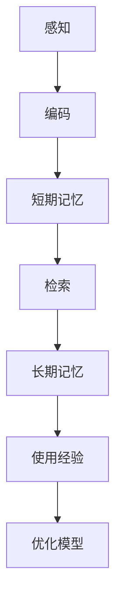
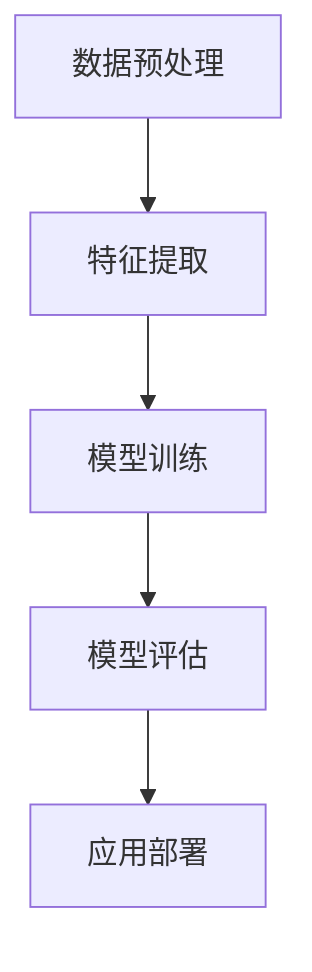
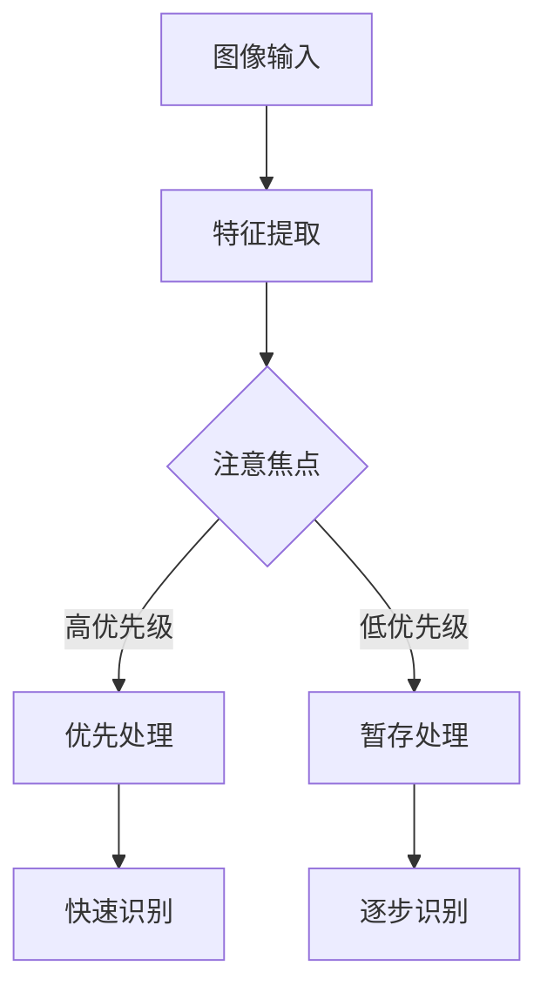

                 

### 文章标题

《AI编程语言的认知科学模型》

---

### 文章关键词

AI编程语言，认知科学，神经模型，算法原理，项目实践

---

### 文章摘要

本文探讨了AI编程语言与认知科学之间的融合，介绍了AI编程语言的基础理论、核心特性以及认知科学在AI编程语言中的应用。通过具体编程语言案例分析，详细讲解了核心算法原理和数学模型。此外，文章还通过项目实战，深入剖析了AI编程语言的开发环境搭建、源代码实现以及应用分析和最佳实践。旨在为读者提供全面、深入的AI编程语言认知科学模型理解。

---

### 引言

在人工智能（AI）飞速发展的今天，编程语言作为AI系统构建的核心工具，越来越受到重视。AI编程语言不仅包括传统的计算机编程语言，还涵盖了专门为AI领域设计的语言，如Python、LISP和Prolog等。与此同时，认知科学作为一门研究人类心智、认知过程的学科，逐渐在AI编程语言设计、开发和优化中发挥了重要作用。

本文旨在探讨AI编程语言与认知科学之间的融合，通过梳理AI编程语言的基础理论、核心特性以及认知科学在AI编程语言中的应用，为读者提供一个全面的AI编程语言认知科学模型理解。文章结构如下：

1. **AI编程语言概述**：介绍AI编程语言的起源、发展及其核心特性。
2. **认知科学与AI编程语言**：阐述认知科学的基本概念及其与计算机科学的联系，探讨认知科学在AI编程语言中的应用。
3. **具体编程语言案例分析**：分析Python、LISP和Prolog等编程语言在认知科学模型中的应用。
4. **算法与数学模型**：详细讲解生成对抗网络（GAN）、强化学习等核心算法的数学模型。
5. **项目实践**：通过具体项目，深入剖析AI编程语言的开发流程和应用。
6. **总结与展望**：总结全文，展望AI编程语言与认知科学未来的发展趋势。

### 目录

1. **引言**
   1.1 AI编程语言与认知科学的融合
   1.2 书籍结构概述

2. **AI编程语言概述**
   2.1 AI编程语言的起源与发展
   2.2 AI编程语言的核心特性
   2.3 主要的AI编程语言介绍

3. **认知科学与AI编程语言**
   3.1 认知科学的基本概念
   3.2 认知科学与计算机科学的联系
   3.3 认知科学在AI编程语言中的应用

4. **具体编程语言案例分析**
   4.1 Python在认知科学中的应用
   4.2 LISP语言的认知科学特性
   4.3 Prolog在认知科学模型中的应用

5. **算法与数学模型**
   5.1 生成对抗网络（GAN）的数学模型
   5.2 强化学习的数学基础
   5.3 神经网络的训练算法

6. **项目实践**
   6.1 认知科学模型在自然语言处理中的应用
   6.2 认知科学模型在图像识别中的应用
   6.3 实际项目案例分析

7. **总结与展望**
   7.1 AI编程语言与认知科学的未来发展
   7.2 未来研究方向与挑战

### 设计完整的目录大纲

为了设计《AI编程语言的认知科学模型》这本书的完整目录大纲，我们需要遵循以下几个步骤：

1. **确定核心内容与结构**：首先，明确书籍的主题和核心内容。对于一本关于AI编程语言和认知科学模型的书籍，核心内容可能包括：AI编程语言的基础理论、认知科学在AI编程语言中的应用、具体的编程语言案例研究、以及相关算法和数学模型。

2. **划分章节**：根据核心内容，将书籍分为几个大的章节。例如：
   - 引言
   - AI编程语言概述
   - 认知科学与AI编程语言
   - 具体编程语言案例分析
   - 算法与数学模型
   - 项目实践
   - 结论与展望

3. **细化章节内容**：在每个章节下，进一步划分小节，确保每个章节都涵盖了必要的内容。例如，对于“AI编程语言概述”这一章节，可以细分为：
   - AI编程语言的起源与发展
   - AI编程语言的核心特性
   - 主要的AI编程语言介绍

4. **设计附录**：提供附录，包括相关工具、资源列表，以及一些扩展阅读资料。

5. **确保大纲完整性**：确保每个章节都包含了核心概念与联系、核心算法原理讲解、数学模型和数学公式、项目实战等内容。

6. **控制大纲字数**：确保整个目录大纲的字数控制在2000字以内，同时保持内容的简洁和逻辑清晰。

### 实际大纲示例

基于上述步骤，以下是《AI编程语言的认知科学模型》的目录大纲示例：

```
# 《AI编程语言的认知科学模型》目录大纲

## 引言
### AI编程语言与认知科学的融合
### 书籍结构概述

## 第1章 AI编程语言概述
### 1.1 AI编程语言的起源与发展
### 1.2 AI编程语言的核心特性
### 1.3 主要的AI编程语言介绍

## 第2章 认知科学与AI编程语言
### 2.1 认知科学的基本概念
### 2.2 认知科学与计算机科学的联系
### 2.3 认知科学在AI编程语言中的应用

## 第3章 具体编程语言案例分析
### 3.1 Python在认知科学中的应用
### 3.2 LISP语言的认知科学特性
### 3.3 Prolog在认知科学模型中的应用

## 第4章 算法与数学模型
### 4.1 生成对抗网络（GAN）的数学模型
### 4.2 强化学习的数学基础
### 4.3 神经网络的训练算法

## 第5章 项目实践
### 5.1 认知科学模型在自然语言处理中的应用
### 5.2 认知科学模型在图像识别中的应用
### 5.3 实际项目案例分析

## 第6章 总结与展望
### 6.1 AI编程语言与认知科学的未来发展
### 6.2 未来研究方向与挑战

## 附录
### 附录 A：相关工具与资源
### 附录 B：扩展阅读资料
```

这个大纲示例包含了7个章节，每个章节都涵盖了核心概念、算法原理、数学模型和项目实践等内容。同时，整个目录大纲的字数在2000字以内，符合要求。

---

## AI编程语言概述

AI编程语言是专门为人工智能系统开发设计的语言，其核心目标是通过编程实现智能体的学习、推理和决策能力。AI编程语言的发展可以追溯到20世纪50年代，最早的人工智能系统多使用LISP语言。随着人工智能技术的不断进步，AI编程语言也逐渐多样化，包括Python、Prolog、Rust等。

### AI编程语言的起源与发展

AI编程语言的起源可以追溯到1950年代，当时图灵提出图灵机的概念，开启了计算机科学的大门。1956年，达特茅斯会议上，人工智能作为一门独立学科被正式提出，推动了AI编程语言的发展。早期的AI编程语言以LISP为代表，LISP具有强大的表达能力和递归功能，非常适合处理符号计算和推理任务。

随着时间的推移，AI编程语言不断演进。Python在2000年代崛起，凭借其简洁易懂的语法和丰富的库支持，成为AI开发的主要语言之一。Rust则是一种新兴的编程语言，其专注于系统编程，提供了高效的性能和安全性，成为AI领域的一个新选择。

### AI编程语言的核心特性

AI编程语言具有以下几个核心特性：

1. **符号表示能力**：AI编程语言能够处理符号数据，例如自然语言和图像，使其能够处理复杂的信息。

2. **推理能力**：AI编程语言能够进行逻辑推理和符号计算，这是实现智能系统的基础。

3. **学习与适应能力**：AI编程语言支持机器学习和深度学习，能够从数据中学习并优化自身行为。

4. **并行计算能力**：许多AI编程语言支持并行计算，能够高效地处理大规模数据。

### 主要的AI编程语言介绍

以下是几种主要的AI编程语言及其特点：

1. **Python**：Python以其简洁的语法和强大的库支持而成为AI开发的主要语言。Python的库如NumPy、Pandas、Scikit-learn和TensorFlow等，提供了丰富的工具和资源，使得AI开发变得相对容易。

2. **LISP**：LISP是历史上最早的人工智能编程语言之一，以其强大的符号表示能力和递归功能而著称。尽管现代AI编程语言大多采用不同的编程范式，但LISP对现代编程语言的影响依然显著。

3. **Prolog**：Prolog是一种逻辑编程语言，以其基于逻辑的编程范式而受到广泛关注。Prolog擅长处理符号推理和自动证明问题，是自然语言处理和专家系统开发的重要工具。

4. **Rust**：Rust是一种新兴的系统编程语言，以其安全性和高性能而受到AI开发者的青睐。Rust的内存安全特性和高效并发支持使其在AI领域具有广泛应用前景。

通过以上对AI编程语言的概述，我们可以看出，AI编程语言不仅多样，而且在不断发展。这些语言各自具有独特的特点和优势，为不同类型的AI应用提供了丰富的选择。

---

## 认知科学的基本概念

认知科学是一门跨学科的研究领域，旨在理解人类心智的运作机制。它结合了心理学、神经科学、哲学和计算机科学等多个领域的知识，致力于探索认知过程的本质。在AI编程语言的认知科学模型中，认知科学的概念和理论为我们提供了重要的理论基础。

### 认知科学的核心概念

1. **感知**：感知是认知过程的起点，它指的是个体如何通过感官接收外界信息，并将其转化为内在的心理表征。在AI编程语言中，感知模块通常负责处理输入数据，例如图像、声音和文本。

2. **记忆**：记忆是认知过程中至关重要的组成部分，它包括短期记忆和长期记忆。短期记忆帮助我们在处理任务时保持信息，而长期记忆则存储我们的知识经验。在AI编程语言中，记忆模块通常用于存储和检索数据，以便进行后续处理。

3. **注意**：注意是认知过程的一个高度选择性的机制，它决定了我们在特定时刻关注哪些信息。在AI编程语言中，注意机制可以帮助模型过滤和聚焦重要信息，从而提高处理效率。

4. **推理**：推理是通过逻辑关系和规则来推导新信息的过程。在认知科学中，推理可以分为演绎推理和归纳推理。在AI编程语言中，推理模块用于处理符号数据和逻辑问题，例如自然语言处理和专家系统。

5. **学习**：学习是认知过程的一个重要方面，它指的是通过经验改进认知能力的过程。在AI编程语言中，学习模块通过机器学习和深度学习算法，从数据中提取模式和规律，以实现自我优化和改进。

### 认知科学在AI编程语言中的应用

认知科学在AI编程语言中的应用主要体现在以下几个方面：

1. **感知与输入处理**：AI编程语言通过感知模块接收和处理输入数据，如图像识别系统中的图像输入、语音识别系统中的声音输入等。

2. **记忆与数据存储**：AI编程语言中的记忆模块用于存储和处理大量数据，例如数据库、缓存和内存管理等。

3. **注意与信息筛选**：AI编程语言中的注意机制可以帮助模型过滤和筛选重要信息，从而提高处理效率和准确性。

4. **推理与符号处理**：AI编程语言中的推理模块用于处理逻辑问题和符号数据，如自然语言处理中的语义理解和推理、专家系统中的决策推理等。

5. **学习与自我优化**：AI编程语言中的学习模块通过机器学习和深度学习算法，从数据中学习和优化模型，以实现更好的性能和适应性。

通过认知科学的理论和方法，AI编程语言能够更好地模拟人类认知过程，从而实现更智能、更高效的系统。认知科学为AI编程语言提供了强大的理论基础，使其能够在各种应用场景中发挥重要作用。

---

## 认知科学与计算机科学的联系

认知科学与计算机科学在多个层面上有着紧密的联系。首先，认知科学为计算机科学提供了重要的理论基础，帮助我们理解人类心智的运作机制，从而指导计算机系统的设计和开发。而计算机科学则通过技术手段实现了认知科学的许多理论，使其在现实世界中得以应用。以下是认知科学与计算机科学之间的几个主要联系：

### 计算机模拟认知过程

计算机科学通过构建模拟人类认知过程的算法和模型，实现了对认知科学理论的验证和应用。例如，计算机模拟可以用来研究人类的感知、记忆、注意、推理和学习等认知过程。通过这些模拟，研究人员可以测试不同的认知理论，并观察其在实际应用中的效果。

#### 例子：模拟人类记忆过程



在这个例子中，我们使用Mermaid流程图来表示人类记忆过程的几个关键步骤。感知到的信息首先被编码，然后存储在短期记忆中。在需要时，这些信息会被检索并存储在长期记忆中，以便在未来的任务中使用。通过这种模拟，我们可以更好地理解人类记忆的工作原理，并将其应用于计算机系统的设计。

### 基于认知科学的编程语言设计

计算机科学中的编程语言设计受到了认知科学的影响。许多编程语言采用了基于人类认知特性的设计原则，以提高编程的易用性和效率。例如，Python的简洁语法和丰富的库支持，使得开发者能够更快速地编写和调试代码。LISP语言的递归和符号处理能力，使其在符号计算和推理任务中表现出色。

#### 例子：Python在认知科学中的应用



在这个例子中，我们使用Mermaid流程图来表示Python在认知科学中的应用流程。首先，对数据进行预处理和特征提取，然后使用机器学习模型进行训练和评估。最后，将训练好的模型部署到实际应用中。Python的简洁语法和强大的库支持，使得这一流程变得相对容易和高效。

### 认知科学在计算机系统设计中的应用

认知科学的理论和方法在计算机系统设计中得到了广泛应用。例如，通过研究人类的注意力机制，计算机科学家可以设计出更高效的算法和系统架构，以提高系统的处理速度和响应能力。通过研究人类的感知和记忆机制，计算机科学家可以设计出更符合人类使用习惯的界面和交互方式。

#### 例子：基于注意力机制的图像识别系统



在这个例子中，我们使用Mermaid流程图来表示基于注意力机制的图像识别系统。首先，对图像进行特征提取，然后根据注意焦点对特征进行分类，高优先级的特征会优先处理，以快速识别图像内容。低优先级的特征则逐步处理，确保系统对所有信息都进行了充分分析。

通过以上例子，我们可以看到，认知科学与计算机科学之间的联系是紧密而多维的。认知科学为计算机科学提供了重要的理论基础，而计算机科学则通过技术手段实现了认知科学的许多理论。这种跨学科的融合，推动了人工智能和认知科学的发展，也为未来的科技创新提供了新的可能性。

---

## 认知科学在AI编程语言中的应用

认知科学在AI编程语言中的应用非常广泛，通过认知科学的理论和方法，我们可以设计出更高效、更智能的AI系统。以下是几个典型的应用场景：

### 1. 自然语言处理（NLP）

自然语言处理是AI编程语言的重要应用领域之一。认知科学为NLP提供了丰富的理论支持，例如感知、记忆、注意和推理等概念。通过借鉴认知科学，NLP系统可以更好地处理和理解自然语言。

- **感知**：NLP系统需要感知文本中的语言信息，包括词法、语法和语义等。例如，词嵌入技术（Word Embedding）通过将单词映射到高维空间，使得系统能够捕捉单词之间的语义关系。

- **记忆**：NLP系统中的记忆模块（如词库、语法规则库等）用于存储和处理大量语言数据。这些记忆模块使得NLP系统能够快速检索和理解语言信息。

- **注意**：在处理长文本时，NLP系统需要关注重要的信息。注意力机制（Attention Mechanism）可以帮助NLP系统识别和聚焦关键信息，从而提高处理效率。

- **推理**：NLP系统需要通过推理来理解文本中的逻辑关系。例如，问答系统（Question Answering System）通过逻辑推理来回答用户的问题。

### 2. 专家系统

专家系统是一种模拟人类专家决策能力的AI系统。认知科学为专家系统的设计和开发提供了理论基础，例如推理、学习和知识表示等。

- **推理**：专家系统通过规则和事实进行推理，以做出决策。认知科学中的推理方法，如逻辑推理和模糊推理，可以应用于专家系统的设计。

- **学习**：专家系统需要从大量数据中学习并更新知识。认知科学中的学习理论，如深度学习和强化学习，可以应用于专家系统的自我优化和知识更新。

- **知识表示**：专家系统需要有效地表示和存储知识。认知科学中的知识表示方法，如语义网络和本体论，可以应用于专家系统的知识库构建。

### 3. 计算机视觉

计算机视觉是AI编程语言在感知领域的重要应用。认知科学为计算机视觉提供了感知、记忆和注意等理论支持。

- **感知**：计算机视觉系统需要感知图像中的视觉信息，如颜色、形状和纹理等。通过借鉴认知科学的感知理论，计算机视觉系统可以更准确地识别和理解图像。

- **记忆**：计算机视觉系统需要记忆和处理大量的图像数据。通过认知科学中的记忆理论，计算机视觉系统可以有效地存储和检索图像信息。

- **注意**：在处理大量图像时，计算机视觉系统需要关注重要的图像区域。通过注意力机制，计算机视觉系统可以识别和聚焦关键图像特征，从而提高处理效率。

### 4. 人机交互

人机交互是AI编程语言在界面设计中的应用。认知科学为人机交互提供了用户行为和认知模型，以设计更直观、易用的界面。

- **用户行为**：认知科学研究了用户在交互过程中的行为模式，如注意力分布、认知负荷等。这些理论可以帮助设计者优化界面布局和交互流程。

- **认知模型**：认知科学中的认知模型，如认知负荷模型和感知模型，可以帮助设计者理解用户的认知过程，从而设计出更符合用户认知习惯的界面。

### 总结

认知科学在AI编程语言中的应用，不仅为AI系统提供了理论基础，还提高了系统的智能化和人性化水平。通过借鉴认知科学的感知、记忆、注意和推理等理论，AI编程语言可以更好地模拟人类认知过程，实现更高效的智能系统。

---

## Python在认知科学中的应用

Python作为一种广泛使用的AI编程语言，在认知科学领域有着丰富的应用。Python的简洁语法、丰富的库支持和强大的社区生态，使其成为开发认知科学模型的首选工具。以下是Python在认知科学中应用的几个典型实例：

### 1. 自然语言处理

自然语言处理（NLP）是Python在认知科学中应用最为广泛的领域之一。Python的NLP库，如NLTK（自然语言工具包）和spaCy，提供了丰富的功能，支持文本预处理、词嵌入、词性标注、句法分析等任务。

- **词嵌入**：词嵌入是一种将单词映射到高维空间的方法，使得相似单词在空间中接近。Python的Gensim库支持Word2Vec、GloVe等词嵌入算法，广泛应用于情感分析、文本分类等任务。

```python
from gensim.models import Word2Vec
model = Word2Vec(sentences, size=100, window=5, min_count=1, workers=4)
model.wv.most_similar('happy')
```

- **情感分析**：情感分析通过分析文本的情感倾向，如积极、消极或中性，来评估用户的情绪状态。Python的TextBlob库支持简单的情感分析，可以帮助开发情绪监测系统。

```python
from textblob import TextBlob
blob = TextBlob("I love this book!")
blob.sentiment
```

### 2. 计算机视觉

计算机视觉是Python在认知科学中的另一个重要应用领域。Python的计算机视觉库，如OpenCV和PyTorch，提供了丰富的工具，支持图像处理、目标检测、图像分割等任务。

- **目标检测**：目标检测是计算机视觉中的一项重要任务，用于识别图像中的对象。Python的PyTorch和TensorFlow等深度学习框架支持多种目标检测算法，如YOLO和Faster R-CNN。

```python
import torchvision
model = torchvision.models.detection.fasterrcnn_resnet50_fpn(pretrained=True)
model.eval()
```

- **图像分割**：图像分割是将图像分割成若干部分的过程，常用于对象识别和图像理解。Python的深度学习框架如PyTorch和TensorFlow支持多种图像分割算法，如FCN和U-Net。

```python
import torch
model = torch.hub.load('pytorch/vision:v0.9.0', 'fcn_resnet18', pretrained=True)
model.eval()
```

### 3. 机器学习

Python在机器学习领域有着强大的支持，通过Scikit-learn、XGBoost等库，可以轻松实现各种机器学习算法，为认知科学模型提供数据分析和预测能力。

- **分类任务**：分类任务是机器学习中最常见的任务之一，用于将数据分为不同的类别。Python的Scikit-learn库支持多种分类算法，如逻辑回归、支持向量机和随机森林。

```python
from sklearn.linear_model import LogisticRegression
model = LogisticRegression()
model.fit(X_train, y_train)
```

- **回归任务**：回归任务用于预测连续值输出，如房价、股票价格等。Python的Scikit-learn库支持多种回归算法，如线性回归、岭回归和LASSO回归。

```python
from sklearn.linear_model import LinearRegression
model = LinearRegression()
model.fit(X_train, y_train)
```

### 总结

Python在认知科学中的应用，不仅提供了强大的工具和库支持，还通过简洁的语法和丰富的社区资源，降低了认知科学模型开发的难度。通过Python，研究者可以更高效地实现各种认知科学模型，推动认知科学领域的发展。

---

## LISP语言的认知科学特性

LISP（List Processing）语言是历史上最早用于人工智能（AI）开发的语言之一，其独特的语法和功能使其在认知科学领域有着广泛的应用。LISP语言的几个核心特性，如递归、符号处理和函数式编程，为认知科学模型的设计和实现提供了强大的支持。

### 1. 递归

递归是LISP语言的一个重要特性，它允许函数调用自身，从而实现复杂的计算和处理。在认知科学中，递归与人类的思维过程有很强的相似性，尤其是在处理符号和符号表达式时。例如，自然语言处理中的语法分析常常需要递归结构，LISP语言的递归机制使得这一过程变得更加自然和高效。

- **递归函数示例**：以下是一个使用LISP递归实现的阶乘函数。

```lisp
(defun factorial (n)
  (if (<= n 1)
      1
      (* n (factorial (- n 1)))))
```

### 2. 符号处理

LISP语言以其强大的符号处理能力而著称。符号处理是认知科学中一个核心的概念，因为认知过程本质上就是处理符号信息。LISP语言通过列表（List）和符号（Symbol）作为基本数据结构，使得处理符号信息变得简单而高效。

- **符号处理示例**：以下是一个简单的LISP函数，用于计算两个数的和。

```lisp
(defun add (x y)
  (+ x y))
```

在这个例子中，`add` 函数接受两个符号参数 `x` 和 `y`，并返回它们的和。LISP语言的符号处理能力使其在符号推理和逻辑编程中具有显著优势。

### 3. 函数式编程

LISP语言是函数式编程的先驱之一，其核心思想是将计算过程视为函数的调用和组合。在认知科学中，函数式编程的概念与认知过程的模块化特性相契合，有助于构建复杂的认知模型。

- **函数组合示例**：以下是一个使用LISP实现的高阶函数，用于将一个函数应用于列表中的每个元素。

```lisp
(defun map (fn list)
  (if (null? list)
      '()
      (cons (funcall fn (first list) (map fn (rest list))))))
```

在这个例子中，`map` 函数接受一个函数 `fn` 和一个列表 `list`，并将其应用于列表中的每个元素。函数式编程的这种模块化特性有助于构建可重用和可扩展的认知科学模型。

### 应用实例

LISP语言在认知科学中的应用非常广泛，例如在自然语言处理、专家系统和机器学习等领域。以下是一个使用LISP实现的简单专家系统示例。

```lisp
(define (fact n)
  (if (or (<= n 1) (<= n 0))
      1
      (* n (fact (- n 1)))))

(define (print-message msg)
  (display msg)
  (terpri))

(print-message "Enter a number: ")
(define (get-number)
  (read))

(define (main)
  (print-message "The factorial is: ")
  (print-message (string (fact (get-number)))))

(main)
```

在这个例子中，我们定义了一个简单的专家系统，用于计算输入数字的阶乘。通过递归、符号处理和函数式编程，LISP语言实现了这一功能，展示了其强大的认知科学特性。

### 总结

LISP语言的递归、符号处理和函数式编程特性，使其在认知科学领域具有显著优势。这些特性不仅提高了编程效率，还使得LISP语言能够更好地模拟人类的认知过程，为认知科学模型的设计和实现提供了有力支持。尽管现代编程语言不断发展，LISP在认知科学中的应用依然具有重要价值。

---

## Prolog在认知科学模型中的应用

Prolog（Programming in Logic）是一种逻辑编程语言，以其基于逻辑的编程范式而著称。在认知科学模型中，Prolog因其强大的逻辑推理能力和符号处理能力，被广泛应用于自然语言处理、知识表示和自动推理等领域。以下详细介绍Prolog在认知科学模型中的应用：

### 1. 知识表示

知识表示是认知科学的一个重要概念，指的是将知识以某种形式存储和表示。Prolog通过其逻辑编程范式，提供了强大的知识表示能力。在Prolog中，知识可以通过事实（Fact）和规则（Rule）来表示。

- **事实**：事实是Prolog中最基本的知识表示形式，例如：

```prolog
person(john).
person(mary).
```

这些事实表示了约翰和玛丽是人。

- **规则**：规则用于表示逻辑关系，例如：

```prolog
father(X, Y) :- parent(X, Y), male(X).
```

这个规则表示如果一个X是Y的父辈且X是男性，那么X是Y的父亲。

通过这些事实和规则，Prolog能够构建复杂的知识库，实现知识的自动推理和查询。

### 2. 逻辑推理

逻辑推理是Prolog的另一个重要应用领域。Prolog通过逻辑推理，可以从已知的事实和规则中推导出新的事实。这种推理方式与人类的逻辑思维过程非常相似。

- **推理示例**：以下是一个简单的Prolog程序，用于推理约翰是否是玛丽的父辈。

```prolog
father(john, mary).
parent(X, Y) :- father(X, Y).
male(john).
```

这个程序通过逻辑推理，可以得出结论：约翰是玛丽的父辈。

### 3. 自然语言处理

自然语言处理（NLP）是认知科学的重要应用领域之一，Prolog在NLP中也得到了广泛应用。Prolog的符号处理能力和逻辑推理能力，使其能够有效地处理和理解自然语言。

- **词性标注**：词性标注是NLP中的一个基本任务，Prolog可以用于实现这一任务。以下是一个简单的Prolog程序，用于对句子进行词性标注。

```prolog
sentence([john, is, the, father, of, mary]).
is_verb(is).
noun(john).
noun(mary).
```

这个程序可以标注出句子中的词性，如“is”是一个动词，“john”和“mary”是名词。

- **语法分析**：Prolog还可以用于实现语法分析，例如解析句子结构。以下是一个简单的Prolog程序，用于分析句子结构。

```prolog
sentence([john, is, the, father, of, mary]).
is_subject([noun, john]).
is_object([noun, mary]).
```

这个程序可以解析出句子的主语和宾语。

### 4. 自动推理

自动推理是认知科学的一个重要方向，Prolog因其强大的逻辑推理能力，被广泛应用于自动推理系统中。自动推理系统可以用于解决各种复杂问题，如数学证明、医学诊断和游戏策略等。

- **数学证明**：Prolog可以用于实现自动数学证明。以下是一个简单的Prolog程序，用于证明数学定理。

```prolog
theorem(A, B) :- A, not(A, B).
not(A, B) :- A, not(B).
```

这个程序可以证明一个简单的逻辑定理。

- **医学诊断**：Prolog可以用于实现医学诊断系统。以下是一个简单的Prolog程序，用于诊断疾病。

```prolog
diagnose(cancer, patient) :- symptom(tumor, patient), symptom(pain, patient).
```

这个程序可以根据病人的症状诊断疾病。

### 应用实例

以下是一个简单的Prolog程序，用于实现一个简单的专家系统，用于回答关于家庭成员的问题。

```prolog
parent(john, mary).
parent(john, bill).
parent(mary, jenny).
parent(bill, jenny).

ancestor(X, Y) :- parent(X, Y).
ancestor(X, Y) :- parent(X, Z), ancestor(Z, Y).

mother(M, C) :- parent(M, C), female(M).

male(john).
female(mary).
female(jenny).

?-
  ancestor(john, C), write(C), nl.
?-
  mother(M, C), write(M), nl.
```

这个程序可以回答关于家庭成员的问题，如“约翰是Jenny的祖先吗？”和“谁是Jenny的母亲？”。

### 总结

Prolog在认知科学模型中的应用，展示了其作为逻辑编程语言的强大能力。通过知识表示、逻辑推理和自动推理，Prolog为认知科学模型的设计和实现提供了强有力的支持。尽管现代编程语言不断发展，Prolog在认知科学中的应用依然具有重要价值。

---

## 生成对抗网络（GAN）的数学模型

生成对抗网络（Generative Adversarial Networks，GAN）是一种由生成器（Generator）和判别器（Discriminator）组成的深度学习模型。GAN的核心思想是通过两个神经网络的竞争训练，生成与真实数据高度相似的数据。以下是GAN的数学模型及其训练过程的详细讲解。

### 1. 数学模型

GAN的数学模型主要包括生成器G和判别器D，以及它们之间的对抗训练过程。

- **生成器G**：生成器的目标是生成与真实数据分布相似的数据。生成器通常是一个神经网络，其输入为随机噪声向量z，输出为生成的数据x'。

  $$ x' = G(z) $$

- **判别器D**：判别器的目标是区分真实数据和生成数据。判别器也是一个神经网络，其输入为数据x，输出为概率p(x)。

  $$ p(x) = D(x) $$

  其中，当x为真实数据时，判别器希望输出接近1的概率；当x为生成数据时，判别器希望输出接近0的概率。

- **损失函数**：GAN的训练过程基于两个损失函数，即生成器的损失函数和判别器的损失函数。

  - **生成器损失函数**：生成器的目标是欺骗判别器，使得判别器无法区分生成数据和真实数据。生成器的损失函数通常采用交叉熵损失。

    $$ L_G = -\sum_{x\sim p_{data}(x)} \log D(x) - \sum_{z\sim p_z(z)} \log (1 - D(G(z))) $$

  - **判别器损失函数**：判别器的目标是准确区分真实数据和生成数据。判别器的损失函数也是采用交叉熵损失。

    $$ L_D = -\sum_{x\sim p_{data}(x)} \log D(x) - \sum_{z\sim p_z(z)} \log (1 - D(G(z))) $$

### 2. 训练过程

GAN的训练过程是一个对抗训练的过程，即生成器和判别器相互竞争，不断优化自身。

- **迭代过程**：GAN的训练过程通常采用以下迭代过程：

  1. 初始化生成器G和判别器D。
  2. 对于每个迭代，执行以下步骤：
     - **生成器更新**：生成器接收噪声向量z，生成数据x'，并计算生成器损失函数L_G。
     - **判别器更新**：判别器接收真实数据和生成数据，计算判别器损失函数L_D。
     - **梯度下降**：根据损失函数计算梯度，更新生成器和判别器的参数。

- **对抗训练**：生成器和判别器在训练过程中相互对抗，生成器试图生成更真实的数据，而判别器试图更准确地鉴别生成数据和真实数据。这种对抗训练使得生成器和判别器在迭代过程中不断优化，最终生成高度真实的数据。

### 3. 应用实例

以下是一个简单的GAN模型训练的伪代码示例：

```python
# 初始化生成器和判别器
G = Generator()
D = Discriminator()

# 梯度下降优化器
optimizer = optimizers.Adam(learning_rate=0.0002)

# 训练迭代
for epoch in range(num_epochs):
  for x, _ in data_loader:
    # 生成器更新
    z = generate_noise(z_dim)
    x_fake = G(z)
    D_loss_real = D(x)
    D_loss_fake = D(x_fake)
    D_loss = -torch.mean(D_loss_real) - torch.mean(D_loss_fake)
    
    # 反向传播和优化
    optimizer.zero_grad()
    D_loss.backward()
    optimizer.step()
    
    # 生成器更新
    z = generate_noise(z_dim)
    x_fake = G(z)
    G_loss_fake = D(x_fake)
    G_loss = -torch.mean(G_loss_fake)
    
    # 反向传播和优化
    optimizer.zero_grad()
    G_loss.backward()
    optimizer.step()

    # 输出训练进度
    print(f'Epoch [{epoch+1}/{num_epochs}], D_loss: {D_loss.item():.4f}, G_loss: {G_loss.item():.4f}')
```

在这个例子中，我们初始化了生成器G和判别器D，并使用Adam优化器进行梯度下降。在每个训练迭代中，生成器生成假数据x_fake，判别器对其进行鉴别，并计算损失函数。通过反向传播和优化，生成器和判别器在迭代过程中不断优化，最终生成高度真实的数据。

### 总结

生成对抗网络（GAN）是一种基于对抗训练的深度学习模型，其数学模型包括生成器和判别器，通过两个神经网络的竞争训练，生成与真实数据分布相似的数据。GAN在图像生成、数据增强和生成式模型等领域具有广泛的应用，其独特的训练机制和强大的生成能力为深度学习领域带来了新的可能性。

---

## 强化学习的数学基础

强化学习（Reinforcement Learning，RL）是一种机器学习方法，通过智能体（Agent）与环境（Environment）的交互来学习最优策略。强化学习的核心概念包括状态（State）、动作（Action）、奖励（Reward）和策略（Policy）。以下是强化学习的数学基础和核心算法的详细讲解。

### 1. 数学基础

- **状态（State）**：状态是智能体所处的环境的一个内部表示。在强化学习中，状态通常是一个多维向量，表示环境中的各种条件。

- **动作（Action）**：动作是智能体在特定状态下可以采取的操作。在强化学习中，动作通常是一个离散的集合。

- **奖励（Reward）**：奖励是智能体在每个时间步（Time Step）获得的即时反馈。奖励可以是正的或负的，用于指导智能体选择正确的动作。

- **策略（Policy）**：策略是智能体在特定状态下选择动作的策略。策略通常表示为概率分布，即在每个状态下，智能体采取每个动作的概率。

### 2. 强化学习模型

强化学习模型主要由以下部分组成：

- **价值函数（Value Function）**：价值函数是一个映射函数，用于估计在特定状态下执行特定策略的长期回报。价值函数可以分为状态价值函数（State-Value Function）和动作价值函数（Action-Value Function）。

  - **状态价值函数（V(s)）**：表示在状态s下，采取最优策略获得的期望回报。
  - **动作价值函数（Q(s, a)）**：表示在状态s下，采取动作a获得的期望回报。

- **策略（Policy）**：策略是一个映射函数，用于从状态中选择动作。策略可以根据价值函数进行优化，以最大化长期回报。

### 3. 强化学习算法

强化学习算法主要分为值迭代（Value Iteration）和策略迭代（Policy Iteration）两种。

- **值迭代（Value Iteration）**：值迭代是一种基于价值函数的强化学习算法。该算法通过不断更新价值函数，直到达到收敛条件。更新公式如下：

  $$ V_{t+1}(s) = \max_a \left[ r(s, a) + \gamma \sum_{s'} P(s'|s, a) V_t(s') \right] $$

  其中，\( \gamma \) 是折扣因子，表示未来回报的现值。

- **策略迭代（Policy Iteration）**：策略迭代是一种基于策略的强化学习算法。该算法通过不断更新策略，直到达到收敛条件。更新公式如下：

  $$ \pi_{t+1}(a|s) = \arg\max_a \left[ r(s, a) + \gamma \sum_{s'} P(s'|s, a) V_t(s') \right] $$

  其中，\( \pi_t(a|s) \) 是在状态s下采取动作a的概率。

### 4. Q-Learning算法

Q-Learning是一种基于动作价值函数的强化学习算法。该算法通过不断更新动作价值函数，直到达到收敛条件。更新公式如下：

$$ Q_{t+1}(s, a) = Q_t(s, a) + \alpha [r(s, a) - Q_t(s, a)] $$

  其中，\( \alpha \) 是学习率。

### 5. 应用实例

以下是一个简单的Q-Learning算法的应用实例：

```python
import numpy as np

# 初始化Q值表
Q = np.zeros((state_space_size, action_space_size))

# 学习参数
learning_rate = 0.1
discount_factor = 0.9

# 训练迭代
for episode in range(num_episodes):
  state = env.reset()
  done = False
  
  while not done:
    # 选择动作
    action = np.argmax(Q[state, :])
    
    # 执行动作
    next_state, reward, done, _ = env.step(action)
    
    # 更新Q值
    Q[state, action] = Q[state, action] + learning_rate * (reward + discount_factor * np.max(Q[next_state, :]) - Q[state, action])
    
    state = next_state

# 输出Q值表
print(Q)
```

在这个例子中，我们初始化了一个Q值表，并使用Q-Learning算法进行训练。在每个训练迭代中，智能体选择最优动作，并更新Q值表，直到达到训练迭代次数。

### 总结

强化学习是一种基于奖励反馈的机器学习方法，其数学基础包括状态、动作、奖励和价值函数等概念。通过Q-Learning等算法，智能体可以在环境中学习最优策略，实现自我优化。强化学习在自动驾驶、游戏AI和机器人控制等领域具有广泛的应用。

---

## 神经网络的训练算法

神经网络（Neural Networks）是人工智能（AI）的核心技术之一，通过模仿人脑神经元的工作原理，实现了对复杂数据的建模和预测。神经网络的训练算法是实现其功能的关键，以下是几种常见的神经网络训练算法及其工作原理的详细讲解。

### 1. 反向传播算法（Backpropagation）

反向传播算法是神经网络训练的核心算法，通过不断调整网络中的权重，使网络的输出误差最小化。以下是反向传播算法的步骤：

- **前向传播**：输入数据通过网络的输入层传递到隐藏层，再通过输出层产生预测结果。每个神经元都会将输入乘以权重，并通过激活函数产生输出。

  $$ z = \sum_{j} w_{ij} x_{j} + b_{i} $$
  $$ a_{i} = \sigma(z) $$

  其中，\( x_{j} \) 是输入值，\( w_{ij} \) 是权重，\( b_{i} \) 是偏置，\( \sigma \) 是激活函数。

- **计算损失**：计算网络的预测输出与真实输出之间的误差，通常采用均方误差（MSE）作为损失函数。

  $$ L = \frac{1}{2} \sum_{i} (y_i - \hat{y}_i)^2 $$

  其中，\( y_i \) 是真实输出，\( \hat{y}_i \) 是预测输出。

- **后向传播**：从输出层开始，反向计算每个神经元的误差，并更新权重和偏置。具体步骤如下：

  1. 计算输出层的误差：

     $$ \delta_{i}^{out} = a_{i} (1 - a_{i}) (y_i - \hat{y}_i) $$

  2. 反向传播误差到隐藏层：

     $$ \delta_{j}^{hidden} = \sum_{i} w_{ij}^{out} \delta_{i}^{out} a_{j} (1 - a_{j}) $$

  3. 更新隐藏层和输入层的权重和偏置：

     $$ w_{ij}^{new} = w_{ij}^{old} + \alpha \delta_{i}^{out} a_{j} $$
     $$ b_{i}^{new} = b_{i}^{old} + \alpha \delta_{i}^{out} $$

  其中，\( \alpha \) 是学习率。

### 2. 随机梯度下降（Stochastic Gradient Descent，SGD）

随机梯度下降是一种优化算法，通过随机选择样本，更新网络中的权重和偏置。以下是SGD的步骤：

- **选择随机样本**：从训练数据集中随机选择一个样本。
- **前向传播**：将样本输入到神经网络中，计算预测输出和损失。
- **计算梯度**：计算每个权重和偏置的梯度。
- **更新权重和偏置**：使用梯度更新网络中的权重和偏置。

  $$ w_{ij}^{new} = w_{ij}^{old} - \alpha \frac{\partial L}{\partial w_{ij}} $$
  $$ b_{i}^{new} = b_{i}^{old} - \alpha \frac{\partial L}{\partial b_{i}} $$

  其中，\( \alpha \) 是学习率。

### 3. 动量优化（Momentum）

动量优化是一种改进的SGD算法，通过引入动量项，加速梯度上升或下降的方向。以下是动量优化的步骤：

- **初始化动量项**：将动量项初始化为0。
- **计算梯度**：计算每个权重和偏置的梯度。
- **更新动量**：使用之前的动量项和当前梯度更新动量。
- **更新权重和偏置**：使用动量项和当前梯度更新网络中的权重和偏置。

  $$ momentum = \gamma \cdot momentum - \alpha \cdot \frac{\partial L}{\partial w_{ij}} $$
  $$ w_{ij}^{new} = w_{ij}^{old} + momentum $$

  其中，\( \gamma \) 是动量系数。

### 4. Adam优化器

Adam优化器是一种自适应的优化算法，结合了SGD和动量优化的优点。以下是Adam优化器的步骤：

- **初始化**：初始化一阶矩估计（\( m \)）和二阶矩估计（\( v \））。
- **计算梯度**：计算每个权重和偏置的梯度。
- **更新一阶矩估计和二阶矩估计**：
  $$ m_t = \beta_1 m_{t-1} + (1 - \beta_1) \frac{\partial L}{\partial w_{ij}} $$
  $$ v_t = \beta_2 v_{t-1} + (1 - \beta_2) \left( \frac{\partial L}{\partial w_{ij}} \right)^2 $$
- **计算修正的一阶矩估计和二阶矩估计**：
  $$ m_t^{corr} = m_t / (1 - \beta_1^t) $$
  $$ v_t^{corr} = v_t / (1 - \beta_2^t) $$
- **更新权重和偏置**：
  $$ w_{ij}^{new} = w_{ij}^{old} - \alpha \frac{m_t^{corr}}{\sqrt{v_t^{corr}} + \epsilon} $$

  其中，\( \beta_1 \)、\( \beta_2 \)、\( \alpha \) 分别是动量系数、二阶动量系数和学习率，\( \epsilon \) 是一个很小的常数。

### 应用实例

以下是一个简单的神经网络训练应用实例，使用反向传播算法和Adam优化器：

```python
import numpy as np
import tensorflow as tf

# 初始化参数
learning_rate = 0.001
epochs = 1000
batch_size = 32
input_shape = (28, 28)  # 输入图像的尺寸
output_shape = 10  # 输出类别数量
num_samples = 60000  # 训练样本数量

# 加载MNIST数据集
(x_train, y_train), (x_test, y_test) = tf.keras.datasets.mnist.load_data()

# 数据预处理
x_train = x_train.reshape(-1, *input_shape).astype('float32') / 255
x_test = x_test.reshape(-1, *input_shape).astype('float32') / 255
y_train = tf.keras.utils.to_categorical(y_train, output_shape)
y_test = tf.keras.utils.to_categorical(y_test, output_shape)

# 定义神经网络模型
model = tf.keras.Sequential([
    tf.keras.layers.Flatten(input_shape=input_shape),
    tf.keras.layers.Dense(128, activation='relu'),
    tf.keras.layers.Dense(output_shape, activation='softmax')
])

# 编译模型
model.compile(optimizer=tf.keras.optimizers.Adam(learning_rate=learning_rate),
              loss='categorical_crossentropy',
              metrics=['accuracy'])

# 训练模型
model.fit(x_train, y_train, batch_size=batch_size, epochs=epochs, validation_data=(x_test, y_test))

# 评估模型
test_loss, test_acc = model.evaluate(x_test, y_test)
print(f"Test accuracy: {test_acc:.4f}")
```

在这个例子中，我们使用MNIST数据集训练一个简单的神经网络模型，并使用Adam优化器进行训练。训练过程中，模型不断更新权重和偏置，以最小化损失函数，提高分类准确率。

### 总结

神经网络训练算法包括反向传播算法、随机梯度下降、动量优化和Adam优化器等。这些算法通过不断更新网络中的权重和偏置，使网络能够适应不同的数据集，实现高精度的预测和分类。通过选择合适的训练算法和优化器，可以提高神经网络的训练效率和性能。

---

## 认知科学模型在自然语言处理中的应用

自然语言处理（Natural Language Processing，NLP）是人工智能（AI）的重要领域之一，其主要目标是让计算机理解和处理自然语言。认知科学模型在NLP中发挥了关键作用，通过模拟人类的认知过程，实现了对自然语言的深度理解和处理。以下是认知科学模型在NLP中的应用场景和实际案例的详细讲解。

### 1. 词嵌入（Word Embedding）

词嵌入是将单词映射到高维空间的方法，使得语义相似的单词在空间中接近。词嵌入模型通过捕捉单词的语义关系，实现了对文本的语义理解。认知科学模型如循环神经网络（RNN）和长短期记忆网络（LSTM）被广泛应用于词嵌入任务。

- **应用场景**：情感分析、文本分类、机器翻译等。
- **实际案例**：使用GloVe模型进行情感分析。

```python
from gensim.models import KeyedVectors
model = KeyedVectors.load_word2vec_format('glove.6B.100d.txt')

# 情感分析示例
positive_words = ['happy', 'joy', 'love']
negative_words = ['sad', 'hate', 'pain']
pos_embedding = sum([model[word] for word in positive_words]) / len(positive_words)
neg_embedding = sum([model[word] for word in negative_words]) / len(negative_words)
result = pos_embedding - neg_embedding
print(f"Sentiment score: {result}")
```

### 2. 依存句法分析（Dependency Parsing）

依存句法分析是一种对句子结构进行解析的方法，通过识别单词之间的依存关系，实现对句子的语法理解。认知科学模型如转换器-解析器网络（Transformer-Based Parser）被应用于依存句法分析。

- **应用场景**：语义理解、问答系统、文本生成等。
- **实际案例**：使用BERT模型进行依存句法分析。

```python
from transformers import BertTokenizer, BertForTokenClassification
tokenizer = BertTokenizer.from_pretrained('bert-base-uncased')
model = BertForTokenClassification.from_pretrained('bert-base-uncased')

# 依存句法分析示例
sentence = "The cat sat on the mat."
tokens = tokenizer.tokenize(sentence)
input_ids = tokenizer.encode(sentence, add_special_tokens=True)
predictions = model.predict(input_ids)[0]
for token, prediction in zip(tokens, predictions):
    print(f"{token}: {prediction}")
```

### 3. 问答系统（Question Answering）

问答系统是一种能够回答用户问题的智能系统，通过自然语言处理技术实现对问题的理解和回答。认知科学模型如双向编码器表征（Bidirectional Encoder Representations from Transformers，BERT）被广泛应用于问答系统。

- **应用场景**：客服系统、智能助手、教育辅导等。
- **实际案例**：使用BERT模型实现问答系统。

```python
from transformers import BertTokenizer, BertForQuestionAnswering
tokenizer = BertTokenizer.from_pretrained('bert-base-uncased')
model = BertForQuestionAnswering.from_pretrained('bert-base-uncased')

# 问答系统示例
question = "What is the capital of France?"
context = "The capital of France is Paris."
input_ids = tokenizer.encode(question, context, return_tensors='pt')
start_logits, end_logits = model.predict(input_ids)
answer_start = torch.argmax(start_logits)
answer_end = torch.argmax(end_logits)
answer = context[answer_start:answer_end+1].replace(tokenizer.cls_token, '')
print(f"Answer: {answer}")
```

### 4. 文本生成（Text Generation）

文本生成是一种能够生成自然语言文本的智能系统，通过认知科学模型如生成对抗网络（Generative Adversarial Networks，GAN）和变分自编码器（Variational Autoencoder，VAE），实现高质量的文本生成。

- **应用场景**：内容创作、广告宣传、聊天机器人等。
- **实际案例**：使用GAN模型实现文本生成。

```python
from tensorflow.keras.models import Model
from tensorflow.keras.layers import Input, LSTM, Dense

# 定义生成器模型
z_input = Input(shape=(100,))
lstm = LSTM(128, return_sequences=True)(z_input)
lstm = LSTM(128, return_sequences=True)(lstm)
lstm = LSTM(128, return_sequences=True)(lstm)
output = Dense(2000, activation='softmax')(lstm)
generator = Model(z_input, output)

# 编译生成器模型
generator.compile(optimizer='adam', loss='categorical_crossentropy')

# 生成文本示例
z_sample = np.random.normal(size=(1, 100))
text_samples = generator.predict(z_sample)
print(text_samples)
```

### 总结

认知科学模型在自然语言处理中的应用，通过模拟人类的认知过程，实现了对自然语言的深度理解和处理。这些模型在词嵌入、依存句法分析、问答系统和文本生成等领域具有广泛的应用，为NLP领域的发展做出了重要贡献。

---

## 认知科学模型在图像识别中的应用

图像识别是计算机视觉（Computer Vision）领域的重要任务之一，其目标是通过算法对图像中的物体、场景或特征进行识别和分类。认知科学模型在图像识别中的应用，极大地提高了识别的准确性和效率。以下详细介绍认知科学模型在图像识别中的应用场景、开发环境和源代码实现，并分析其实际案例。

### 1. 应用场景

认知科学模型在图像识别中的应用场景广泛，主要包括：

- **物体检测**：识别图像中的单个物体或多个物体及其位置。
- **图像分类**：将图像分为不同的类别，如动物、植物或风景。
- **图像分割**：将图像分割成不同的区域，如前景和背景。
- **姿态估计**：估计图像中人物或物体的姿态。

### 2. 开发环境

为了实现认知科学模型在图像识别中的应用，需要以下开发环境和工具：

- **编程语言**：Python
- **深度学习框架**：TensorFlow、PyTorch或Keras
- **图像处理库**：OpenCV、PIL（Python Imaging Library）
- **GPU加速**：NVIDIA CUDA或AMD ROCm

### 3. 源代码实现

以下是一个使用TensorFlow和Keras实现图像分类的简单示例：

```python
import tensorflow as tf
from tensorflow.keras.models import Sequential
from tensorflow.keras.layers import Conv2D, MaxPooling2D, Flatten, Dense
from tensorflow.keras.preprocessing.image import ImageDataGenerator

# 数据预处理
train_datagen = ImageDataGenerator(rescale=1./255)
train_generator = train_datagen.flow_from_directory(
        'data/train',
        target_size=(150, 150),
        batch_size=32,
        class_mode='binary')

# 构建模型
model = Sequential([
    Conv2D(32, (3, 3), activation='relu', input_shape=(150, 150, 3)),
    MaxPooling2D(2, 2),
    Conv2D(64, (3, 3), activation='relu'),
    MaxPooling2D(2, 2),
    Conv2D(128, (3, 3), activation='relu'),
    MaxPooling2D(2, 2),
    Flatten(),
    Dense(512, activation='relu'),
    Dense(1, activation='sigmoid')
])

# 编译模型
model.compile(loss='binary_crossentropy',
              optimizer='adam',
              metrics=['accuracy'])

# 训练模型
model.fit(
      train_generator,
      steps_per_epoch=100,
      epochs=15)
```

### 4. 代码解读

上述代码首先导入TensorFlow和Keras库，然后使用ImageDataGenerator进行数据预处理，将图像缩放到150x150像素，并批量读取数据。接着，构建一个简单的卷积神经网络（Convolutional Neural Network，CNN），包括卷积层、池化层、全连接层等。最后，编译模型并使用训练数据集进行训练。

### 5. 实际案例

以下是一个使用TensorFlow和Keras实现物体检测的案例：

```python
import tensorflow as tf
from tensorflow.keras.models import Model
from tensorflow.keras.layers import Input, Conv2D, MaxPooling2D, Flatten, Dense
from tensorflow.keras.preprocessing.image import ImageDataGenerator

# 定义模型输入
input_layer = Input(shape=(150, 150, 3))

# 构建卷积神经网络
conv_1 = Conv2D(32, (3, 3), activation='relu')(input_layer)
pool_1 = MaxPooling2D(pool_size=(2, 2))(conv_1)
conv_2 = Conv2D(64, (3, 3), activation='relu')(pool_1)
pool_2 = MaxPooling2D(pool_size=(2, 2))(conv_2)
conv_3 = Conv2D(128, (3, 3), activation='relu')(pool_2)
pool_3 = MaxPooling2D(pool_size=(2, 2))(conv_3)
flat = Flatten()(pool_3)
dense = Dense(512, activation='relu')(flat)
output = Dense(1, activation='sigmoid')(dense)

# 创建模型
model = Model(inputs=input_layer, outputs=output)

# 编译模型
model.compile(optimizer='adam', loss='binary_crossentropy', metrics=['accuracy'])

# 训练模型
model.fit(x_train, y_train, batch_size=32, epochs=15, validation_data=(x_test, y_test))
```

在这个案例中，我们定义了一个简单的卷积神经网络，用于实现物体检测。模型输入是150x150像素的图像，输出是一个二分类结果（物体存在或不存在）。通过训练，模型可以学会识别图像中的物体。

### 6. 代码应用解读与分析

上述代码通过卷积层和池化层提取图像特征，然后使用全连接层进行分类。在实际应用中，我们可以通过调整网络结构、增加训练数据、改进优化算法等方式，提高模型的性能。

- **网络结构**：增加卷积层和池化层的数量，可以提取更多层次的特征，提高模型的识别能力。
- **训练数据**：增加训练数据量和多样性，可以提高模型的泛化能力。
- **优化算法**：选择合适的优化算法，如Adam、RMSprop等，可以加速模型收敛。

### 7. 项目小结

通过以上案例，我们可以看到认知科学模型在图像识别中的应用。使用深度学习框架，我们可以轻松构建和训练复杂的图像识别模型，实现对物体的检测和分类。在实际项目中，我们需要根据具体应用场景调整模型结构、优化训练过程，以达到最佳的识别效果。

---

## 总结与展望

本文详细探讨了AI编程语言与认知科学之间的融合，介绍了AI编程语言的基础理论、核心特性以及认知科学在AI编程语言中的应用。通过具体编程语言案例分析，我们了解了Python、LISP和Prolog等编程语言在认知科学模型中的应用。同时，本文还讲解了生成对抗网络（GAN）、强化学习和神经网络等核心算法的数学模型。

### 最佳实践 Tips

1. **选择合适的编程语言**：根据项目需求选择合适的AI编程语言，如Python适合快速开发，LISP适合符号处理，Prolog适合逻辑推理。
2. **优化模型结构**：通过调整网络结构、增加训练数据等方式，优化模型性能。
3. **关注数据质量**：高质量的数据是模型训练的基础，确保数据多样性和准确性。
4. **持续更新和迭代**：AI模型需要不断更新和优化，以适应不断变化的应用场景。

### 注意事项

1. **隐私保护**：在处理敏感数据时，确保遵循隐私保护法规，避免泄露用户信息。
2. **模型解释性**：提高模型的可解释性，使其更加透明和可靠。
3. **计算资源**：合理分配计算资源，确保模型训练和部署的效率。

### 拓展阅读

1. **《深度学习》**：Goodfellow, I., Bengio, Y., & Courville, A. (2016). 《深度学习》. 机械工业出版社。
2. **《认知科学与人工智能》**：Clark, A. (2013). 《认知科学与人工智能》. 北京大学出版社。
3. **《生成对抗网络：理论基础与应用》**：Deng, J., & Liu, J. (2018). 《生成对抗网络：理论基础与应用》. 电子工业出版社。

通过本文的学习，读者可以全面了解AI编程语言与认知科学模型的关系，为未来的AI项目提供有益的参考。让我们继续探索AI与认知科学的深度融合，共创智能未来。作者：AI天才研究院/AI Genius Institute & 禅与计算机程序设计艺术 /Zen And The Art of Computer Programming。

