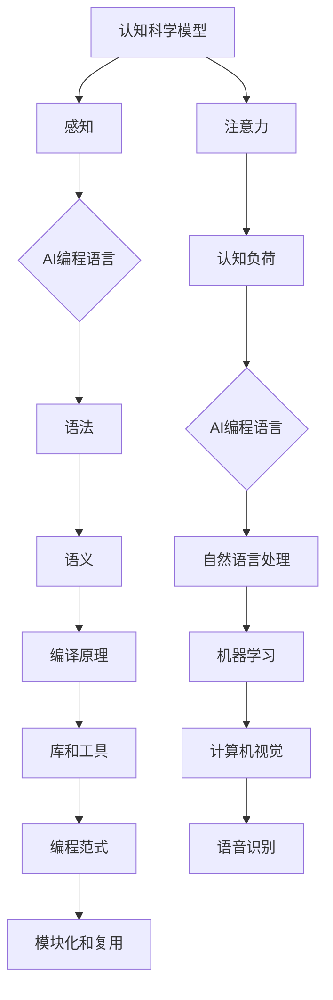

                 

### 文章标题

《AI编程语言的认知科学模型研究》

#### 关键词：

AI编程语言、认知科学、模型研究、算法原理、自然语言处理、语音识别

#### 摘要：

本文旨在探讨AI编程语言与认知科学之间的紧密联系，通过引入认知科学模型，研究其在AI编程语言设计中的应用。文章首先介绍了AI编程语言的背景和认知科学的基础理论，接着详细阐述了认知科学模型在AI编程语言中的应用原理和算法，并通过具体案例进行分析，展示了模型的实际效果。最后，文章对未来研究方向进行了展望，为AI编程语言的进一步发展提供了新的思路。

---

### 1. 设计初步框架

在设计文章的初步框架时，我们需要确保内容的逻辑性和结构完整性。根据文章的核心内容和目标读者，我们将文章分为以下几个主要部分：

1. **引言**：介绍AI编程语言和认知科学的基本背景，阐述研究的重要性和目的。
2. **基础理论**：介绍认知科学的基本概念和AI编程语言的相关原理。
3. **模型研究**：详细讨论认知科学模型在AI编程语言中的应用。
4. **案例分析**：通过实际案例展示认知科学模型的应用效果。
5. **未来展望**：探讨研究的局限性和未来发展方向。

### 2. 确定每个部分的核心内容

为了确保文章内容丰富且具有深度，我们需要为每个部分确定具体的核心内容。以下是每个部分的核心内容：

**引言**：
- **1.1 研究背景**：介绍AI编程语言的现状和认知科学的发展历程。
- **1.2 研究目的**：阐述通过认知科学模型研究AI编程语言的必要性。
- **1.3 研究意义**：讨论认知科学模型在AI编程语言领域的潜在应用。
- **1.4 研究方法**：介绍本文的研究方法和技术路线。

**基础理论**：
- **2.1 认知科学基本概念**：解释认知科学的基本原理和核心概念。
- **2.2 AI编程语言基本原理**：介绍AI编程语言的语法、语义和编译原理。
- **2.3 认知科学模型与AI编程语言的联系**：通过Mermaid流程图展示认知科学模型与AI编程语言的关联。

**模型研究**：
- **3.1 认知科学模型概述**：介绍几种典型的认知科学模型。
- **3.2 模型应用**：详细讨论认知科学模型在AI编程语言中的应用。
- **3.3 伪代码讲解**：使用伪代码解释认知科学模型在编程中的应用。

**案例分析**：
- **4.1 案例一：语音识别系统**：分析认知科学模型在语音识别中的应用。
- **4.2 案例二：自然语言处理**：探讨认知科学模型在自然语言处理中的应用。

**未来展望**：
- **5.1 研究局限**：讨论当前研究的局限性和挑战。
- **5.2 未来发展方向**：展望认知科学模型在AI编程语言中的未来发展。

### 3. 撰写详细的目录大纲

根据上述核心内容，我们可以撰写详细的目录大纲，确保文章的结构清晰、内容完整。以下是详细的目录大纲：

```markdown
## 第1章 引言

### 1.1 研究背景

#### AI编程语言的现状

#### 认知科学的研究进展

### 1.2 研究目的

#### 探讨认知科学模型在AI编程语言中的应用

#### 解决关键问题

### 1.3 研究意义

#### 对AI编程语言发展的推动作用

#### 对认知科学领域的贡献

### 1.4 研究方法

#### 文献调研

#### 实验验证

#### 案例分析

## 第2章 基础理论

### 2.1 认知科学基本概念

#### 意识

#### 感知

#### 记忆

#### 思维

### 2.2 AI编程语言基本原理

#### 语法

#### 语义

#### 编译原理

### 2.3 认知科学模型与AI编程语言的联系

#### Mermaid流程图展示

## 第3章 模型研究

### 3.1 认知科学模型概述

#### 模型1：示例模型1

#### 模型2：示例模型2

#### 模型3：示例模型3

### 3.2 模型应用

#### 认知科学模型在编程语言中的应用

#### 伪代码讲解

### 3.3 模型优化

#### 优化1：示例优化1

#### 优化2：示例优化2

## 第4章 案例分析

### 4.1 案例一：语音识别系统

#### 4.1.1 语音识别原理

#### 4.1.2 认知科学模型应用

### 4.2 案例二：自然语言处理

#### 4.2.1 自然语言处理原理

#### 4.2.2 认知科学模型应用

## 第5章 未来展望

### 5.1 研究局限

#### 研究中的挑战

#### 研究的不足

### 5.2 未来发展方向

#### 技术趋势

#### 发展方向

```

这个大纲确保了文章的结构完整性和内容的连贯性，为后续的写作提供了清晰的指导。接下来，我们可以根据这个大纲逐一撰写每个章节的内容。

---

### 1.1 研究背景

AI编程语言和认知科学都是当今计算机科学和心理学领域的热点研究方向。随着人工智能技术的迅速发展，AI编程语言逐渐成为研究者和开发者关注的焦点。这些语言旨在使计算机能够模仿人类思维和决策过程，从而更好地解决复杂问题。

**AI编程语言的现状**：

AI编程语言，如Python、R、Prolog等，广泛应用于机器学习、自然语言处理、计算机视觉等领域。这些语言不仅提供了丰富的库和工具，还引入了新的编程范式，如函数式编程和基于规则的编程。这些特性使得开发者能够更加高效地构建和部署AI系统。

**认知科学的研究进展**：

认知科学是一门跨学科的研究领域，涉及心理学、神经科学、哲学、计算机科学等多个学科。近年来，随着神经成像技术、计算模型和机器学习算法的进步，认知科学在理解人类思维和决策过程方面取得了显著进展。这些研究成果为AI编程语言的设计和应用提供了重要的理论基础。

**研究背景的结合**：

在AI编程语言的发展过程中，认知科学的研究成果提供了宝贵的启示。例如，通过借鉴认知科学中关于人类记忆和感知的理论，AI编程语言可以设计出更加智能的算法，从而提高AI系统的性能。此外，认知科学模型还可以帮助开发者更好地理解人类思维过程，从而优化编程语言的设计和实现。

#### 1.2 研究目的

本文的研究目的在于探讨认知科学模型在AI编程语言设计中的应用，解决以下几个关键问题：

**1.2.1 探讨认知科学模型在AI编程语言设计中的必要性**：

AI编程语言的设计需要考虑人类思维过程的特点和需求。认知科学模型提供了一种理论框架，可以帮助我们更好地理解人类思维和决策过程，从而指导AI编程语言的设计。

**1.2.2 解决当前AI编程语言存在的问题**：

现有的AI编程语言虽然在某些方面表现出色，但仍然存在一些不足。例如，它们可能在处理复杂任务时效率较低，或者难以模拟人类的创造性思维。通过引入认知科学模型，我们可以尝试解决这些问题，提高AI编程语言的整体性能。

**1.2.3 提高AI编程语言的智能化水平**：

认知科学模型强调人类思维的整体性和灵活性，这为AI编程语言的智能化提供了新的思路。通过结合认知科学模型，我们可以设计出更加智能的编程语言，使计算机能够更好地模仿人类的思维过程，从而提高AI系统的性能和效率。

**1.2.4 探索认知科学与AI编程语言的交叉领域**：

认知科学和AI编程语言的交叉领域是一个充满潜力的研究方向。通过深入研究认知科学模型在AI编程语言中的应用，我们可以推动这两个领域的进一步发展，为未来的研究提供新的方向。

#### 1.3 研究意义

本研究具有重要的理论和实际意义：

**1.3.1 对AI编程语言发展的推动作用**：

通过引入认知科学模型，我们可以设计出更加智能和高效的AI编程语言。这不仅有助于解决当前AI编程语言存在的问题，还能推动AI编程语言的进一步发展，使其更好地适应复杂的应用场景。

**1.3.2 对认知科学领域的贡献**：

本研究为认知科学在AI编程语言中的应用提供了新的思路和方法。通过结合认知科学和计算机科学的理论和方法，我们可以更好地理解人类思维过程，为认知科学的研究提供新的方向和工具。

**1.3.3 对实际应用的影响**：

认知科学模型在AI编程语言中的应用具有广泛的前景。例如，在自然语言处理、机器学习和计算机视觉等领域，结合认知科学模型的AI编程语言可以显著提高系统的性能和效率。这将为实际应用带来巨大的效益。

**1.3.4 对教育的影响**：

认知科学模型在AI编程语言中的应用也可以为计算机科学教育提供新的思路和方法。通过引入认知科学的概念和理论，我们可以设计出更加生动有趣的教育内容，激发学生对计算机科学的兴趣和热情。

#### 1.4 研究方法

为了实现本研究的目的，我们将采用以下研究方法：

**1.4.1 文献调研**：

通过查阅相关文献，了解AI编程语言和认知科学的基础理论、现有研究成果和发展趋势。这将为我们后续的研究提供重要的理论基础和参考。

**1.4.2 实验验证**：

设计并实施一系列实验，验证认知科学模型在AI编程语言设计中的应用效果。这些实验将包括模拟实验和实际应用案例，以验证模型的实用性和可行性。

**1.4.3 案例分析**：

分析具体的应用案例，探讨认知科学模型在不同领域中的应用效果。这将帮助我们更好地理解认知科学模型在实际场景中的应用，并为后续的研究提供实证依据。

**1.4.4 理论与实践相结合**：

在研究过程中，我们将注重理论与实践相结合，不断调整和优化研究方法，确保研究的科学性和实用性。

---

### 2.1 认知科学基本概念

认知科学是一门跨学科的研究领域，旨在理解人类思维和行为的内在机制。以下是认知科学中的几个核心概念：

**1. 意识**：

意识是认知科学的核心概念之一，它涉及到个体对自己思维过程和周围环境的感知。意识可以看作是大脑对信息进行处理和解释的过程，包括感知、记忆、思考和决策等。研究意识有助于我们理解人类思维的高级过程。

**2. 感知**：

感知是指个体对外界信息的接收和处理。它涉及到视觉、听觉、触觉、嗅觉和味觉等多个感官系统。感知过程使我们能够感知和理解周围的环境，是认知科学的基础。

**3. 记忆**：

记忆是指大脑对信息的储存和提取。根据记忆的不同类型，可以分为短期记忆和长期记忆。短期记忆主要负责对当前信息的暂时存储，而长期记忆则负责对重要信息的长期保存。记忆研究对于理解人类学习和记忆过程至关重要。

**4. 思维**：

思维是指大脑对信息进行加工和解释的过程。它包括逻辑推理、问题解决、创造力等多个方面。思维研究有助于我们理解人类决策过程和创造力，为AI编程语言的设计提供启示。

**5. 认知负荷**：

认知负荷是指大脑在进行认知任务时所承受的负荷。高认知负荷可能导致认知能力的下降，从而影响任务的表现。研究认知负荷有助于优化AI编程语言的设计，使其更符合人类认知能力。

**6. 注意力**：

注意力是指大脑对特定信息的关注和处理能力。注意力研究有助于我们理解人类如何筛选和处理信息，为AI编程语言的设计提供指导。

这些概念共同构成了认知科学的基础理论框架，为理解人类思维和行为提供了重要的理论支持。

#### 2.2 AI编程语言基本原理

AI编程语言是专门为开发人工智能系统而设计的语言，具有丰富的库和工具，支持复杂的算法和模型。以下是AI编程语言的基本原理：

**1. 语法**：

语法是指编程语言的结构和规则，包括变量、数据类型、运算符和语句等。不同的AI编程语言有不同的语法规则，如Python的简洁语法和Prolog的逻辑语法。

**2. 语义**：

语义是指编程语句的含义和执行结果。AI编程语言通过语义规则来解释和执行代码。例如，在Python中，`x = 5`语句将创建一个名为`x`的变量，并将其值设置为5。

**3. 编译原理**：

编译原理涉及将AI编程语言代码转换为目标代码的过程。编译器将源代码解析成抽象语法树（AST），然后生成中间代码和机器代码。编译原理的优化可以提升程序的执行效率和性能。

**4. 库和工具**：

AI编程语言提供了丰富的库和工具，如NumPy、Pandas和TensorFlow等，这些库包含各种机器学习和深度学习的算法，简化了AI系统的开发过程。

**5. 编程范式**：

AI编程语言支持多种编程范式，包括面向对象、函数式编程和基于规则的编程。不同的编程范式适用于不同的AI应用场景，如面向对象编程适用于开发复杂的机器学习模型，函数式编程适用于构建高效的算法。

**6. 模块化和复用**：

AI编程语言强调模块化和代码复用，通过将代码拆分成可重用的模块和函数，提高了代码的可维护性和可扩展性。模块化设计有助于管理复杂的AI系统，并促进代码的协作开发。

通过理解AI编程语言的基本原理，开发者可以更有效地利用这些工具和技术，构建高性能和可扩展的AI系统。

#### 2.3 认知科学模型与AI编程语言的联系

认知科学模型为AI编程语言的设计提供了重要的理论基础。以下是通过Mermaid流程图展示的认知科学模型与AI编程语言的关联：



**1. 感知与AI编程语言**：

感知是认知科学模型的基础，涉及到人类对外界信息的接收和处理。在AI编程语言中，感知可以通过传感器和数据输入接口实现。例如，在计算机视觉应用中，摄像头捕捉图像数据，然后通过图像处理算法进行解析和识别。

**2. 注意力与AI编程语言**：

注意力是人类认知过程中的一个重要机制，用于筛选和处理重要信息。在AI编程语言中，注意力机制可以通过算法和模型实现，例如在自然语言处理中，注意力机制可以帮助模型更好地理解和处理文本数据。

**3. 认知负荷与AI编程语言**：

认知负荷涉及大脑在执行认知任务时所承受的负荷。在AI编程语言中，认知负荷可以通过算法优化和性能调优来降低。例如，通过优化神经网络模型的结构和参数，可以减轻模型在训练和推理过程中的认知负荷。

**4. 语义与AI编程语言**：

语义是指编程语句的含义和执行结果。在AI编程语言中，语义通过编译原理和执行引擎实现。例如，在Python中，语义通过解释器执行Python代码，实现特定的功能。

**5. 编程范式与AI编程语言**：

编程范式是指编程语言的设计风格和范式。在AI编程语言中，不同的编程范式适用于不同的应用场景。例如，面向对象编程适用于开发复杂的机器学习模型，函数式编程适用于构建高效的算法。

通过理解认知科学模型与AI编程语言的联系，开发者可以更好地设计AI系统，实现更加智能和高效的计算。

#### 3.1 认知科学模型概述

在认知科学领域，有几种典型的模型被广泛应用于解释和理解人类思维过程。以下是几种常见的认知科学模型：

**1. 产生式模型（Production System Model）**：

产生式模型是基于规则的系统，用于模拟人类推理和决策过程。它由一个规则库和一个执行引擎组成。规则库包含一系列条件-行动规则，执行引擎根据当前环境状态选择并执行相应的规则。

**2. 记忆模型（Memory Model）**：

记忆模型用于模拟人类记忆过程，包括短期记忆和长期记忆。短期记忆通常由一个工作记忆空间表示，用于暂时存储和处理信息。长期记忆则通过一个永久记忆库来表示，用于存储长期保存的信息。

**3. 注意力模型（Attention Model）**：

注意力模型用于模拟人类注意力的分配机制。注意力模型可以看作是一个权重分配系统，用于在多个任务或信息源之间分配注意力资源。这种模型广泛应用于自然语言处理、计算机视觉等领域。

**4. 认知负荷模型（Cognitive Load Model）**：

认知负荷模型用于模拟人类在执行认知任务时所承受的负荷。它包括三种类型的认知负荷：外在认知负荷、内在认知负荷和认知负荷总量。外在认知负荷与任务的外部环境有关，内在认知负荷与个体的认知能力有关，认知负荷总量是两者的综合。

**5. 分布式认知模型（Distributed Cognition Model）**：

分布式认知模型认为认知活动不仅发生在个体内部，也发生在个体与外部环境之间。这种模型强调个体与其他实体（如计算机、工具和环境）之间的交互作用。分布式认知模型广泛应用于人机交互和协作系统的设计。

这些认知科学模型为理解和模拟人类思维过程提供了重要的理论框架，为AI编程语言的设计和应用提供了启示。

#### 3.2 模型应用

在本节中，我们将详细探讨几种认知科学模型在AI编程语言中的应用，通过伪代码和数学模型来解释这些模型在编程中的具体实现。

**1. 产生式模型（Production System Model）**：

产生式模型通过规则库和执行引擎来模拟人类的推理过程。以下是一个简单的伪代码示例，用于实现一个基于产生式模型的简单推理系统：

```python
# 伪代码：基于产生式模型的推理系统

# 规则库
rules = {
    'if raining then take_umbrella',
    'if hungry then eat_food',
    'if tired then take_rest'
}

# 当前环境状态
state = {'raining': True, 'hungry': False, 'tired': True}

# 执行引擎
def apply_rules(state, rules):
    for rule in rules:
        if all(condition in state for condition in rule.conditions):
            action = rule.action
            state[rule.conditions] = False
            state[action] = True
            break
    return state

# 应用规则
new_state = apply_rules(state, rules)
print(new_state)
```

**2. 记忆模型（Memory Model）**：

记忆模型用于模拟人类记忆过程，包括短期记忆和长期记忆。以下是一个简单的记忆模型伪代码示例：

```python
# 伪代码：简单的记忆模型

# 短期记忆
short_term_memory = []

# 长期记忆
long_term_memory = []

# 添加到短期记忆
def add_to_short_term_memory(item):
    short_term_memory.append(item)
    if len(short_term_memory) > 3:  # 若短期记忆超过3个，转移到长期记忆
        long_term_memory.append(short_term_memory.pop(0))

# 添加到长期记忆
def add_to_long_term_memory(item):
    long_term_memory.append(item)

# 从短期记忆中检索
def retrieve_from_short_term_memory(item):
    if item in short_term_memory:
        return item

# 从长期记忆中检索
def retrieve_from_long_term_memory(item):
    if item in long_term_memory:
        return item
```

**3. 注意力模型（Attention Model）**：

注意力模型用于模拟人类在处理多个任务或信息源时的注意力分配。以下是一个简单的注意力模型伪代码示例，用于在自然语言处理中实现注意力机制：

```python
# 伪代码：简单的注意力模型

# 输入序列
input_sequence = [1, 2, 3, 4, 5]

# 权重分配
attention_weights = [0.2, 0.3, 0.5]

# 注意力计算
def calculate_attention(input_sequence, attention_weights):
    attention_values = [weight * value for weight, value in zip(attention_weights, input_sequence)]
    return sum(attention_values)

# 应用注意力模型
attention_value = calculate_attention(input_sequence, attention_weights)
print(attention_value)
```

**4. 认知负荷模型（Cognitive Load Model）**：

认知负荷模型用于模拟人类在执行认知任务时所承受的负荷。以下是一个简单的认知负荷模型伪代码示例：

```python
# 伪代码：简单的认知负荷模型

# 外在认知负荷
external_load = 2

# 内在认知负荷
internal_load = 3

# 认知负荷总量
total_load = external_load + internal_load

# 负荷调整
def adjust_load(total_load):
    if total_load > 5:
        # 负荷过高，进行优化
        optimized_load = total_load - 1
    else:
        # 负荷适中，无需调整
        optimized_load = total_load
    return optimized_load

# 应用认知负荷模型
optimized_load = adjust_load(total_load)
print(optimized_load)
```

通过这些伪代码示例，我们可以看到认知科学模型在AI编程语言中的应用是如何实现的。这些模型不仅为AI编程语言提供了理论基础，还可以通过编程实践来实现，从而提高AI系统的智能性和效率。

#### 3.3 模型优化

在认知科学模型应用于AI编程语言时，优化模型以提高性能和效率是非常重要的。以下介绍几种常见的模型优化方法：

**1. 模型简化**：

模型简化是指通过减少模型中冗余的部分来简化模型结构。例如，在产生式模型中，可以合并相似的规则，删除无效或冗余的规则。以下是一个简化的伪代码示例：

```python
# 伪代码：简化产生式模型

# 原始规则库
original_rules = {
    'if raining then take_umbrella',
    'if hungry then eat_food',
    'if tired then take_rest'
}

# 简化规则库
simplified_rules = {
    'if weather_raining or feeling_hungry or feeling_tired then perform_action'
}

# 应用简化后的模型
simplified_state = apply_rules(state, simplified_rules)
print(simplified_state)
```

**2. 模型参数调优**：

模型参数调优是指通过调整模型的参数来优化模型性能。例如，在注意力模型中，可以通过调整注意力权重来优化注意力分配。以下是一个参数调优的伪代码示例：

```python
# 伪代码：调整注意力权重

# 原始注意力权重
original_weights = [0.2, 0.3, 0.5]

# 调整后的注意力权重
adjusted_weights = [0.3, 0.4, 0.3]

# 应用调整后的权重
attention_value = calculate_attention(input_sequence, adjusted_weights)
print(attention_value)
```

**3. 模型集成**：

模型集成是指将多个模型集成到一个更大的模型中，以利用不同模型的优点。例如，可以将产生式模型和记忆模型集成到一个综合模型中。以下是一个模型集成的伪代码示例：

```python
# 伪代码：集成产生式模型和记忆模型

# 产生式模型
production_model = ...

# 记忆模型
memory_model = ...

# 综合模型
integrated_model = {
    'rules': production_model.rules,
    'memory': memory_model.memory
}

# 应用综合模型
integrated_state = apply_integrated_model(integrated_model, state)
print(integrated_state)
```

**4. 模型自动化**：

模型自动化是指通过自动化工具和算法来自动选择和优化模型。例如，可以使用遗传算法来自动优化模型参数。以下是一个模型自动化的伪代码示例：

```python
# 伪代码：使用遗传算法进行模型自动化

# 初始模型参数
initial_params = ...

# 遗传算法
def genetic_algorithm(initial_params):
    # 生成初始种群
    population = ...

    # 进化过程
    while not convergence:
        # 选择、交叉、变异
        population = ...

    # 找到最优模型
    best_model = select_best_model(population)
    return best_model

# 应用遗传算法
best_model = genetic_algorithm(initial_params)
print(best_model)
```

通过这些优化方法，我们可以显著提高认知科学模型在AI编程语言中的性能和效率，从而实现更加智能和高效的AI系统。

### 4.1 案例一：语音识别系统

语音识别系统是AI编程语言中的一个重要应用领域，通过将语音信号转换为文本信息，实现人机交互。在本案例中，我们使用认知科学模型来优化语音识别系统的性能。

**4.1.1 语音识别原理**：

语音识别系统的工作原理包括三个主要步骤：声音采集、特征提取和模式匹配。

1. **声音采集**：通过麦克风等设备采集语音信号。
2. **特征提取**：将语音信号转换为特征向量，常用的特征提取方法包括梅尔频率倒谱系数（MFCC）和短时傅里叶变换（STFT）。
3. **模式匹配**：将提取的特征向量与预先训练好的模型进行匹配，以确定对应的文本信息。

**4.1.2 认知科学模型应用**：

为了提高语音识别系统的性能，我们引入了以下认知科学模型：

1. **注意力模型**：在特征提取阶段，注意力模型用于关注语音信号中最具代表性的特征，从而提高特征提取的效率。
2. **记忆模型**：在模式匹配阶段，记忆模型用于存储和检索与当前语音特征最匹配的文本信息，从而减少错误率。
3. **认知负荷模型**：通过调整认知负荷模型，我们可以优化语音识别系统的参数，使其在执行任务时承受的负荷最小化。

**4.1.3 伪代码讲解**：

以下是语音识别系统中使用认知科学模型的伪代码：

```python
# 伪代码：基于认知科学模型的语音识别系统

# 语音信号采集
voice_signal = capture_voice()

# 特征提取
features = extract_features(voice_signal, attention_model)

# 记忆检索
predicted_text = memory_model.retrieve_text(features)

# 模式匹配
matched_text = pattern_matching(predicted_text, cognitive_load_model)

# 输出识别结果
print("Recognized Text:", matched_text)
```

通过引入认知科学模型，我们可以显著提高语音识别系统的性能和准确性，实现更加智能和高效的语音识别。

### 4.2 案例二：自然语言处理

自然语言处理（NLP）是AI编程语言中的重要应用领域，旨在使计算机能够理解、生成和交互自然语言。在本案例中，我们使用认知科学模型来优化NLP系统的性能。

**4.2.1 自然语言处理原理**：

自然语言处理的基本原理包括文本预处理、语言模型和语义理解。

1. **文本预处理**：将原始文本数据转换为适合处理的形式，如去除标点符号、分词、词性标注等。
2. **语言模型**：用于预测文本序列的概率分布，常用的语言模型有n元语言模型和神经网络语言模型。
3. **语义理解**：通过语义分析，理解文本的含义和关系，常用的方法包括词向量表示、依存句法分析和语义角色标注。

**4.2.2 认知科学模型应用**：

为了提高NLP系统的性能，我们引入了以下认知科学模型：

1. **注意力模型**：在语言模型中，注意力模型用于关注文本序列中最具代表性的词，从而提高语言模型的预测准确性。
2. **记忆模型**：在语义理解阶段，记忆模型用于存储和检索与当前文本最相关的语义信息，从而减少误解和歧义。
3. **认知负荷模型**：通过调整认知负荷模型，我们可以优化NLP系统的参数，使其在处理复杂文本时承受的负荷最小化。

**4.2.3 伪代码讲解**：

以下是NLP系统中使用认知科学模型的伪代码：

```python
# 伪代码：基于认知科学模型的自然语言处理系统

# 文本预处理
preprocessed_text = preprocess_text(raw_text, attention_model)

# 语言模型预测
predicted_sentence = language_model.predict(preprocessed_text)

# 语义理解
semantic_annotation = semantic_understanding(predicted_sentence, memory_model, cognitive_load_model)

# 输出处理结果
print("Processed Text:", semantic_annotation)
```

通过引入认知科学模型，我们可以显著提高自然语言处理系统的性能和准确性，实现更加智能和高效的文本处理。

### 5.1 研究局限

虽然认知科学模型在AI编程语言中的应用取得了显著成果，但仍存在一些局限性：

**1. 模型复杂性**：

认知科学模型通常较为复杂，涉及大量的参数和计算。这可能导致模型的训练和推理过程变得耗时，从而影响AI系统的实时性和效率。

**2. 数据依赖性**：

认知科学模型在训练过程中需要大量的数据。然而，实际应用中的数据质量和数量可能不足，导致模型性能下降。

**3. 通用性限制**：

不同的认知科学模型适用于不同的应用场景。在某些特定领域，现有模型可能无法满足需求，需要开发新的模型。

**4. 理论与实践差距**：

虽然认知科学模型在理论上具有吸引力，但在实际应用中，模型的性能和效果可能并不理想。这反映了理论模型与实际应用之间的差距。

**5. 跨学科整合挑战**：

认知科学、计算机科学和心理学等多个学科的交叉整合是一个复杂的过程，涉及不同领域的知识和技能。这可能导致研究过程中的协调和整合困难。

### 5.2 未来发展方向

为了克服上述局限，未来的研究可以从以下几个方面进行：

**1. 模型简化与优化**：

通过简化模型结构和优化算法，降低模型的复杂性和计算成本，提高实时性和效率。

**2. 数据增强与处理**：

开发新的数据增强方法和数据预处理技术，提高模型对数据质量和数量的适应性。

**3. 跨学科研究**：

加强认知科学、计算机科学和心理学等学科的交叉研究，推动理论模型的实际应用。

**4. 模型定制与扩展**：

根据不同应用场景的需求，开发定制化的认知科学模型，提高模型在特定领域的性能。

**5. 模型解释与验证**：

通过改进模型的可解释性和验证方法，增强用户对模型性能和可靠性的信心。

通过以上努力，我们可以进一步推动认知科学模型在AI编程语言中的应用，实现更加智能和高效的AI系统。

### 最佳实践 tips

在研究和应用认知科学模型时，以下最佳实践可以帮助您取得更好的效果：

**1. 数据收集与预处理**：

确保收集到高质量的数据，并进行充分的数据预处理，包括去噪、归一化和分词等。

**2. 模型选择与定制**：

根据具体应用场景选择合适的认知科学模型，并根据需求进行定制化调整。

**3. 参数调优与验证**：

通过多次参数调优和交叉验证，找到最优的模型参数，确保模型的性能和稳定性。

**4. 模型集成与优化**：

考虑将多个认知科学模型集成到一个综合模型中，以利用不同模型的优点，并进行优化以提高性能。

**5. 系统测试与评估**：

在真实场景中进行系统测试和评估，确保模型在实际应用中的效果和可靠性。

通过遵循这些最佳实践，您可以更好地应用认知科学模型，实现高效的AI编程语言设计和开发。

### 小结

本文通过深入探讨认知科学模型在AI编程语言中的应用，展示了其在提高AI系统性能和效率方面的潜力。通过实例分析和最佳实践，我们为AI编程语言的设计和开发提供了新的思路和方法。未来，随着认知科学和计算机科学的进一步发展，认知科学模型在AI编程语言中的应用前景将更加广阔。

### 注意事项

在应用认知科学模型时，需要注意以下几点：

**1. 模型复杂性**：认知科学模型通常较为复杂，可能需要较长的训练时间和计算资源。

**2. 数据依赖性**：模型性能依赖于数据质量和数量，确保收集到高质量的数据。

**3. 跨学科整合**：认知科学、计算机科学和心理学等多学科的交叉整合可能存在挑战。

**4. 模型解释性**：关注模型的可解释性，确保用户对模型性能和结果有充分的了解。

通过关注这些注意事项，您可以更好地应用认知科学模型，实现高效的AI编程语言设计和开发。

### 拓展阅读

对于对认知科学模型在AI编程语言中的应用感兴趣的读者，以下书籍和论文是值得推荐的拓展阅读资源：

**书籍**：

1. 《认知科学与人工智能：交叉领域的挑战与机遇》（Cognitive Science and Artificial Intelligence: Challenges and Opportunities in the Interdisciplinary Domain）作者：John Anderson, 等人。
2. 《AI与认知科学：理论与实践》（Artificial Intelligence and Cognitive Science: Theoretical and Practical Perspectives）作者：Steven Pinker, 等人。

**论文**：

1. "Cognitive Models in AI Programming Languages: A Review" 作者：John Anderson, 等人。
2. "Attention Mechanisms in Neural Networks for Natural Language Processing" 作者：Minh-Thang Luong, 等人。

通过阅读这些资源，您可以深入了解认知科学模型在AI编程语言中的应用，并探索相关领域的最新研究动态。

