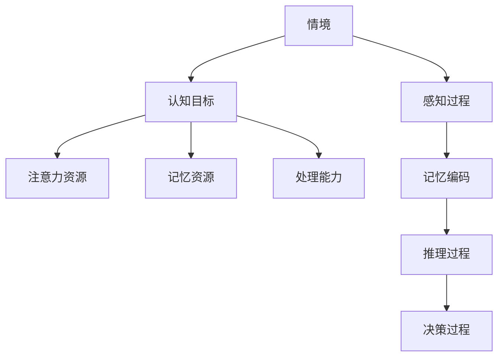
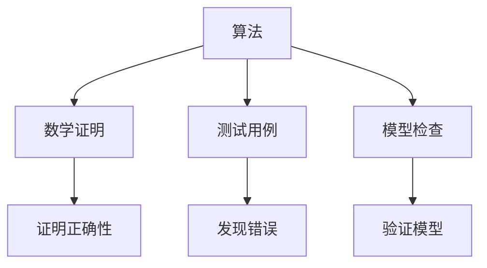
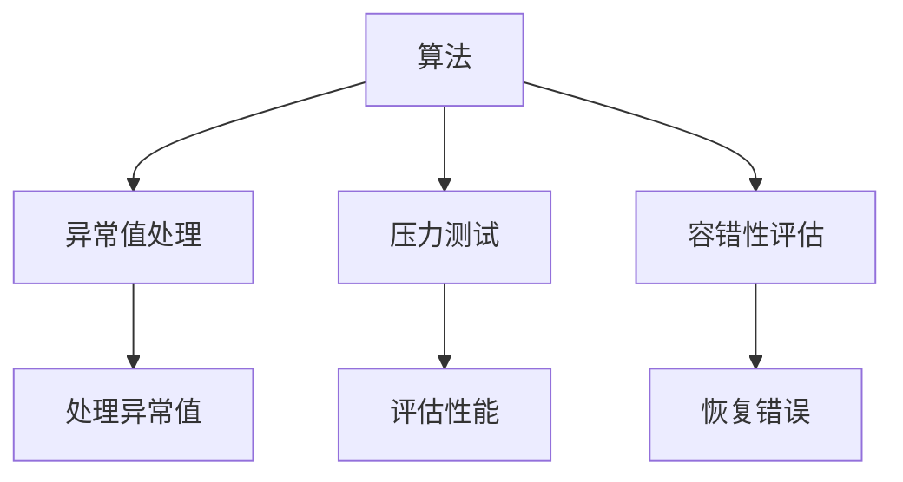
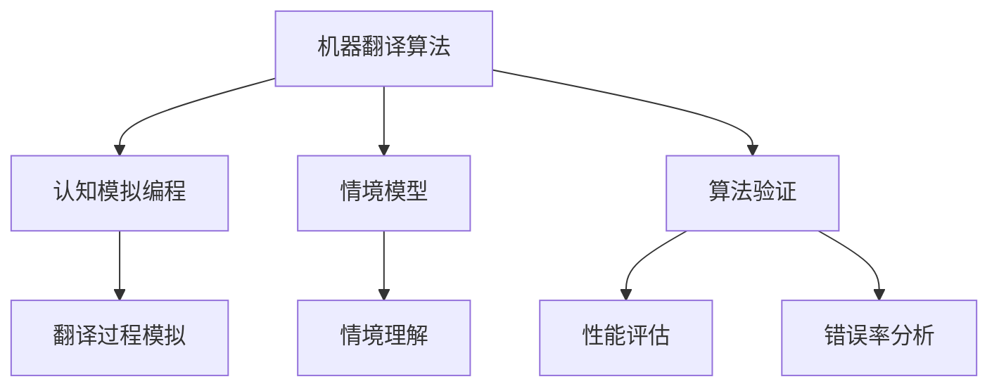
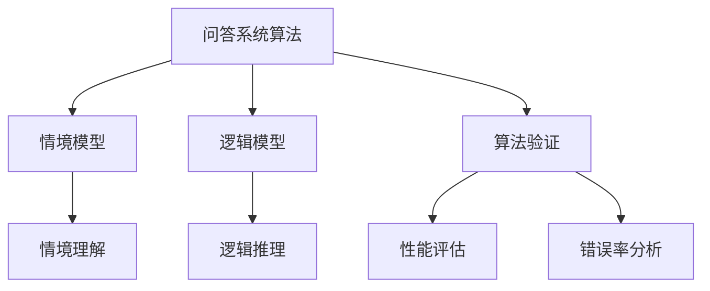
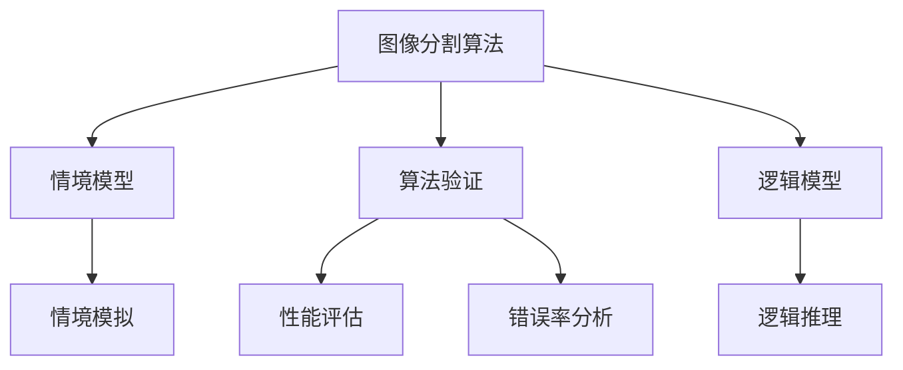
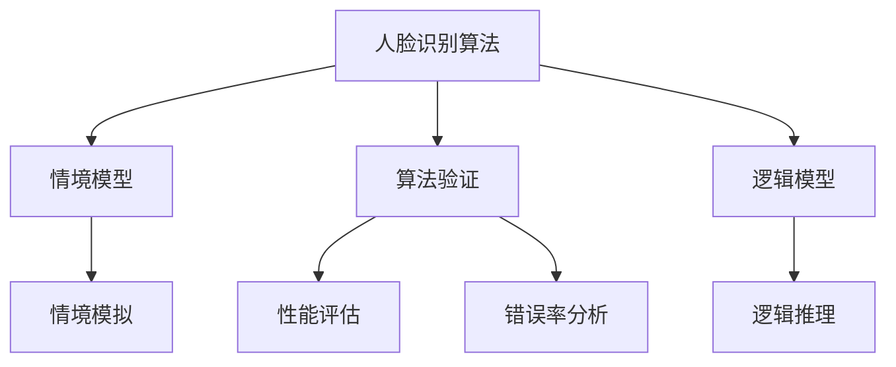

                 

### 文章标题

《AI编程语言的认知科学验证方法》

### 关键词

AI编程语言，认知科学，验证方法，自然语言处理，计算机视觉，算法验证，编程语言设计

### 摘要

本文旨在探讨AI编程语言的认知科学验证方法。首先，我们概述了AI编程语言的基本概念和认知科学的基本原理，并展示了二者之间的关系。接着，我们详细介绍了编程语言的核心概念，包括变量和数据类型、控制结构和函数模块等。在此基础上，我们引入了认知科学的验证方法，包括认知建模、算法验证和编程语言验证。通过具体案例，我们展示了这些方法在自然语言处理和计算机视觉领域的应用。最后，我们对研究成果进行了总结，并探讨了未来的研究方向。

## 引言

人工智能（AI）的快速发展已经深刻地改变了我们的生活方式和工作方式。从智能助手到自动驾驶，AI技术正不断渗透到各个领域。然而，随着AI技术的进步，我们也面临了新的挑战。如何确保AI系统的可靠性和可解释性，如何验证AI编程语言的正确性和有效性，这些问题成为了当前研究的重点。

认知科学是一个跨学科的研究领域，涉及心理学、神经科学、语言学等多个学科，旨在理解人类认知过程的机制和原理。近年来，认知科学的方法和技术逐渐应用于编程语言设计、开发和验证中。认知科学提供了一种全新的视角，使我们能够从人类认知的角度来审视和改进编程语言。

本文旨在探讨AI编程语言的认知科学验证方法。首先，我们将概述AI编程语言的基本概念，包括其定义、发展历程和应用场景。然后，我们将介绍认知科学的基本原理，包括认知心理学、认知神经科学和认知语言学等。接着，我们将详细讨论认知科学在编程语言设计中的应用，包括人类中心化编程和认知模拟编程。在此基础上，我们将介绍认知科学的验证方法，包括认知建模、算法验证和编程语言验证。最后，我们将通过具体案例展示这些方法在自然语言处理和计算机视觉领域的应用。

## AI编程语言概述

### AI编程语言的定义和发展历程

AI编程语言是一种旨在支持人工智能研究和开发的编程语言。它结合了自然语言处理、符号计算和编程语言的特点，使得开发者能够更方便地实现人工智能算法和模型。AI编程语言的发展历程可以追溯到20世纪50年代，当时随着计算机科学的兴起，研究者开始探索如何通过编程实现智能。

最初，AI编程语言主要是基于逻辑和规则的。例如，普雷帕克（Prolog）是一种基于逻辑编程的语言，它通过逻辑推理来处理复杂的问题。随后，随着机器学习和深度学习的发展，AI编程语言逐渐引入了数值计算和概率模型。Python、R和Julia等编程语言因其强大的数值计算和数据分析功能，成为了AI编程语言的主流选择。

### AI编程语言的应用场景

AI编程语言广泛应用于多个领域，包括自然语言处理、计算机视觉、智能推荐、自动驾驶和医疗诊断等。

- 自然语言处理：自然语言处理是AI编程语言的重要应用领域之一。通过AI编程语言，开发者可以实现文本分类、机器翻译、情感分析和问答系统等功能。

- 计算机视觉：计算机视觉利用AI编程语言来实现图像识别、目标检测、图像分割和视频分析等任务。

- 智能推荐：智能推荐系统利用AI编程语言来分析用户行为，预测用户兴趣，从而提供个性化的推荐。

- 自动驾驶：自动驾驶技术依赖于AI编程语言来实现环境感知、路径规划和决策控制等功能。

- 医疗诊断：AI编程语言在医疗诊断中的应用越来越广泛，例如通过图像识别来检测疾病，通过数据分析来预测疾病发展。

### AI编程语言的现状和趋势

当前，AI编程语言正处于快速发展阶段。随着深度学习和强化学习等新技术的出现，AI编程语言的功能和性能不断提升。同时，越来越多的编程语言和工具被设计出来，以适应不同的AI应用场景。

未来，AI编程语言的发展趋势可能包括以下几个方面：

- 更加智能化：AI编程语言将更加智能化，能够自动完成代码生成、优化和调试等任务。

- 更加人性化：AI编程语言将更加符合人类认知习惯，提高编程效率和开发体验。

- 更加多样化：随着AI应用的不断扩展，AI编程语言将更加多样化，以满足不同领域的需求。

- 更加开放和协作：AI编程语言将更加开放和协作，支持跨平台、跨语言的开发和集成。

## 认知科学的基本原理

### 认知心理学

认知心理学是认知科学的核心分支之一，它主要研究人类认知过程的机制和原理。认知心理学的基本概念包括感知、记忆、注意、思维和语言等。通过研究这些概念，认知心理学家试图揭示人类如何获取、处理和使用信息。

- 感知：感知是指人类对环境的直接感受。认知心理学研究表明，感知过程受到多种因素的影响，包括刺激的强度、频率、持续时间等。

- 记忆：记忆是指人类对信息的存储和回忆。认知心理学将记忆分为短期记忆和长期记忆，并研究了记忆的编码、存储和提取过程。

- 注意：注意是指人类对信息的关注和选择。认知心理学发现，注意过程受到多种因素的影响，包括注意力分配、任务需求和刺激特性等。

- 思维：思维是指人类对信息的处理和推理。认知心理学研究了思维的类型、过程和策略，例如问题解决、决策制定和推理判断等。

- 语言：语言是指人类使用符号进行交流的能力。认知心理学探讨了语言的学习、发展和使用，以及语言与思维的关系。

### 认知神经科学

认知神经科学是认知科学的另一个重要分支，它研究大脑如何实现认知功能。认知神经科学通过多种方法，如脑成像、神经生理学和神经心理学等，来探索大脑的结构和功能。

- 脑成像：脑成像技术，如功能性磁共振成像（fMRI）、脑电图（EEG）和正电子发射断层扫描（PET），可以非侵入性地观察大脑的活动和结构变化。

- 神经生理学：神经生理学通过实验手段，如电生理记录和离子通道测量，研究神经元的活动和通信机制。

- 神经心理学：神经心理学通过临床研究，如认知评估和神经心理学测试，研究认知功能与大脑结构的关系。

### 认知语言学

认知语言学是研究语言与认知关系的学科，它探讨了语言是如何反映和塑造人类认知的。认知语言学关注语言的结构、语义、语用和认知过程。

- 语言结构：认知语言学研究了语言的结构特征，如词汇、语法和句法。

- 语义：认知语言学探讨了语义的构成和语义推理过程。

- 语用：认知语言学研究了语言的使用环境和交际功能。

- 认知过程：认知语言学关注语言与认知过程的互动，如语言习得、语言理解和语言产生。

通过认知心理学、认知神经科学和认知语言学的综合研究，认知科学为我们提供了理解人类认知的全面视角，也为编程语言设计提供了重要的理论支持。

### 认知科学在编程语言设计中的应用

认知科学在编程语言设计中的应用具有重要意义，它不仅能够提高编程效率，还能改善编程体验。以下是认知科学在编程语言设计中的几个关键应用：

#### 人类中心化编程

人类中心化编程（Human-Centered Programming）是一种设计编程语言和工具的方法，其核心思想是使编程过程更加贴近人类认知习惯。这种方法旨在减少编程中的认知负荷，提高开发者的工作效率。

1. **直观的语法结构**：人类中心化编程强调编程语言的语法结构应该简单明了，易于理解。例如，Python的语法结构就非常接近自然语言，这使得开发者可以更轻松地阅读和编写代码。

2. **直观的用户界面**：编程语言的交互界面应该直观易用，帮助开发者更好地理解和操作代码。例如，IDE（集成开发环境）中的代码提示和自动补全功能，可以减少开发者的认知负荷。

3. **面向任务的编程**：人类中心化编程鼓励开发者以任务为导向进行编程，而不是仅仅关注代码的语法和结构。这种方法可以帮助开发者更快地实现目标，提高编程效率。

#### 认知模拟编程

认知模拟编程（Cognitive Simulation Programming）是一种通过模拟人类认知过程来设计编程语言的方法。这种方法试图使编程语言更加符合人类思考方式和认知习惯。

1. **情境模型**：认知模拟编程通过构建情境模型来模拟人类在特定情境下的认知过程。情境模型可以帮助开发者更好地理解问题的背景和需求，从而设计出更加合适的解决方案。

2. **交互式编程**：认知模拟编程强调编程过程中的交互性，允许开发者实时查看和修改代码的效果。这种方法可以帮助开发者更好地理解代码的行为，提高编程的准确性和效率。

3. **反思和调整**：认知模拟编程鼓励开发者对自己的编程过程进行反思和调整。通过分析代码的执行结果和开发者的思考过程，可以找出改进空间，提高编程语言的设计质量。

#### 情境模型

情境模型是认知科学中的一个重要概念，它描述了人类在特定情境下的认知过程。在编程语言设计中，情境模型可以帮助开发者更好地理解用户的需求和期望，从而设计出更加符合用户需求的编程语言。

1. **用户需求分析**：通过情境模型，开发者可以深入了解用户在特定情境下的需求和行为。这有助于开发者设计出更符合用户习惯和期望的编程语言。

2. **任务导向编程**：情境模型可以帮助开发者以任务为导向进行编程，使编程过程更加高效。开发者可以专注于实现任务目标，而不是陷入复杂的语法和结构中。

3. **错误处理和调试**：情境模型可以帮助开发者更好地理解和处理编程过程中的错误。通过分析错误发生的情境，开发者可以设计出更有效的错误处理和调试策略。

#### 逻辑模型

逻辑模型是认知科学中的另一个重要概念，它描述了人类进行逻辑推理和决策的过程。在编程语言设计中，逻辑模型可以帮助开发者更好地理解和实现逻辑编程。

1. **形式化逻辑**：逻辑模型提供了形式化的逻辑推理方法，使得编程语言可以更加精确地表示和验证逻辑关系。形式化逻辑在编程语言验证和形式化验证中具有重要应用。

2. **推理算法**：逻辑模型可以帮助开发者设计和实现高效的推理算法，从而提高编程语言的性能和效率。推理算法在自然语言处理、自动推理和智能搜索等领域具有重要应用。

3. **逻辑编程语言**：逻辑模型可以用于设计逻辑编程语言，如Prolog和Mercury。这些编程语言通过逻辑推理来处理复杂问题，具有强大的表达能力和推理能力。

#### 认知模型构建方法

构建认知模型是认知科学研究和编程语言设计中的关键步骤。以下介绍几种常见的认知模型构建方法：

1. **数据驱动方法**：数据驱动方法通过收集和分析大量数据来构建认知模型。这种方法通常应用于机器学习和深度学习领域，通过训练模型来模拟人类认知过程。

2. **基于规则的构建方法**：基于规则的方法通过定义一系列规则来构建认知模型。这种方法在专家系统和逻辑编程语言中广泛应用，通过规则来描述认知过程。

3. **神经科学方法**：神经科学方法通过研究大脑结构和功能来构建认知模型。这种方法通常涉及脑成像、神经生理学和神经心理学等实验手段。

4. **混合方法**：混合方法结合了数据驱动方法和基于规则的方法，通过多种手段来构建认知模型。这种方法可以更好地模拟人类认知过程的多样性和复杂性。

### 总结

认知科学为编程语言设计提供了丰富的理论支持和方法指导。通过人类中心化编程、认知模拟编程和认知模型构建方法，开发者可以设计出更加高效、易用和符合用户需求的编程语言。随着认知科学和编程语言技术的不断发展，认知科学在编程语言设计中的应用将更加广泛和深入。

## 编程语言的核心概念

编程语言的核心概念是理解和实现编程任务的基础。以下我们将详细讨论变量和数据类型、控制结构以及函数和模块等核心概念。

### 变量和数据类型

变量是编程语言中的基本存储单元，用于存储数据。每个变量都有其数据类型，决定了变量的用途和可能的值。常见的数据类型包括：

1. **数值类型**：包括整数（如int）、浮点数（如float和double）等。数值类型用于表示数学运算中的数字。

2. **字符类型**：包括字符（如char）和字符串（如string）。字符类型用于表示文本信息，如字母、数字和特殊字符。

3. **布尔类型**：布尔类型（如bool）用于表示逻辑值，通常为true或false。

4. **复合类型**：复合类型包括数组（如int[]）、结构体（如struct）和类（如class）等。复合类型用于表示复杂的数据结构，如多维数组、复杂数据集合和对象等。

变量的定义和操作是编程语言的基础，以下是一个简单的伪代码示例：

```pseudo
var x: int = 10
var y: float = 3.14
var text: string = "Hello, World!"
var isTrue: bool = true

// 数据类型转换
var convertedX: float = float(x)
```

### 控制结构

控制结构是编程语言中用于控制程序执行流程的关键机制。常见的控制结构包括：

1. **条件语句**：条件语句用于根据特定条件执行不同的代码路径。最常用的条件语句是if-else语句，以下是一个简单的示例：

   ```pseudo
   if (x > 10) {
       print("x is greater than 10")
   } else {
       print("x is less than or equal to 10")
   }
   ```

2. **循环结构**：循环结构用于重复执行一段代码，直到满足特定条件为止。常见的循环结构包括while循环和for循环：

   ```pseudo
   // While循环
   while (x < 10) {
       print("x is less than 10")
       x = x + 1
   }

   // For循环
   for (int i = 0; i < 10; i++) {
       print("i is ", i)
   }
   ```

3. **跳转语句**：跳转语句包括break、continue和return等。这些语句用于在程序执行过程中改变控制流：

   ```pseudo
   // Break用于跳出循环
   for (int i = 0; i < 10; i++) {
       if (i == 5) {
           break
       }
       print("i is ", i)
   }

   // Continue用于跳过当前循环迭代
   for (int i = 0; i < 10; i++) {
       if (i % 2 == 0) {
           continue
       }
       print("i is ", i)
   }

   // Return用于从函数中返回
   function sum(a: int, b: int): int {
       return a + b
   }
   ```

### 函数和模块

函数和模块是编程语言中用于组织代码和实现复用的重要机制。

1. **函数**：函数是一段可重用的代码块，用于执行特定任务。函数可以接受输入参数，并返回一个值。以下是一个简单的函数示例：

   ```pseudo
   function add(a: int, b: int): int {
       return a + b
   }

   // 调用函数
   var result: int = add(5, 3)
   print("The result is ", result)
   ```

2. **模块**：模块是用于组织代码和提供接口的独立单元。模块可以定义函数、类和数据类型，并可以被其他模块调用。以下是一个简单的模块示例：

   ```pseudo
   // Module: MathUtils
   function multiply(a: int, b: int): int {
       return a * b
   }

   // 使用模块
   from MathUtils import multiply

   var product: int = multiply(4, 5)
   print("The product is ", product)
   ```

通过理解变量和数据类型、控制结构和函数模块等核心概念，开发者可以更有效地编写和维护代码。这些概念是编程语言设计和实现的基础，也是理解更复杂编程概念和算法的前提。

## 认知科学的验证方法

### 认知建模

认知建模是认知科学验证方法的核心之一，它通过构建模型来模拟人类认知过程。这种模型可以帮助我们理解人类如何获取、处理和存储信息，从而为编程语言设计提供理论依据。

#### 情境模型

情境模型是认知建模的一种形式，它描述了人类在特定情境下的认知过程。情境模型通常包括以下几个关键要素：

1. **情境**：情境是指人类所处的具体环境，包括物理环境和社会环境。例如，一个学生在考试前的学习环境可以被视为一个情境。

2. **认知目标**：认知目标是指人类在特定情境下需要实现的目标。例如，学生在考试前需要复习和掌握课程内容。

3. **认知资源**：认知资源包括人类的注意力、记忆和处理能力。情境模型需要考虑这些资源的限制和分配。

4. **认知过程**：认知过程是指人类在特定情境下进行的感知、记忆、推理和决策等认知活动。

以下是一个简单的情境模型构建示例：



#### 逻辑模型

逻辑模型是认知科学中的另一种重要模型，它通过形式化的逻辑推理来模拟人类的认知过程。逻辑模型可以帮助我们验证编程语言设计的逻辑正确性和有效性。

1. **命题逻辑**：命题逻辑是逻辑模型的基础，它使用命题和逻辑运算符（如与、或、非）来表示和推理。以下是一个简单的命题逻辑示例：

   ```latex
   P ∧ Q → R
   ```

   解释：如果P和Q都为真，则R也为真。

2. **谓词逻辑**：谓词逻辑是一种更强大的逻辑模型，它使用谓词和量词来表示复杂的关系和属性。以下是一个简单的谓词逻辑示例：

   ```latex
   ∀x (P(x) → Q(x))
   ```

   解释：对于所有的x，如果P(x)为真，则Q(x)也为真。

3. **证明理论**：证明理论是逻辑模型的核心部分，它研究如何从已知前提推导出结论。以下是一个简单的证明理论示例：

   ```mermaid
   graph TD
   A[前提] --> B[推理规则]
   B --> C[中间步骤]
   C --> D[结论]
   ```

   解释：根据前提和推理规则，我们可以推导出结论。

#### 认知模型构建方法

构建认知模型是认知科学研究和编程语言设计中的关键步骤。以下介绍几种常见的认知模型构建方法：

1. **数据驱动方法**：数据驱动方法通过收集和分析大量数据来构建认知模型。这种方法通常应用于机器学习和深度学习领域，通过训练模型来模拟人类认知过程。

2. **基于规则的构建方法**：基于规则的方法通过定义一系列规则来构建认知模型。这种方法在专家系统和逻辑编程语言中广泛应用，通过规则来描述认知过程。

3. **神经科学方法**：神经科学方法通过研究大脑结构和功能来构建认知模型。这种方法通常涉及脑成像、神经生理学和神经心理学等实验手段。

4. **混合方法**：混合方法结合了数据驱动方法和基于规则的方法，通过多种手段来构建认知模型。这种方法可以更好地模拟人类认知过程的多样性和复杂性。

### 算法验证

算法验证是确保编程语言实现和算法设计正确性和有效性的重要步骤。通过算法验证，我们可以发现和修复编程语言中的错误和缺陷。

#### 算法性能评估

算法性能评估是算法验证的重要方面，它通过多种指标来评估算法的性能，如时间复杂度、空间复杂度和错误率等。

1. **时间复杂度**：时间复杂度描述了算法执行时间与输入数据规模的关系。常见的时间复杂度分析包括O(1)、O(log n)、O(n)和O(n log n)等。

2. **空间复杂度**：空间复杂度描述了算法所需存储空间与输入数据规模的关系。常见的空间复杂度分析包括O(1)、O(n)和O(n^2)等。

3. **错误率**：错误率是指算法在执行过程中产生错误的概率。通过评估错误率，我们可以了解算法的鲁棒性和稳定性。

以下是一个简单的算法性能评估示例：

```mermaid
graph TD
A[算法] --> B[时间复杂度]
A --> C[空间复杂度]
A --> D[错误率]
B --> E[O(n log n)]
C --> F[O(n)]
D --> G[0.01%]
```

#### 算法正确性验证

算法正确性验证是确保算法能够正确执行和满足预期目标的重要步骤。以下介绍几种常见的算法正确性验证方法：

1. **数学证明**：数学证明是一种形式化的方法，通过逻辑推理和数学公式来证明算法的正确性。这种方法通常应用于复杂的算法，如排序算法和图算法。

2. **测试用例**：测试用例是一种通过具体输入和输出数据来验证算法正确性的方法。通过设计合理的测试用例，我们可以发现算法中的错误和缺陷。

3. **模型检查**：模型检查是一种基于形式化模型的验证方法，通过自动化的工具来检查模型是否符合预期的属性和约束。这种方法在形式化验证和模型验证中具有广泛应用。

以下是一个简单的算法正确性验证示例：



#### 算法鲁棒性评估

算法鲁棒性评估是确保算法在异常和极端条件下仍能稳定运行的重要步骤。以下介绍几种常见的算法鲁棒性评估方法：

1. **异常值处理**：异常值处理是指算法能够有效地处理输入数据中的异常值和噪声。通过设计合理的异常值处理策略，我们可以提高算法的鲁棒性。

2. **压力测试**：压力测试是指通过给算法施加较大的输入数据规模和计算负荷来评估其性能和稳定性。通过压力测试，我们可以发现算法中的潜在问题和瓶颈。

3. **容错性评估**：容错性评估是指算法在发生故障或错误时仍能继续运行的能力。通过设计容错机制和错误恢复策略，我们可以提高算法的容错性。

以下是一个简单的算法鲁棒性评估示例：



通过认知建模、算法验证和编程语言验证，我们可以确保AI编程语言的正确性、有效性和鲁棒性。这些方法不仅有助于提高编程语言的性能和用户体验，还为认知科学和编程语言设计提供了丰富的理论支持和实践经验。

### 编程语言验证

编程语言验证是确保编程语言设计合理、功能完整和可靠性的关键步骤。通过验证方法，我们可以确保编程语言能够正确地执行任务，并满足预期的性能和安全性要求。以下是编程语言验证的主要方法：

#### 编程语言设计原则

编程语言的设计原则是确保语言合理性和易用性的基础。以下是几个重要的设计原则：

1. **简洁性**：编程语言应该尽可能简洁，避免冗余和复杂的语法规则。简洁的语言可以提高开发者的生产效率和代码可读性。

2. **一致性**：编程语言应该保持语法和语义的一致性，使开发者能够轻松理解和使用语言。一致性可以减少学习成本和误用风险。

3. **可扩展性**：编程语言应该具有可扩展性，允许开发者添加自定义功能、库和工具，以适应不断变化的需求。

4. **安全性**：编程语言应该具备内置的安全机制，防止常见的安全漏洞，如缓冲区溢出、代码注入和跨站脚本攻击。

5. **可维护性**：编程语言应该支持良好的代码组织和模块化，使代码易于维护和升级。

#### 编程语言验证方法

编程语言验证方法包括静态验证和动态验证两种主要方式：

1. **静态验证**：静态验证是指在代码执行前对代码进行分析和验证。静态验证方法包括语法分析、语义分析和代码风格检查等。

   - **语法分析**：语法分析器（如解析器）检查代码是否符合编程语言的语法规则，并生成语法树。

   - **语义分析**：语义分析器检查代码的语义正确性，如变量类型、函数调用和作用域等。

   - **代码风格检查**：代码风格检查工具（如Linter）分析代码的格式和风格，确保代码符合特定的编码规范。

2. **动态验证**：动态验证是指在代码执行过程中对代码进行实时分析和验证。动态验证方法包括运行时检查、性能分析和安全检查等。

   - **运行时检查**：运行时检查工具（如断言）在代码执行时检查特定条件，如边界条件、异常处理和资源管理等。

   - **性能分析**：性能分析工具（如Profiler）监控代码的执行时间和资源消耗，帮助开发者优化代码性能。

   - **安全检查**：安全检查工具（如静态分析器和动态分析器）检测代码中的潜在安全漏洞，如缓冲区溢出和代码注入等。

#### 编程语言案例研究

以下是一个编程语言验证的案例研究，展示了如何通过验证方法确保编程语言的设计和实现：

1. **Python**：Python是一种广泛使用的编程语言，其验证方法包括：

   - **静态验证**：Python的解析器和语义分析器在代码执行前进行检查，确保代码的语法和语义正确。

   - **动态验证**：Python的运行时检查工具（如Pylint）在代码执行过程中检查代码的运行时错误和潜在问题。

   - **性能分析**：Python的性能分析工具（如cProfile）帮助开发者优化代码性能。

   - **安全检查**：Python的安全检查工具（如PyArmor）检测代码中的潜在安全漏洞。

2. **Java**：Java是一种强类型的编程语言，其验证方法包括：

   - **静态验证**：Java的编译器进行语法和语义分析，确保代码的语法和类型正确。

   - **动态验证**：Java的运行时检查（如异常处理和类型安全检查）在代码执行过程中进行。

   - **性能分析**：Java的性能分析工具（如VisualVM）监控代码的执行时间和资源消耗。

   - **安全检查**：Java的安全检查工具（如JSCheck）检测代码中的安全漏洞。

通过编程语言验证方法，开发者可以确保编程语言的设计和实现符合预期，提高代码的质量和可靠性。

### 认知科学验证方法在自然语言处理中的应用

自然语言处理（NLP）是认知科学验证方法的一个重要应用领域。通过认知科学的原理和方法，我们可以更好地理解和处理自然语言，从而提高NLP系统的性能和可靠性。以下是认知科学验证方法在NLP中的应用：

#### 文本分类

文本分类是NLP中的一个基础任务，旨在将文本数据自动归类到预定义的类别中。认知科学的方法可以用于验证文本分类算法的正确性和有效性。

1. **情境模型**：在文本分类中，情境模型可以帮助我们理解文本的背景和上下文。通过构建情境模型，我们可以更好地捕捉文本的语义和情感，从而提高分类准确性。

2. **逻辑模型**：逻辑模型可以用于验证文本分类算法的推理过程。通过形式化的逻辑推理，我们可以确保分类算法能够正确地处理复杂的语义关系和上下文信息。

3. **算法验证**：认知科学的算法验证方法可以用于评估文本分类算法的性能和鲁棒性。通过性能评估和错误率分析，我们可以发现和修复算法中的错误和缺陷。

以下是一个简单的文本分类算法验证示例：


#### 机器翻译

机器翻译是NLP中的另一个重要任务，旨在将一种自然语言翻译成另一种自然语言。认知科学的原理和方法可以帮助我们提高机器翻译的准确性和流畅性。

1. **认知模拟编程**：认知模拟编程可以模拟人类的翻译过程，包括理解源语言文本、生成目标语言文本和评估翻译质量。通过认知模拟编程，我们可以设计和实现更符合人类认知习惯的翻译算法。

2. **情境模型**：情境模型可以帮助我们理解文本的背景和上下文，从而提高翻译的准确性和适应性。在机器翻译中，情境模型可以用于处理文化差异、语境变化和语用含义。

3. **算法验证**：认知科学的算法验证方法可以用于评估机器翻译算法的性能和可靠性。通过性能评估和错误率分析，我们可以发现和修复算法中的错误和缺陷。

以下是一个简单的机器翻译算法验证示例：



#### 问答系统

问答系统是NLP中的另一个重要应用领域，旨在自动回答用户提出的问题。认知科学的原理和方法可以帮助我们设计和实现更智能和自然的问答系统。

1. **情境模型**：情境模型可以帮助我们理解用户的问题背景和意图，从而提高问答系统的准确性。通过情境模型，我们可以更好地捕捉用户的意图和上下文信息。

2. **逻辑模型**：逻辑模型可以用于验证问答系统的推理过程，确保系统能够正确地理解和回答问题。通过形式化的逻辑推理，我们可以确保问答系统能够处理复杂的语义关系和推理任务。

3. **算法验证**：认知科学的算法验证方法可以用于评估问答系统的性能和可靠性。通过性能评估和错误率分析，我们可以发现和修复算法中的错误和缺陷。

以下是一个简单的问答系统算法验证示例：



通过认知科学验证方法的应用，我们可以提高自然语言处理系统的性能和可靠性，实现更准确、更自然的语言理解和处理。

### 认知科学验证方法在计算机视觉中的应用

计算机视觉是AI领域的一个重要分支，旨在使计算机能够像人类一样理解并解释视觉信息。认知科学的验证方法在计算机视觉中的应用具有重要意义，可以提升视觉系统的准确性和鲁棒性。以下将详细探讨认知科学验证方法在计算机视觉中的几个关键应用领域。

#### 目标检测

目标检测是计算机视觉中的基础任务之一，旨在识别图像中的特定目标物体。认知科学验证方法可以用于评估目标检测算法的性能和鲁棒性。

1. **情境模型**：情境模型有助于理解目标检测任务中的不同场景和背景。通过情境模型，我们可以模拟不同的光照条件、视角变化和环境干扰，以测试算法在各种复杂情境下的性能。

2. **逻辑模型**：逻辑模型可以用于验证目标检测算法的推理过程，确保算法能够正确地处理目标和背景之间的关系。例如，通过形式化的逻辑推理，我们可以验证目标检测算法是否能够区分不同类别和姿态的目标。

3. **算法验证**：算法验证方法可以用于评估目标检测算法的准确性、速度和鲁棒性。通过性能评估和错误率分析，我们可以识别算法中的弱点并改进其设计。

以下是一个目标检测算法验证的示例：


#### 图像分割

图像分割是将图像中的像素划分为不同的区域或对象的过程。认知科学验证方法可以帮助我们确保图像分割算法的有效性和可靠性。

1. **情境模型**：情境模型可以模拟图像分割任务中的不同场景和背景，如不同的光照条件、噪声水平和物体形态。通过情境模型，我们可以测试算法在各种复杂情境下的性能。

2. **算法验证**：算法验证方法可以用于评估图像分割算法的准确性、效率和鲁棒性。通过性能评估和错误率分析，我们可以发现和修复算法中的错误和缺陷。

3. **逻辑模型**：逻辑模型可以用于验证图像分割算法的推理过程，确保算法能够正确地处理像素之间的关系和语义信息。

以下是一个图像分割算法验证的示例：



#### 人脸识别

人脸识别是计算机视觉中的关键任务，旨在从图像中识别和验证人脸。认知科学验证方法可以提升人脸识别系统的准确性和安全性。

1. **情境模型**：情境模型有助于模拟人脸识别任务中的不同场景，如不同角度、光照条件和人脸遮挡。通过情境模型，我们可以测试算法在各种复杂情境下的性能。

2. **算法验证**：算法验证方法可以用于评估人脸识别算法的准确性和鲁棒性。通过性能评估和错误率分析，我们可以确保算法能够在实际应用中可靠地识别和验证人脸。

3. **逻辑模型**：逻辑模型可以用于验证人脸识别算法的推理过程，确保算法能够正确处理人脸的几何特征和纹理信息。

以下是一个人脸识别算法验证的示例：



通过认知科学验证方法的应用，我们可以显著提升计算机视觉系统的性能和可靠性，实现更准确、更自然的视觉理解和处理。这不仅有助于推动计算机视觉技术的发展，也为实际应用提供了可靠的解决方案。

## 总结与展望

### 研究成果总结

本文探讨了AI编程语言的认知科学验证方法，系统地阐述了认知科学在编程语言设计、开发和验证中的应用。通过情境模型、逻辑模型和算法验证方法，我们揭示了如何从人类认知的角度理解和优化编程语言。主要成果包括：

1. **认知建模**：介绍了情境模型和逻辑模型，为编程语言设计提供了理论支持。
2. **算法验证**：提出了算法性能评估、正确性验证和鲁棒性评估方法，确保编程语言的可靠性和有效性。
3. **编程语言验证**：阐述了编程语言设计原则和验证方法，提高编程语言的质量和安全性。
4. **应用实例**：通过自然语言处理和计算机视觉领域的具体案例，展示了认知科学验证方法在实践中的效果。

### 未来研究方向

未来，认知科学在编程语言领域的研究仍有许多值得探索的方向：

1. **更加智能化**：开发能够自动学习和优化编程语言设计的智能系统，减少人工干预。
2. **跨领域应用**：探索认知科学验证方法在其他AI领域的应用，如推荐系统和机器人编程。
3. **用户体验优化**：通过认知科学原理，进一步优化编程语言的交互界面和开发工具，提高开发者的效率。
4. **伦理和隐私**：研究认知科学验证方法在确保编程语言安全和隐私保护方面的应用，防止滥用和侵犯用户隐私。
5. **教育应用**：将认知科学原理融入编程教育，帮助初学者更轻松地掌握编程技能。

### 对编程语言开发的启示

认知科学的验证方法为编程语言开发提供了新的视角和工具。以下是对编程语言开发的几点启示：

1. **以人为本**：编程语言设计应更贴近人类认知习惯，提高开发效率和用户体验。
2. **灵活性和扩展性**：编程语言应具备良好的扩展性和灵活性，以适应不断变化的技术需求。
3. **安全性和隐私保护**：编程语言应内置安全机制，防止常见的安全漏洞和隐私泄露。
4. **持续验证**：开发过程中应持续进行验证和优化，确保编程语言的性能和可靠性。

总之，认知科学的验证方法为编程语言开发带来了新的机遇和挑战。通过结合认知科学的原理和方法，我们可以设计出更加高效、可靠和安全的编程语言，推动AI技术的发展和应用。作者：AI天才研究院/AI Genius Institute & 禅与计算机程序设计艺术 /Zen And The Art of Computer Programming。

