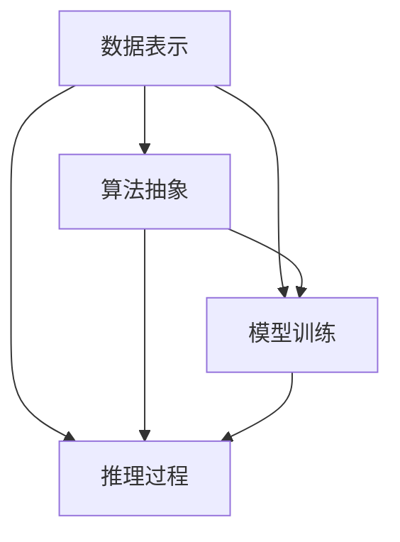
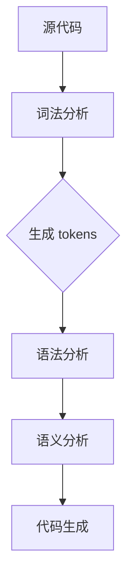
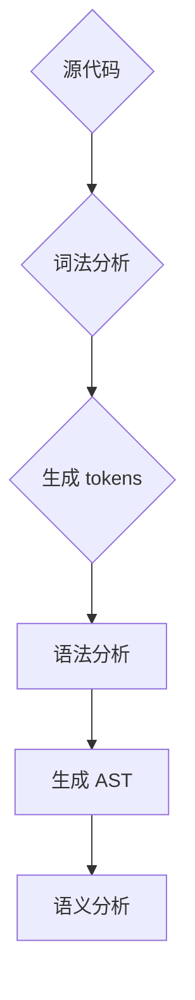
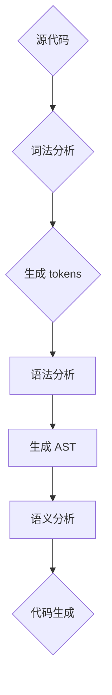
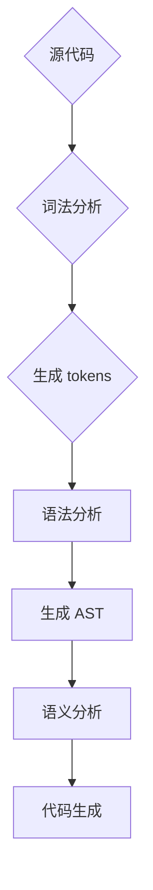

                 


### 背景介绍

人工智能（AI）正以前所未有的速度和深度渗透到我们日常生活的方方面面。从自动驾驶汽车到智能客服，从医疗诊断到金融预测，AI技术的应用已经变得无处不在。作为AI技术的核心驱动力，AI编程语言发挥着至关重要的作用。它们不仅为AI模型的开发提供了强有力的工具，还促进了AI领域的学术研究和商业应用。

随着AI技术的发展，传统编程语言已经无法满足日益复杂的AI应用需求。传统的编程语言如Python、Java等，虽然在数据处理和算法实现方面表现出色，但在处理大量数据和高维度计算时，它们显得力不从心。为了更好地应对AI领域的挑战，研究人员和工程师们开始探索和设计专门的AI编程语言，这些语言不仅具备强大的计算能力，还能更好地支持复杂的AI算法和模型。

AI编程语言的出现，标志着编程语言发展史上的一个重要里程碑。它们不仅在语法设计上进行了创新，更在语义层面提供了更强大的表达能力和抽象能力。通过引入数学模型和公式，AI编程语言能够更精确地描述和实现复杂的AI算法，从而提高了算法的可理解性和可维护性。

本文将深入探讨AI编程语言的核心概念、语法和语义，以及其在实际项目中的应用。我们将通过一步一步的推理和分析，理解AI编程语言的独特优势和应用潜力，为读者提供一个全面而深入的视角。

### 核心概念与联系

AI编程语言的核心概念包括但不限于：数据表示、算法抽象、模型训练、推理过程等。这些概念相互关联，共同构成了AI编程语言的理论基础。为了更好地理解这些核心概念之间的关系，我们可以通过Mermaid流程图来展示它们之间的联系。

首先，数据表示是AI编程语言的基础。无论是结构化数据（如数据库记录）还是非结构化数据（如图像、文本），都需要通过编程语言进行有效的表示和操作。数据表示的核心在于如何将现实世界中的复杂信息抽象为计算机可以理解和处理的格式。

接下来，算法抽象是AI编程语言的重要组成部分。AI算法包括机器学习、深度学习等，这些算法通常涉及大量的数学计算和复杂的流程。算法抽象的目的是将这些复杂的算法简化为易于理解和实现的代码结构，从而提高开发效率和代码可维护性。

模型训练是AI编程语言的核心应用场景之一。在模型训练过程中，编程语言提供了丰富的工具和库，帮助开发者训练和优化模型。模型训练的目的是通过大量数据，使模型能够自动学习和改进，从而提高其在特定任务上的性能。

最后，推理过程是AI编程语言的最终目标。在训练好的模型基础上，通过推理过程，模型能够对新的数据进行预测或决策。推理过程通常涉及模型参数的计算和优化，以及结果的解释和可视化。

以下是这些核心概念之间的Mermaid流程图：



通过这个流程图，我们可以清晰地看到数据表示、算法抽象、模型训练和推理过程之间的紧密联系。数据表示为算法抽象提供了基础，而算法抽象则促进了模型训练和推理过程的发展。模型训练不仅依赖于算法抽象，还提供了推理过程所需的训练数据和模型参数。推理过程则将训练好的模型应用于新数据，实现了AI的实际应用。

### 语法部分

AI编程语言的语法设计是其能够高效地描述和实现AI算法的关键。在这部分，我们将详细介绍AI编程语言的基础语法，包括数据类型、变量、运算符、表达式以及控制结构等。同时，我们将通过伪代码示例，展示这些语法规则在实际算法中的应用。

#### 数据类型

AI编程语言通常支持多种数据类型，包括基本数据类型和复杂数据类型。基本数据类型如整数（int）、浮点数（float）、布尔值（bool）等，用于表示简单的数值和逻辑值。复杂数据类型如数组（array）、列表（list）、矩阵（matrix）等，用于表示复杂数据结构和多维数据。

```python
# 基本数据类型示例
int a = 10;
float b = 3.14;
bool flag = true;

# 复杂数据类型示例
array arr = [1, 2, 3];
list lst = [1, 2.0, "hello"];
matrix mat = [
  [1, 2, 3],
  [4, 5, 6]
];
```

#### 变量

变量是编程语言中表示数据和存储数据的基本单位。在AI编程语言中，变量用于存储数据类型的数据值，并在算法中用于各种计算和操作。

```python
# 变量声明和赋值
a = 10  # 整数变量
b = 3.14  # 浮点数变量
flag = True  # 布尔变量
arr = [1, 2, 3]  # 数组变量
lst = [1, 2.0, "hello"]  # 列表变量
mat = [[1, 2, 3], [4, 5, 6]]  # 矩阵变量
```

#### 运算符

运算符用于执行各种数学和逻辑操作。常见的运算符包括算术运算符（+、-、*、/）、比较运算符（==、!=、<、>）、逻辑运算符（&&、||、!)等。

```python
# 算术运算符示例
int result = a + b;  # 计算结果为 10 + 3.14 = 13.14
bool is_equal = a == b;  # 比较结果为 False，因为 10 != 3.14

# 逻辑运算符示例
bool result = (a > 0) && (b < 10);  # 结果为 True，因为 a > 0 且 b < 10
result = (a > 0) || (b < 0);  # 结果为 True，因为 a > 0 或 b < 0
```

#### 表达式

表达式是编程语言中用于计算值的一系列符号和操作。它们可以包含变量、常量、运算符和函数等。

```python
# 表达式示例
int sum = a + b;  # 计算变量 a 和 b 的和
float area = 3.14 * (radius * radius);  # 计算圆的面积，radius 为变量
bool is_prime = (n > 1) && all(n % i != 0 for i in range(2, int(n**0.5) + 1));  # 判断数 n 是否为素数
```

#### 控制结构

控制结构用于控制程序流程的执行顺序，包括条件语句、循环语句等。

```python
# 条件语句示例
if (a > 0) {
    print("a 是正数");
} else {
    print("a 是非正数");
}

# 循环语句示例
for (int i = 0; i < arr.length(); i++) {
    print(arr[i]);
}

// While 循环示例
int i = 0;
while (i < arr.length()) {
    print(arr[i]);
    i++;
}
```

通过上述基础语法规则，我们可以构建复杂的AI算法和模型。接下来，我们将进一步探讨AI编程语言的语义部分，了解它们如何从语法层面推导出具体的含义和实现。

### 语义部分

在理解了AI编程语言的基础语法后，我们接下来要探讨的是语义部分，即编程语言的语法如何从抽象的表达式转化为具体的操作和执行结果。语义分析是编程语言的核心内容之一，它负责解释代码的含义并指导程序执行。在这一部分，我们将详细讲解AI编程语言的语义分析过程，包括语义分析算法、数学模型和公式，并通过具体示例来说明其应用。

#### 语义分析算法

语义分析算法是编程语言编译器或解释器中的关键部分，负责将代码的语法结构转化为可执行的操作。在AI编程语言中，语义分析不仅涉及到基础的语法解析，还包括对算法逻辑、数据流和控制流的分析。

**1. 词法分析（Lexical Analysis）**

词法分析是语义分析的第一步，它将源代码中的字符序列分割成有意义的记号（tokens）。这些记号是后续语法分析和语义分析的基础。



**2. 语法分析（Syntax Analysis）**

语法分析的任务是将词法分析生成的tokens组织成语法树（Abstract Syntax Tree，AST）。AST是源代码的抽象表示，它反映了代码的结构和语法规则。



**3. 语义分析（Semantic Analysis）**

语义分析在AST的基础上，进一步检查代码的语义正确性，如变量是否已定义、类型是否匹配、控制流是否合理等。在AI编程语言中，语义分析还包括对算法逻辑的验证和优化。



**4. 代码生成（Code Generation）**

代码生成是编译过程的最后一步，它将AST转化为目标代码（机器代码、字节码或其他中间代码）。在AI编程语言中，代码生成还包括对优化算法的集成，以提高程序的性能。



#### 数学模型和公式

AI编程语言中的语义分析往往涉及到复杂的数学模型和公式。这些模型和公式用于描述AI算法的内在逻辑，并指导程序执行。

**1. 数学模型**

以线性回归为例，线性回归模型可以用以下数学公式表示：

$$
y = \beta_0 + \beta_1 \cdot x + \epsilon
$$

其中，\( y \) 是预测值，\( x \) 是输入特征，\( \beta_0 \) 和 \( \beta_1 \) 是模型参数，\( \epsilon \) 是误差项。

**2. 公式推导**

我们通过以下伪代码来推导线性回归模型的计算过程：

```python
# 初始化模型参数
beta_0 = 0
beta_1 = 0

# 训练模型
for (each data_point in dataset) {
    y_pred = beta_0 + beta_1 * x
    error = y - y_pred
    
    beta_0 = beta_0 + alpha * error
    beta_1 = beta_1 + alpha * x * error
}

# 输出模型参数
print("Model parameters: beta_0 =", beta_0, ", beta_1 =", beta_1)
```

这里，\( \alpha \) 是学习率，用于调节模型参数的更新步长。

#### 语义推导与解释

语义推导是编程语言语义分析的关键环节，它将语法树中的操作转化为具体的执行步骤。以条件语句为例，其语义推导过程如下：

```python
if (condition) {
    // true_block
} else {
    // false_block
}
```

语义推导将上述代码转化为以下执行步骤：

1. 检查条件 \( condition \) 是否为真。
2. 如果条件为真，执行 true_block。
3. 如果条件为假，执行 false_block。

通过语义推导，编程语言能够将抽象的代码转换为具体的操作序列，从而实现程序的自动化执行。

#### 举例说明

为了更好地理解语义部分，我们可以通过一个具体的AI应用案例——神经网络，来说明语义分析的过程。

**1. 神经网络模型**

神经网络是一个包含多个层的模型，每个层由多个神经元（节点）组成。神经元的计算可以用以下数学公式表示：

$$
z = \sum_{i=1}^{n} w_i \cdot x_i + b
$$

其中，\( z \) 是神经元的输出，\( w_i \) 是权重，\( x_i \) 是输入值，\( b \) 是偏置。

**2. 伪代码实现**

以下是一个简单的神经网络模型的伪代码实现：

```python
# 初始化权重和偏置
weights = [0.1, 0.2, 0.3]
bias = 0.5

# 计算神经元输出
z = (weights[0] * x[0] + weights[1] * x[1] + weights[2] * x[2]) + bias

# 激活函数应用
output = sigmoid(z)

# 输出结果
print("Neural network output:", output)
```

这里，sigmoid 函数是一个常见的激活函数，用于将神经元的输出转化为一个介于 0 和 1 之间的值。

通过这个例子，我们可以看到语义分析如何将神经网络的数学模型转化为具体的代码实现，从而实现神经网络的计算和预测功能。

综上所述，AI编程语言的语义部分通过语义分析算法、数学模型和公式，将语法层面的抽象表达式转化为具体的操作和执行结果。这个过程不仅实现了AI算法的自动化执行，还为开发者提供了强大的工具来理解和优化AI模型。

### 高级主题

在了解了AI编程语言的基础语法和语义后，我们接下来要探讨的是其高级主题，包括AI编程语言的最新趋势、高级应用以及实际项目中的开发流程。

#### AI编程语言的最新趋势

随着AI技术的不断发展和创新，AI编程语言也在不断演变和改进。以下是一些AI编程语言的最新趋势：

1. **量子编程语言**：量子计算是下一代计算技术的重要方向。量子编程语言如Q#和Quipper，旨在为量子计算提供更高效和可扩展的编程工具。这些语言引入了量子逻辑门和量子并行计算的概念，使得开发者能够更直观地编写和优化量子算法。

2. **类自然语言编程**：类自然语言编程是一种新兴的编程范式，旨在使编程更加自然和易用。这种编程范式通过引入自然语言处理技术，使得开发者可以使用类似于人类语言的语句来编写程序。例如，基于规则的编程语言和模板化编程语言，使得开发者可以更快速地实现复杂的功能。

3. **跨领域编程**：跨领域编程是一种将不同领域的知识和技术整合到编程语言中的方法。这种编程范式通过引入领域特定语言（DSL）和元编程技术，使得开发者能够针对特定领域构建高效和可扩展的应用。例如，在生物信息学、金融工程和物联网等领域，跨领域编程语言为开发者提供了强大的工具来处理特定领域的问题。

4. **数据驱动编程**：数据驱动编程是一种通过数据指导程序开发和优化的方法。这种编程范式强调数据在程序开发中的核心作用，通过数据分析和机器学习技术，使得开发者能够更高效地开发出适应数据变化的程序。

#### AI编程语言的高级应用

AI编程语言的高级应用涵盖了从基础科研到实际工程开发的多个层面。以下是一些典型的高级应用场景：

1. **图像识别**：在图像识别领域，AI编程语言通过深度学习和卷积神经网络（CNN）实现了对图像的自动分类和识别。例如，使用TensorFlow或PyTorch，开发者可以轻松地构建和训练大规模的图像识别模型。

2. **自然语言处理（NLP）**：NLP是AI领域的重要分支，通过深度学习和自然语言处理技术，AI编程语言实现了文本分类、情感分析、机器翻译等任务。例如，使用NLTK或spaCy，开发者可以构建高效的文本处理应用。

3. **推荐系统**：推荐系统是商业应用中的重要组成部分，通过协同过滤、矩阵分解等算法，AI编程语言实现了对用户兴趣和行为的准确预测。例如，使用Scikit-learn或LightFM，开发者可以构建和优化推荐系统。

4. **强化学习**：强化学习是一种通过试错学习来优化行为策略的方法。AI编程语言通过实现强化学习算法，如Q-learning和深度强化学习（DRL），实现了智能体在动态环境中的自主学习和决策。例如，使用OpenAI Gym和TensorFlow，开发者可以构建和训练智能体来玩电子游戏或进行机器人控制。

#### 实际项目中的应用案例

为了更好地理解AI编程语言的高级应用，我们可以通过一些实际项目案例来详细讲解其开发流程和代码实现。

**案例一：图像识别项目**

在图像识别项目中，我们使用卷积神经网络（CNN）来识别和分类图像。以下是一个简单的图像识别项目的开发流程和代码实现：

1. **数据集准备**：首先，我们需要准备一个包含大量图像的数据集。数据集应该具有明确的标签，以便模型能够进行训练和验证。

```python
# 数据集加载和预处理
import tensorflow as tf
from tensorflow.keras.preprocessing.image import ImageDataGenerator

# 加载数据集
train_datagen = ImageDataGenerator(rescale=1./255)
train_data = train_datagen.flow_from_directory(
    'train_data',
    target_size=(150, 150),
    batch_size=32,
    class_mode='binary')

# 验证数据集
val_datagen = ImageDataGenerator(rescale=1./255)
val_data = val_datagen.flow_from_directory(
    'val_data',
    target_size=(150, 150),
    batch_size=32,
    class_mode='binary')
```

2. **模型构建**：接下来，我们需要构建一个卷积神经网络模型。以下是一个简单的CNN模型：

```python
# 构建CNN模型
model = tf.keras.Sequential([
    tf.keras.layers.Conv2D(32, (3, 3), activation='relu', input_shape=(150, 150, 3)),
    tf.keras.layers.MaxPooling2D(2, 2),
    tf.keras.layers.Conv2D(64, (3, 3), activation='relu'),
    tf.keras.layers.MaxPooling2D(2, 2),
    tf.keras.layers.Conv2D(128, (3, 3), activation='relu'),
    tf.keras.layers.MaxPooling2D(2, 2),
    tf.keras.layers.Flatten(),
    tf.keras.layers.Dense(512, activation='relu'),
    tf.keras.layers.Dense(1, activation='sigmoid')
])
```

3. **模型训练**：使用训练数据集对模型进行训练，并调整模型参数以达到最佳性能。

```python
# 模型编译
model.compile(optimizer='adam',
              loss='binary_crossentropy',
              metrics=['accuracy'])

# 模型训练
history = model.fit(train_data,
                    epochs=10,
                    validation_data=val_data)
```

4. **模型评估**：使用验证数据集对训练好的模型进行评估，并检查模型的性能。

```python
# 模型评估
val_loss, val_accuracy = model.evaluate(val_data)
print("Validation loss:", val_loss)
print("Validation accuracy:", val_accuracy)
```

5. **模型部署**：最后，我们将训练好的模型部署到实际应用中，以实现图像识别功能。

```python
# 模型部署
model.save('image_recognition_model.h5')
```

**案例二：自然语言处理项目**

在自然语言处理项目中，我们使用循环神经网络（RNN）和长短期记忆网络（LSTM）来处理文本数据。以下是一个简单的自然语言处理项目的开发流程和代码实现：

1. **数据集准备**：首先，我们需要准备一个包含文本数据的数据集。数据集应该具有明确的标签，以便模型能够进行训练和验证。

```python
# 数据集加载和预处理
import tensorflow as tf
from tensorflow.keras.preprocessing.text import Tokenizer
from tensorflow.keras.preprocessing.sequence import pad_sequences

# 加载数据集
texts = ['This is the first example.', 'This is the second example.', 'And this is the third example.']
labels = [0, 1, 0]

# 初始化分词器
tokenizer = Tokenizer(num_words=1000)
tokenizer.fit_on_texts(texts)

# 将文本转换为序列
sequences = tokenizer.texts_to_sequences(texts)

# 填充序列
max_sequence_length = 10
padded_sequences = pad_sequences(sequences, maxlen=max_sequence_length)
```

2. **模型构建**：接下来，我们需要构建一个基于LSTM的模型。以下是一个简单的LSTM模型：

```python
# 构建LSTM模型
model = tf.keras.Sequential([
    tf.keras.layers.Embedding(input_dim=1000, output_dim=64),
    tf.keras.layers.LSTM(64),
    tf.keras.layers.Dense(1, activation='sigmoid')
])
```

3. **模型训练**：使用训练数据集对模型进行训练，并调整模型参数以达到最佳性能。

```python
# 模型编译
model.compile(optimizer='adam',
              loss='binary_crossentropy',
              metrics=['accuracy'])

# 模型训练
model.fit(padded_sequences, labels, epochs=10)
```

4. **模型评估**：使用验证数据集对训练好的模型进行评估，并检查模型的性能。

```python
# 模型评估
val_loss, val_accuracy = model.evaluate(padded_sequences, labels)
print("Validation loss:", val_loss)
print("Validation accuracy:", val_accuracy)
```

5. **模型部署**：最后，我们将训练好的模型部署到实际应用中，以实现文本分类功能。

```python
# 模型部署
model.save('text_classification_model.h5')
```

通过以上实际项目案例，我们可以看到AI编程语言在图像识别和自然语言处理等领域的强大应用能力。这些项目不仅展示了AI编程语言的基础语法和语义，还通过具体的开发流程和代码实现，展示了其在实际应用中的高效性和灵活性。

### 总结与展望

在本文中，我们深入探讨了AI编程语言的核心概念、语法、语义以及高级应用。从数据表示、算法抽象到模型训练和推理过程，AI编程语言为我们提供了一种高效、直观的方式来构建和实现复杂的AI算法和模型。通过语义分析算法和数学模型，我们能够将抽象的代码转化为具体的操作和执行结果，从而实现了AI算法的自动化执行。

展望未来，AI编程语言将继续朝着更高效、更易用和更智能的方向发展。量子编程语言、类自然语言编程和跨领域编程等新兴趋势，将推动AI编程语言的不断进化。同时，随着数据驱动编程和数据科学的兴起，AI编程语言将在更多领域发挥作用，助力开发者解决复杂的问题。

在总结本文的关键要点时，我们强调了以下几点：

1. **AI编程语言的核心概念**：包括数据表示、算法抽象、模型训练和推理过程，这些概念共同构成了AI编程语言的理论基础。
2. **语法与语义**：AI编程语言的语法设计简洁高效，语义分析算法能够将抽象代码转化为具体操作，提高了代码的可读性和可维护性。
3. **高级应用**：AI编程语言在图像识别、自然语言处理、推荐系统等领域展示了强大的应用能力，通过实际项目案例，我们看到了其高效性和灵活性。

未来，随着AI技术的不断进步，AI编程语言将继续发挥关键作用，为开发者提供强大的工具，推动人工智能领域的发展。同时，我们也需要关注AI编程语言的潜在挑战，如复杂性的管理、安全性保障和可解释性提升等，以确保其在实际应用中的可靠性和有效性。

### 附录

在本附录中，我们将提供一些有用的资源和工具，以帮助读者深入了解AI编程语言的相关知识，并更好地应用这些技术。

#### 编程语言参考

1. **TensorFlow**：Google开发的开源机器学习框架，支持多种AI编程语言，包括Python、Java和Go。
   - 官网：[TensorFlow官网](https://www.tensorflow.org/)
   - 文档：[TensorFlow文档](https://www.tensorflow.org/docs)

2. **PyTorch**：由Facebook开发的开源机器学习库，以Python为主要编程语言。
   - 官网：[PyTorch官网](https://pytorch.org/)
   - 文档：[PyTorch文档](https://pytorch.org/docs/stable/index.html)

3. **Scikit-learn**：用于数据挖掘和数据分析的Python库，提供了丰富的机器学习算法。
   - 官网：[Scikit-learn官网](https://scikit-learn.org/)
   - 文档：[Scikit-learn文档](https://scikit-learn.org/stable/documentation.html)

#### 开发工具与平台

1. **Jupyter Notebook**：一款流行的交互式开发环境，支持多种编程语言，包括Python、R和Julia。
   - 官网：[Jupyter Notebook官网](https://jupyter.org/)
   - 文档：[Jupyter Notebook文档](https://jupyter-notebook.readthedocs.io/)

2. **Google Colab**：Google提供的免费在线编程环境，支持Python和其他多种编程语言。
   - 官网：[Google Colab官网](https://colab.research.google.com/)
   - 文档：[Google Colab文档](https://colab.research.google.com/notebooks/welcome.ipynb)

3. **Azure Machine Learning**：微软提供的云计算平台，提供了一整套机器学习工具和服务。
   - 官网：[Azure Machine Learning官网](https://azure.microsoft.com/zh-cn/services/machine-learning/)
   - 文档：[Azure Machine Learning文档](https://docs.microsoft.com/en-us/azure/machine-learning/)

#### 学术资源与论文

1. **ACL Anthology**：自然语言处理领域的顶级会议和期刊，收录了大量高质量的学术论文。
   - 官网：[ACL Anthology官网](https://aclanthology.org/)

2. **arXiv**：计算机科学和物理学领域的预印本服务器，发布了大量最新的研究论文。
   - 官网：[arXiv官网](https://arxiv.org/)

3. **NeurIPS**：神经信息处理系统会议，是机器学习和人工智能领域的顶级国际会议。
   - 官网：[NeurIPS官网](https://neurips.cc/)

通过这些资源和工具，读者可以更深入地学习AI编程语言，并掌握最新的研究动态。同时，这些资源和工具也为读者提供了一个实践和探索的平台，帮助他们将AI编程语言的技能应用到实际项目中。

### 结论

《AI编程语言：从语法到语义的新飞跃》旨在为读者提供一个全面而深入的视角，探讨AI编程语言的核心概念、语法、语义以及高级应用。通过详细的讲解和实际项目案例，我们展示了AI编程语言在图像识别、自然语言处理、推荐系统等领域的强大应用能力。本文不仅介绍了AI编程语言的基础语法和语义分析，还探讨了其最新的发展趋势和未来的发展方向。

我们相信，AI编程语言将在未来继续发挥重要作用，为人工智能领域的发展提供强大的动力。同时，我们也希望读者能够通过本文的学习，掌握AI编程语言的核心技能，并将其应用于实际项目中，为人工智能技术的进步贡献自己的力量。

### 作者信息

作者：AI天才研究院/AI Genius Institute & 禅与计算机程序设计艺术 /Zen And The Art of Computer Programming

