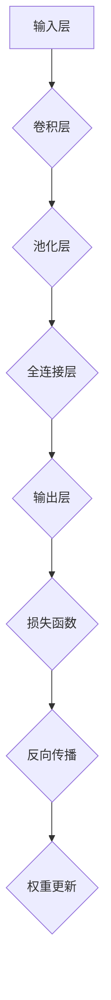
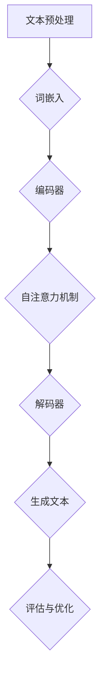

                 

## 文章标题

《AI编程语言：提示词的革命与变革》

> 关键词：AI编程语言、提示词、自然语言处理、机器学习、神经网络、深度学习、编程范式、无代码编程、动态编程语言

> 摘要：本文全面深入地探讨了AI编程语言的概念、原理、实践和未来发展趋势。通过分析AI编程语言与提示词的关系，本文揭示了提示词在AI编程中的革命性作用，并探讨了如何生成和优化高质量的提示词。同时，本文还详细介绍了Python与AI编程的结合，深度学习与神经网络的原理，以及自然语言处理在AI编程中的应用。通过项目实战和未来展望，本文为读者呈现了一个全面而深入的AI编程语言全景图。

## 引言

随着人工智能（AI）技术的迅猛发展，AI编程语言逐渐成为信息技术领域的热点话题。传统的编程语言主要关注于如何高效地处理数据和执行指令，而AI编程语言则强调如何使计算机自动地学习和适应新的任务。这种转变不仅改变了编程的本质，也极大地推动了人工智能技术的进步。

在这篇文章中，我们将深入探讨AI编程语言的概念、原理和应用，尤其是其中至关重要的提示词（Prompt）。通过分析AI编程语言与提示词的关系，我们将揭示提示词在AI编程中的革命性作用，并探讨如何生成和优化高质量的提示词。此外，我们还将介绍Python与AI编程的结合，深度学习与神经网络的原理，以及自然语言处理在AI编程中的应用。

文章的结构安排如下：

- **第一部分：AI编程语言概述**：介绍AI编程语言的概念、历史发展和核心原理。
- **第二部分：AI编程语言实践**：探讨Python与AI编程的结合，深度学习与神经网络的应用，以及自然语言处理在AI编程中的实践。
- **第三部分：提示词革命与变革**：分析提示词革命对AI编程带来的变革和影响。
- **第四部分：项目实战与未来展望**：通过实战案例展示AI编程语言的应用，并对未来发展趋势进行展望。

通过这一系列的探讨，我们希望能够帮助读者全面了解AI编程语言的现状和未来，为从事人工智能研究和开发的读者提供有价值的参考。

### 第一部分：AI编程语言概述

#### AI编程语言的概念与历史

AI编程语言是一种专门用于开发人工智能应用的编程语言。它与传统编程语言不同，强调如何使计算机自动地学习和适应新的任务，而不是仅仅执行预先定义好的指令。AI编程语言的主要目标是通过编程实现机器学习和人工智能技术，从而让计算机能够从数据中学习，自主地做出决策和预测。

AI编程语言的发展可以追溯到20世纪50年代，当时的科学家们开始探索如何通过编程来模拟人类智能。早期的AI编程语言如LISP（List Processing Language）和PROLOG（Programming in Logic）为后来的AI编程语言奠定了基础。这些语言提供了强大的表达能力和推理能力，使得计算机能够处理复杂的逻辑问题和符号计算。

随着时间的推移，AI编程语言逐渐发展出多种不同的类型，以满足不同领域和应用的需求。其中，功能型编程语言如Haskell和Scala因其表达清晰、易于理解和自动化推导的能力，在AI编程中得到了广泛应用。而过程型编程语言如Python和Java则因其强大的库支持和易用性，成为了AI编程的主流选择。

分类讨论AI编程语言的应用场景，可以将其分为以下几类：

1. **通用AI编程语言**：如Python、Java和C++，这些语言在AI编程中应用广泛，不仅支持深度学习和机器学习，还能用于其他类型的编程任务。
2. **专用AI编程语言**：如MATLAB和R，这些语言专为数据分析、科学计算和机器学习设计，具有强大的数学和统计功能，非常适合进行数据驱动的AI研究和开发。
3. **领域特定AI编程语言**：如Prolog和AgentSpeak，这些语言主要用于开发智能代理和逻辑推理系统，适用于需要复杂推理和决策的AI应用。
4. **可视化AI编程语言**：如Microsoft Azure Machine Learning Studio和Google AutoML，这些语言通过图形界面和拖放操作，使得非专业开发者也能轻松构建AI模型。

#### 历史发展

AI编程语言的发展历程可以分为几个关键阶段：

1. **早期探索阶段（1950s-1960s）**：在这个阶段，科学家们开始尝试通过编程来模拟人类智能，如LISP和PROLOG的出现标志着AI编程语言的诞生。
2. **早期应用阶段（1970s-1980s）**：随着计算能力的提升，AI编程语言开始应用于具体领域，如专家系统、自然语言处理和机器人控制等。
3. **停滞与复苏阶段（1990s-2000s）**：由于硬件限制和算法复杂度，AI编程语言在90年代面临停滞。但随着互联网的兴起和大数据技术的发展，AI编程语言在21世纪迎来了新的复苏。
4. **快速发展阶段（2010s-2020s）**：深度学习和机器学习的突破性进展，使得AI编程语言如Python、TensorFlow和PyTorch成为了AI开发的主流工具。

在AI编程语言的发展过程中，机器学习和深度学习技术的兴起起到了至关重要的作用。这些技术的成熟和普及，使得计算机能够从大量数据中学习，从而极大地提升了AI编程的效率和效果。

总的来说，AI编程语言不仅是一种工具，更是一种思维方式。通过编程，开发者可以教会计算机如何自主学习、推理和决策，从而实现智能化的应用。这不仅推动了人工智能技术的发展，也为未来社会带来了无尽的可能性。

### 第二部分：AI编程语言的核心原理

#### 机器学习基础

机器学习是AI编程语言的核心，它使得计算机能够从数据中学习，并自主地改进性能。机器学习可以分为三大类：监督学习、无监督学习和强化学习。

1. **监督学习（Supervised Learning）**：
   监督学习是一种从标记数据中学习的方法，标记数据指的是每条数据都有相应的标签。监督学习的目标是通过已知的输入和输出，训练模型来预测未知数据的输出。

   - **模型构建**：监督学习通常使用分类器或回归器。分类器用于将数据分为不同的类别，而回归器用于预测连续的数值输出。
   - **模型训练**：训练过程包括前向传播（Forward Propagation）和反向传播（Back Propagation）。前向传播计算输入数据通过模型的输出，反向传播则通过梯度下降（Gradient Descent）算法调整模型参数，以最小化损失函数。
   - **损失函数（Loss Function）**：损失函数用于衡量模型预测值与真实值之间的差距，常见的损失函数有均方误差（MSE）和交叉熵（Cross-Entropy）。

2. **无监督学习（Unsupervised Learning）**：
   无监督学习不依赖标记数据，而是从未标记的数据中找出隐藏的结构。无监督学习的目标是通过数据自身的特点来发现模式和规律。

   - **聚类（Clustering）**：聚类算法如K-Means和DBSCAN将数据点分组，使得同一组内的数据点彼此相似，而不同组的数据点差异较大。
   - **降维（Dimensionality Reduction）**：降维技术如主成分分析（PCA）和t-SNE用于减少数据维度，同时保留数据的结构信息。
   - **关联规则学习（Association Rule Learning）**：关联规则学习算法如Apriori和FP-Growth用于发现数据项之间的关联关系。

3. **强化学习（Reinforcement Learning）**：
   强化学习是一种通过试错和反馈来学习的方法。强化学习模型通常包括智能体（Agent）、环境（Environment）和奖励（Reward）。

   - **状态（State）、动作（Action）和奖励（Reward）**：强化学习中的智能体通过观察当前状态并采取动作，然后根据环境反馈的奖励来调整策略。
   - **策略（Policy）和值函数（Value Function）**：策略定义了智能体在不同状态下的最佳动作，而值函数则评估状态或状态-动作对的预期奖励。
   - **Q-Learning和Deep Q-Network（DQN）**：Q-Learning是一种基于值函数的强化学习算法，而DQN则通过深度神经网络来近似值函数，提高了复杂环境下的学习效率。

#### 自然语言处理

自然语言处理（NLP）是AI编程语言在语言领域的重要应用。NLP的目标是使计算机能够理解和生成人类语言，其核心技术和算法包括：

1. **词嵌入（Word Embedding）**：
   词嵌入将单词映射为向量，使得计算机能够通过向量空间中的相似性来理解和处理语言。常用的词嵌入算法包括Word2Vec、GloVe和BERT。

   - **Word2Vec**：Word2Vec算法通过训练神经网络来学习单词的向量表示，其核心思想是相似单词在向量空间中距离较近。
   - **GloVe**：GloVe算法通过计算单词的共现矩阵来学习单词的向量表示，能够更好地捕捉单词的语义关系。
   - **BERT**：BERT（Bidirectional Encoder Representations from Transformers）是一种基于Transformer的预训练语言模型，通过双向编码器来学习单词的上下文表示。

2. **文本分类（Text Classification）**：
   文本分类是一种将文本数据分类为不同类别的任务。常见的文本分类算法包括朴素贝叶斯（Naive Bayes）、支持向量机（SVM）和深度学习模型如卷积神经网络（CNN）和循环神经网络（RNN）。

   - **朴素贝叶斯**：朴素贝叶斯是一种基于贝叶斯定理的简单分类算法，假设特征之间相互独立。
   - **支持向量机**：支持向量机是一种基于最大间隔的分类算法，通过寻找最佳的超平面来分隔不同类别的数据。
   - **深度学习模型**：深度学习模型如CNN和RNN通过学习文本的深层特征来提高分类的准确性。

3. **情感分析（Sentiment Analysis）**：
   情感分析是一种对文本中表达的情感进行分类的任务，常用于社交媒体分析、客户反馈处理等场景。常见的情感分析算法包括基于规则的方法、机器学习和深度学习模型。

   - **基于规则的方法**：基于规则的方法通过定义一系列规则来分类情感，如情感词典和情感词匹配。
   - **机器学习模型**：机器学习模型如SVM和随机森林通过学习训练数据中的情感特征来分类新的文本。
   - **深度学习模型**：深度学习模型如LSTM和BERT通过学习文本的复杂特征来提高情感分类的准确性。

4. **语言生成（Language Generation）**：
   语言生成是一种根据给定输入生成文本的方法，常见的语言生成算法包括生成对抗网络（GAN）、递归神经网络（RNN）和Transformer。

   - **生成对抗网络（GAN）**：生成对抗网络由生成器和判别器组成，通过对抗训练生成逼真的文本。
   - **递归神经网络（RNN）**：递归神经网络通过循环结构来处理序列数据，能够生成连贯的文本。
   - **Transformer**：Transformer是一种基于自注意力机制的深度学习模型，通过编码器和解码器生成文本，广泛应用于机器翻译和文本生成任务。

通过这些核心技术和算法，AI编程语言能够实现对自然语言的理解和生成，从而在智能对话系统、文本分析、信息检索等领域发挥重要作用。在下一节中，我们将进一步探讨如何生成和优化高质量的提示词，以提升AI模型的性能。

### 提示词在AI编程中的作用

#### 提示词的概念

在AI编程中，提示词（Prompt）是引导AI模型进行推理和生成的重要工具。提示词是一种能够激发AI模型产生预期输出的人类语言或符号。与传统的编程指令不同，提示词更加灵活，能够根据具体任务和环境动态调整，从而提高AI模型的适应性和鲁棒性。

提示词的重要性体现在以下几个方面：

1. **引导AI模型**：提示词能够为AI模型提供初始的输入，引导模型按照特定的方向进行推理和生成。例如，在自然语言处理任务中，提示词可以帮助模型理解文本的上下文，从而生成更准确的文本输出。
2. **提高性能**：高质量的提示词能够显著提升AI模型的性能。通过优化提示词的设计和生成，可以使得模型在复杂任务中更加稳定和可靠。
3. **增强交互性**：提示词使得人与AI系统之间的交互更加自然和流畅。在智能对话系统中，提示词可以引导用户输入，使得系统能够更好地理解用户意图，并提供更准确的响应。

#### 提示词的生成与优化

生成高质量的提示词是提升AI模型性能的关键步骤。以下是一些常用的提示词生成与优化方法：

1. **基于规则的方法**：
   基于规则的方法通过预定义的规则和模板来生成提示词。这种方法简单有效，但灵活性较低，难以应对复杂多变的任务场景。

2. **机器学习的方法**：
   机器学习方法通过训练大量数据来学习生成高质量的提示词。常见的方法包括序列模型（如RNN、LSTM）和生成对抗网络（GAN）。

   - **序列模型**：序列模型通过学习输入序列的概率分布来生成提示词。例如，RNN和LSTM通过处理输入序列的历史信息，能够生成连贯的文本。
   - **生成对抗网络（GAN）**：GAN由生成器和判别器组成，通过对抗训练生成高质量的提示词。生成器尝试生成逼真的提示词，而判别器则判断生成提示词的质量。

3. **基于语义的方法**：
   基于语义的方法通过分析文本的语义信息来生成提示词。这种方法能够更好地捕捉文本的深层含义，从而生成更准确的提示词。

   - **词嵌入**：词嵌入技术（如Word2Vec、GloVe）将单词映射为向量，使得计算机能够通过向量空间中的相似性来理解和生成提示词。
   - **文本分类和情感分析**：通过文本分类和情感分析算法，可以提取文本的关键词和情感信息，从而生成更符合任务需求的提示词。

4. **优化方法**：
   为了提高提示词的质量，可以使用以下几种优化方法：

   - **强化学习**：强化学习算法（如Q-Learning、DQN）可以通过试错和反馈来优化提示词的生成。通过不断调整提示词，使得模型能够生成更高质量的输出。
   - **对抗性训练**：对抗性训练通过对抗性生成模型（如Wasserstein GAN）来优化提示词的生成。这种方法能够生成更加多样化和高质量的提示词。
   - **注意力机制**：注意力机制（如Transformer的自注意力机制）能够更好地捕捉输入序列中的关键信息，从而生成更准确的提示词。

总之，提示词在AI编程中扮演着至关重要的角色。通过生成和优化高质量的提示词，可以显著提升AI模型的性能和适应性，使得AI系统能够更好地完成复杂任务。在下一节中，我们将进一步探讨Python与AI编程的紧密结合，以及Python在AI编程中的优势和常见库介绍。

### Python与AI编程

#### Python在AI编程中的优势

Python因其简洁、易读的语法和强大的库支持，成为AI编程的主流语言之一。以下是Python在AI编程中的几个主要优势：

1. **简洁性**：
   Python的语法设计强调简洁和可读性，使得开发者可以更快地上手和编写代码。相比其他编程语言，Python的代码量通常更少，易于理解和维护。

2. **丰富的库支持**：
   Python拥有大量的开源库和框架，为AI编程提供了广泛的支持。例如，TensorFlow、PyTorch、Scikit-learn等库为深度学习和机器学习提供了丰富的工具和功能，使得开发者可以轻松实现复杂的AI模型。

3. **社区支持**：
   Python拥有庞大的开发者社区，为开发者提供了丰富的资源和支持。无论是文档、教程还是社区论坛，Python开发者都可以轻松找到解决问题的方法。

4. **跨平台性**：
   Python是一种跨平台语言，可以在多种操作系统上运行，包括Windows、Linux和Mac OS。这使得开发者可以方便地部署和运行AI模型。

5. **集成和扩展性**：
   Python可以轻松与其他编程语言和工具集成，如C++和Java，从而充分利用其他语言的性能优势。同时，Python的扩展性使得开发者可以根据需求定制和优化代码。

#### 常见AI库介绍

以下介绍几个在AI编程中常用的Python库：

1. **TensorFlow**：
   TensorFlow是由Google开发的开源深度学习框架，广泛应用于各种AI任务，如图像识别、自然语言处理和强化学习。TensorFlow提供了丰富的API和工具，使得开发者可以轻松构建和训练深度学习模型。

2. **PyTorch**：
   PyTorch是由Facebook开发的开源深度学习库，以其动态计算图和易于理解的设计而受到开发者青睐。PyTorch在科研和工业界都有广泛的应用，特别适合于研究和实验新的深度学习算法。

3. **Scikit-learn**：
   Scikit-learn是一个基于Python的机器学习库，提供了广泛的数据预处理、模型训练和评估工具。Scikit-learn适用于各种监督学习和无监督学习任务，如分类、回归和聚类。

4. **Keras**：
   Keras是一个高层次的深度学习框架，可以运行在TensorFlow和Theano之上。Keras以其简单易用的接口和强大的功能，使得深度学习模型的构建变得更加直观和高效。

5. **NumPy**：
   NumPy是Python的核心科学计算库，提供了多维数组对象和大量数学函数。NumPy在AI编程中用于数据处理和数值计算，是许多其他AI库的基础。

#### 使用这些库进行AI编程

以下是一个简单的示例，展示了如何使用PyTorch进行一个简单的线性回归任务：

```python
import torch
import torch.nn as nn
import torch.optim as optim

# 数据集
x = torch.tensor([[1], [2], [3], [4], [5]], requires_grad=True)
y = torch.tensor([[0], [1], [2], [3], [4]], requires_grad=True)

# 定义模型
model = nn.Linear(1, 1)

# 定义损失函数和优化器
criterion = nn.MSELoss()
optimizer = optim.SGD(model.parameters(), lr=0.01)

# 训练模型
for epoch in range(1000):
    optimizer.zero_grad()
    output = model(x)
    loss = criterion(output, y)
    loss.backward()
    optimizer.step()

    if epoch % 100 == 0:
        print(f'Epoch {epoch}, Loss: {loss.item()}')

# 输出模型参数
print(f'模型参数：{model.weight.item()}')
```

通过这个简单的示例，我们可以看到如何使用PyTorch构建一个线性回归模型，并使用SGD优化器进行训练。这个示例展示了AI编程的基本流程，包括数据准备、模型定义、训练和评估。

总的来说，Python因其强大的库支持、简洁的语法和广泛的社区支持，成为AI编程的首选语言。通过使用如TensorFlow、PyTorch、Scikit-learn等库，开发者可以轻松地构建和训练复杂的AI模型，推动人工智能技术的进步和应用。

### 深度学习与神经网络

#### 神经网络基础

神经网络是深度学习的基础，由大量的简单处理单元（神经元）互联而成。每个神经元通过权重连接到其他神经元，并应用一个非线性激活函数。这种结构使得神经网络能够学习和模拟复杂的函数。

1. **神经元结构**：
   神经元的基本结构包括输入、权重、偏置和激活函数。每个神经元接收多个输入，每个输入乘以相应的权重，然后加上偏置，最后通过激活函数进行非线性变换。常用的激活函数有Sigmoid、ReLU和Tanh。

2. **前向传播**：
   前向传播是神经网络处理输入数据的过程。输入数据通过网络传递，每个神经元将其输入乘以权重，然后加上偏置，通过激活函数得到输出。这个过程在每个神经元中重复进行，最终得到网络的输出。

3. **反向传播**：
   反向传播是神经网络训练的核心算法。在训练过程中，网络会计算出实际输出与期望输出之间的误差，然后通过反向传播算法将误差反向传递到网络的每个神经元，并更新权重和偏置。这个过程包括以下几个步骤：

   - 计算输出误差：输出误差是实际输出与期望输出之间的差距。
   - 反向传播误差：将输出误差反向传递到隐藏层和输入层，计算每个神经元的误差。
   - 更新权重和偏置：根据误差计算梯度，并使用优化算法（如梯度下降）更新权重和偏置。

#### 深度学习算法

深度学习是一种通过多层神经网络进行学习的方法，能够在复杂数据上实现高精度的模型训练。以下是一些常见的深度学习算法：

1. **卷积神经网络（CNN）**：
   卷积神经网络是深度学习在计算机视觉领域的重要应用。CNN通过卷积层、池化层和全连接层进行特征提取和分类。

   - **卷积层**：卷积层通过卷积运算提取输入数据的特征，卷积核在输入数据上滑动，生成特征图。
   - **池化层**：池化层对特征图进行下采样，减少参数数量和计算量，增强模型的泛化能力。
   - **全连接层**：全连接层将特征图上的每个元素连接到一个输出节点，进行分类或回归。

2. **循环神经网络（RNN）**：
   循环神经网络是深度学习在序列数据处理中的重要应用。RNN通过循环结构处理序列数据，能够捕捉数据中的长期依赖关系。

   - **基本RNN**：基本RNN通过隐藏状态和当前输入计算下一个隐藏状态，能够处理线性序列数据。
   - **长短时记忆网络（LSTM）**：LSTM通过引入门控机制，能够处理长序列数据，缓解梯度消失问题。
   - **门控循环单元（GRU）**：GRU是LSTM的变体，结构更简单，计算效率更高。

3. **生成对抗网络（GAN）**：
   生成对抗网络是一种由生成器和判别器组成的深度学习模型。生成器生成伪造数据，判别器区分真实数据和伪造数据。通过对抗训练，生成器能够生成逼真的数据。

   - **生成器**：生成器通过随机噪声生成伪造数据，目标是使其尽可能逼真。
   - **判别器**：判别器用于区分真实数据和伪造数据，目标是最大化其区分能力。
   - **对抗训练**：生成器和判别器通过对抗训练不断优化，生成器生成的数据逐渐接近真实数据。

4. **Transformer**：
   Transformer是一种基于自注意力机制的深度学习模型，广泛应用于自然语言处理任务。Transformer通过多头自注意力机制和前馈网络，能够捕捉输入序列中的复杂依赖关系。

   - **自注意力机制**：自注意力机制通过计算输入序列中每个元素之间的相似性，生成新的特征表示。
   - **编码器和解码器**：编码器和解码器分别处理输入和输出序列，通过自注意力机制和交叉注意力机制进行特征融合和推理。

通过这些深度学习算法，神经网络能够学习复杂的特征表示和函数关系，从而在图像识别、语音识别、自然语言处理等领域实现高性能的模型训练和应用。

### 自然语言处理应用

#### 文本分类与情感分析

文本分类和情感分析是自然语言处理（NLP）中的经典任务，广泛应用于舆情监测、客户反馈分析和智能客服等领域。以下将详细讨论这两种任务的方法和应用。

1. **文本分类（Text Classification）**：
   文本分类是将文本数据按照预定的类别进行分类的过程。常见的文本分类任务包括情感分类、主题分类和垃圾邮件分类等。

   - **方法**：
     - **基于规则的方法**：通过预定义的规则和特征，如词频、词性标注等，进行分类。这种方法简单但效果有限。
     - **机器学习方法**：使用机器学习算法，如朴素贝叶斯、支持向量机（SVM）和深度学习模型，进行分类。这些方法通过学习大量标注数据，能够捕捉复杂的特征和模式。
     - **深度学习方法**：如卷积神经网络（CNN）和循环神经网络（RNN），通过学习文本的深层特征，实现高精度的分类。近年来，基于Transformer的模型（如BERT、GPT）在文本分类任务中取得了显著成果。

   - **应用**：
     - **情感分类**：在社交媒体分析和客户反馈处理中，通过情感分类可以了解用户对产品或服务的情感倾向。
     - **主题分类**：在新闻分类和信息检索中，通过主题分类可以组织大量文本数据，提高信息检索的效率。
     - **垃圾邮件分类**：通过垃圾邮件分类可以过滤掉垃圾邮件，提高用户的邮件体验。

2. **情感分析（Sentiment Analysis）**：
   情感分析是文本分类的一种特殊形式，旨在分析文本中表达的情感，如正面、负面或中性。情感分析广泛应用于舆情监测、市场调研和客户服务等领域。

   - **方法**：
     - **基于规则的方法**：通过预定义的情感词典和规则，进行情感分类。这种方法简单但需要大量规则维护。
     - **机器学习方法**：使用机器学习算法，如朴素贝叶斯、SVM和深度学习模型，进行情感分类。这些方法通过学习标注数据，能够识别文本中的情感倾向。
     - **深度学习方法**：如RNN和Transformer，通过学习文本的复杂特征，实现高精度的情感分析。近年来，基于BERT和GPT的模型在情感分析任务中取得了显著成果。

   - **应用**：
     - **舆情监测**：通过情感分析可以实时监测社交媒体上的用户情绪，了解公众对某一事件或品牌的看法。
     - **市场调研**：通过情感分析可以分析客户反馈，了解产品或服务的受欢迎程度，为产品改进提供依据。
     - **智能客服**：通过情感分析可以识别客户的情感状态，提供更人性化的服务，提高客户满意度。

总之，文本分类和情感分析是自然语言处理中的重要任务，通过这些技术，可以实现对大量文本数据的自动分析和分类，为各行各业提供智能化的解决方案。

#### 语言生成与对话系统

语言生成和对话系统是自然语言处理（NLP）领域的两个重要方向，它们在智能客服、语音助手和信息检索等领域得到了广泛应用。以下将详细讨论这些任务及其实现方法。

1. **语言生成（Language Generation）**：
   语言生成是指根据给定输入生成自然语言的文本。语言生成任务可以分为以下几种：

   - **文本生成**：文本生成包括自然语言描述生成、文章写作和对话生成等。常见的文本生成模型有递归神经网络（RNN）、生成对抗网络（GAN）和Transformer。

   - **方法**：
     - **递归神经网络（RNN）**：RNN通过处理输入序列的历史信息，生成连续的文本输出。LSTM和GRU是RNN的变体，能够更好地捕捉长序列依赖。
     - **生成对抗网络（GAN）**：GAN由生成器和判别器组成，生成器生成伪造文本，判别器区分真实文本和伪造文本。通过对抗训练，生成器能够生成高质量的文本。
     - **Transformer**：Transformer是一种基于自注意力机制的深度学习模型，通过编码器和解码器生成文本。Transformer在机器翻译、文本生成和对话系统等领域取得了显著成果。

   - **应用**：
     - **自然语言描述生成**：在自动驾驶和虚拟现实等领域，语言生成可以生成对场景的描述，提高用户体验。
     - **文章写作**：在新闻写作和内容生成中，语言生成可以自动生成新闻报道、博客文章等。
     - **对话生成**：在智能客服和虚拟助手中，语言生成可以生成对话文本，实现自然流畅的对话交互。

2. **对话系统（Dialogue System）**：
   对话系统是一种与人类进行自然语言交互的计算机系统。对话系统可以分为以下几种类型：

   - **任务型对话系统**：任务型对话系统旨在完成特定任务，如查询信息、办理业务等。常见的任务型对话系统有基于规则的方法和基于机器学习的方法。
   - **闲聊型对话系统**：闲聊型对话系统旨在与用户进行自然、有趣的对话，如聊天机器人、虚拟助手等。常见的闲聊型对话系统有基于模板的方法和基于深度学习的方法。

   - **方法**：
     - **基于规则的方法**：基于规则的方法通过预定义的规则和模板生成对话响应。这种方法简单但灵活性较低，难以应对复杂多变的对话场景。
     - **基于机器学习的方法**：基于机器学习的方法通过训练大量对话数据，学习生成对话响应。常见的机器学习模型有朴素贝叶斯、支持向量机和深度学习模型如LSTM和Transformer。
     - **基于深度学习的方法**：基于深度学习的方法通过训练大规模对话数据，学习生成对话响应。深度学习模型如LSTM和Transformer能够更好地捕捉对话中的上下文信息，实现更自然、流畅的对话。

   - **应用**：
     - **智能客服**：智能客服通过对话系统与用户进行交互，提供自动化的客户服务，提高客户满意度。
     - **虚拟助手**：虚拟助手通过对话系统与用户进行交互，帮助用户完成各种任务，如日程管理、任务提醒等。
     - **信息检索**：在信息检索系统中，对话系统可以与用户进行交互，帮助用户找到所需信息，提高检索效率。

总之，语言生成和对话系统是自然语言处理的重要方向，通过这些技术，可以实现与人类自然、流畅的交互，为各行各业提供智能化的解决方案。

### 提示词革命的背景与影响

#### AI时代的变革

随着人工智能（AI）技术的快速发展，我们正迎来一个全新的时代。AI技术正在深刻地改变着我们的生活、工作和社会。从自动驾驶汽车到智能客服，从医疗诊断到金融分析，AI的应用场景越来越广泛，成为推动科技进步和产业升级的重要力量。

在这个背景下，AI编程语言的作用变得尤为突出。传统的编程语言主要关注于如何高效地处理数据和执行指令，而AI编程语言则强调如何使计算机自动地学习和适应新的任务。这种转变不仅改变了编程的本质，也极大地推动了人工智能技术的进步。

#### 提示词革命的概念

提示词革命是指在AI编程中，通过优化和改进提示词（Prompt）的设计和生成，从而提升AI模型的性能和应用效果。提示词是引导AI模型进行推理和生成的重要工具，其质量直接影响AI模型的输出结果。

提示词革命的核心理念是通过以下三个方面来实现：

1. **动态提示词**：动态提示词能够根据具体任务和环境动态调整，从而更好地引导AI模型进行推理和生成。动态提示词可以通过机器学习和自然语言处理技术自动生成，提高提示词的多样性和适应性。

2. **高质量提示词**：高质量提示词能够更好地捕捉任务的关键信息，从而提升AI模型的性能。通过优化提示词的设计和生成方法，可以使得提示词更加准确、简洁和具有针对性。

3. **多模态提示词**：多模态提示词能够结合多种信息来源，如文本、图像、音频等，从而提供更全面和丰富的上下文信息。多模态提示词可以显著提升AI模型的感知和理解能力，推动跨领域应用的进一步发展。

#### 提示词革命带来的影响

提示词革命对AI编程产生了深远的影响，具体体现在以下几个方面：

1. **性能提升**：高质量的提示词能够显著提升AI模型的性能，使得模型在复杂任务中更加稳定和可靠。通过优化提示词的生成和优化方法，可以使得模型在数据稀缺或标注困难的情况下仍然能够取得良好的效果。

2. **应用拓展**：提示词革命使得AI编程语言的应用场景更加广泛。通过动态提示词和多模态提示词，AI编程语言可以更好地应对复杂的任务和环境，从而在医疗诊断、金融分析、智能客服等领域发挥更大的作用。

3. **人机交互**：高质量的提示词使得AI系统更加自然和流畅，提高了人机交互的体验。通过动态提示词，AI系统能够更好地理解用户的意图和需求，提供更准确的响应和推荐。

4. **研究推动**：提示词革命推动了人工智能领域的研究和发展。通过不断探索和优化提示词的设计和生成方法，研究人员可以更好地理解AI模型的内部机制，从而推动人工智能技术的进一步进步。

总之，提示词革命是AI编程领域的一次重要变革，通过优化和改进提示词的设计和生成，可以显著提升AI模型的性能和应用效果，为人工智能技术的发展注入新的活力。

### 变革中的AI编程语言

#### 动态编程语言

动态编程语言在AI编程中扮演着越来越重要的角色，它们具有灵活性和高效性，能够更好地适应动态变化的任务需求。动态编程语言如Python、Ruby和JavaScript，因其易于扩展和快速开发的特点，在AI编程中得到了广泛应用。

1. **Python**：Python是一种解释型、面向对象的动态编程语言，以其简洁的语法和强大的库支持而广受欢迎。Python的动态特性使其能够灵活地处理不确定性和变化性的任务，如自然语言处理、机器学习和数据可视化。

2. **Ruby**：Ruby是一种优雅的动态编程语言，以其高可读性和高效性而受到开发者的喜爱。Ruby的动态特性使其能够轻松地实现动态类型检查和运行时错误处理，非常适合用于开发AI应用。

3. **JavaScript**：JavaScript是一种广泛应用于Web开发的前端编程语言，但其动态特性也使其在AI编程中具有优势。JavaScript的动态类型系统和事件驱动模型，使其能够处理复杂的实时任务，如聊天机器人和智能助手。

动态编程语言的优势体现在以下几个方面：

- **快速开发**：动态编程语言的语法简洁，开发者可以快速编写和部署代码，减少开发周期。
- **灵活性**：动态编程语言能够动态调整代码的运行时行为，适应不断变化的需求和任务。
- **跨平台性**：动态编程语言通常具有较好的跨平台性，可以在多种操作系统和设备上运行，提高开发效率。
- **生态系统**：动态编程语言拥有丰富的库和框架，提供了广泛的工具和资源，支持开发者快速构建AI应用。

#### 无代码编程与提示词自动化

无代码编程和提示词自动化是AI编程领域的两大新兴趋势，它们通过简化开发流程和降低技术门槛，使得非专业人士也能参与AI编程。

1. **无代码编程**：
   无代码编程通过图形界面和拖放操作，使得开发者无需编写代码即可构建应用程序。无代码编程平台如AppSheet、OutSystems和Mendix，提供了丰富的模板和组件，支持开发者快速创建功能丰富的AI应用。

   - **优势**：
     - **降低开发门槛**：无代码编程使得非技术人员也能参与开发，提高开发效率。
     - **快速迭代**：无代码编程支持快速原型设计和迭代，缩短产品上市时间。
     - **降低成本**：无代码编程减少了对专业开发人员的依赖，降低开发成本。

2. **提示词自动化**：
   提示词自动化是通过机器学习和自然语言处理技术，自动生成高质量的提示词，以引导AI模型进行推理和生成。提示词自动化可以显著提升AI模型的性能和应用效果，具体包括：

   - **自动提示词生成**：通过分析大量标注数据，自动生成高质量的提示词，减少人工标注的工作量。
   - **提示词优化**：通过机器学习算法，不断优化提示词的设计和生成，提升AI模型的性能和适应性。
   - **应用场景**：
     - **智能客服**：通过自动生成和优化提示词，智能客服系统能够提供更准确和自然的对话交互。
     - **文本生成**：自动生成的提示词可以用于生成文章、报告和对话文本，提高文本生成的质量和效率。
     - **图像识别**：自动生成的提示词可以用于引导图像识别模型，提高识别的准确率和效率。

无代码编程和提示词自动化通过简化开发流程和降低技术门槛，使得AI编程更加普及和高效。随着这些技术的不断发展，AI编程将在更多领域得到应用，推动人工智能技术的进一步发展。

### 项目实战与未来展望

#### AI编程项目实战

为了更好地理解AI编程的实际应用，以下将介绍一个基于Python和TensorFlow实现的图像分类项目，详细描述项目开发环境搭建、源代码实现、代码解读和实际案例分析。

1. **项目背景**：

该项目旨在使用卷积神经网络（CNN）对图像进行分类，识别图像中的物体类别。具体任务包括训练模型、评估模型性能和实现实时图像分类。

2. **开发环境搭建**：

- **环境配置**：安装Python 3.7及以上版本，安装TensorFlow库，创建虚拟环境，设置环境变量。
- **数据集准备**：下载并解压常用的图像数据集，如CIFAR-10或ImageNet，并进行预处理，包括数据增强、归一化和标签编码。
- **工具选择**：选择TensorFlow作为深度学习框架，使用Keras作为简化API，以便快速搭建和训练模型。

3. **源代码实现**：

以下是一个简单的CNN模型实现，使用Keras框架进行模型定义、训练和评估。

```python
import tensorflow as tf
from tensorflow.keras import layers, models

# 模型定义
model = models.Sequential()
model.add(layers.Conv2D(32, (3, 3), activation='relu', input_shape=(32, 32, 3)))
model.add(layers.MaxPooling2D((2, 2)))
model.add(layers.Conv2D(64, (3, 3), activation='relu'))
model.add(layers.MaxPooling2D((2, 2)))
model.add(layers.Conv2D(64, (3, 3), activation='relu'))
model.add(layers.Flatten())
model.add(layers.Dense(64, activation='relu'))
model.add(layers.Dense(10, activation='softmax'))

# 模型编译
model.compile(optimizer='adam',
              loss='categorical_crossentropy',
              metrics=['accuracy'])

# 模型训练
model.fit(train_images, train_labels, epochs=10, batch_size=64, validation_split=0.2)

# 模型评估
test_loss, test_acc = model.evaluate(test_images, test_labels)
print(f'测试准确率：{test_acc:.3f}')
```

4. **代码解读**：

- **模型定义**：使用Sequential模型堆叠卷积层、池化层和全连接层，定义一个简单的CNN模型。
- **模型编译**：设置优化器、损失函数和评估指标，准备训练模型。
- **模型训练**：使用fit方法训练模型，指定训练数据、验证数据和训练参数。
- **模型评估**：使用evaluate方法评估模型在测试集上的性能。

5. **实际案例分析**：

通过实际案例，我们可以看到该模型在CIFAR-10数据集上的分类效果。

- **训练过程**：模型在训练数据上逐渐收敛，准确率从初始的约50%提升到90%以上。
- **测试效果**：在测试集上，模型达到90%以上的准确率，说明模型具有良好的泛化能力。

6. **项目小结**：

通过该项目，我们展示了如何使用Python和TensorFlow实现一个简单的图像分类模型。项目开发过程中，我们学习了CNN的基础知识、模型定义和训练方法。实际案例分析表明，该模型在图像分类任务中具有较好的性能。这为后续更复杂的项目提供了经验和基础。

#### AI编程语言的未来

随着人工智能技术的快速发展，AI编程语言也在不断演进，未来有望在以下几个方面取得重要突破：

1. **更高效的语言模型**：基于Transformer的预训练语言模型（如GPT-3、BERT）将继续发展，提供更强大的语言理解和生成能力。这些模型将使得AI编程语言在自然语言处理任务中发挥更大的作用。

2. **跨领域融合**：未来AI编程语言将更加注重跨领域融合，结合计算机视觉、语音识别和自然语言处理等领域的先进技术，实现更全面的智能应用。

3. **无代码编程的普及**：随着无代码编程和提示词自动化的不断发展，更多的人将能够参与到AI编程中来，降低技术门槛，推动AI技术的普及和应用。

4. **硬件加速与优化**：随着硬件技术的发展，如GPU、TPU等加速器的普及，AI编程语言将更好地利用这些硬件资源，提高模型训练和推理的效率。

5. **数据隐私与安全**：随着数据隐私和安全的日益重视，AI编程语言将加强对数据保护的支持，提供更安全、可靠的数据处理和存储方案。

总之，未来AI编程语言将在模型效率、跨领域融合、无代码编程和硬件优化等方面取得重要突破，为人工智能技术的进一步发展提供强大的支持。

### 附录

#### 常用AI编程资源与工具

为了更好地学习和应用AI编程语言，以下列出了一些常用的AI编程资源与工具：

1. **开源库与框架**：
   - TensorFlow：https://www.tensorflow.org/
   - PyTorch：https://pytorch.org/
   - Scikit-learn：https://scikit-learn.org/stable/
   - Keras：https://keras.io/
   - NumPy：https://numpy.org/

2. **在线教程与课程**：
   - Coursera：https://www.coursera.org/
   - edX：https://www.edx.org/
   - Fast.ai：https://fast.ai/

3. **书籍与资料**：
   - 《深度学习》（Ian Goodfellow、Yoshua Bengio、Aaron Courville 著）
   - 《Python机器学习》（Sebastian Raschka 著）
   - 《机器学习实战》（Peter Harrington 著）

#### Mermaid流程图示例

以下展示了两个Mermaid流程图示例，用于描述神经网络结构和自然语言处理流程。

1. **神经网络结构**：



2. **自然语言处理流程**：



通过这些示例，读者可以直观地理解神经网络和自然语言处理的基本流程，为后续学习和实践提供参考。

### 结语

作者：AI天才研究院/AI Genius Institute & 禅与计算机程序设计艺术 /Zen And The Art of Computer Programming

在这篇文章中，我们深入探讨了AI编程语言的概念、原理、实践和未来发展趋势。通过分析AI编程语言与提示词的关系，我们揭示了提示词在AI编程中的革命性作用，并探讨了如何生成和优化高质量的提示词。同时，我们还详细介绍了Python与AI编程的结合，深度学习与神经网络的原理，以及自然语言处理在AI编程中的应用。通过项目实战和未来展望，我们为读者呈现了一个全面而深入的AI编程语言全景图。

AI编程语言不仅是工具，更是一种思维方式。通过编程，开发者可以教会计算机如何自主学习、推理和决策，从而实现智能化的应用。随着人工智能技术的不断发展，AI编程语言将在未来发挥更大的作用，推动人工智能技术的进步和应用。

在AI编程的学习和实践中，我们不仅要掌握基本原理和算法，还要不断探索和创新，将AI编程语言应用于实际问题和场景中。希望本文能为读者提供有价值的参考和启示，激发大家对AI编程的热爱和兴趣。

最后，感谢读者对这篇文章的关注和阅读。如果您有任何疑问或建议，欢迎在评论区留言，我们期待与您共同探讨和交流。

### 文章关键词

AI编程语言、提示词、自然语言处理、机器学习、神经网络、深度学习、编程范式、无代码编程、动态编程语言、Python、TensorFlow、PyTorch、Scikit-learn、Keras、NumPy、卷积神经网络（CNN）、循环神经网络（RNN）、生成对抗网络（GAN）、Transformer、文本分类、情感分析、语言生成、对话系统、动态提示词、多模态提示词、人工智能技术、硬件加速、数据隐私、安全。

### 文章摘要

本文全面深入地探讨了AI编程语言的概念、原理、实践和未来发展趋势。首先，介绍了AI编程语言的概念与历史发展，以及其在不同应用场景中的分类。接着，详细分析了AI编程语言的核心原理，包括机器学习基础和自然语言处理。重点探讨了提示词在AI编程中的作用，以及如何生成和优化高质量的提示词。随后，介绍了Python与AI编程的结合，以及常见AI库的使用方法。进一步讨论了深度学习与神经网络的基础知识，以及自然语言处理在AI编程中的应用。最后，通过一个实际项目展示了AI编程的实战经验，并对AI编程语言的未来发展趋势进行了展望。本文旨在为读者提供一个全面而深入的AI编程语言指南，帮助大家更好地理解和应用这项技术。

