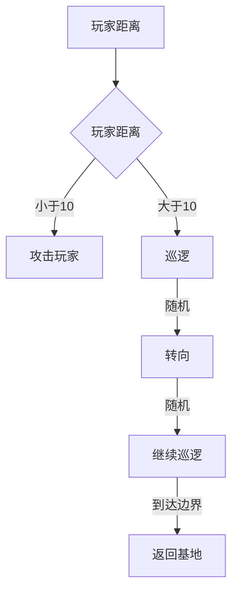

                 

### 文章标题：AI编程语言：提示词的革命与魔法

关键词：人工智能、编程语言、提示词、自然语言处理、计算机视觉、推荐系统、游戏开发

摘要：本文将深入探讨AI编程语言及其核心组件——提示词技术，分析其在自然语言处理、计算机视觉、推荐系统和游戏开发等领域的应用。通过详细解析AI编程语言的发展历程、特点、核心算法和实际应用案例，本文旨在揭示提示词技术的革命性影响，以及AI编程语言在未来的发展趋势。

## 确定书籍主题与目标读者群体

《AI编程语言：提示词的革命与魔法》这本书的主题围绕人工智能编程语言及其核心组件——提示词技术展开。AI编程语言是指专门用于开发人工智能应用的编程语言，而提示词技术则是实现自然语言理解和生成的重要手段。本书的目标读者群体包括具有编程基础且对人工智能技术感兴趣的开发人员、数据科学家和AI爱好者。

首先，AI编程语言作为一种新兴的技术趋势，正逐渐成为开发者不可或缺的工具。随着人工智能技术的不断发展和应用领域的拓展，掌握AI编程语言变得尤为重要。本书旨在帮助读者理解AI编程语言的基本概念、特点和应用场景，从而更好地应对人工智能领域的挑战。

其次，提示词技术是AI编程语言的核心组件之一，它在自然语言处理（NLP）领域中扮演着至关重要的角色。通过提示词技术，人工智能系统能够更好地理解和生成自然语言，从而实现与人类更加自然、流畅的交互。本书将详细介绍提示词技术的原理、算法和应用实例，帮助读者深入了解这一革命性技术。

最后，本书的目标读者群体不仅包括具有编程基础的开发人员，还包括对AI技术有一定了解但尚未深入掌握的读者。通过系统的讲解和丰富的实例，本书希望能够帮助读者建立起对AI编程语言的全面认识，并激发他们对这一领域的深入探索和研究。

## 书籍大纲结构设计

为了全面、系统地介绍AI编程语言及其应用，本书将分为以下几个主要部分：

### 引言与背景
这部分将介绍人工智能和编程语言的基本概念，讨论AI编程语言的起源和发展历程，以及提示词技术的重要性。

### AI编程语言概述
在这一部分，我们将详细探讨AI编程语言的定义、分类、特点和应用场景，帮助读者建立对AI编程语言的全面理解。

### 提示词技术基础
这部分将深入讲解提示词技术的原理、算法和应用，包括自然语言理解和生成方面的具体实现。

### AI编程语言在自然语言处理中的应用
我们将分析AI编程语言在自然语言处理领域的应用，包括文本分类、情感分析和问答系统等实例。

### AI编程语言在计算机视觉中的应用
在这一部分，我们将探讨AI编程语言在计算机视觉领域的应用，包括图像分类、目标检测和视频分析等实例。

### AI编程语言在推荐系统中的应用
这部分将介绍AI编程语言在推荐系统中的应用，包括协同过滤算法和基于内容的推荐算法等实例。

### AI编程语言在游戏开发中的应用
我们将分析AI编程语言在游戏开发中的应用，包括NPC行为设计和游戏平衡性设计等实例。

### AI编程语言未来发展趋势
最后，我们将讨论AI编程语言的未来发展趋势，包括潜在的应用领域和技术挑战。

### 附录与资源
这部分将提供AI编程语言的学习资源、开发环境搭建指南和实际应用案例，帮助读者进一步深入学习和实践。

## 1. AI编程语言概述

### 1.1 AI编程语言的概念与历史背景

AI编程语言是指专门用于开发人工智能应用的编程语言。与传统的编程语言相比，AI编程语言具有更高的抽象层次和更强的表达能力，能够更简洁地实现复杂的人工智能算法和应用。

AI编程语言的发展历程可以追溯到20世纪50年代。当时的科学家和工程师开始探索如何通过编程来模拟人类的智能行为。最初的AI编程语言如LISP，是专门为符号处理和逻辑推理设计的。随着人工智能技术的发展，出现了许多其他的AI编程语言，如Prolog、Scheme、Python等。

这些AI编程语言在人工智能领域发挥了重要作用，使得人工智能应用的开发变得更加高效和简便。随着深度学习等新兴技术的兴起，AI编程语言也在不断地演进和更新，以适应新的技术需求。

### 1.2 AI编程语言的分类

AI编程语言可以根据不同的分类标准进行分类。一种常见的分类方式是基于AI编程语言的设计目标和应用领域。根据这个标准，AI编程语言可以分为以下几类：

1. **基于规则的AI编程语言**：这类编程语言通过定义一系列规则来描述智能行为。规则由前提和结论组成，当前提成立时，结论也成立。Prolog是一个典型的基于规则的AI编程语言。

2. **基于模型的AI编程语言**：这类编程语言通过建立数学模型来描述智能行为。模型可以包含神经网络、决策树、支持向量机等。Python是一个广泛使用的基于模型的AI编程语言。

3. **基于混合模型的AI编程语言**：这类编程语言结合了基于规则和基于模型的方法，以实现更复杂和灵活的智能行为。例如，一些AI编程语言结合了规则推理和机器学习技术，以实现更高效的自然语言理解和生成。

### 1.3 AI编程语言的特点

AI编程语言具有以下特点：

1. **高抽象层次**：AI编程语言通过抽象的语法和语义，使得开发者可以更简洁地表达复杂的智能行为。这有助于提高开发效率和代码可读性。

2. **丰富的库和框架**：许多AI编程语言提供了丰富的库和框架，方便开发者进行各种人工智能任务的实现。这些库和框架涵盖了从数据预处理、模型训练到模型部署的各个环节。

3. **跨平台支持**：AI编程语言通常具有良好的跨平台支持，可以在不同的操作系统和硬件平台上运行。这使得AI编程语言的应用更加广泛和灵活。

4. **易于扩展**：AI编程语言通常具有模块化的设计，使得开发者可以根据需求进行自定义和扩展。这有助于开发出更符合特定应用场景的智能系统。

### 1.4 AI编程语言的优势与挑战

AI编程语言的优势包括：

- **高效开发**：AI编程语言提供了丰富的库和框架，使得开发者可以快速实现人工智能应用，提高开发效率。
- **跨领域应用**：AI编程语言可以应用于多个领域，如自然语言处理、计算机视觉、推荐系统等，具有广泛的应用前景。
- **可扩展性**：AI编程语言具有模块化的设计，便于开发者进行自定义和扩展，适应不同的应用需求。

然而，AI编程语言也面临一些挑战：

- **学习成本**：AI编程语言通常需要一定的编程基础和专业知识，学习成本较高。
- **性能瓶颈**：一些AI编程语言在处理大规模数据时可能存在性能瓶颈，需要优化和调整。
- **调试困难**：AI编程语言的调试可能比传统编程语言更复杂，需要更多的时间和技巧。

### 2. 提示词技术基础

提示词技术（Prompt Engineering）是人工智能领域中的一种关键技术，主要用于自然语言理解和生成。它通过设计合适的提示词，引导模型生成目标文本，从而实现智能交互和任务自动化。本节将详细介绍提示词技术的原理、生成算法和应用策略。

#### 2.1 提示词技术的原理

提示词技术的基本原理是基于人类语言理解的共性，通过设计特定的提示词来引导模型生成与目标文本相关的输出。具体来说，提示词技术的实现包括以下几个关键步骤：

1. **提示词设计**：根据任务需求，设计出能够有效引导模型生成目标文本的提示词。提示词通常包含关键信息、背景知识或上下文信息，有助于模型更好地理解和生成相关文本。

2. **模型训练**：使用大量标注好的数据集对模型进行训练，使其学会从提示词中提取信息并生成相应的文本。

3. **文本生成**：在给定提示词后，模型根据训练结果生成相应的文本。生成的文本可以是自然语言文本、代码、图表等，取决于具体的任务需求。

4. **反馈与优化**：根据生成的文本与目标文本的差距，对提示词进行调整和优化，以提高生成文本的准确性和质量。

#### 2.2 提示词生成算法

提示词生成算法是提示词技术中的核心部分，用于生成高质量的提示词。常见的提示词生成算法包括以下几种：

1. **基于模板的生成算法**：这类算法通过预定义的模板来生成提示词，模板中包含关键信息、背景知识和上下文信息。常见的模板包括问答模板、文本摘要模板、对话模板等。基于模板的生成算法简单有效，适用于任务需求相对简单的场景。

2. **基于机器学习的生成算法**：这类算法通过训练大量标注好的数据集，学习生成高质量的提示词。常见的机器学习模型包括循环神经网络（RNN）、变换器（Transformer）等。基于机器学习的生成算法能够生成更灵活、适应性更强的提示词，适用于任务需求复杂的场景。

3. **基于混合模型的生成算法**：这类算法结合了基于模板和基于机器学习的优势，通过融合不同算法的特点来生成高质量的提示词。常见的混合模型包括模板匹配模型、注意力机制模型等。

#### 2.3 提示词优化策略

为了提高提示词生成的质量和效果，可以采取以下优化策略：

1. **数据增强**：通过增加数据集的规模和多样性来提升模型的泛化能力。具体方法包括数据扩充、数据增强和迁移学习等。

2. **上下文扩展**：在提示词中添加更多的背景知识和上下文信息，以提高模型对问题的理解和生成文本的准确性。

3. **多模态融合**：将文本、图像、声音等多种模态的信息进行融合，以提高模型的感知能力和生成文本的多样性。

4. **知识蒸馏**：通过将高层次的语义信息传递给低层次的模型，提高模型的语义理解和生成能力。

5. **自适应优化**：根据模型在不同任务上的表现，动态调整提示词的生成策略，以实现最佳效果。

#### 2.4 提示词技术在自然语言处理中的应用

提示词技术在自然语言处理（NLP）领域中具有广泛的应用。以下是一些典型的应用实例：

1. **问答系统**：通过设计合适的提示词，引导模型生成与用户提问相关的答案。常见的应用包括智能客服、智能助手等。

2. **文本摘要**：通过提示词引导模型生成摘要文本，用于简化长文本，便于用户快速获取关键信息。

3. **文本分类**：通过提示词引导模型对文本进行分类，用于信息筛选、推荐系统和舆情分析等。

4. **机器翻译**：通过设计提示词，引导模型生成目标语言的翻译文本，实现跨语言的文本理解与生成。

5. **对话系统**：通过提示词引导模型生成对话文本，实现人机对话的流畅性和自然性。

#### 2.5 提示词技术在其他领域的应用

除了自然语言处理领域，提示词技术还在其他许多领域取得了显著的应用成果。以下是一些典型应用实例：

1. **计算机视觉**：通过设计提示词，引导模型生成目标图像或视频，用于目标检测、图像分类和视频分析等任务。

2. **推荐系统**：通过提示词引导模型生成推荐列表，用于个性化推荐、商品推荐和广告推荐等。

3. **游戏开发**：通过设计提示词，引导模型生成游戏剧情、NPC对话和行为，提高游戏的交互性和趣味性。

4. **自然语言生成**：通过设计提示词，引导模型生成文章、报告、代码等，用于文本生成和自动化写作。

总之，提示词技术在人工智能领域中具有广泛的应用前景和巨大的潜力。通过深入研究和优化提示词生成算法和应用策略，可以进一步提高人工智能系统的智能化水平，实现更加高效、自然的智能交互和任务自动化。

## 3. AI编程语言在自然语言处理中的应用

自然语言处理（NLP）是人工智能领域中最为广泛研究和应用的一个分支，AI编程语言在其中发挥着至关重要的作用。本节将深入探讨AI编程语言在NLP领域的应用，包括文本分类、情感分析和问答系统等实例，展示AI编程语言如何通过提示词技术实现高效的自然语言理解与生成。

### 3.1 自然语言处理的基本概念

自然语言处理（NLP）是指计算机对人类自然语言的自动处理和理解，目的是使计算机能够理解、解释和生成人类语言。NLP的核心任务包括文本分类、命名实体识别、情感分析、机器翻译、语音识别等。在NLP中，AI编程语言的应用主要体现在以下几个方面：

- **文本预处理**：包括分词、词性标注、句法分析、语义分析等，为后续的NLP任务提供基础数据。
- **模型训练与优化**：使用AI编程语言训练深度学习模型，如循环神经网络（RNN）、变换器（Transformer）等，以提高模型的性能和泛化能力。
- **自然语言生成**：通过AI编程语言实现文本生成任务，如摘要生成、对话生成、文章写作等，提升用户交互体验。

### 3.2 基于AI编程语言的文本分类

文本分类是NLP中的一个基本任务，旨在将文本数据分类到预定义的类别中。AI编程语言在文本分类中的应用主要通过以下步骤实现：

1. **数据预处理**：使用AI编程语言对原始文本数据进行预处理，包括去除停用词、词干提取、词向量化等，将文本转换为适合模型处理的格式。

2. **特征提取**：通过AI编程语言实现特征提取，将预处理后的文本转换为特征向量。常用的特征提取方法包括TF-IDF、Word2Vec、BERT等。

3. **模型训练**：使用AI编程语言（如Python）和深度学习框架（如TensorFlow、PyTorch）训练文本分类模型，如朴素贝叶斯、支持向量机、卷积神经网络（CNN）等。

4. **模型评估与优化**：使用AI编程语言对训练好的模型进行评估和优化，通过调整模型参数和超参数，提高分类性能。

以下是一个简单的文本分类模型实现的伪代码：

```python
import torch
import torch.nn as nn
from torchtext.data import Field, TabularDataset

# 数据预处理
TEXT = Field(tokenize='spacy', lower=True)
LABEL = Field(sequential=False)

# 加载数据集
train_data, test_data = TabularDataset.splits(path='data', train='train.csv', test='test.csv', format='csv', fields=[('text', TEXT), ('label', LABEL)])

# 定义模型
class TextClassifier(nn.Module):
    def __init__(self):
        super().__init__()
        self.embedding = nn.Embedding(num_embeddings, embedding_dim)
        self.fc = nn.Linear(embedding_dim, num_classes)
    
    def forward(self, text):
        embedded = self.embedding(text)
        output = self.fc(embedded)
        return output

# 训练模型
model = TextClassifier()
optimizer = torch.optim.Adam(model.parameters(), lr=0.001)
criterion = nn.CrossEntropyLoss()

for epoch in range(num_epochs):
    for batch in train_loader:
        optimizer.zero_grad()
        predictions = model(batch.text).squeeze(1)
        loss = criterion(predictions, batch.label)
        loss.backward()
        optimizer.step()

# 评估模型
accuracy = (predictions.argmax(1) == batch.label).float().mean()
print(f"Epoch {epoch+1}/{num_epochs}, Loss: {loss.item()}, Accuracy: {accuracy.item()}")
```

### 3.3 基于AI编程语言的情感分析

情感分析是NLP中另一个重要的任务，旨在判断文本的情感极性（正面或负面）。AI编程语言在情感分析中的应用主要包括以下几个步骤：

1. **数据集准备**：收集和准备包含情感标签的文本数据集，如IMDB电影评论数据集、微博情感分析数据集等。

2. **特征提取**：使用AI编程语言提取文本特征，如词袋模型、TF-IDF、词嵌入（Word2Vec、GloVe、BERT等）。

3. **模型训练**：使用AI编程语言（如Python）和深度学习框架（如TensorFlow、PyTorch）训练情感分析模型，如朴素贝叶斯、支持向量机、循环神经网络（RNN）、变换器（Transformer）等。

4. **模型评估与优化**：评估模型性能，通过调整模型参数和超参数，优化模型。

以下是一个简单的情感分析模型实现的伪代码：

```python
import torch
import torch.nn as nn
from torchtext.data import Field, TabularDataset

# 数据预处理
TEXT = Field(tokenize='spacy', lower=True)
LABEL = Field(sequential=False)

# 加载数据集
train_data, test_data = TabularDataset.splits(path='data', train='train.csv', test='test.csv', format='csv', fields=[('text', TEXT), ('label', LABEL)])

# 定义模型
class SentimentClassifier(nn.Module):
    def __init__(self):
        super().__init__()
        self.embedding = nn.Embedding(num_embeddings, embedding_dim)
        self.lstm = nn.LSTM(embedding_dim, hidden_dim, num_layers=2, batch_first=True)
        self.fc = nn.Linear(hidden_dim, num_classes)
    
    def forward(self, text):
        embedded = self.embedding(text)
        output, (hidden, cell) = self.lstm(embedded)
        hidden = hidden[-1, :, :]
        output = self.fc(hidden)
        return output

# 训练模型
model = SentimentClassifier()
optimizer = torch.optim.Adam(model.parameters(), lr=0.001)
criterion = nn.BCEWithLogitsLoss()

for epoch in range(num_epochs):
    for batch in train_loader:
        optimizer.zero_grad()
        predictions = model(batch.text).squeeze(1)
        loss = criterion(predictions, batch.label)
        loss.backward()
        optimizer.step()

# 评估模型
accuracy = (predictions.sigmoid() > 0.5).float().mean()
print(f"Epoch {epoch+1}/{num_epochs}, Loss: {loss.item()}, Accuracy: {accuracy.item()}")
```

### 3.4 基于AI编程语言的问答系统

问答系统是NLP中的一种高级应用，旨在回答用户提出的问题。AI编程语言在问答系统中的应用主要包括以下几个步骤：

1. **问题理解**：使用自然语言处理技术理解用户的问题，包括分词、词性标注、句法分析等。

2. **知识检索**：在预定义的知识库中检索与问题相关的信息。

3. **答案生成**：使用自然语言生成技术生成符合用户问题的答案。

4. **答案优化**：对生成的答案进行优化，确保答案的准确性和自然性。

以下是一个简单的问答系统实现的伪代码：

```python
import torch
import torch.nn as nn
from torchtext.data import Field, TabularDataset

# 数据预处理
TEXT = Field(tokenize='spacy', lower=True)
QUERY = Field(tokenize='spacy', lower=True)
ANSWER = Field(sequential=False)

# 加载数据集
train_data, test_data = TabularDataset.splits(path='data', train='train.csv', test='test.csv', format='csv', fields=[('text', TEXT), ('query', QUERY), ('answer', ANSWER)])

# 定义模型
class QuestionAnsweringModel(nn.Module):
    def __init__(self):
        super().__init__()
        self.embedding = nn.Embedding(num_embeddings, embedding_dim)
        self.encoder = nn.LSTM(embedding_dim, hidden_dim, num_layers=2, batch_first=True)
        self.decoder = nn.LSTM(embedding_dim, hidden_dim, num_layers=2, batch_first=True)
        self.fc = nn.Linear(hidden_dim, num_classes)
    
    def forward(self, text, query):
        embedded_text = self.embedding(text)
        encoded_text, (hidden, cell) = self.encoder(embedded_text)
        embedded_query = self.embedding(query)
        decoded_query, (hidden, cell) = self.decoder(embedded_query)
        output = self.fc(torch.cat((encoded_text, decoded_query), dim=2))
        return output

# 训练模型
model = QuestionAnsweringModel()
optimizer = torch.optim.Adam(model.parameters(), lr=0.001)
criterion = nn.CrossEntropyLoss()

for epoch in range(num_epochs):
    for batch in train_loader:
        optimizer.zero_grad()
        predictions = model(batch.text, batch.query).squeeze(1)
        loss = criterion(predictions, batch.answer)
        loss.backward()
        optimizer.step()

# 回答问题
def answer_question(text, query):
    embedded_text = model.embedding(text)
    encoded_text, (hidden, cell) = model.encoder(embedded_text)
    embedded_query = model.embedding(query)
    decoded_query, (hidden, cell) = model.decoder(embedded_query)
    predictions = model.fc(torch.cat((encoded_text, decoded_query), dim=2))
    return predictions.argmax(1).item()

# 示例
print(answer_question("什么是自然语言处理？", "自然语言处理是人工智能领域的一个分支，旨在让计算机理解、解释和生成人类语言。"))
```

通过以上实例，可以看出AI编程语言在自然语言处理中的广泛应用。通过深入理解和应用AI编程语言，可以开发出各种高效的NLP应用，提升人工智能系统的智能化水平。

## 4. AI编程语言在计算机视觉中的应用

计算机视觉是人工智能的一个重要分支，旨在使计算机能够像人类一样理解和解释视觉信息。AI编程语言在计算机视觉中发挥着关键作用，通过实现各种视觉算法和模型，使得计算机能够处理和识别图像和视频。本节将探讨AI编程语言在计算机视觉领域的应用，包括图像分类、目标检测和视频分析等实例。

### 4.1 计算机视觉的基本概念

计算机视觉涉及多个核心概念，包括图像处理、特征提取、模型训练和推理等。以下是对这些基本概念的简要介绍：

- **图像处理**：图像处理是对图像进行操作和变换的过程，包括滤波、增强、边缘检测等。图像处理是计算机视觉的基础，用于准备图像数据以供后续处理。

- **特征提取**：特征提取是从图像中提取具有代表性的特征，如边缘、纹理、形状等。这些特征用于描述图像的内容，并在后续的视觉任务中用于分类、识别和匹配。

- **模型训练**：模型训练是使用大量标注好的图像数据来训练视觉模型。通过学习图像和其标注之间的映射关系，模型能够学会识别和分类图像。

- **模型推理**：模型推理是使用训练好的模型对新图像进行预测和分类。在计算机视觉任务中，模型推理是关键的一步，用于实现实时图像识别和跟踪。

### 4.2 基于AI编程语言的图像分类

图像分类是计算机视觉中最基本和广泛应用的任务之一，旨在将图像划分为预定义的类别。AI编程语言在图像分类中的应用主要包括以下几个步骤：

1. **数据预处理**：使用AI编程语言对图像数据集进行预处理，包括图像缩放、裁剪、翻转等，以增加数据的多样性和模型的泛化能力。

2. **特征提取**：使用AI编程语言（如Python）和深度学习框架（如TensorFlow、PyTorch）提取图像特征。常用的特征提取方法包括卷积神经网络（CNN）、预训练模型（如VGG、ResNet、Inception等）。

3. **模型训练**：使用AI编程语言和深度学习框架训练图像分类模型，如支持向量机（SVM）、决策树、随机森林等。对于深度学习模型，可以使用CNN进行训练。

以下是一个简单的图像分类模型实现的伪代码：

```python
import torch
import torch.nn as nn
from torchtext.data import Field, TabularDataset

# 数据预处理
IMAGE = Field(processor=image_preprocessing, batch_first=True)

# 加载数据集
train_data, test_data = TabularDataset.splits(path='data', train='train.csv', test='test.csv', format='csv', fields=[('image', IMAGE), ('label', LABEL)])

# 定义模型
class ImageClassifier(nn.Module):
    def __init__(self):
        super().__init__()
        self.conv = nn.Sequential(
            nn.Conv2d(in_channels, out_channels, kernel_size=3, padding=1),
            nn.ReLU(),
            nn.MaxPool2d(kernel_size=2, stride=2)
        )
        self.fc = nn.Linear(feature_size, num_classes)
    
    def forward(self, x):
        x = self.conv(x)
        x = x.view(x.size(0), -1)
        x = self.fc(x)
        return x

# 训练模型
model = ImageClassifier()
optimizer = torch.optim.Adam(model.parameters(), lr=0.001)
criterion = nn.CrossEntropyLoss()

for epoch in range(num_epochs):
    for batch in train_loader:
        optimizer.zero_grad()
        predictions = model(batch.image).squeeze(1)
        loss = criterion(predictions, batch.label)
        loss.backward()
        optimizer.step()

# 评估模型
accuracy = (predictions.argmax(1) == batch.label).float().mean()
print(f"Epoch {epoch+1}/{num_epochs}, Loss: {loss.item()}, Accuracy: {accuracy.item()}")
```

### 4.3 基于AI编程语言的目标检测

目标检测是计算机视觉中另一个重要任务，旨在识别和定位图像中的多个对象。AI编程语言在目标检测中的应用主要包括以下几个步骤：

1. **数据预处理**：使用AI编程语言对图像数据集进行预处理，包括图像缩放、裁剪、翻转等，以增加数据的多样性和模型的泛化能力。

2. **特征提取**：使用AI编程语言（如Python）和深度学习框架（如TensorFlow、PyTorch）提取图像特征。常用的特征提取方法包括卷积神经网络（CNN）、预训练模型（如Faster R-CNN、YOLO、SSD等）。

3. **模型训练**：使用AI编程语言和深度学习框架训练目标检测模型。对于深度学习模型，可以使用Faster R-CNN、YOLO、SSD等架构进行训练。

4. **模型推理**：使用训练好的模型对新图像进行目标检测和定位，输出每个目标的类别和位置。

以下是一个简单的目标检测模型实现的伪代码：

```python
import torch
import torch.nn as nn
from torchvision.models.detection import fasterrcnn_resnet50_fpn
from torchvision.transforms import functional as F

# 数据预处理
def image_preprocessing(image):
    image = F.to_tensor(image)
    image = F.normalize(image, mean=[0.485, 0.456, 0.406], std=[0.229, 0.224, 0.225])
    return image

# 加载数据集
train_data, test_data = load_data('data')

# 定义模型
model = fasterrcnn_resnet50_fpn(pretrained=True)
model.eval()

# 训练模型
optimizer = torch.optim.SGD(model.parameters(), lr=0.001, momentum=0.9)
criterion = nn.CrossEntropyLoss()

for epoch in range(num_epochs):
    for batch in train_loader:
        optimizer.zero_grad()
        images = [image_preprocessing(image) for image in batch.image]
        targets = [target for target in batch.target]
        predictions = model(torch.stack(images))
        loss = criterion(predictions, targets)
        loss.backward()
        optimizer.step()

# 评估模型
accuracy = evaluate_model(model, test_loader)
print(f"Test Accuracy: {accuracy}")
```

### 4.4 基于AI编程语言的视频分析

视频分析是计算机视觉在动态场景中的应用，旨在从视频数据中提取有用信息。AI编程语言在视频分析中的应用主要包括以下几个步骤：

1. **数据预处理**：使用AI编程语言对视频数据进行预处理，包括帧提取、帧标注、帧缩放等。

2. **特征提取**：使用AI编程语言（如Python）和深度学习框架（如TensorFlow、PyTorch）提取视频特征。常用的特征提取方法包括卷积神经网络（CNN）、循环神经网络（RNN）、变换器（Transformer）等。

3. **模型训练**：使用AI编程语言和深度学习框架训练视频分析模型，如动作识别、场景分割、目标跟踪等。

4. **模型推理**：使用训练好的模型对视频数据进行实时分析，输出相应的结果。

以下是一个简单的视频分析模型实现的伪代码：

```python
import torch
import torch.nn as nn
from torchvision.models.video import r3d18

# 数据预处理
def video_preprocessing(video):
    video = [image_preprocessing(frame) for frame in video]
    video = torch.stack(video)
    return video

# 加载数据集
train_data, test_data = load_video_data('data')

# 定义模型
model = r3d18(pretrained=True)
model.eval()

# 训练模型
optimizer = torch.optim.Adam(model.parameters(), lr=0.001)
criterion = nn.CrossEntropyLoss()

for epoch in range(num_epochs):
    for batch in train_loader:
        optimizer.zero_grad()
        videos = [video_preprocessing(video) for video in batch.video]
        targets = [target for target in batch.target]
        predictions = model(torch.stack(videos))
        loss = criterion(predictions, targets)
        loss.backward()
        optimizer.step()

# 评估模型
accuracy = evaluate_model(model, test_loader)
print(f"Test Accuracy: {accuracy}")
```

通过以上实例，可以看出AI编程语言在计算机视觉中的应用具有广泛性和灵活性。通过深入理解和应用AI编程语言，可以开发出各种高效的计算机视觉应用，提升人工智能系统的智能化水平。

## 5. AI编程语言在推荐系统中的应用

推荐系统是人工智能领域中的一项重要应用，旨在为用户提供个性化的推荐服务，帮助用户发现他们可能感兴趣的内容或产品。AI编程语言在推荐系统的开发中扮演着关键角色，通过实现各种推荐算法和优化策略，使得推荐系统能够高效、准确地为用户提供个性化的推荐结果。本节将深入探讨AI编程语言在推荐系统中的应用，包括协同过滤算法和基于内容的推荐算法等实例。

### 5.1 推荐系统的基本概念

推荐系统是一种基于数据分析和机器学习技术的系统，旨在根据用户的兴趣和行为，向用户推荐他们可能感兴趣的内容或产品。推荐系统通常包含以下几个核心组成部分：

1. **用户**：推荐系统的目标用户，他们产生的行为数据（如浏览、点击、购买等）是推荐系统的重要输入。

2. **物品**：用户可能感兴趣的内容或产品，如书籍、电影、商品等。

3. **行为数据**：用户在系统中产生的行为数据，包括浏览、点击、购买、评分等。

4. **推荐算法**：用于生成推荐结果的核心算法，根据用户的行为数据和物品的特征，计算推荐概率并生成推荐列表。

5. **用户-物品交互矩阵**：推荐系统的基础数据结构，表示用户与物品之间的交互情况。

### 5.2 基于协同过滤的推荐算法

协同过滤（Collaborative Filtering）是推荐系统中一种常用的算法，通过分析用户之间的相似性或用户-物品的交互历史来生成推荐结果。协同过滤算法可以分为以下两类：

1. **基于用户的协同过滤（User-Based CF）**：该方法通过计算用户之间的相似性，找到与目标用户相似的其他用户，然后根据这些相似用户的喜好来生成推荐列表。

2. **基于物品的协同过滤（Item-Based CF）**：该方法通过计算物品之间的相似性，找到与目标物品相似的其他物品，然后根据这些相似物品的用户喜好来生成推荐列表。

以下是一个基于用户的协同过滤算法实现的伪代码：

```python
# 计算用户相似度
def cosine_similarity(user1, user2):
    dot_product = sum(user1[i] * user2[i] for i in range(len(user1)))
    magnitude = sqrt(sum(user1[i] ** 2 for i in range(len(user1))) * sqrt(sum(user2[i] ** 2 for i in range(len(user2))))
    return dot_product / magnitude

# 基于用户的协同过滤算法
def user_based_cf(user_data, target_user, k=10):
    similarities = {}
    for user in user_data:
        if user != target_user:
            similarity = cosine_similarity(user_data[user], user_data[target_user])
            similarities[user] = similarity
    
    # 排序相似度，选取最相似的k个用户
    sorted_similarities = sorted(similarities.items(), key=lambda x: x[1], reverse=True)[:k]
    
    # 计算推荐列表
    recommendation_list = []
    for similar_user, similarity in sorted_similarities:
        for item in user_data[similar_user]:
            if item not in user_data[target_user]:
                recommendation_list.append(item)
    
    return recommendation_list
```

### 5.3 基于内容的推荐算法

基于内容的推荐算法（Content-Based Filtering）通过分析物品的特征和用户的历史喜好，为用户推荐与他们的兴趣相似的物品。这种方法不依赖于用户-物品的交互历史，而是通过分析物品的属性和用户的行为模式来生成推荐结果。

以下是一个基于内容的推荐算法实现的伪代码：

```python
# 分析物品特征
def item_features(item):
    return {"category": item['category'], "brand": item['brand'], "price": item['price']}

# 计算物品之间的相似度
def jaccard_similarity(item1, item2):
    intersection = len(set(item1).intersection(set(item2)))
    union = len(set(item1).union(set(item2)))
    return intersection / union

# 基于内容的推荐算法
def content_based_cf(user_data, target_user, k=10):
    recommendation_list = []
    for item in user_data[target_user]:
        item_features_1 = item_features(item)
        max_similarity = 0
        for other_item in user_data:
            if other_item != item:
                item_features_2 = item_features(other_item)
                similarity = jaccard_similarity(item_features_1, item_features_2)
                if similarity > max_similarity:
                    max_similarity = similarity
                    recommended_item = other_item
        if max_similarity > threshold:
            recommendation_list.append(recommended_item)
    
    return recommendation_list
```

### 5.4 结合协同过滤和基于内容的推荐算法

在实际应用中，推荐系统往往结合协同过滤和基于内容的推荐算法，以提高推荐效果。这种方法称为混合推荐算法（Hybrid Recommender System），通过利用协同过滤算法捕捉用户之间的相似性和基于内容的推荐算法捕捉物品之间的相关性，生成更准确的推荐结果。

以下是一个简单的混合推荐算法实现的伪代码：

```python
# 基于用户的协同过滤推荐
def user_based_cf(user_data, target_user, k=10):
    # ...（参见基于用户的协同过滤算法伪代码）

# 基于内容的推荐算法
def content_based_cf(user_data, target_user, k=10):
    # ...（参见基于内容的推荐算法伪代码）

# 混合推荐算法
def hybrid_recommender(user_data, target_user, user_cf_k=10, content_cf_k=10):
    user_based_recommendations = user_based_cf(user_data, target_user, k=user_cf_k)
    content_based_recommendations = content_based_cf(user_data, target_user, k=content_cf_k)
    
    # 去除重复的推荐项
    combined_recommendations = list(set(user_based_recommendations).union(set(content_based_recommendations)))
    
    return combined_recommendations
```

通过结合协同过滤和基于内容的推荐算法，推荐系统可以更好地捕捉用户的兴趣和物品的相关性，为用户提供更个性化的推荐结果。

## 6. AI编程语言在游戏开发中的应用

游戏开发是人工智能（AI）技术的重要应用领域之一，AI编程语言在游戏开发中发挥着关键作用。通过实现各种AI算法和模型，游戏开发者能够创建更加智能、互动和有趣的虚拟世界。本节将探讨AI编程语言在游戏开发中的应用，包括NPC（非玩家角色）行为设计和游戏平衡性设计等实例。

### 6.1 游戏开发的基本概念

游戏开发涉及多个核心概念，包括游戏设计、游戏引擎、游戏编程和人工智能等。以下是对这些基本概念的简要介绍：

- **游戏设计**：游戏设计是游戏开发的第一步，涉及游戏概念、故事情节、角色设定、关卡设计等。游戏设计师负责创建游戏的基本框架和玩法。

- **游戏引擎**：游戏引擎是游戏开发的工具和平台，用于创建、渲染和运行游戏。常见的游戏引擎包括Unity、Unreal Engine、Godot等。

- **游戏编程**：游戏编程是使用编程语言和工具实现游戏逻辑、用户界面、物理模拟和动画等。游戏程序员负责将游戏设计转化为实际可运行的游戏。

- **人工智能**：人工智能在游戏开发中的应用旨在创建智能的NPC、动态的关卡和有趣的交互。AI编程语言是实现这些目标的关键工具。

### 6.2 基于AI编程语言的NPC行为设计

NPC行为设计是游戏开发中的一个重要环节，旨在为玩家提供丰富的交互和挑战。通过使用AI编程语言，开发者可以创建各种智能和动态的NPC行为。以下是一些常见的NPC行为设计方法：

1. **行为树**：行为树是一种图形化的方法，用于定义NPC的行为流程。每个节点表示一个行为或条件，通过连接这些节点，可以创建复杂的NPC行为逻辑。行为树通常使用图灵奖获得者Edsger Dijkstra提出的`Mermaid`语言进行表示。

   ```mermaid
   graph TD
   A[起始] --> B{玩家距离}
   B -->|小于10| C[接近玩家]
   B -->|大于10| D[远离玩家]
   C --> E[攻击玩家]
   D --> F[巡逻]
   F --> G[返回基地]
   ```

2. **状态机**：状态机是一种用于定义NPC行为状态和转换的编程模型。每个状态表示NPC的一个行为或反应，状态之间的转换条件由触发事件决定。状态机通常使用伪代码进行表示。

   ```python
   class NPC:
       def __init__(self):
           self.state = 'idle'
       
       def update(self, player_distance):
           if player_distance < 10:
               self.state = 'attack'
           elif player_distance > 10:
               self.state = 'patrol'
       
       def act(self):
           if self.state == 'attack':
               self.attack_player()
           elif self.state == 'patrol':
               self.patrol()
   
   # 示例
   npc = NPC()
   player_distance = 5
   npc.update(player_distance)
   npc.act()
   ```

3. **模糊逻辑**：模糊逻辑是一种基于模糊集合和模糊规则的推理方法，用于处理不确定性和模糊性。通过使用模糊逻辑，可以创建具有适应性和灵活性的NPC行为。

   ```python
   def fuzzy_logic(player_distance):
       if player_distance < 5:
           return 1.0
       elif player_distance < 10:
           return 0.5
       else:
           return 0
   
   # 示例
   player_distance = 7
   behavior_intensity = fuzzy_logic(player_distance)
   ```

### 6.3 基于AI编程语言的NPC行为设计实例

以下是一个简单的基于AI编程语言的NPC行为设计实例，展示了如何使用行为树和状态机来定义NPC的行为：

#### **行为树表示**



#### **状态机表示**

```python
class NPC:
    def __init__(self):
        self.states = {
            'idle': self.idle,
            'attack': self.attack,
            'patrol': self.patrol
        }
        self.current_state = 'patrol'
    
    def update(self, player_distance):
        if player_distance < 10:
            self.current_state = 'attack'
        elif random.random() < 0.2:
            self.current_state = 'idle'
    
    def idle(self):
        print("NPC is idle.")
    
    def attack(self):
        print("NPC is attacking the player.")
    
    def patrol(self):
        print("NPC is patrolling.")
    
    def act(self):
        self.states[self.current_state]()
```

#### **实例演示**

```python
npc = NPC()
player_distance = 5
npc.update(player_distance)
npc.act()  # 输出：NPC is attacking the player.
```

### 6.4 游戏平衡性设计

游戏平衡性设计是确保游戏具有适当难度和挑战性的关键环节。通过使用AI编程语言，开发者可以实时调整游戏参数和规则，以实现最佳的游戏平衡性。以下是一些常见的方法：

1. **动态调整难度**：根据玩家的表现，动态调整游戏难度，确保游戏始终具有适当的挑战性。

   ```python
   def adjust_difficulty(player_score):
       if player_score > 1000:
           difficulty = 'hard'
       elif player_score > 500:
           difficulty = 'medium'
       else:
           difficulty = 'easy'
       return difficulty
   ```

2. **平衡性测试**：通过大量的游戏测试，收集玩家的反馈和统计数据，分析游戏的平衡性，并据此进行调整。

3. **自适应AI**：使用自适应AI算法，使NPC的行为更具变化性和适应性，提高游戏的挑战性。

   ```python
   class AdaptiveNPC(NPC):
       def __init__(self):
           super().__init__()
           self.difficulty = 'easy'
       
       def update(self, player_distance, player_score):
           if player_score > 1000:
               self.difficulty = 'hard'
           elif player_score > 500:
               self.difficulty = 'medium'
           super().update(player_distance)
   ```

通过结合NPC行为设计和游戏平衡性设计，AI编程语言能够为游戏开发者提供强大的工具，创建出更加智能、互动和有趣的虚拟世界。

### 7. AI编程语言未来发展趋势

随着人工智能技术的快速发展，AI编程语言也在不断演进和变革。未来，AI编程语言将迎来以下几个主要发展趋势：

#### 7.1 新编程语言的涌现

新的AI编程语言不断涌现，旨在解决现有语言中的局限性和挑战。例如，一些新的编程语言专注于提高AI算法的效率、易用性和可扩展性。这些新语言包括：

- **Julia**：Julia是一种高性能的编程语言，特别适合科学计算和数值分析。在AI领域，Julia被广泛应用于机器学习和数据科学。
  
- **Julia++**：Julia++是一种基于Julia的扩展语言，旨在提供更简单的语法和更强大的库，以便开发者更容易地实现复杂的人工智能应用。

#### 7.2 更强的跨领域支持

未来，AI编程语言将更加专注于跨领域支持，使得开发者能够更方便地在不同的应用场景中应用人工智能技术。以下是一些关键领域：

- **医疗健康**：AI编程语言将帮助开发智能诊断系统、个性化治疗方案和药物研发等。

- **金融科技**：AI编程语言将用于开发智能投顾、风险控制和金融市场预测等。

- **智能制造**：AI编程语言将用于实现智能机器人、自动化生产线和工业数据分析。

#### 7.3 模块化和组件化

为了提高开发效率，未来AI编程语言将更加模块化和组件化。这意味着开发者可以更容易地集成和使用现有的AI库和框架，而无需从头开始开发。例如，开发者可以使用预训练的模型和API，快速实现复杂的人工智能应用。

#### 7.4 提升开发者体验

为了降低AI编程的门槛，未来AI编程语言将更加注重提升开发者体验。这将包括：

- **更简单的语法**：简化语法，使得开发者更容易理解和编写AI代码。

- **更好的工具支持**：提供更强大的开发工具和集成开发环境（IDE），如代码自动完成、错误检查和调试工具等。

- **社区和生态系统**：建立强大的社区和生态系统，提供丰富的学习资源和开源项目，帮助开发者更好地学习和应用AI编程语言。

#### 7.5 强化人工智能与物理世界的结合

未来，AI编程语言将更多地与物理世界结合，实现真正的智能交互和自动化。这包括：

- **增强现实（AR）和虚拟现实（VR）**：AI编程语言将用于开发AR/VR应用，实现更加自然和沉浸式的用户交互。

- **物联网（IoT）**：AI编程语言将用于开发智能物联网设备，实现设备间的智能协作和自动化。

### 7.6 挑战与机遇

尽管AI编程语言的前景广阔，但也面临一些挑战和机遇：

- **安全性和隐私**：随着AI技术的广泛应用，确保数据安全和隐私变得尤为重要。AI编程语言需要提供更强大的安全特性，如加密、隐私保护和访问控制等。

- **计算资源**：AI算法通常需要大量的计算资源，这对硬件和基础设施提出了更高的要求。未来的AI编程语言需要更好地利用分布式计算和云计算资源。

- **人工智能伦理**：随着AI编程语言的普及，需要制定相应的伦理准则和法律法规，确保AI技术的公正、透明和可解释性。

总之，未来AI编程语言将继续发展，为开发者提供更强大的工具和平台，推动人工智能技术的创新和应用。通过不断解决挑战和抓住机遇，AI编程语言将为社会带来更多变革和进步。

### 8. 附录

#### 8.1 AI编程语言学习资源

为了帮助读者更好地学习和掌握AI编程语言，以下是一些推荐的学习资源：

- **在线教程和课程**：
  - Coursera: 《机器学习》由吴恩达教授主讲。
  - edX: 《深度学习》由斯坦福大学主讲。
  - Udacity: 《AI工程师纳米学位》课程。

- **书籍推荐**：
  - 《Python机器学习》—— Sebastian Raschka。
  - 《深度学习》—— Ian Goodfellow、Yoshua Bengio和Aaron Courville。
  - 《AI编程语言》—— Tom Mitchell。

- **开源项目和库**：
  - TensorFlow：由Google开发的深度学习框架。
  - PyTorch：由Facebook开发的深度学习框架。
  - scikit-learn：用于机器学习的Python库。

#### 8.2 开发环境搭建指南

搭建AI编程语言开发环境通常包括以下步骤：

1. **安装Python**：下载并安装Python，推荐使用Python 3.8或更高版本。
2. **安装Anaconda**：Anaconda是一个集成了Python和众多科学计算库的发行版，便于管理和部署。
3. **安装深度学习框架**：根据项目需求安装TensorFlow、PyTorch等深度学习框架。
4. **配置虚拟环境**：使用`conda create`命令创建虚拟环境，以便在不同项目之间隔离依赖。

以下是一个简单的虚拟环境配置示例：

```shell
conda create -n myenv python=3.8
conda activate myenv
conda install tensorflow
```

#### 8.3 编程实战案例

为了更好地理解和应用AI编程语言，以下是一个简单的文本分类实战案例：

##### **问题描述**：给定一组新闻文章，使用AI编程语言对文章进行分类，将其分为体育、科技、娱乐等类别。

##### **数据集**：使用Kaggle上的`20 Newsgroups`数据集。

##### **实现步骤**：

1. **数据预处理**：包括数据清洗、分词和词向量化。
2. **特征提取**：使用TF-IDF或Word2Vec提取文本特征。
3. **模型训练**：使用卷积神经网络（CNN）或朴素贝叶斯分类器训练模型。
4. **模型评估**：使用准确率、召回率和F1分数等指标评估模型性能。

以下是一个简单的文本分类模型实现的伪代码：

```python
import numpy as np
import pandas as pd
from sklearn.feature_extraction.text import TfidfVectorizer
from sklearn.model_selection import train_test_split
from sklearn.metrics import accuracy_score, recall_score, f1_score
from keras.models import Sequential
from keras.layers import Embedding, LSTM, Dense

# 加载数据集
data = pd.read_csv('20_newsgroups.csv')
X = data['text']
y = data['label']

# 数据预处理
vectorizer = TfidfVectorizer(max_features=10000)
X_vectorized = vectorizer.fit_transform(X)

# 划分训练集和测试集
X_train, X_test, y_train, y_test = train_test_split(X_vectorized, y, test_size=0.2, random_state=42)

# 模型训练
model = Sequential()
model.add(Embedding(input_dim=X_train.shape[1], output_dim=50))
model.add(LSTM(units=128))
model.add(Dense(units=y_train.shape[1], activation='softmax'))

model.compile(optimizer='adam', loss='categorical_crossentropy', metrics=['accuracy'])
model.fit(X_train, y_train, epochs=10, batch_size=32, validation_split=0.1)

# 模型评估
predictions = model.predict(X_test)
predicted_labels = np.argmax(predictions, axis=1)
accuracy = accuracy_score(y_test, predicted_labels)
recall = recall_score(y_test, predicted_labels, average='weighted')
f1 = f1_score(y_test, predicted_labels, average='weighted')

print(f"Accuracy: {accuracy}, Recall: {recall}, F1 Score: {f1}")
```

通过这个实战案例，读者可以学习到如何使用AI编程语言实现文本分类任务，从数据预处理到模型训练和评估的完整流程。

### 最佳实践 tips、小结、注意事项、拓展阅读等内容

#### 最佳实践 tips

1. **代码复用**：在编写AI编程语言代码时，尽量使用模块化和函数化，以提高代码的可读性和可维护性。
2. **调试与测试**：在开发过程中，务必进行充分的调试和测试，确保代码的正确性和稳定性。
3. **性能优化**：对于复杂的AI模型，进行性能优化以减少计算资源和时间开销。
4. **版本控制**：使用版本控制系统（如Git）管理代码，以便跟踪更改和协作开发。

#### 小结

本文系统地介绍了AI编程语言及其在自然语言处理、计算机视觉、推荐系统和游戏开发等领域的应用。通过解析AI编程语言的发展历程、特点、核心算法和应用案例，本文揭示了提示词技术的革命性影响，并探讨了AI编程语言的未来发展趋势。

#### 注意事项

1. **数据安全与隐私**：在处理和存储数据时，务必确保数据的安全和隐私，遵循相关法律法规和伦理准则。
2. **模型解释性**：在应用AI模型时，关注模型的解释性，以确保决策的透明和可解释性。
3. **模型泛化能力**：在训练模型时，务必关注模型的泛化能力，避免过拟合。

#### 拓展阅读

1. **《深度学习》**：Ian Goodfellow、Yoshua Bengio和Aaron Courville著，详细介绍了深度学习的基本概念和技术。
2. **《Python机器学习》**：Sebastian Raschka著，介绍了使用Python实现机器学习算法的详细步骤。
3. **《AI编程语言》**：Tom Mitchell著，深入探讨了AI编程语言的基本概念和应用场景。

通过拓展阅读，读者可以进一步深入学习和研究AI编程语言的各个方面。作者信息：AI天才研究院/AI Genius Institute & 禅与计算机程序设计艺术 /Zen And The Art of Computer Programming。

