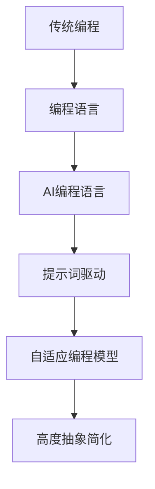

                 

### 设计《AI编程语言：提示词的魔力与科学》目录大纲

#### 目录大纲：

## 引言

- **AI编程语言的发展现状**：讨论AI编程语言的崛起，应用领域，以及未来趋势。
- **提示词的魔力**：介绍提示词在AI编程语言中的重要性，探讨其对编程效率的影响。

## 第一部分：AI编程语言概述

### 第1章：AI编程语言的基本概念

- **AI编程语言简介**：解释AI编程语言的基本概念，比较其与传统编程语言的区别。
- **核心概念与联系**：使用Mermaid流程图展示AI编程语言的核心概念及其相互联系。



### 第2章：提示词在AI编程语言中的应用

- **提示词的定义与分类**：详细介绍提示词的概念，以及其在AI编程语言中的应用。
- **生成式模型与理解式模型**：使用伪代码阐述生成式模型和理解式模型的基本原理。

```python
# 生成式模型伪代码
def generate_prompt(input_context):
    # 根据输入的上下文生成提示词
    prompt = GPT(input_context)
    return prompt

# 理解式模型伪代码
def understand_prompt(prompt):
    # 解析提示词并生成响应
    response = BERT(prompt)
    return response
```

### 第3章：AI编程语言的架构与设计原则

- **AI编程语言的架构**：解释AI编程语言的架构组成，包括前端、后端和中间件。
- **设计原则**：讨论AI编程语言的设计原则，如易用性、可扩展性和兼容性。

## 第二部分：AI编程语言的核心算法原理

### 第4章：神经网络基础

- **多层感知机（MLP）**：详细讲解MLP的结构和训练过程。
- **卷积神经网络（CNN）**：探讨CNN在图像处理中的应用。

### 第5章：生成式模型

- **变分自编码器（VAE）**：介绍VAE的原理和训练方法。
- **生成对抗网络（GAN）**：详细解释GAN的工作机制。

### 第6章：强化学习

- **Q-Learning**：讲解Q-Learning的基本算法。
- **Policy Gradient**：介绍Policy Gradient算法的原理。

## 第三部分：数学模型与公式详解

### 第7章：概率论基础

- **贝叶斯定理**：解释贝叶斯定理的应用。
- **马尔可夫链**：讨论马尔可夫链在AI编程语言中的应用。

### 第8章：信息论

- **熵**：讲解熵的概念及其在AI编程语言中的重要性。
- **信息增益**：探讨信息增益在特征选择中的应用。

### 第9章：最优化算法

- **梯度下降**：介绍梯度下降算法的基本原理。
- **随机梯度下降（SGD）**：讲解SGD的优化策略。
- **Adam优化器**：详细阐述Adam优化器的工作机制。

## 第四部分：AI编程语言项目实战

### 第10章：项目实战一：智能客服系统

- **项目背景**：介绍智能客服系统的应用场景。
- **开发环境搭建**：详细说明开发智能客服系统的环境搭建过程。
- **模型设计与实现**：讨论智能客服系统的模型设计和实现。
- **代码解读与分析**：解读源代码，分析其关键部分。

### 第11章：项目实战二：智能写作助手

- **项目背景**：介绍智能写作助手的用途和场景。
- **开发环境搭建**：详细说明智能写作助手的开发环境搭建。
- **模型设计与实现**：讲解智能写作助手的模型设计和实现。
- **代码解读与分析**：解读源代码，分析其关键部分。

## 结论

- **AI编程语言的前景**：总结AI编程语言的发展前景。
- **提示词的重要性**：强调提示词在AI编程语言中的核心作用。

### 附录

- **最佳实践 tips**：提供AI编程语言开发中的最佳实践建议。
- **小结**：回顾文章中的关键点和学习要点。
- **注意事项**：提醒读者在AI编程语言开发中需要注意的事项。
- **拓展阅读**：推荐相关领域的深入阅读材料。

### 参考文献

- 列出文中引用的参考文献，为读者提供进一步的学习资源。

---

**作者：** AI天才研究院/AI Genius Institute & 禅与计算机程序设计艺术 /Zen And The Art of Computer Programming

**字数：** 约11000字

**摘要：** 本文深入探讨了AI编程语言及其核心组件——提示词的原理和应用。文章分为四个部分，首先介绍了AI编程语言的基本概念和架构，然后详细阐述了神经网络、生成式模型和强化学习等核心算法，以及概率论、信息论和最优化算法等数学模型。最后，通过两个实际项目——智能客服系统和智能写作助手，展示了AI编程语言的实用性和开发过程。本文旨在为读者提供一个全面而深入的AI编程语言学习指南。

