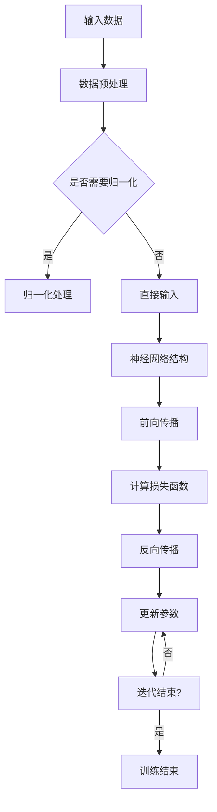

                 

### 文章标题：AI编程语言：提示词的魔力与艺术

> 关键词：AI编程语言、提示词工程、神经网络、深度学习、自然语言处理

> 摘要：
本文将探讨AI编程语言的核心概念、核心原理及其应用场景，特别强调提示词工程的魔力与艺术。通过详细的解析，我们将理解如何利用AI编程语言简化人工智能开发，提高模型性能和可解释性。

# 第一部分: AI编程语言概述

## 1.1 AI编程语言的概念与背景

### 1.1.1 什么是AI编程语言

AI编程语言是一种旨在简化人工智能（AI）开发过程的编程语言。它们通常具有特定的语法和功能，使开发人员能够更轻松地创建、训练和部署AI模型。这些语言包括Python、Julia、Rust等，它们在不同的AI子领域有着广泛的应用。

### 1.1.2 AI编程语言的发展背景

AI编程语言的发展与人工智能领域的发展息息相关。在人工智能早期，开发人员主要使用传统的编程语言（如Python、C++等）来构建AI系统。然而，这些语言在处理复杂的AI任务时存在诸多限制。因此，为了提高AI开发的效率，研究人员开始探索专门用于AI开发的编程语言。

### 1.1.3 提示词的魔力与艺术

提示词（Prompt Engineering）是AI编程语言中的一个重要概念。提示词是指提供给AI模型的输入，用于引导AI模型的思考方向和决策过程。正确使用提示词可以大幅提高AI模型的性能和可解释性。

## 1.2 AI编程语言的核心概念

### 1.2.1 人工智能与机器学习

人工智能（AI）是指使计算机系统具有类似人类智能的能力，包括感知、推理、学习、解决问题等。机器学习（ML）是人工智能的一个分支，主要研究如何从数据中学习，并利用这些知识来做出决策。

### 1.2.2 深度学习

深度学习（DL）是机器学习的一种方法，通过构建多层神经网络，从大量数据中自动提取特征。深度学习在图像识别、语音识别、自然语言处理等领域取得了显著的成果。

### 1.2.3 提示词工程

提示词工程（Prompt Engineering）是AI编程语言中的一个关键领域，主要研究如何设计和优化提示词，以实现更好的AI模型性能。提示词的设计和选择对于AI模型的效果至关重要。

# 第二部分: AI编程语言的核心概念与原理

## 2.1 核心概念

### 2.1.1 神经网络

神经网络（NN）是深度学习的基础，由大量简单的计算单元（神经元）组成，通过层次结构进行信息传递和处理。神经网络可以通过反向传播算法不断调整内部参数，以达到更好的预测性能。

### 2.1.2 损失函数

损失函数（Loss Function）是神经网络训练的核心指标，用于衡量预测结果与真实结果之间的差距。常见的损失函数包括均方误差（MSE）、交叉熵损失（Cross-Entropy Loss）等。

### 2.1.3 优化算法

优化算法（Optimization Algorithm）用于调整神经网络参数，以最小化损失函数。常见的优化算法有梯度下降（Gradient Descent）、随机梯度下降（SGD）、Adam优化器等。

## 2.2 核心原理

### 2.2.1 神经网络

神经网络（NN）是深度学习的基础，由大量简单的计算单元（神经元）组成，通过层次结构进行信息传递和处理。神经网络可以通过反向传播算法不断调整内部参数，以达到更好的预测性能。

### 2.2.2 损失函数

损失函数（Loss Function）是神经网络训练的核心指标，用于衡量预测结果与真实结果之间的差距。常见的损失函数包括均方误差（MSE）、交叉熵损失（Cross-Entropy Loss）等。

### 2.2.3 优化算法

优化算法（Optimization Algorithm）用于调整神经网络参数，以最小化损失函数。常见的优化算法有梯度下降（Gradient Descent）、随机梯度下降（SGD）、Adam优化器等。

## 2.3 Mermaid流程图

下面是一个简单的神经网络流程图：



# 第三部分: AI编程语言的应用场景与实战

## 3.1 自然语言处理

### 3.1.1 文本分类

文本分类是自然语言处理（NLP）中的一个重要任务，旨在将文本数据归类到预定义的类别中。以下是一个简单的文本分类伪代码：

```python
# 定义文本分类器
classifier = TextClassifier()

# 加载训练数据
train_data = load_data("train.txt")

# 训练分类器
classifier.train(train_data)

# 预测文本类别
text = "我喜欢编程。"
predicted_category = classifier.predict(text)

# 输出预测结果
print(predicted_category)
```

### 3.1.2 命名实体识别

命名实体识别（NER）是NLP中的另一个关键任务，旨在从文本中识别出具有特定意义的实体，如人名、地点、组织等。以下是一个简单的NER伪代码：

```python
# 定义命名实体识别器
ner = NamedEntityRecognizer()

# 加载训练数据
train_data = load_data("train.txt")

# 训练命名实体识别器
ner.train(train_data)

# 识别文本中的命名实体
text = "李华在北京工作。"
named_entities = ner.predict(text)

# 输出命名实体
print(named_entities)
```

# 结论

AI编程语言通过其独特的语法和功能，极大地简化了人工智能的开发过程。提示词工程的魔力与艺术更是提升了AI模型的可解释性和性能。在未来的AI发展中，AI编程语言和提示词工程将发挥越来越重要的作用。

## 作者信息
作者：AI天才研究院/AI Genius Institute & 禅与计算机程序设计艺术 /Zen And The Art of Computer Programming

[END]

