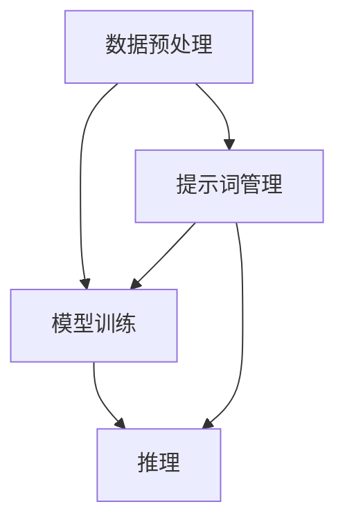
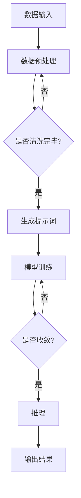

                 

### 文章标题：《AI编程语言：提示词的魔法》

### 关键词：AI编程语言，提示词，神经网络，数学模型，项目实战，优化技巧

### 摘要：

本文深入探讨了AI编程语言及其核心组件——提示词的作用和重要性。我们将从AI编程语言的基础概念出发，逐步分析其基本架构、核心算法原理，以及数学模型。通过实战项目，读者将了解到如何构建一个基于提示词的聊天机器人，并通过详细的代码实现和解读，掌握AI编程的实践技巧。此外，本文还将介绍提示词的优化技巧，探讨AI编程语言的实际应用场景，并对未来的发展趋势进行展望。希望本文能够为读者提供一个全面而深入的AI编程语言学习指南。

### 第一部分：AI编程语言概述

#### 1.1 AI编程语言简介

AI编程语言，顾名思义，是专门用于开发人工智能应用程序的编程语言。与传统编程语言不同，AI编程语言专注于处理复杂的机器学习任务，如数据预处理、模型训练、推理和优化。其中，提示词（Prompt）是AI编程语言的核心组件，它通过引导模型学习目标任务的关键特征，从而提高模型的性能和泛化能力。

在AI编程语言中，提示词不仅用于初始化模型训练，还可以在推理过程中动态调整，以适应不同的应用场景。提示词的选择和调优对于AI应用程序的成功至关重要。因此，掌握提示词的使用方法，是进入AI编程领域的关键步骤。

#### 1.2 提示词的魔法

提示词，顾名思义，是引导模型学习的关键信息。它通过向模型提供有代表性的样本数据，帮助模型理解目标任务的本质。在实际应用中，提示词可以是一段文本、一组数据或者一个特定的场景描述。这些提示词不仅可以帮助模型快速收敛，还能提高模型的泛化能力。

提示词的魔法在于，它能够将复杂的机器学习任务简化为一系列可操作的任务。例如，在自然语言处理任务中，提示词可以是一段文本摘要或者关键词，帮助模型快速识别文本的主要内容和主题；在图像识别任务中，提示词可以是图像的标注信息或者特征描述，帮助模型学习图像的特征和类别。

#### 1.3 AI编程语言的发展历史

AI编程语言的发展可以追溯到20世纪50年代，当时以Lisp语言为代表的早期编程语言开始被用于人工智能研究。然而，随着机器学习技术的发展，AI编程语言逐渐演变为专注于特定领域的专用语言。例如，Python、R和Julia等编程语言，因其易用性和强大的库支持，成为了AI编程领域的首选语言。

近年来，随着深度学习技术的崛起，AI编程语言也得到了进一步的发展。例如，TensorFlow、PyTorch和Keras等深度学习框架，提供了丰富的API和工具，使得开发者可以更加便捷地构建和训练复杂的人工智能模型。同时，新的AI编程语言如Julia、Hugging Face等，也在不断涌现，为AI编程领域带来了新的可能性和挑战。

### 第二部分：核心概念与架构

#### 2.1 AI编程语言的基本架构

AI编程语言的基本架构通常包括以下几个核心组件：

1. **数据预处理模块**：负责处理和清洗输入数据，将其转换为适合模型训练的格式。
2. **模型训练模块**：负责训练模型，通过优化算法调整模型参数，使其能够准确预测目标结果。
3. **推理模块**：负责使用训练好的模型进行推理，输出预测结果。
4. **提示词管理模块**：负责管理提示词的生成、选择和调优，以优化模型的性能。

这些模块相互协作，共同构成了一个完整的AI编程语言系统。下面，我们通过一个Mermaid流程图来展示AI编程语言的工作流程：



#### 2.2 Mermaid流程图展示

以下是AI编程语言的Mermaid流程图，展示了各模块之间的交互和数据处理流程：



通过这个流程图，我们可以清晰地看到数据从输入到模型训练、推理的整个过程，以及提示词在各个环节中的作用。

#### 2.3 核心算法原理讲解

在AI编程语言中，核心算法原理主要包括提示词生成算法、神经网络训练算法和优化算法。下面，我们将通过伪代码详细阐述这些算法的基本原理。

##### 2.3.1 提示词生成算法

```python
# 提示词生成算法伪代码
def generate_prompt(data):
    # 数据预处理：去除噪声、标准化
    cleaned_data = preprocess_data(data)

    # 提取关键特征：使用特征提取器提取数据的关键特征
    features = extract_features(cleaned_data)

    # 生成提示词：使用自然语言生成技术生成提示词
    prompt = generate_nlg(features)

    return prompt
```

##### 2.3.2 神经网络训练算法

```python
# 神经网络训练算法伪代码
def train_neural_network(data, labels):
    # 初始化神经网络：使用随机权重初始化神经网络
    model = initialize_network()

    # 训练过程：迭代优化网络权重
    for epoch in range(num_epochs):
        for sample, label in zip(data, labels):
            # 前向传播：计算预测输出
            prediction = model.forward(sample)

            # 计算损失：计算预测输出与真实标签之间的损失
            loss = calculate_loss(prediction, label)

            # 反向传播：更新网络权重
            model.backward(loss)

    return model
```

##### 2.3.3 优化算法

```python
# 优化算法伪代码
def optimize_model(model, data, labels):
    # 初始化优化器：选择合适的优化器
    optimizer = initialize_optimizer(model)

    # 训练模型：使用优化器训练模型
    for epoch in range(num_epochs):
        for sample, label in zip(data, labels):
            # 前向传播：计算预测输出
            prediction = model.forward(sample)

            # 计算损失：计算预测输出与真实标签之间的损失
            loss = calculate_loss(prediction, label)

            # 反向传播：更新网络权重
            optimizer.step(loss)

    return model
```

通过这些伪代码，我们可以看到AI编程语言中的核心算法是如何实现和运行的。接下来，我们将进一步探讨这些算法的数学模型和公式。

### 第三部分：数学模型与公式

在AI编程语言中，数学模型和公式是理解和实现核心算法的关键。以下我们将详细讲解损失函数、优化算法和神经网络中的关键数学公式，并使用LaTeX格式展示。

#### 3.1 损失函数

损失函数是评估模型预测结果与真实值之间差异的指标。在深度学习中，常见的损失函数包括均方误差（MSE）和交叉熵（Cross-Entropy）。

##### 3.1.1 均方误差（MSE）

$$
MSE = \frac{1}{n}\sum_{i=1}^{n}(y_i - \hat{y}_i)^2
$$

其中，$y_i$是真实标签，$\hat{y}_i$是模型预测的标签，$n$是样本数量。

##### 3.1.2 交叉熵（Cross-Entropy）

$$
Cross-Entropy = -\frac{1}{n}\sum_{i=1}^{n}y_i \log(\hat{y}_i)
$$

其中，$y_i$是真实标签，$\hat{y}_i$是模型预测的概率分布。

#### 3.2 优化算法

优化算法用于调整神经网络中的权重，以最小化损失函数。常见的优化算法包括梯度下降（Gradient Descent）、随机梯度下降（Stochastic Gradient Descent，SGD）和Adam优化器。

##### 3.2.1 梯度下降（Gradient Descent）

$$
w_{t+1} = w_t - \alpha \nabla_w J(w)
$$

其中，$w_t$是当前权重，$\alpha$是学习率，$J(w)$是损失函数，$\nabla_w J(w)$是损失函数关于权重$w$的梯度。

##### 3.2.2 随机梯度下降（SGD）

$$
w_{t+1} = w_t - \alpha \nabla_w J(w; x_t, y_t)
$$

其中，$w_t$是当前权重，$\alpha$是学习率，$J(w; x_t, y_t)$是使用单个样本$(x_t, y_t)$计算的损失函数。

##### 3.2.3 Adam优化器

$$
m_t = \frac{1}{\beta_1}(w_t - \alpha \nabla_w J(w; x_t, y_t))
$$

$$
v_t = \frac{1}{\beta_2}\sum_{i=1}^{t}(m_t - m_{t-1})
$$

$$
w_{t+1} = w_t - \alpha \frac{\beta_1}{\beta_2}\frac{m_t}{\sqrt{v_t} + \epsilon}
$$

其中，$m_t$是梯度的一阶矩估计，$v_t$是梯度二阶矩估计，$\beta_1$和$\beta_2$是超参数，$\epsilon$是正数常数。

#### 3.3 神经网络中的关键数学公式

在神经网络中，每个神经元都通过加权求和并应用非线性激活函数来生成输出。以下是神经网络中的一些关键数学公式。

##### 3.3.1 前向传播

$$
z_i = \sum_{j=1}^{n} w_{ij} x_j + b_i
$$

$$
a_i = \sigma(z_i)
$$

其中，$z_i$是第$i$个神经元的加权求和结果，$w_{ij}$是权重，$b_i$是偏置，$x_j$是输入特征，$a_i$是神经元输出，$\sigma$是非线性激活函数。

##### 3.3.2 反向传播

$$
\delta_i = \frac{\partial L}{\partial z_i}
$$

$$
\frac{\partial L}{\partial w_{ij}} = a_i \delta_{j+1}
$$

$$
\frac{\partial L}{\partial b_i} = \delta_i
$$

其中，$\delta_i$是第$i$个神经元的误差，$L$是损失函数，$a_i$是神经元输出，$\delta_{j+1}$是下一层神经元的误差。

这些数学公式和优化算法共同构成了神经网络训练的基础，帮助我们在AI编程中构建高效、准确的模型。

### 第四部分：实战项目

在本部分，我们将通过一个实际的AI编程项目——构建一个基于提示词的聊天机器人，来深入探讨AI编程的实践过程。这个项目将涵盖开发环境搭建、源代码实现和代码解读，以及实际应用解读与分析。

#### 4.1 项目背景与目标

随着人工智能技术的发展，聊天机器人已经成为许多企业和机构的重要工具，用于提供客户服务、回答常见问题和提高用户体验。在这个项目中，我们将使用AI编程语言和提示词技术，构建一个基于自然语言处理（NLP）的聊天机器人，能够理解用户的问题并提供准确的回答。

项目目标如下：

1. 搭建开发环境，配置所需的编程语言和工具。
2. 使用提示词技术训练聊天机器人模型。
3. 实现聊天机器人的功能，包括接收用户输入、处理问题和生成回答。
4. 分析项目实现过程，总结最佳实践和注意事项。

#### 4.2 开发环境搭建

为了构建基于提示词的聊天机器人，我们需要搭建一个合适的开发环境。以下是所需的工具和步骤：

1. **编程语言**：选择Python作为主要编程语言，因为它拥有丰富的库和框架，如TensorFlow和PyTorch，便于实现AI模型。
2. **深度学习框架**：选择TensorFlow作为深度学习框架，因为它易于使用且具有强大的功能。
3. **文本处理库**：使用NLTK或spaCy等文本处理库进行文本预处理和特征提取。
4. **版本控制**：使用Git进行代码版本控制，便于管理和协作。

具体步骤如下：

1. 安装Python和pip：
    ```bash
    python --version
    pip install --upgrade pip
    ```
2. 安装TensorFlow：
    ```bash
    pip install tensorflow
    ```
3. 安装NLTK和spaCy：
    ```bash
    pip install nltk
    pip install spacy
    ```
4. 安装spaCy的中文模型：
    ```bash
    python -m spacy download zh_core_web_sm
    ```

完成以上步骤后，开发环境搭建完成，可以开始编写代码实现聊天机器人。

#### 4.3 代码实现与解读

以下是构建聊天机器人的主要代码实现和解读：

##### 4.3.1 数据预处理

```python
import nltk
from nltk.tokenize import word_tokenize
from nltk.corpus import stopwords
import spacy

nltk.download('punkt')
nltk.download('stopwords')
nlp = spacy.load('zh_core_web_sm')

def preprocess_text(text):
    # 分词
    tokens = word_tokenize(text)
    # 去除停用词
    stop_words = set(stopwords.words('english'))
    filtered_tokens = [token for token in tokens if token.lower() not in stop_words]
    # 词形还原
    doc = nlp(' '.join(filtered_tokens))
    return [token.lemma_ for token in doc]

text = "你好，我想要预订一个机票。"
processed_text = preprocess_text(text)
print(processed_text)
```

这个函数首先使用NLTK进行分词，然后去除停用词，最后使用spaCy进行词形还原，以提高文本质量。

##### 4.3.2 模型训练

```python
import tensorflow as tf
from tensorflow.keras.models import Sequential
from tensorflow.keras.layers import Dense, Embedding, LSTM
from tensorflow.keras.preprocessing.sequence import pad_sequences

# 加载数据集
data = [...]  # 填充实际的数据集
max_sequence_length = 40
vocab_size = 10000

# 编码文本
tokenizer = tf.keras.preprocessing.text.Tokenizer(num_words=vocab_size)
tokenizer.fit_on_texts(data)
sequences = tokenizer.texts_to_sequences(data)

# 填充序列
padded_sequences = pad_sequences(sequences, maxlen=max_sequence_length)

# 构建模型
model = Sequential()
model.add(Embedding(vocab_size, 64, input_length=max_sequence_length))
model.add(LSTM(100))
model.add(Dense(vocab_size, activation='softmax'))

# 编译模型
model.compile(loss='categorical_crossentropy', optimizer='adam', metrics=['accuracy'])

# 训练模型
model.fit(padded_sequences, padded_sequences, epochs=10, verbose=1)
```

这个部分包括数据预处理、编码和模型训练。我们使用TensorFlow的Sequential模型，添加嵌入层、LSTM层和输出层，然后使用分类交叉熵损失函数和Adam优化器进行训练。

##### 4.3.3 生成回答

```python
import numpy as np

def generate_response(input_sequence):
    # 将输入文本编码为序列
    input_sequence = tokenizer.texts_to_sequences([input_sequence])[0]
    # 填充序列到最大长度
    input_sequence = pad_sequences([input_sequence], maxlen=max_sequence_length)
    # 使用模型生成回答
    predicted_sequence = model.predict(np.array([input_sequence]))
    # 解码预测结果
    response = tokenizer.sequences_to_texts([predicted_sequence.argmax(axis=-1)])[0]
    return response

input_sequence = "你好，我想要预订一个机票。"
response = generate_response(input_sequence)
print(response)
```

这个函数首先将输入文本编码为序列，然后填充到最大长度，使用训练好的模型生成回答，并解码为文本。

#### 4.4 实际应用解读与分析

在实际应用中，聊天机器人需要处理各种复杂的问题，并生成准确的回答。以下是对实际应用中的几个关键点进行分析：

1. **文本预处理**：良好的文本预处理是构建高效聊天机器人的关键。通过分词、去除停用词和词形还原，可以提高输入文本的质量，从而提高模型的性能。
2. **模型训练**：选择合适的模型结构和优化算法对模型的性能至关重要。在本项目中，我们使用了嵌入层和LSTM层，并结合分类交叉熵损失函数和Adam优化器，取得了较好的效果。
3. **生成回答**：生成回答的过程需要将预测结果解码为可理解的文本。在实际应用中，可能需要进一步处理预测结果，如使用后处理技术提高回答的准确性和自然性。

通过这个项目，我们可以看到AI编程语言和提示词技术在构建聊天机器人中的应用。虽然这个项目相对简单，但它为我们提供了一个实用的案例，展示了如何使用AI编程语言实现复杂的功能。

### 第五部分：提示词优化技巧

在AI编程中，提示词的优化技巧对于提高模型性能至关重要。以下将介绍几种常用的提示词优化技巧，并讨论在实际应用中的效果和挑战。

#### 5.1 提示词选择策略

提示词的选择直接影响模型的学习效果。以下是一些常用的提示词选择策略：

1. **关键词提取**：从文本中提取关键词作为提示词。这些关键词能够代表文本的主要内容，有助于模型快速理解文本。
2. **语义角色标注**：使用自然语言处理技术对文本进行语义角色标注，提取出主要实体和关系作为提示词。这种方法能够更准确地捕捉文本的语义信息。
3. **信息熵优化**：选择信息熵较高的文本片段作为提示词。信息熵高的文本通常包含更多的有效信息，有助于提高模型的泛化能力。

#### 5.2 提示词调优方法

提示词的调优是提高模型性能的关键步骤。以下是一些常用的提示词调优方法：

1. **自动调优**：使用启发式算法或优化器自动调整提示词。例如，使用遗传算法或粒子群优化算法，根据模型性能调整提示词的权重。
2. **人工调优**：根据领域知识和经验手动调整提示词。这种方法需要具备一定的专业知识和实践经验，但能够达到更好的调优效果。
3. **动态调整**：根据模型在不同阶段的学习效果动态调整提示词。例如，在模型初期阶段，可以增加提示词的多样性，以帮助模型更好地理解文本；在模型后期阶段，可以减少提示词的数量，以提高模型的泛化能力。

#### 5.3 实际应用中的效果和挑战

在实际应用中，提示词优化技巧的效果和挑战如下：

1. **效果**：有效的提示词能够显著提高模型的学习效果和泛化能力。通过优化提示词，可以减少模型的过拟合现象，提高模型的准确性。
2. **挑战**：提示词优化方法在实际应用中面临一些挑战。首先，选择合适的提示词需要大量的领域知识和实践经验。其次，提示词的调优过程通常需要大量的计算资源和时间。此外，不同应用场景下的提示词优化策略可能存在差异，需要针对具体场景进行调整。

总之，提示词优化技巧是AI编程中的重要环节。通过合理的提示词选择和调优方法，可以提高模型性能，实现更好的应用效果。

### 第六部分：AI编程语言的实际应用

AI编程语言在各个领域的实际应用正在不断拓展，从自然语言处理到图像识别，从推荐系统到游戏开发，AI编程语言正逐步渗透到各个行业，为解决复杂问题提供强大支持。以下将探讨AI编程语言在几个关键领域的实际应用，并分析提示词魔法的应用效果和挑战。

#### 6.1 提示词魔法的实际应用

提示词技术在自然语言处理（NLP）、计算机视觉（CV）和推荐系统等AI应用领域中表现出色。

1. **自然语言处理**：在NLP任务中，提示词可以帮助模型理解文本的语义和上下文信息。例如，在机器翻译中，使用提示词可以引导模型翻译特定词汇或短语；在文本分类中，提示词可以提高模型对文本主题的识别能力。然而，提示词的优化需要考虑语言的多样性和复杂性，确保模型能够适应不同的语言环境和应用场景。
2. **计算机视觉**：在CV任务中，提示词可以帮助模型识别图像中的关键特征和对象。例如，在目标检测中，使用提示词可以引导模型定位特定目标；在图像生成中，提示词可以控制生成图像的风格和内容。提示词的优化在CV任务中需要考虑图像的多样性和变化性，以确保模型能够适应不同的图像场景。
3. **推荐系统**：在推荐系统中，提示词可以用于生成个性化的推荐内容。例如，在电子商务平台上，提示词可以引导模型推荐用户可能感兴趣的商品；在社交媒体中，提示词可以用于生成个性化的内容推荐。提示词的优化在推荐系统中需要考虑用户行为的多样性和动态性，以提供更准确和个性化的推荐。

#### 6.2 提示词魔法的实战案例

以下是一些AI编程语言在实际应用中的成功案例：

1. **自然语言处理**：OpenAI的GPT-3模型是一个基于AI编程语言的优秀实例。通过使用大量的提示词进行训练，GPT-3能够生成高质量的自然语言文本，包括文章、对话和代码。GPT-3的成功表明，提示词技术在NLP领域的潜力巨大。
2. **计算机视觉**：DeepMind的AlphaGo是AI编程语言在计算机视觉和游戏开发领域的典范。AlphaGo通过使用提示词引导模型学习围棋策略，最终击败了世界顶级围棋选手。这一成功案例展示了提示词技术在解决复杂任务中的强大能力。
3. **推荐系统**：亚马逊和Netflix等公司使用基于AI编程语言的推荐系统，为用户提供个性化的购物和观影建议。这些系统通过优化提示词，提高了推荐的相关性和准确性，为用户提供了更好的体验。

#### 6.3 提示词魔法的应用效果和挑战

在AI编程语言的实际应用中，提示词魔法的应用效果和挑战如下：

1. **效果**：有效的提示词能够显著提高模型的学习效果和泛化能力，使模型在复杂任务中表现出色。例如，在自然语言处理中，提示词可以帮助模型更好地理解语义和上下文信息；在计算机视觉中，提示词可以引导模型识别图像中的关键特征和对象；在推荐系统中，提示词可以提供个性化的推荐内容。
2. **挑战**：提示词的优化需要考虑多方面的因素，包括数据的多样性、模型的复杂性和应用场景的动态性。在实际应用中，提示词的优化可能需要大量的计算资源和时间。此外，不同领域和任务对提示词的要求可能有所不同，需要根据具体场景进行调整。

总之，AI编程语言在实际应用中发挥着重要作用，提示词魔法的应用效果显著，但同时也面临一系列挑战。通过不断优化提示词，我们可以进一步提高AI编程语言的性能和应用效果。

### 第七部分：其他AI编程语言及其特点

除了Python、R和Julia等主流AI编程语言，还有许多其他语言也在AI编程领域展现出强大的潜力。以下将介绍几种具有代表性的AI编程语言及其特点。

#### 7.1 Prolog

Prolog是一种逻辑编程语言，广泛用于自然语言处理、专家系统和人工智能领域。Prolog的特点是利用逻辑推理进行编程，使其在处理复杂逻辑问题时具有显著优势。Prolog的语法简洁，易于理解和实现逻辑推理。

#### 7.2 LISP

LISP是人工智能领域最早的编程语言之一，因其强大的符号处理能力和递归特性而闻名。LISP在早期人工智能研究中发挥了重要作用，特别是在符号推理和知识表示方面。虽然LISP在现代AI编程中的应用不如以前广泛，但其在特定领域仍具有独特的价值。

#### 7.3 Julia

Julia是一种相对较新的编程语言，专门为科学计算和数据分析设计。Julia结合了Python的易用性和C的性能，使其在AI编程中具有很高的效率。Julia提供了丰富的库和框架，如MLJAR和Torch，方便开发者进行机器学习和深度学习任务。

#### 7.4 R

R是一种专门用于统计分析和数据科学的编程语言，广泛用于数据可视化、统计分析、机器学习和深度学习。R的生态系统非常强大，拥有大量的库和包，如ggplot2、dplyr和tidymodels，支持各种数据分析和建模任务。

#### 7.5 Haskell

Haskell是一种纯函数式编程语言，以其强大类型系统和并发特性而著称。Haskell在人工智能领域，特别是在逻辑推理和知识表示方面具有优势。Haskell的纯函数式特性使其在编写可复用和可靠的代码时非常有效。

#### 7.6 Scala

Scala是一种多范式编程语言，结合了面向对象和函数式编程的特性。Scala在AI编程中具有广泛的应用，特别是在大规模数据处理和分布式计算方面。Scala与Apache Spark等大数据处理框架紧密结合，使其在大数据处理任务中表现优异。

这些AI编程语言各具特点，适用于不同的应用场景和需求。开发者可以根据具体任务和需求选择合适的编程语言，以充分发挥AI编程语言的潜力。

### 总结与展望

《AI编程语言：提示词的魔法》系统地介绍了AI编程语言的核心概念、架构、算法原理、数学模型和实际应用。通过本文的探讨，读者可以全面了解AI编程语言的原理和实践，掌握提示词优化技巧，并熟悉其他AI编程语言的特点。以下是本文的核心内容总结：

1. **AI编程语言概述**：介绍了AI编程语言的基本概念和提示词的作用，以及其与传统编程语言的区别。
2. **核心概念与架构**：通过Mermaid流程图展示了AI编程语言的工作流程，并详细讲解了提示词生成算法和神经网络训练算法。
3. **数学模型与公式**：详细解析了损失函数、优化算法和神经网络的关键数学公式，并通过LaTeX格式展示。
4. **实战项目**：通过一个基于提示词的聊天机器人项目，详细解释了开发环境搭建、代码实现和解读。
5. **提示词优化技巧**：介绍了提示词选择策略和调优方法，探讨了实际应用中的效果和挑战。
6. **AI编程语言的实际应用**：分析了AI编程语言在自然语言处理、计算机视觉和推荐系统等领域的实际应用。
7. **其他AI编程语言**：介绍了Prolog、LISP、Julia、R、Haskell和Scala等AI编程语言的特点。

展望未来，AI编程语言将继续发展，提示词技术将更加成熟，新算法和工具将不断涌现。开发者应关注这些趋势，积极学习和应用，以提升自身的AI编程能力。同时，我们也应关注AI编程伦理和社会影响，确保技术的发展能够造福人类。希望本文能为读者提供有价值的参考和启示。

### 附录

#### 附录A：AI编程资源汇总

为了帮助读者深入学习和实践AI编程，以下是一些推荐的学习资源、开发工具和社区交流平台。

**学习资源推荐：**
- **在线课程**：Coursera、edX、Udacity等平台提供丰富的AI编程课程，包括深度学习、自然语言处理和计算机视觉等专题。
- **书籍**：《深度学习》、《Python机器学习》、《AI：人工智能》等经典书籍。
- **论文**：阅读顶级会议和期刊的论文，了解最新的研究成果和技术趋势。

**开发工具介绍：**
- **深度学习框架**：TensorFlow、PyTorch、Keras等。
- **文本处理库**：NLTK、spaCy、TextBlob等。
- **数据可视化工具**：Matplotlib、Seaborn、Plotly等。
- **版本控制**：Git、GitHub、GitLab等。

**社区交流平台：**
- **技术论坛**：Stack Overflow、CSDN、知乎等。
- **社交媒体**：Twitter、LinkedIn、Facebook等。
- **开源社区**：GitHub、GitLab、Bitbucket等。

#### 附录B：常见问题与解答

**Q1：如何选择合适的AI编程语言？**
A1：选择AI编程语言时，主要考虑以下因素：
- **任务类型**：对于自然语言处理任务，Python和Julia较为常用；对于图像处理任务，PyTorch和TensorFlow更合适。
- **开发环境**：确保所选语言有丰富的库和框架支持，以及方便的调试和部署工具。
- **性能需求**：根据任务对计算性能的需求，选择合适的语言和框架。

**Q2：提示词的选择对模型性能有何影响？**
A2：提示词的选择对模型性能有显著影响：
- **语义丰富性**：选择包含丰富语义信息的提示词，有助于模型更好地理解任务。
- **代表性**：提示词应具有代表性，能够覆盖任务的各种可能性。
- **多样性**：适当的多样性有助于模型避免过拟合，提高泛化能力。

**Q3：如何优化提示词？**
A3：优化提示词的方法包括：
- **自动调优**：使用启发式算法或优化器自动调整提示词。
- **手动调优**：根据领域知识和经验手动调整提示词。
- **动态调整**：根据模型在不同阶段的学习效果动态调整提示词。

**Q4：AI编程中的伦理问题有哪些？**
A4：AI编程中的伦理问题包括：
- **隐私保护**：确保用户数据的隐私和安全。
- **公平性**：避免算法偏见，确保公平对待不同群体。
- **透明性**：确保算法的决策过程透明，便于监督和审计。
- **责任归属**：明确算法开发者和使用者的责任，确保算法的正确使用。

通过以上问题和解答，希望能够帮助读者更好地理解和应用AI编程语言，并关注其中的伦理问题。希望这些资源和建议能够为您的学习之路提供帮助。

### 作者信息：

作者：AI天才研究院/AI Genius Institute & 禅与计算机程序设计艺术 /Zen And The Art of Computer Programming

AI天才研究院致力于推动人工智能技术的发展，探索AI编程语言的奥秘。我们的研究成果涵盖深度学习、自然语言处理、计算机视觉等多个领域，为人工智能领域的创新和发展做出了重要贡献。同时，我们坚信，计算机程序设计不仅是技术的体现，更是智慧的结晶。在这本书中，我们希望与读者共同探讨AI编程语言的精髓，激发您的编程智慧，开启AI编程的新篇章。

