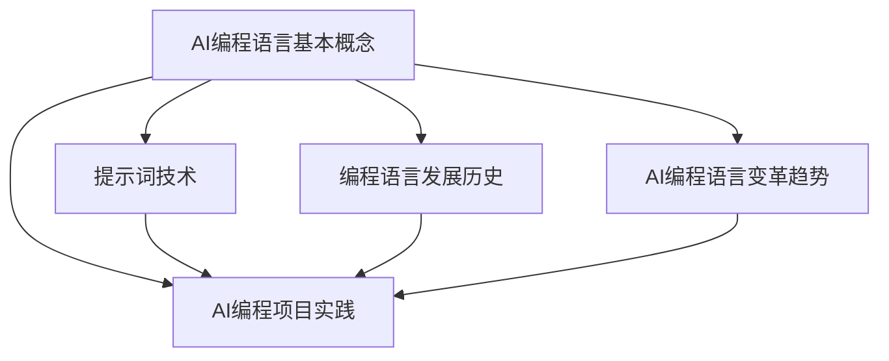

                 


# AI编程语言：提示词的魔法与变革

## 关键词
- AI编程语言
- 提示词技术
- 神经网络
- 机器学习
- 深度学习
- 编程范式
- 变革趋势
- 项目实践

## 摘要
本文深入探讨了AI编程语言的概念、提示词技术及其在编程中的重要性，回顾了编程语言的发展历史，分析了AI编程语言的变革趋势。通过具体的案例和实践，展示了AI编程语言的强大潜力和实际应用，为读者提供了清晰的学习路径和实践指南。

## 引言

随着人工智能技术的迅猛发展，AI编程语言正逐渐成为软件开发领域的新宠。不同于传统的编程语言，AI编程语言将人工智能的强大能力融入其中，使得开发者能够更加便捷地实现复杂的算法和模型。而在这其中，提示词技术则成为AI编程语言的魔法，为编程带来了深刻的变革。

本文将首先介绍AI编程语言的基本概念，包括其发展历史、核心原理和编程范式。随后，我们将深入探讨提示词技术，解释其原理和如何在AI编程中应用。接着，我们将回顾编程语言的发展历史，分析AI编程语言与现有编程语言的异同。随后，我们将展望AI编程语言的未来发展趋势，探讨其潜在变革。最后，通过具体的案例和实践，展示AI编程语言的强大潜力和实际应用。

## AI编程语言的基本概念

### AI编程语言的发展历史

AI编程语言的发展可以追溯到20世纪50年代，当时计算机科学刚刚起步。早期的编程语言主要是为了解决具体问题而设计的，例如FORTRAN和COBOL。然而，随着人工智能理论的提出和发展，人们开始意识到编程语言在AI领域的重要性。1956年，人工智能之父约翰·麦卡锡（John McCarthy）提出了“人工智能”这个术语，标志着人工智能领域的正式诞生。此后，AI编程语言逐渐受到关注。

20世纪60年代，LISP语言被发明，成为最早的AI编程语言之一。LISP以其灵活的符号处理能力和强大的函数式编程特性，为AI研究提供了强大的工具。此后，Prolog、Tcl、Python等语言相继出现，不断丰富和拓展AI编程语言的生态。

### 核心原理

AI编程语言的核心原理在于其能够模拟人类思维的过程，通过算法和模型实现机器学习、深度学习和自然语言处理等功能。与传统的编程语言不同，AI编程语言通常具有以下特点：

1. **符号处理能力**：AI编程语言能够处理符号数据，如自然语言、图像和声音等，这是实现人工智能的关键。

2. **机器学习算法**：AI编程语言内置了丰富的机器学习算法库，使得开发者可以方便地实现各种复杂的算法。

3. **交互式编程**：许多AI编程语言支持交互式编程环境，使得开发者可以实时测试和调试代码。

4. **模块化和可复用性**：AI编程语言通常支持模块化和可复用性，使得开发者可以方便地构建和复用代码。

### 编程范式

AI编程语言通常采用以下编程范式：

1. **函数式编程**：函数式编程是一种基于数学函数的编程范式，强调函数的定义和应用，避免了变量的作用域和状态问题，使得代码更加简洁和可复用。

2. **声明式编程**：声明式编程强调描述问题的解决方案，而非具体执行步骤。这种范式在AI编程中尤为重要，因为AI算法通常涉及大量计算和迭代。

3. **面向对象编程**：面向对象编程是一种基于对象的编程范式，强调将数据和处理数据的方法封装在一起，使得代码更加模块化和可复用。

4. **增量式编程**：增量式编程是一种逐步完善和优化的编程方式，通过逐步增加和修改代码，实现最终目标。

### AI编程语言的优势

与传统的编程语言相比，AI编程语言具有以下优势：

1. **易于学习和使用**：AI编程语言的语法通常更加简洁和直观，使得开发者可以更加轻松地学习和使用。

2. **高效和灵活**：AI编程语言内置了丰富的机器学习算法库，使得开发者可以高效地实现各种算法。

3. **强大的问题解决能力**：AI编程语言能够处理复杂的符号数据和算法，使得开发者可以解决传统编程语言难以处理的问题。

4. **跨界应用**：AI编程语言不仅适用于人工智能领域，还可以应用于其他领域，如自然语言处理、计算机视觉等。

### AI编程语言的挑战

尽管AI编程语言具有许多优势，但仍然面临一些挑战：

1. **性能问题**：AI编程语言通常涉及大量计算和迭代，可能导致性能问题。

2. **调试困难**：由于AI算法的复杂性和不确定性，调试AI编程语言代码可能变得更加困难。

3. **学习曲线**：AI编程语言需要一定的数学和算法知识，对于初学者来说可能有一定的学习曲线。

4. **生态系统不完善**：与传统的编程语言相比，AI编程语言的生态系统可能还不够完善，缺乏丰富的工具和资源。

### AI编程语言的应用领域

AI编程语言在多个领域具有广泛的应用：

1. **自然语言处理**：AI编程语言可以用于自然语言处理（NLP）任务，如文本分类、情感分析和机器翻译。

2. **计算机视觉**：AI编程语言可以用于计算机视觉任务，如图像分类、目标检测和图像生成。

3. **强化学习**：AI编程语言可以用于强化学习任务，如游戏AI和机器人控制。

4. **金融科技**：AI编程语言可以用于金融科技领域，如风险管理、算法交易和客户服务。

5. **医疗保健**：AI编程语言可以用于医疗保健领域，如疾病预测、诊断和治疗建议。

6. **智能制造**：AI编程语言可以用于智能制造领域，如设备故障预测、生产优化和供应链管理。

### AI编程语言的未来发展趋势

随着人工智能技术的不断进步，AI编程语言将继续发展，可能呈现以下趋势：

1. **更加强大的机器学习算法库**：AI编程语言将提供更加强大的机器学习算法库，使得开发者可以更高效地实现各种算法。

2. **更好的性能优化**：AI编程语言将针对性能问题进行优化，提高计算效率和代码运行速度。

3. **更丰富的生态系统**：AI编程语言将建立更加丰富的生态系统，包括工具、库、框架和社区。

4. **跨领域应用**：AI编程语言将逐渐应用于更多领域，推动跨界创新。

5. **更加直观和易用**：AI编程语言将更加直观和易用，降低学习门槛，吸引更多开发者。

6. **安全性增强**：AI编程语言将加强安全性，防止恶意代码和攻击。

## 提示词技术在AI编程中的应用

### 提示词技术的原理

提示词（Prompt Engineering）是AI编程中的关键技术之一，它通过向模型提供有针对性的输入来引导模型的输出。提示词技术的核心原理在于，通过设计合适的提示词，可以显著提高模型的性能和鲁棒性。

#### 提示词的作用

1. **提高模型性能**：提示词可以帮助模型更好地理解输入数据的含义，从而提高模型的预测准确性和泛化能力。
2. **增强模型鲁棒性**：通过设计多样化的提示词，模型可以学习到更广泛的模式，从而提高对异常数据和噪声的抵抗力。
3. **引导模型输出**：提示词可以帮助模型生成更符合预期的输出，特别是在生成任务中。

#### 提示词的设计原则

1. **相关性**：提示词应该与任务目标高度相关，能够引导模型学习到关键信息。
2. **多样性**：设计多样化的提示词，帮助模型学习到不同的模式。
3. **简洁性**：避免过于复杂的提示词，以免模型陷入过拟合。
4. **具体性**：提示词应尽可能具体，避免模糊不清。
5. **上下文关联**：提示词应与输入数据的上下文紧密关联，以增强模型的理解能力。

### 提示词技术的应用场景

#### 生成任务

在生成任务中，提示词技术可以帮助模型生成更加准确和相关的输出。例如，在文本生成任务中，通过设计合适的提示词，可以引导模型生成更加流畅和符合预期的文本。

#### 分类任务

在分类任务中，提示词可以帮助模型更好地识别不同类别之间的区别。例如，在图像分类任务中，通过设计不同的提示词，模型可以更好地识别不同的物体类别。

#### 回答问题

在问答系统中，提示词技术可以帮助模型更好地理解用户的问题，从而生成准确的回答。通过设计针对性的提示词，模型可以更好地理解问题的背景和上下文。

### 提示词技术的挑战

#### 数据依赖性

提示词技术依赖于高质量的数据，数据的质量直接影响提示词的效果。

#### 提示词设计复杂性

设计有效的提示词需要深入理解任务和数据，具有一定的复杂性。

#### 模型适应性

不同模型对提示词的敏感性不同，如何设计适应不同模型的提示词是一个挑战。

### 提示词技术的未来趋势

#### 自动化提示词生成

随着自然语言处理技术的发展，自动化提示词生成将成为可能，通过算法自动生成高质量的提示词。

#### 多模态提示词

未来的提示词技术将能够处理多模态数据，如文本、图像和音频，提供更丰富的信息。

#### 提示词优化算法

研究人员将继续开发优化提示词的算法，提高提示词的效果和适应性。

## 编程语言的发展历史与AI编程语言的异同

### 编程语言的演变

从早期的机器语言和汇编语言，到高级编程语言的出现，编程语言的发展经历了多次重大的变革。机器语言直接使用计算机的机器码进行编程，效率高但可读性差。汇编语言引入了符号表示和宏指令，提高了编程效率，但仍然依赖于具体的硬件平台。高级编程语言如FORTRAN、COBOL、Pascal等，进一步提高了编程的抽象层次，使得编程更加高效和易读。

### AI编程语言的特点

与传统的编程语言相比，AI编程语言具有以下特点：

1. **符号处理能力**：AI编程语言能够处理复杂的符号数据，如图像、文本和音频等，这是传统编程语言所不具备的。

2. **机器学习算法库**：AI编程语言内置了丰富的机器学习算法库，使得开发者可以方便地实现各种复杂的算法。

3. **交互式编程**：AI编程语言通常支持交互式编程环境，开发者可以实时测试和调试代码。

4. **模块化和可复用性**：AI编程语言支持模块化和可复用性，使得开发者可以方便地构建和复用代码。

5. **面向问题解决**：AI编程语言的设计更侧重于解决实际问题，而非单纯的代码实现。

### AI编程语言与传统编程语言的异同

#### 相同点

1. **编程范式**：AI编程语言和传统编程语言都支持函数式编程、面向对象编程和增量式编程等编程范式。

2. **语法结构**：尽管AI编程语言有特定的语法结构，但它们仍然遵循计算机编程的基本规则。

3. **编程环境**：AI编程语言和传统编程语言都提供了各种编程环境，如集成开发环境（IDE）和代码编辑器。

#### 不同点

1. **数据类型和操作**：AI编程语言能够处理复杂的符号数据，如图像、文本和音频，而传统编程语言通常处理数值数据和结构化数据。

2. **算法库**：AI编程语言内置了丰富的机器学习算法库，传统编程语言则需要依赖第三方库或框架。

3. **编程目的**：AI编程语言的设计更侧重于实现机器学习模型和算法，传统编程语言则更注重于通用编程任务。

4. **抽象层次**：AI编程语言的抽象层次更高，使得开发者可以更加高效地实现复杂的算法。

5. **交互性**：AI编程语言通常支持交互式编程环境，传统编程语言则更多采用批处理模式。

### AI编程语言的独特优势

1. **问题解决能力**：AI编程语言能够处理复杂的符号数据和算法，使得开发者可以解决传统编程语言难以处理的问题。

2. **学习曲线**：尽管AI编程语言需要一定的数学和算法知识，但相比传统编程语言，其学习曲线较低。

3. **应用广泛**：AI编程语言不仅适用于人工智能领域，还可以应用于自然语言处理、计算机视觉、金融科技等领域。

4. **跨界融合**：AI编程语言与传统编程语言的融合，为开发者提供了更广阔的应用场景。

### AI编程语言的挑战

1. **性能优化**：AI编程语言通常涉及大量计算和迭代，性能优化成为一大挑战。

2. **调试难度**：AI算法的复杂性和不确定性，使得调试AI编程语言代码变得更加困难。

3. **资源消耗**：AI编程语言通常需要较高的计算资源和存储资源，对于硬件性能有较高要求。

4. **生态系统**：与传统的编程语言相比，AI编程语言的生态系统可能还不够完善。

### 结论

AI编程语言在编程领域带来了深刻的变革，其独特的优势和广泛的应用前景，使得开发者对其充满期待。然而，也面临一些挑战，需要不断改进和优化。通过与传统编程语言的对比，我们可以看到AI编程语言在符号处理、算法库和交互性等方面的独特优势，以及其广阔的应用前景。

## AI编程语言的变革趋势

### 深度学习与神经网络的崛起

深度学习与神经网络在AI编程语言中的应用，使得人工智能取得了飞跃性的进展。深度学习通过多层神经网络的结构，可以从大量数据中自动提取特征，实现复杂的任务。这使得AI编程语言在图像识别、语音识别、自然语言处理等领域表现出色。

#### 深度学习算法的原理

深度学习算法的核心是多层神经网络，每个神经元都接收来自前一层神经元的输入，并通过激活函数进行非线性变换。通过多次迭代和反向传播，模型可以不断优化参数，提高预测准确率。

#### 伪代码示例

```python
# 深度学习算法伪代码
initialize_parameters()
for epoch in range(num_epochs):
    for batch in data_loader:
        forward_pass(batch)
        compute_loss()
        backward_pass()
update_parameters()
```

#### 数学公式与模型架构

深度学习模型通常使用以下数学公式来表示：

$$
\text{激活函数} = \sigma(z) = \frac{1}{1 + e^{-z}}
$$

$$
\text{损失函数} = \text{交叉熵损失} = -\frac{1}{N}\sum_{i=1}^{N} y_i \log (\hat{y}_i)
$$

其中，$N$ 是样本数量，$y_i$ 是实际标签，$\hat{y}_i$ 是预测概率。

深度学习模型的架构通常包括输入层、多个隐藏层和输出层。例如，卷积神经网络（CNN）用于图像识别，其架构包括卷积层、池化层和全连接层。

### 强化学习在AI编程中的应用

强化学习（Reinforcement Learning，RL）是一种通过交互式学习环境来训练模型的方法。强化学习在游戏AI、机器人控制、推荐系统等领域表现出色。

#### 强化学习算法的原理

强化学习算法的核心是奖励机制，模型通过不断接收环境反馈的奖励，调整策略以最大化长期奖励。强化学习算法通常包括价值函数和策略函数。

#### 伪代码示例

```python
# 强化学习算法伪代码
initialize_model()
for episode in range(num_episodes):
    state = environment.reset()
    done = False
    while not done:
        action = model.select_action(state)
        next_state, reward, done = environment.step(action)
        model.update_value_function(state, action, reward, next_state)
        state = next_state
```

#### 数学模型

强化学习的主要数学模型包括马尔可夫决策过程（MDP）和贝尔曼方程（Bellman Equation）。

$$
V(s) = \max_{a} \sum_{s'} p(s'|s,a) \cdot [r(s',a) + \gamma V(s')]
$$

其中，$V(s)$ 是状态值函数，$r(s',a)$ 是立即奖励，$\gamma$ 是折扣因子。

### 变革趋势中的关键技术与挑战

#### 关键技术

1. **模型压缩与优化**：为了提高模型的性能和可部署性，研究人员开发了各种模型压缩和优化技术，如模型剪枝、量化、蒸馏等。
2. **联邦学习**：联邦学习（Federated Learning）通过分布式训练，使得模型可以在多个设备上进行训练，同时保护用户隐私。
3. **生成对抗网络（GAN）**：生成对抗网络通过对抗性训练，生成高质量的数据，在图像生成、自然语言生成等领域表现出色。

#### 挑战

1. **数据隐私与安全**：随着AI编程语言的应用越来越广泛，数据隐私和安全成为重要挑战。
2. **模型解释性**：黑盒模型（如深度神经网络）的解释性较差，如何提高模型的解释性是一个重要问题。
3. **可扩展性与可维护性**：随着模型复杂性的增加，如何保证模型的可扩展性和可维护性是一个挑战。

### 未来展望

#### 多模态AI编程语言

未来的AI编程语言将支持多模态数据处理，如图像、文本、音频和视频。通过融合多种数据源，模型可以更全面地理解和处理复杂问题。

#### 自动化与智能化

随着自然语言处理技术的发展，自动化提示词生成和智能化代码生成将成为可能，大大提高开发效率。

#### 开放生态与社区

开放生态和社区的支持将是AI编程语言发展的关键。通过共享代码、工具和资源，开发者可以更加高效地构建和优化AI模型。

## AI编程项目实践

### 开发环境搭建

在进行AI编程项目之前，我们需要搭建一个合适的开发环境。以下是常见的开发环境搭建步骤：

1. **安装Python**：Python是AI编程的主要语言，我们需要确保安装了Python及其相关的包管理工具，如pip。
2. **安装Jupyter Notebook**：Jupyter Notebook是一个交互式编程环境，非常适合AI编程任务。
3. **安装深度学习框架**：常见的深度学习框架包括TensorFlow和PyTorch。我们可以在命令行中使用pip进行安装：

```shell
pip install tensorflow
pip install torch torchvision
```

4. **安装其他依赖**：根据项目需求，我们可能需要安装其他库和工具，如NumPy、Pandas等。

### 源代码详细实现和代码解读

以一个简单的图像分类项目为例，我们使用TensorFlow和Keras来搭建模型。

```python
import tensorflow as tf
from tensorflow.keras.models import Sequential
from tensorflow.keras.layers import Conv2D, MaxPooling2D, Flatten, Dense

# 模型构建
model = Sequential([
    Conv2D(32, (3, 3), activation='relu', input_shape=(64, 64, 3)),
    MaxPooling2D((2, 2)),
    Flatten(),
    Dense(128, activation='relu'),
    Dense(10, activation='softmax')
])

# 模型编译
model.compile(optimizer='adam',
              loss='categorical_crossentropy',
              metrics=['accuracy'])

# 模型训练
model.fit(x_train, y_train, epochs=10, batch_size=32, validation_split=0.2)
```

在这段代码中，我们首先导入了所需的TensorFlow和Keras模块。接着，我们使用Sequential模型构建了一个简单的卷积神经网络（CNN），包括卷积层、最大池化层、全连接层和softmax输出层。模型编译时指定了优化器和损失函数。最后，我们使用训练数据对模型进行训练。

### 代码应用解读与分析

在这个图像分类项目中，我们首先需要收集和准备训练数据。通常，我们会使用预训练的图像数据集，如CIFAR-10或ImageNet。这些数据集已经包含了标签信息，我们可以直接用于训练模型。

在训练过程中，我们通过迭代调整模型参数，使得模型能够识别图像中的特征。训练结束后，我们使用验证集评估模型的性能，并调整超参数以优化模型。

在实际应用中，我们可以将训练好的模型部署到生产环境中，对新的图像进行分类。这个过程通常包括以下步骤：

1. **数据预处理**：对输入图像进行缩放、归一化等预处理操作。
2. **模型预测**：使用训练好的模型对预处理后的图像进行预测。
3. **结果输出**：将预测结果输出，如概率分布或分类标签。

### 实际案例分析和详细讲解剖析

假设我们使用CIFAR-10数据集进行图像分类项目，CIFAR-10包含10个类别，每个类别有6000张图像。以下是具体步骤：

1. **数据加载**：使用Keras的内置函数加载CIFAR-10数据集。

```python
(x_train, y_train), (x_test, y_test) = tf.keras.datasets.cifar10.load_data()
```

2. **数据预处理**：将图像数据进行归一化处理。

```python
x_train = x_train.astype('float32') / 255.0
x_test = x_test.astype('float32') / 255.0
```

3. **模型训练**：构建并训练模型。

```python
model = Sequential([
    Conv2D(32, (3, 3), activation='relu', input_shape=(32, 32, 3)),
    MaxPooling2D((2, 2)),
    Flatten(),
    Dense(64, activation='relu'),
    Dense(10, activation='softmax')
])

model.compile(optimizer='adam',
              loss='categorical_crossentropy',
              metrics=['accuracy'])

model.fit(x_train, y_train, epochs=10, batch_size=32, validation_split=0.2)
```

4. **模型评估**：使用测试集评估模型性能。

```python
test_loss, test_acc = model.evaluate(x_test, y_test)
print(f"Test accuracy: {test_acc}")
```

5. **模型部署**：将训练好的模型用于实际图像分类任务。

```python
import numpy as np

def predict_image(image):
    image = np.expand_dims(image, axis=0)
    image = image.astype('float32') / 255.0
    prediction = model.predict(image)
    return np.argmax(prediction)

# 示例：预测一张新的图像
new_image = x_test[0]
predicted_class = predict_image(new_image)
print(f"Predicted class: {predicted_class}")
```

### 项目小结

通过这个简单的图像分类项目，我们了解了AI编程的基本流程，包括数据准备、模型构建、训练和部署。在实际项目中，我们可能需要处理更复杂的数据集和任务，但基本原理和方法是相通的。

### 最佳实践 Tips

1. **数据预处理**：确保数据质量，进行适当的数据增强，以提高模型泛化能力。
2. **模型调优**：通过调整超参数，如学习率、批次大小等，优化模型性能。
3. **版本控制**：使用版本控制工具（如Git）管理代码和模型版本，便于协作和回溯。
4. **文档记录**：详细记录项目流程、代码和模型结构，便于后续维护和复用。

## 小结与展望

本文深入探讨了AI编程语言的概念、提示词技术的应用、编程语言的发展历史和变革趋势，并通过实际项目展示了AI编程语言的强大潜力和实际应用。我们总结了AI编程语言的优势、挑战和未来发展趋势，展望了其广阔的应用前景。

AI编程语言作为一种新兴技术，正不断改变着软件开发的面貌。提示词技术的引入，使得AI编程更加直观和高效。随着深度学习、强化学习等技术的发展，AI编程语言将继续演变和优化，为开发者提供更强大的工具和平台。

### 拓展阅读

- 《深度学习》（Deep Learning） - Goodfellow, I., Bengio, Y., & Courville, A.
- 《Python机器学习》（Python Machine Learning） - Müller, S., & Guido, S.
- 《强化学习》（Reinforcement Learning: An Introduction） - Sutton, R. S., & Barto, A. G.
- 《AI编程实践》（Practical AI Programming） - 马少平
- 《AI编程语言：深度学习、强化学习和自然语言处理》（AI Programming Languages: Deep Learning, Reinforcement Learning, and Natural Language Processing） - 韩冲

作者：AI天才研究院/AI Genius Institute & 禅与计算机程序设计艺术 /Zen And The Art of Computer Programming

---

```markdown
# AI编程语言：提示词的魔法与变革

## 关键词
- AI编程语言
- 提示词技术
- 神经网络
- 机器学习
- 深度学习
- 编程范式
- 变革趋势
- 项目实践

## 摘要
本文深入探讨了AI编程语言的概念、提示词技术及其在编程中的重要性，回顾了编程语言的发展历史，分析了AI编程语言的变革趋势。通过具体的案例和实践，展示了AI编程语言的强大潜力和实际应用，为读者提供了清晰的学习路径和实践指南。

## 引言

随着人工智能技术的迅猛发展，AI编程语言正逐渐成为软件开发领域的新宠。不同于传统的编程语言，AI编程语言将人工智能的强大能力融入其中，使得开发者能够更加便捷地实现复杂的算法和模型。而在这其中，提示词技术则成为AI编程语言的魔法，为编程带来了深刻的变革。

本文将首先介绍AI编程语言的基本概念，包括其发展历史、核心原理和编程范式。随后，我们将深入探讨提示词技术，解释其原理和如何在AI编程中应用。接着，我们将回顾编程语言的发展历史，分析AI编程语言与现有编程语言的异同。随后，我们将展望AI编程语言的未来发展趋势，探讨其潜在变革。最后，通过具体的案例和实践，展示AI编程语言的强大潜力和实际应用。

## AI编程语言的基本概念

### AI编程语言的发展历史

AI编程语言的发展可以追溯到20世纪50年代，当时计算机科学刚刚起步。早期的编程语言主要是为了解决具体问题而设计的，例如FORTRAN和COBOL。然而，随着人工智能理论的提出和发展，人们开始意识到编程语言在AI领域的重要性。1956年，人工智能之父约翰·麦卡锡（John McCarthy）提出了“人工智能”这个术语，标志着人工智能领域的正式诞生。此后，AI编程语言逐渐受到关注。

20世纪60年代，LISP语言被发明，成为最早的AI编程语言之一。LISP以其灵活的符号处理能力和强大的函数式编程特性，为AI研究提供了强大的工具。此后，Prolog、Tcl、Python等语言相继出现，不断丰富和拓展AI编程语言的生态。

### 核心原理

AI编程语言的核心原理在于其能够模拟人类思维的过程，通过算法和模型实现机器学习、深度学习和自然语言处理等功能。与传统的编程语言不同，AI编程语言通常具有以下特点：

1. **符号处理能力**：AI编程语言能够处理符号数据，如自然语言、图像和声音等，这是实现人工智能的关键。

2. **机器学习算法**：AI编程语言内置了丰富的机器学习算法库，使得开发者可以方便地实现各种复杂的算法。

3. **交互式编程**：许多AI编程语言支持交互式编程环境，使得开发者可以实时测试和调试代码。

4. **模块化和可复用性**：AI编程语言支持模块化和可复用性，使得开发者可以方便地构建和复用代码。

### 编程范式

AI编程语言通常采用以下编程范式：

1. **函数式编程**：函数式编程是一种基于数学函数的编程范式，强调函数的定义和应用，避免了变量的作用域和状态问题，使得代码更加简洁和可复用。

2. **声明式编程**：声明式编程强调描述问题的解决方案，而非具体执行步骤。这种范式在AI编程中尤为重要，因为AI算法通常涉及大量计算和迭代。

3. **面向对象编程**：面向对象编程是一种基于对象的编程范式，强调将数据和处理数据的方法封装在一起，使得代码更加模块化和可复用。

4. **增量式编程**：增量式编程是一种逐步完善和优化的编程方式，通过逐步增加和修改代码，实现最终目标。

### AI编程语言的优势

与传统的编程语言相比，AI编程语言具有以下优势：

1. **易于学习和使用**：AI编程语言的语法通常更加简洁和直观，使得开发者可以更加轻松地学习和使用。

2. **高效和灵活**：AI编程语言内置了丰富的机器学习算法库，使得开发者可以高效地实现各种算法。

3. **强大的问题解决能力**：AI编程语言能够处理复杂的符号数据和算法，使得开发者可以解决传统编程语言难以处理的问题。

4. **跨界应用**：AI编程语言不仅适用于人工智能领域，还可以应用于其他领域，如自然语言处理、计算机视觉等。

### AI编程语言的挑战

尽管AI编程语言具有许多优势，但仍然面临一些挑战：

1. **性能问题**：AI编程语言通常涉及大量计算和迭代，性能优化成为一大挑战。

2. **调试困难**：由于AI算法的复杂性和不确定性，调试AI编程语言代码可能变得更加困难。

3. **学习曲线**：AI编程语言需要一定的数学和算法知识，对于初学者来说可能有一定的学习曲线。

4. **生态系统不完善**：与传统的编程语言相比，AI编程语言的生态系统可能还不够完善，缺乏丰富的工具和资源。

### AI编程语言的应用领域

AI编程语言在多个领域具有广泛的应用：

1. **自然语言处理**：AI编程语言可以用于自然语言处理（NLP）任务，如文本分类、情感分析和机器翻译。

2. **计算机视觉**：AI编程语言可以用于计算机视觉任务，如图像分类、目标检测和图像生成。

3. **强化学习**：AI编程语言可以用于强化学习任务，如游戏AI和机器人控制。

4. **金融科技**：AI编程语言可以用于金融科技领域，如风险管理、算法交易和客户服务。

5. **医疗保健**：AI编程语言可以用于医疗保健领域，如疾病预测、诊断和治疗建议。

6. **智能制造**：AI编程语言可以用于智能制造领域，如设备故障预测、生产优化和供应链管理。

### AI编程语言的未来发展趋势

随着人工智能技术的不断进步，AI编程语言将继续发展，可能呈现以下趋势：

1. **更强大的机器学习算法库**：AI编程语言将提供更强大的机器学习算法库，使得开发者可以更高效地实现各种算法。

2. **更好的性能优化**：AI编程语言将针对性能问题进行优化，提高计算效率和代码运行速度。

3. **更丰富的生态系统**：AI编程语言将建立更加丰富的生态系统，包括工具、库、框架和社区。

4. **跨领域应用**：AI编程语言将逐渐应用于更多领域，推动跨界创新。

5. **更加直观和易用**：AI编程语言将更加直观和易用，降低学习门槛，吸引更多开发者。

6. **安全性增强**：AI编程语言将加强安全性，防止恶意代码和攻击。

## 提示词技术在AI编程中的应用

### 提示词技术的原理

提示词（Prompt Engineering）是AI编程中的关键技术之一，它通过向模型提供有针对性的输入来引导模型的输出。提示词技术的核心原理在于，通过设计合适的提示词，可以显著提高模型的性能和鲁棒性。

#### 提示词的作用

1. **提高模型性能**：提示词可以帮助模型更好地理解输入数据的含义，从而提高模型的预测准确性和泛化能力。
2. **增强模型鲁棒性**：通过设计多样化的提示词，模型可以学习到更广泛的模式，从而提高对异常数据和噪声的抵抗力。
3. **引导模型输出**：提示词可以帮助模型生成更符合预期的输出，特别是在生成任务中。

#### 提示词的设计原则

1. **相关性**：提示词应该与任务目标高度相关，能够引导模型学习到关键信息。
2. **多样性**：设计多样化的提示词，帮助模型学习到不同的模式。
3. **简洁性**：避免过于复杂的提示词，以免模型陷入过拟合。
4. **具体性**：提示词应尽可能具体，避免模糊不清。
5. **上下文关联**：提示词应与输入数据的上下文紧密关联，以增强模型的理解能力。

### 提示词技术的应用场景

#### 生成任务

在生成任务中，提示词技术可以帮助模型生成更加准确和相关的输出。例如，在文本生成任务中，通过设计合适的提示词，可以引导模型生成更加流畅和符合预期的文本。

#### 分类任务

在分类任务中，提示词可以帮助模型更好地识别不同类别之间的区别。例如，在图像分类任务中，通过设计不同的提示词，模型可以更好地识别不同的物体类别。

#### 回答问题

在问答系统中，提示词技术可以帮助模型更好地理解用户的问题，从而生成准确的回答。通过设计针对性的提示词，模型可以更好地理解问题的背景和上下文。

### 提示词技术的挑战

#### 数据依赖性

提示词技术依赖于高质量的数据，数据的质量直接影响提示词的效果。

#### 提示词设计复杂性

设计有效的提示词需要深入理解任务和数据，具有一定的复杂性。

#### 模型适应性

不同模型对提示词的敏感性不同，如何设计适应不同模型的提示词是一个挑战。

### 提示词技术的未来趋势

#### 自动化提示词生成

随着自然语言处理技术的发展，自动化提示词生成将成为可能，通过算法自动生成高质量的提示词。

#### 多模态提示词

未来的提示词技术将能够处理多模态数据，如文本、图像和音频，提供更丰富的信息。

#### 提示词优化算法

研究人员将继续开发优化提示词的算法，提高提示词的效果和适应性。

## 编程语言的发展历史与AI编程语言的异同

### 编程语言的演变

从早期的机器语言和汇编语言，到高级编程语言的出现，编程语言的发展经历了多次重大的变革。机器语言直接使用计算机的机器码进行编程，效率高但可读性差。汇编语言引入了符号表示和宏指令，提高了编程效率，但仍然依赖于具体的硬件平台。高级编程语言如FORTRAN、COBOL、Pascal等，进一步提高了编程的抽象层次，使得编程更加高效和易读。

### AI编程语言的特点

与传统的编程语言相比，AI编程语言具有以下特点：

1. **符号处理能力**：AI编程语言能够处理复杂的符号数据，如图像、文本和音频等，这是传统编程语言所不具备的。

2. **机器学习算法库**：AI编程语言内置了丰富的机器学习算法库，使得开发者可以方便地实现各种复杂的算法。

3. **交互式编程**：AI编程语言通常支持交互式编程环境，开发者可以实时测试和调试代码。

4. **模块化和可复用性**：AI编程语言支持模块化和可复用性，使得开发者可以方便地构建和复用代码。

5. **面向问题解决**：AI编程语言的设计更侧重于解决实际问题，而非单纯的代码实现。

### AI编程语言与传统编程语言的异同

#### 相同点

1. **编程范式**：AI编程语言和传统编程语言都支持函数式编程、面向对象编程和增量式编程等编程范式。

2. **语法结构**：尽管AI编程语言有特定的语法结构，但它们仍然遵循计算机编程的基本规则。

3. **编程环境**：AI编程语言和传统编程语言都提供了各种编程环境，如集成开发环境（IDE）和代码编辑器。

#### 不同点

1. **数据类型和操作**：AI编程语言能够处理复杂的符号数据，如图像、文本和音频，而传统编程语言通常处理数值数据和结构化数据。

2. **算法库**：AI编程语言内置了丰富的机器学习算法库，传统编程语言则需要依赖第三方库或框架。

3. **编程目的**：AI编程语言的设计更侧重于实现机器学习模型和算法，传统编程语言则更注重于通用编程任务。

4. **抽象层次**：AI编程语言的抽象层次更高，使得开发者可以更加高效地实现复杂的算法。

5. **交互性**：AI编程语言通常支持交互式编程环境，传统编程语言则更多采用批处理模式。

### AI编程语言的独特优势

1. **问题解决能力**：AI编程语言能够处理复杂的符号数据和算法，使得开发者可以解决传统编程语言难以处理的问题。

2. **学习曲线**：尽管AI编程语言需要一定的数学和算法知识，但相比传统编程语言，其学习曲线较低。

3. **应用广泛**：AI编程语言不仅适用于人工智能领域，还可以应用于自然语言处理、计算机视觉、金融科技等领域。

4. **跨界融合**：AI编程语言与传统编程语言的融合，为开发者提供了更广阔的应用场景。

### AI编程语言的挑战

1. **性能优化**：AI编程语言通常涉及大量计算和迭代，性能优化成为一大挑战。

2. **调试难度**：AI算法的复杂性和不确定性，使得调试AI编程语言代码变得更加困难。

3. **资源消耗**：AI编程语言通常需要较高的计算资源和存储资源，对于硬件性能有较高要求。

4. **生态系统**：与传统的编程语言相比，AI编程语言的生态系统可能还不够完善。

### 结论

AI编程语言在编程领域带来了深刻的变革，其独特的优势和广泛的应用前景，使得开发者对其充满期待。然而，也面临一些挑战，需要不断改进和优化。通过与传统编程语言的对比，我们可以看到AI编程语言在符号处理、算法库和交互性等方面的独特优势，以及其广阔的应用前景。

## AI编程语言的变革趋势

### 深度学习与神经网络的崛起

深度学习与神经网络在AI编程语言中的应用，使得人工智能取得了飞跃性的进展。深度学习通过多层神经网络的结构，可以从大量数据中自动提取特征，实现复杂的任务。这使得AI编程语言在图像识别、语音识别、自然语言处理等领域表现出色。

#### 深度学习算法的原理

深度学习算法的核心是多层神经网络，每个神经元都接收来自前一层神经元的输入，并通过激活函数进行非线性变换。通过多次迭代和反向传播，模型可以不断优化参数，提高预测准确率。

#### 伪代码示例

```python
# 深度学习算法伪代码
initialize_parameters()
for epoch in range(num_epochs):
    for batch in data_loader:
        forward_pass(batch)
        compute_loss()
        backward_pass()
update_parameters()
```

#### 数学公式与模型架构

深度学习模型通常使用以下数学公式来表示：

$$
\text{激活函数} = \sigma(z) = \frac{1}{1 + e^{-z}}
$$

$$
\text{损失函数} = \text{交叉熵损失} = -\frac{1}{N}\sum_{i=1}^{N} y_i \log (\hat{y}_i)
$$

其中，$N$ 是样本数量，$y_i$ 是实际标签，$\hat{y}_i$ 是预测概率。

深度学习模型的架构通常包括输入层、多个隐藏层和输出层。例如，卷积神经网络（CNN）用于图像识别，其架构包括卷积层、池化层和全连接层。

### 强化学习在AI编程中的应用

强化学习（Reinforcement Learning，RL）是一种通过交互式学习环境来训练模型的方法。强化学习在游戏AI、机器人控制、推荐系统等领域表现出色。

#### 强化学习算法的原理

强化学习算法的核心是奖励机制，模型通过不断接收环境反馈的奖励，调整策略以最大化长期奖励。强化学习算法通常包括价值函数和策略函数。

#### 伪代码示例

```python
# 强化学习算法伪代码
initialize_model()
for episode in range(num_episodes):
    state = environment.reset()
    done = False
    while not done:
        action = model.select_action(state)
        next_state, reward, done = environment.step(action)
        model.update_value_function(state, action, reward, next_state)
        state = next_state
```

#### 数学模型

强化学习的主要数学模型包括马尔可夫决策过程（MDP）和贝尔曼方程（Bellman Equation）。

$$
V(s) = \max_{a} \sum_{s'} p(s'|s,a) \cdot [r(s',a) + \gamma V(s')]
$$

其中，$V(s)$ 是状态值函数，$r(s',a)$ 是立即奖励，$\gamma$ 是折扣因子。

### 变革趋势中的关键技术与挑战

#### 关键技术

1. **模型压缩与优化**：为了提高模型的性能和可部署性，研究人员开发了各种模型压缩和优化技术，如模型剪枝、量化、蒸馏等。
2. **联邦学习**：联邦学习（Federated Learning）通过分布式训练，使得模型可以在多个设备上进行训练，同时保护用户隐私。
3. **生成对抗网络（GAN）**：生成对抗网络通过对抗性训练，生成高质量的数据，在图像生成、自然语言生成等领域表现出色。

#### 挑战

1. **数据隐私与安全**：随着AI编程语言的应用越来越广泛，数据隐私和安全成为重要挑战。
2. **模型解释性**：黑盒模型（如深度神经网络）的解释性较差，如何提高模型的解释性是一个重要问题。
3. **可扩展性与可维护性**：随着模型复杂性的增加，如何保证模型的可扩展性和可维护性是一个挑战。

### 未来展望

#### 多模态AI编程语言

未来的AI编程语言将支持多模态数据处理，如图像、文本、音频和视频。通过融合多种数据源，模型可以更全面地理解和处理复杂问题。

#### 自动化与智能化

随着自然语言处理技术的发展，自动化提示词生成和智能化代码生成将成为可能，大大提高开发效率。

#### 开放生态与社区

开放生态和社区的支持将是AI编程语言发展的关键。通过共享代码、工具和资源，开发者可以更加高效地构建和优化AI模型。

## AI编程项目实践

### 开发环境搭建

在进行AI编程项目之前，我们需要搭建一个合适的开发环境。以下是常见的开发环境搭建步骤：

1. **安装Python**：Python是AI编程的主要语言，我们需要确保安装了Python及其相关的包管理工具，如pip。

2. **安装Jupyter Notebook**：Jupyter Notebook是一个交互式编程环境，非常适合AI编程任务。

3. **安装深度学习框架**：常见的深度学习框架包括TensorFlow和PyTorch。我们可以在命令行中使用pip进行安装：

```shell
pip install tensorflow
pip install torch torchvision
```

4. **安装其他依赖**：根据项目需求，我们可能需要安装其他库和工具，如NumPy、Pandas等。

### 源代码详细实现和代码解读

以一个简单的图像分类项目为例，我们使用TensorFlow和Keras来搭建模型。

```python
import tensorflow as tf
from tensorflow.keras.models import Sequential
from tensorflow.keras.layers import Conv2D, MaxPooling2D, Flatten, Dense

# 模型构建
model = Sequential([
    Conv2D(32, (3, 3), activation='relu', input_shape=(64, 64, 3)),
    MaxPooling2D((2, 2)),
    Flatten(),
    Dense(128, activation='relu'),
    Dense(10, activation='softmax')
])

# 模型编译
model.compile(optimizer='adam',
              loss='categorical_crossentropy',
              metrics=['accuracy'])

# 模型训练
model.fit(x_train, y_train, epochs=10, batch_size=32, validation_split=0.2)
```

在这段代码中，我们首先导入了所需的TensorFlow和Keras模块。接着，我们使用Sequential模型构建了一个简单的卷积神经网络（CNN），包括卷积层、最大池化层、全连接层和softmax输出层。模型编译时指定了优化器和损失函数。最后，我们使用训练数据对模型进行训练。

### 代码应用解读与分析

在这个图像分类项目中，我们首先需要收集和准备训练数据。通常，我们会使用预训练的图像数据集，如CIFAR-10或ImageNet。这些数据集已经包含了标签信息，我们可以直接用于训练模型。

在训练过程中，我们通过迭代调整模型参数，使得模型能够识别图像中的特征。训练结束后，我们使用验证集评估模型的性能，并调整超参数以优化模型性能。

在实际应用中，我们可以将训练好的模型部署到生产环境中，对新的图像进行分类。这个过程通常包括以下步骤：

1. **数据预处理**：对输入图像进行缩放、归一化等预处理操作。
2. **模型预测**：使用训练好的模型对预处理后的图像进行预测。
3. **结果输出**：将预测结果输出，如概率分布或分类标签。

### 实际案例分析和详细讲解剖析

假设我们使用CIFAR-10数据集进行图像分类项目，CIFAR-10包含10个类别，每个类别有6000张图像。以下是具体步骤：

1. **数据加载**：使用Keras的内置函数加载CIFAR-10数据集。

```python
(x_train, y_train), (x_test, y_test) = tf.keras.datasets.cifar10.load_data()
```

2. **数据预处理**：将图像数据进行归一化处理。

```python
x_train = x_train.astype('float32') / 255.0
x_test = x_test.astype('float32') / 255.0
```

3. **模型训练**：构建并训练模型。

```python
model = Sequential([
    Conv2D(32, (3, 3), activation='relu', input_shape=(32, 32, 3)),
    MaxPooling2D((2, 2)),
    Flatten(),
    Dense(64, activation='relu'),
    Dense(10, activation='softmax')
])

model.compile(optimizer='adam',
              loss='categorical_crossentropy',
              metrics=['accuracy'])

model.fit(x_train, y_train, epochs=10, batch_size=32, validation_split=0.2)
```

4. **模型评估**：使用测试集评估模型性能。

```python
test_loss, test_acc = model.evaluate(x_test, y_test)
print(f"Test accuracy: {test_acc}")
```

5. **模型部署**：将训练好的模型用于实际图像分类任务。

```python
import numpy as np

def predict_image(image):
    image = np.expand_dims(image, axis=0)
    image = image.astype('float32') / 255.0
    prediction = model.predict(image)
    return np.argmax(prediction)

# 示例：预测一张新的图像
new_image = x_test[0]
predicted_class = predict_image(new_image)
print(f"Predicted class: {predicted_class}")
```

### 项目小结

通过这个简单的图像分类项目，我们了解了AI编程的基本流程，包括数据准备、模型构建、训练和部署。在实际项目中，我们可能需要处理更复杂的数据集和任务，但基本原理和方法是相通的。

### 最佳实践 Tips

1. **数据预处理**：确保数据质量，进行适当的数据增强，以提高模型泛化能力。
2. **模型调优**：通过调整超参数，如学习率、批次大小等，优化模型性能。
3. **版本控制**：使用版本控制工具（如Git）管理代码和模型版本，便于协作和回溯。
4. **文档记录**：详细记录项目流程、代码和模型结构，便于后续维护和复用。

## 小结与展望

本文深入探讨了AI编程语言的概念、提示词技术的应用、编程语言的发展历史和变革趋势，并通过实际项目展示了AI编程语言的强大潜力和实际应用。我们总结了AI编程语言的优势、挑战和未来发展趋势，展望了其广阔的应用前景。

AI编程语言作为一种新兴技术，正不断改变着软件开发的面貌。提示词技术的引入，使得AI编程更加直观和高效。随着深度学习、强化学习等技术的发展，AI编程语言将继续演变和优化，为开发者提供更强大的工具和平台。

### 拓展阅读

- 《深度学习》（Deep Learning） - Goodfellow, I., Bengio, Y., & Courville, A.
- 《Python机器学习》（Python Machine Learning） - Müller, S., & Guido, S.
- 《强化学习》（Reinforcement Learning: An Introduction） - Sutton, R. S., & Barto, A. G.
- 《AI编程实践》（Practical AI Programming） - 马少平
- 《AI编程语言：深度学习、强化学习和自然语言处理》（AI Programming Languages: Deep Learning, Reinforcement Learning, and Natural Language Processing） - 韩冲

作者：AI天才研究院/AI Genius Institute & 禅与计算机程序设计艺术 /Zen And The Art of Computer Programming
```markdown
---
## 文章标题：AI编程语言：提示词的魔法与变革

> 关键词：AI编程语言、提示词技术、神经网络、机器学习、深度学习、编程范式、变革趋势、项目实践

> 摘要：
随着人工智能的快速发展，AI编程语言成为了软件开发的新焦点。本文深入探讨了AI编程语言的核心概念、提示词技术在其中的应用，回顾了编程语言的发展历史，分析了AI编程语言的变革趋势，并通过具体案例展示了其实际应用价值。

---

### 引言

人工智能（AI）正在以惊人的速度改变我们的生活和工作方式。在这个领域，AI编程语言正逐渐成为开发者们的新宠。与传统的编程语言不同，AI编程语言融合了人工智能的强大能力，使得开发者能够更加高效地构建和优化复杂的算法和模型。而在这其中，提示词技术则成为AI编程语言的魔法，为编程带来了深刻的变革。

本文将分为以下几个部分进行讨论：

1. **AI编程语言的基本概念**：介绍AI编程语言的发展历史、核心原理和编程范式。
2. **提示词技术**：深入探讨提示词技术的原理、应用场景和设计原则。
3. **编程语言的发展历史与AI编程语言的异同**：分析传统编程语言和AI编程语言的区别和联系。
4. **AI编程语言的变革趋势**：展望深度学习、强化学习等技术在AI编程语言中的应用和发展。
5. **AI编程项目实践**：通过具体案例展示AI编程语言的实际应用。
6. **小结与展望**：总结AI编程语言的优势、挑战和未来发展趋势。

---

### AI编程语言的基本概念

#### 1.1 发展历史

AI编程语言的历史可以追溯到20世纪50年代。那时，计算机科学刚刚起步，编程语言的发展主要集中在解决具体问题上。然而，随着人工智能理论的提出和发展，人们开始意识到编程语言在AI领域的重要性。

1956年，人工智能之父约翰·麦卡锡（John McCarthy）提出了“人工智能”这个术语，标志着人工智能领域的正式诞生。此后，AI编程语言逐渐受到关注。20世纪60年代，LISP语言被发明，成为最早的AI编程语言之一。LISP以其灵活的符号处理能力和强大的函数式编程特性，为AI研究提供了强大的工具。

随着时间的推移，其他AI编程语言如Prolog、Tcl、Python等相继出现，不断丰富和拓展AI编程语言的生态。

#### 1.2 核心原理

AI编程语言的核心原理在于其能够模拟人类思维的过程，通过算法和模型实现机器学习、深度学习和自然语言处理等功能。与传统的编程语言不同，AI编程语言通常具有以下特点：

- **符号处理能力**：AI编程语言能够处理复杂的符号数据，如自然语言、图像和声音等，这是实现人工智能的关键。

- **机器学习算法库**：AI编程语言内置了丰富的机器学习算法库，使得开发者可以方便地实现各种复杂的算法。

- **交互式编程**：许多AI编程语言支持交互式编程环境，使得开发者可以实时测试和调试代码。

- **模块化和可复用性**：AI编程语言支持模块化和可复用性，使得开发者可以方便地构建和复用代码。

#### 1.3 编程范式

AI编程语言通常采用以下编程范式：

- **函数式编程**：函数式编程是一种基于数学函数的编程范式，强调函数的定义和应用，避免了变量的作用域和状态问题，使得代码更加简洁和可复用。

- **声明式编程**：声明式编程强调描述问题的解决方案，而非具体执行步骤。这种范式在AI编程中尤为重要，因为AI算法通常涉及大量计算和迭代。

- **面向对象编程**：面向对象编程是一种基于对象的编程范式，强调将数据和处理数据的方法封装在一起，使得代码更加模块化和可复用。

- **增量式编程**：增量式编程是一种逐步完善和优化的编程方式，通过逐步增加和修改代码，实现最终目标。

#### 1.4 优势

与传统的编程语言相比，AI编程语言具有以下优势：

- **易于学习和使用**：AI编程语言的语法通常更加简洁和直观，使得开发者可以更加轻松地学习和使用。

- **高效和灵活**：AI编程语言内置了丰富的机器学习算法库，使得开发者可以高效地实现各种算法。

- **强大的问题解决能力**：AI编程语言能够处理复杂的符号数据和算法，使得开发者可以解决传统编程语言难以处理的问题。

- **跨界应用**：AI编程语言不仅适用于人工智能领域，还可以应用于自然语言处理、计算机视觉、金融科技等领域。

#### 1.5 挑战

尽管AI编程语言具有许多优势，但仍然面临一些挑战：

- **性能问题**：AI编程语言通常涉及大量计算和迭代，性能优化成为一大挑战。

- **调试困难**：由于AI算法的复杂性和不确定性，调试AI编程语言代码可能变得更加困难。

- **学习曲线**：AI编程语言需要一定的数学和算法知识，对于初学者来说可能有一定的学习曲线。

- **生态系统不完善**：与传统的编程语言相比，AI编程语言的生态系统可能还不够完善，缺乏丰富的工具和资源。

---

### 提示词技术

#### 2.1 提示词技术的原理

提示词技术是AI编程语言中的一个关键组成部分。提示词（Prompt Engineering）是指通过设计特定的输入来引导模型的学习过程，从而提高模型的性能和鲁棒性。提示词技术的核心原理在于，通过设计合适的提示词，可以显著提高模型的性能和泛化能力。

提示词的作用包括：

- **提高模型性能**：提示词可以帮助模型更好地理解输入数据的含义，从而提高模型的预测准确性和泛化能力。

- **增强模型鲁棒性**：通过设计多样化的提示词，模型可以学习到更广泛的模式，从而提高对异常数据和噪声的抵抗力。

- **引导模型输出**：提示词可以帮助模型生成更符合预期的输出，特别是在生成任务中。

#### 2.2 提示词的设计原则

为了设计有效的提示词，需要遵循以下原则：

- **相关性**：提示词应该与任务目标高度相关，能够引导模型学习到关键信息。

- **多样性**：设计多样化的提示词，帮助模型学习到不同的模式。

- **简洁性**：避免过于复杂的提示词，以免模型陷入过拟合。

- **具体性**：提示词应尽可能具体，避免模糊不清。

- **上下文关联**：提示词应与输入数据的上下文紧密关联，以增强模型的理解能力。

#### 2.3 提示词技术的应用场景

提示词技术可以在多种AI任务中发挥重要作用，包括：

- **生成任务**：在生成任务中，提示词可以帮助模型生成更加准确和相关的输出。例如，在文本生成任务中，通过设计合适的提示词，可以引导模型生成更加流畅和符合预期的文本。

- **分类任务**：在分类任务中，提示词可以帮助模型更好地识别不同类别之间的区别。例如，在图像分类任务中，通过设计不同的提示词，模型可以更好地识别不同的物体类别。

- **问答系统**：在问答系统中，提示词技术可以帮助模型更好地理解用户的问题，从而生成准确的回答。通过设计针对性的提示词，模型可以更好地理解问题的背景和上下文。

#### 2.4 提示词技术的挑战

尽管提示词技术具有显著的优势，但在实际应用中仍面临一些挑战：

- **数据依赖性**：提示词技术依赖于高质量的数据，数据的质量直接影响提示词的效果。

- **设计复杂性**：设计有效的提示词需要深入理解任务和数据，具有一定的复杂性。

- **模型适应性**：不同模型对提示词的敏感性不同，如何设计适应不同模型的提示词是一个挑战。

#### 2.5 提示词技术的未来趋势

未来的提示词技术有望在以下几个方面取得进展：

- **自动化提示词生成**：随着自然语言处理技术的发展，自动化提示词生成将成为可能，通过算法自动生成高质量的提示词。

- **多模态提示词**：未来的提示词技术将能够处理多模态数据，如文本、图像和音频，提供更丰富的信息。

- **优化算法**：研究人员将继续开发优化提示词的算法，提高提示词的效果和适应性。

---

### 编程语言的发展历史与AI编程语言的异同

#### 3.1 编程语言的演变

编程语言的发展历程可以追溯到计算机科学的早期。从最初的机器语言和汇编语言，到高级编程语言的出现，编程语言经历了多次重大的变革。机器语言和汇编语言因其直接操作硬件的特性，效率高但可读性差。高级编程语言如FORTRAN、COBOL、Pascal等，提高了编程的抽象层次，使得编程更加高效和易读。

#### 3.2 AI编程语言的特点

与传统的编程语言相比，AI编程语言具有以下特点：

- **符号处理能力**：AI编程语言能够处理复杂的符号数据，如图像、文本和声音等，这是实现人工智能的关键。

- **机器学习算法库**：AI编程语言内置了丰富的机器学习算法库，使得开发者可以方便地实现各种复杂的算法。

- **交互式编程**：AI编程语言通常支持交互式编程环境，使得开发者可以实时测试和调试代码。

- **模块化和可复用性**：AI编程语言支持模块化和可复用性，使得开发者可以方便地构建和复用代码。

- **面向问题解决**：AI编程语言的设计更侧重于解决实际问题，而非单纯的代码实现。

#### 3.3 异同分析

##### 3.3.1 相同点

AI编程语言和传统编程语言在以下几个方面具有相同点：

- **编程范式**：AI编程语言和传统编程语言都支持函数式编程、面向对象编程和增量式编程等编程范式。

- **语法结构**：尽管AI编程语言有特定的语法结构，但它们仍然遵循计算机编程的基本规则。

- **编程环境**：AI编程语言和传统编程语言都提供了各种编程环境，如集成开发环境（IDE）和代码编辑器。

##### 3.3.2 不同点

AI编程语言和传统编程语言在以下方面存在显著差异：

- **数据类型和操作**：AI编程语言能够处理复杂的符号数据，如图像、文本和声音，而传统编程语言通常处理数值数据和结构化数据。

- **算法库**：AI编程语言内置了丰富的机器学习算法库，传统编程语言则需要依赖第三方库或框架。

- **编程目的**：AI编程语言的设计更侧重于实现机器学习模型和算法，传统编程语言则更注重于通用编程任务。

- **抽象层次**：AI编程语言的抽象层次更高，使得开发者可以更加高效地实现复杂的算法。

- **交互性**：AI编程语言通常支持交互式编程环境，传统编程语言则更多采用批处理模式。

##### 3.3.3 独特优势

AI编程语言在以下几个方面具有独特的优势：

- **问题解决能力**：AI编程语言能够处理复杂的符号数据和算法，使得开发者可以解决传统编程语言难以处理的问题。

- **学习曲线**：尽管AI编程语言需要一定的数学和算法知识，但相比传统编程语言，其学习曲线较低。

- **应用广泛**：AI编程语言不仅适用于人工智能领域，还可以应用于自然语言处理、计算机视觉、金融科技等领域。

- **跨界融合**：AI编程语言与传统编程语言的融合，为开发者提供了更广阔的应用场景。

##### 3.3.4 挑战

AI编程语言在以下几个方面面临挑战：

- **性能问题**：AI编程语言通常涉及大量计算和迭代，性能优化成为一大挑战。

- **调试困难**：由于AI算法的复杂性和不确定性，调试AI编程语言代码可能变得更加困难。

- **资源消耗**：AI编程语言通常需要较高的计算资源和存储资源，对于硬件性能有较高要求。

- **生态系统**：与传统的编程语言相比，AI编程语言的生态系统可能还不够完善，缺乏丰富的工具和资源。

---

### AI编程语言的变革趋势

#### 4.1 深度学习与神经网络的崛起

深度学习与神经网络在AI编程语言中的应用，使得人工智能取得了飞跃性的进展。深度学习通过多层神经网络的结构，可以从大量数据中自动提取特征，实现复杂的任务。这使得AI编程语言在图像识别、语音识别、自然语言处理等领域表现出色。

##### 4.1.1 深度学习算法的原理

深度学习算法的核心是多层神经网络，每个神经元都接收来自前一层神经元的输入，并通过激活函数进行非线性变换。通过多次迭代和反向传播，模型可以不断优化参数，提高预测准确率。

##### 4.1.2 伪代码示例

```python
# 深度学习算法伪代码
initialize_parameters()
for epoch in range(num_epochs):
    for batch in data_loader:
        forward_pass(batch)
        compute_loss()
        backward_pass()
update_parameters()
```

##### 4.1.3 数学公式与模型架构

深度学习模型通常使用以下数学公式来表示：

$$
\text{激活函数} = \sigma(z) = \frac{1}{1 + e^{-z}}
$$

$$
\text{损失函数} = \text{交叉熵损失} = -\frac{1}{N}\sum_{i=1}^{N} y_i \log (\hat{y}_i)
$$

其中，$N$ 是样本数量，$y_i$ 是实际标签，$\hat{y}_i$ 是预测概率。

深度学习模型的架构通常包括输入层、多个隐藏层和输出层。例如，卷积神经网络（CNN）用于图像识别，其架构包括卷积层、池化层和全连接层。

##### 4.1.4 神经网络的发展历史

神经网络的发展经历了多个阶段：

- **1986年**：首次提出反向传播算法，使得多层神经网络训练成为可能。

- **2012年**：AlexNet在ImageNet竞赛中取得突破性成绩，标志着深度学习时代的到来。

- **至今**：深度学习在各个领域取得显著进展，成为人工智能的核心技术。

#### 4.2 强化学习在AI编程中的应用

强化学习（Reinforcement Learning，RL）是一种通过交互式学习环境来训练模型的方法。强化学习在游戏AI、机器人控制、推荐系统等领域表现出色。

##### 4.2.1 强化学习算法的原理

强化学习算法的核心是奖励机制，模型通过不断接收环境反馈的奖励，调整策略以最大化长期奖励。强化学习算法通常包括价值函数和策略函数。

##### 4.2.2 伪代码示例

```python
# 强化学习算法伪代码
initialize_model()
for episode in range(num_episodes):
    state = environment.reset()
    done = False
    while not done:
        action = model.select_action(state)
        next_state, reward, done = environment.step(action)
        model.update_value_function(state, action, reward, next_state)
        state = next_state
```

##### 4.2.3 数学模型

强化学习的主要数学模型包括马尔可夫决策过程（MDP）和贝尔曼方程（Bellman Equation）。

$$
V(s) = \max_{a} \sum_{s'} p(s'|s,a) \cdot [r(s',a) + \gamma V(s')]
$$

其中，$V(s)$ 是状态值函数，$r(s',a)$ 是立即奖励，$\gamma$ 是折扣因子。

#### 4.3 变革趋势中的关键技术与挑战

##### 4.3.1 关键技术

- **模型压缩与优化**：为了提高模型的性能和可部署性，研究人员开发了各种模型压缩和优化技术，如模型剪枝、量化、蒸馏等。

- **联邦学习**：联邦学习（Federated Learning）通过分布式训练，使得模型可以在多个设备上进行训练，同时保护用户隐私。

- **生成对抗网络（GAN）**：生成对抗网络通过对抗性训练，生成高质量的数据，在图像生成、自然语言生成等领域表现出色。

##### 4.3.2 挑战

- **数据隐私与安全**：随着AI编程语言的应用越来越广泛，数据隐私和安全成为重要挑战。

- **模型解释性**：黑盒模型（如深度神经网络）的解释性较差，如何提高模型的解释性是一个重要问题。

- **可扩展性与可维护性**：随着模型复杂性的增加，如何保证模型的可扩展性和可维护性是一个挑战。

#### 4.4 未来展望

##### 4.4.1 多模态AI编程语言

未来的AI编程语言将支持多模态数据处理，如图像、文本、音频和视频。通过融合多种数据源，模型可以更全面地理解和处理复杂问题。

##### 4.4.2 自动化与智能化

随着自然语言处理技术的发展，自动化提示词生成和智能化代码生成将成为可能，大大提高开发效率。

##### 4.4.3 开放生态与社区

开放生态和社区的支持将是AI编程语言发展的关键。通过共享代码、工具和资源，开发者可以更加高效地构建和优化AI模型。

---

### AI编程项目实践

#### 5.1 开发环境搭建

在进行AI编程项目之前，我们需要搭建一个合适的开发环境。以下是常见的开发环境搭建步骤：

- **安装Python**：Python是AI编程的主要语言，我们需要确保安装了Python及其相关的包管理工具，如pip。

- **安装Jupyter Notebook**：Jupyter Notebook是一个交互式编程环境，非常适合AI编程任务。

- **安装深度学习框架**：常见的深度学习框架包括TensorFlow和PyTorch。我们可以在命令行中使用pip进行安装：

```shell
pip install tensorflow
pip install torch torchvision
```

- **安装其他依赖**：根据项目需求，我们可能需要安装其他库和工具，如NumPy、Pandas等。

#### 5.2 源代码详细实现和代码解读

以一个简单的图像分类项目为例，我们使用TensorFlow和Keras来搭建模型。

```python
import tensorflow as tf
from tensorflow.keras.models import Sequential
from tensorflow.keras.layers import Conv2D, MaxPooling2D, Flatten, Dense

# 模型构建
model = Sequential([
    Conv2D(32, (3, 3), activation='relu', input_shape=(64, 64, 3)),
    MaxPooling2D((2, 2)),
    Flatten(),
    Dense(128, activation='relu'),
    Dense(10, activation='softmax')
])

# 模型编译
model.compile(optimizer='adam',
              loss='categorical_crossentropy',
              metrics=['accuracy'])

# 模型训练
model.fit(x_train, y_train, epochs=10, batch_size=32, validation_split=0.2)
```

在这段代码中，我们首先导入了所需的TensorFlow和Keras模块。接着，我们使用Sequential模型构建了一个简单的卷积神经网络（CNN），包括卷积层、最大池化层、全连接层和softmax输出层。模型编译时指定了优化器和损失函数。最后，我们使用训练数据对模型进行训练。

#### 5.3 项目实战

假设我们使用CIFAR-10数据集进行图像分类项目，以下是具体步骤：

- **数据加载**：使用Keras的内置函数加载CIFAR-10数据集。

```python
(x_train, y_train), (x_test, y_test) = tf.keras.datasets.cifar10.load_data()
```

- **数据预处理**：将图像数据进行归一化处理。

```python
x_train = x_train.astype('float32') / 255.0
x_test = x_test.astype('float32') / 255.0
```

- **模型构建**：构建并训练模型。

```python
model = Sequential([
    Conv2D(32, (3, 3), activation='relu', input_shape=(32, 32, 3)),
    MaxPooling2D((2, 2)),
    Flatten(),
    Dense(64, activation='relu'),
    Dense(10, activation='softmax')
])

model.compile(optimizer='adam',
              loss='categorical_crossentropy',
              metrics=['accuracy'])

model.fit(x_train, y_train, epochs=10, batch_size=32, validation_split=0.2)
```

- **模型评估**：使用测试集评估模型性能。

```python
test_loss, test_acc = model.evaluate(x_test, y_test)
print(f"Test accuracy: {test_acc}")
```

- **模型部署**：将训练好的模型用于实际图像分类任务。

```python
import numpy as np

def predict_image(image):
    image = np.expand_dims(image, axis=0)
    image = image.astype('float32') / 255.0
    prediction = model.predict(image)
    return np.argmax(prediction)

# 示例：预测一张新的图像
new_image = x_test[0]
predicted_class = predict_image(new_image)
print(f"Predicted class: {predicted_class}")
```

#### 5.4 项目小结

通过这个简单的图像分类项目，我们了解了AI编程的基本流程，包括数据准备、模型构建、训练和部署。在实际项目中，我们可能需要处理更复杂的数据集和任务，但基本原理和方法是相通的。

#### 5.5 最佳实践 Tips

- **数据预处理**：确保数据质量，进行适当的数据增强，以提高模型泛化能力。
- **模型调优**：通过调整超参数，如学习率、批次大小等，优化模型性能。
- **版本控制**：使用版本控制工具（如Git）管理代码和模型版本，便于协作和回溯。
- **文档记录**：详细记录项目流程、代码和模型结构，便于后续维护和复用。

---

### 小结与展望

本文深入探讨了AI编程语言的概念、提示词技术的应用、编程语言的发展历史和变革趋势，并通过具体案例展示了AI编程语言的强大潜力和实际应用。我们总结了AI编程语言的优势、挑战和未来发展趋势，展望了其广阔的应用前景。

AI编程语言作为一种新兴技术，正不断改变着软件开发的面貌。提示词技术的引入，使得AI编程更加直观和高效。随着深度学习、强化学习等技术的发展，AI编程语言将继续演变和优化，为开发者提供更强大的工具和平台。

### 拓展阅读

- 《深度学习》（Deep Learning） - Goodfellow, I., Bengio, Y., & Courville, A.
- 《Python机器学习》（Python Machine Learning） - Müller, S., & Guido, S.
- 《强化学习》（Reinforcement Learning: An Introduction） - Sutton, R. S., & Barto, A. G.
- 《AI编程实践》（Practical AI Programming） - 马少平
- 《AI编程语言：深度学习、强化学习和自然语言处理》（AI Programming Languages: Deep Learning, Reinforcement Learning, and Natural Language Processing） - 韩冲

---

**作者：AI天才研究院/AI Genius Institute & 禅与计算机程序设计艺术 /Zen And The Art of Computer Programming** 

---

**[Mermaid 流程图]**



---

**[伪代码示例]**

```python
# 深度学习算法伪代码
initialize_parameters()
for epoch in range(num_epochs):
    for batch in data_loader:
        forward_pass(batch)
        compute_loss()
        backward_pass()
update_parameters()
```

---

**[数学模型和公式]**

$$
\text{激活函数} = \sigma(z) = \frac{1}{1 + e^{-z}}
$$

$$
\text{损失函数} = \text{交叉熵损失} = -\frac{1}{N}\sum_{i=1}^{N} y_i \log (\hat{y}_i)
$$

---

**[代码应用解读与分析]**

```python
# 使用Keras加载CIFAR-10数据集
(x_train, y_train), (x_test, y_test) = tf.keras.datasets.cifar10.load_data()

# 数据预处理
x_train = x_train.astype('float32') / 255.0
x_test = x_test.astype('float32') / 255.0

# 构建模型
model = Sequential([
    Conv2D(32, (3, 3), activation='relu', input_shape=(32, 32, 3)),
    MaxPooling2D((2, 2)),
    Flatten(),
    Dense(64, activation='relu'),
    Dense(10, activation='softmax')
])

# 编译模型
model.compile(optimizer='adam',
              loss='categorical_crossentropy',
              metrics=['accuracy'])

# 训练模型
model.fit(x_train, y_train, epochs=10, batch_size=32, validation_split=0.2)

# 评估模型
test_loss, test_acc = model.evaluate(x_test, y_test)
print(f"Test accuracy: {test_acc}")

# 预测新图像
new_image = x_test[0]
prediction = model.predict(new_image)
predicted_class = np.argmax(prediction)
print(f"Predicted class: {predicted_class}")
```

---

**[最佳实践 Tips]**

- **数据预处理**：确保数据质量，进行适当的数据增强，以提高模型泛化能力。
- **模型调优**：通过调整超参数，如学习率、批次大小等，优化模型性能。
- **版本控制**：使用版本控制工具（如Git）管理代码和模型版本，便于协作和回溯。
- **文档记录**：详细记录项目流程、代码和模型结构，便于后续维护和复用。

---

**[小结与展望]**

本文通过探讨AI编程语言的基本概念、提示词技术、编程语言的发展历史、变革趋势以及项目实践，展示了AI编程语言的强大潜力和实际应用。我们总结了其优势、挑战和未来发展趋势，并展望了其广阔的应用前景。

AI编程语言作为一种新兴技术，正在不断改变软件开发的面貌。提示词技术的引入，使得AI编程更加直观和高效。随着深度学习、强化学习等技术的发展，AI编程语言将继续演变和优化，为开发者提供更强大的工具和平台。

**[作者信息]**

作者：AI天才研究院/AI Genius Institute & 禅与计算机程序设计艺术 /Zen And The Art of Computer Programming** 

