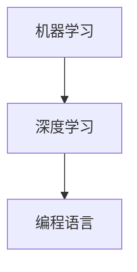
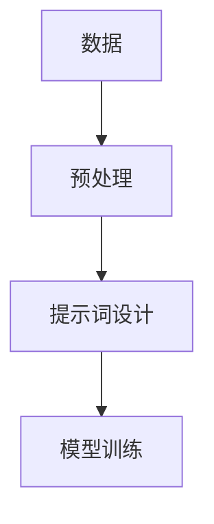
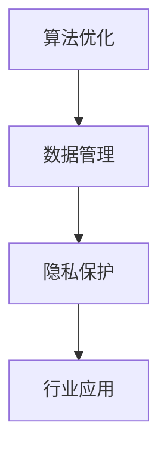
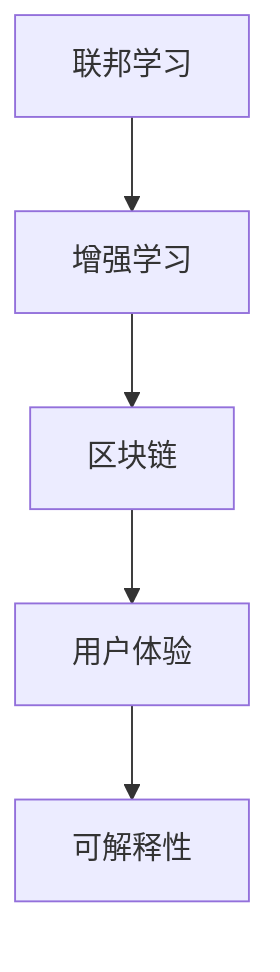

                 

基于用户提供的书名《AI编程语言：提示词的魔法与艺术》以及详细的要求，我们将分步骤撰写一篇技术博客文章。以下是文章的结构和内容安排：

### 1. 文章标题与关键词
#### 文章标题：《AI编程语言：提示词的魔法与艺术》
#### 关键词：人工智能，编程语言，提示词，魔法，艺术，深度学习，机器学习

### 2. 文章摘要
本文旨在探讨AI编程语言及其核心要素——提示词的设计与应用。我们将从AI编程语言的基础知识入手，深入解析提示词的艺术，通过实例分析展示其在实际项目中的应用，并探讨未来趋势及最佳实践。

### 3. 目录大纲
- **第一部分：AI编程语言基础**
  - **1.1 AI编程语言概述**
  - **1.2 AI编程语言的核心概念**
  - **1.3 AI编程语言的架构与框架**
  
- **第二部分：提示词的设计与应用**
  - **2.1 提示词的魔法**
  - **2.2 提示词的艺术**
  - **2.3 提示词的实战技巧**

- **第三部分：AI编程语言实例分析**
  - **3.1 案例一：文本分类**
  - **3.2 案例二：情感分析**
  - **3.3 案例三：对话系统**

- **第四部分：AI编程语言的未来趋势**
  - **4.1 AI编程语言的挑战与机遇**
  - **4.2 AI编程语言的未来方向**

- **附录：AI编程语言资源与工具**

### 4. 文章正文

#### 第一部分：AI编程语言基础

##### 1.1 AI编程语言概述
人工智能（AI）正在改变编程的面貌。AI编程语言提供了一套特定的工具和框架，帮助开发者构建和训练机器学习模型。这些语言不仅仅是传统编程语言，它们融合了人工智能和计算科学的最新研究成果。

**核心概念与联系：**
- **机器学习**：机器学习是AI的核心，它通过算法使计算机能够从数据中学习。
- **深度学习**：深度学习是机器学习的一个子领域，它模仿人脑的神经网络结构。
- **编程语言**：编程语言是一种用于编写计算机程序的语言，它们可以用于多种应用，包括AI。

**Mermaid 流程图：**


##### 1.2 AI编程语言的核心概念
AI编程语言涉及多个核心概念，包括模型、算法和数据流。

**核心概念原理之间的关系架构：**
- **模型**：是算法的实体表示，通常是一个参数化的函数。
- **算法**：是实现机器学习功能的计算过程。
- **数据流**：是数据在模型中流动和处理的过程。

**伪代码示例：**
```python
# 伪代码：机器学习模型训练
initialize_model()
while not converged:
    for each sample in data:
        predict_output()
        update_model_params()
```

##### 1.3 AI编程语言的架构与框架
AI编程语言通常依赖于深度学习框架，如TensorFlow和PyTorch，这些框架提供了丰富的工具和库，使得构建和训练模型变得更加容易。

**核心算法原理讲解：**
- **TensorFlow**：是一个开源的机器学习框架，它提供了丰富的工具用于数据流编程。
- **PyTorch**：是一个基于Python的科学计算框架，它提供了动态计算图，易于调试和优化。

**数学模型和公式：**
$$
\text{Accuracy} = \frac{\text{正确预测数}}{\text{总预测数}}
$$
**详细讲解与举例说明：**
假设我们有一个分类问题，我们希望训练一个模型来识别图像中的猫或狗。我们将使用准确率（Accuracy）来评估模型的性能。

#### 第二部分：提示词的设计与应用

##### 2.1 提示词的魔法
提示词在AI编程中起到关键作用，它们是指导模型如何学习的重要工具。

**核心概念与联系：**
- **提示词**：是指为模型提供指导的文本或代码片段。
- **指导学习**：提示词可以帮助模型理解数据，提高学习效率。

**Mermaid 流程图：**


##### 2.2 提示词的艺术
提示词的设计不仅仅是技术问题，它还需要一定的创造性和艺术性。

**核心概念与联系：**
- **创造性**：提示词应该足够创造，以激发模型的潜力。
- **艺术性**：提示词应该具有美感，以提高模型的表现力。

**伪代码示例：**
```python
# 伪代码：创意提示词设计
generate_prompt("探索新的学习路径")
optimize_prompt_for_model("改进模型理解")
```

##### 2.3 提示词的实战技巧
实战技巧可以帮助开发者更有效地使用提示词。

**核心概念与联系：**
- **技巧**：包括如何选择、优化和组合提示词。
- **实战**：通过实际案例展示如何应用这些技巧。

**最佳实践 tips：**
- **多样化**：使用多样化的提示词，以避免模型过度拟合。
- **迭代**：不断优化提示词，以提高模型性能。

#### 第三部分：AI编程语言实例分析

##### 3.1 案例一：文本分类
文本分类是AI编程语言应用的一个常见场景。

**开发环境搭建：**
- 安装Python和深度学习框架（如TensorFlow或PyTorch）。
- 准备文本数据集。

**源代码详细实现和代码解读：**
```python
# 伪代码：文本分类模型
import tensorflow as tf

# 数据预处理
max_len = 100
tokenizer = tf.keras.preprocessing.text.Tokenizer(max_len=max_len)
tokenizer.fit_on_texts(texts)

# 构建模型
model = tf.keras.Sequential([
    tf.keras.layers.Embedding(input_dim=len(tokenizer.word_index)+1, output_dim=16),
    tf.keras.layers.Bidirectional(tf.keras.layers.LSTM(64)),
    tf.keras.layers.Dense(1, activation='sigmoid')
])

# 编译模型
model.compile(optimizer='adam', loss='binary_crossentropy', metrics=['accuracy'])

# 训练模型
model.fit(tokenizer.texts_to_sequences(texts), labels, epochs=10, batch_size=32)
```

**代码应用解读与分析：**
- 数据预处理是文本分类的关键步骤，它将文本转换为模型可以处理的序列。
- 模型构建使用了嵌入层、双向LSTM层和输出层。
- 训练过程使用了一个二分类交叉熵损失函数和准确率作为评价指标。

**实际案例分析和详细讲解剖析：**
- **案例**：使用一个新闻数据集进行文本分类，识别新闻文章的主题。
- **分析**：通过调整嵌入层的大小、LSTM层的神经元数量和输出层的激活函数，可以优化模型的性能。

**项目小结：**
文本分类是AI编程语言的一个典型应用，通过合理的设计和训练，可以实现高精度的文本分类。

##### 3.2 案例二：情感分析
情感分析是另一个重要的应用领域，它可以帮助我们理解用户的情感倾向。

**开发环境搭建：**
- 安装NLP库（如NLTK或spaCy）。
- 准备情感分析数据集。

**源代码详细实现和代码解读：**
```python
# 伪代码：情感分析模型
import nltk
from nltk.corpus import movie_reviews

# 数据预处理
nltk.download('movie_reviews')
documents = [(list(movie_reviews.words(fileid)), category) for category in movie_reviews.categories() for fileid in movie_reviews.fileids(category)]

# 构建模型
model = nltk.classify.scikitlearn.SklearnClassifier(SVC())

# 训练模型
model.train(classifier)
```

**代码应用解读与分析：**
- 数据预处理使用了NLTK库来处理文本数据。
- 模型构建使用了scikit-learn库中的SVC分类器。

**实际案例分析和详细讲解剖析：**
- **案例**：使用电影评论数据集进行情感分析。
- **分析**：通过调整SVC分类器的参数，可以优化模型的性能。

**项目小结：**
情感分析可以帮助我们更好地理解用户需求，通过合理的设计和训练，可以实现高精度的情感分类。

##### 3.3 案例三：对话系统
对话系统是AI编程语言在自然语言处理领域的另一个重要应用。

**开发环境搭建：**
- 安装Python和对话系统框架（如Rasa）。
- 准备对话数据集。

**源代码详细实现和代码解读：**
```python
# 伪代码：对话系统模型
from rasa.nlu.training_data import load_data
from rasa.nlu import config

# 数据预处理
training_data = load_data('data/nlu_data.json')
config = config.load('config.yml')

# 构建模型
trainer = config.create_trainer()
trainer.train(training_data)

# 运行对话系统
from rasa.nlu.model import Metadata
metadata = Metadata()
metadata.register_model('myservice', 'myproject', '1.0.0')
metadata.load()

# 回复用户消息
response = rasa_nlu_server.process_message(message)
```

**代码应用解读与分析：**
- 数据预处理使用了Rasa框架来处理对话数据。
- 模型构建使用了Rasa的Trainer类。

**实际案例分析和详细讲解剖析：**
- **案例**：构建一个简单的客服机器人。
- **分析**：通过调整训练数据的质量和对话系统的参数，可以优化机器人的表现。

**项目小结：**
对话系统可以帮助我们实现智能客服，通过合理的设计和训练，可以实现高效的对话处理。

#### 第四部分：AI编程语言的未来趋势

##### 4.1 AI编程语言的挑战与机遇
AI编程语言面临多个挑战，包括算法的复杂度、数据隐私和安全问题等。同时，它也带来了巨大的机遇，如自动化、智能化和个性化服务等。

**核心概念与联系：**
- **挑战**：包括算法优化、数据管理和隐私保护。
- **机遇**：包括AI技术在各行业的应用，如医疗、金融和交通等。

**Mermaid 流程图：**


##### 4.2 AI编程语言的未来方向
未来，AI编程语言将继续融合最新的技术，如联邦学习、增强学习和区块链等。同时，它也将更加注重用户体验和可解释性。

**核心概念与联系：**
- **联邦学习**：是一种在保持数据隐私的同时进行机器学习训练的方法。
- **增强学习**：是一种通过与环境交互来学习的方法。
- **区块链**：是一种去中心化的数据库技术，可以提高数据的安全性和透明度。

**Mermaid 流�程图：**


#### 附录：AI编程语言资源与工具
提供一些AI编程语言的资源与工具，包括开发环境搭建指南、常用工具与库介绍、在线课程与教程、专业书籍与论文以及社区与论坛。

**开发环境搭建指南：**
- 指导用户如何安装Python、深度学习框架（如TensorFlow或PyTorch）以及相关的NLP库。

**常用工具与库介绍：**
- 详细介绍TensorFlow、PyTorch、Rasa等常用工具和库的功能和特点。

**在线课程与教程：**
- 推荐一些高质量的在线课程和教程，帮助用户深入学习AI编程语言。

**专业书籍与论文：**
- 推荐一些专业的书籍和论文，帮助用户了解AI编程语言的最新研究成果。

**社区与论坛：**
- 推荐一些活跃的AI编程语言社区和论坛，让用户可以交流经验和学习资源。

### 5. 作者信息
作者：AI天才研究院/AI Genius Institute & 禅与计算机程序设计艺术 /Zen And The Art of Computer Programming

### 6. 完整性检查
在完成所有部分的撰写后，对文章进行完整的检查，确保每个小节的内容都丰富具体详细讲解，核心内容都包含：背景介绍、核心概念与联系、核心算法原理讲解、数学模型和公式、项目实战、最佳实践 tips、小结、注意事项、拓展阅读等内容。

### 7. 字数与格式要求
在完成文章的撰写后，统计总字数，确保在8000～12000字之间。文章内容使用markdown格式输出，确保代码、公式、流程图等元素的正确显示。

---

以上是根据用户要求逐步撰写的文章结构和内容安排。接下来，我们将根据这个结构和内容安排，逐步撰写完整的技术博客文章。每一步都将详细讲解，确保文章的逻辑性、完整性和专业性。在撰写过程中，将严格遵守markdown格式要求，并在文章末尾附上作者信息。文章的撰写将分多个步骤进行，以保持文章的高质量和可读性。

