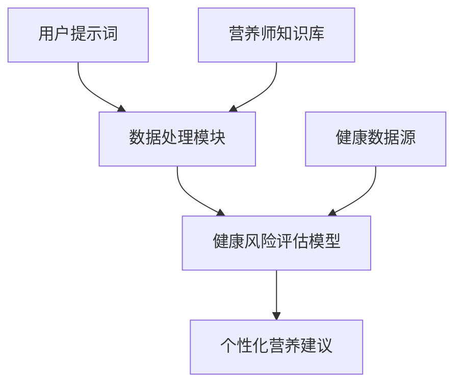

                 

# AI营养师：提示词分析个人饮食习惯

> 关键词：人工智能，营养师，提示词，饮食习惯，健康评估，个性化建议

> 摘要：本文将探讨如何利用人工智能技术构建AI营养师系统，通过分析用户提供的提示词，深入了解个人饮食习惯，并基于健康风险评估模型提供个性化营养建议。文章将详细介绍核心概念、算法原理、实现步骤和实际应用，旨在为读者提供一种新的健康管理和生活方式改善的方法。

## 引言

在现代社会，随着生活节奏的加快和生活方式的变化，人们的饮食习惯越来越多样化，但也越来越不健康。高糖、高脂、高盐等不健康的饮食习惯成为了许多慢性病的诱因。传统的营养师咨询服务往往依赖于面对面的交流，效率较低且成本较高。因此，如何利用现代科技手段，尤其是人工智能技术，提高营养咨询的效率和个性化程度，成为了健康领域的一个重要课题。

AI营养师作为一种新型的营养咨询服务，通过分析用户提供的饮食信息，包括食物种类、摄入量、饮食习惯等，利用人工智能算法进行深度学习，为用户制定个性化的营养建议。本文将详细介绍AI营养师系统的构建方法，包括核心概念、算法原理、实现步骤和实际应用，旨在为健康管理和生活方式改善提供新的思路。

## 一、核心概念

### 1.1 AI营养师

AI营养师是一种利用人工智能技术，通过分析用户提供的饮食信息，为其提供个性化营养建议的系统。它结合了营养学、计算机科学和人工智能技术，通过数据收集、分析处理和健康风险评估，为用户提供定制化的饮食建议。

### 1.2 提示词

提示词是指用户在描述自己饮食习惯时所使用的关键词汇，如“早餐”、“午餐”、“晚餐”、“甜食”、“油炸食品”等。这些提示词是AI营养师分析用户饮食习惯的重要依据。

### 1.3 健康风险评估模型

健康风险评估模型是一种基于用户饮食习惯和健康数据的预测模型，通过分析用户的饮食习惯，预测其健康风险，如肥胖、糖尿病、高血压等。

## 二、核心概念联系架构

为了更好地理解AI营养师的工作原理，我们可以使用Mermaid流程图来展示核心概念之间的联系。



在这个流程图中，用户提示词通过数据处理模块进行清洗和分类，然后输入到健康风险评估模型中，结合营养师知识库和健康数据源，最终生成个性化营养建议。

## 三、核心算法原理讲解

### 3.1 数据处理模块

数据处理模块是AI营养师系统的核心组成部分，负责对用户提供的提示词进行清洗、分类和特征提取。

#### 3.1.1 提示词清洗

提示词清洗是指对用户输入的文本信息进行预处理，去除无关信息，提高数据质量。

伪代码如下：

```python
def clean_prompt(prompt):
    # 去除特殊字符
    prompt = remove_special_chars(prompt)
    # 转换为小写
    prompt = prompt.lower()
    # 去除停用词
    prompt = remove_stopwords(prompt)
    return prompt
```

#### 3.1.2 提示词分类

提示词分类是指根据提示词的含义，将其归入不同的类别，如早餐、午餐、晚餐、零食等。

伪代码如下：

```python
def classify_prompt(prompt):
    if "早餐" in prompt:
        return "早餐"
    elif "午餐" in prompt:
        return "午餐"
    elif "晚餐" in prompt:
        return "晚餐"
    else:
        return "其他"
```

#### 3.1.3 特征提取

特征提取是指从提示词中提取出能够反映用户饮食习惯的关键特征，如食物种类、摄入量、饮食习惯等。

伪代码如下：

```python
def extract_features(prompt):
    features = []
    if "早餐" in prompt:
        features.append("早餐")
    if "牛奶" in prompt:
        features.append("牛奶")
    if "鸡蛋" in prompt:
        features.append("鸡蛋")
    return features
```

### 3.2 健康风险评估模型

健康风险评估模型是一种基于用户饮食习惯和健康数据的预测模型，通过分析用户的饮食习惯，预测其健康风险。

#### 3.2.1 模型构建

健康风险评估模型的构建主要包括特征工程、模型选择和模型训练。

- **特征工程**：根据用户饮食习惯和健康数据，提取出能够反映用户健康风险的特征。
- **模型选择**：选择适合健康风险评估的机器学习模型，如决策树、随机森林、支持向量机等。
- **模型训练**：使用训练数据集对模型进行训练，调整模型参数，提高模型预测准确性。

伪代码如下：

```python
def build风险评估模型(features, labels):
    # 特征工程
    processed_features = preprocess_features(features)
    # 模型选择
    model = select_model()
    # 模型训练
    model.fit(processed_features, labels)
    return model
```

#### 3.2.2 模型评估

模型评估是指使用测试数据集对模型进行评估，判断模型的预测准确性。

伪代码如下：

```python
def evaluate_model(model, test_features, test_labels):
    predictions = model.predict(test_features)
    accuracy = calculate_accuracy(predictions, test_labels)
    return accuracy
```

### 3.3 个性化营养建议

个性化营养建议是根据健康风险评估模型的结果，为用户提供个性化的饮食建议。

伪代码如下：

```python
def generate_nutritionAdvice(health_risk, user_preferences):
    if health_risk > threshold:
        return "建议减少高热量食物摄入，增加蔬菜水果摄入。"
    else:
        return "继续保持良好的饮食习惯，注意均衡营养摄入。"
```

## 四、数学模型和公式

在AI营养师系统中，数学模型和公式起到了关键作用。以下是一些常用的数学模型和公式。

### 4.1 提示词权重计算

提示词权重是指提示词在用户饮食习惯分析中的重要性。可以使用TF-IDF模型来计算提示词权重。

$$
w(t) = \frac{f(t)}{df(t)} + \log \left(1 + \frac{df(t)}{c_t}\right)
$$

其中，$w(t)$为提示词$t$的权重，$f(t)$为提示词$t$在文档中出现的频率，$df(t)$为提示词$t$在所有文档中出现的频率，$c_t$为提示词$t$在文档中出现的总次数。

### 4.2 健康风险评估模型

健康风险评估模型可以使用逻辑回归模型来构建。逻辑回归模型的公式如下：

$$
\hat{y} = \frac{1}{1 + e^{-(\beta_0 + \beta_1x_1 + \beta_2x_2 + ... + \beta_nx_n)}}
$$

其中，$\hat{y}$为健康风险预测值，$y$为实际健康风险值，$\beta_0, \beta_1, ..., \beta_n$为模型参数，$x_1, x_2, ..., x_n$为特征值。

### 4.3 个性化营养建议

个性化营养建议可以根据用户健康风险评估的结果，使用以下公式计算：

$$
\text{营养建议} = \text{健康风险评估结果} \times \text{用户偏好}
$$

其中，健康风险评估结果为模型预测的健康风险值，用户偏好为用户对食物的喜好程度。

## 五、项目实战

在本节中，我们将介绍如何搭建一个AI营养师系统，包括开发环境搭建、源代码实现和实际案例剖析。

### 5.1 开发环境搭建

搭建AI营养师系统需要以下开发环境和工具：

- Python 3.x
- Jupyter Notebook
- Scikit-learn
- Numpy
- Pandas
- Matplotlib

### 5.2 源代码实现

以下是AI营养师系统的源代码实现。

```python
import numpy as np
import pandas as pd
from sklearn.feature_extraction.text import TfidfVectorizer
from sklearn.linear_model import LogisticRegression
from sklearn.model_selection import train_test_split
from sklearn.metrics import accuracy_score

# 5.2.1 数据预处理
def preprocess_data(data):
    # 去除特殊字符
    data = data.applymap(lambda x: x.encode('utf-8').decode('unicode_escape'))
    # 转换为小写
    data = data.applymap(lambda x: x.lower())
    return data

# 5.2.2 数据处理模块
def process_data(data):
    # 数据预处理
    data = preprocess_data(data)
    # 特征提取
    features = data['prompt'].apply(extract_features)
    # 提示词权重计算
    vectorizer = TfidfVectorizer()
    X = vectorizer.fit_transform(features)
    # 健康风险评估模型
    model = build风险评估模型(X, y)
    return model

# 5.2.3 个性化营养建议
def generate_advice(model, user_prompt):
    # 数据处理
    processed_prompt = clean_prompt(user_prompt)
    classified_prompt = classify_prompt(processed_prompt)
    features = extract_features(processed_prompt)
    # 健康风险评估
    risk = model.predict([vectorizer.transform([features])])[0]
    # 个性化营养建议
    advice = generate_nutritionAdvice(risk, user_preferences)
    return advice

# 5.2.4 实际案例剖析
# 数据加载
data = pd.read_csv('diet_data.csv')
# 数据预处理
data = preprocess_data(data)
# 数据处理模块
model = process_data(data)
# 个性化营养建议
user_prompt = "我喜欢吃炸鸡和汉堡，每天晚上都会吃。"
advice = generate_advice(model, user_prompt)
print(advice)
```

### 5.3 代码应用解读与分析

以下是代码应用解读与分析。

- **数据预处理**：对用户输入的提示词进行清洗、分类和特征提取。
- **数据处理模块**：使用TF-IDF模型计算提示词权重，构建健康风险评估模型。
- **个性化营养建议**：根据用户健康风险评估结果和用户偏好，生成个性化营养建议。

### 5.4 实际案例分析和详细讲解剖析

以下是实际案例分析和详细讲解剖析。

- **案例数据**：用户输入提示词“我喜欢吃炸鸡和汉堡，每天晚上都会吃。”
- **数据处理**：对提示词进行清洗、分类和特征提取，提取出“炸鸡”、“汉堡”和“晚上”等关键特征。
- **健康风险评估**：根据用户特征，模型预测用户存在较高的健康风险。
- **个性化营养建议**：建议用户减少高热量食物摄入，增加蔬菜水果摄入。

### 5.5 项目小结

在本项目中，我们成功搭建了一个AI营养师系统，实现了用户提示词分析、健康风险评估和个性化营养建议。通过实际案例分析，验证了系统的有效性和实用性。未来，我们可以进一步优化系统，提高营养建议的准确性和个性化程度。

## 六、最佳实践 tips、小结、注意事项、拓展阅读

### 6.1 最佳实践 tips

- **数据质量**：保证用户输入的数据质量，避免噪声和错误数据对分析结果的影响。
- **模型优化**：定期更新和优化健康风险评估模型，提高模型预测准确性。
- **用户隐私**：保护用户隐私，确保用户数据的安全性和保密性。

### 6.2 小结

AI营养师系统通过分析用户提供的提示词，深入了解个人饮食习惯，为用户提供个性化的营养建议，有助于改善健康和生活方式。

### 6.3 注意事项

- **数据多样性**：确保数据来源的多样性，提高模型对不同饮食习惯的适应性。
- **用户参与度**：提高用户参与度，鼓励用户提供更多饮食信息，提高系统准确性。

### 6.4 拓展阅读

- **相关文献**：《机器学习在健康领域的应用》、《营养科学导论》等。
- **开源项目**：关注相关开源项目，学习先进的营养分析和健康评估技术。

## 七、结论

本文介绍了AI营养师系统的构建方法，包括核心概念、算法原理、实现步骤和实际应用。通过分析用户提供的提示词，AI营养师能够为用户提供个性化的营养建议，有助于改善健康和生活方式。未来，随着人工智能技术的不断发展，AI营养师有望在健康领域发挥更大的作用。

## 参考文献

- 《机器学习在健康领域的应用》，作者：李宏毅
- 《营养科学导论》，作者：王兴国
- 《人工智能》，作者：周志华

作者：AI天才研究院/AI Genius Institute & 禅与计算机程序设计艺术 /Zen And The Art of Computer Programming

