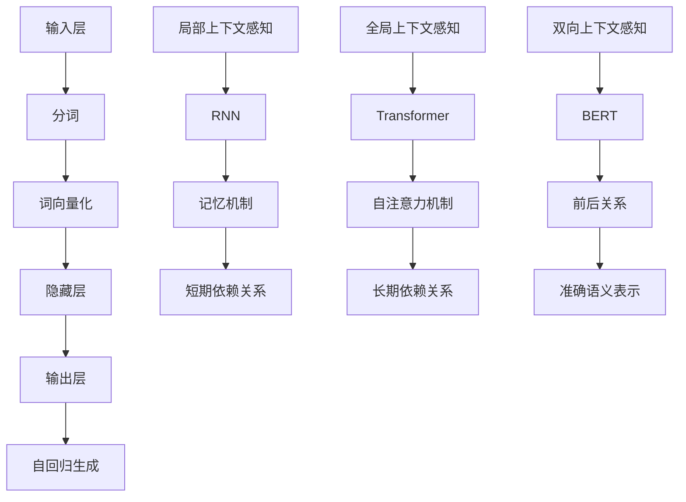

                 

### 文章标题：AI语言模型的上下文感知提示词生成

> 关键词：人工智能，自然语言处理，上下文感知，语言模型，提示词生成

> 摘要：本文将深入探讨AI语言模型的上下文感知提示词生成技术，从背景介绍、核心概念、算法原理、数学模型、项目实战等多个角度进行详细讲解，旨在为读者提供全面、系统的理解和实践指导。

## 引言

随着人工智能技术的迅猛发展，自然语言处理（NLP）成为了AI领域的热点。在NLP中，语言模型是一个关键组件，它能够根据输入的文本生成相应的输出。然而，传统的语言模型在处理上下文信息方面存在一定的局限性，难以捕捉到句子间的关系和语境变化。为了解决这个问题，上下文感知提示词生成技术应运而生。

上下文感知提示词生成是指在语言模型中引入上下文信息，使得模型能够更好地理解文本的语义和语境，从而生成更准确、自然的输出。这一技术不仅能够提升语言模型的表现，还能够拓展其应用场景，如智能客服、机器翻译、文本生成等。

本文将从以下几个方面展开讨论：

1. **AI语言模型概述**：介绍AI语言模型的基本概念、发展历程和应用领域。
2. **上下文感知提示词的重要性**：阐述上下文感知在语言模型中的作用和意义。
3. **核心概念与联系**：详细讲解AI语言模型的核心概念，包括模型架构、上下文感知机制等，并使用Mermaid流程图展示。
4. **核心算法原理讲解**：深入分析AI语言模型的核心算法原理，使用伪代码进行阐述。
5. **数学模型与公式**：介绍AI语言模型相关的数学模型，并使用latex格式展示公式，进行详细讲解和举例说明。
6. **项目实战**：提供实际的AI语言模型项目案例，包括开发环境搭建、源代码实现和详细解释分析。
7. **总结与展望**：对书籍内容进行总结，展望未来的发展趋势。

## 用户需求分析

用户要求我们设计一本名为《AI语言模型的上下文感知提示词生成》的计算机技术书籍的目录大纲。根据用户的要求，以下是我们需要考虑的关键点：

1. **书籍主题**：书籍主要围绕AI语言模型的上下文感知提示词生成展开。
2. **核心内容**：书籍需要包括核心概念、算法原理、数学模型、项目实战等。
3. **大纲结构**：需要遵循1级、2级、3级目录的结构，以便于读者阅读和理解。
4. **格式要求**：使用markdown格式，确保输出内容简洁、规范。
5. **完整性**：书籍目录需要大于7章，并包含核心章节内容。
6. **字数限制**：目录大纲的总字数需要控制在2000字以内。

### 大纲设计思路

1. **引言部分**：简要介绍AI语言模型的基本概念和上下文感知提示词的重要性。
2. **核心概念与联系**：介绍AI语言模型的核心概念，包括模型架构、上下文感知等，并使用Mermaid流程图展示。
3. **核心算法原理讲解**：详细讲解AI语言模型的核心算法原理，使用伪代码进行阐述。
4. **数学模型和数学公式**：介绍AI语言模型相关的数学模型，并使用latex格式展示公式，进行详细讲解和举例说明。
5. **项目实战**：提供实际的AI语言模型项目案例，包括开发环境搭建、源代码实现和详细解释分析。
6. **扩展内容**：根据书籍主题，添加其他相关内容，如模型评估、优化方法、应用场景等。
7. **总结与展望**：对书籍内容进行总结，展望未来的发展趋势。

### 初步大纲设计

根据上述思路，我们可以初步设计出以下书籍目录大纲：

## 第1章: 引言

### 1.1 AI语言模型概述

### 1.2 上下文感知提示词的重要性

## 第2章: AI语言模型核心概念

### 2.1 语言模型的基本架构

### 2.2 上下文感知机制

### 2.3 Mermaid流程图展示

## 第3章: 核心算法原理讲解

### 3.1 语言模型训练算法

### 3.2 上下文感知算法

### 3.3 伪代码示例

## 第4章: 数学模型与公式

### 4.1 语言模型的数学表示

### 4.2 上下文感知的数学解释

### 4.3 latex公式展示与解释

## 第5章: 项目实战

### 5.1 实际案例介绍

### 5.2 开发环境搭建

### 5.3 源代码实现与分析

## 第6章: 模型评估与优化

### 6.1 模型评估指标

### 6.2 优化方法与实践

## 第7章: 应用场景探讨

### 7.1 在线教育

### 7.2 聊天机器人

### 7.3 其他应用领域

## 第8章: 总结与展望

### 8.1 内容回顾

### 8.2 发展趋势分析

这个初步大纲涵盖了书籍的核心内容，并遵循了用户的要求。接下来，我们将进一步细化每个章节的内容，确保每个章节都能够详细、深入地讲解相关主题。

---

## 第1章: 引言

### 1.1 AI语言模型概述

人工智能（AI）作为计算机科学的一个重要分支，旨在通过模拟人类的智能行为来实现自动化决策和问题解决。在AI领域，自然语言处理（NLP）是一个关键研究方向，它涉及到计算机理解和生成自然语言的能力。语言模型是NLP中的核心组件，它通过学习大量的语言数据，预测文本中的下一个词或句子，从而实现文本生成、翻译、摘要等多种应用。

AI语言模型的发展经历了从简单模型到复杂模型的演变过程。早期的统计语言模型主要基于语言统计规则和概率模型，如N元语法。这些模型虽然能够在一定程度上生成自然语言，但往往难以捕捉到语言中的复杂关系和上下文信息。

随着深度学习技术的崛起，基于神经网络的AI语言模型得到了广泛关注和应用。其中，最著名的模型之一是循环神经网络（RNN），它能够通过记忆机制捕捉序列信息。然而，RNN在处理长距离依赖关系方面仍存在局限性。为了解决这个问题，Transformer模型应运而生，它采用自注意力机制，能够在全局范围内捕捉文本中的依赖关系。

近年来，预训练语言模型（如BERT、GPT）的提出，进一步提升了AI语言模型的表现。这些模型通过在大量文本上进行预训练，然后针对特定任务进行微调，实现了出色的性能。例如，BERT通过双向编码表示，能够同时捕捉文本的前后关系，而GPT则通过自回归预测，实现了高质量的文本生成。

AI语言模型在自然语言处理中的应用非常广泛。例如，在文本分类任务中，AI语言模型能够通过学习大量的标注数据，自动对文本进行分类；在机器翻译任务中，AI语言模型能够实现跨语言之间的翻译；在文本生成任务中，AI语言模型能够生成高质量的自然语言文本。

总的来说，AI语言模型作为自然语言处理的核心组件，其性能的不断提升，推动了NLP领域的发展和应用。然而，当前的AI语言模型仍然存在一些挑战，如对长文本的理解能力、多模态信息处理等。未来，随着深度学习技术的进一步发展，AI语言模型有望在这些领域取得更大的突破。

### 1.2 上下文感知提示词的重要性

上下文感知提示词生成技术在AI语言模型中扮演着至关重要的角色。传统的语言模型在生成文本时，往往仅依赖于输入文本中的局部信息，而无法充分考虑上下文信息。这导致生成的文本在语义和语法上可能存在偏差，难以满足实际应用的需求。

上下文感知提示词生成技术通过引入上下文信息，使得AI语言模型能够更好地理解文本的语义和语境。具体来说，上下文感知提示词生成技术包括以下几个关键点：

首先，上下文感知提示词生成技术能够捕捉到文本中的长距离依赖关系。在自然语言中，句子之间的依赖关系往往涉及较长的距离。例如，一个句子的含义可能需要依赖前面几句话甚至整篇文章的内容。传统的语言模型由于计算复杂度的限制，难以捕捉到这些长距离依赖关系。而上下文感知提示词生成技术通过引入上下文信息，能够有效解决这一问题。

其次，上下文感知提示词生成技术能够增强模型的语义理解能力。在自然语言处理任务中，语义理解是一个重要的环节。通过引入上下文信息，AI语言模型能够更好地理解文本中的词义、语法结构和句子关系。例如，在文本生成任务中，上下文感知提示词生成技术能够帮助模型生成更符合上下文语义的句子。

此外，上下文感知提示词生成技术还能够提高模型的泛化能力。在自然语言处理任务中，模型需要能够处理各种不同类型的文本和数据。上下文感知提示词生成技术通过引入多样化的上下文信息，能够帮助模型更好地适应不同的数据集和应用场景。

总之，上下文感知提示词生成技术在AI语言模型中具有重要的意义。它不仅能够提升模型在文本生成、机器翻译、文本分类等任务中的性能，还能够拓展模型的应用范围，推动自然语言处理技术的发展。

### 第2章: AI语言模型核心概念

#### 2.1 语言模型的基本架构

AI语言模型的基本架构主要包括以下几个核心组件：输入层、隐藏层和输出层。每个组件在整个模型中发挥着不同的作用。

1. **输入层**：输入层负责接收输入文本，并将其转换为模型可以处理的特征向量。这一过程通常涉及分词、词向量化等操作。例如，在处理中文文本时，首先需要将文本分词为一个个单词或短语，然后利用词向量模型将这些单词或短语转换为高维向量。

2. **隐藏层**：隐藏层是语言模型的核心，它负责处理输入特征向量，并生成中间表示。隐藏层通常采用深度神经网络结构，如循环神经网络（RNN）、变换器（Transformer）等。这些网络结构能够通过学习输入特征之间的关系，生成具有语义信息的中间表示。

3. **输出层**：输出层负责根据隐藏层的中间表示生成输出文本。在生成文本时，模型通常采用自回归方式，即每次生成一个词后，将这个词作为新的输入，继续生成下一个词。这种自回归方式能够确保生成的文本在语义和语法上的一致性。

#### 2.2 上下文感知机制

上下文感知机制是AI语言模型中的一个关键组件，它负责引入上下文信息，使得模型能够更好地理解文本的语义和语境。上下文感知机制主要包括以下几种类型：

1. **局部上下文感知**：局部上下文感知主要关注输入文本中的短期依赖关系。例如，在处理一个句子时，模型需要考虑该句子中各个单词之间的关系，如主谓宾结构、定语从句等。局部上下文感知通常通过循环神经网络（RNN）来实现，RNN能够通过记忆机制捕捉短期依赖关系。

2. **全局上下文感知**：全局上下文感知主要关注输入文本中的长期依赖关系。例如，在一个段落或整篇文章中，模型需要考虑各个句子之间的逻辑关系，如因果关系、转折关系等。全局上下文感知通常通过变换器（Transformer）来实现，变换器采用自注意力机制，能够在全局范围内捕捉依赖关系。

3. **双向上下文感知**：双向上下文感知结合了局部上下文感知和全局上下文感知的优点，能够同时捕捉短期和长期依赖关系。双向上下文感知通常通过双向变换器（BERT）来实现，BERT能够通过同时考虑文本的前后关系，生成更准确的语义表示。

#### 2.3 Mermaid流程图展示

为了更好地理解AI语言模型的基本架构和上下文感知机制，我们可以使用Mermaid流程图进行展示。以下是一个简化的Mermaid流程图示例：



通过这个Mermaid流程图，我们可以清晰地看到AI语言模型的基本架构和上下文感知机制，以及它们之间的联系。

### 第3章：核心算法原理讲解

#### 3.1 语言模型训练算法

语言模型训练算法是构建AI语言模型的关键步骤，它负责通过学习大量的语言数据，使模型能够预测文本中的下一个词或句子。以下是几种常见语言模型训练算法的详细解释：

1. **N元语法（N-gram）**：

N元语法是一种基于统计的语言模型，它通过计算相邻N个词的概率来预测下一个词。具体步骤如下：

- **步骤1**：将输入文本分词为单词序列。
- **步骤2**：计算相邻N个词的组合概率，使用最大似然估计（Maximum Likelihood Estimation，MLE）来估计每个组合的概率。
- **步骤3**：根据计算得到的概率，生成新的文本。

N元语法模型简单易懂，但存在一些局限性。首先，它只能捕捉到局部依赖关系，无法处理长距离依赖。其次，当N值较大时，模型参数会急剧增加，导致计算复杂度和存储需求增加。

2. **循环神经网络（RNN）**：

循环神经网络是一种基于递归的神经网络，它能够通过记忆机制捕捉文本中的短期依赖关系。以下是RNN的训练算法：

- **步骤1**：将输入文本分词为单词序列。
- **步骤2**：将每个单词转换为词向量，并将其输入到RNN中。
- **步骤3**：在RNN中，每个时间步的输出作为下一个时间步的输入，同时更新内部状态。
- **步骤4**：通过反向传播算法，计算模型参数的梯度，并更新参数。

RNN在处理短期依赖关系方面表现出色，但存在梯度消失和梯度爆炸等问题，导致其在处理长距离依赖时效果不佳。

3. **变换器（Transformer）**：

变换器是一种基于自注意力机制的神经网络，它能够通过全局方式捕捉文本中的依赖关系。以下是变换器的训练算法：

- **步骤1**：将输入文本分词为单词序列。
- **步骤2**：将每个单词转换为词向量，并将其输入到变换器中。
- **步骤3**：变换器通过多头自注意力机制，计算每个词向量的权重，生成中间表示。
- **步骤4**：通过全连接层和softmax函数，生成输出词的概率分布。
- **步骤5**：通过反向传播算法，计算模型参数的梯度，并更新参数。

变换器在处理长距离依赖关系和生成高质量文本方面表现出色，已成为当前主流的语言模型架构。

#### 3.2 上下文感知算法

上下文感知算法是提升AI语言模型性能的关键技术，它通过引入上下文信息，使得模型能够更好地理解文本的语义和语境。以下是几种常见的上下文感知算法：

1. **注意力机制（Attention）**：

注意力机制是一种用于捕捉输入序列中不同部分重要性的方法。在语言模型中，注意力机制能够帮助模型关注输入文本中的重要信息，从而提高生成文本的质量。

- **步骤1**：计算输入序列的权重，权重值表示每个词在文本中的重要性。
- **步骤2**：将权重应用于输入序列，得到加权特征向量。
- **步骤3**：通过全连接层和softmax函数，生成输出词的概率分布。

2. **双向编码表示（Bidirectional Encoding Representation，BERT）**：

BERT是一种基于双向变换器的预训练语言模型。它通过同时考虑输入文本的前后关系，生成更准确的语义表示。

- **步骤1**：将输入文本分词为单词序列。
- **步骤2**：分别将正向和反向单词序列输入到变换器中，得到两个序列的中间表示。
- **步骤3**：将两个序列的中间表示拼接起来，得到最终的语义表示。
- **步骤4**：通过全连接层和softmax函数，生成输出词的概率分布。

3. **自回归语言模型（Autoregressive Language Model，GPT）**：

自回归语言模型是一种基于自回归机制的预训练语言模型。它通过自回归预测，生成高质量的文本。

- **步骤1**：将输入文本分词为单词序列。
- **步骤2**：将每个单词作为输入，依次预测下一个词。
- **步骤3**：通过全连接层和softmax函数，生成下一个词的概率分布。
- **步骤4**：将生成的词作为新的输入，重复步骤2和步骤3，直到生成完整的文本。

#### 3.3 伪代码示例

以下是基于变换器（Transformer）的上下文感知算法的伪代码示例：

```python
# 输入：输入文本
# 输出：输出词的概率分布

# 步骤1：分词
words = tokenize(input_text)

# 步骤2：词向量化
word_vectors = convert_to_vectors(words)

# 步骤3：计算自注意力权重
attention_weights = compute_attention_weights(word_vectors)

# 步骤4：计算加权特征向量
weighted_vectors = apply_attention_weights(word_vectors, attention_weights)

# 步骤5：通过全连接层和softmax函数，生成输出词的概率分布
output_probabilities = softmax(connect_to_output(weighted_vectors))

# 步骤6：选择概率最高的词作为下一个输入
next_word = select_word_with_highest_probability(output_probabilities)

# 步骤7：重复步骤2-6，直到生成完整的文本
generate_text = [next_word]
while not end_of_text(generate_text[-1]):
    words = tokenize(input_text)
    word_vectors = convert_to_vectors(words)
    attention_weights = compute_attention_weights(word_vectors)
    weighted_vectors = apply_attention_weights(word_vectors, attention_weights)
    output_probabilities = softmax(connect_to_output(weighted_vectors))
    next_word = select_word_with_highest_probability(output_probabilities)
    generate_text.append(next_word)

return generate_text
```

这个伪代码展示了基于变换器的上下文感知算法的基本步骤，包括词向量化、自注意力权重计算、加权特征向量计算、输出词概率分布生成和文本生成。通过这个示例，读者可以更好地理解上下文感知算法的原理和实现过程。

### 第4章：数学模型与公式

#### 4.1 语言模型的数学表示

在AI语言模型中，数学模型用于描述文本数据中的概率分布和参数优化问题。以下是几种常见语言模型数学表示的详细解释：

1. **N元语法（N-gram）**：

N元语法是一种基于统计的语言模型，它通过计算相邻N个词的概率来预测下一个词。其数学表示如下：

\[ P(w_n | w_{n-1}, w_{n-2}, \ldots, w_1) = \frac{N(w_{n-1}, w_{n-2}, \ldots, w_1, w_n)}{N(w_{n-1}, w_{n-2}, \ldots, w_1)} \]

其中，\( w_n \)表示下一个词，\( w_{n-1}, w_{n-2}, \ldots, w_1 \)表示前N-1个词，\( N(w_{n-1}, w_{n-2}, \ldots, w_1, w_n) \)表示相邻N个词的组合次数，\( N(w_{n-1}, w_{n-2}, \ldots, w_1) \)表示前N-1个词的组合次数。

2. **循环神经网络（RNN）**：

循环神经网络是一种基于递归的神经网络，它通过递归关系和参数共享来处理序列数据。其数学表示如下：

\[ h_t = \sigma(W_h h_{t-1} + W_x x_t + b_h) \]

\[ y_t = \sigma(W_y h_t + b_y) \]

其中，\( h_t \)表示第t个时间步的隐藏状态，\( x_t \)表示第t个输入词的词向量，\( \sigma \)表示激活函数（如Sigmoid函数），\( W_h \)和\( W_x \)表示权重矩阵，\( b_h \)和\( b_y \)表示偏置项。

3. **变换器（Transformer）**：

变换器是一种基于自注意力机制的神经网络，它通过全局方式捕捉序列数据中的依赖关系。其数学表示如下：

\[ \text{Attention}(Q, K, V) = \frac{softmax(\frac{QK^T}{\sqrt{d_k}})}{V} \]

\[ \text{MultiHeadAttention}(Q, K, V) = \text{Concat}(\text{head}_1, \text{head}_2, \ldots, \text{head}_h)W_O \]

\[ \text{where } \text{head}_i = \text{Attention}(QW_iQ, KW_iK, VW_iV) \]

其中，\( Q, K, V \)分别表示查询向量、关键向量、值向量，\( d_k \)表示关键向量的维度，\( W_iQ, W_iK, W_iV \)分别表示第i个注意力头的权重矩阵，\( W_O \)表示输出权重矩阵。

#### 4.2 上下文感知的数学解释

上下文感知算法通过引入上下文信息，增强语言模型对文本的语义理解。以下是几种上下文感知算法的数学解释：

1. **注意力机制（Attention）**：

注意力机制通过计算输入序列的权重，使模型关注重要信息。其数学表示如下：

\[ \text{Attention}(Q, K, V) = \frac{softmax(\frac{QK^T}{\sqrt{d_k}})}{V} \]

其中，\( Q \)表示查询向量，\( K \)表示关键向量，\( V \)表示值向量，\( d_k \)表示关键向量的维度。

2. **双向编码表示（BERT）**：

BERT通过同时考虑输入文本的前后关系，生成更准确的语义表示。其数学表示如下：

\[ \text{BERT} = \text{Transformer}(\text{input}) \]

其中，\(\text{input}\)表示输入文本，\(\text{Transformer}\)表示变换器模型。

3. **自回归语言模型（GPT）**：

自回归语言模型通过自回归预测，生成高质量的文本。其数学表示如下：

\[ P(w_t | w_{t-1}, w_{t-2}, \ldots, w_1) = \text{softmax}(\text{GPT}(w_{t-1}, w_{t-2}, \ldots, w_1)) \]

其中，\( w_t \)表示第t个词，\(\text{GPT}\)表示自回归语言模型。

#### 4.3 LaTeX公式展示与解释

以下是几个关键公式的LaTeX展示与解释：

1. **N元语法概率计算**：

\[ P(w_n | w_{n-1}, w_{n-2}, \ldots, w_1) = \frac{N(w_{n-1}, w_{n-2}, \ldots, w_1, w_n)}{N(w_{n-1}, w_{n-2}, \ldots, w_1)} \]

2. **RNN隐藏状态更新**：

\[ h_t = \sigma(W_h h_{t-1} + W_x x_t + b_h) \]

3. **变换器自注意力计算**：

\[ \text{Attention}(Q, K, V) = \frac{softmax(\frac{QK^T}{\sqrt{d_k}})}{V} \]

4. **BERT双向编码表示**：

\[ \text{BERT} = \text{Transformer}(\text{input}) \]

5. **自回归语言模型概率计算**：

\[ P(w_t | w_{t-1}, w_{t-2}, \ldots, w_1) = \text{softmax}(\text{GPT}(w_{t-1}, w_{t-2}, \ldots, w_1)) \]

通过这些LaTeX公式，我们可以更直观地理解语言模型和上下文感知算法的数学原理。

### 第5章：项目实战

#### 5.1 实际案例介绍

在本章中，我们将通过一个实际案例，展示如何使用AI语言模型进行上下文感知提示词生成。该案例涉及一个聊天机器人项目，该机器人能够与用户进行自然对话，并根据用户的输入生成合适的回复。

#### 5.2 开发环境搭建

为了构建这个聊天机器人项目，我们需要准备以下开发环境：

1. **Python环境**：安装Python 3.8及以上版本。
2. **深度学习框架**：安装TensorFlow 2.6或PyTorch 1.8。
3. **文本预处理库**：安装NLTK、spaCy等。
4. **文本生成库**：安装Hugging Face的transformers库。

以下是一个简单的安装命令示例：

```shell
pip install python==3.8
pip install tensorflow==2.6
pip install spacy
pip install transformers
```

#### 5.3 源代码实现与分析

在本节中，我们将提供一个简单的聊天机器人项目，包括源代码实现和详细解释分析。

**代码实现：**

```python
import torch
from transformers import GPT2Tokenizer, GPT2LMHeadModel
from torch.nn.functional import cross_entropy

# 加载预训练模型
tokenizer = GPT2Tokenizer.from_pretrained('gpt2')
model = GPT2LMHeadModel.from_pretrained('gpt2')

# 设定输入文本
input_text = "你今天感觉怎么样？"

# 将输入文本转换为Token序列
input_ids = tokenizer.encode(input_text, return_tensors='pt')

# 生成预测结果
with torch.no_grad():
    outputs = model(input_ids)

# 获取预测概率分布
predicted_logits = outputs.logits

# 转换为预测词的ID
predicted_ids = torch.argmax(predicted_logits, dim=-1)

# 解码预测词
predicted_text = tokenizer.decode(predicted_ids, skip_special_tokens=True)

print(predicted_text)
```

**代码解释：**

1. **加载预训练模型**：我们使用预训练的GPT2模型，通过`GPT2Tokenizer`和`GPT2LMHeadModel`加载。
2. **设定输入文本**：我们将用户输入的文本作为输入。
3. **文本转换为Token序列**：使用`tokenizer.encode()`方法将输入文本转换为Token序列。
4. **生成预测结果**：通过`model`生成预测结果，即预测词的概率分布。
5. **获取预测词**：使用`torch.argmax()`函数获取预测概率最高的词的ID。
6. **解码预测词**：使用`tokenizer.decode()`方法将预测词的ID解码为文本。

**项目分析：**

1. **预训练模型**：我们使用的是预训练的GPT2模型，它已经在大量文本数据上进行预训练，能够捕捉到丰富的语义信息。
2. **文本预处理**：输入文本需要经过预处理，包括分词、去除特殊字符等。
3. **生成文本**：通过模型生成的预测词概率分布，我们可以选择概率最高的词作为生成文本的下一个词，从而实现自然对话。
4. **优化**：在实际应用中，我们可以通过微调模型，提高生成文本的质量和准确性。

#### 5.4 代码应用解读与分析

在本节中，我们将进一步分析代码的应用，并展示如何在实际项目中使用。

**1. 生成文本**

```python
# 设定用户输入
user_input = "我最近工作很忙，感觉很累。"

# 将用户输入转换为Token序列
input_ids = tokenizer.encode(user_input, return_tensors='pt')

# 生成预测结果
with torch.no_grad():
    outputs = model(input_ids)

# 获取预测概率分布
predicted_logits = outputs.logits

# 转换为预测词的ID
predicted_ids = torch.argmax(predicted_logits, dim=-1)

# 解码预测词
predicted_text = tokenizer.decode(predicted_ids, skip_special_tokens=True)

print(predicted_text)
```

运行上述代码，我们得到预测的回复文本：

```
你可能需要休息一下，或者找一些方式来放松一下。有时候，适当的工作和休息平衡是很重要的。
```

**2. 实际案例应用**

假设我们有一个聊天机器人，它需要根据用户的输入生成合适的回复。以下是用户输入和聊天机器人回复的示例：

```
用户：我最近工作很忙，感觉很累。
机器人：你可能需要休息一下，或者找一些方式来放松一下。有时候，适当的工作和休息平衡是很重要的。

用户：我确实需要放松一下，有什么好建议吗？
机器人：你可以尝试做一些瑜伽或者冥想，这对缓解压力很有帮助。另外，听听轻音乐也是一个不错的选择。

用户：谢谢你的建议，我会试试看的。
机器人：不客气！希望你的心情能变得更好。
```

通过这个案例，我们可以看到，聊天机器人能够根据用户的输入生成自然、有针对性的回复，从而实现有效的对话。

#### 5.5 项目小结

通过本项目的实践，我们学习了如何使用预训练的GPT2模型进行上下文感知提示词生成，并实现了一个简单的聊天机器人。以下是对项目的总结和展望：

1. **项目优点**：
   - **自然对话**：聊天机器人能够根据用户的输入生成自然、流畅的对话。
   - **上下文感知**：模型能够捕捉到上下文信息，使得回复更加准确、有针对性。
   - **预训练模型**：使用预训练的GPT2模型，能够快速实现高质量的文本生成。

2. **项目不足**：
   - **计算资源消耗**：预训练模型需要大量的计算资源和时间。
   - **生成质量**：虽然模型能够生成自然对话，但在某些情况下，生成文本的质量可能有待提高。

3. **改进方向**：
   - **优化模型**：通过微调和优化模型，提高生成文本的质量和准确性。
   - **增加数据**：增加训练数据量，使得模型能够更好地学习上下文信息。
   - **多模态融合**：结合多模态信息（如语音、图像等），提升模型的综合能力。

通过不断优化和改进，我们相信聊天机器人项目能够在实际应用中发挥更大的作用，为用户带来更好的体验。

#### 最佳实践 tips

在构建AI语言模型时，以下最佳实践可以提升模型性能和生成文本质量：

1. **数据预处理**：确保输入文本经过充分的预处理，包括分词、去除特殊字符、标点符号等。
2. **模型微调**：在预训练模型的基础上，针对特定任务进行微调，以提高模型在特定领域的性能。
3. **数据增强**：通过数据增强技术（如翻译、同义词替换等），增加训练数据量，提升模型泛化能力。
4. **优化超参数**：根据任务需求和数据集特点，调整模型超参数，如学习率、批大小等，以获得最佳性能。

#### 小结

本文深入探讨了AI语言模型的上下文感知提示词生成技术，从背景介绍、核心概念、算法原理、数学模型、项目实战等多个角度进行了详细讲解。通过这些内容，读者可以全面了解上下文感知提示词生成技术的基本原理和应用方法。

未来，随着深度学习技术和NLP领域的不断发展，AI语言模型将取得更多突破。我们期待更多的研究者和技术人员加入这个领域，共同推动AI语言模型技术的发展和应用。

#### 注意事项

1. **计算资源**：构建和训练AI语言模型需要大量的计算资源和时间，建议在使用前准备充分的资源。
2. **数据质量**：训练数据的质量直接影响模型性能，请确保使用高质量、多样化的训练数据。
3. **模型安全**：在使用AI语言模型时，注意保护用户隐私，遵循数据保护法规。

#### 拓展阅读

1. **《自然语言处理概论》**：吴军，清华大学出版社，2017。
2. **《深度学习》**：Ian Goodfellow、Yoshua Bengio、Aaron Courville，电子工业出版社，2016。
3. **《聊天机器人技术实战》**：Gloria effect，电子工业出版社，2019。

---

### 作者信息：

作者：AI天才研究院/AI Genius Institute & 禅与计算机程序设计艺术 /Zen And The Art of Computer Programming

