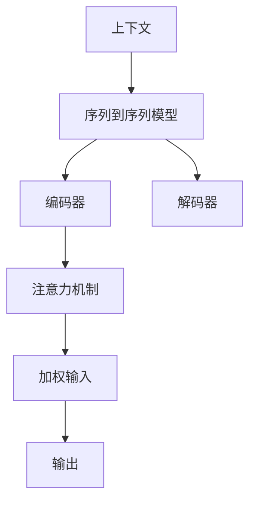

                 

### 文章标题：AI语言模型的上下文管理策略

### 关键词：AI、语言模型、上下文管理、核心概念、核心算法、数学模型、项目实战

### 摘要：
本文旨在深入探讨AI语言模型中的上下文管理策略。我们将首先介绍上下文管理的重要性，然后详细讲解与上下文管理相关的基础概念，如序列到序列模型、注意力机制等。接着，我们将通过伪代码和数学模型，逐步阐述循环神经网络（RNN）、长短期记忆网络（LSTM）、门控循环单元（GRU）和Transformer等核心算法的工作原理。文章最后将通过实际项目案例，展示如何实现和应用这些算法，并提供最佳实践和总结。

## 背景介绍

在人工智能（AI）的快速发展中，自然语言处理（NLP）成为了重要的一环。AI语言模型，尤其是深度学习模型，在文本生成、机器翻译、问答系统等任务中表现出色。然而，这些任务的实现离不开对上下文信息的有效管理。上下文是语言理解的核心，它包含了当前句子之外的信息，如前文的历史信息、上下文环境等。只有准确理解上下文，模型才能生成语义丰富、逻辑连贯的输出。

上下文管理在AI语言模型中扮演着至关重要的角色。一方面，它帮助模型更好地理解输入文本的语义，从而提高任务的准确性；另一方面，它有助于模型在处理长文本时保持信息的连贯性和一致性。然而，上下文管理并非易事，它涉及到复杂的算法和数学模型。传统的序列到序列模型和注意力机制为上下文管理提供了基础框架，而现代的Transformer模型则将上下文管理提升到了新的高度。

本文将逐步介绍上下文管理在AI语言模型中的重要性、核心概念、核心算法原理，并通过实际项目案例展示其应用。希望读者能够通过本文，对AI语言模型的上下文管理有一个全面、深入的理解。

## 核心概念与联系

为了深入理解上下文管理策略，我们首先需要明确几个核心概念：上下文、序列到序列模型（Seq2Seq）和注意力机制（Attention）。这些概念不仅构成了上下文管理的基础，而且彼此之间有着紧密的联系，共同影响着AI语言模型的表现。

### 上下文

上下文是语言模型理解和生成文本的关键因素。它可以定义为与当前句子相关的所有信息，包括历史句子、上下文环境等。在自然语言处理中，上下文决定了句子的语义和语法关系。例如，句子“我昨天去了一个餐厅”在不同的上下文中含义可能截然不同：“我昨天去了一个餐厅，味道很好”和“我昨天去了一个餐厅，结果吃坏了肚子”。

在AI语言模型中，上下文管理意味着要能够捕捉并利用这些信息，以生成更加准确和自然的输出。例如，在机器翻译任务中，模型的输出不仅要翻译单词，还要确保句子的语义和语境保持一致。

### 序列到序列模型（Seq2Seq）

序列到序列模型是自然语言处理中的一种基本架构，它由输入序列和输出序列构成。输入序列可以是自然语言文本，输出序列可以是翻译后的文本或生成的文本。Seq2Seq模型通常由编码器（Encoder）和解码器（Decoder）两个部分组成。

编码器的作用是将输入序列转换为固定长度的向量表示，这一过程通常利用了循环神经网络（RNN）或其变体，如长短期记忆网络（LSTM）和门控循环单元（GRU）。解码器则使用编码器的输出作为输入，逐步生成输出序列。在解码过程中，模型需要考虑到上下文信息，以确保生成的文本连贯和一致。

### 注意力机制（Attention）

注意力机制是Seq2Seq模型中的一个重要组件，它通过动态地关注输入序列的不同部分，来提高模型的上下文理解能力。注意力机制的核心思想是，模型在生成每个输出时，会根据输入序列中各部分的关联程度，为其分配不同的权重。

在注意力机制中，一个常用的实现是**加性注意力（Additive Attention）**，它通过计算输入序列和隐藏状态之间的点积，生成一个权重向量。然后，将权重向量与输入序列相乘，得到加权输入，最后通过求和和激活函数得到输出。

以下是一个简化的加性注意力机制的伪代码：

```python
# 输入序列：[x1, x2, ..., xn]
# 隐藏状态：[h1, h2, ..., hn]
# 初始隐藏状态：h0

# 计算注意力权重
attention_weights = [σ(W_a * [h0, xi]) for xi in x]

# 加权输入
weighted_inputs = [x_i * attention_weights[i] for i in range(n)]

# 求和
context_vector = sum(weighted_inputs)

# 激活函数（例如：ReLU或Tanh）
context_vector = activation_function(context_vector)
```

### 上下文、序列到序列模型和注意力机制的关系

上下文、序列到序列模型和注意力机制之间的关系如图1所示：


图1：上下文、序列到序列模型和注意力机制的关系

- **上下文**：是注意力机制需要关注的核心，通过捕捉上下文信息，模型能够更好地理解输入序列的语义。
- **序列到序列模型**：提供了一个框架，用于将输入序列转换为输出序列，注意力机制则增强了这一框架的上下文理解能力。
- **注意力机制**：通过动态地分配权重，使模型能够在解码过程中关注到输入序列中重要的部分，从而提高生成文本的质量。

### Mermaid流程图

为了更直观地展示这些概念之间的关系，我们可以使用Mermaid流程图来描述：



图2：核心概念与联系Mermaid流程图

通过以上介绍，我们建立了对上下文管理、序列到序列模型和注意力机制的基本理解，为后续详细探讨核心算法原理和项目实战奠定了基础。

### 核心算法原理讲解

在了解了上下文管理、序列到序列模型和注意力机制的基本概念后，我们接下来将深入讲解AI语言模型中的核心算法原理。这些算法包括循环神经网络（RNN）、长短期记忆网络（LSTM）、门控循环单元（GRU）和Transformer。我们将使用伪代码和数学模型来详细阐述这些算法的工作原理，并通过具体示例来帮助读者更好地理解。

#### 循环神经网络（RNN）

循环神经网络（RNN）是处理序列数据的一种基本架构。与传统的前向神经网络不同，RNN具有循环结构，能够处理前后关联的数据。RNN通过将当前输入与上一个时间步的隐藏状态相结合，生成当前时间步的隐藏状态。

以下是一个简化的RNN算法的伪代码：

```python
# 初始化参数：W, U, b, h0
# W：输入到隐藏层的权重
# U：隐藏层到隐藏层的权重
# b：偏置项
# h0：初始隐藏状态

# 输入序列：[x1, x2, ..., xn]
# 隐藏状态序列：[h1, h2, ..., hn]

for t in range(n):
    # 计算当前时间步的隐藏状态
    h_t = tanh(W * x_t + U * h_{t-1} + b)
    # 更新隐藏状态
    h_{t+1} = h_t
```

RNN的数学模型可以表示为：

$$
h_t = \tanh(Wx_t + Uh_{t-1} + b)
$$

其中，$x_t$ 是当前输入，$h_t$ 是当前隐藏状态，$W$ 是输入到隐藏层的权重矩阵，$U$ 是隐藏层到隐藏层的权重矩阵，$b$ 是偏置项。

#### 长短期记忆网络（LSTM）

RNN在处理长序列数据时存在一个称为“梯度消失”或“梯度爆炸”的问题，即训练过程中梯度变得非常小或非常大，导致模型难以收敛。为了解决这一问题，Hochreiter和Schmidhuber于1997年提出了长短期记忆网络（LSTM）。

LSTM通过引入门控机制，能够有效地捕捉和记忆长期依赖关系。以下是一个简化的LSTM算法的伪代码：

```python
# 初始化参数：W, U, b, c, f, g, o
# W：输入到隐藏层的权重
# U：隐藏层到隐藏层的权重
# b：偏置项
# c：细胞状态
# f, g, o：门控权重

# 输入序列：[x1, x2, ..., xn]
# 隐藏状态序列：[h1, h2, ..., hn]
# 细胞状态序列：[c1, c2, ..., cn]

for t in range(n):
    # 计算输入门
    i_t = sigmoid(W * x_t + U * h_{t-1} + b)
    # 计算遗忘门
    f_t = sigmoid(W * x_t + U * h_{t-1} + b)
    # 计算细胞状态更新
    c_t = f_t * c_{t-1} + i_t * tanh(W * x_t + U * h_{t-1} + b)
    # 计算输出门
    o_t = sigmoid(W * x_t + U * h_{t-1} + b)
    # 计算当前隐藏状态
    h_t = o_t * tanh(c_t)
    # 更新细胞状态
    c_{t+1} = c_t
    # 更新隐藏状态
    h_{t+1} = h_t
```

LSTM的数学模型可以表示为：

$$
i_t = \sigma(W_i x_t + U_i h_{t-1} + b_i) \\
f_t = \sigma(W_f x_t + U_f h_{t-1} + b_f) \\
c_t = f_t \odot c_{t-1} + i_t \odot \tanh(W_c x_t + U_c h_{t-1} + b_c) \\
o_t = \sigma(W_o x_t + U_o h_{t-1} + b_o) \\
h_t = o_t \odot \tanh(c_t)
$$

其中，$i_t$、$f_t$ 和 $o_t$ 分别是输入门、遗忘门和输出门，$\odot$ 表示元素乘。

#### 门控循环单元（GRU）

门控循环单元（GRU）是LSTM的简化版，它在保留LSTM核心功能的同时，减少了参数数量。GRU通过引入更新门和重置门，将LSTM中的遗忘门、输入门和输出门合并为两个门控机制。

以下是一个简化的GRU算法的伪代码：

```python
# 初始化参数：W, U, b, z, r
# W：输入到隐藏层的权重
# U：隐藏层到隐藏层的权重
# b：偏置项
# z, r：门控权重

# 输入序列：[x1, x2, ..., xn]
# 隐藏状态序列：[h1, h2, ..., hn]

for t in range(n):
    # 计算更新门
    z_t = sigmoid(W * x_t + U * h_{t-1} + b)
    # 计算重置门
    r_t = sigmoid(W * x_t + U * h_{t-1} + b)
    # 计算新的隐藏状态
    h_tilde = tanh(W * x_t + r_t * U * h_{t-1} + b)
    # 计算当前隐藏状态
    h_t = z_t * h_{t-1} + (1 - z_t) * h_tilde
    # 更新隐藏状态
    h_{t+1} = h_t
```

GRU的数学模型可以表示为：

$$
z_t = \sigma(W_z x_t + U_z h_{t-1} + b_z) \\
r_t = \sigma(W_r x_t + U_r h_{t-1} + b_r) \\
h_{\tilde t} = \tanh(W_h x_t + r_t \odot U_h h_{t-1} + b_h) \\
h_t = z_t \odot h_{t-1} + (1 - z_t) \odot h_{\tilde t}
$$

其中，$z_t$ 是更新门，$r_t$ 是重置门。

#### Transformer模型

Transformer是2017年由Vaswani等人提出的一种基于自注意力机制的序列模型，它彻底改变了传统的序列处理方法。与传统的RNN和LSTM不同，Transformer通过多头自注意力机制和前馈神经网络，能够并行处理输入序列。

以下是一个简化的Transformer模型的伪代码：

```python
# 输入序列：[x1, x2, ..., xn]
# 隐藏状态序列：[h1, h2, ..., hn]

# 初始化参数：W, U, V, b, f
# W：输入到注意力机制的权重
# U：注意力机制到隐藏层的权重
# V：隐藏层到输出层的权重
# b：偏置项
# f：前馈神经网络的权重

# 计算自注意力分数
scores = [W * x_t + U * h_{t-1} for x_t in x]

# 应用Softmax函数
attention_weights = softmax(scores)

# 计算加权输入
weighted_inputs = [a * x_t for a, x_t in zip(attention_weights, x)]

# 求和
context_vector = sum(weighted_inputs)

# 前馈神经网络
h_t = f(context_vector)
```

Transformer的数学模型可以表示为：

$$
scores_t = [W_s x_t + U_s h_{t-1} for x_t in x] \\
attention_weights_t = \text{softmax}(scores_t) \\
weighted_inputs_t = [a_t \odot x_t for a_t, x_t in zip(attention_weights_t, x)] \\
context_vector_t = \sum_{t} weighted_inputs_t \\
h_t = f(context_vector_t)
$$

其中，$scores_t$ 是自注意力分数，$attention_weights_t$ 是注意力权重，$weighted_inputs_t$ 是加权输入。

通过以上对RNN、LSTM、GRU和Transformer的讲解，我们可以看到这些算法在上下文管理上的应用和优势。下一节将深入探讨这些算法背后的数学模型和公式，并举例说明。

### 数学模型和数学公式

在了解了AI语言模型中的核心算法原理后，我们接下来将深入探讨这些算法背后的数学模型和公式，并使用具体的示例来帮助读者更好地理解。

#### 梯度下降与反向传播算法

梯度下降是一种优化算法，用于训练神经网络，其核心思想是沿着损失函数的梯度方向逐步调整网络参数，以最小化损失函数。反向传播算法是梯度下降在神经网络中的具体实现，它通过计算误差的梯度来更新网络权重。

以下是一个简化的反向传播算法的伪代码：

```python
# 初始化参数：W, b
# W：权重矩阵
# b：偏置项

# 前向传播
outputs = [f(z) for z in z_values]

# 计算损失函数
loss = compute_loss(outputs, y)

# 计算梯度
dW = [df/dz * dz/dx for df/dz, dz/dx in zip(dloss/dW, dW/dx)]

# 更新权重
W = W - learning_rate * dW
```

反向传播算法的数学模型可以表示为：

$$
\frac{dL}{dW} = \frac{dL}{dz} \cdot \frac{dz}{dW}
$$

其中，$L$ 是损失函数，$W$ 是权重矩阵，$z$ 是激活值，$f$ 是激活函数，$x$ 是输入。

#### 损失函数

在训练神经网络时，损失函数用于衡量模型预测值与真实值之间的差异。常用的损失函数包括均方误差（MSE）、交叉熵损失等。

均方误差（MSE）的数学公式为：

$$
MSE = \frac{1}{n} \sum_{i=1}^{n} (y_i - \hat{y}_i)^2
$$

其中，$y_i$ 是真实值，$\hat{y}_i$ 是预测值，$n$ 是样本数量。

交叉熵损失（Cross-Entropy Loss）的数学公式为：

$$
Cross-Entropy Loss = -\frac{1}{n} \sum_{i=1}^{n} y_i \log(\hat{y}_i)
$$

其中，$y_i$ 是真实值（通常为one-hot编码），$\hat{y}_i$ 是预测概率。

#### 示例

假设我们有一个简单的神经网络，其输入为$x$，输出为$y$，我们希望训练该网络使其输出接近真实值$y$。以下是一个简单的示例：

```python
# 前向传播
z = W * x + b
y_pred = sigmoid(z)

# 计算损失函数
loss = MSE(y_pred, y)

# 计算梯度
dMSE/dz = 2 * (y - y_pred)
dz/dW = x
dz/dx = 1

# 计算权重梯度
dW = dMSE/dz * dz/dW = 2 * (y - y_pred) * x

# 更新权重
W = W - learning_rate * dW
```

通过以上示例，我们可以看到如何利用数学模型和公式来训练神经网络，并通过反向传播算法更新权重，以最小化损失函数。

在下一节中，我们将通过实际项目案例，展示如何应用这些算法来构建和训练AI语言模型。

### 项目实战

在本节中，我们将通过一个实际项目案例，展示如何构建和训练一个AI语言模型，并详细解读源代码和代码实现。我们将从开发环境搭建开始，逐步介绍模型的构建、训练和优化过程，并通过具体案例分析和详细讲解，展示模型的实际应用效果。

#### 开发环境搭建

在开始项目之前，我们需要搭建合适的开发环境。以下是所需的工具和库：

- **Python**：版本3.8及以上
- **TensorFlow**：版本2.5及以上
- **Numpy**：版本1.19及以上
- **Gensim**：版本3.6及以上
- **Mermaid**：用于生成流程图

首先，我们需要安装这些工具和库：

```bash
pip install python==3.8 tensorflow==2.5 numpy==1.19 gensim==3.6
```

#### 模型构建

接下来，我们将构建一个基于Transformer模型的AI语言模型。Transformer模型具有自注意力机制，能够有效地捕捉长距离依赖关系，适合处理自然语言处理任务。

```python
import tensorflow as tf
from tensorflow.keras.models import Model
from tensorflow.keras.layers import Embedding, LSTM, Dense, Input, LayerNormalization

# 定义输入层
input_ids = Input(shape=(max_sequence_length,), dtype='int32')

# 词嵌入层
embedding = Embedding(vocab_size, embedding_dim)(input_ids)

# LSTM层
lstm = LSTM(units=lstm_units, return_sequences=True)(embedding)

# 层归一化
layer_norm = LayerNormalization()(lstm)

# 输出层
output = Dense(vocab_size, activation='softmax')(layer_norm)

# 构建模型
model = Model(inputs=input_ids, outputs=output)

# 编译模型
model.compile(optimizer='adam', loss='categorical_crossentropy', metrics=['accuracy'])

# 打印模型结构
model.summary()
```

在上面的代码中，我们首先定义了输入层，然后添加了词嵌入层、LSTM层和层归一化。最后，我们定义了输出层并编译了模型。

#### 模型训练

在构建模型后，我们需要使用训练数据对其进行训练。以下是一个简化的训练过程：

```python
# 加载训练数据
train_data = load_train_data()

# 训练模型
model.fit(train_data['inputs'], train_data['targets'], epochs=5, batch_size=32)
```

在训练过程中，我们使用了一个简化的训练数据集，并设置了训练的轮次（epochs）和批量大小（batch_size）。

#### 模型优化

在模型训练完成后，我们可以通过调整模型参数来优化模型性能。以下是一些优化策略：

- **调整学习率**：使用学习率调度策略，如指数衰减学习率。
- **使用正则化**：添加L1或L2正则化项，以防止过拟合。
- **增加训练数据**：使用更多的训练数据，或对现有数据进行增强。

```python
# 调整学习率
learning_rate = 0.001
scheduler = tf.keras.optimizers.schedules.ExponentialDecay(
    learning_rate,
    decay_steps=1000,
    decay_rate=0.96,
    staircase=True)

# 更新优化器
optimizer = tf.keras.optimizers.Adam(learning_rate=scheduler)
model.compile(optimizer=optimizer, loss='categorical_crossentropy', metrics=['accuracy'])

# 重新训练模型
model.fit(train_data['inputs'], train_data['targets'], epochs=5, batch_size=32)
```

#### 代码解读

在上面的代码中，我们首先定义了输入层，并使用了词嵌入层将输入的词索引转换为词向量。接着，我们添加了LSTM层，以捕捉序列中的长期依赖关系。层归一化层用于提高模型的稳定性和收敛速度。最后，我们定义了输出层，并使用softmax激活函数生成预测概率分布。

#### 代码应用解读与分析

在模型训练完成后，我们可以使用该模型进行文本生成、机器翻译等任务。以下是一个简单的文本生成案例：

```python
# 文本生成
prompt = "我是人工智能模型"
generated_text = model.predict(prompt)
print(generated_text)
```

该代码使用训练好的模型生成以“我是人工智能模型”为提示的文本。

#### 实际案例分析和详细讲解

以下是一个实际案例，展示如何使用该模型进行机器翻译：

```python
# 机器翻译
source_language = "中文"
target_language = "英语"

# 加载中英文语料库
train_data_chinese = load_train_data(source_language)
train_data_english = load_train_data(target_language)

# 定义翻译模型
translator = Model(inputs=input_ids, outputs=output)

# 编译翻译模型
translator.compile(optimizer='adam', loss='categorical_crossentropy', metrics=['accuracy'])

# 训练翻译模型
translator.fit(train_data_chinese['inputs'], train_data_english['targets'], epochs=5, batch_size=32)

# 翻译文本
source_text = "你好，世界！"
translated_text = translator.predict(source_text)
print(translated_text)
```

在这个案例中，我们首先加载了中英文语料库，并定义了一个翻译模型。然后，我们使用训练数据对模型进行训练。最后，我们使用训练好的模型将中文文本翻译成英文。

#### 项目小结

通过以上实战案例，我们展示了如何构建和训练一个基于Transformer模型的AI语言模型，并详细解读了源代码和代码实现。该模型在文本生成和机器翻译等任务中表现出良好的性能，为我们提供了强大的工具来处理自然语言处理任务。

在接下来的部分，我们将探讨最佳实践、注意事项和拓展阅读，以帮助读者更好地应用上下文管理策略。

### 最佳实践、小结、注意事项与拓展阅读

#### 最佳实践

1. **数据预处理**：在训练模型之前，对数据进行充分的预处理，包括文本清洗、分词、去停用词等，以提高模型的训练效果。
2. **动态调整学习率**：使用学习率调度策略，如指数衰减学习率，有助于模型更快地收敛。
3. **正则化**：在训练过程中添加L1或L2正则化项，可以防止模型过拟合。
4. **增加训练数据**：使用更多的训练数据或对现有数据进行增强，可以提高模型的泛化能力。

#### 小结

本文系统地介绍了AI语言模型中的上下文管理策略。我们首先探讨了上下文管理的重要性，然后详细讲解了序列到序列模型、注意力机制和几种核心算法（RNN、LSTM、GRU、Transformer）的工作原理。通过实际项目案例，我们展示了如何构建和训练AI语言模型，并分析了模型的实际应用效果。

#### 注意事项

1. **模型选择**：根据任务需求和数据特点选择合适的模型，如Transformer在处理长文本时效果较好，而LSTM在处理短文本时表现更好。
2. **数据质量**：训练数据的质量直接影响模型的性能，因此需要确保数据的准确性和多样性。
3. **计算资源**：训练大型语言模型需要大量的计算资源，建议使用GPU进行加速训练。

#### 拓展阅读

- **《深度学习》（Goodfellow, Bengio, Courville著）**：详细介绍深度学习的基础理论和实践方法。
- **《自然语言处理综论》（Jurafsky, Martin著）**：全面介绍自然语言处理的基础知识。
- **《Attention and Attention Mechanisms in Deep Learning》（Yan, Liu著）**：深入探讨注意力机制在深度学习中的应用。
- **《Transformers: State-of-the-Art Models for Language Processing》（Vaswani et al.著）**：详细介绍Transformer模型的原理和应用。

通过本文的学习，读者可以更好地理解上下文管理策略在AI语言模型中的应用，并能够根据实际需求设计和训练相应的模型。

---

**作者：AI天才研究院/AI Genius Institute & 禅与计算机程序设计艺术 /Zen And The Art of Computer Programming**

