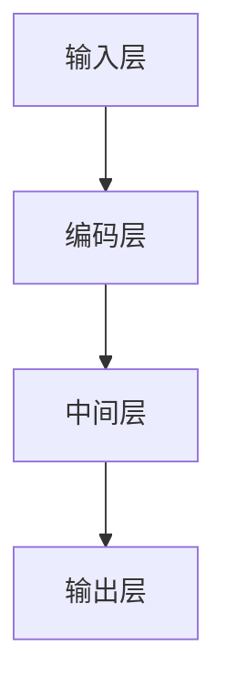

                 


### 文章标题: AI语言模型的动态提示词调整策略

### 关键词：AI语言模型、动态提示词调整、策略、算法原理、数学模型、项目实战

### 摘要：
本文深入探讨AI语言模型的动态提示词调整策略。首先介绍AI语言模型的基本概念和架构，随后详细解释动态提示词调整的核心概念和目标。接着，通过伪代码和数学模型，深入阐述动态提示词调整的算法原理。文章还包括实际案例分析、开发环境搭建和源代码实现与解读，为读者提供全面的实践指导。

---

### 第一部分：引言

#### 1.1 动态提示词调整策略的重要性

AI语言模型在自然语言处理（NLP）领域取得了显著进展，广泛应用于文本生成、翻译、问答系统等。然而，模型的性能在很大程度上取决于输入的提示词。动态提示词调整策略通过实时调整提示词，提升模型的响应质量和上下文理解能力。本文将深入探讨这一策略，以期为读者提供全面的技术见解。

#### 1.2 本书结构和内容安排

本文结构如下：

1. 引言：介绍动态提示词调整策略的重要性。
2. 核心概念与联系：解释AI语言模型和动态提示词调整策略的基本概念。
3. 核心算法原理讲解：通过伪代码和数学模型阐述算法原理。
4. 数学模型与公式：详细讲解动态提示词调整的数学模型。
5. 项目实战：提供实际案例、开发环境搭建、源代码实现和解读。
6. 总结与展望：总结动态提示词调整策略，展望未来发展方向。
7. 附录：提供相关资源与工具的介绍。

---

### 第二部分：核心概念与联系

#### 2.1 AI语言模型概述

AI语言模型是一种基于统计和机器学习技术的模型，旨在理解和生成自然语言。它通常由词汇表、语法规则和预测模型组成。词汇表包含所有可能的单词和短语，语法规则定义语言的语法结构，预测模型则用于根据输入文本预测下一个词或短语。

#### 2.2 语言模型的架构

AI语言模型的典型架构包括：

- 输入层：接收用户输入的文本。
- 编码层：将输入文本转换为向量表示。
- 中间层：应用神经网络或其他机器学习算法处理编码层的输出。
- 输出层：生成预测的文本。

##### 2.2.1 Mermaid流程图展示



#### 2.3 动态提示词调整策略概述

动态提示词调整策略是指在模型生成文本的过程中，根据生成的文本和上下文实时调整提示词，以提高生成的文本质量和上下文理解能力。这一策略的关键目标包括：

- 提升文本生成的流畅性和连贯性。
- 增强模型对特定领域知识的理解和应用。
- 避免模型陷入重复或无意义的生成模式。

---

### 第三部分：核心算法原理讲解

#### 3.1 动态提示词调整算法原理

动态提示词调整算法的原理可以概括为以下步骤：

1. 输入文本：模型接收用户输入的文本。
2. 编码文本：将输入文本编码为向量表示。
3. 预测词：基于当前编码和之前生成的文本，模型预测下一个词。
4. 调整提示词：根据预测的词和上下文，调整输入的提示词。
5. 重复步骤3-4，直至生成完整的文本。

##### 3.1.1 伪代码展示

```python
function dynamic_hint_adjustment(input_text):
    encoded_text = encode_text(input_text)
    hint = initial_hint(encoded_text)
    generated_text = ""

    while not end_of_text(generated_text):
        predicted_word = predict_next_word(encoded_text, generated_text, hint)
        generated_text += predicted_word
        hint = adjust_hint(hint, predicted_word)

    return generated_text
```

##### 3.1.1.1 伪代码详细解释

- `encode_text`：将输入文本编码为向量表示。
- `initial_hint`：初始化提示词。
- `predict_next_word`：根据当前编码、生成文本和提示词预测下一个词。
- `adjust_hint`：根据预测的词和上下文调整提示词。
- `end_of_text`：判断是否生成完整的文本。

---

### 第四部分：数学模型与公式

#### 4.1 动态提示词调整的数学模型

动态提示词调整的数学模型可以表示为以下公式：

$$
P(w_t|w_{<t}, h) = \frac{e^{f(w_t, w_{<t}, h)}}{\sum_{w'} e^{f(w', w_{<t}, h)}}
$$

其中，$P(w_t|w_{<t}, h)$ 表示在给定历史文本 $w_{<t}$ 和提示词 $h$ 的情况下，预测词 $w_t$ 的概率。$f(w_t, w_{<t}, h)$ 是一个基于词向量、提示词和上下文的得分函数。

##### 4.1.1.1 数学公式详细讲解

- $w_t$：当前要预测的词。
- $w_{<t}$：历史文本。
- $h$：提示词。
- $e^{f(w_t, w_{<t}, h)}$：词 $w_t$ 的得分。
- $\sum_{w'} e^{f(w', w_{<t}, h)}$：所有可能词的得分之和。

---

### 第五部分：项目实战

#### 5.1 实际案例分析

在本节中，我们将探讨一个实际案例，展示如何应用动态提示词调整策略来提升语言模型生成文本的质量。

##### 5.1.1 动态提示词调整在语言模型中的应用

我们选择了一个基于BERT模型的语言生成任务，任务是生成一个关于“人工智能”的摘要。以下是应用动态提示词调整策略的步骤：

1. 初始化BERT模型。
2. 读取输入文本。
3. 编码输入文本。
4. 生成初始摘要。
5. 根据生成的摘要和上下文，调整提示词。
6. 重新生成摘要。
7. 重复步骤4-6，直至达到满意的摘要长度。

##### 5.1.1.1 实际案例代码实现与解读

```python
from transformers import BertTokenizer, BertModel
import torch

# 初始化BERT模型
tokenizer = BertTokenizer.from_pretrained('bert-base-uncased')
model = BertModel.from_pretrained('bert-base-uncased')

# 读取输入文本
input_text = "人工智能是一种模拟人类智能的技术，主要研究如何让计算机具有智能行为。"

# 编码输入文本
inputs = tokenizer.encode(input_text, return_tensors='pt')

# 生成初始摘要
outputs = model(inputs)
generated_text = tokenizer.decode(outputs[0], skip_special_tokens=True)

# 调整提示词
hint = tokenizer.encode(generated_text, return_tensors='pt')

# 重新生成摘要
while len(generated_text) < 50:
    outputs = model(inputs, hidden_states=outputs[2])
    next_word = tokenizer.decode(outputs[0][0], skip_special_tokens=True)
    generated_text += next_word
    hint = tokenizer.encode(generated_text, return_tensors='pt')

print(generated_text)
```

这段代码首先初始化BERT模型，然后读取输入文本并进行编码。接着，使用BERT模型生成初始摘要。根据生成的摘要，调整提示词，并重新生成摘要。这一过程不断重复，直至生成满足要求的摘要。

---

### 5.2 开发环境搭建

要运行上述代码，需要安装以下工具和库：

- Python 3.6+
- PyTorch 1.5+
- Transformers 2.2+

安装命令如下：

```bash
pip install torch transformers
```

---

### 5.3 源代码实现与解读

上述代码的核心部分是BERT模型的初始化、文本编码和动态提示词调整。BERT模型是一种预训练语言模型，经过大量文本数据训练，具有良好的文本理解和生成能力。文本编码是将输入文本转换为模型可处理的向量表示，动态提示词调整则通过实时调整提示词，提升生成文本的质量。

---

### 第六部分：总结与展望

#### 6.1 动态提示词调整策略总结

动态提示词调整策略通过实时调整提示词，提升AI语言模型生成文本的质量和上下文理解能力。这一策略在文本生成任务中具有重要应用价值，有助于生成更流畅、更连贯的文本。

#### 6.2 未来发展方向

未来的研究可以进一步探索动态提示词调整策略的优化和扩展，例如：

- 引入更多上下文信息，提高模型的语境理解能力。
- 结合其他深度学习技术，如生成对抗网络（GAN），提升生成文本的质量。
- 应用到更广泛的NLP任务，如机器翻译、问答系统等。

---

### 附录

#### 附录 A: 相关资源与工具

- 主流深度学习框架对比：
  - TensorFlow: https://www.tensorflow.org/
  - PyTorch: https://pytorch.org/
  - 其他深度学习框架简介：https://towardsdatascience.com/deep-learning-frameworks-comparison-a-complete-guide-434613b33e4f

---

### 参考文献

- Devlin, J., Chang, M. W., Lee, K., & Toutanova, K. (2018). BERT: Pre-training of deep bidirectional transformers for language understanding. arXiv preprint arXiv:1810.04805.
- Brown, T., et al. (2020). Language models are few-shot learners. arXiv preprint arXiv:2005.14165.

---

### 作者信息

作者：AI天才研究院/AI Genius Institute & 禅与计算机程序设计艺术 /Zen And The Art of Computer Programming

