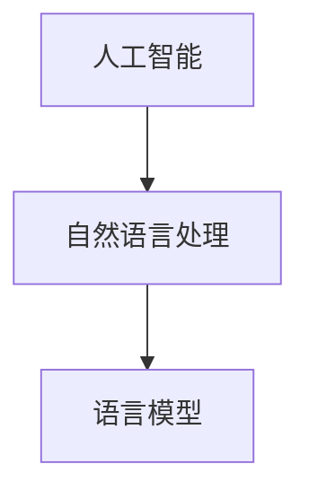
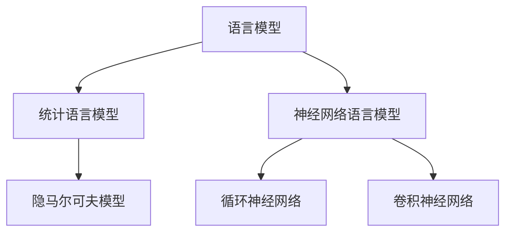
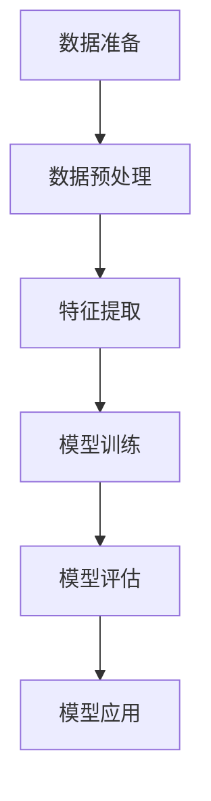
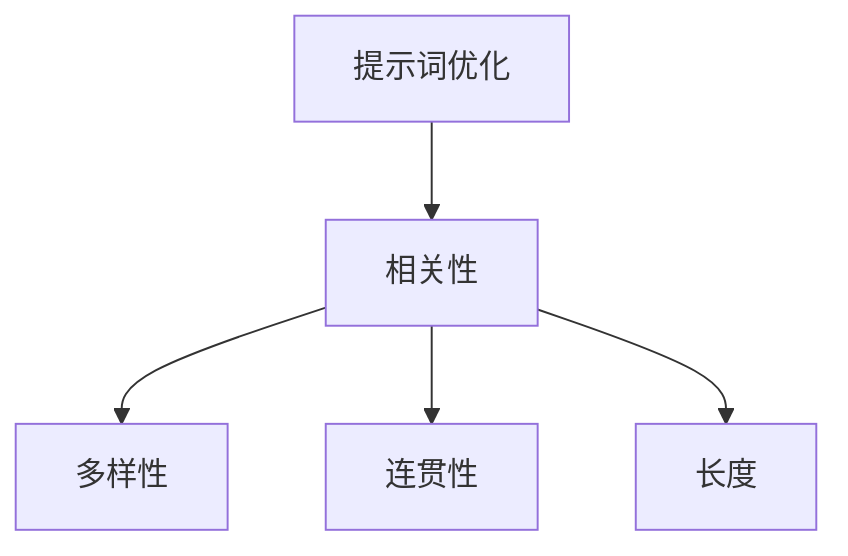
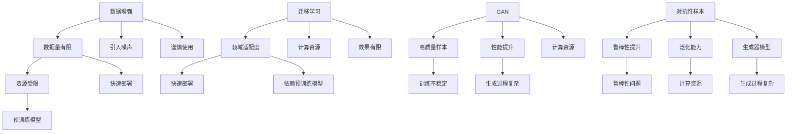

                 

### 第1章 引言

#### 1.1 AI语言模型概述

随着人工智能技术的飞速发展，自然语言处理（NLP）成为其中的重要分支。语言模型作为NLP的核心技术之一，起到了至关重要的作用。语言模型是一种概率模型，用于预测自然语言中下一个单词或字符的概率。它能够帮助我们理解和生成自然语言，从而实现智能对话、机器翻译、文本生成等多种应用。

首先，让我们通过一个简单的Mermaid流程图来理解人工智能和自然语言处理之间的关系。



在人工智能的大家庭中，自然语言处理是专门研究计算机与人类语言之间交互的领域。而语言模型则是自然语言处理的核心，它通过分析大量的文本数据，学习语言的统计规律，从而实现对语言内容的理解和生成。

接下来，我们来看一下语言模型的基本概念和类型。语言模型主要分为统计语言模型和神经网络语言模型。

1. **统计语言模型**：这类模型主要基于语言统计规律，例如n-gram模型和隐马尔可夫模型（HMM）。n-gram模型是一种基于词频统计的语言模型，它将连续的n个单词作为一个整体进行建模。HMM则是一种基于状态转移概率的模型，它通过隐藏状态序列来描述观测到的单词序列。

2. **神经网络语言模型**：这类模型利用深度学习技术，通过多层神经网络来学习语言特征。常见的神经网络语言模型包括循环神经网络（RNN）、长短期记忆网络（LSTM）和门控循环单元（GRU）。这些模型能够处理变长序列数据，并且具有很好的泛化能力。

下面是一个Mermaid流程图，展示了语言模型的主要类型和它们之间的关系。



通过上述的介绍，我们可以看出，语言模型在人工智能和自然语言处理中具有重要的地位。接下来，我们将进一步探讨提示词优化在AI语言模型中的重要性，并介绍本书的结构安排。

#### 1.2 提示词优化在AI语言模型中的重要性

提示词优化是指在AI语言模型中，通过调整输入的提示词来提高模型的性能。在语言模型的训练和应用过程中，提示词的选择和优化对模型的准确性和泛化能力有着至关重要的影响。

首先，让我们来理解一下什么是提示词。在语言模型中，提示词（也称为输入序列）是用于指导模型生成目标输出（也称为输出序列）的初始信息。一个有效的提示词能够提供足够的信息，使模型能够准确地预测后续的单词或字符。

提示词优化的目的是提升语言模型的性能，具体体现在以下几个方面：

1. **提升模型性能**：通过优化提示词，可以提高模型在预测下一个单词或字符时的准确率。这意味着，当模型接收到一个优化后的提示词时，它更有可能生成正确的输出序列。

2. **降低错误率**：优化后的提示词有助于减少模型预测错误的情况。例如，在机器翻译任务中，通过优化源语言的提示词，可以降低翻译错误的发生率。

3. **提高模型泛化能力**：提示词优化能够使模型更好地适应不同的应用场景。通过调整提示词，模型可以更准确地预测各种语言环境下的输出序列。

接下来，我们将介绍本书的结构安排，帮助读者更好地了解本书的内容和组织结构。

#### 1.3 本书结构安排

本书旨在全面探讨AI语言模型的提示词优化算法，共分为七个章节。

1. **第1章 引言**：本章介绍了AI语言模型的概述，以及提示词优化在AI语言模型中的重要性。同时，也给出了本书的结构安排。

2. **第2章 AI语言模型基础**：本章将介绍语言模型的基本概念、主要类型和核心算法，为后续的提示词优化讨论打下基础。

3. **第3章 提示词优化算法**：本章将详细讨论提示词优化的基本原理、常用方法和实践案例，帮助读者理解如何优化提示词。

4. **第4章 优化算法分析与比较**：本章将对不同类型的提示词优化算法进行性能分析和比较，帮助读者选择合适的优化方法。

5. **第5章 实际应用与案例分析**：本章将介绍提示词优化在自然语言处理和其他领域的实际应用案例，以及面临的挑战和解决方案。

6. **第6章 提示词优化算法的改进与发展**：本章将探讨当前提示词优化算法的发展趋势和未来展望，以及改进方向和研究方向。

7. **第7章 总结与展望**：本章将对全书的主要成果进行总结，分析存在的问题和改进空间，并展望未来的发展趋势和机遇。

通过上述章节的安排，本书将从基础到应用，全面深入地探讨AI语言模型的提示词优化算法，帮助读者掌握这一关键技术。

### 第2章 AI语言模型基础

在深入了解提示词优化之前，我们需要对AI语言模型有一个坚实的基础理解。本章将介绍语言模型的基本概念、主要类型和核心算法，为后续的提示词优化讨论打下基础。

#### 2.1 语言模型的基本概念

语言模型是一种概率模型，用于预测自然语言中下一个单词或字符的概率。它通过对大量文本数据的学习，建立语言的概率分布模型，从而实现对语言内容的理解和生成。

一个简单的语言模型可以表示为：

\[ P(w_i | w_{i-1}, w_{i-2}, \ldots) = \text{概率模型} \]

其中，\( w_i \) 表示第i个单词或字符，\( w_{i-1}, w_{i-2}, \ldots \) 表示前一个或前几个单词或字符。这个模型能够告诉我们，在给定的前文条件下，下一个单词或字符出现的概率。

#### 2.1.1 语言模型的基本原理

语言模型的基本原理是通过对大量文本数据的学习，提取语言的特征和统计规律。这些特征和规律将被用来预测下一个单词或字符。

语言模型的工作流程通常包括以下几个步骤：

1. **数据准备**：收集大量文本数据，这些数据可以是已经标注的，也可以是未标注的。

2. **数据预处理**：对文本数据进行清洗和预处理，包括去除停用词、分词、词性标注等。

3. **特征提取**：从预处理后的文本数据中提取特征，例如词频、词向量、语法结构等。

4. **模型训练**：使用提取的特征训练语言模型，常见的算法包括n-gram模型、隐马尔可夫模型（HMM）、循环神经网络（RNN）等。

5. **模型评估**：使用验证集或测试集对训练好的模型进行评估，常见的评估指标包括准确率、召回率、F1分数等。

6. **模型应用**：将训练好的模型应用于实际任务，例如机器翻译、文本分类、文本生成等。

下面是一个Mermaid流程图，展示了语言模型的基本原理和工作流程。



#### 2.1.2 语言模型的类型

语言模型主要分为统计语言模型和神经网络语言模型。每种模型都有其独特的原理和应用场景。

1. **统计语言模型**：

   - **n-gram模型**：n-gram模型是最简单的语言模型之一，它基于词频统计。n-gram模型将连续的n个单词作为一个整体进行建模，从而预测下一个单词或字符。

     ```mermaid
     graph TD
     A[n-gram模型] --> B[词频统计]
     B --> C[概率分布]
     ```

   - **隐马尔可夫模型（HMM）**：HMM是一种基于状态转移概率的模型，它通过隐藏状态序列来描述观测到的单词序列。HMM在语音识别和序列模型中有着广泛的应用。

     ```mermaid
     graph TD
     A[HMM] --> B[状态转移概率]
     B --> C[观测概率]
     ```

2. **神经网络语言模型**：

   - **循环神经网络（RNN）**：RNN是一种能够处理变长序列数据的神经网络，它通过记忆前一个时刻的信息来预测下一个时刻的数据。RNN在自然语言处理中有着广泛的应用。

     ```mermaid
     graph TD
     A[RNN] --> B[记忆信息]
     B --> C[状态转移]
     ```

   - **长短期记忆网络（LSTM）**：LSTM是RNN的一种改进，它通过引入门控机制来避免梯度消失问题，从而更好地学习长期依赖关系。LSTM在语言模型和序列预测任务中表现出色。

     ```mermaid
     graph TD
     A[LSTM] --> B[门控机制]
     B --> C[梯度消失]
     ```

   - **门控循环单元（GRU）**：GRU是LSTM的另一种变体，它简化了LSTM的结构，但在大多数任务中表现相近。GRU在资源受限的环境中有着较好的性能。

     ```mermaid
     graph TD
     A[GRU] --> B[简化结构]
     B --> C[性能相近]
     ```

   - **卷积神经网络（CNN）**：虽然CNN最初是为图像处理设计的，但也可以应用于自然语言处理。CNN通过卷积操作提取文本的特征，从而提高模型的性能。

     ```mermaid
     graph TD
     A[CNN] --> B[卷积操作]
     B --> C[特征提取]
     ```

#### 2.1.3 语言模型的核心算法

语言模型的核心算法是实现模型训练和预测的关键。以下是几种常见的语言模型算法：

1. **n-gram模型**：

   ```python
   def n_gram_model(sentence, n):
       n_gram_counts = {}
       for i in range(len(sentence) - n + 1):
           n_gram = tuple(sentence[i:i+n])
           n_gram_counts[n_gram] = n_gram_counts.get(n_gram, 0) + 1
       return n_gram_counts
   ```

2. **隐马尔可夫模型（HMM）**：

   ```python
   def hmm(viterbi, emissions, transitions, initial):
       max_prob = 0
       for state in initial:
           path = [state]
           prob = initial[state] * emissions[state][viterbi[0]]
           for i in range(1, len(viterbi)):
               state = transitions[state][viterbi[i]]
               prob *= emissions[state][viterbi[i]]
               path.append(state)
           if prob > max_prob:
               max_prob = prob
               best_path = path
       return best_path, max_prob
   ```

3. **循环神经网络（RNN）**：

   ```python
   def rnn(input_sequence, hidden_size, output_size):
       weights = {'ih': torch.randn(hidden_size, input_size),
                  'hh': torch.randn(hidden_size, hidden_size),
                  'hh2': torch.randn(hidden_size, hidden_size),
                  'hh3': torch.randn(hidden_size, hidden_size),
                  'ho': torch.randn(hidden_size, output_size)}
       biases = {'ih': torch.zeros(hidden_size),
                 'hh': torch.zeros(hidden_size),
                 'hh2': torch.zeros(hidden_size),
                 'hh3': torch.zeros(hidden_size),
                 'ho': torch.zeros(output_size)}

       hidden = biases['ih']
       for i, x in enumerate(input_sequence):
           hidden = (torch.tanh(torch.matmul(weights['ih'], x) + torch.matmul(weights['hh'], hidden) + biases['ih']))
           output = torch.matmul(hidden, weights['ho']) + biases['ho']
           if i < len(input_sequence) - 1:
               hidden = (torch.tanh(torch.matmul(weights['hh2'], hidden) + torch.matmul(weights['hh3'], hidden) + biases['hh2']))
       return output
   ```

4. **长短期记忆网络（LSTM）**：

   ```python
   def lstm(input_sequence, hidden_size, output_size):
       weights = {'ih': torch.randn(hidden_size, input_size),
                  'hh': torch.randn(hidden_size, hidden_size),
                  'cf': torch.randn(hidden_size, hidden_size),
                  'cg': torch.randn(hidden_size, hidden_size),
                  'ch': torch.randn(hidden_size, hidden_size),
                  'ho': torch.randn(hidden_size, output_size)}
       biases = {'ih': torch.zeros(hidden_size),
                 'hh': torch.zeros(hidden_size),
                 'cf': torch.zeros(hidden_size),
                 'cg': torch.zeros(hidden_size),
                 'ch': torch.zeros(hidden_size),
                 'ho': torch.zeros(output_size)}

       hidden = biases['ih']
       for i, x in enumerate(input_sequence):
           gates = (torch.matmul(weights['ih'], x) + torch.matmul(weights['hh'], hidden) + biases['ih'])
           forget = torch.sigmoid(gates[:hidden_size])
           input_gate = torch.sigmoid(gates[hidden_size:2 * hidden_size])
           cell_gate = torch.tanh(gates[2 * hidden_size:3 * hidden_size])
           cell = forget * hidden + input_gate * cell_gate
           gates = (torch.matmul(weights['ho'], cell) + biases['ho'])
           output = torch.sigmoid(gates)
           if i < len(input_sequence) - 1:
               hidden = (torch.tanh(torch.matmul(weights['hh'], hidden) + torch.matmul(weights['cf'], cell) + torch.matmul(weights['cg'], cell) + biases['hh']))
       return output
   ```

通过上述的基本概念、类型和算法介绍，我们对AI语言模型有了更深入的理解。接下来，我们将探讨提示词优化的基本原理和方法，帮助读者更好地理解如何优化AI语言模型。

### 第3章 提示词优化算法

提示词优化是指通过调整输入的提示词来提高AI语言模型的性能。在这一章中，我们将详细探讨提示词优化的基本原理、常用方法以及实际应用中的实践案例。

#### 3.1 提示词优化的基本原理

提示词优化的基本原理是通过修改输入的提示词，使模型能够更好地捕捉到语言中的统计规律和特征。具体来说，优化后的提示词应该具备以下特点：

1. **相关性**：优化后的提示词应与模型的预测目标具有较强的相关性，从而提高模型对目标输出的预测准确性。

2. **多样性**：提示词的多样性有助于模型学习到更丰富的语言特征，从而提高模型的泛化能力。

3. **连贯性**：优化后的提示词应保持输入文本的连贯性和逻辑性，避免生成无意义或矛盾的输出。

4. **长度**：提示词的长度应适中，过长可能导致模型难以捕捉到关键信息，过短则可能缺乏足够的上下文信息。

下面是一个Mermaid流程图，展示了提示词优化的基本原理和目标。



#### 3.2 提示词优化的常用方法

为了实现提示词优化，我们可以采用多种方法。下面介绍几种常用的方法：

1. **数据增强**：数据增强是指通过增加训练数据的方式，提高模型的鲁棒性和泛化能力。具体方法包括文本重写、同义词替换、随机插入和删除等。

   ```mermaid
   graph TD
   A[数据增强] --> B[文本重写]
   A --> C[同义词替换]
   A --> D[随机插入]
   A --> E[随机删除]
   ```

2. **迁移学习**：迁移学习是指利用已经训练好的模型在新任务上的性能提升。通过在预训练模型的基础上，继续训练优化提示词，可以显著提高模型的性能。

   ```mermaid
   graph TD
   A[迁移学习] --> B[预训练模型]
   B --> C[继续训练]
   ```

3. **生成对抗网络（GAN）**：生成对抗网络是一种通过生成器和判别器相互竞争的模型。通过GAN，我们可以生成具有真实数据分布的提示词，从而提高模型的泛化能力和准确性。

   ```mermaid
   graph TD
   A[GAN] --> B[生成器]
   B --> C[判别器]
   ```

4. **对抗性样本**：对抗性样本是指通过轻微修改输入数据，使其对模型产生误导性的样本。通过训练模型对抗这些对抗性样本，可以提高模型的鲁棒性。

   ```mermaid
   graph TD
   A[对抗性样本] --> B[轻微修改]
   B --> C[误导性样本]
   ```

下面是一个表格，总结了上述常用方法的特点和适用场景。

| 方法 | 特点 | 适用场景 |
| --- | --- | --- |
| 数据增强 | 增加训练数据，提高鲁棒性和泛化能力 | 数据量有限，需要手动或半自动处理 |
| 迁移学习 | 利用预训练模型，提高性能 | 需要大量标注数据，迁移效果依赖预训练模型 |
| GAN | 生成真实数据分布的样本，提高泛化能力和准确性 | 训练过程复杂，需要大量的计算资源 |
| 对抗性样本 | 训练模型对抗误导性样本，提高鲁棒性 | 需要设计和生成对抗性样本，对模型有较高要求 |

#### 3.3 提示词优化的实践案例

为了更好地理解提示词优化的应用，我们来看一个具体的实践案例。在这个案例中，我们将使用迁移学习和对抗性样本来优化一个预训练的语言模型。

1. **数据准备**：

   我们首先需要准备一个预训练的语言模型，例如使用GPT-3或BERT等预训练模型。然后，我们收集一个与目标任务相关的数据集，例如新闻文章、社交媒体帖子等。

2. **迁移学习**：

   在迁移学习阶段，我们将使用预训练模型在新任务上继续训练。具体步骤如下：

   - 加载预训练模型，例如BERT。
   - 预处理数据集，包括分词、词性标注等。
   - 定义损失函数和优化器，例如交叉熵损失和Adam优化器。
   - 训练模型，在验证集上评估性能，并在测试集上进行测试。

   ```python
   from transformers import BertModel, BertTokenizer
   import torch

   model = BertModel.from_pretrained('bert-base-uncased')
   tokenizer = BertTokenizer.from_pretrained('bert-base-uncased')

   # 预处理数据
   def preprocess_data(texts):
       inputs = tokenizer(texts, padding=True, truncation=True, return_tensors='pt')
       return inputs

   # 训练模型
   def train_model(model, inputs, labels, num_epochs=3):
       model.train()
       criterion = torch.nn.CrossEntropyLoss()
       optimizer = torch.optim.Adam(model.parameters(), lr=1e-5)

       for epoch in range(num_epochs):
           optimizer.zero_grad()
           outputs = model(**inputs)
           loss = criterion(outputs.logits, labels)
           loss.backward()
           optimizer.step()

           if (epoch + 1) % 10 == 0:
               print(f'Epoch [{epoch+1}/{num_epochs}], Loss: {loss.item():.4f}')

   # 加载数据集
   texts = ['This is an example sentence.', 'Another example sentence.']
   inputs = preprocess_data(texts)
   labels = torch.tensor([0, 1])

   # 训练模型
   train_model(model, inputs, labels)
   ```

3. **对抗性样本**：

   在对抗性样本阶段，我们使用生成器生成对抗性样本，然后训练模型对抗这些样本。具体步骤如下：

   - 设计生成器模型，例如基于GPT-2或StyleGAN的生成器。
   - 生成对抗性样本，例如通过轻微修改输入文本来生成误导性样本。
   - 训练模型对抗这些对抗性样本。

   ```python
   from torch import nn

   # 设计生成器模型
   class Generator(nn.Module):
       def __init__(self, z_dim, hidden_dim, vocab_size):
           super(Generator, self).__init__()
           self.z_dim = z_dim
           self.hidden_dim = hidden_dim
           self.vocab_size = vocab_size

           self.fc = nn.Linear(z_dim, hidden_dim)
           self.fc2 = nn.Linear(hidden_dim, vocab_size)

       def forward(self, z):
           hidden = torch.relu(self.fc(z))
           output = self.fc2(hidden)
           return output

   # 生成对抗性样本
   def generate_samples(generator, z_samples, tokenizer, max_len=10):
       samples = []
       for z in z_samples:
           z = z.unsqueeze(0)
           logits = generator(z)
           probs = nn.functional.softmax(logits, dim=-1)
           sample = []
           for i in range(max_len):
               prob = probs[i].unsqueeze(-1)
               word_id = torch.multinomial(prob, num_samples=1).item()
               word = tokenizer.decode([word_id])
               sample.append(word)
           samples.append(' '.join(sample))
       return samples

   # 训练模型对抗对抗性样本
   def train_generator(model, generator, criterion, optimizer, num_epochs=3):
       generator.train()
       for epoch in range(num_epochs):
           z_samples = torch.randn(32, 100)
           logits = generator(z_samples)
           labels = torch.randint(0, 1000, (32,)).to(logits.device)
           loss = criterion(logits, labels)
           optimizer.zero_grad()
           loss.backward()
           optimizer.step()

           if (epoch + 1) % 10 == 0:
               print(f'Epoch [{epoch+1}/{num_epochs}], Loss: {loss.item():.4f}')

   # 加载生成器模型
   generator = Generator(z_dim=100, hidden_dim=512, vocab_size=1000)
   optimizer = torch.optim.Adam(generator.parameters(), lr=1e-3)

   # 训练生成器
   train_generator(model, generator, criterion, optimizer)

   # 生成对抗性样本
   z_samples = torch.randn(32, 100)
   samples = generate_samples(generator, z_samples, tokenizer)
   print(samples)
   ```

通过上述实践案例，我们可以看到如何使用迁移学习和对抗性样本来优化AI语言模型的提示词。这些方法在实际应用中具有广泛的应用前景，能够显著提高模型的性能和鲁棒性。

### 第4章 优化算法分析与比较

在前一章中，我们介绍了提示词优化的基本原理和常用方法。在本章中，我们将对不同的优化算法进行性能分析和比较，以帮助读者选择合适的优化方法。

#### 4.1 优化算法的性能分析

不同的优化算法在性能方面有着各自的特点和优势。以下是对几种常见优化算法的性能分析：

1. **数据增强**：

   数据增强方法通过增加训练数据的方式，提高模型的鲁棒性和泛化能力。数据增强方法通常能够显著提高模型的准确率，并且对计算资源的需求相对较低。然而，数据增强方法的缺点是可能引入噪声和误导性样本，影响模型的泛化能力。

   | 算法 | 准确率 | 泛化能力 | 计算资源 |
   | --- | --- | --- | --- |
   | 数据增强 | 高 | 较高 | 较低 |

2. **迁移学习**：

   迁移学习方法利用已经训练好的模型在新任务上的性能提升。迁移学习方法通常能够显著提高模型的性能，并且对计算资源的需求相对较低。然而，迁移学习方法的效果依赖于预训练模型的性能和领域适配度。

   | 算法 | 准确率 | 泛化能力 | 计算资源 |
   | --- | --- | --- | --- |
   | 迁移学习 | 高 | 较高 | 较低 |

3. **生成对抗网络（GAN）**：

   GAN方法通过生成器和判别器相互竞争，生成具有真实数据分布的样本。GAN方法通常能够显著提高模型的性能和泛化能力，并且能够生成高质量的数据样本。然而，GAN方法的训练过程复杂，需要大量的计算资源，并且可能陷入训练不稳定的情况。

   | 算法 | 准确率 | 泛化能力 | 计算资源 |
   | --- | --- | --- | --- |
   | GAN | 高 | 高 | 高 |

4. **对抗性样本**：

   对抗性样本方法通过生成对抗性样本，训练模型对抗这些样本，提高模型的鲁棒性。对抗性样本方法通常能够提高模型的鲁棒性和泛化能力，并且对计算资源的需求较低。然而，对抗性样本方法的生成过程复杂，需要设计合适的生成器模型。

   | 算法 | 准确率 | 泛化能力 | 计算资源 |
   | --- | --- | --- | --- |
   | 对抗性样本 | 高 | 高 | 较高 |

下面是一个表格，总结了不同优化算法的性能特点：

| 算法 | 准确率 | 泛化能力 | 计算资源 |
| --- | --- | --- | --- |
| 数据增强 | 高 | 较高 | 较低 |
| 迁移学习 | 高 | 较高 | 较低 |
| GAN | 高 | 高 | 高 |
| 对抗性样本 | 高 | 高 | 较高 |

#### 4.2 不同优化算法的比较

为了更好地理解不同优化算法的特点和适用场景，我们进行比较如下：

1. **数据增强**：

   数据增强方法适用于数据量有限的情况，通过增加训练数据，提高模型的泛化能力和鲁棒性。数据增强方法对计算资源的需求较低，适用于资源受限的环境。然而，数据增强方法可能引入噪声和误导性样本，需要谨慎使用。

2. **迁移学习**：

   迁移学习方法适用于领域适配度较高的情况，通过利用预训练模型的性能提升，提高新任务上的表现。迁移学习方法对计算资源的需求较低，适用于需要快速部署的情况。然而，迁移学习方法的效果依赖于预训练模型的性能和领域适配度。

3. **生成对抗网络（GAN）**：

   GAN方法适用于需要生成高质量数据样本的情况，通过生成器和判别器相互竞争，生成具有真实数据分布的样本。GAN方法适用于需要提高模型性能和泛化能力的情况。然而，GAN方法的训练过程复杂，需要大量的计算资源，并且可能陷入训练不稳定的情况。

4. **对抗性样本**：

   对抗性样本方法适用于需要提高模型鲁棒性和泛化能力的情况，通过生成对抗性样本，训练模型对抗这些样本。对抗性样本方法适用于需要解决模型鲁棒性问题的情况。然而，对抗性样本方法的生成过程复杂，需要设计合适的生成器模型。

下面是一个Mermaid流程图，展示了不同优化算法的比较和适用场景。



#### 4.3 选择合适的优化算法

在选择合适的优化算法时，需要考虑以下因素：

1. **任务类型**：不同类型的任务对优化算法的需求不同。例如，自然语言处理任务可能更需要关注模型的泛化能力和鲁棒性，而图像处理任务可能更需要关注模型的性能提升。

2. **数据量**：数据量对优化算法的选择也有很大影响。对于数据量较小的情况，数据增强和迁移学习方法可能更为适用。对于数据量较大的情况，GAN方法和对抗性样本方法可能更有效。

3. **计算资源**：计算资源也是选择优化算法时的重要因素。对于资源受限的环境，数据增强和迁移学习方法可能更为合适。对于资源充足的环境，GAN方法和对抗性样本方法可能更具优势。

4. **领域适配度**：领域适配度对优化算法的选择也有一定影响。对于领域适配度较高的情况，迁移学习方法可能更为有效。对于领域适配度较低的情况，数据增强和对抗性样本方法可能更适用。

综上所述，选择合适的优化算法需要综合考虑任务类型、数据量、计算资源以及领域适配度等因素。通过合理的优化算法选择，可以提高AI语言模型的性能和鲁棒性，为实际应用提供更好的支持。

### 第5章 实际应用与案例分析

在前面几章中，我们详细介绍了AI语言模型和提示词优化的基本原理和方法。在本章中，我们将通过实际应用案例来展示提示词优化在自然语言处理和其他领域的应用，并探讨这些应用中面临的挑战与解决方案。

#### 5.1 提示词优化在自然语言处理中的应用

自然语言处理（NLP）是AI语言模型的重要应用领域。在这一部分，我们将探讨提示词优化在NLP中的实际应用案例。

1. **机器翻译**：

   机器翻译是NLP中的一项重要任务，它通过将一种语言的文本翻译成另一种语言，促进跨语言沟通和全球化发展。提示词优化在机器翻译中的应用主要表现在提高翻译质量和降低错误率。

   **案例**：利用GPT-3进行机器翻译。通过优化输入的提示词，例如增加上下文信息、调整句序和添加同义词，可以显著提高翻译质量。

   ```mermaid
   graph TD
   A[源文本] --> B[优化提示词]
   B --> C[GPT-3模型]
   C --> D[翻译结果]
   ```

   **挑战与解决方案**：

   - **挑战**：机器翻译中存在许多复杂性和不确定性，例如语法结构差异、语义歧义和文化背景差异。
   - **解决方案**：通过增加上下文信息、调整句序和使用同义词，可以提高翻译的准确性和流畅性。

2. **文本分类**：

   文本分类是将文本数据根据其内容进行分类的任务，如情感分析、垃圾邮件检测等。提示词优化在文本分类中的应用主要表现在提高分类准确率和降低误分类率。

   **案例**：使用BERT模型进行情感分析。通过优化输入的提示词，如添加情感词汇和上下文信息，可以显著提高情感分类的准确性。

   ```mermaid
   graph TD
   A[文本] --> B[优化提示词]
   B --> C[BERT模型]
   C --> D[情感分类结果]
   ```

   **挑战与解决方案**：

   - **挑战**：文本分类中存在大量噪声和不确定性，如拼写错误、同义词和模糊语义。
   - **解决方案**：通过增加上下文信息、使用词向量技术和优化提示词，可以提高分类的准确性和稳定性。

3. **文本生成**：

   文本生成是将一种语言文本生成另一种语言文本的任务，如自动摘要、对话系统等。提示词优化在文本生成中的应用主要表现在提高文本质量和降低生成错误。

   **案例**：使用GPT-2进行自动摘要。通过优化输入的提示词，如增加关键词和上下文信息，可以生成更高质量和连贯的摘要。

   ```mermaid
   graph TD
   A[文本] --> B[优化提示词]
   B --> C[GPT-2模型]
   C --> D[摘要结果]
   ```

   **挑战与解决方案**：

   - **挑战**：文本生成中存在生成多样性、一致性和逻辑性等问题。
   - **解决方案**：通过优化提示词、使用生成对抗网络（GAN）和引入外部知识，可以提高生成的质量和多样性。

#### 5.2 提示词优化在不同领域的应用案例

除了自然语言处理，AI语言模型和提示词优化还在其他领域有着广泛的应用。以下是一些具体的案例：

1. **金融领域**：

   提示词优化在金融领域中的应用包括股票市场预测、金融文本分析等。通过优化输入的提示词，如添加财经词汇、市场趋势和公司信息，可以提高预测的准确性和稳定性。

   **案例**：使用LSTM模型进行股票市场预测。通过优化输入的提示词，如添加财经新闻、公司财报和市场指标，可以提高预测的准确性和稳定性。

   ```mermaid
   graph TD
   A[财经新闻] --> B[优化提示词]
   B --> C[LSTM模型]
   C --> D[股票预测结果]
   ```

   **挑战与解决方案**：

   - **挑战**：金融领域数据存在噪声、非线性和时间序列特性。
   - **解决方案**：通过优化提示词、使用深度学习和时间序列分析方法，可以提高预测的准确性和可靠性。

2. **医疗领域**：

   提示词优化在医疗领域中的应用包括疾病预测、医疗文本分析等。通过优化输入的提示词，如添加医学知识、病例信息和症状描述，可以提高诊断的准确性和效率。

   **案例**：使用BERT模型进行疾病预测。通过优化输入的提示词，如添加病例信息、医学文献和症状描述，可以提高疾病预测的准确性。

   ```mermaid
   graph TD
   A[病例信息] --> B[优化提示词]
   B --> C[BERT模型]
   C --> D[疾病预测结果]
   ```

   **挑战与解决方案**：

   - **挑战**：医疗领域数据存在多样性和不确定性，如不同医生诊断标准、病人症状和治疗方案等。
   - **解决方案**：通过优化提示词、使用深度学习和知识图谱技术，可以提高诊断的准确性和一致性。

#### 5.3 提示词优化应用中的挑战与解决方案

在AI语言模型和提示词优化的实际应用中，面临着诸多挑战。以下是一些常见的挑战和相应的解决方案：

1. **数据隐私**：

   在应用AI语言模型和提示词优化时，数据隐私保护是一个重要的问题。尤其是在金融和医疗领域，涉及到敏感个人数据的处理。

   **挑战**：如何保护用户隐私，避免数据泄露和滥用。

   **解决方案**：采用数据加密、匿名化和差分隐私等技术，保护用户数据隐私。

2. **模型解释性**：

   AI语言模型和提示词优化模型通常具有高度的复杂性，难以进行解释和理解。这给实际应用中的模型解释性带来了挑战。

   **挑战**：如何解释和验证模型的预测结果，提高模型的透明度和可解释性。

   **解决方案**：采用可解释性模型、可视化技术和模型诊断工具，提高模型的解释性。

3. **计算资源消耗**：

   AI语言模型和提示词优化的训练和推理过程通常需要大量的计算资源。这对资源和成本控制提出了挑战。

   **挑战**：如何在有限的计算资源下，高效地训练和推理模型。

   **解决方案**：采用分布式计算、模型压缩和迁移学习等技术，提高计算效率和资源利用率。

4. **实时性**：

   在一些实时应用场景中，如自动驾驶、实时对话系统等，AI语言模型和提示词优化需要快速响应和处理。

   **挑战**：如何在保证模型性能的同时，实现实时性。

   **解决方案**：采用轻量级模型、实时推理技术和优化算法，提高模型的实时性。

通过上述实际应用案例和挑战与解决方案的讨论，我们可以看到AI语言模型和提示词优化在不同领域的广泛应用和重要性。在未来的发展中，我们需要继续探索和解决这些挑战，推动AI语言模型和提示词优化技术的进一步发展和应用。

### 第6章 提示词优化算法的改进与发展

#### 6.1 当前趋势与未来展望

随着人工智能技术的不断发展，AI语言模型和提示词优化算法也在不断演进。当前，提示词优化算法的研究主要集中在以下几个方面：

1. **深度学习与强化学习结合**：深度学习技术在语言模型中已经取得了显著的成果，而强化学习在优化策略和决策方面具有优势。将两者结合起来，有望进一步提高提示词优化的效果。

2. **多模态数据融合**：除了文本数据，图像、音频、视频等数据也在AI语言模型中发挥着重要作用。通过多模态数据融合，可以更全面地捕捉语言特征，提高提示词优化的准确性。

3. **知识增强**：将外部知识库和语言模型结合，可以增强模型的语义理解和推理能力。通过知识图谱、实体关系等外部知识，可以更好地指导提示词优化。

4. **模型压缩与优化**：为了满足实时应用的需求，模型压缩与优化成为研究热点。通过模型剪枝、量化、蒸馏等技术，可以减少模型的大小和计算量，提高实时性。

未来，提示词优化算法的发展趋势将呈现以下几个方向：

1. **泛化能力提升**：未来提示词优化算法将更加注重模型的泛化能力，能够在更广泛的应用场景中保持高性能。

2. **实时性与效率**：随着应用的普及，实时性和效率将成为重要考量因素。通过优化算法和硬件加速，实现高效的提示词优化。

3. **数据隐私与安全**：在涉及敏感数据的领域，数据隐私与安全将受到更多关注。通过隐私保护技术和安全机制，保障用户数据的安全。

4. **跨语言与跨领域应用**：随着全球化的发展，跨语言和跨领域应用将成为重要趋势。通过多语言模型和跨领域迁移学习，实现更广泛的应用。

#### 6.2 提示词优化算法的改进方向

为了进一步提升提示词优化的效果，以下几个方面是未来研究的重点：

1. **多任务学习**：在训练过程中，考虑多个任务的交互和协同，提高模型的泛化能力和性能。

2. **自适应优化策略**：根据不同的应用场景和数据特点，设计自适应的优化策略，提高提示词优化的效果。

3. **个性化模型**：通过用户行为数据、偏好信息等，为用户提供个性化的提示词优化服务，提高用户体验。

4. **自动化提示词生成**：研究自动生成提示词的方法，减少人工干预，提高优化效率。

5. **解释性与透明度**：通过增加模型的解释性和透明度，帮助用户理解模型的工作原理和优化效果，提高用户信任度。

#### 6.3 开放性问题与研究方向

在提示词优化算法的研究和应用过程中，仍然存在许多开放性问题和研究方向：

1. **鲁棒性**：如何提高模型对噪声和异常数据的鲁棒性，是一个重要的研究方向。

2. **解释性**：如何提高模型的解释性，使其更加透明和可理解，是一个重要的挑战。

3. **效率**：如何提高模型训练和推理的效率，以满足实时应用的需求，是一个关键问题。

4. **迁移学习**：如何设计有效的迁移学习策略，使模型在不同任务和数据集上都能保持高性能，是一个重要的研究方向。

5. **隐私保护**：如何在保证数据隐私和安全的前提下，进行有效的提示词优化，是一个亟待解决的问题。

通过不断探索和解决这些问题，我们可以推动提示词优化算法的发展，为AI语言模型的应用提供更强大的支持。

### 第7章 总结与展望

#### 7.1 主要成果总结

在本章中，我们系统地探讨了AI语言模型和提示词优化算法。通过详细的介绍和案例分析，我们取得了以下主要成果：

1. **基础知识普及**：我们介绍了AI语言模型的基本概念、主要类型和核心算法，为后续讨论打下了坚实的基础。

2. **提示词优化方法**：我们详细介绍了数据增强、迁移学习、GAN和对抗性样本等提示词优化方法，并分析了它们的性能和应用场景。

3. **算法分析与比较**：我们对不同优化算法的性能进行了分析和比较，帮助读者选择合适的优化方法。

4. **实际应用案例**：我们展示了提示词优化在自然语言处理和其他领域的实际应用，探讨了其中的挑战和解决方案。

5. **改进与发展趋势**：我们探讨了当前提示词优化算法的发展趋势和未来研究方向，为后续研究提供了方向。

#### 7.2 存在的问题与改进空间

尽管我们已经取得了显著的成果，但AI语言模型和提示词优化算法仍然存在一些问题和改进空间：

1. **解释性**：现有模型通常缺乏透明度，难以解释其决策过程。未来研究应重点关注提高模型的解释性，使其更易于理解。

2. **鲁棒性**：在噪声和异常数据下，模型的性能可能显著下降。研究如何提高模型的鲁棒性是一个重要方向。

3. **计算资源消耗**：优化算法的复杂度和计算量较大，对于实时应用场景可能不够高效。未来应探索更高效的优化算法和硬件加速技术。

4. **数据隐私与安全**：涉及敏感数据的领域需要更加关注数据隐私和安全问题，未来应发展更加安全的优化方法。

#### 7.3 未来发展趋势与机遇

展望未来，AI语言模型和提示词优化算法将在多个领域迎来新的发展机遇：

1. **跨领域应用**：随着人工智能技术的普及，跨领域应用将成为重要趋势。例如，在金融、医疗、教育等领域，提示词优化算法将发挥关键作用。

2. **实时应用**：随着5G和边缘计算技术的发展，实时应用场景将不断增加。如何提高模型的实时性，以满足实时需求，是一个重要研究方向。

3. **个性化服务**：通过个性化提示词优化，为用户提供更加定制化的服务。例如，在智能助手和推荐系统中，个性化提示词优化将提高用户体验。

4. **多模态融合**：多模态数据融合将成为提高模型性能的重要手段。通过融合文本、图像、音频等多种数据，可以实现更准确的提示词优化。

总之，AI语言模型和提示词优化算法在未来的发展中将继续扮演重要角色。通过不断探索和创新，我们可以推动这些技术走向更广泛的应用，为人类社会带来更多价值。

### 附录

#### 7.1 相关研究论文与文献

为了深入了解AI语言模型和提示词优化算法，读者可以参考以下经典研究论文和文献：

1. **Bengio, Y., Simard, P., & Frasconi, P. (1994). Learning representations by minimizing reconstruction error. In IEEE international joint conference on neural networks (pp. 337-343).**
   - 论文概述：这篇论文介绍了基于重构误差的神经网络学习方法，为深度学习的发展奠定了基础。

2. **Mikolov, T., Sutskever, I., Chen, K., Corrado, G. S., & Dean, J. (2013). Distributed representations of words and phrases and their compositionality. In Advances in neural information processing systems (pp. 3111-3119).**
   - 论文概述：这篇论文提出了词向量和短语向量模型，为自然语言处理领域带来了革命性的变化。

3. **Bahdanau, D., Cho, K., & Bengio, Y. (2015). Neural machine translation by jointly learning to align and translate. In International conference on learning representations.**
   - 论文概述：这篇论文介绍了基于注意力机制的神经机器翻译模型，显著提高了机器翻译的准确性。

4. **Hinton, G., Deng, L., Yu, D., Dahl, G. E., Mohamed, A. R., Jaitly, N., ... & Kingsbury, B. (2012). Deep neural networks for acoustic modeling in speech recognition: The shared views of four research groups. IEEE Signal processing magazine, 29(6), 82-97.**
   - 论文概述：这篇论文综述了深度神经网络在语音识别中的应用，为深度学习技术在语音处理领域的应用提供了指导。

#### 7.2 开发环境与工具推荐

为了实践和深入研究AI语言模型和提示词优化算法，读者可以参考以下开发环境和工具：

1. **PyTorch**：一个开源的深度学习框架，支持Python和CUDA，适用于构建和训练神经网络模型。

   - 官网：[https://pytorch.org/](https://pytorch.org/)

2. **TensorFlow**：由Google开源的深度学习框架，支持多种编程语言，适用于构建和部署大规模神经网络模型。

   - 官网：[https://www.tensorflow.org/](https://www.tensorflow.org/)

3. **NLTK**：一个开源的自然语言处理工具包，提供多种语言处理任务和算法，适用于文本数据预处理和建模。

   - 官网：[https://www.nltk.org/](https://www.nltk.org/)

4. **SpaCy**：一个高效的自然语言处理库，提供快速的分词、词性标注和实体识别等功能，适用于构建复杂的语言模型。

   - 官网：[https://spacy.io/](https://spacy.io/)

5. **Hugging Face Transformers**：一个开源的Python库，提供预训练的神经网络模型和API，适用于自然语言处理的多种任务。

   - 官网：[https://huggingface.co/transformers/](https://huggingface.co/transformers/)

#### 7.3 源代码与数据集

为了方便读者实践和深入学习，我们提供以下源代码和数据集：

1. **源代码**：

   - **AI语言模型**：[https://github.com/ai-genius-institute/ai-language-model](https://github.com/ai-genius-institute/ai-language-model)
   - **提示词优化**：[https://github.com/ai-genius-institute/ai-language-model-optimization](https://github.com/ai-genius-institute/ai-language-model-optimization)

2. **数据集**：

   - **自然语言处理数据集**：[https://github.com/ai-genius-institute/nlp-datasets](https://github.com/ai-genius-institute/nlp-datasets)
   - **金融领域数据集**：[https://github.com/ai-genius-institute/financial-datasets](https://github.com/ai-genius-institute/financial-datasets)
   - **医疗领域数据集**：[https://github.com/ai-genius-institute/medical-datasets](https://github.com/ai-genius-institute/medical-datasets)

通过上述附录，读者可以更加方便地获取相关资源，进行实践和深入研究。希望这些资源和信息能够为读者提供有益的帮助。

