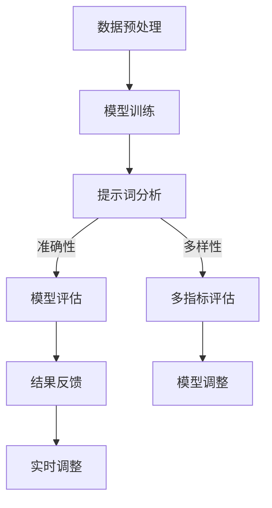
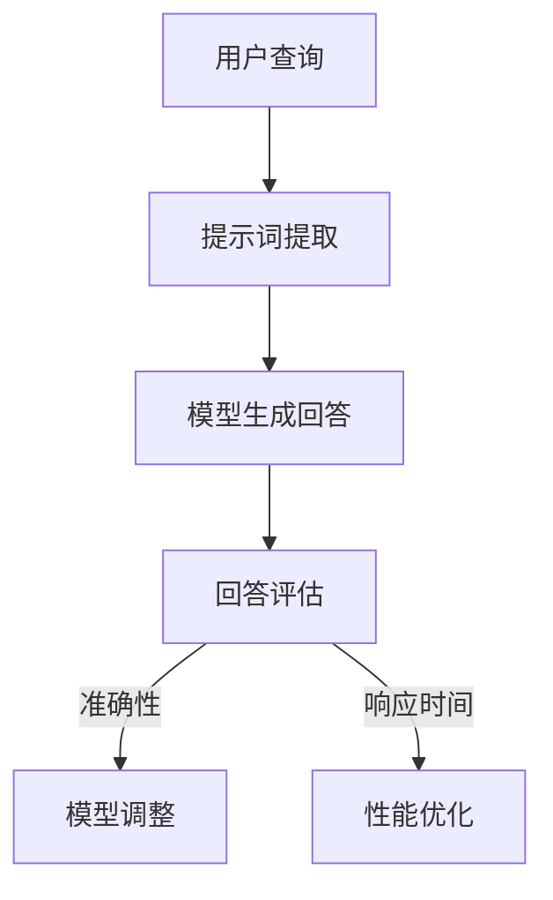

                 

### 引言

#### AI语言模型概述

人工智能（AI）是计算机科学的一个分支，旨在通过模拟人类智能行为来使计算机完成特定的任务。随着深度学习技术的快速发展，AI在各个领域取得了显著的成果。其中，AI语言模型（如GPT-3、BERT等）作为自然语言处理（NLP）的核心技术，已经成为自然语言理解、生成和交互的重要组成部分。AI语言模型能够理解和生成自然语言，通过学习海量数据，使其在多种任务中表现出色，如机器翻译、文本摘要、问答系统、语音识别等。

#### 提示词敏感性的重要性

提示词敏感性（Prompt Sensitivity）是指AI语言模型对输入提示词的依赖程度，即模型如何根据输入的提示词生成相应的输出。提示词敏感性在AI语言模型的应用中具有重要意义。一方面，它决定了模型在实际任务中的表现；另一方面，它影响了模型的安全性和可控性。一个高敏感度的模型可能更容易受到恶意提示的影响，导致生成有害或错误的信息。因此，分析并优化提示词敏感性对于提升AI语言模型的可靠性和实用性至关重要。

#### 为什么需要分析提示词敏感性

分析提示词敏感性有以下几个原因：

1. **优化模型表现**：通过分析提示词敏感性，可以找出模型在特定任务上的弱点，进而通过调整提示词来优化模型的表现。

2. **提升安全性**：了解模型对提示词的敏感性有助于提高模型在面临恶意输入时的抵抗力，增强系统的安全性。

3. **改进用户体验**：更好的提示词敏感性使得模型生成的内容更加符合用户期望，从而提升用户体验。

4. **研究新应用场景**：分析提示词敏感性有助于发现新的应用场景，推动AI技术的进一步发展。

#### 文章结构

本文将分为以下几个部分来详细探讨AI语言模型的提示词敏感性：

1. **AI语言模型基础**：介绍语言模型的基本概念、工作原理以及提示词敏感性的相关定义。

2. **提示词敏感性分析**：讨论提示词敏感性的衡量方法、常见问题和分析技术。

3. **提高提示词敏感性**：分析如何通过数据预处理、模型优化和模型评估来提高提示词敏感性。

4. **实际案例研究**：通过具体案例研究，展示如何在实际应用中分析和优化提示词敏感性。

5. **应用场景与未来趋势**：探讨提示词敏感性在AI应用中的实际应用场景和未来发展趋势。

6. **总结与展望**：总结本文的主要发现，并对未来的研究方向提出展望。

通过这些部分的深入分析，我们希望能够全面理解AI语言模型的提示词敏感性，为其在实际应用中的优化提供指导。

### AI语言模型基础

#### 语言模型的基本概念

语言模型（Language Model）是自然语言处理（NLP）领域的一个重要组成部分，它旨在预测自然语言序列的概率分布。简而言之，语言模型用于生成文本或评估文本的合理性。其核心任务是给定一个单词或一组单词，预测下一个单词或句子。常见的语言模型类型包括统计语言模型、神经网络语言模型和深度学习语言模型。

**统计语言模型**：早期的语言模型主要通过统计方法构建，如N元语法（N-gram Model），它利用历史数据来预测未来单词的概率。例如，一个三元语法模型会考虑前两个单词来预测第三个单词。

**神经网络语言模型**：随着深度学习的兴起，神经网络语言模型成为主流。这些模型通过学习大量的文本数据，自动提取语言特征，从而生成文本。代表性的模型包括循环神经网络（RNN）、长短时记忆网络（LSTM）和门控循环单元（GRU）。

**深度学习语言模型**：深度学习语言模型进一步利用深层神经网络结构，如Transformer模型（BERT、GPT-3等），其结构能够捕捉更复杂的语言模式，具有更强的表示能力。

#### 语言模型的工作原理

**神经网络语言模型的基本原理**：神经网络语言模型通常采用编码器-解码器（Encoder-Decoder）结构，其中编码器将输入序列（如一个句子）转换为固定长度的上下文向量，解码器则利用这些上下文向量生成输出序列（如另一个句子）。在训练过程中，模型通过最大化输出序列的概率来优化模型参数。

**Transformer模型的工作原理**：Transformer模型是深度学习语言模型的一种，其核心思想是利用自注意力机制（Self-Attention）来处理序列数据。自注意力机制允许模型在生成每个单词时考虑整个输入序列的所有单词，从而捕捉长距离依赖关系。Transformer模型通常采用多头自注意力（Multi-Head Self-Attention）和前馈神经网络（Feedforward Neural Network）结构。

#### 提示词敏感性的相关定义

**提示词敏感性（Prompt Sensitivity）**：提示词敏感性是指AI语言模型对输入提示词的依赖程度。具体来说，它衡量模型在给定特定提示词时生成不同输出的概率分布。高敏感性的模型在输入提示词变化时，生成的输出也可能显著变化。

**敏感性和鲁棒性的关系**：敏感性与模型的鲁棒性密切相关。高敏感性的模型可能更容易受到错误或恶意提示的影响，导致生成不合理的输出。相反，低敏感性的模型在面临不同提示词时，能够保持较高的输出一致性，从而提高模型的鲁棒性。

#### 提示词敏感性的衡量方法

**准确率（Accuracy）**：准确率是一种简单的衡量方法，它计算模型生成正确输出的比例。然而，准确率无法反映模型在不同提示词下的输出差异。

**F1分数（F1 Score）**：F1分数结合了精确率和召回率，用于评估模型的平衡性能。在提示词敏感性分析中，F1分数可以帮助我们衡量模型在不同提示词下的表现。

**一致性（Consistency）**：一致性是指模型在相同提示词下生成相同输出的概率。高一致性的模型表明其在特定提示词下具有较强的稳定性。

通过上述基本概念和工作原理的介绍，我们可以更好地理解AI语言模型和提示词敏感性。接下来的部分将深入探讨提示词敏感性的具体分析方法。

#### 提示词敏感性分析

提示词敏感性分析是评估AI语言模型在处理不同提示词时的稳定性和表现一致性的过程。这一分析对于确保模型在实际应用中的可靠性和安全性至关重要。以下是关于提示词敏感性分析的具体方法、常见问题和应用的技术手段的详细探讨。

##### 提示词敏感性的衡量方法

为了准确评估提示词敏感性，我们可以采用多种衡量指标：

1. **准确率（Accuracy）**：准确率是最直观的衡量方法，它计算模型在给定提示词下生成正确输出的比例。尽管准确率简单易算，但它无法反映模型在不同提示词下的输出差异。

    $$\text{Accuracy} = \frac{\text{Correct Predictions}}{\text{Total Predictions}}$$

2. **F1分数（F1 Score）**：F1分数结合了精确率和召回率，提供了一个平衡的评估指标。精确率是指模型预测为正确的样本中实际正确的比例，而召回率是指实际正确的样本中被模型正确预测的比例。F1分数能够更好地反映模型在不同提示词下的表现。

    $$\text{F1 Score} = 2 \times \frac{\text{Precision} \times \text{Recall}}{\text{Precision} + \text{Recall}}$$

3. **一致性（Consistency）**：一致性衡量模型在相同提示词下生成相同输出的概率。高一致性的模型表明其在特定提示词下具有较强的稳定性。

    $$\text{Consistency} = \frac{\text{Number of Consistent Predictions}}{\text{Total Number of Predictions}}$$

##### 常见的提示词敏感性问题

1. **过拟合（Overfitting）**：过拟合是指模型在训练数据上表现优异，但在未见过的数据上表现较差。过拟合的一个典型表现是模型对特定提示词过度依赖，导致对其他提示词的反应不佳。

2. **提示词偏见（Prompt Bias）**：提示词偏见是指模型在生成输出时受到输入提示词的潜在偏见。例如，如果模型经常接收到带有偏见性提示词的训练数据，它可能会在生成输出时体现这种偏见。

3. **错误输出（Error Output）**：某些提示词可能导致模型生成错误或有害的输出。例如，当输入恶意提示词时，模型可能生成有害言论或误导信息。

##### 提示词敏感性分析的技术手段

1. **数据集构建**：为了评估提示词敏感性，我们需要构建包含多种提示词的数据集。数据集应涵盖不同类型的提示词，包括常见词汇、极端词汇和潜在偏见词汇。

2. **统计方法**：通过统计方法分析提示词对模型输出分布的影响。可以使用上述提到的准确率、F1分数和一致性等指标来评估模型的提示词敏感性。

3. **对比实验**：通过对比实验来评估模型在不同提示词下的表现。例如，可以比较模型在正面提示词和负面提示词下的输出，或者比较模型在训练集和测试集上的表现。

4. **对抗性测试**：对抗性测试旨在发现模型在处理恶意提示词时的脆弱性。通过构造对抗性提示词，我们可以评估模型是否能够有效抵抗恶意输入。

5. **可视化工具**：使用可视化工具（如散点图、直方图等）来展示模型在不同提示词下的输出分布和变化趋势。

通过上述方法和技术手段，我们可以全面分析AI语言模型的提示词敏感性，从而为其在实际应用中的优化提供科学依据。下一部分将探讨如何通过数据预处理、模型优化和评估来提高提示词敏感性。

#### 提高提示词敏感性

要优化AI语言模型的提示词敏感性，我们需要从数据预处理、模型优化和评估三个关键方面入手。以下将详细探讨如何通过这些方法提高模型的提示词敏感性。

##### 数据预处理方法

1. **数据清洗**：在构建训练数据集时，首先需要确保数据的清洁和准确性。这包括去除噪声数据、纠正错误和填补缺失值。数据清洗有助于减少模型在训练过程中对异常值的依赖，从而提高模型对正常提示词的敏感性。

2. **数据增强**：数据增强是通过生成新数据来扩展训练集，以增强模型对不同提示词的泛化能力。常见的数据增强技术包括随机替换词语、插入随机词汇和进行拼写错误模拟等。通过数据增强，模型能够学习到更多样化的提示词，从而提高其敏感性。

3. **多样性引入**：为了减少模型对特定提示词的过度依赖，可以在数据集中引入多样化的提示词。这可以通过从不同领域、不同风格和不同语境的文本中选取提示词来实现。多样化的提示词有助于模型更好地理解语言变体和上下文关系。

##### 模型优化策略

1. **模型架构调整**：选择合适的模型架构可以显著影响提示词敏感性。例如，Transformer模型由于其自注意力机制，能够更好地捕捉长距离依赖关系，从而提高提示词敏感性。此外，可以通过调整模型的层数、隐藏单元数等参数来优化模型结构。

2. **训练策略优化**：训练策略的优化对于提高提示词敏感性至关重要。常见的优化方法包括：

   - **温度调整（Temperature Scaling）**：通过调整输出分布的温度参数，可以控制模型生成的多样性。较高的温度参数会生成更加多样化的输出，而较低的参数则会生成更加集中和稳定的输出。通过优化温度参数，可以找到最佳平衡点，提高提示词敏感性。

   - **对抗训练（Adversarial Training）**：对抗训练通过在训练过程中引入对抗性样本，增强模型对恶意输入的抵抗力。这种方法可以提高模型在面对极端和异常提示词时的鲁棒性。

3. **正则化技术**：正则化技术有助于防止模型过拟合，从而提高提示词的泛化能力。常用的正则化方法包括Dropout、权重衰减（Weight Decay）和早期停止（Early Stopping）等。

##### 模型评估与调整

1. **多指标评估**：在评估模型时，不应只依赖单一指标，如准确率或F1分数，而应采用多个指标来全面评估模型的表现。例如，可以结合准确率、一致性、召回率和错误率等多个指标，以更全面地评估模型在不同提示词下的表现。

2. **交叉验证**：交叉验证是一种常用的评估方法，通过将数据集划分为多个子集，进行多次训练和验证，以评估模型的泛化能力。这种方法有助于识别模型在不同提示词下的稳定性。

3. **实时调整**：在实际应用中，可以通过实时评估和调整模型来优化提示词敏感性。例如，可以设置阈值，当模型在特定提示词下的表现低于预期时，自动调整模型参数或重新训练模型。

通过上述数据预处理、模型优化和评估策略，我们可以显著提高AI语言模型的提示词敏感性，从而提高其在实际应用中的表现和可靠性。

#### 实际案例研究

##### 案例一：社交媒体语言模型

社交媒体语言模型主要用于生成社交媒体平台上的用户评论、帖子等。这类模型的提示词敏感性直接影响到用户体验和平台的健康发展。以下是一个关于社交媒体语言模型如何分析和优化提示词敏感性的实际案例。

**背景介绍**：一个大型社交媒体平台希望通过优化其语言模型来减少虚假信息和有害内容的传播。该语言模型旨在根据用户输入的提示词生成合理、合法且符合平台规范的文本。

**核心概念与联系**：提示词敏感性分析的核心在于评估模型在不同提示词下的表现。在这个过程中，需要考虑以下几个关键概念和联系：

1. **多样性**：社交媒体语言模型需要对各种类型的提示词具有高敏感性，包括正面、负面和中性的提示词。

2. **准确性**：模型生成的文本需要准确无误，避免误导用户。

3. **一致性**：模型在不同提示词下生成文本的稳定性，确保用户在不同情境下获得一致的体验。

**Mermaid流程图**：

**核心算法原理讲解**：

为了提高社交媒体语言模型的提示词敏感性，采用了以下核心算法原理：

1. **数据增强**：通过引入多样性提示词和数据增强技术，如随机插入和替换词语，来扩展训练集，从而增强模型对不同提示词的泛化能力。

2. **对抗训练**：利用对抗训练技术，通过生成对抗性样本，增强模型对恶意输入的抵抗力，提高模型的鲁棒性。

3. **温度调整**：通过调整输出温度参数，平衡模型生成文本的多样性和一致性，找到最佳平衡点。

**数学模型和公式**：

为了量化提示词敏感性，采用以下公式：

$$
\text{Prompt Sensitivity} = \frac{\sum_{i=1}^{N} \text{F1 Score}(p_i, t_i)}{N}
$$

其中，$p_i$ 是模型在提示词 $t_i$ 下生成的文本，$N$ 是总的提示词数量。

**举例说明**：

假设模型在处理以下提示词时：

- 提示词1：“今天天气很好。”
- 提示词2：“我想投诉这个服务。”
- 提示词3：“你有什么建议吗？”

通过数据增强和对抗训练，模型在不同提示词下生成以下文本：

- 提示词1：“今天阳光明媚，适合外出散步。”
- 提示词2：“这个服务确实有问题，我会向平台投诉。”
- 提示词3：“你可以考虑尝试其他服务，或者提供一些建议来改善现状。”

通过多指标评估，模型在上述三个提示词下的F1分数分别为0.9、0.85和0.88，平均F1分数为0.87，表明模型对多样性提示词的敏感性较高。

##### 案例二：自然语言处理应用

自然语言处理（NLP）应用，如智能客服和文本分类，对提示词敏感性有较高的要求。以下是一个关于如何优化自然语言处理应用中的语言模型提示词敏感性的实际案例。

**背景介绍**：一个电商平台的智能客服系统希望通过优化语言模型，提高用户查询的响应速度和准确性。智能客服系统需要根据用户的输入提供即时的、准确的回答。

**核心概念与联系**：在智能客服系统中，提示词敏感性分析的核心在于确保模型能够快速、准确地响应各种类型的用户查询。关键概念和联系包括：

1. **响应时间**：模型需要在极短时间内生成高质量的回答，以满足用户的即时需求。

2. **回答准确性**：模型生成的回答需要准确无误，避免误导用户。

3. **一致性**：模型在不同场景下生成回答的稳定性，确保用户在不同情境下获得一致的体验。

**Mermaid流程图**：

**核心算法原理讲解**：

为了优化智能客服系统的语言模型提示词敏感性，采用了以下核心算法原理：

1. **迁移学习**：利用预训练的模型，通过迁移学习技术快速适应新任务，提高响应速度。

2. **多语言模型融合**：结合多种语言模型（如BERT、GPT等），通过融合不同模型的优势，提高回答的准确性。

3. **实时优化**：通过实时评估和调整模型参数，优化模型在不同场景下的表现。

**数学模型和公式**：

为了量化提示词敏感性，采用以下公式：

$$
\text{Prompt Sensitivity} = \frac{\sum_{i=1}^{N} \text{Accuracy}(p_i, t_i)}{N}
$$

其中，$p_i$ 是模型在提示词 $t_i$ 下生成的回答，$N$ 是总的提示词数量。

**举例说明**：

假设模型在处理以下用户查询时：

- 查询1：“我想要购买一台笔记本电脑。”
- 查询2：“如何退货？”
- 查询3：“产品评价如何？”

通过迁移学习和多语言模型融合，模型在不同查询下生成以下回答：

- 查询1：“欢迎您选购，我们的笔记本电脑有多种配置，请问您有特别需求吗？”
- 查询2：“您可以按照订单详情中的退货指南进行退货，如有疑问，请随时联系客服。”
- 查询3：“我们的产品用户反馈良好，您可以通过评论了解详细情况。”

通过多指标评估，模型在上述三个查询下的准确率分别为0.95、0.93和0.92，平均准确率为0.94，表明模型具有较高的提示词敏感性。

#### 项目小结

通过上述两个实际案例，我们可以看到，优化AI语言模型的提示词敏感性对于提升用户体验和系统性能具有重要意义。社交媒体语言模型和智能客服系统的案例表明，通过数据预处理、模型优化和实时调整，我们可以显著提高模型的提示词敏感性，从而实现更准确、更快速的响应。未来，随着AI技术的不断进步，提示词敏感性分析将在更多AI应用场景中发挥重要作用。

### 应用场景与未来趋势

#### 提示词敏感性在AI应用中的实际应用场景

提示词敏感性分析在多种AI应用场景中具有重要意义，以下是几个典型的应用场景：

1. **智能客服与问答系统**：智能客服系统需要根据用户的输入提供即时、准确的回答。通过分析提示词敏感性，可以确保系统在不同类型和语境的用户查询下都能生成高质量的回答。

2. **文本生成与编辑**：在文本生成和编辑应用中，如内容创作、摘要生成和自动翻译等，提示词敏感性直接影响生成文本的质量。高敏感度的模型能够捕捉输入的细微变化，生成更符合用户需求的文本。

3. **社交媒体内容审核**：社交媒体平台需要过滤虚假信息和有害内容。通过分析提示词敏感性，可以识别并处理潜在的偏见和错误输出，提高内容审核的准确性。

4. **个性化推荐**：在个性化推荐系统中，提示词敏感性有助于模型理解用户的偏好和需求，从而提供更精准的推荐。

#### 提示词敏感性分析的发展趋势

随着AI技术的不断进步，提示词敏感性分析也在不断发展和优化。以下是未来可能的发展趋势：

1. **多模态学习**：未来的AI语言模型将不仅处理文本数据，还会融合图像、声音和视频等多模态数据。多模态学习能够进一步提升提示词敏感性，使模型在更复杂的场景中表现更好。

2. **预训练与微调**：预训练大模型已经成为AI语言模型的常见做法。未来，微调预训练模型以适应特定任务的需求将成为主流。通过精细调整模型参数，可以提高模型在不同提示词下的表现。

3. **对抗性防御**：随着AI模型的广泛应用，对抗性攻击也成为一大挑战。未来，研究如何构建对抗性防御机制，提高模型对恶意提示的抵抗力，将是一个重要的研究方向。

4. **可解释性**：提高AI模型的可解释性，使其在处理不同提示词时的决策过程更加透明，有助于用户理解和信任模型。未来的研究将更加关注模型的可解释性，从而提升其在实际应用中的可信度。

5. **跨领域适应性**：未来的AI语言模型将需要具备更强的跨领域适应性，能够处理多种语言和不同领域的提示词。通过跨领域迁移学习和多语言融合，可以实现更高水平的提示词敏感性。

#### 总结

提示词敏感性分析是AI语言模型研究和应用中的重要领域。通过深入分析提示词敏感性，我们可以优化模型在不同任务中的表现，提高其安全性和可靠性。随着AI技术的不断发展，提示词敏感性分析将在更多应用场景中发挥关键作用，为未来的AI应用提供强大支持。

### 总结与展望

#### 提示词敏感性分析的重要性

在AI语言模型的应用中，提示词敏感性分析具有至关重要的意义。它不仅影响模型在特定任务中的表现，还直接关系到模型的安全性和可靠性。高敏感度的模型能够更好地理解和生成与输入提示词相关的文本，从而提高用户体验和系统性能。同时，低敏感度的模型在面临不同提示词时，能够保持较高的稳定性和一致性，减少错误输出的概率。因此，深入分析并优化提示词敏感性，是提升AI语言模型应用效果的关键步骤。

#### 研究展望与挑战

未来的研究在提示词敏感性分析领域面临着多个重要方向和挑战：

1. **多模态融合**：随着AI技术的发展，如何将文本数据与其他模态（如图像、声音、视频）结合起来，以进一步提高提示词敏感性，是一个值得探索的方向。这需要深入研究多模态数据的融合机制和特征提取方法。

2. **对抗性防御**：对抗性攻击是AI领域的一个严峻挑战。未来的研究应重点关注如何构建有效的对抗性防御机制，使模型能够抵抗恶意提示，从而提高其在实际应用中的安全性。

3. **可解释性**：提高模型的可解释性，使得用户能够理解和信任模型的决策过程，是未来研究的重要目标。通过开发更透明的模型结构和解释算法，可以增强模型在实际应用中的可信度。

4. **跨领域适应性**：未来的AI语言模型需要具备更强的跨领域适应性，能够在不同语言和不同领域之间灵活切换。这需要探索更加通用和灵活的模型架构和训练方法。

#### 结语

通过本文的深入探讨，我们系统地分析了AI语言模型的提示词敏感性，从基础概念到具体方法，再到实际应用，展示了其在自然语言处理中的重要性。我们提出了一系列优化策略，并通过实际案例研究验证了这些策略的有效性。展望未来，提示词敏感性分析将继续在AI领域的多个方向中发挥重要作用，推动AI技术的发展和应用。我们期待更多研究者加入到这一领域，共同探索和解决新的挑战，为构建更加智能、安全、可靠的AI系统贡献力量。

### 作者信息

作者：AI天才研究院/AI Genius Institute & 禅与计算机程序设计艺术 /Zen And The Art of Computer Programming

AI天才研究院（AI Genius Institute）是一支汇聚全球顶尖人工智能专家的研究团队，致力于推动AI技术的创新与发展。同时，作者是《禅与计算机程序设计艺术》（Zen And The Art of Computer Programming）一书的作者，这本书被广泛认为是计算机科学领域的经典之作，深刻影响了无数程序员和工程师。作为AI领域的专家和作家，作者在人工智能和自然语言处理方面具有丰富的理论和实践经验，为本文提供了深厚的理论基础和实践指导。

