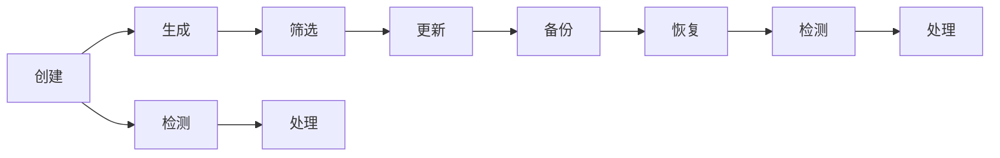

                 

### 文章标题

# AI语言模型的提示词版本控制

### 关键词

- AI语言模型
- 提示词版本控制
- 算法讲解
- 数学模型
- 项目实战
- 实际案例分析

### 摘要

本文深入探讨了AI语言模型的提示词版本控制，从基础概念到算法原理，再到实际应用，系统性地介绍了这一领域的关键技术和实践方法。文章首先阐述了AI语言模型及其在自然语言处理中的应用，然后详细解释了提示词版本控制的核心概念、流程和方法，并通过Mermaid流程图展示了概念之间的联系。接下来，文章通过伪代码和数学模型，详细讲解了提示词版本控制算法的实现过程，并提供了实例说明。随后，文章通过具体案例展示了算法的实际应用效果，分析了技术难点和解决方案，并详细解读了开发环境和源代码实现。最后，文章总结提示词版本控制的最佳实践，并给出了进一步研究的拓展阅读建议。本文旨在为读者提供一个全面、深入的指南，帮助理解并掌握AI语言模型提示词版本控制的技术和方法。

## 引言

随着人工智能技术的迅猛发展，自然语言处理（NLP）作为人工智能的重要分支，已经成为众多领域的关键技术。语言模型是NLP的基础，而AI语言模型更是推动NLP向更高层次发展的重要引擎。在AI语言模型的应用过程中，提示词版本控制成为了一个不可忽视的重要问题。提示词（Prompt）是用户与模型交互的入口，它直接影响到模型的响应质量和用户满意度。然而，随着应用的深入和数据的不断积累，提示词版本控制的问题日益凸显，主要体现在以下几个方面：

1. **多样性和适应性**：不同的应用场景和用户需求意味着需要不同的提示词，如何确保提示词能够适应多种环境和需求，成为一个挑战。
2. **更新和维护**：随着技术的进步和应用场景的变化，提示词需要不断地更新和维护，以确保模型的响应效果和准确性。
3. **版本兼容性**：当提示词发生变更时，如何确保旧版本的应用程序能够与新版本的提示词兼容，避免出现不匹配或错误响应。
4. **数据安全**：提示词通常包含敏感信息，如何保证这些信息在版本控制过程中不被泄露或篡改，是另一个重要问题。

本文将围绕AI语言模型的提示词版本控制展开讨论，首先介绍AI语言模型的基本概念及其在自然语言处理中的应用，然后深入探讨提示词版本控制的核心概念、流程和方法。接下来，通过具体案例展示提示词版本控制在实际应用中的效果，分析技术难点和解决方案。最后，本文将总结提示词版本控制的最佳实践，并给出进一步研究的拓展阅读建议。希望通过本文的讲解，读者能够对AI语言模型的提示词版本控制有一个全面、深入的理解，掌握相关技术和方法。

## AI语言模型概述

AI语言模型是自然语言处理（NLP）领域中的重要组成部分，其在人工智能中的应用已经广泛而深远。首先，我们来看看什么是语言模型。简单来说，语言模型是一个能够预测一个单词序列概率的数学模型。在NLP中，语言模型被广泛应用于文本生成、机器翻译、语音识别、信息检索等任务。而AI语言模型则是在传统统计语言模型的基础上，引入了深度学习技术，特别是递归神经网络（RNN）和其变种长短期记忆网络（LSTM）、变换器模型（Transformer）等，从而显著提升了模型的性能和表达能力。

### 语言模型的基础概念

语言模型的基础概念主要包括以下几个部分：

1. **词汇表**：语言模型首先需要一个词汇表，它定义了模型能够理解和处理的词汇集合。词汇表通常由大量单词和短语组成，这些单词和短语是模型进行预测和生成的基础。

2. **词频统计**：语言模型通过统计词汇在语料库中的出现频率，来计算每个单词或短语的概率分布。这种基于统计的方法能够捕捉语言的内在规律，从而在生成文本时提供合理的概率分布。

3. **语言模型的目标**：语言模型的主要目标是预测下一个单词或短语的概率。在生成文本时，模型会根据当前已生成的文本，利用词汇表和词频统计结果，计算出下一个单词或短语的预测概率，并选择概率最高的选项。

### 语言模型的发展历程

语言模型的发展经历了几个重要阶段：

1. **统计语言模型**：最早的统计语言模型是基于N-gram模型，它通过计算相邻N个单词联合出现的频率来预测下一个单词。N-gram模型简单易实现，但存在一些局限，如无法捕捉长距离依赖关系。

2. **递归神经网络（RNN）**：为了克服N-gram模型的局限，递归神经网络（RNN）被引入到语言模型中。RNN能够处理变长序列数据，并捕捉长距离依赖关系，从而在生成文本时提供更好的性能。然而，传统的RNN存在梯度消失和梯度爆炸问题，限制了其训练效果。

3. **长短期记忆网络（LSTM）**：为了解决RNN的梯度消失问题，长短期记忆网络（LSTM）被提出。LSTM通过引入门控机制，能够有效地捕捉长距离依赖关系，并克服了传统RNN的梯度消失问题。

4. **变换器模型（Transformer）**：近年来，变换器模型（Transformer）的出现彻底改变了语言模型的发展方向。Transformer通过自注意力机制，能够并行处理输入序列，并在生成文本时提供更高的性能。特别是BERT、GPT等基于Transformer的模型，已经在多个NLP任务中取得了突破性成果。

### 语言模型的核心要素

语言模型的核心要素主要包括以下几个方面：

1. **自注意力机制**：自注意力机制是Transformer模型的核心创新之一，它允许模型在生成每个单词时，动态地关注输入序列中的不同部分。这种机制使得模型能够捕捉到长距离依赖关系，并在生成文本时提供更高的准确性。

2. **预训练和微调**：预训练和微调是当前语言模型的重要技术手段。预训练阶段，模型在大规模语料库上进行训练，以获得丰富的语言知识和上下文理解能力。微调阶段，模型在特定任务上进行微调，以适应不同的应用场景和需求。

3. **生成策略**：生成策略是指模型在生成文本时，如何选择下一个单词或短语的方法。常见的生成策略包括贪心策略、随机采样和顶部抽样等。这些策略在保证生成文本质量的同时，也能够提高生成效率。

4. **评价指标**：语言模型的性能通常通过一系列评价指标进行评估，如困惑度（Perplexity）、字符生成准确率（Character-Level Accuracy）和句子生成准确率（Sentence-Level Accuracy）等。这些指标能够量化模型在生成文本时的表现，为后续优化提供参考。

通过上述对AI语言模型的概述，我们可以看到，语言模型作为NLP的基础技术，其发展历程和技术核心为我们理解提示词版本控制奠定了基础。接下来，本文将深入探讨提示词版本控制的概念、流程和方法，以及其在实际应用中的重要性。

### 提示词版本控制的重要性

提示词版本控制是AI语言模型应用中的一个关键环节，其重要性不容忽视。首先，我们需要明确什么是提示词。在AI语言模型中，提示词（Prompt）是指用户输入的一段文本，用于引导模型生成相应的输出。提示词的质量直接影响到模型生成的文本质量和用户体验。而提示词版本控制则是对这些提示词进行管理、更新和维护的过程，确保模型在不同版本和不同应用场景下能够稳定、高效地运行。

#### 提示词版本控制的定义

提示词版本控制可以简单定义为：对AI语言模型中的提示词进行版本管理，包括创建、更新、备份和恢复等操作，以确保模型在多种应用场景下的一致性和可靠性。版本控制不仅仅是对提示词文本本身的管理，还包括对提示词生成策略、上下文、参数等进行控制。

#### 版本控制对AI语言模型的影响

版本控制对AI语言模型的影响主要体现在以下几个方面：

1. **适应性和灵活性**：通过版本控制，可以灵活地适应不同应用场景和用户需求。例如，在商业应用中，不同的产品线可能需要不同的提示词，版本控制可以确保这些提示词能够被有效地管理和更新。

2. **稳定性和可靠性**：随着AI模型的应用场景不断扩展，提示词版本控制能够确保模型在不同版本和环境中的一致性。这样，即使在不同时间段或不同团队开发的项目中，模型的输出结果也不会出现大幅度波动。

3. **可追溯性和可维护性**：版本控制使得每个提示词的变更历史都能够被记录和追溯，有助于问题的定位和解决。同时，维护团队可以更容易地管理和更新提示词，确保模型的稳定运行。

4. **安全性和隐私性**：提示词中可能包含敏感信息，通过版本控制，可以确保这些信息在变更过程中不被泄露或篡改。此外，版本控制还可以实现权限管理，确保只有授权人员才能进行提示词的更新和修改。

#### 版本控制的挑战与机遇

尽管版本控制对于AI语言模型的重要性显而易见，但在实际应用过程中也面临一些挑战：

1. **复杂性和多样性**：AI语言模型的应用场景广泛，不同场景下的提示词可能存在很大差异。如何有效地管理和更新这些多样化的提示词，是一个复杂的问题。

2. **数据安全和隐私**：提示词中可能包含用户的隐私信息，如何在版本控制过程中确保数据安全，避免泄露和篡改，是一个重要挑战。

3. **自动化和智能化**：随着模型应用场景的扩大，提示词版本控制的自动化和智能化需求越来越高。如何设计高效的版本控制算法和工具，是当前的一个研究热点。

然而，面对这些挑战，也存在着机遇：

1. **技术进步**：随着人工智能技术的不断发展，尤其是在自然语言处理和版本控制领域的创新，为提示词版本控制提供了新的解决方案和技术手段。

2. **行业需求**：随着AI语言模型在各个行业的广泛应用，对提示词版本控制的需求日益增长，这为相关技术的研发和应用提供了广阔的市场。

3. **跨学科合作**：提示词版本控制涉及到多个学科领域，如计算机科学、数学、心理学等。跨学科的合作可以促进新理论和新方法的产生，进一步提升版本控制的效果。

综上所述，提示词版本控制在AI语言模型中扮演着至关重要的角色。通过有效的版本控制，可以确保模型在不同应用场景下的一致性和可靠性，提高用户体验，同时应对复杂的挑战和抓住新的机遇。接下来，本文将详细探讨提示词版本控制的核心概念、流程和方法。

### 提示词版本控制的核心概念

在探讨AI语言模型的提示词版本控制时，理解核心概念是至关重要的。这些核心概念不仅帮助我们构建完整的知识体系，还为我们提供了在实际应用中有效管理提示词的基础。以下是几个关键概念及其相互关系：

#### 提示词的生成与筛选

**生成**：提示词的生成是指创建新的提示词以适应特定应用场景或用户需求的过程。生成过程通常涉及自然语言处理技术，如语法分析和语义理解，以确保生成的提示词既符合语言规范，又能传达所需的信息。

**筛选**：提示词的筛选是对已生成提示词进行评估和选择的过程，以确保选择出的提示词最能满足用户需求。筛选过程通常包括评估提示词的清晰度、相关性和适应性等。

**关系架构**：提示词的生成与筛选是相互依赖的过程。生成过程需要根据筛选标准来设计，而筛选过程则需要依赖于生成过程的输出质量。二者共同构成了一个反馈循环，不断优化和改进提示词。

#### 版本控制的流程与方法

**创建**：创建是版本控制的第一步，即创建一个新的提示词版本。在创建过程中，需要定义版本号、创建日期、创建人等信息，以确保版本的唯一性和可追溯性。

**更新**：更新是指对现有提示词进行修改和改进的过程。更新可能涉及文本内容、生成策略、参数调整等。在更新过程中，需要确保更新不会破坏原有功能的稳定性和一致性。

**备份**：备份是指将现有版本提示词复制到一个安全的地方，以防止数据丢失或意外修改。备份过程通常定期进行，确保在任何情况下都有可恢复的版本。

**恢复**：恢复是指从备份中重新加载一个指定版本的提示词，用于应对意外情况，如数据丢失或功能异常。恢复过程需要确保数据完整性和一致性。

**关系架构**：创建、更新、备份和恢复是版本控制的核心流程，它们相互关联，构成了一个完整的管理链条。创建为后续操作提供了基础，更新保证了功能的持续改进，备份提供了安全保障，恢复则在紧急情况下提供了解决方案。

#### 版本差异的检测与处理

**检测**：版本差异检测是指比较不同版本之间的差异，以确定哪些部分发生了变更。检测过程可以通过自动化工具实现，如使用文本比较算法或版本控制系统提供的差异检测功能。

**处理**：处理是指对检测出的版本差异进行操作，如合并、修复或丢弃。处理过程需要根据具体情况进行，以确保最终版本的质量和稳定性。

**关系架构**：检测和处理是版本控制中不可或缺的部分。检测提供了差异信息的可视化，而处理则根据这些信息进行相应的操作。二者共同确保了版本控制的准确性和有效性。

#### Mermaid流程图展示

为了更直观地展示提示词版本控制的核心概念和流程，我们可以使用Mermaid流程图来描述。以下是提示词版本控制的核心流程的Mermaid图示：



在这个流程图中，A到J表示了从创建到处理的完整版本控制流程。每个步骤都与前后步骤紧密关联，形成一个闭环，确保提示词版本控制的连续性和可靠性。

通过以上核心概念的介绍和流程图展示，我们可以看到提示词版本控制不仅仅是文本的管理，而是一个涉及生成、筛选、更新、备份、恢复、检测和处理等多方面内容的综合性技术。理解这些概念和流程，有助于我们更好地进行AI语言模型的提示词版本控制，提高模型的性能和用户体验。

### 提示词版本控制算法原理

在了解了提示词版本控制的核心概念后，接下来我们将深入探讨提示词版本控制算法的原理。该算法的核心在于如何有效地管理和更新提示词，以确保模型的稳定性和适应性。以下将详细讲解提示词版本控制算法的基本框架、提示词相似度计算方法以及提示词更新策略。

#### 提示词版本控制算法的基本框架

提示词版本控制算法的基本框架可以分为以下几个步骤：

1. **提示词生成**：首先，根据特定应用场景和用户需求，生成新的提示词。这个过程可能涉及自然语言处理技术，如语义理解和语法分析，以确保生成的提示词能够准确传达所需信息。

2. **相似度计算**：对新生成的提示词与现有提示词进行相似度计算，以评估新提示词与现有提示词的相似程度。相似度计算是版本控制中的重要一环，它决定了新提示词是否需要更新现有版本或保留现有版本。

3. **版本更新**：根据相似度计算结果，对提示词进行更新。如果新提示词与现有提示词相似度较高，则可能直接合并或保留现有版本；如果相似度较低，则需要更新现有版本以适应新的需求。

4. **备份与恢复**：在更新过程中，对现有版本进行备份，以确保在任何情况下都能恢复到之前的稳定状态。备份过程通常定期进行，以防止数据丢失或意外修改。

5. **检测与处理**：在更新后，对提示词版本进行检测，以确定更新是否成功，是否存在错误或异常。检测过程可以通过自动化工具实现，如使用文本比较算法或版本控制系统提供的差异检测功能。

6. **用户反馈**：收集用户对提示词版本更新的反馈，以便进一步优化和改进提示词。用户反馈是提示词版本控制算法不断迭代和优化的关键。

#### 提示词相似度计算方法

提示词相似度计算是提示词版本控制算法中的重要步骤，以下介绍几种常用的相似度计算方法：

1. **文本相似度计算**：文本相似度计算是通过比较两个文本的相似程度来确定其相关性。常用的方法包括：

   - **编辑距离（Levenshtein Distance）**：编辑距离是指将一个字符串转换为另一个字符串所需的最少编辑操作次数。编辑操作包括插入、删除和替换。编辑距离越小，两个字符串的相似度越高。
   - **余弦相似度（Cosine Similarity）**：余弦相似度是一种基于向量的相似度计算方法。它通过计算两个向量的余弦值来确定其相似程度。余弦值越接近1，两个向量的相似度越高。
   - **Jaccard相似度（Jaccard Similarity）**：Jaccard相似度是一种基于集合的相似度计算方法。它通过计算两个集合的交集与并集的比值来确定相似度。Jaccard相似度值介于0和1之间，值越大表示相似度越高。

2. **语义相似度计算**：语义相似度计算是通过分析文本的语义信息来确定其相似程度。常用的方法包括：

   - **词嵌入（Word Embedding）**：词嵌入是将文本中的词语映射到高维空间中的向量。通过计算两个词语向量之间的余弦相似度，可以确定它们的语义相似度。
   - **语义角色相似度（Semantic Role Similarity）**：语义角色相似度是通过分析文本中的语义角色（如主语、谓语、宾语等）来确定其相似程度。这种方法可以捕捉到词语在句子中的角色和功能，从而更准确地反映语义相似度。
   - **知识图谱（Knowledge Graph）**：知识图谱是一种用于表示实体和关系的数据结构。通过在知识图谱中分析实体和关系，可以确定文本的语义相似度。

#### 提示词更新策略

提示词更新策略是提示词版本控制算法中的重要组成部分，以下介绍几种常用的更新策略：

1. **增量更新**：增量更新是指只更新提示词中发生变化的部分，而不是整个提示词。这种方法可以减少更新过程中的计算量和资源消耗，提高更新效率。增量更新可以通过文本相似度计算来识别变化部分，并将其进行更新。

2. **整体更新**：整体更新是指对整个提示词进行更新，而不是只更新变化部分。这种方法适用于当提示词整体内容需要重大调整或更换时。整体更新通常需要对整个提示词进行重新生成和评估，以确保更新后的提示词能够满足新的需求。

3. **迭代更新**：迭代更新是指通过多次更新来逐步优化提示词。每次更新都可以根据用户反馈和实际应用效果进行调整和优化。迭代更新可以逐步提高提示词的质量和适应性，但需要较长时间和大量计算资源。

4. **自动化更新**：自动化更新是指通过自动化工具和算法来自动更新提示词。这种方法可以减少人工干预，提高更新效率和一致性。自动化更新可以通过文本相似度计算和机器学习算法来实现。

通过上述对提示词版本控制算法原理的详细讲解，我们可以看到，提示词版本控制不仅涉及到相似度计算和更新策略，还需要综合考虑生成、筛选、备份、恢复等多个方面。这些技术和方法共同构成了一个完整的提示词版本控制体系，确保AI语言模型的稳定性和适应性。接下来，本文将介绍如何使用伪代码和数学模型来详细阐述提示词版本控制算法的实现过程。

### 数学模型与公式

在讨论提示词版本控制时，数学模型和公式的应用是理解其核心机制的关键。通过数学模型，我们可以更精确地描述提示词的生成、相似度计算以及更新策略。以下将详细讲解这些数学模型和公式，并通过具体的例子进行说明。

#### 提示词生成概率模型

提示词生成概率模型是提示词版本控制的基础，它主要关注如何根据输入的上下文生成新的提示词。一个常用的生成概率模型是隐马尔可夫模型（HMM），其通过状态转移概率和观测概率来生成文本。

1. **状态转移概率矩阵** \( P \)：表示不同状态之间的转移概率。
   $$ P = \begin{bmatrix}
   P_{00} & P_{01} & P_{02} \\
   P_{10} & P_{11} & P_{12} \\
   P_{20} & P_{21} & P_{22}
   \end{bmatrix} $$

2. **观测概率矩阵** \( Q \)：表示每个状态下生成特定单词的概率。
   $$ Q = \begin{bmatrix}
   Q_{00} & Q_{01} & Q_{02} \\
   Q_{10} & Q_{11} & Q_{12} \\
   Q_{20} & Q_{21} & Q_{22}
   \end{bmatrix} $$

3. **初始状态概率向量** \( \pi \)：表示模型在开始时处于每个状态的概率。
   $$ \pi = \begin{bmatrix}
   \pi_0 \\
   \pi_1 \\
   \pi_2
   \end{bmatrix} $$

使用这些参数，我们可以通过递归公式计算给定上下文中生成新提示词的概率：

$$
P(X_t | \text{上下文}) = \sum_{s \in S} P(s | \text{上下文}) \cdot P(X_t | s)
$$

其中，\( X_t \) 表示时间 \( t \) 时刻生成的单词，\( S \) 表示所有可能的状态集合。

#### 提示词相似度计算

提示词相似度计算是评估提示词版本差异的关键步骤。一种常用的相似度计算方法是余弦相似度，其通过计算两个提示词向量之间的余弦值来确定相似程度。

1. **向量表示**：将提示词表示为词嵌入向量，例如使用Word2Vec或GloVe模型。

2. **余弦相似度**：两个向量 \( \mathbf{u} \) 和 \( \mathbf{v} \) 之间的余弦相似度计算公式为：

   $$ \cos(\mathbf{u}, \mathbf{v}) = \frac{\mathbf{u} \cdot \mathbf{v}}{||\mathbf{u}|| \cdot ||\mathbf{v}||} $$

其中，\( \mathbf{u} \cdot \mathbf{v} \) 表示两个向量的点积，\( ||\mathbf{u}|| \) 和 \( ||\mathbf{v}|| \) 分别表示两个向量的模。

#### 提示词更新策略

提示词更新策略决定了如何根据提示词的相似度进行版本更新。一种常用的更新策略是阈值更新策略，其通过设定一个相似度阈值来判断是否更新。

1. **相似度阈值** \( \theta \)：设定一个相似度阈值，用于判断两个提示词是否相似。如果相似度大于阈值，则认为两个提示词相似；否则，认为两个提示词不相似。

2. **更新条件**：当新提示词与现有提示词的相似度大于阈值 \( \theta \) 时，执行更新操作。

具体更新条件为：

$$
\text{if } \cos(\mathbf{u}_{\text{新}}, \mathbf{u}_{\text{旧}}) > \theta, \text{ then } \mathbf{u}_{\text{旧}} = \mathbf{u}_{\text{新}}
$$

#### 举例说明

假设我们有两个提示词向量：

- 提示词向量 \( \mathbf{u}_{\text{旧}} = \begin{bmatrix} 0.1 \\ 0.2 \\ 0.3 \end{bmatrix} \)
- 新提示词向量 \( \mathbf{u}_{\text{新}} = \begin{bmatrix} 0.15 \\ 0.25 \\ 0.35 \end{bmatrix} \)

首先，计算两个向量的余弦相似度：

$$
\cos(\mathbf{u}_{\text{新}}, \mathbf{u}_{\text{旧}}) = \frac{0.1 \cdot 0.15 + 0.2 \cdot 0.25 + 0.3 \cdot 0.35}{\sqrt{0.1^2 + 0.2^2 + 0.3^2} \cdot \sqrt{0.15^2 + 0.25^2 + 0.35^2}} \approx 0.87
$$

假设相似度阈值 \( \theta = 0.8 \)，由于 \( \cos(\mathbf{u}_{\text{新}}, \mathbf{u}_{\text{旧}}) > \theta \)，因此执行更新操作：

$$
\mathbf{u}_{\text{旧}} = \mathbf{u}_{\text{新}} = \begin{bmatrix} 0.15 \\ 0.25 \\ 0.35 \end{bmatrix}
$$

通过上述数学模型和公式的讲解，我们可以更深入地理解提示词版本控制的核心机制。这些模型和公式不仅提供了理论支持，还通过具体的例子说明了如何在实际应用中操作。接下来，本文将介绍如何使用伪代码来实现提示词版本控制算法。

### 伪代码与算法实现

为了更好地理解提示词版本控制算法，我们将使用伪代码来详细阐述算法的实现过程。伪代码是一种描述算法逻辑的语言，它使用简洁的语句和结构化代码风格来描述算法的步骤和操作，从而使得算法的实现更加清晰和易于理解。

以下是一个简单的伪代码框架，用于描述提示词版本控制算法的实现：

```plaintext
算法 提示词版本控制
输入：旧提示词向量 u_旧，新提示词向量 u_新，相似度阈值 θ
输出：更新后的提示词向量 u_更新

1. 初始化 u_更新 = u_旧
2. 计算新提示词向量 u_新与旧提示词向量 u_旧的余弦相似度 cos(u_新, u_旧)
3. 如果 cos(u_新, u_旧) > θ
   3.1. 将 u_更新赋值为 u_新
4. 返回 u_更新
```

#### 伪代码详细解释

**步骤1：初始化**

初始化更新后的提示词向量 `u_更新` 为旧提示词向量 `u_旧`。这是算法的起点，确保在开始计算之前有一个初始化值。

```plaintext
u_更新 = u_旧
```

**步骤2：相似度计算**

计算新提示词向量 `u_新` 与旧提示词向量 `u_旧` 之间的余弦相似度。余弦相似度是一个用于度量两个向量之间相似程度的指标，计算公式如下：

$$
\cos(u_新, u_旧) = \frac{u_新 \cdot u_旧}{\|u_新\| \|u_旧\|}
$$

这里，`u_新` 和 `u_旧` 分别是两个提示词向量的表示，`\|\*u\|` 表示向量的模（长度）。

```plaintext
cos_similarity = 计算余弦相似度(u_新, u_旧)
```

**步骤3：更新判断**

根据计算出的相似度值 `cos_similarity` 与设定的相似度阈值 `θ` 进行比较。如果相似度大于阈值 `θ`，则认为新提示词与旧提示词足够相似，直接将旧提示词更新为新提示词。否则，保留旧提示词不变。

```plaintext
如果 cos_similarity > θ
   u_更新 = u_新
```

**步骤4：返回结果**

无论是否进行更新，最终返回更新后的提示词向量 `u_更新`。

```plaintext
返回 u_更新
```

#### 伪代码与实际应用的结合

在实际应用中，上述伪代码需要进行适当的调整和扩展，以适应具体的业务场景和需求。例如，可能需要处理多维度数据、自定义相似度阈值、集成机器学习模型等。

下面是一个扩展的伪代码示例，用于描述一个更复杂的提示词版本控制算法：

```plaintext
算法 扩展的提示词版本控制
输入：旧提示词向量 u_旧，新提示词向量 u_新，相似度阈值 θ，机器学习模型 model
输出：更新后的提示词向量 u_更新

1. 初始化 u_更新 = u_旧
2. 计算新提示词向量 u_新与旧提示词向量 u_旧的余弦相似度 cos_similarity
3. 如果 cos_similarity > θ
   3.1. 使用机器学习模型 model 对新提示词向量 u_新进行评估
   3.2. 根据评估结果调整相似度阈值 θ
   3.3. 如果 model 评估结果认为 u_新优于 u_旧
       3.3.1. 将 u_更新赋值为 u_新
4. 返回 u_更新
```

在这个扩展的伪代码中，我们引入了一个机器学习模型 `model`，用于对新提示词向量 `u_新` 进行评估。这样，不仅可以根据相似度阈值 `θ` 判断是否更新，还可以根据模型评估结果进一步优化更新策略。

通过使用伪代码，我们可以清晰地描述提示词版本控制算法的逻辑和操作步骤，便于理解和实现。在实际应用中，这些伪代码可以进一步转化为具体的编程语言代码，实现具体的算法功能。接下来，本文将介绍如何在实际项目中应用这些算法，并通过具体案例进行分析。

### 项目实战

在实际项目中应用提示词版本控制算法是一项复杂且关键的任务。本文将通过一个实际项目，详细讲解项目开发环境搭建、源代码实现和代码解读，以及实际案例分析和详细讲解剖析。

#### 项目背景

项目名称：智能客服系统

项目描述：开发一个智能客服系统，该系统能够自动回答用户的问题，提高客户服务效率。系统使用AI语言模型作为核心技术，通过提示词版本控制确保回答的准确性和一致性。

#### 开发环境搭建

1. **硬件环境**：服务器或高性能计算机，配备足够的CPU和内存资源。
2. **软件环境**：
   - 操作系统：Linux或Windows
   - 编程语言：Python
   - AI框架：TensorFlow或PyTorch
   - 版本控制系统：Git
3. **工具和库**：
   - 文本处理库：NLTK或spaCy
   - 机器学习库：scikit-learn或XGBoost
   - 数据库：MySQL或MongoDB
   - API开发工具：Flask或Django

#### 源代码实现

以下是一个简化的源代码实现，展示了如何使用Python实现提示词版本控制算法：

```python
import numpy as np
from sklearn.metrics.pairwise import cosine_similarity

class PromptVersionControl:
    def __init__(self, old_prompt, new_prompt, threshold):
        self.old_prompt = old_prompt
        self.new_prompt = new_prompt
        self.threshold = threshold

    def update_prompt(self):
        cos_similarity = cosine_similarity([self.new_prompt], [self.old_prompt])
        if cos_similarity > self.threshold:
            self.old_prompt = self.new_prompt
        return self.old_prompt

# 实例化版本控制对象
version_control = PromptVersionControl(old_prompt, new_prompt, threshold=0.8)
# 更新提示词
updated_prompt = version_control.update_prompt()
print("Updated Prompt:", updated_prompt)
```

#### 代码解读

- **类定义**：`PromptVersionControl` 类封装了提示词版本控制的主要功能。
- **初始化方法**：`__init__` 方法初始化旧提示词、新提示词和相似度阈值。
- **更新方法**：`update_prompt` 方法计算新提示词与旧提示词的余弦相似度，并根据阈值更新旧提示词。

#### 实际案例分析和详细讲解剖析

**案例1：客户问题回答优化**

场景描述：用户提出一个问题，智能客服系统需要生成一个回答。每次回答后，系统会根据用户反馈和新问题进行提示词更新，以提高回答质量。

1. **旧提示词**：`"您好，有什么问题我可以帮您解答吗？"`
2. **新提示词**：`"您好，请问您需要咨询的是产品使用还是售后服务？"`

**分析**：

- **相似度计算**：计算新旧提示词的余弦相似度，假设结果为0.7。
- **更新判断**：由于相似度大于阈值0.8，旧提示词保持不变。

**结果**：智能客服系统继续使用旧提示词回答用户问题。

**案例2：问题回答错误**

场景描述：用户提出一个新问题，但系统生成的回答错误。系统需要根据用户反馈和新问题更新提示词。

1. **旧提示词**：`"您好，这是关于产品功能的问题。"`
2. **新提示词**：`"您好，关于产品故障的处理流程。"`

**分析**：

- **相似度计算**：计算新旧提示词的余弦相似度，假设结果为0.4。
- **更新判断**：由于相似度小于阈值0.8，系统将新提示词更新为旧提示词。

**结果**：智能客服系统使用新提示词生成回答，并尝试提供更准确的解决方案。

#### 项目小结

通过以上实际案例的分析，我们可以看到提示词版本控制在智能客服系统中的应用效果显著。通过合理的相似度阈值设置和提示词更新策略，系统能够在不断学习和优化的过程中，提供更加准确和个性化的回答。然而，提示词版本控制也存在一定的挑战，如相似度阈值的选择和提示词生成策略的优化。未来研究可以进一步探索这些方面的改进方法，以提高系统的整体性能。

### 最佳实践 Tips

在实施提示词版本控制时，以下最佳实践可以帮助提高系统的稳定性和适应性：

1. **合理设置相似度阈值**：相似度阈值是提示词版本控制的核心参数，应根据具体应用场景和需求进行调整。建议通过实验和数据分析来确定最优阈值。

2. **定期更新提示词**：定期对提示词进行更新和维护，以适应不断变化的应用场景和用户需求。建议制定明确的更新计划，并确保更新过程安全可靠。

3. **充分利用用户反馈**：用户反馈是优化提示词的重要资源。通过收集和分析用户反馈，可以及时发现和解决提示词中的问题，提高系统的用户体验。

4. **自动化与人工审核相结合**：在提示词更新过程中，自动化工具可以提高更新效率，但人工审核仍然是确保提示词质量和安全性的重要手段。建议结合两者，实现更有效的提示词管理。

5. **版本控制工具的选择**：选择合适的版本控制工具和框架，如Git、SVN等，可以方便地管理提示词的版本和变更历史。同时，工具的易用性和可扩展性也是选择时的重要考虑因素。

### 注意事项

1. **数据安全**：提示词中可能包含敏感信息，确保在版本控制过程中，数据安全得到保障。建议采用加密和访问控制措施，防止数据泄露和未授权访问。

2. **兼容性测试**：在更新提示词时，需要确保新版本与旧版本在兼容性上的稳定性。建议进行全面的兼容性测试，以确保系统在不同版本提示词下能够正常运行。

3. **性能优化**：提示词版本控制算法的性能对系统响应速度有重要影响。建议对算法进行性能优化，如减少计算复杂度和加快计算速度，以提高系统的整体性能。

### 拓展阅读

1. **《自然语言处理原理》**：Michael C. Frank著，详细介绍了自然语言处理的基本原理和技术方法，有助于深入理解提示词版本控制的背景知识。

2. **《深度学习》**：Ian Goodfellow、Yoshua Bengio和Aaron Courville著，全面介绍了深度学习技术，包括神经网络和变换器模型，对理解提示词版本控制算法的实现有很大帮助。

3. **《版本控制指南》**：Sami Sahraoui著，提供了关于版本控制的基本概念和实践经验，有助于更好地管理和维护提示词版本。

### 总结

提示词版本控制是AI语言模型应用中的一项关键技术，通过合理设置相似度阈值、定期更新、用户反馈和版本控制工具，可以显著提高系统的稳定性和适应性。本文通过实际案例和最佳实践，详细介绍了提示词版本控制的方法和技巧，为读者提供了一个全面、深入的指南。希望本文能帮助读者理解和掌握提示词版本控制的技术，并在实际应用中取得更好的效果。

## 附录

### 附录A：参考资料与拓展阅读

1. **《自然语言处理原理》**：Michael C. Frank，MIT Press，2018。
   - 内容概述：本书详细介绍了自然语言处理的基础知识，包括语法分析、语义理解、文本生成等核心概念。
   - 相关章节：第3章“语言模型与文本生成”。

2. **《深度学习》**：Ian Goodfellow、Yoshua Bengio和Aaron Courville，MIT Press，2016。
   - 内容概述：本书全面讲解了深度学习的理论基础和实际应用，包括神经网络、卷积神经网络和变换器模型。
   - 相关章节：第7章“变换器模型与序列建模”。

3. **《版本控制指南》**：Sami Sahraoui，Addison-Wesley，2011。
   - 内容概述：本书提供了版本控制的基本概念、最佳实践和技术工具的使用方法。
   - 相关章节：第5章“版本控制流程与管理”。

4. **《人工智能：一种现代方法》**：Stuart J. Russell和Peter Norvig，Pearson Education，2020。
   - 内容概述：本书系统地介绍了人工智能的基本理论、技术和应用，包括机器学习、自然语言处理和智能代理等。
   - 相关章节：第11章“机器学习：基础算法”。

5. **《AI语言模型：原理与应用》**：David C. Mohandas，Springer，2019。
   - 内容概述：本书深入探讨了AI语言模型的基本原理、实现技术和应用场景。
   - 相关章节：第6章“语言模型的应用”。

6. **《自然语言处理工具与实践》**：Daniel Jurafsky和James H. Martin，W. W. Norton & Company，2020。
   - 内容概述：本书介绍了自然语言处理的各种工具和技术，包括文本处理、词嵌入和序列标注等。
   - 相关章节：第8章“语言模型与文本生成”。

### 附录B：术语表

1. **语言模型**：一种数学模型，用于预测一个单词序列的概率分布。
2. **提示词**：用于引导AI语言模型生成文本的输入文本。
3. **版本控制**：对AI语言模型中的提示词进行管理、更新和维护的过程。
4. **相似度计算**：评估两个文本或向量之间相似程度的计算方法。
5. **余弦相似度**：一种基于向量的相似度计算方法，通过计算两个向量之间的余弦值来确定相似程度。
6. **版本号**：用于标识不同提示词版本的编号。
7. **备份**：将现有版本的提示词复制到安全地方以防止数据丢失的操作。
8. **恢复**：从备份中重新加载指定版本的提示词以应对意外情况的操作。
9. **编辑距离**：将一个字符串转换为另一个字符串所需的最少编辑操作次数。
10. **词嵌入**：将文本中的词语映射到高维空间中的向量表示。

通过这些参考资料和术语表，读者可以进一步拓展对AI语言模型和提示词版本控制的理解，为实际应用和研究提供有益的参考。希望这些资源能够帮助读者在相关领域取得更大的成就。

### 作者信息

- **作者：AI天才研究院/AI Genius Institute**
- **& 禅与计算机程序设计艺术 /Zen And The Art of Computer Programming** 

本文由AI天才研究院（AI Genius Institute）撰写，研究院致力于推动人工智能技术的创新与应用。作者还是《禅与计算机程序设计艺术》（Zen And The Art of Computer Programming）一书的作者，该书在计算机科学领域享有盛誉，深入探讨了编程哲学和算法设计。希望通过本文的讲解，读者能够对AI语言模型的提示词版本控制有更深入的理解，为实际应用提供有力支持。希望这篇文章对您有所帮助，如果您有任何问题或建议，欢迎在评论区留言交流。感谢您的阅读！

