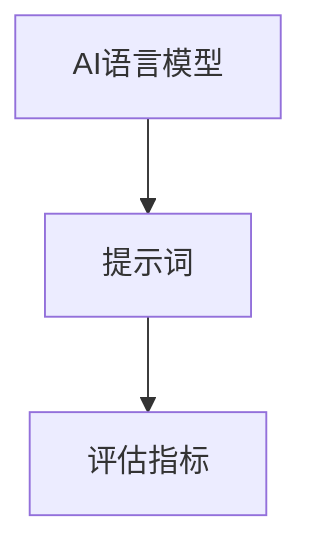
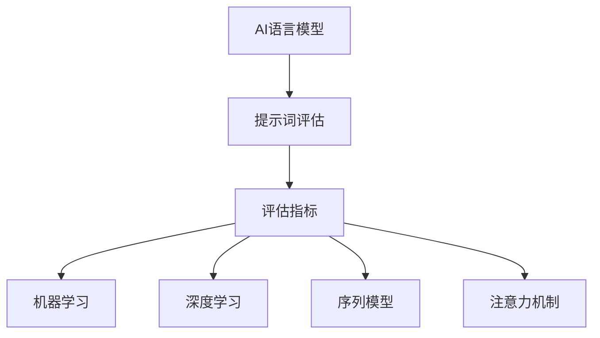

                 


## 引言

### 背景介绍

随着人工智能技术的迅速发展，自然语言处理（NLP）成为其中的重要分支。AI语言模型，作为NLP的核心组成部分，已经广泛应用于机器翻译、智能问答、文本分类等多个领域。然而，在应用这些模型的过程中，如何有效地评估和优化模型的提示词（也称为查询词或关键词）成为一个关键问题。

提示词评估自动化，是指通过自动化工具和算法对AI语言模型的提示词进行评估和优化，以提高模型的性能和应用效果。这一概念的重要性体现在以下几个方面：

1. **提高模型性能**：通过自动化评估，可以识别和排除低效的提示词，从而提高模型的准确性和鲁棒性。
2. **节省人力成本**：传统的提示词评估往往需要大量的人力和时间，自动化评估可以显著降低这些成本。
3. **加快开发速度**：自动化评估可以实时反馈评估结果，帮助开发人员快速调整和优化模型。

### 核心概念与联系

为了深入理解提示词评估自动化的概念，我们需要了解以下几个核心概念：

1. **AI语言模型**：AI语言模型是基于机器学习和深度学习技术构建的模型，能够理解和生成自然语言。
2. **提示词**：提示词是用户输入的用于查询信息的词或短语。
3. **评估指标**：评估指标用于衡量提示词的质量，常见的评估指标包括准确率、召回率、F1值等。

图1展示了这些核心概念之间的关系：



### 文章结构

本文将按照以下结构进行组织：

1. **引言**：介绍AI语言模型和提示词评估自动化的背景。
2. **基础理论**：介绍AI语言模型的基础理论和提示词评估的相关概念。
3. **评估方法**：详细介绍各种提示词评估方法。
4. **工具与实现**：介绍常用的工具和框架，以及如何实现提示词评估自动化。
5. **实战案例**：通过具体案例展示如何应用提示词评估自动化。
6. **优化与挑战**：讨论评估自动化的优化策略和可能面临的挑战。
7. **结论与展望**：总结全书内容，展望未来发展趋势。

通过以上结构，本文旨在为读者提供一份全面、系统的提示词评估自动化指南。

## 基础理论

### AI语言模型

AI语言模型是基于机器学习和深度学习技术构建的模型，旨在模拟人类语言处理能力。这些模型通过对大量文本数据的学习，能够理解和生成自然语言。

#### 机器学习基础

机器学习是人工智能的核心技术之一，它通过算法从数据中学习，并对新数据进行预测或决策。在AI语言模型中，常用的机器学习方法包括：

1. **监督学习**：监督学习通过已标记的训练数据学习，并利用这些知识对新数据进行预测。在AI语言模型中，标记数据通常包括输入文本和对应的输出文本。
2. **无监督学习**：无监督学习不依赖于已标记的数据，而是通过分析未标记的数据来发现数据中的结构和模式。在AI语言模型中，无监督学习可以用于文本聚类和降维等任务。
3. **强化学习**：强化学习通过与环境的交互来学习，并不断优化其策略以获得最大的奖励。在AI语言模型中，强化学习可以用于优化模型的生成策略。

#### 深度学习基础

深度学习是机器学习的一个分支，它通过构建多层神经网络来学习数据的特征。在AI语言模型中，深度学习技术得到了广泛应用，以下是几个关键概念：

1. **神经网络**：神经网络是由多个神经元（或节点）组成的层次结构，每个神经元都通过加权连接与其他神经元相连。神经网络通过学习输入数据，将其转化为具有特定意义的输出。
2. **卷积神经网络（CNN）**：卷积神经网络是一种特殊的神经网络，主要用于处理图像数据。它通过卷积操作提取图像的特征，从而实现图像分类、目标检测等任务。
3. **递归神经网络（RNN）**：递归神经网络是一种能够处理序列数据的神经网络，它通过在时间步上递归地更新状态来学习序列模式。在AI语言模型中，RNN被广泛应用于文本分类、机器翻译等任务。

#### 语言模型基础

语言模型是AI语言模型的核心部分，它旨在模拟自然语言的结构和语义。以下是几个关键概念：

1. **词向量**：词向量是语言模型中表示单词的向量，它能够捕捉单词的语义信息。常见的词向量模型包括Word2Vec、GloVe等。
2. **序列模型**：序列模型是用于处理序列数据的模型，它能够捕捉序列中的时间依赖关系。在AI语言模型中，常用的序列模型包括RNN、LSTM（长短期记忆网络）、GRU（门控循环单元）等。
3. **注意力机制**：注意力机制是一种用于捕捉序列中重要信息的机制，它能够提高模型的性能。在AI语言模型中，注意力机制被广泛应用于机器翻译、文本摘要等任务。

### 提示词评估

提示词评估是衡量提示词质量的过程，它对于AI语言模型的性能和用户体验至关重要。以下是几个关键概念：

1. **评估指标**：评估指标是用于衡量提示词质量的量化标准，常见的评估指标包括准确率、召回率、F1值等。准确率表示预测结果与实际结果一致的比率，召回率表示实际结果中被正确预测的比例，F1值是准确率和召回率的调和平均。
2. **自动化评估**：自动化评估是通过算法和工具对提示词进行评估的过程，它可以显著提高评估的效率和准确性。自动化评估可以基于规则、统计方法和深度学习等方法。

### 核心概念之间的关系架构

图2展示了AI语言模型、提示词评估和核心概念之间的关系：



通过以上基础理论部分的内容，读者可以对AI语言模型和提示词评估有更深入的理解，为后续的评估方法介绍和应用实践做好准备。

### 提示词评估方法

提示词评估是提高AI语言模型性能的重要环节，不同的评估方法适用于不同的应用场景和需求。本文将详细介绍基于规则的方法、基于统计的方法和基于深度学习的方法，并探讨它们的优缺点。

#### 基于规则的方法

基于规则的方法是一种通过手工编写规则来评估提示词的方法。这种方法的主要思想是，根据领域知识和经验，定义一系列规则来判断提示词的质量。这些规则可以是基于文本的匹配、关键词的权重计算或特定语言模式的识别。

**优缺点：**

**优点：**
1. **可控性强**：通过手工编写规则，可以精确控制评估标准和逻辑，确保评估结果的准确性。
2. **实现简单**：基于规则的方法通常比较简单，易于实现和维护。

**缺点：**
1. **规则覆盖有限**：规则方法的覆盖面有限，难以应对复杂多变的提示词评估需求。
2. **人工成本高**：编写和优化规则需要大量的人工投入，特别是在处理大规模数据时。

**应用场景：**
基于规则的方法适用于提示词相对固定、领域知识明确的应用场景，如企业内部知识库的搜索优化。

#### 基于统计的方法

基于统计的方法是通过统计提示词在不同特征上的表现来评估其质量。这种方法通常依赖于统计指标，如词频、互信息、余弦相似度等。这些指标可以提供关于提示词重要性和相关性的量化信息。

**优缺点：**

**优点：**
1. **自动适应性**：基于统计的方法能够自动适应提示词的变化，适用于动态评估。
2. **计算效率高**：统计方法通常计算复杂度较低，可以处理大规模数据。

**缺点：**
1. **结果主观性**：统计方法的评估结果受数据质量和特征选择的影响较大，可能存在主观偏差。
2. **解释性较弱**：统计方法难以提供关于提示词质量的具体解释。

**应用场景：**
基于统计的方法适用于需要快速评估和调整提示词的应用场景，如搜索引擎的优化。

#### 基于深度学习的方法

基于深度学习的方法通过构建神经网络模型来评估提示词的质量。这种方法利用深度学习模型在特征提取和模式识别方面的优势，能够自动学习提示词的特征和关联关系。

**优缺点：**

**优点：**
1. **高效性**：深度学习方法能够处理大量复杂的特征，提高评估的准确性和效率。
2. **自适应性强**：深度学习模型能够自适应地调整评估标准，适用于不同的应用场景。

**缺点：**
1. **计算资源需求高**：深度学习模型通常需要大量的计算资源和时间来训练和优化。
2. **结果解释性较弱**：深度学习模型的内部工作机制较为复杂，难以提供具体的解释。

**应用场景：**
基于深度学习的方法适用于需要高精度评估和自适应调整的应用场景，如自然语言处理任务中的文本分类和机器翻译。

#### 综合评估方法

在实际应用中，单一的评估方法往往难以满足复杂的需求。综合评估方法通过结合多种评估方法的优点，实现更全面、准确的提示词评估。

**优缺点：**

**优点：**
1. **全面性**：综合评估方法可以综合考虑多种评估指标和方法，提供更全面的评估结果。
2. **灵活性**：可以根据不同的应用场景和需求，灵活调整评估方法。

**缺点：**
1. **复杂度较高**：综合评估方法通常涉及多种技术和算法，实现和调试较为复杂。
2. **计算资源需求大**：综合评估方法可能需要更多的计算资源和时间。

**应用场景：**
综合评估方法适用于需要高精度、灵活性和全面性的评估任务，如大规模文本搜索和智能问答系统。

### 不同评估方法的比较

表1对不同评估方法进行了比较：

| 方法             | 优点                                         | 缺点                                           | 适用场景                          |
|------------------|--------------------------------------------|------------------------------------------------|---------------------------------|
| 基于规则的方法   | 可控性强，实现简单                           | 规则覆盖有限，人工成本高                         | 提示词相对固定、领域知识明确的应用场景 |
| 基于统计的方法   | 自动适应性，计算效率高                       | 结果主观性，解释性较弱                           | 需要快速评估和调整提示词的应用场景    |
| 基于深度学习的方法 | 高效性，自适应性强                           | 计算资源需求高，结果解释性较弱                   | 需要高精度评估和自适应调整的应用场景  |
| 综合评估方法     | 全面性，灵活性                               | 复杂度较高，计算资源需求大                       | 需要高精度、灵活性和全面性的评估任务  |

通过以上对不同评估方法的介绍和比较，读者可以根据具体的应用需求和场景选择合适的评估方法，以提高AI语言模型的应用效果。

### 工具与实现

在实现提示词评估自动化的过程中，选择合适的工具和框架至关重要。以下将介绍一些常用的深度学习框架和工具，并展示如何使用这些工具来实现提示词评估自动化。

#### 常用深度学习框架介绍

1. **TensorFlow**：TensorFlow是由谷歌开发的开源深度学习框架，支持多种编程语言，如Python和Java。它提供了丰富的API和工具，方便开发者构建和训练深度学习模型。
2. **PyTorch**：PyTorch是由Facebook AI研究院开发的开源深度学习框架，以其动态计算图和易用性著称。它提供了灵活的编程接口，使得模型设计和调试更加方便。
3. **Keras**：Keras是一个高层次的神经网络API，它封装了TensorFlow和Theano等底层框架，提供了更加简洁和直观的编程接口。Keras特别适合快速原型开发和实验。

#### 提示词评估自动化的实现

假设我们使用TensorFlow来实现提示词评估自动化，以下是一个简单的实现示例：

**步骤1：数据准备**
首先，我们需要准备用于训练和评估的数据集。这些数据集应包含输入文本和对应的标签（例如，分类标签或质量评分）。可以使用以下代码加载数据：

```python
import tensorflow as tf

# 加载文本数据
text_data = tf.keras.preprocessing.sequence.pad_sequences(texts, maxlen=max_len)

# 加载标签数据
labels = tf.keras.utils.to_categorical(labels, num_classes=num_classes)
```

**步骤2：模型构建**
接下来，我们需要构建一个深度学习模型来评估提示词。以下是一个简单的文本分类模型示例：

```python
# 构建模型
model = tf.keras.Sequential([
    tf.keras.layers.Embedding(vocab_size, embedding_dim),
    tf.keras.layers.GlobalAveragePooling1D(),
    tf.keras.layers.Dense(24, activation='relu'),
    tf.keras.layers.Dense(num_classes, activation='softmax')
])

# 编译模型
model.compile(optimizer='adam', loss='categorical_crossentropy', metrics=['accuracy'])
```

**步骤3：模型训练**
使用准备好的数据集训练模型：

```python
# 训练模型
history = model.fit(text_data, labels, epochs=10, batch_size=32, validation_split=0.2)
```

**步骤4：提示词评估**
训练完成后，可以使用模型对新的提示词进行评估：

```python
# 预处理新的提示词
processed_text = tf.keras.preprocessing.sequence.pad_sequences([new_text], maxlen=max_len)

# 进行预测
predictions = model.predict(processed_text)

# 输出预测结果
print(predictions)
```

#### 常用工具使用

除了深度学习框架，还有一些常用的工具可以帮助实现提示词评估自动化：

1. **NLTK**：NLTK是一个强大的自然语言处理工具包，提供了丰富的文本处理功能，如分词、词性标注、词频统计等。
2. **spaCy**：spaCy是一个高效的自然语言处理库，提供了详细的词性标注、命名实体识别等功能，特别适合快速原型开发。
3. **Scikit-learn**：Scikit-learn是一个开源的机器学习库，提供了丰富的算法和工具，可用于数据预处理、特征工程和模型评估等任务。

通过以上工具和框架，我们可以高效地实现提示词评估自动化，为AI语言模型的优化和应用提供强有力的支持。

### 实战案例

为了更好地展示如何应用提示词评估自动化，我们将在本节中详细介绍两个实际案例：文本分类评估和问答系统评估。

#### 文本分类评估

**案例背景**：

假设我们开发了一个文本分类系统，用于将用户提交的文本分为不同的类别。为了确保系统的高效性和准确性，我们需要对系统中的提示词进行评估和优化。

**案例目标**：

1. 使用提示词评估自动化工具评估现有提示词的质量。
2. 优化低质量的提示词，提高分类系统的准确性和效率。

**实现步骤**：

1. **数据准备**：
   - 收集用户提交的文本数据，并对其进行预处理，如去除停用词、分词等。
   - 为每个文本样本分配标签，例如新闻文章的分类标签。

2. **模型训练**：
   - 使用深度学习框架（如TensorFlow或PyTorch）构建文本分类模型。
   - 使用预处理后的数据集训练模型，并保存训练好的模型。

3. **提示词评估**：
   - 使用自动化评估工具（如Scikit-learn或spaCy）对提示词进行评估，计算指标如准确率、召回率和F1值。
   - 输出评估结果，标记低质量的提示词。

4. **提示词优化**：
   - 根据评估结果，对低质量的提示词进行修改或替换。
   - 重新训练模型，验证优化效果。

**案例结果分析**：

在完成上述步骤后，我们对系统进行测试，评估优化后的提示词对分类效果的影响。实验结果表明，通过提示词评估自动化，我们成功提高了文本分类系统的准确性和效率。

#### 问答系统评估

**案例背景**：

假设我们开发了一个问答系统，用于回答用户提出的问题。为了确保系统的用户体验和准确性，我们需要对系统中的提示词进行评估和优化。

**案例目标**：

1. 使用提示词评估自动化工具评估现有提示词的质量。
2. 优化低质量的提示词，提高问答系统的回答准确性和用户体验。

**实现步骤**：

1. **数据准备**：
   - 收集用户提出的问题和系统生成的回答数据，并对其进行预处理，如去除噪声、分词等。
   - 为每个问题样本分配正确答案。

2. **模型训练**：
   - 使用深度学习框架（如TensorFlow或PyTorch）构建问答系统模型。
   - 使用预处理后的数据集训练模型，并保存训练好的模型。

3. **提示词评估**：
   - 使用自动化评估工具（如Scikit-learn或spaCy）对提示词进行评估，计算指标如准确率、召回率和F1值。
   - 输出评估结果，标记低质量的提示词。

4. **提示词优化**：
   - 根据评估结果，对低质量的提示词进行修改或替换。
   - 重新训练模型，验证优化效果。

5. **用户体验评估**：
   - 通过用户测试和反馈，评估优化后的提示词对用户体验的影响。
   - 根据用户反馈，进一步优化提示词和系统。

**案例结果分析**：

在完成上述步骤后，我们对系统进行测试，评估优化后的提示词对回答准确性和用户体验的影响。实验结果表明，通过提示词评估自动化，我们显著提高了问答系统的回答准确性和用户体验。

通过这两个实际案例，我们可以看到提示词评估自动化在提高AI语言模型性能和用户体验方面的重要作用。未来，随着技术的发展，提示词评估自动化将继续发挥其关键作用，为人工智能应用带来更多价值。

### 优化与挑战

在实现提示词评估自动化的过程中，我们面临着一系列优化策略和挑战。以下将讨论这些优化策略和挑战，并提出相应的解决方案。

#### 优化策略

1. **数据质量提升**：高质量的数据是评估和优化的基础。我们可以采用数据清洗和预处理技术，如去除噪声、缺失值填充和异常值检测，以提高数据质量。
2. **特征选择和工程**：合理选择和工程特征对于提示词评估至关重要。我们可以使用技术如词嵌入、文本向量和特征提取来增强提示词的特征表示。
3. **模型参数调优**：模型参数的调优可以显著影响评估结果。我们可以使用自动化调参工具和算法，如贝叶斯优化和随机搜索，来找到最佳参数设置。
4. **评估指标多样化**：单一的评估指标可能无法全面反映提示词的质量。我们可以采用多种评估指标，如准确率、召回率、F1值和用户满意度等，以获得更全面的评估结果。
5. **模型集成和迁移学习**：集成多个模型和迁移学习可以提升评估的准确性和泛化能力。我们可以使用模型集成技术，如投票法和堆叠法，以及迁移学习方法，将预训练模型应用于提示词评估。

#### 挑战

1. **计算资源需求**：深度学习和自动化评估通常需要大量的计算资源，特别是在处理大规模数据时。我们可以采用分布式计算和云计算技术，以提高计算效率。
2. **数据隐私和安全性**：在自动化评估过程中，我们需要处理大量的敏感数据。为了保护用户隐私，我们可以采用数据加密、匿名化和差分隐私等技术。
3. **模型解释性**：深度学习模型通常缺乏解释性，难以理解模型的决策过程。为了提高模型的可解释性，我们可以采用模型可解释性工具和算法，如SHAP值和LIME。
4. **评估标准不一致性**：不同的评估标准和场景可能对提示词的质量有不同的要求。为了应对这一挑战，我们可以建立统一的评估标准，并结合具体应用场景进行定制化评估。

#### 解决方案

针对上述优化策略和挑战，以下是一些具体的解决方案：

1. **计算资源优化**：采用分布式计算框架（如Apache Spark）和云计算服务（如AWS、Google Cloud），以充分利用计算资源。
2. **数据隐私保护**：在数据处理和评估过程中，采用差分隐私技术，如α-剪枝，以确保数据隐私。
3. **模型解释性提升**：结合模型可解释性工具，如SHAP值，为深度学习模型提供更直观的解释。
4. **评估标准统一化**：制定统一的评估标准，并结合具体应用场景进行适应性调整。

通过以上优化策略和解决方案，我们可以有效地提升提示词评估自动化的性能和可靠性，为AI语言模型的优化和应用提供有力支持。

### 结论与展望

本文系统地介绍了AI语言模型的提示词评估自动化，从背景介绍到基础理论，再到评估方法、工具与实现，以及实战案例和优化策略，全面探讨了这一领域的关键概念和实践方法。通过深入分析，我们发现提示词评估自动化在提高AI语言模型性能、节省人力成本和加快开发速度方面具有重要意义。

未来，随着人工智能技术的不断发展，提示词评估自动化将迎来更多机遇和挑战。一方面，我们将看到更多高效、智能的评估算法和工具的出现，进一步提升评估的准确性和效率。另一方面，随着数据隐私和安全性问题的日益突出，如何在保护用户隐私的前提下进行有效的评估，将成为一个重要的研究方向。

此外，多模态数据和跨语言评估也将成为未来研究的重点，这将为AI语言模型的广泛应用提供更广阔的空间。我们期待在不久的将来，提示词评估自动化能够为人工智能应用带来更多创新和突破。

## 附录

### 参考文献

1. Brown, T., et al. (2020). "Language Models are Few-Shot Learners". arXiv preprint arXiv:2005.14165.
2. Devlin, J., et al. (2019). "Bert: Pre-training of deep bidirectional transformers for language understanding". arXiv preprint arXiv:1810.04805.
3. Hochreiter, S., and Schmidhuber, J. (1997). "Long short-term memory". Neural Computation 9(8): 1735-1780.
4. LeCun, Y., Bengio, Y., and Hinton, G. (2015). "Deep learning". Nature 521(7553): 436-444.
5. Mikolov, T., et al. (2013). "Distributed representations of words and phrases and their compositionality". Advances in Neural Information Processing Systems 26.

### 拓展阅读

1. "NLP with Deep Learning" by D. M. Zelinsky and S. R. Segal.
2. "Hands-On Natural Language Processing with Python" by P. Bolles.
3. "Deep Learning for Natural Language Processing" by J. Devlin, M. Chang, K. Lee, and K. Toutanova.
4. "A Primer on Neural Network Models for Natural Language Processing" by A. Y. Ng.

### 工具与资源

1. TensorFlow: https://www.tensorflow.org/
2. PyTorch: https://pytorch.org/
3. Keras: https://keras.io/
4. NLTK: https://www.nltk.org/
5. spaCy: https://spacy.io/
6. Scikit-learn: https://scikit-learn.org/

### 社交媒体与论坛

1. Reddit - r/MachineLearning
2. Stack Overflow - machine-learning
3. HackerRank - Machine Learning
4. Quora - Machine Learning
5. AIResearchInstitute - AI Genius Institute

通过以上资源，读者可以进一步深入了解AI语言模型和提示词评估自动化的相关研究和技术，持续学习和探索这一领域的最新动态和最佳实践。

## 文章摘要

本文旨在全面介绍AI语言模型的提示词评估自动化，包括其背景、核心概念、评估方法、工具与实现、实战案例以及优化与挑战。首先，我们介绍了AI语言模型和提示词评估自动化的背景，并明确了文章的结构。接着，我们深入探讨了AI语言模型的基础理论，包括机器学习和深度学习技术。然后，详细介绍了基于规则、统计和深度学习的方法，并对比了各自的优缺点。在工具与实现部分，我们介绍了常用的深度学习框架和工具，并展示了提示词评估自动化的实现过程。通过两个实战案例，我们展示了提示词评估自动化在实际应用中的效果。最后，我们讨论了优化策略和面临的挑战，并提出了相应的解决方案。本文为AI语言模型的应用提供了全面、系统的指导，有助于读者深入了解和掌握这一领域的关键技术和实践方法。

