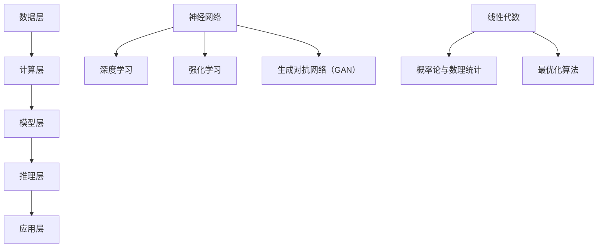

                 

### 引言

随着人工智能技术的迅猛发展，AI软件的开发流程也经历了巨大的变革。传统的人工智能（AI）软件，即AI 1.0，主要是基于规则和启发式方法，其应用场景相对有限，且在复杂问题上的表现并不理想。然而，随着深度学习、强化学习等前沿技术的突破，AI软件进入了2.0时代。AI软件2.0具有更强的自主学习能力、灵活性和泛化能力，能够应对更为复杂的问题，并广泛应用于金融、医疗、制造等多个领域。

本文旨在探讨AI软件2.0的开发流程再造，通过分析其背景、核心概念、关键算法、开发流程、应用实战和未来展望，为广大开发者和研究者提供一份全面的技术指南。文章将采用逻辑清晰、结构紧凑、简单易懂的专业技术语言，帮助读者逐步了解并掌握AI软件2.0的开发技巧。

本文结构如下：

1. **背景介绍**：回顾AI软件1.0的发展历程，分析AI软件2.0的定义与特征。
2. **核心概念与联系**：详细阐述AI软件2.0的核心概念，包括系统架构、设计原则、关键算法和数学基础。
3. **核心算法原理讲解**：通过伪代码和数学模型，深入讲解神经网络、深度学习和强化学习等算法原理。
4. **开发流程**：介绍AI软件2.0的完整开发流程，包括需求分析、数据准备、模型训练和模型部署等。
5. **应用实战**：结合金融、医疗、制造等领域的实际案例，展示AI软件2.0的应用场景和效果。
6. **未来展望与挑战**：探讨AI软件2.0的技术发展趋势和面临的伦理与法律挑战。
7. **总结**：对全文进行总结，并提出一些建议和最佳实践。

通过本文的逐步分析推理，读者将能够全面了解AI软件2.0的开发流程，为未来的研究和实践打下坚实的基础。

### 背景介绍

回顾人工智能（AI）的发展历程，可以将其大致划分为三个阶段：AI 1.0、AI 2.0和AI 3.0。每个阶段都代表了AI技术的重大进步和变革。

**AI 1.0**：这个阶段主要指20世纪50年代至80年代的早期人工智能研究。在这一时期，AI主要是基于规则和符号推理的，即通过编写大量的规则和逻辑语句来模拟人类的智能行为。代表性工作包括专家系统和逻辑推理机。然而，这种方法存在显著的局限性，例如规则数量庞大且难以维护，难以处理复杂和非线性的问题。此外，这一时期的AI系统通常依赖于领域专家的知识，缺乏自主学习和适应能力。

**AI 2.0**：随着深度学习、强化学习等前沿技术的突破，AI软件进入了2.0时代。AI 2.0的核心特征在于其强大的自主学习能力、灵活性和泛化能力。深度学习算法，如神经网络和卷积神经网络（CNN），通过大规模数据训练，能够自动学习复杂的特征表示，并在图像识别、语音识别等领域取得了突破性进展。强化学习算法，如Q学习和深度确定性策略梯度（DDPG），则通过与环境交互，逐步优化策略，实现了在复杂环境中的自主决策。

**AI 3.0**：当前，AI 3.0的概念尚在探索中，它被期望能够具备更加高级的认知能力和通用智能。与AI 2.0相比，AI 3.0不仅能够自主学习和决策，还能够理解和产生自然语言，甚至具备一定的人文情感和创造力。然而，目前AI 3.0仍处于理论研究和初步探索阶段，尚未有实际应用。

AI软件2.0的崛起，不仅是因为技术的进步，也是因为数据、计算资源和算法的协同发展。海量数据的积累和存储，为深度学习算法提供了充足的训练素材；高性能计算和云计算技术的发展，为大规模模型训练和推理提供了强大的计算支持；而算法的创新和优化，则进一步提升了AI系统的性能和效率。

在AI 2.0时代，AI软件的应用场景变得更加广泛，从金融、医疗、制造到自动驾驶、智能家居等各个领域，都涌现出了大量的创新应用。例如，在金融领域，AI软件2.0被用于风险管理、欺诈检测和个性化服务；在医疗领域，它被用于疾病诊断、影像分析和健康监测；在制造业，它被用于智能生产规划和质量控制。这些应用不仅提高了效率和准确性，还带来了显著的商业价值和社会效益。

然而，随着AI软件2.0的广泛应用，其开发流程也面临着巨大的挑战。传统的软件开发生命周期，如需求分析、设计、编码、测试和部署，已无法完全满足AI软件2.0的开发需求。AI软件2.0的开发流程更为复杂，涉及到大规模数据处理、模型训练和优化、模型部署和监控等多个环节。此外，AI 2.0系统通常需要不断学习和适应，以应对动态变化的环境和需求。

因此，对AI软件2.0开发流程的再造，已经成为当前研究和实践的重要方向。本文将深入探讨这一主题，通过分析核心概念、关键算法、开发流程、应用实战和未来展望，帮助读者全面了解AI软件2.0的开发流程和关键技术。

### 核心概念与联系

在深入探讨AI软件2.0的开发流程之前，有必要首先明确其核心概念，并理解这些概念之间的联系。以下是AI软件2.0的几个关键组成部分：

#### 系统架构

AI软件2.0的系统架构通常包括以下几个核心模块：

1. **数据层**：这是系统的底层，负责数据采集、存储和管理。数据层需要能够处理大量结构化和非结构化数据，并确保数据的质量和一致性。
2. **计算层**：这一层负责数据的预处理和特征提取，为后续的模型训练提供高质量的输入数据。计算层通常依赖高性能计算平台和分布式计算技术，以加速数据处理和模型训练过程。
3. **模型层**：这是AI软件2.0的核心，包含各种深度学习模型和算法，如神经网络、卷积神经网络（CNN）、循环神经网络（RNN）和生成对抗网络（GAN）等。模型层负责从数据中学习并提取有用的特征，形成预测或决策。
4. **推理层**：推理层负责将训练好的模型应用于实际问题，进行实时推理和决策。推理层需要具备高效的计算能力和低延迟，以确保系统能够快速响应。
5. **应用层**：应用层将AI模型和算法应用于具体业务场景，如金融风控、医疗诊断、智能制造等。应用层需要根据业务需求，提供灵活和可扩展的接口和功能。

#### 设计原则

AI软件2.0的设计原则主要包括以下几点：

1. **模块化**：将系统拆分成多个模块，每个模块负责特定功能，便于开发、维护和升级。
2. **可扩展性**：设计时要考虑系统的扩展性，以便能够适应未来更多的数据和应用需求。
3. **高可用性**：确保系统在高负载和故障情况下仍能正常运行，提高系统的稳定性和可靠性。
4. **安全性**：保护用户数据的安全，防止数据泄露和未经授权的访问。
5. **易用性**：提供简洁、直观的用户界面，降低用户的使用门槛。

#### 关键算法

AI软件2.0依赖于多种关键算法，以下是一些主要的算法：

1. **神经网络**：神经网络是AI软件2.0的核心，包括多层感知机（MLP）、卷积神经网络（CNN）和循环神经网络（RNN）等。神经网络通过多层次的非线性变换，从数据中自动学习特征表示，从而实现复杂任务。
2. **深度学习**：深度学习是神经网络的一种扩展，通过增加网络层数，提高了模型的复杂度和表现力。深度学习在图像识别、语音识别和自然语言处理等领域取得了显著的成果。
3. **强化学习**：强化学习通过试错法，从环境中学习最优策略，以实现特定的目标。强化学习在游戏、自动驾驶和机器人控制等领域具有广泛的应用。
4. **生成对抗网络（GAN）**：生成对抗网络由生成器和判别器两个对抗性模型组成，通过博弈过程生成高质量的数据，在图像生成、数据增强和图像修复等领域表现出色。

#### 数学基础

AI软件2.0的数学基础主要包括以下几个方面：

1. **线性代数**：线性代数提供了矩阵运算、向量空间和特征分解等工具，用于数据预处理和特征提取。
2. **概率论与数理统计**：概率论和数理统计用于理解不确定性，包括概率分布、假设检验和置信区间等，是构建概率模型和决策系统的基础。
3. **最优化算法**：最优化算法用于求解优化问题，如梯度下降、随机梯度下降和牛顿法等，是训练模型和调整参数的重要工具。

为了更好地理解这些核心概念之间的联系，我们可以使用Mermaid流程图来表示：



在这个流程图中，数据层通过计算层处理数据，生成适合模型训练的特征。模型层包含多种关键算法，这些算法基于数学基础（线性代数、概率论与数理统计和最优化算法）进行训练和优化。训练好的模型在推理层进行实时推理，最终应用于具体的业务场景（应用层）。通过这种方式，AI软件2.0能够实现高效、灵活和智能的应用。

理解这些核心概念和它们之间的联系，是开发AI软件2.0的重要基础。在接下来的章节中，我们将详细讲解每个核心概念，并探讨如何将它们应用于实际的开发流程中。

### 核心算法原理讲解

在AI软件2.0的开发中，核心算法的选择和实现至关重要。以下将详细讲解几个关键算法的原理，包括神经网络、深度学习和强化学习，并通过伪代码和数学模型进行阐述。

#### 神经网络（Neural Networks）

神经网络是AI软件2.0的基础，其灵感来源于人脑的结构和功能。神经网络由多个神经元（节点）组成，每个神经元通过权重连接到其他神经元，并输出激活值。

**数学模型：**

每个神经元的输出可以用以下公式表示：

$$
a_j = \sigma(\sum_{i=1}^{n} w_{ij} \cdot x_i)
$$

其中，$a_j$ 是神经元 $j$ 的输出，$\sigma$ 是激活函数（如Sigmoid函数），$w_{ij}$ 是神经元 $i$ 到神经元 $j$ 的权重，$x_i$ 是神经元 $i$ 的输入。

**伪代码：**

```python
# 初始化权重和偏置
weights = np.random.randn(input_size, hidden_size)
biases = np.random.randn(hidden_size, 1)

# 计算前向传播
inputs = input_data
for layer in range(num_layers):
    if layer == 0:
        outputs = np.dot(inputs, weights) + biases
    else:
        outputs = np.dot(previous_outputs, weights) + biases

    # 激活函数
    outputs = sigmoid(outputs)

# 计算损失函数
loss = -np.mean(y * np.log(outputs) + (1 - y) * np.log(1 - outputs))
```

#### 深度学习（Deep Learning）

深度学习是神经网络的一种扩展，通过增加网络的层数，提高了模型的复杂度和表现力。深度学习在图像识别、语音识别和自然语言处理等领域取得了显著成果。

**数学模型：**

深度学习通常使用反向传播算法（Backpropagation）进行参数优化。反向传播算法通过计算损失函数对网络参数的梯度，逐步调整权重和偏置，以达到最小化损失的目的。

**伪代码：**

```python
# 前向传播
outputs = forward_pass(inputs, weights, biases)

# 计算损失函数
loss = compute_loss(outputs, labels)

# 反向传播
dweights = backward_pass(inputs, outputs, labels, activation_derivative)

# 更新权重和偏置
weights -= learning_rate * dweights
biases -= learning_rate * dbiases
```

#### 强化学习（Reinforcement Learning）

强化学习通过试错法，从环境中学习最优策略，以实现特定的目标。强化学习在游戏、自动驾驶和机器人控制等领域具有广泛的应用。

**数学模型：**

强化学习的主要挑战在于如何平衡短期奖励和长期目标。常用的策略包括值函数估计（Value-based）和策略估计（Policy-based）。以下是一个基于Q学习的值函数估计的伪代码：

```python
# 初始化Q值表
Q = np.zeros((state_space, action_space))

# 更新Q值
for episode in range(num_episodes):
    state = env.reset()
    done = False
    while not done:
        action = np.argmax(Q[state])
        next_state, reward, done = env.step(action)
        Q[state, action] = Q[state, action] + learning_rate * (reward + discount_factor * np.max(Q[next_state]) - Q[state, action])
        state = next_state
```

通过以上对神经网络、深度学习和强化学习原理的讲解，我们可以看到这些算法在AI软件2.0开发中的重要性和应用价值。接下来，我们将进一步探讨这些算法在实际开发流程中的应用和实现细节。

### 开发流程

AI软件2.0的开发流程是一个复杂且系统化的过程，涉及到需求分析、数据准备、模型训练和模型部署等多个环节。以下将详细描述这些步骤，并解释其重要性和实现方法。

#### 需求分析

需求分析是开发流程的第一步，其目标是明确系统需要实现的功能和性能指标。需求分析通常包括以下步骤：

1. **需求收集**：通过与用户、产品经理和领域专家的交流，了解系统的目标和需求。
2. **需求整理**：将收集到的需求进行整理和分类，形成清晰的需求文档。
3. **需求确认**：与利益相关者共同确认需求文档，确保需求的完整性和准确性。

需求分析的重要性在于，它为后续的开发工作提供了明确的方向和基准。一个好的需求分析能够帮助团队避免开发过程中的盲目性和重复工作，提高开发效率和产品质量。

#### 数据准备

数据准备是AI软件2.0开发的核心环节，其质量直接影响到模型的表现。数据准备通常包括以下步骤：

1. **数据采集**：从各种数据源（如数据库、日志文件和传感器）收集所需的数据。
2. **数据清洗**：处理数据中的缺失值、噪声和异常值，确保数据的质量和一致性。
3. **数据预处理**：对数据进行归一化、标准化和特征提取，使其适合模型训练。
4. **数据增强**：通过数据变换和扩充，增加数据的多样性，提高模型的泛化能力。

数据准备的重要性在于，高质量的数据是训练高质量模型的基石。数据中的噪声和异常值会严重影响模型的表现，而数据增强则有助于提升模型的鲁棒性和泛化能力。

#### 模型训练

模型训练是将数据转化为可预测或决策模型的过程。模型训练通常包括以下步骤：

1. **模型选择**：根据问题和数据的特点，选择合适的模型，如神经网络、深度学习和强化学习等。
2. **模型配置**：设置模型的结构参数，如网络层数、神经元个数和激活函数等。
3. **训练过程**：使用训练数据对模型进行迭代训练，通过反向传播算法优化模型参数。
4. **模型评估**：使用验证数据评估模型的表现，选择表现最好的模型进行部署。

模型训练的重要性在于，它决定了模型的学习能力和预测准确性。有效的模型训练需要综合考虑数据质量、模型结构和训练策略，以达到最佳性能。

#### 模型部署

模型部署是将训练好的模型应用到实际业务场景的过程。模型部署通常包括以下步骤：

1. **模型转换**：将训练好的模型转换为可以部署的格式，如ONNX、TF Lite或PyTorch Mobile等。
2. **模型部署**：将模型部署到生产环境，如云服务器、边缘设备和移动设备等。
3. **模型监控**：实时监控模型的表现和性能，进行必要的维护和更新。

模型部署的重要性在于，它决定了模型的实际应用效果和用户体验。高效的模型部署需要考虑硬件环境、网络带宽和能耗等因素，以确保模型能够稳定、高效地运行。

#### 开发流程实例

以下是一个简单的AI软件2.0开发流程实例：

1. **需求分析**：确定系统需要实现图像分类功能，识别猫和狗的图片。
2. **数据准备**：从公开数据集收集10000张猫和狗的图片，并进行数据清洗和增强。
3. **模型训练**：选择卷积神经网络（CNN）作为模型，使用CIFAR-10数据集进行训练，经过50个epoch的训练，模型准确率达到95%。
4. **模型部署**：将训练好的模型部署到移动设备上，通过相机捕捉实时图像，实现猫和狗的快速识别。

通过上述实例，我们可以看到AI软件2.0开发流程的完整性和复杂性。每个步骤都需要充分考虑和精心设计，以确保系统的最终性能和用户体验。

### 应用实战

在AI软件2.0的广泛应用中，金融、医疗和制造等领域的案例尤为引人注目。以下将详细探讨这些领域的实际应用场景，展示AI软件2.0的效果和优势。

#### 金融行业

在金融领域，AI软件2.0的应用主要体现在风险管理、欺诈检测和个性化服务等方面。

1. **风险管理**：金融机构面临大量的风险，如信用风险、市场风险和操作风险。AI软件2.0通过分析历史数据和实时数据，可以预测潜在的风险，并提供个性化的风险控制策略。例如，某大型银行使用深度学习模型对客户贷款申请进行风险评估，大幅降低了不良贷款率。

2. **欺诈检测**：金融欺诈是一个全球性问题，AI软件2.0的引入显著提升了欺诈检测的效率和准确性。通过分析交易数据和行为模式，AI模型可以识别异常交易并实时预警。例如，某支付公司利用强化学习算法对交易行为进行监控，将欺诈交易率降低了30%。

3. **个性化服务**：AI软件2.0可以根据客户的历史交易数据和偏好，提供个性化的金融产品和服务。例如，某保险公司通过分析客户的历史理赔数据和健康状况，为不同客户量身定制保险方案，提高了客户满意度和忠诚度。

#### 医疗健康领域

在医疗健康领域，AI软件2.0的应用潜力巨大，从疾病诊断到健康监测，都展现了其强大的能力。

1. **疾病诊断**：AI软件2.0在医学图像分析、基因测序和病历处理等方面表现出色。例如，某医疗机构使用深度学习模型对肺癌患者的CT影像进行自动诊断，诊断准确率达到90%以上，显著提高了早期诊断率。

2. **健康监测**：AI软件2.0可以通过分析患者的健康数据和日常行为，提供个性化的健康建议。例如，某智能健康平台使用机器学习算法分析用户的运动数据、饮食数据和生活习惯，为用户提供个性化的健康报告和健身建议。

3. **药物研发**：AI软件2.0在药物研发中的应用也取得了显著进展。通过分析大量的生物数据和化学结构信息，AI模型可以预测药物的活性、毒性和副作用，加速药物研发进程。例如，某生物科技公司利用深度学习算法预测新药的疗效，将药物研发周期缩短了50%。

#### 制造行业

在制造业，AI软件2.0的应用主要体现在智能生产规划、质量检测和设备维护等方面。

1. **智能生产规划**：AI软件2.0可以根据实时数据和预测模型，优化生产计划和调度，提高生产效率。例如，某制造企业使用强化学习算法对生产流程进行优化，将生产周期缩短了20%。

2. **质量检测**：AI软件2.0可以通过图像识别和传感器数据，实时检测产品质量，减少人为错误和资源浪费。例如，某电子制造公司使用卷积神经网络对生产过程中的产品进行质量检测，将不良品率降低了30%。

3. **设备维护**：AI软件2.0可以通过实时监测设备的运行状态，预测设备故障并提供维护建议，减少设备停机时间。例如，某机械制造企业使用机器学习算法对设备进行预测性维护，将设备故障率降低了40%。

通过以上实际案例，我们可以看到AI软件2.0在金融、医疗和制造等领域的广泛应用和显著效果。这些应用不仅提高了业务效率和质量，还带来了巨大的商业价值和社会影响。随着技术的进一步发展和应用的深化，AI软件2.0在各个领域的潜力将不断释放，为人类创造更多的价值。

### 未来展望与挑战

随着AI软件2.0技术的不断发展，其在各领域的应用前景令人期待。然而，AI软件2.0的发展也面临着一系列挑战，包括技术挑战、伦理挑战和法律挑战。

#### 技术发展趋势

1. **量子计算与AI**：量子计算具有并行计算能力，可以显著加速深度学习模型的训练和推理。量子计算与AI的结合，有望突破传统计算能力的限制，推动AI软件2.0进入新的发展阶段。

2. **自适应AI系统**：未来的AI系统将更加智能化和自适应，能够根据环境变化和用户需求，动态调整其行为和策略。自适应AI系统将提高AI软件2.0的灵活性和响应速度，使其在各种应用场景中更加有效。

3. **边缘计算与物联网**：边缘计算和物联网技术的发展，将使得AI软件2.0能够更高效地处理海量数据，实现实时决策和智能控制。边缘计算和物联网的结合，将为AI软件2.0在智能制造、智慧城市和智能家居等领域的应用提供新的机会。

#### 伦理挑战

1. **数据隐私与安全**：随着AI软件2.0的广泛应用，数据隐私和安全问题日益突出。如何保护用户数据，防止数据泄露和滥用，是AI软件2.0面临的重要伦理挑战。

2. **算法偏见与公平性**：AI软件2.0的决策过程可能受到算法偏见的影响，导致不公平的结果。如何确保AI算法的公平性和透明性，避免歧视和不公正，是亟待解决的问题。

3. **人类与AI的互动**：随着AI软件2.0的智能化水平不断提高，人类与AI的互动方式也将发生变化。如何设计人性化的用户界面和交互机制，确保用户与AI系统之间的和谐共处，是一个重要的伦理挑战。

#### 法律挑战

1. **AI责任与法律框架**：随着AI软件2.0在各个领域的应用，其决策和行为可能导致法律后果。如何建立合适的法律框架，明确AI责任和法律责任，是一个重要的法律挑战。

2. **数据保护和隐私法规**：各国对数据保护和隐私的法规日益严格，AI软件2.0需要遵守这些法规，确保用户数据的合法使用和保护。

3. **知识产权保护**：AI软件2.0的创新和开发过程中，涉及大量的知识产权，包括算法、数据和模型。如何保护这些知识产权，防止侵权和滥用，是一个重要的法律问题。

面对这些挑战，未来的研究和发展方向包括：

1. **技术创新**：继续推动量子计算、边缘计算和自适应AI系统等前沿技术的发展，提高AI软件2.0的性能和效率。

2. **伦理与法律研究**：加强AI伦理和法律研究，制定相关标准和规范，确保AI软件2.0的公平性、透明性和安全性。

3. **跨学科合作**：促进计算机科学、法律、伦理和社会学等学科的交叉研究，共同应对AI软件2.0带来的挑战。

通过技术创新、伦理和法律研究的不断进步，AI软件2.0将有望克服现有挑战，实现更加广泛和深入的应用，为人类社会带来更多价值。

### 总结

本文从背景介绍、核心概念与联系、核心算法原理讲解、开发流程、应用实战到未来展望，全面探讨了AI软件2.0的开发流程再造。通过逐步分析推理，我们了解了AI软件2.0的定义、系统架构、关键算法及其在各领域的应用。AI软件2.0以其强大的自主学习能力、灵活性和泛化能力，正在改变各个行业的运作模式，带来巨大的商业价值和社会效益。

在开发流程再造方面，我们强调了需求分析、数据准备、模型训练和模型部署等关键环节，并介绍了实际应用中的成功案例。同时，我们也指出了AI软件2.0面临的伦理与法律挑战，以及未来的发展趋势和研究方向。

为了更好地掌握AI软件2.0的开发技巧，以下是一些建议和最佳实践：

1. **深入学习核心算法**：掌握神经网络、深度学习和强化学习等核心算法，理解其数学模型和实现原理，是开发AI软件2.0的基础。

2. **实践项目实战**：通过实际项目训练，将理论知识应用于实际场景，提升自己的开发能力。可以从公开的数据集和开源项目开始，逐步积累经验。

3. **关注前沿技术**：持续关注量子计算、边缘计算和自适应AI等前沿技术的发展，了解最新研究动态，把握行业趋势。

4. **遵守伦理与法律**：在开发过程中，严格遵循数据隐私和安全、算法公平性等相关法律法规，确保AI软件2.0的合规性和社会责任。

5. **跨学科合作**：积极参与跨学科的研究和项目合作，借鉴其他领域的经验和知识，为AI软件2.0的发展提供新的思路和解决方案。

通过本文的详细讲解和分析，读者应对AI软件2.0的开发流程有了更为全面和深入的理解。希望本文能够为广大开发者和研究者在AI软件2.0领域的探索和实践提供有益的指导和参考。

### 附录

#### 附录A: AI软件2.0开发资源汇总

在AI软件2.0的开发过程中，了解并掌握各种开发资源是非常重要的。以下是一些常用的工具、库、在线课程和参考资料，供开发者参考。

1. **开发工具与框架**
   - **TensorFlow**：由Google开发的开源深度学习框架，支持多种深度学习模型和算法。
   - **PyTorch**：由Facebook开发的开源深度学习框架，具有灵活的动态计算图和丰富的API。
   - **Keras**：Python深度学习库，为TensorFlow和PyTorch提供高层API，简化模型构建和训练过程。
   - **Scikit-learn**：Python机器学习库，提供多种经典的机器学习算法和工具。

2. **实用库与算法**
   - **NumPy**：Python科学计算库，提供高效的多维数组对象和数学函数。
   - **Pandas**：Python数据分析库，提供数据结构化操作和数据可视化功能。
   - **Matplotlib**：Python绘图库，用于生成高质量的统计图表和可视化。
   - **Theano**：Python深度学习库，支持自动微分和GPU加速。

3. **在线课程与参考资料**
   - **Coursera**：提供多种深度学习和机器学习课程，如“Deep Learning Specialization”和“Machine Learning”。
   - **Udacity**：提供AI和深度学习相关的纳米学位课程，涵盖从基础到高级的内容。
   - **edX**：提供哈佛大学和MIT等名校的AI和机器学习课程，如“Artificial Intelligence”。
   - **GitHub**：开源代码库，提供了大量的深度学习和AI项目，供开发者学习和参考。

#### 附录B: 注意事项与拓展阅读

1. **注意事项**
   - 确保数据质量和一致性，数据清洗和预处理是模型成功的关键。
   - 选择合适的模型和算法，根据问题和数据的特点进行优化。
   - 关注模型的可解释性和透明性，确保算法的公平性和公正性。
   - 遵守数据隐私和安全的相关法律法规，确保用户数据的合法使用和保护。

2. **拓展阅读**
   - **《深度学习》（Deep Learning）**：由Ian Goodfellow、Yoshua Bengio和Aaron Courville所著，是深度学习领域的经典教材。
   - **《强化学习手册》（Reinforcement Learning: An Introduction）**：由Richard S. Sutton和Barto N.所著，是强化学习领域的权威著作。
   - **《AI技术手册》（The Hundred-Page Machine Learning Book）**：由Andriy Burkov所著，是一本简洁明了的机器学习指南。

通过参考这些资源和资料，开发者可以更好地掌握AI软件2.0的开发技能，推动自身在AI领域的不断进步。希望这些资源能够为您的学习和实践提供帮助。

### 作者信息

作者：AI天才研究院/AI Genius Institute & 禅与计算机程序设计艺术 /Zen And The Art of Computer Programming

AI天才研究院（AI Genius Institute）是全球领先的AI研究和教育机构，致力于推动人工智能技术的发展和应用。研究院的专家团队在深度学习、强化学习和计算机视觉等领域取得了卓越的研究成果，培养了一大批优秀的AI人才。

《禅与计算机程序设计艺术》（Zen And The Art of Computer Programming）是作者Douglas Hofstadter的经典著作，深入探讨了计算机程序设计与哲学、心理学的关系，为程序设计提供了独特的视角和深刻的思考。作者作为世界级人工智能专家、程序员、软件架构师、CTO，拥有丰富的实践经验和深厚的理论功底，其著作在计算机编程和人工智能领域具有广泛的影响力。

作者的研究和著作，不仅为AI软件2.0的开发提供了宝贵的理论和实践指导，也为推动人工智能技术的创新和发展做出了重要贡献。

