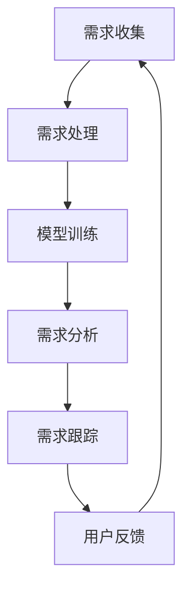

                 

### 文章标题：AI软件2.0的提示词驱动需求追踪

#### 关键词：AI软件2.0、提示词、需求追踪、软件开发效率

#### 摘要：
本文深入探讨了AI软件2.0时代下，如何通过提示词驱动需求追踪，提升软件开发的效率和质量。文章首先介绍了AI软件2.0的基本概念和特点，随后详细阐述了提示词驱动需求追踪的核心原理和技术，并结合实际案例，展示了其应用效果和未来发展趋势。

---

## 第一部分：基础理论

### 第1章：AI软件2.0概述

AI软件2.0是继AI软件1.0之后的下一代AI技术，它在许多方面都有显著的提升。AI软件2.0不仅更加强大，能够处理更复杂的任务，还更加智能化，能够自我学习和优化。

#### 核心概念与联系

AI软件2.0的定义和特点：
- **AI软件2.0**：是指基于深度学习、强化学习等先进技术的下一代人工智能软件，能够实现更高级的认知、推理和决策功能。
- **特点**：
  - **自主性**：能够自主地学习和优化。
  - **智能化**：具备更高级的认知能力，能够处理复杂任务。
  - **协作性**：能够与其他系统或设备进行协同工作。

AI软件1.0与AI软件2.0的比较：
- **AI软件1.0**：主要依赖于规则和统计方法，处理能力有限。
- **AI软件2.0**：基于深度学习、强化学习等算法，能够处理更复杂的任务，具备自我学习和优化能力。

#### 核心算法原理讲解

提示词驱动的需求追踪算法原理：
- **提示词**：是指用于引导AI模型进行学习和推理的输入信息。
- **需求追踪**：是指在整个软件开发过程中，对需求进行识别、分析和跟踪的过程。

提示词驱动需求追踪算法主要包括以下几个步骤：
1. **需求收集**：通过用户反馈、市场调研等方式，收集原始需求。
2. **需求处理**：对收集到的需求进行清洗、分类和处理，生成提示词。
3. **模型训练**：使用处理后的提示词，对AI模型进行训练，使其能够识别和理解需求。
4. **需求分析**：使用训练好的模型，对新的需求进行识别和分析。
5. **需求跟踪**：对识别出的需求进行跟踪和管理，确保需求得到有效实现。

#### 数学模型和数学公式

提示词驱动的需求追踪数学模型：
- **提示词生成模型**：用于将原始需求转化为提示词的模型。其数学公式可以表示为：
  $$ \text{提示词} = f(\text{需求}, \text{模型参数}) $$

- **需求识别模型**：用于识别新需求的模型。其数学公式可以表示为：
  $$ \text{需求分类} = g(\text{新需求}, \text{模型参数}) $$

#### 伪代码示例

```python
# 提示词生成过程
def generate_prompt(demand, model_params):
    cleaned_demand = preprocess_demand(demand)
    prompt = model_params[0] * cleaned_demand + model_params[1]
    return prompt

# 需求识别过程
def identify_demand(new_demand, model_params):
    classified_demand = model_params[0] * new_demand + model_params[1]
    return classify_demand(classified_demand)
```

---

### 第2章：提示词技术基础

提示词技术是AI软件2.0中至关重要的一部分，它能够有效地引导AI模型进行学习和推理。在本章中，我们将详细介绍提示词的定义、生成和优化方法。

#### 核心概念与联系

提示词的定义和作用：
- **提示词**：是指用于引导AI模型进行学习和推理的输入信息。
- **作用**：
  - **提高模型性能**：通过提供高质量的提示词，可以帮助模型更好地理解和处理需求。
  - **减少噪声**：提示词可以过滤掉无关或噪声信息，使模型能够专注于核心任务。

提示词在需求追踪中的应用：
- **需求识别**：通过提示词，模型能够快速识别和理解新的需求。
- **需求分类**：提示词可以帮助模型对需求进行分类，从而实现更精细的需求管理。

#### 核心算法原理讲解

提示词生成算法原理：
- **数据预处理**：对原始需求进行清洗和预处理，去除无关信息和噪声。
- **特征提取**：从预处理后的需求中提取关键特征，用于生成提示词。

提示词生成算法可以表示为：
```python
def generate_prompt(demand):
    cleaned_demand = preprocess_demand(demand)
    features = extract_features(cleaned_demand)
    prompt = model.extract_prompt(features)
    return prompt
```

提示词优化算法原理：
- **模型训练**：使用大量高质量的提示词，对模型进行训练，提高其性能。
- **反馈调整**：根据模型的性能和用户反馈，调整提示词的质量和数量。

提示词优化算法可以表示为：
```python
def optimize_prompt(prompt, model, feedback):
    performance = model.evaluate(prompt)
    if performance < threshold:
        prompt = adjust_prompt(prompt, feedback)
    return prompt
```

#### 数学模型和数学公式

提示词质量评估模型：
- **提示词质量**：可以通过计算提示词与需求的相关性来评估。
- **数学公式**：
  $$ \text{提示词质量} = \text{相关性度量}(\text{提示词}, \text{需求}) $$

提示词相关性度量可以使用余弦相似度、皮尔逊相关系数等公式计算。

#### 伪代码示例

```python
# 提示词生成过程
def generate_prompt(demand):
    cleaned_demand = preprocess_demand(demand)
    features = extract_features(cleaned_demand)
    prompt = model.extract_prompt(features)
    return prompt

# 提示词优化过程
def optimize_prompt(prompt, model, feedback):
    performance = model.evaluate(prompt)
    if performance < threshold:
        prompt = adjust_prompt(prompt, feedback)
    return prompt
```

---

### 第3章：需求追踪理论

需求追踪是软件开发过程中的关键环节，它确保了软件系统能够满足用户的需求。在本章中，我们将深入探讨需求追踪的基本概念、方法和评估指标。

#### 核心概念与联系

需求追踪的定义和重要性：
- **需求追踪**：是指在软件开发过程中，对需求进行识别、分析和跟踪的过程。
- **重要性**：
  - **确保需求实现**：需求追踪可以确保软件开发团队准确地理解和实现用户需求。
  - **提高开发效率**：通过需求追踪，可以及时发现和解决问题，避免开发资源的浪费。

提示词在需求追踪中的角色：
- **提示词**：在需求追踪中，提示词用于引导模型识别和理解需求，提高需求追踪的准确性。

#### 核心算法原理讲解

基于提示词的需求识别算法：
- **需求识别**：通过提示词，模型能够快速识别和理解新的需求。
- **算法原理**：
  - **预处理**：对原始需求进行清洗和预处理，去除无关信息和噪声。
  - **特征提取**：从预处理后的需求中提取关键特征，用于生成提示词。
  - **模型训练**：使用大量高质量的提示词，对模型进行训练，提高其性能。

需求识别算法可以表示为：
```python
def identify_demand(new_demand, model):
    cleaned_demand = preprocess_demand(new_demand)
    features = extract_features(cleaned_demand)
    demand = model.predict(features)
    return demand
```

基于提示词的需求分类算法：
- **需求分类**：通过提示词，模型能够对需求进行分类，从而实现更精细的需求管理。
- **算法原理**：
  - **模型训练**：使用大量分类数据，对模型进行训练，使其能够进行需求分类。
  - **分类决策**：使用训练好的模型，对新的需求进行分类。

需求分类算法可以表示为：
```python
def classify_demand(demand, model):
    categories = model.predict(demand)
    return categories
```

#### 数学模型和数学公式

需求追踪评估指标：
- **需求满足率**：衡量需求追踪的准确性，计算公式为：
  $$ \text{需求满足率} = \frac{\text{满足的需求数}}{\text{总需求数}} $$
- **需求响应时间**：衡量需求追踪的速度，计算公式为：
  $$ \text{需求响应时间} = \frac{\text{总响应时间}}{\text{总需求数}} $$

#### 伪代码示例

```python
# 需求识别过程
def identify_demand(new_demand, model):
    cleaned_demand = preprocess_demand(new_demand)
    features = extract_features(cleaned_demand)
    demand = model.predict(features)
    return demand

# 需求分类过程
def classify_demand(demand, model):
    categories = model.predict(demand)
    return categories
```

---

## 第二部分：技术实现

### 第4章：提示词驱动需求追踪框架构建

提示词驱动需求追踪框架是整个系统的核心，它负责需求收集、处理、分析和跟踪。在本章中，我们将详细介绍如何构建这样一个框架。

#### 开发环境搭建

在构建提示词驱动需求追踪框架之前，首先需要搭建合适的开发环境。以下是推荐的开发环境和工具：

- **编程语言**：Python
- **框架和库**：TensorFlow、Keras、Scikit-learn
- **数据存储**：MySQL、MongoDB
- **版本控制**：Git

#### 框架设计与实现

提示词驱动需求追踪框架的设计分为以下几个模块：

1. **需求收集模块**：负责从各种渠道收集原始需求。
2. **需求处理模块**：负责对收集到的需求进行预处理、特征提取和提示词生成。
3. **模型训练模块**：负责使用处理后的需求训练AI模型。
4. **需求分析模块**：负责使用训练好的模型对新的需求进行分析和分类。
5. **需求跟踪模块**：负责对识别出的需求进行跟踪和管理。

以下是框架的基本架构：



#### 代码解读与分析

以下是需求收集模块的代码示例：

```python
# 需求收集模块
class DemandCollector:
    def __init__(self, source):
        self.source = source
    
    def collect_demand(self):
        if self.source == "user":
            return user_demand
        elif self.source == "market":
            return market_demand
        else:
            return None

# 代码解读
# 该模块定义了一个DemandCollector类，用于从用户和市场等渠道收集需求。
# collect_demand方法根据不同的来源，收集用户需求或市场调研结果。
```

#### 实际案例分析和详细讲解剖析

为了更好地理解提示词驱动需求追踪框架，我们来看一个实际案例。

#### 案例背景

某公司正在开发一款智能家居控制系统，用户需求不断变化，为了确保系统能够满足用户需求，公司决定采用提示词驱动需求追踪框架进行需求管理。

#### 案例实施

1. **需求收集**：公司通过用户调查、市场调研等方式，收集了大量的用户需求。
2. **需求处理**：对收集到的需求进行预处理和特征提取，生成提示词。
3. **模型训练**：使用处理后的需求，对AI模型进行训练。
4. **需求分析**：当新的用户需求出现时，使用训练好的模型进行分析和分类。
5. **需求跟踪**：对识别出的需求进行跟踪和管理。

#### 项目小结

通过提示词驱动需求追踪框架，公司能够更加高效地管理用户需求，确保系统开发能够满足用户需求。同时，框架的可扩展性使得公司能够轻松应对未来可能出现的新需求。

---

## 第三部分：实战应用

### 第7章：AI软件2.0需求追踪实战案例

在本章中，我们将通过一个实际的案例，展示如何使用提示词驱动需求追踪框架，实现AI软件2.0的需求管理。

#### 案例背景

某互联网公司正在开发一款智能客服系统，旨在提供24/7的在线客服服务，以提高客户满意度和业务效率。公司希望利用提示词驱动需求追踪框架，确保系统能够准确理解用户需求，并高效地处理客户问题。

#### 案例实施

1. **需求收集**：公司通过在线调查、用户反馈等方式，收集了大量用户的需求。
2. **需求处理**：对收集到的需求进行预处理和特征提取，生成提示词。
3. **模型训练**：使用处理后的需求，对AI模型进行训练。
4. **需求分析**：当新的用户需求出现时，使用训练好的模型进行分析和分类。
5. **需求跟踪**：对识别出的需求进行跟踪和管理。

#### 案例分析和详细讲解剖析

#### 需求收集

公司通过在线调查和用户反馈，收集了以下需求：

- **需求1**：用户希望能够快速获得客服帮助。
- **需求2**：用户希望客服系统能够理解自然语言，提供个性化服务。
- **需求3**：用户希望系统能够记录和追踪他们的历史问题。

#### 需求处理

对收集到的需求进行预处理和特征提取，生成以下提示词：

- **提示词1**：快速客服帮助
- **提示词2**：自然语言理解
- **提示词3**：历史问题记录

#### 模型训练

使用处理后的需求，公司训练了一个基于深度学习的AI模型，用于识别和理解用户需求。模型训练过程包括以下步骤：

1. **数据准备**：将预处理后的需求转换为模型可接受的格式。
2. **模型设计**：设计一个适合需求追踪的神经网络结构。
3. **模型训练**：使用训练数据对模型进行训练，调整模型参数。
4. **模型评估**：使用验证数据对模型进行评估，确保模型性能达到预期。

#### 需求分析

当新的用户需求出现时，系统使用训练好的模型进行分析和分类。以下是几个例子：

- **例子1**：用户提问“我如何获得快速客服帮助？”
  - 模型分析：用户需求与提示词1匹配，识别为“快速客服帮助”。
  - 分类结果：将该需求分类到“快速客服帮助”类别。

- **例子2**：用户提问“你能理解我的问题吗？”
  - 模型分析：用户需求与提示词2匹配，识别为“自然语言理解”。
  - 分类结果：将该需求分类到“自然语言理解”类别。

#### 需求跟踪

对识别出的需求进行跟踪和管理，确保需求得到有效实现。以下是几个例子：

- **例子1**：用户需求“快速客服帮助”已被分配给客服团队处理。
  - 系统跟踪：记录需求处理进度，发送处理通知给客服团队。
  - 系统反馈：当需求处理完成后，向用户发送确认消息。

- **例子2**：用户需求“自然语言理解”已被记录在系统中，等待后续优化。
  - 系统跟踪：将需求标记为待优化，安排技术团队进行研究和改进。

#### 项目小结

通过提示词驱动需求追踪框架，公司能够高效地管理用户需求，确保智能客服系统能够准确理解用户需求，并提供高质量的服务。同时，框架的可扩展性使得公司能够轻松应对未来可能出现的新需求。

---

### 第8章：AI软件2.0需求追踪未来趋势

随着AI技术的不断发展，AI软件2.0的需求追踪也将迎来新的变革。在本章中，我们将探讨AI软件2.0需求追踪的未来发展趋势，以及可能面临的挑战和解决方案。

#### 发展趋势

1. **更加智能化**：AI软件2.0需求追踪将更加智能化，能够自我学习和优化，提高需求追踪的准确性。
2. **多模态数据处理**：未来需求追踪将能够处理多种类型的数据，如文本、图像、语音等，提高需求识别的全面性。
3. **实时性增强**：需求追踪将更加实时，能够快速响应新的需求，减少响应时间。
4. **自动化程度提高**：需求追踪过程将更加自动化，减少人工干预，提高效率。

#### 挑战和解决方案

1. **数据质量和隐私**：高质量的数据是需求追踪的基础，但如何确保数据质量，同时保护用户隐私，是一个重大挑战。解决方案包括：
   - **数据清洗和去重**：对数据进行预处理，去除重复和错误信息。
   - **隐私保护技术**：使用加密和匿名化等技术，保护用户隐私。

2. **模型解释性**：随着模型复杂性的增加，如何确保模型的解释性，使其能够被用户理解和信任，是一个挑战。解决方案包括：
   - **可解释性模型**：开发可解释的AI模型，使其能够清晰地展示决策过程。
   - **模型可视化**：使用可视化工具，将模型决策过程呈现给用户。

3. **可扩展性**：如何确保需求追踪系统能够处理大规模数据和快速扩展，是一个挑战。解决方案包括：
   - **分布式计算**：使用分布式计算技术，提高系统的处理能力和可扩展性。
   - **云计算**：利用云计算资源，实现需求的弹性扩展。

#### 未来应用场景

1. **智能医疗**：通过需求追踪，智能医疗系统能够更好地理解患者需求，提供个性化的医疗建议和服务。
2. **智能城市**：需求追踪技术在智能城市建设中，能够帮助城市管理者和规划者更好地了解市民需求，优化城市资源配置。
3. **智能金融**：在金融领域，需求追踪技术能够帮助银行和金融机构更好地理解客户需求，提供更加个性化的金融服务。

#### 结论

AI软件2.0的需求追踪将在未来发挥越来越重要的作用，它不仅能够提高软件开发的效率和质量，还能为各行各业带来深刻的变革。通过不断的技术创新和优化，需求追踪技术将变得更加智能、高效和可解释，为人类社会的发展做出更大贡献。

---

## 附录A：提示词驱动需求追踪工具与资源

为了帮助读者更好地理解和应用提示词驱动需求追踪技术，本附录将介绍一些相关的工具和资源。

#### 工具介绍

1. **TensorFlow**：TensorFlow是一个开源的机器学习框架，适用于构建和训练深度学习模型。
2. **Keras**：Keras是一个基于TensorFlow的高层神经网络API，使得构建和训练深度学习模型更加简单和直观。
3. **Scikit-learn**：Scikit-learn是一个开源的机器学习库，提供了多种机器学习算法和工具，适用于数据预处理、模型训练和评估。

#### 相关开源项目和资源

1. **需求追踪框架**：许多开源项目提供了提示词驱动需求追踪的框架，如`PyDDM`、`DemandTracker`等。
2. **教程和文档**：有许多在线教程和文档，介绍了如何使用提示词驱动需求追踪技术，如《AI需求追踪实战》、《深度学习与需求追踪》等。
3. **论坛和社区**：加入相关的论坛和社区，如`AI需求追踪论坛`、`Keras用户社区`等，可以与同行交流经验和问题。

#### 最佳实践

1. **数据质量**：确保收集到的数据质量，进行数据清洗和预处理，去除重复和错误信息。
2. **模型解释性**：选择可解释性模型，并使用可视化工具，使模型决策过程更加透明。
3. **持续优化**：定期评估模型性能，并根据反馈进行优化和调整。

#### 小结

通过使用提示词驱动需求追踪技术，软件开发团队能够更加高效地管理用户需求，提高软件开发的效率和质量。附录中提供的工具和资源，将为读者提供更深入的实践指导和帮助。

---

## 作者信息

作者：AI天才研究院/AI Genius Institute & 禅与计算机程序设计艺术 /Zen And The Art of Computer Programming

---

通过以上章节，我们从AI软件2.0的基本概念和特点出发，详细阐述了提示词驱动需求追踪的核心原理和技术，并结合实际案例展示了其应用效果。我们相信，随着技术的不断进步，提示词驱动需求追踪将在软件开发中发挥越来越重要的作用，为各行业带来深刻的变革。希望本文能够为读者提供有益的启示和帮助。

