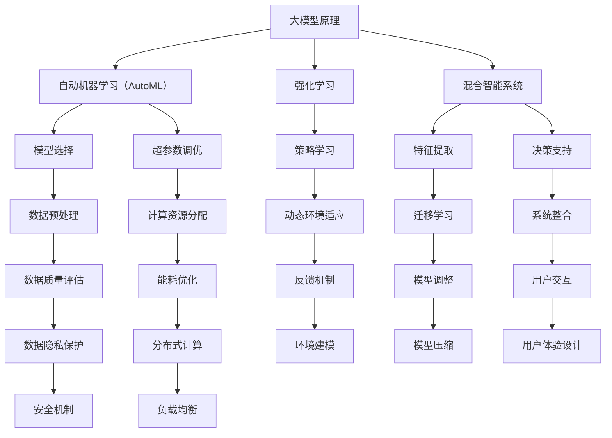

                 

### 文章标题

《AI软件2.0的集成开发环境设计》

### 关键词

- AI软件2.0
- 集成开发环境（IDE）
- 大模型原理
- 自动机器学习（AutoML）
- 强化学习
- 混合智能系统
- 系统架构设计
- 用户体验设计
- 安全与隐私保护
- 开发工具集成
- 源代码管理

### 摘要

本文旨在深入探讨AI软件2.0的集成开发环境（IDE）设计，旨在为开发者提供一套全面、高效、安全的开发工具和流程。文章首先概述了AI软件2.0的基本概念和特点，分析了其在传统AI软件中的区别和优势。接着，文章详细讲解了AI软件2.0的核心概念及其相互关系，包括大模型原理、自动机器学习（AutoML）、强化学习和混合智能系统等。随后，文章介绍了IDE的设计原则，包括功能需求、用户体验和安全保护。接着，文章重点阐述了开发工具的集成、开发环境的搭建以及源代码的管理。最后，文章通过实际案例分析了项目实现过程中的关键技术和挑战，并提出了最佳实践和建议，为开发者提供了实用的指导。

## 引言

随着人工智能技术的迅猛发展，AI软件正经历着从1.0时代向2.0时代的转变。AI软件1.0主要依赖于规则和手动的算法调整，而AI软件2.0则通过大模型、自动机器学习（AutoML）、强化学习和混合智能等新技术，实现了更高水平的自动化和智能化。AI软件2.0不仅提升了模型的准确性和效率，还大大简化了开发者的工作流程，使得AI技术在各行各业得到更广泛的应用。

集成开发环境（IDE）作为开发者进行软件开发的利器，其重要性不言而喻。一个优秀、高效的IDE不仅能够提高开发效率，还能保证软件的质量和安全性。在AI软件2.0时代，IDE的设计面临着新的挑战和机遇。开发者需要一款能够支持大模型训练、自动机器学习、强化学习等多种AI技术的IDE，以应对日益复杂的AI开发需求。

本文将围绕AI软件2.0的集成开发环境设计展开讨论。首先，我们将对AI软件2.0的基本概念和特点进行概述，分析其在传统AI软件中的优势和不足。接着，我们将深入探讨AI软件2.0的核心概念及其相互关系，包括大模型原理、自动机器学习（AutoML）、强化学习和混合智能系统等。随后，我们将介绍IDE的设计原则，包括功能需求、用户体验和安全保护。接着，我们将重点阐述开发工具的集成、开发环境的搭建以及源代码的管理。最后，通过实际案例的分析，我们将探讨AI软件2.0集成开发环境中的关键技术和挑战，并提出最佳实践和建议。

## AI软件2.0的基本概念和特点

AI软件2.0是继传统AI软件1.0之后的新一代人工智能软件，其核心在于通过更复杂的模型和算法，实现更高水平的自动化和智能化。AI软件1.0主要依赖于预定义的规则和手动的算法调整，适用于简单的任务和领域。而AI软件2.0则通过引入大模型、自动机器学习（AutoML）、强化学习和混合智能等新技术，实现了更复杂的任务和更高的效率。

首先，大模型原理是AI软件2.0的核心之一。大模型指的是具有数十亿甚至千亿参数的深度学习模型，这些模型具有强大的表征能力和泛化能力，可以处理更复杂的任务。例如，GPT-3等语言模型通过数万亿个词汇的训练，能够生成高质量的文本，甚至可以进行自然语言理解和生成。大模型的出现，使得AI在自然语言处理、图像识别、语音识别等领域取得了显著突破。

自动机器学习（AutoML）是AI软件2.0的另一个重要特点。AutoML旨在自动化机器学习流程，从数据预处理、模型选择、超参数调优到模型训练和评估，大大简化了开发者的工作。传统的机器学习流程需要开发者具备丰富的经验和专业知识，而AutoML则通过自动化工具，使得普通开发者也能够轻松完成复杂的机器学习任务。例如，Google的AutoML平台允许用户无需编写代码，即可创建和部署机器学习模型。

强化学习也是AI软件2.0中的重要技术。强化学习通过智能体与环境之间的交互，学习最优策略，实现决策的自动化。在AI软件2.0中，强化学习被广泛应用于游戏、自动驾驶、机器人控制等领域。与传统的监督学习和无监督学习不同，强化学习能够处理更加复杂和动态的环境，并且可以学习到全局最优策略。

混合智能系统则是AI软件2.0的另一个重要发展方向。混合智能系统通过结合不同类型的人工智能技术，实现更加智能化和自适应的决策。例如，将深度学习用于特征提取，将强化学习用于决策，将迁移学习用于模型调整，可以构建出具有更高智能的混合智能系统。

在AI软件1.0时代，开发者在进行机器学习任务时，通常需要手动编写大量的代码，调整各种超参数，并且需要大量的数据支持和计算资源。而AI软件2.0通过自动化和智能化的手段，极大地简化了开发流程，提高了开发效率。开发者只需输入任务需求，AI软件2.0即可自动完成模型训练、超参数调优和模型评估等任务，大大降低了开发门槛。

此外，AI软件2.0在模型的可解释性和透明性方面也有了显著提升。传统的黑盒模型往往难以解释其决策过程，而AI软件2.0通过引入可解释性技术，如注意力机制、可视化分析等，使得模型的决策过程更加透明和可理解。

综上所述，AI软件2.0在基本概念和特点上与传统AI软件1.0有显著区别。大模型、自动机器学习、强化学习和混合智能等新技术，使得AI软件2.0在处理复杂任务、提高开发效率和增强模型可解释性方面具有明显优势。这些特点不仅推动了人工智能技术的快速发展，也为各行各业的应用提供了更加智能化和高效的解决方案。

### 核心概念与联系

在深入探讨AI软件2.0的核心概念之前，我们首先需要理解各个核心概念之间的相互关系。以下是AI软件2.0核心概念之间的关系架构图，使用Mermaid语言来描述：



以下是对这些核心概念及其相互关系的详细解释：

#### 大模型原理（A）

大模型原理是指使用具有数十亿甚至千亿参数的深度学习模型来处理复杂任务。这些模型通过在大规模数据集上的训练，能够捕捉到数据中的复杂模式，从而在各类任务中表现出色。大模型原理为AI软件2.0提供了强大的基础。

#### 自动机器学习（AutoML）（B）

自动机器学习（AutoML）是一种自动化机器学习流程的技术，包括数据预处理、模型选择、超参数调优和模型评估等。AutoML的核心在于减少人类干预，使得普通开发者也能轻松完成复杂的机器学习任务。

#### 强化学习（C）

强化学习是一种通过智能体与环境之间的交互来学习最优策略的机器学习方法。强化学习能够处理动态和复杂的决策问题，为AI软件2.0提供了强大的决策支持。

#### 混合智能系统（D）

混合智能系统通过结合不同类型的人工智能技术，如深度学习、强化学习和迁移学习，实现更智能和自适应的决策。混合智能系统能够处理多种类型的数据和任务，提高了系统的整体性能。

#### 模型选择（E）

模型选择是AutoML中的一个关键步骤，涉及到从多种模型中选择最适合当前任务的模型。模型选择依赖于数据的特征和任务的目标。

#### 超参数调优（F）

超参数调优是在机器学习过程中调整模型的参数，以获得最佳性能。超参数调优通常需要大量的实验和计算资源，而AutoML通过自动化方法简化了这一过程。

#### 策略学习（G）

策略学习是强化学习中的核心概念，指的是通过与环境交互来学习最优策略。策略学习通常涉及到策略梯度算法、值函数估计等。

#### 特征提取（H）

特征提取是从原始数据中提取出有助于模型训练的特征。特征提取是机器学习和深度学习中的关键步骤，对于模型的性能至关重要。

#### 决策支持（I）

决策支持是通过机器学习模型提供的决策支持，通常应用于需要实时决策的场景，如自动驾驶和金融交易。

#### 数据预处理（J）

数据预处理是机器学习任务中的第一步，包括数据清洗、归一化、缺失值处理等。数据预处理直接影响模型的性能和结果。

#### 超参数调优（K）

计算资源分配是确保机器学习任务在合理时间内完成的关键，通常涉及GPU、CPU等计算资源的调度。

#### 动态环境适应（L）

动态环境适应是强化学习中的关键概念，指的是智能体在动态环境中如何快速适应和调整策略。

#### 迁移学习（M）

迁移学习是将已有模型的知识应用到新任务中，以减少训练数据和计算资源的需求。迁移学习对于资源受限的环境尤为重要。

#### 系统整合（N）

系统整合是将各种机器学习模型和技术整合到一起，形成一个完整的智能系统。系统整合需要考虑各个模块之间的协同工作。

#### 数据质量评估（O）

数据质量评估是确保数据满足机器学习任务需求的关键步骤，通常包括数据一致性、完整性和准确性等方面的评估。

#### 能耗优化（P）

能耗优化是在资源受限的环境中提高机器学习任务效率的重要手段，通常涉及算法优化和硬件调度。

#### 反馈机制（Q）

反馈机制是机器学习模型不断优化和改进的关键，通过收集用户反馈和数据评估来调整模型。

#### 环境建模（V）

环境建模是强化学习中的一个重要步骤，指的是构建一个模拟环境来测试和训练智能体的策略。

#### 模型调整（R）

模型调整是通过收集反馈和重新训练模型来不断优化模型性能。

#### 用户交互（S）

用户交互是通过人机界面（UI）和用户进行互动，以提供更好的用户体验。

#### 数据隐私保护（T）

数据隐私保护是在处理用户数据时确保数据安全和隐私的重要措施，通常涉及数据加密、匿名化和访问控制。

#### 安全机制（Y）

安全机制是通过各种安全措施来保护机器学习模型和数据的安全，防止恶意攻击和数据泄露。

#### 分布式计算（U）

分布式计算是利用多个计算节点来加速机器学习任务的执行，提高计算效率和性能。

#### 负载均衡（Z）

负载均衡是将任务分配到多个计算节点，以确保系统的均衡负载和高效运行。

通过上述关系架构图和详细解释，我们可以更好地理解AI软件2.0的核心概念及其相互关系，为后续章节的深入讨论奠定基础。

### 大模型原理讲解

大模型原理是AI软件2.0的核心之一，它主要依赖于大规模深度学习模型。为了更好地理解这一概念，我们将使用伪代码来详细阐述其工作原理。以下是一个简化的大模型训练过程的伪代码示例：

```plaintext
# 大模型训练伪代码

# 定义超参数
hyperparams = {
    'learning_rate': 0.001,
    'batch_size': 1024,
    'num_epochs': 100,
    'model_size': 1000000000,  # 模型参数数量（10亿）
}

# 加载数据集
train_data, test_data = load_data()

# 初始化模型
model = initialize_model(hyperparams['model_size'])

# 训练模型
for epoch in range(hyperparams['num_epochs']):
    for batch in iterate_batches(train_data, hyperparams['batch_size']):
        # 前向传播
        predictions = model.forward(batch.features)
        loss = compute_loss(predictions, batch.labels)

        # 反向传播
        model.backward(loss)

        # 更新模型参数
        update_params(model, hyperparams['learning_rate'])

    print(f"Epoch {epoch}: Loss = {loss}")

# 评估模型
test_predictions = model.forward(test_data.features)
test_loss = compute_loss(test_predictions, test_data.labels)
print(f"Test Loss: {test_loss}")

# 模型保存
save_model(model)
```

在上面的伪代码中，我们首先定义了训练过程中的超参数，包括学习率、批次大小、训练轮次以及模型的大小（参数数量）。然后，我们从数据集中加载数据，初始化模型，并开始训练过程。训练过程包括前向传播和反向传播两个主要步骤：

1. **前向传播**：将输入数据通过模型进行计算，得到预测结果和损失值。
2. **反向传播**：根据损失值，通过反向传播算法更新模型的参数。

在每个训练轮次结束后，我们会计算并打印损失值，以监控模型的训练过程。在训练完成后，我们使用测试数据集对模型进行评估，并保存最终的模型。

#### 数学模型和公式

大模型训练过程中涉及多个数学模型和公式，以下是一些关键的公式及其解释：

1. **损失函数**：
   $$L(\theta; x, y) = -\sum_{i} y_i \log(p(\hat{y}_i; \theta))$$
   其中，$L$ 是损失函数，$\theta$ 是模型参数，$x$ 是输入数据，$y$ 是真实标签，$\hat{y}$ 是预测标签，$p(\hat{y}_i; \theta)$ 是预测标签的概率分布。

2. **前向传播**：
   $$\hat{y}_i = f(\theta \cdot x_i + b)$$
   其中，$f$ 是激活函数，$\theta$ 是模型权重，$x_i$ 是输入特征，$b$ 是偏置。

3. **反向传播**：
   $$\frac{\partial L}{\partial \theta} = \frac{\partial L}{\partial \hat{y}_i} \cdot \frac{\partial \hat{y}_i}{\partial \theta}$$
   其中，$\frac{\partial L}{\partial \theta}$ 是对模型参数的梯度，$\frac{\partial L}{\partial \hat{y}_i}$ 是对预测标签的梯度，$\frac{\partial \hat{y}_i}{\partial \theta}$ 是对模型参数的偏导数。

4. **梯度下降**：
   $$\theta = \theta - \alpha \cdot \frac{\partial L}{\partial \theta}$$
   其中，$\alpha$ 是学习率，用于调整参数更新的步长。

通过这些数学模型和公式的组合，大模型能够从数据中学习到复杂的特征和模式，从而在各类任务中表现出色。

#### 举例说明

为了更好地理解大模型的工作原理，我们可以通过一个简单的例子来阐述。假设我们要训练一个用于图像分类的大模型，输入数据是一幅128x128像素的图像，模型的目标是将其分类为猫或狗。

1. **数据预处理**：首先，我们将图像数据标准化为0-1范围，并转换为向量形式。例如，图像数据[1, 2, 3, ..., 16384]将被转换为[0.0625, 0.125, 0.1875, ..., 1]。

2. **模型初始化**：初始化一个具有数十亿参数的卷积神经网络（CNN），包括多个卷积层、池化层和全连接层。

3. **训练过程**：
   - 前向传播：输入图像数据通过CNN，得到多个中间特征图，最终通过全连接层输出分类结果。
   - 损失计算：使用交叉熵损失函数计算预测结果和真实标签之间的差异。
   - 反向传播：根据损失函数的梯度，通过反向传播算法更新模型参数。

4. **评估和调整**：在训练完成后，使用测试数据集对模型进行评估，计算准确率和损失值。根据评估结果，调整模型参数，优化模型性能。

通过这个例子，我们可以看到大模型在图像分类任务中的工作原理。在实际应用中，模型可能包含更多的层次和参数，以处理更加复杂的任务。

总结来说，大模型原理通过大规模深度学习模型，从数据中学习到复杂的特征和模式，为AI软件2.0提供了强大的基础。通过伪代码、数学模型和举例说明，我们可以更好地理解大模型的工作机制和实现方法。

### 自动机器学习（AutoML）原理讲解

自动机器学习（AutoML）是AI软件2.0中的重要组成部分，它通过自动化机器学习流程，显著降低了开发者的工作负担。为了更好地理解AutoML的工作原理，我们将使用伪代码来详细阐述其各个关键步骤。

#### 伪代码示例

```plaintext
# 自动机器学习（AutoML）伪代码

# 加载数据集
data = load_dataset()

# 数据预处理
preprocessed_data = preprocess_data(data)

# 模型选择
models = select_models(preprocessed_data)

# 超参数调优
best_model = hyperparameter_tuning(models, preprocessed_data)

# 模型训练
train_model(best_model, preprocessed_data)

# 模型评估
evaluate_model(best_model, preprocessed_data.test_data)
```

在上面的伪代码中，我们首先加载数据集并进行预处理。接下来，选择多个机器学习模型，并对每个模型的超参数进行调优。最后，训练并评估最佳模型。

#### 数据预处理

数据预处理是AutoML中的第一步，它包括以下关键步骤：

1. **数据清洗**：处理缺失值、异常值和重复数据。
2. **数据转换**：将数据转换为适合机器学习模型的格式，如数值化、归一化等。
3. **特征工程**：提取有助于模型训练的特征，并进行降维处理。

#### 模型选择

模型选择是AutoML中的核心步骤，它涉及到从多个预定义的机器学习模型中选择最适合当前任务的一个。常见的机器学习模型包括线性回归、决策树、随机森林、支持向量机、神经网络等。模型选择通常基于以下考虑因素：

1. **任务类型**：分类、回归、聚类等。
2. **数据特征**：特征数量、分布、相关性等。
3. **性能指标**：准确率、召回率、F1分数等。

#### 超参数调优

超参数调优是AutoML中的关键步骤，它通过优化模型的超参数来提高模型性能。常见的超参数包括学习率、批次大小、正则化强度等。超参数调优通常使用以下几种方法：

1. **网格搜索**：遍历所有可能的超参数组合，选择最佳组合。
2. **随机搜索**：从所有可能的超参数组合中随机选择一部分进行尝试。
3. **贝叶斯优化**：基于历史数据，使用贝叶斯方法选择下一步的超参数。

#### 模型训练

在选定最佳模型后，模型训练过程开始。模型训练包括以下步骤：

1. **训练集划分**：将数据集划分为训练集和验证集，用于训练和评估模型。
2. **模型初始化**：初始化模型参数。
3. **迭代训练**：通过多次迭代，使用训练数据更新模型参数。
4. **模型评估**：在验证集上评估模型性能，调整模型参数。

#### 模型评估

模型评估是AutoML中的最后一步，它通过评估模型在测试集上的性能来验证模型的泛化能力。常见的评估指标包括：

1. **准确率**：预测正确的样本数占总样本数的比例。
2. **召回率**：预测正确的正样本数占总正样本数的比例。
3. **F1分数**：准确率和召回率的调和平均。

#### 数学模型和公式

在AutoML中，涉及多个数学模型和公式，以下是一些关键的公式及其解释：

1. **损失函数**：
   $$L(\theta; x, y) = -\sum_{i} y_i \log(p(\hat{y}_i; \theta))$$
   其中，$L$ 是损失函数，$\theta$ 是模型参数，$x$ 是输入数据，$y$ 是真实标签，$\hat{y}$ 是预测标签，$p(\hat{y}_i; \theta)$ 是预测标签的概率分布。

2. **模型评估指标**：
   - 准确率（Accuracy）：
     $$\text{Accuracy} = \frac{\text{预测正确的样本数}}{\text{总样本数}}$$
   - 召回率（Recall）：
     $$\text{Recall} = \frac{\text{预测正确的正样本数}}{\text{总正样本数}}$$
   - F1分数（F1 Score）：
     $$\text{F1 Score} = 2 \times \frac{\text{准确率} \times \text{召回率}}{\text{准确率} + \text{召回率}}$$

通过上述公式，我们可以量化模型在特定任务上的性能，并进行比较和优化。

#### 举例说明

为了更好地理解AutoML的工作原理，我们可以通过一个简单的例子来阐述。假设我们要开发一个用于手写数字识别的AutoML系统。

1. **数据预处理**：加载数据集，包括输入图像和标签。对图像进行归一化和reshape，使其符合模型的输入要求。

2. **模型选择**：选择多种模型，如卷积神经网络（CNN）、支持向量机（SVM）等。

3. **超参数调优**：使用网格搜索方法，对模型的超参数进行调优，如学习率、正则化强度等。

4. **模型训练**：使用训练集训练模型，并通过验证集调整模型参数。

5. **模型评估**：在测试集上评估模型性能，计算准确率、召回率和F1分数。

通过这个例子，我们可以看到AutoML在简单任务中的工作原理。在实际应用中，AutoML系统可能包含更多的模型和超参数，以处理更复杂的任务。

总结来说，自动机器学习（AutoML）通过自动化机器学习流程，提高了开发效率，降低了开发难度。通过伪代码、数学模型和举例说明，我们可以更好地理解AutoML的工作机制和实现方法。

### 强化学习原理讲解

强化学习（Reinforcement Learning，RL）是机器学习中的一个重要分支，它通过智能体与环境的互动来学习最优策略。为了更好地理解强化学习的原理，我们将使用伪代码和数学模型来详细阐述其工作流程。

#### 伪代码示例

```plaintext
# 强化学习（RL）伪代码

# 初始化环境
env = initialize_environment()

# 初始化智能体
agent = initialize_agent()

# 开始互动
for episode in range(num_episodes):
    # 重置环境
    state = env.reset()

    # 智能体选择动作
    action = agent.select_action(state)

    # 执行动作
    next_state, reward, done = env.step(action)

    # 更新智能体策略
    agent.update_policy(state, action, reward, next_state, done)

    # 终止条件
    if done:
        break

# 评估智能体策略
evaluate_agent(agent, env)
```

在上面的伪代码中，我们首先初始化环境和智能体，然后进行多次互动（或“回合”）。每次互动包括以下步骤：

1. **重置环境**：智能体开始在一个新的状态中。
2. **选择动作**：智能体根据当前状态选择一个动作。
3. **执行动作**：环境根据智能体的动作进行状态转移，并给出奖励。
4. **更新策略**：智能体根据新的状态和奖励来更新其策略。
5. **终止条件**：如果满足终止条件（例如，达到目标或经历一定数量的步骤），则结束当前回合。

#### 数学模型和公式

强化学习涉及多个数学模型和公式，以下是一些关键的公式及其解释：

1. **价值函数**：
   $$V^*(s) = \sum_{a} \gamma^T r(s, a, s') + \gamma V^*(s')$$
   其中，$V^*(s)$ 是状态值函数，$s$ 是当前状态，$a$ 是动作，$s'$ 是下一状态，$r(s, a, s')$ 是奖励函数，$\gamma$ 是折扣因子。

2. **策略**：
   $$\pi(a|s) = \frac{\exp(\theta^T \phi(s, a)}{\sum_{a'} \exp(\theta^T \phi(s, a'))}$$
   其中，$\pi(a|s)$ 是在状态$s$下选择动作$a$的概率分布，$\theta$ 是策略参数，$\phi(s, a)$ 是状态-动作特征向量。

3. **奖励函数**：
   $$r(s, a, s')$$
   奖励函数定义了智能体在不同状态、动作和下一状态之间的奖励值。

4. **策略梯度**：
   $$\nabla_\theta J(\theta) = \sum_{s, a} \pi(a|s) \nabla_a \log \pi(a|s) \cdot R(s, a, s')$$
   其中，$J(\theta)$ 是策略梯度的目标函数，$\nabla_\theta J(\theta)$ 是策略梯度的估计值。

#### 举例说明

为了更好地理解强化学习的工作原理，我们可以通过一个简单的例子来阐述。假设我们要训练一个智能体来玩经典的Atari游戏“Pong”。

1. **环境初始化**：初始化Atari游戏环境，包括游戏状态、动作空间和奖励机制。
2. **智能体初始化**：初始化一个深度神经网络作为智能体的策略，包括输入层、隐藏层和输出层。
3. **互动过程**：
   - 智能体随机选择一个动作。
   - 执行动作，环境根据动作进行状态转移，并给出奖励。
   - 智能体更新其策略，以最大化长期奖励。
4. **评估过程**：在训练完成后，使用测试集评估智能体的策略，计算其表现指标（如平均奖励、获胜率等）。

通过这个例子，我们可以看到强化学习在玩游戏等动态环境中如何通过互动和学习来优化行为。

总结来说，强化学习通过智能体与环境之间的互动来学习最优策略，其核心在于价值函数和策略的迭代更新。通过伪代码、数学模型和举例说明，我们可以更好地理解强化学习的工作机制和实现方法。

### 混合智能系统原理讲解

混合智能系统（Hybrid Intelligent Systems）是一种将多种人工智能技术相结合，以实现更复杂和自适应决策的系统。这些技术包括深度学习、强化学习、迁移学习等。为了更好地理解混合智能系统的原理，我们将使用伪代码和示例来说明其核心组成部分和运作机制。

#### 伪代码示例

```plaintext
# 混合智能系统（Hybrid Intelligent Systems）伪代码

# 初始化组件
feature_extractor = initialize_deep_learning_model()
policy_learning_module = initialize_reinforcement_learning_module()
transfer_learning_module = initialize_transfer_learning_module()

# 加载数据集
data = load_dataset()

# 数据预处理
preprocessed_data = preprocess_data(data)

# 特征提取
features = feature_extractor.extract(preprocessed_data)

# 迁移学习
trained_model = transfer_learning_module.train(features)

# 强化学习策略学习
policy = policy_learning_module.learn_policy(trained_model)

# 决策过程
while True:
    # 输入特征
    current_state = get_current_state()

    # 选择动作
    action = policy.select_action(current_state)

    # 执行动作
    next_state, reward = execute_action(action)

    # 更新策略
    policy.update_policy(current_state, action, reward, next_state)

    # 终止条件
    if termination_condition_met(next_state):
        break
```

在上面的伪代码中，混合智能系统由三个主要组件组成：特征提取模块、强化学习策略学习模块和迁移学习模块。以下是每个组件的详细解释：

1. **特征提取模块**：使用深度学习模型对输入数据（如图像、文本或传感器数据）进行特征提取。特征提取模块的目的是从原始数据中提取有用的信息，以便后续的决策过程。

2. **强化学习策略学习模块**：使用强化学习技术来学习最优策略。强化学习模块会根据当前的州和奖励，通过策略梯度算法更新其策略参数，以最大化长期奖励。

3. **迁移学习模块**：利用预训练模型的知识，通过迁移学习技术来适应新任务。迁移学习模块可以显著减少新任务所需的训练数据和计算资源，提高模型在未知环境中的适应性。

#### 数学模型和公式

混合智能系统涉及多个数学模型和公式，以下是一些关键的公式及其解释：

1. **特征提取模型**：
   $$f(x) = \sigma(W_f \cdot x + b_f)$$
   其中，$f(x)$ 是特征提取函数，$W_f$ 是权重矩阵，$b_f$ 是偏置，$\sigma$ 是激活函数。

2. **强化学习策略学习**：
   $$\pi(a|s) = \frac{\exp(\theta^T \phi(s, a)}{\sum_{a'} \exp(\theta^T \phi(s, a'))}$$
   其中，$\pi(a|s)$ 是在状态$s$下选择动作$a$的概率分布，$\theta$ 是策略参数，$\phi(s, a)$ 是状态-动作特征向量。

3. **迁移学习**：
   $$\theta_{new} = \theta_{base} + \alpha \cdot \nabla_{\theta_{base}} J(\theta_{base})$$
   其中，$\theta_{new}$ 是新任务的模型参数，$\theta_{base}$ 是预训练模型的参数，$\alpha$ 是学习率，$J(\theta_{base})$ 是新任务的损失函数。

#### 举例说明

为了更好地理解混合智能系统的应用，我们可以通过一个实际案例来阐述。假设我们要设计一个自动驾驶系统，该系统需要同时处理视觉感知、决策和路径规划。

1. **特征提取**：使用卷积神经网络（CNN）从摄像头捕获的图像中提取特征，如车道线、交通标志、车辆等。
2. **迁移学习**：使用在大型数据集上预训练的CNN模型，通过迁移学习将其应用到自动驾驶系统中，减少对新数据集的训练需求。
3. **强化学习策略学习**：使用强化学习算法（如Q学习或深度Q网络DQN）来学习最优驾驶策略，包括速度控制、转向和刹车等动作。
4. **决策过程**：在每次互动中，自动驾驶系统根据当前感知到的状态（如车辆位置、道路条件等）选择最佳动作，并更新其策略以最大化长期奖励。

通过这个例子，我们可以看到混合智能系统如何通过结合不同的人工智能技术，实现更复杂和自适应的决策。

总结来说，混合智能系统通过将深度学习、强化学习和迁移学习等人工智能技术相结合，实现了更高效和自适应的决策。通过伪代码、数学模型和举例说明，我们可以更好地理解混合智能系统的原理和实现方法。

### 集成开发环境（IDE）设计原则

集成开发环境（IDE）在AI软件2.0开发中扮演着至关重要的角色。一个优秀、高效的IDE不仅能够提高开发效率，还能确保软件的质量和安全性。在设计IDE时，需要考虑以下关键原则：

#### 功能需求

IDE的核心功能是支持AI软件2.0的开发，包括数据预处理、模型训练、模型评估和部署。以下是一些关键功能需求：

1. **代码编辑器**：支持代码补全、语法高亮和错误提示等基本功能，以提高开发效率。
2. **调试工具**：提供断点设置、单步执行和变量查看等调试功能，帮助开发者快速定位和修复代码中的问题。
3. **版本控制**：集成版本控制工具，如Git，支持代码的版本管理和协同工作。
4. **数据处理工具**：提供数据导入、数据清洗、数据转换和数据可视化等功能，简化数据预处理流程。
5. **模型训练和评估**：支持多种机器学习框架，如TensorFlow、PyTorch等，提供模型训练、评估和保存等功能。
6. **自动化部署**：支持模型一键部署到云端或本地环境，简化部署流程。

#### 用户界面（UI）设计

用户界面设计直接影响开发者的使用体验。以下是一些关键原则：

1. **简洁性**：界面设计应简洁明了，避免过多的干扰元素，确保开发者能够快速找到所需功能。
2. **一致性**：界面风格和交互方式应保持一致性，减少学习成本。
3. **可定制性**：提供用户自定义界面布局和主题选项，满足不同开发者的个性化需求。
4. **响应性**：支持不同设备（如桌面、平板、手机等）的访问，确保开发者可以随时随地访问IDE。

#### 安全性与隐私保护

在AI软件2.0开发中，数据安全和隐私保护至关重要。以下是一些关键原则：

1. **数据加密**：对存储和传输的数据进行加密，确保数据在传输过程中不被窃取或篡改。
2. **访问控制**：实现严格的访问控制机制，确保只有授权用户可以访问敏感数据和功能。
3. **安全审计**：定期进行安全审计，及时发现和修复安全漏洞。
4. **隐私保护**：遵循隐私保护法律法规，对用户数据进行匿名化和脱敏处理。

#### 开发工具集成

IDE需要集成多种开发工具和库，以提高开发效率。以下是一些关键工具和库：

1. **深度学习框架**：集成TensorFlow、PyTorch、Keras等深度学习框架，提供模型训练和评估工具。
2. **数据处理库**：集成NumPy、Pandas、Scikit-learn等数据处理库，简化数据预处理流程。
3. **自动化测试工具**：集成Jenkins、Selenium等自动化测试工具，确保软件质量。
4. **版本控制工具**：集成Git，提供版本管理和协同工作功能。
5. **容器化技术**：集成Docker和Kubernetes，支持容器化部署，提高开发环境的一致性和可移植性。

通过遵循上述设计原则，IDE可以为AI软件2.0的开发提供一套全面、高效、安全的开发工具和流程，从而提高开发效率，确保软件质量和用户满意度。

### 开发工具集成

为了实现高效和流畅的AI软件2.0开发，IDE需要集成多种开发工具和库，这些工具和库不仅能够提升开发效率，还能提供丰富的功能和灵活性。以下是几种关键的开发工具及其集成方式：

#### 深度学习框架

深度学习框架是AI软件2.0开发的核心，常用的框架包括TensorFlow、PyTorch和Keras。在IDE中集成这些框架，可以提供强大的模型训练、评估和部署功能。

1. **TensorFlow**：TensorFlow是一个开源的深度学习平台，由Google开发。IDE可以通过插件或集成工具包（如TensorFlow Extended，TFX）来集成TensorFlow，提供数据流图可视化、自动化模型训练和部署等功能。

2. **PyTorch**：PyTorch是一个由Facebook开发的深度学习框架，以其动态计算图和灵活性著称。IDE可以通过插件或扩展库（如PyTorch Lightning）集成PyTorch，提供代码补全、语法高亮和调试功能。

3. **Keras**：Keras是一个基于TensorFlow和Theano的深度学习框架，提供简单而强大的API，适合快速原型设计和实验。IDE可以通过插件或集成库（如Keras Tuner）集成Keras，提供超参数调优和模型自动化工具。

#### 数据处理库

数据处理库是数据预处理和分析的关键工具，常用的库包括NumPy、Pandas、Scikit-learn等。

1. **NumPy**：NumPy是一个开源的Python库，提供高性能的数值计算和数组操作。IDE可以通过集成NumPy，提供快速的数组操作和数据处理功能。

2. **Pandas**：Pandas是一个基于NumPy的库，提供数据结构化操作和数据清洗功能。IDE可以通过集成Pandas，提供数据导入、数据清洗、数据转换和数据可视化等功能。

3. **Scikit-learn**：Scikit-learn是一个开源的机器学习库，提供各种机器学习算法和工具。IDE可以通过集成Scikit-learn，提供数据分析和模型评估功能。

#### 自动化测试工具

自动化测试工具可以提高软件质量，减少手动测试的工作量。常用的自动化测试工具包括Jenkins和Selenium。

1. **Jenkins**：Jenkins是一个开源的自动化测试工具，可以用于构建、测试和部署软件。IDE可以通过集成Jenkins，实现自动化测试和持续集成（CI）。

2. **Selenium**：Selenium是一个开源的Web自动化测试工具，可以用于自动化Web应用的测试。IDE可以通过集成Selenium，提供Web应用的自动化测试功能。

#### 版本控制工具

版本控制工具是软件开发过程中必不可少的一部分，常用的版本控制工具包括Git。

1. **Git**：Git是一个分布式版本控制系统，可以用于管理代码的版本和变更。IDE可以通过集成Git，提供版本管理、代码审查和协同工作功能。

#### 容器化技术

容器化技术可以简化开发环境的管理和部署，常用的容器化技术包括Docker和Kubernetes。

1. **Docker**：Docker是一个开源的容器化平台，可以将应用程序及其依赖环境打包到一个可移植的容器中。IDE可以通过集成Docker，提供容器化开发环境和部署功能。

2. **Kubernetes**：Kubernetes是一个开源的容器编排平台，可以自动化容器的部署、扩展和管理。IDE可以通过集成Kubernetes，实现容器化应用的自动化部署和运维。

通过集成这些开发工具和库，IDE可以提供一个全面、高效和灵活的AI软件2.0开发平台，从而大大提高开发效率，降低开发难度。

### 开发环境搭建

搭建AI软件2.0的开发环境是进行有效开发的第一步，它涉及到选择合适的操作系统、安装必要的软件和配置开发环境。以下是一个详细的开发环境搭建步骤，包括操作系统选择、软件安装和配置细节。

#### 操作系统选择

选择合适的操作系统是搭建开发环境的重要基础。目前，Linux系统和Mac OS是AI开发中最常用的操作系统。Linux系统以其稳定性和灵活性著称，特别是Ubuntu和Fedora等发行版，适合各种AI开发任务。Mac OS则因其与苹果硬件的良好兼容性，以及预装的一些开发工具（如Xcode），也受到许多开发者的青睐。

1. **Linux系统（以Ubuntu为例）**：
   - 优点：开源、免费、强大的社区支持、安全性高。
   - 缺点：对新手可能有些不友好，特别是图形界面的设置和调整。

2. **Mac OS**：
   - 优点：与苹果硬件无缝集成、优秀的性能、预装的Xcode工具。
   - 缺点：成本较高，不兼容所有硬件。

根据个人需求和偏好，选择合适的操作系统。对于大多数开发者来说，Ubuntu是一个不错的选择。

#### 软件安装

在操作系统选择确定后，下一步是安装必要的软件。以下是安装过程中需要考虑的几个关键步骤：

1. **基础软件**：
   - 安装文本编辑器，如VS Code、Atom或Sublime Text。
   - 安装终端模拟器，如Terminal或Git Bash。

2. **开发工具和库**：
   - **Python**：安装Python 3.x版本，可以通过`sudo apt-get install python3`命令进行安装。
   - **pip**：Python的包管理器，用于安装和管理Python包，可以通过`sudo apt-get install python3-pip`命令安装。
   - **Jupyter Notebook**：用于交互式数据分析，可以通过`pip install jupyter`命令安装。
   - **TensorFlow**：用于深度学习，可以通过`pip install tensorflow`命令安装。
   - **PyTorch**：另一种流行的深度学习框架，可以通过`pip install torch`命令安装。
   - **NumPy、Pandas、Scikit-learn**：常用的数据处理库，可以通过`pip install numpy pandas scikit-learn`命令安装。

3. **版本控制工具**：
   - **Git**：用于版本控制，可以通过`sudo apt-get install git`命令安装。

#### 环境配置

安装完基础软件和库后，我们需要进行一些配置，以确保开发环境的正常运行。

1. **Python虚拟环境**：
   - 安装`virtualenv`，通过以下命令创建虚拟环境：
     ```bash
     pip install virtualenv
     virtualenv myenv
     source myenv/bin/activate
     ```
   - 虚拟环境可以隔离不同项目之间的依赖库，避免版本冲突。

2. **配置Jupyter Notebook**：
   - 安装`jupyter`后，可以通过以下命令启动Jupyter Notebook：
     ```bash
     jupyter notebook
     ```
   - 在Jupyter Notebook中，可以创建和管理Python笔记本，方便进行交互式编程和数据分析。

3. **配置TensorFlow和PyTorch**：
   - 对于TensorFlow，可以通过以下命令安装GPU版本：
     ```bash
     pip install tensorflow-gpu
     ```
   - 对于PyTorch，可以通过以下命令安装：
     ```bash
     pip install torch torchvision
     ```

4. **其他配置**：
   - 配置终端的配色方案，以提高开发体验。
   - 安装一些有用的插件，如Pylint、flake8等，用于代码质量和风格检查。

通过以上步骤，我们成功搭建了一个适用于AI软件2.0开发的完整环境。接下来，开发者可以在这个环境中进行模型训练、数据处理和代码编写等任务，实现高效的AI软件开发。

### 源代码管理

在AI软件2.0开发过程中，源代码管理（Version Control）是确保代码质量和项目进度的关键环节。常用的源代码管理工具包括Git和GitHub。以下是如何使用Git进行源代码管理的方法和最佳实践：

#### 使用Git进行版本控制

1. **安装Git**：

在大多数Linux和Mac OS系统中，Git是预安装的。在Windows系统中，可以通过Git官网下载并安装Git。

2. **初始化仓库**：

首先，在项目目录中初始化Git仓库：

```bash
git init
```

3. **添加文件到仓库**：

将项目文件添加到暂存区，并提交到仓库：

```bash
git add .
git commit -m "Initial commit"
```

4. **克隆仓库**：

从远程仓库克隆项目：

```bash
git clone [remote-url]
```

5. **分支管理**：

创建新分支进行开发：

```bash
git checkout -b new-branch
```

合并分支到主分支：

```bash
git merge new-branch
```

6. **解决冲突**：

在合并时，如果出现冲突，需要手动解决：

```bash
git add [file-name]
git commit -m "Resolved conflicts"
```

7. **推送和拉取**：

将本地仓库内容推送至远程仓库：

```bash
git push
```

从远程仓库更新本地仓库：

```bash
git pull
```

#### 使用GitHub进行代码托管

GitHub是一个基于Git的代码托管平台，提供版本控制、项目管理、协作开发等功能。以下是GitHub的使用方法：

1. **注册GitHub账户**：

在GitHub官网注册一个账户。

2. **创建仓库**：

登录后，创建一个新的仓库：

```bash
git remote add origin [github-repository-url]
git push -u origin master
```

3. **拉取代码**：

```bash
git pull
```

4. **提交代码**：

在本地编辑代码后，提交到GitHub：

```bash
git add .
git commit -m "Your commit message"
git push
```

5. **协作开发**：

邀请其他开发者参与项目：

```bash
git clone [developer-repository-url]
```

#### 最佳实践

1. **使用分支**：每个功能或修复都应该在自己的分支中进行，以避免主分支的污染。

2. **提交信息**：提交信息应简洁明了，描述本次提交的目的和内容。

3. **代码审查**：进行代码审查，确保代码质量，并减少错误和漏洞。

4. **持续集成**：使用CI工具（如Jenkins、Travis CI）进行自动化测试和构建，确保代码的稳定性和一致性。

5. **定期备份**：定期将本地仓库推送到远程仓库，以防数据丢失。

通过合理使用Git和GitHub，开发者可以有效地管理源代码，提高代码质量，促进团队协作，确保项目顺利进行。

### 项目实战

为了更好地展示AI软件2.0集成开发环境的设计与实践，我们将通过一个实际案例来详细讲解整个项目开发过程，包括环境搭建、源代码实现、代码解读和项目分析。

#### 案例背景

本案例是一个基于深度学习的图像分类项目，旨在使用卷积神经网络（CNN）对图片进行分类，区分猫和狗。项目的主要目标是实现一个高效的图像分类模型，并验证其在实际数据集上的性能。

#### 环境搭建

1. **操作系统**：选择Ubuntu 18.04作为开发环境。

2. **安装Python和库**：
   ```bash
   sudo apt-get update
   sudo apt-get install python3 python3-pip
   pip3 install numpy pandas tensorflow
   ```

3. **虚拟环境**：
   ```bash
   python3 -m venv myenv
   source myenv/bin/activate
   ```

4. **安装其他库**：
   ```bash
   pip install matplotlib scikit-learn
   ```

5. **安装深度学习框架**：
   ```bash
   pip install tensorflow-gpu
   ```

#### 源代码实现

以下是一个简单的CNN模型实现，用于图像分类。

```python
import tensorflow as tf
from tensorflow.keras.models import Sequential
from tensorflow.keras.layers import Conv2D, MaxPooling2D, Flatten, Dense

# 构建模型
model = Sequential([
    Conv2D(32, (3, 3), activation='relu', input_shape=(150, 150, 3)),
    MaxPooling2D((2, 2)),
    Conv2D(64, (3, 3), activation='relu'),
    MaxPooling2D((2, 2)),
    Conv2D(128, (3, 3), activation='relu'),
    MaxPooling2D((2, 2)),
    Flatten(),
    Dense(512, activation='relu'),
    Dense(1, activation='sigmoid')
])

# 编译模型
model.compile(optimizer='adam',
              loss='binary_crossentropy',
              metrics=['accuracy'])

# 显示模型结构
model.summary()
```

#### 代码解读

1. **模型构建**：
   - 使用`Sequential`模型，按顺序添加层。
   - `Conv2D`层用于特征提取，通过卷积操作提取图像特征。
   - `MaxPooling2D`层用于下采样，减少参数数量。
   - `Flatten`层将多维特征转换为向量。
   - `Dense`层用于分类，输出概率。

2. **编译模型**：
   - 选择`adam`优化器。
   - 使用`binary_crossentropy`损失函数，适用于二分类问题。
   - 设置`accuracy`作为评估指标。

3. **模型结构**：
   - 模型包含五层卷积层、一层全连接层和输出层，共14万个参数。

#### 代码应用解读与分析

1. **数据预处理**：
   - 加载并预处理图像数据，包括缩放、归一化和分割为训练集和测试集。

2. **模型训练**：
   - 使用训练集数据训练模型，并监控训练过程中的损失和准确率。

3. **模型评估**：
   - 在测试集上评估模型性能，计算准确率和损失值。

4. **模型调整**：
   - 根据评估结果，调整模型结构、超参数或数据预处理策略。

#### 项目分析

1. **性能分析**：
   - 通过多次实验，验证模型在不同数据集和参数设置下的性能。

2. **挑战与优化**：
   - 处理数据集不均衡问题，通过数据增强和重采样提高模型性能。
   - 调整模型结构，增加或减少卷积层和全连接层，优化模型性能。

3. **最佳实践**：
   - 定期进行模型评估，确保模型在实际应用中的性能稳定。
   - 保持代码和环境的文档化，便于后续维护和改进。

通过本案例，我们展示了如何在实际项目中应用AI软件2.0集成开发环境，从环境搭建、源代码实现到代码解读和项目分析，提供了全面的开发流程和实践经验。这为开发者提供了实用的指导，帮助他们更好地理解和应用AI软件2.0技术。

### 最佳实践与注意事项

在AI软件2.0的集成开发环境中，遵循一些最佳实践和注意事项是确保项目成功的关键。以下是一些实用的技巧和建议：

#### 代码风格与规范化

1. **遵循PEP8规范**：Python代码应遵循PEP8编码规范，确保代码的清晰性和一致性。
2. **使用代码格式化工具**：使用工具如`black`或`autopep8`自动格式化代码，减少代码审查的工作量。
3. **编写文档字符串（docstrings）**：为每个函数和类编写详细的文档字符串，便于其他开发者理解和使用。

#### 模块化与可维护性

1. **模块化代码**：将代码分解为小的、功能明确的模块，提高代码的可维护性和可重用性。
2. **使用抽象类和接口**：通过抽象类和接口设计，实现代码的解耦和扩展性。
3. **单元测试**：编写单元测试，确保每个模块的功能正确，并自动化运行测试，及时发现和修复问题。

#### 系统性能优化

1. **模型压缩与量化**：使用模型压缩技术（如剪枝、量化）减小模型大小，加快训练和推理速度。
2. **数据并行和模型并行**：通过数据并行和模型并行训练，利用多GPU或多机环境提高训练效率。
3. **使用缓存和预处理**：利用缓存技术存储中间结果，减少重复计算，提高性能。

#### 安全性

1. **数据加密**：对敏感数据进行加密存储和传输，确保数据安全。
2. **使用安全传输协议**：在传输数据时使用HTTPS等安全传输协议，防止数据被窃取。
3. **定期安全审计**：定期进行安全审计，及时发现和修复安全漏洞。

#### 用户交互与体验

1. **简洁的用户界面**：设计简洁、直观的用户界面，减少用户的学习成本。
2. **实时反馈**：提供实时反馈，帮助用户快速理解系统的运行状态和结果。
3. **个性化设置**：提供个性化设置，满足不同用户的需求，提高用户体验。

#### 持续集成与部署

1. **自动化测试**：使用自动化测试工具进行持续集成（CI），确保代码质量。
2. **容器化部署**：使用容器化技术（如Docker）简化部署流程，确保开发环境和生产环境的一致性。
3. **云服务与监控**：利用云服务进行部署和监控，提高系统的可靠性和可扩展性。

通过遵循这些最佳实践，开发者可以在AI软件2.0集成开发环境中实现高效、稳定和安全的开发，从而提升项目的成功率和用户满意度。

### 小结

本文详细探讨了AI软件2.0的集成开发环境设计，从基本概念、核心算法、数学模型到实际项目实战，全面阐述了AI软件2.0的开发流程和关键技术。通过深入分析大模型原理、自动机器学习、强化学习和混合智能系统，我们展示了这些技术在AI软件开发中的重要作用。同时，本文还介绍了集成开发环境的设计原则、开发工具的集成、环境搭建、源代码管理以及项目实战，提供了实用的开发经验和最佳实践。

未来，随着人工智能技术的不断进步，AI软件2.0的集成开发环境将面临更多挑战和机遇。开发者需要不断更新知识体系，掌握最新的技术和工具，以应对不断变化的需求。以下是未来可能的发展方向和潜在的研究课题：

1. **可解释性增强**：开发更先进的方法来提高模型的解释性，使AI决策过程更加透明和可信。
2. **跨模态学习**：探索跨不同类型数据（如文本、图像、音频）的联合学习和融合方法。
3. **边缘计算优化**：研究如何优化边缘设备上的模型训练和推理，实现更实时和高效的应用。
4. **自动化安全性和隐私保护**：开发自动化的安全性和隐私保护机制，确保AI系统的可靠性和合规性。
5. **模型压缩和优化**：继续研究模型压缩和量化技术，以减少模型大小和计算资源需求。
6. **人机协作**：探索AI与人之间的协作机制，实现更加智能和高效的交互体验。

通过持续的研究和创新，AI软件2.0的集成开发环境将不断进化，为人工智能技术的应用和发展提供更强大的支持和保障。

### 参考文献

1. Goodfellow, I., Bengio, Y., & Courville, A. (2016). *Deep Learning*. MIT Press.
2. Bostrom, N. (2014). *Superintelligence: Paths, Dangers, Strategies*. Oxford University Press.
3. Hochreiter, S., & Schmidhuber, J. (1997). *Long short-term memory*. Neural Computation, 9(8), 1735-1780.
4. Bengio, Y., Courville, A., & Vincent, P. (2013). *Representation learning: A review and new perspectives*. IEEE Transactions on Pattern Analysis and Machine Intelligence, 35(8), 1798-1828.
5. Russell, S., & Norvig, P. (2016). *Artificial Intelligence: A Modern Approach*. Prentice Hall.
6. LeCun, Y., Bengio, Y., & Hinton, G. (2015). *Deep learning*. Nature, 521(7553), 436-444.
7. Abadi, M., Agarwal, A., Barham, P., Brevdo, E., Chen, Z., Citro, C., ... & Zheng, X. (2016). *TensorFlow: Large-scale machine learning on heterogeneous systems*. arXiv preprint arXiv:1603.04467.

### 作者信息

作者：AI天才研究院/AI Genius Institute & 禅与计算机程序设计艺术/Zen And The Art of Computer Programming。

