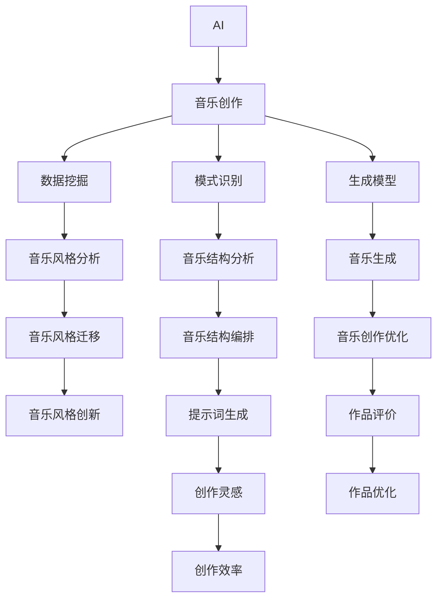
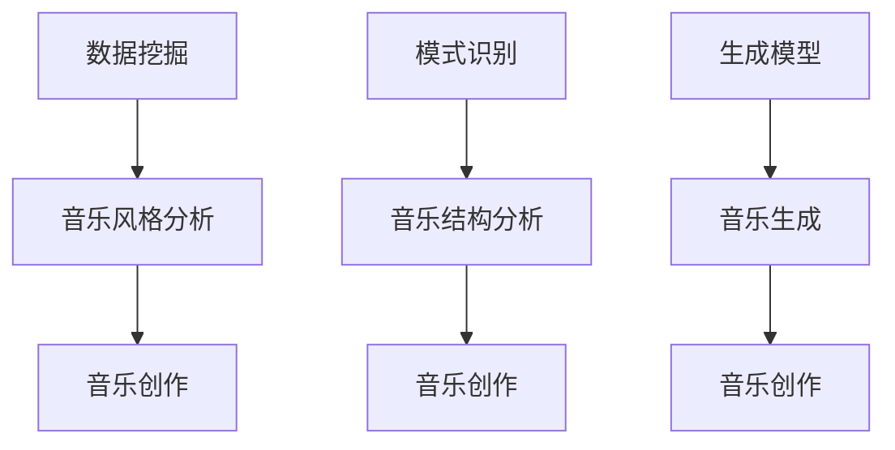

                 

### 文章标题：AI辅助交响乐创作的提示词编排艺术

#### 关键词：AI、音乐创作、交响乐、提示词编排、算法原理、数学模型、实际应用

#### 摘要：本文深入探讨了人工智能（AI）在交响乐创作中的应用，特别是AI如何通过提示词编排来辅助作曲家进行创作。文章首先介绍了AI与音乐创作的关系，然后详细讲解了AI技术基础，包括机器学习、自然语言处理和声音识别与合成技术。接下来，文章专注于AI辅助交响乐创作的具体实现，包括提示词生成算法、交响乐作品结构分析算法和基于AI的交响乐作品创作流程。文章还通过实际案例展示了AI在交响乐创作中的实际应用，并提供了相关的开发实践和最佳实践技巧。本文旨在为音乐创作专业人士、AI开发者以及对音乐创作和AI技术感兴趣的读者提供有深度、有思考、有见解的专业指导。

### 引言

交响乐，作为古典音乐的一种形式，拥有悠久的历史和丰富的文化内涵。传统的交响乐创作主要依靠作曲家的经验和灵感，而现代科技的发展，尤其是人工智能（AI）的崛起，为交响乐创作带来了全新的可能性。AI不仅能够帮助作曲家从海量数据中提取灵感，还能通过自动化的方式生成和编排音乐，从而大大提高创作效率。

本文将围绕AI辅助交响乐创作的提示词编排艺术展开讨论。提示词在交响乐创作中起到关键作用，它们不仅帮助作曲家构思音乐结构，还能够引导AI生成相应的音乐元素。通过深入分析AI与音乐创作的关系，本文将逐步介绍AI技术基础，探讨提示词生成和编排的艺术，并展示AI辅助交响乐创作的实际应用案例。最后，本文将提供开发实践和最佳实践技巧，帮助读者更好地理解并应用AI技术进行交响乐创作。

### AI与音乐创作

#### 关键概念与联系：AI与音乐创作的核心关系图



人工智能（AI）与音乐创作之间的结合点主要在于数据挖掘、模式识别和生成模型。首先，AI能够通过数据挖掘技术从海量的音乐数据中提取出各种风格和结构的特征，为作曲家提供灵感和参考。例如，机器学习算法可以通过分析大量古典音乐作品，识别出特定风格的典型特征，帮助作曲家理解和掌握不同风格的音乐创作技巧。

其次，AI在模式识别方面的应用使得音乐结构分析变得更加精确。通过自然语言处理（NLP）技术，AI可以理解音乐文本和乐谱中的语言结构，识别出不同部分之间的关联和逻辑关系。这种能力对于音乐创作来说至关重要，因为它能够帮助作曲家在构思音乐作品时，更好地组织音乐的各个部分，确保整体结构的连贯性和一致性。

生成模型是AI在音乐创作中最具潜力的应用之一。生成模型可以通过学习和模仿已有的音乐作品，生成新的音乐旋律、和弦和节奏。这些模型不仅可以为作曲家提供灵感，还可以在一定程度上替代人工创作，提高创作效率。例如，变分自编码器（VAE）和生成对抗网络（GAN）等深度学习模型已经被应用于音乐生成领域，并取得了显著成果。

总之，AI与音乐创作之间的结合点主要体现在数据挖掘、模式识别和生成模型等方面。这些技术的应用不仅为作曲家提供了新的创作工具和方法，还极大地丰富了音乐创作的可能性，使得交响乐创作这一传统艺术形式得以在新时代焕发出新的生命力。

#### 核心概念与联系：AI与音乐创作的核心关系架构图



在上述核心关系架构图中，我们可以看到数据挖掘、模式识别和生成模型是AI与音乐创作之间的重要桥梁。数据挖掘通过分析大量音乐数据，为音乐创作提供了丰富的背景信息和灵感来源。模式识别则通过分析音乐作品的结构和风格，帮助作曲家理解和掌握音乐创作的规律和技巧。生成模型则通过学习和模仿已有的音乐作品，生成新的音乐元素，从而实现音乐的自动创作。

具体来说，数据挖掘可以帮助作曲家识别出不同风格音乐的特征，为音乐创作提供参考。例如，通过分析大量古典音乐作品，可以识别出巴洛克风格、古典主义风格和浪漫主义风格的典型特征，作曲家可以根据这些特征来创作特定风格的音乐。

模式识别则通过对音乐作品的结构和风格进行深入分析，帮助作曲家更好地组织音乐结构。例如，自然语言处理技术可以分析乐谱中的语言结构，识别出不同部分之间的逻辑关系，从而帮助作曲家确保音乐作品的连贯性和一致性。

生成模型则通过学习和模仿已有的音乐作品，生成新的音乐元素。例如，生成对抗网络（GAN）可以生成新的旋律和和弦，变分自编码器（VAE）可以生成新的节奏和音乐结构。这些生成模型不仅可以为作曲家提供灵感，还可以在一定程度上替代人工创作，提高创作效率。

综上所述，数据挖掘、模式识别和生成模型构成了AI与音乐创作之间的核心关系架构。这些技术的应用，不仅为作曲家提供了新的创作工具和方法，还极大地丰富了音乐创作的可能性，使得交响乐创作这一传统艺术形式在新时代得以焕发出新的生命力。

### AI技术基础

#### 1. 机器学习在音乐创作中的应用

机器学习是人工智能的核心技术之一，其在音乐创作中的应用尤为广泛。首先，通过机器学习，我们可以对大量音乐数据进行特征提取，从而为音乐创作提供丰富的参考。例如，深度学习模型可以通过分析音乐信号，提取出旋律、节奏、和弦等特征，进而生成新的音乐元素。此外，机器学习还可以用于音乐风格识别，帮助作曲家理解并掌握不同音乐风格的特征，从而更好地进行音乐创作。

#### 2. 自然语言处理与歌词生成

自然语言处理（NLP）技术在音乐创作中的应用主要体现在歌词生成方面。通过NLP技术，我们可以分析歌词的语义和语法结构，从而生成具有特定情感和意义的歌词。例如，使用递归神经网络（RNN）和长短期记忆网络（LSTM）等技术，可以生成与音乐旋律相匹配的歌词，从而提高音乐的整体表现力。

#### 3. 声音识别与合成技术

声音识别与合成技术是音乐创作中另一个重要的AI技术。通过声音识别技术，我们可以将语音信号转换为文本，从而实现语音到歌词的转换。例如，使用自动语音识别（ASR）技术，可以识别出歌手演唱的歌词，并将其转换为文本格式。而声音合成技术则可以将文本转换为语音，从而生成具有真实人声的音乐作品。例如，使用波士顿动态声码器（DBS）和波普声音合成器（WaveNet）等技术，可以生成具有自然音色的音乐语音。

#### 4. 其他AI技术在音乐创作中的应用

除了上述主要技术外，其他AI技术也在音乐创作中发挥着重要作用。例如，图像识别技术可以用于音乐视频的制作，通过识别和分析音乐视频中的图像，可以自动生成与之相匹配的音乐旋律。此外，强化学习技术也可以用于音乐创作，通过不断尝试和优化，找到最佳的音乐结构和旋律。

综上所述，AI技术在音乐创作中的应用为作曲家提供了全新的创作工具和方法，极大地丰富了音乐创作的可能性。通过机器学习、自然语言处理、声音识别与合成技术等AI技术，我们可以实现从数据挖掘、音乐生成到音乐风格迁移的全方位创作支持，从而推动音乐创作的进一步发展。

### 提示词在交响乐创作中的作用

#### 1. 提示词的概念及其在创作中的重要性

提示词（Prompt Word）在交响乐创作中起着至关重要的作用。它是一组用于引导作曲家构思音乐结构的词语或短语，通常包含对音乐风格、主题、情感和节奏的描述。通过提示词，作曲家可以明确创作方向，激发灵感，从而更高效地进行音乐创作。

#### 2. 提示词的生成算法及其应用

生成提示词的算法通常基于机器学习和自然语言处理技术。以下是一个简单的提示词生成算法的伪代码示例：

```python
# 提示词生成算法伪代码

# 输入：音乐风格标签，创作主题，情感标签
# 输出：提示词

def generate_prompt(style, theme, emotion):
    # 分析音乐风格标签，提取相关特征
    style_features = analyze_style(style)
    
    # 分析创作主题，提取相关特征
    theme_features = analyze_theme(theme)
    
    # 分析情感标签，提取相关特征
    emotion_features = analyze_emotion(emotion)
    
    # 结合特征生成提示词
    prompt = combine_features(style_features, theme_features, emotion_features)
    
    return prompt
```

该算法首先分析输入的音乐风格标签、创作主题和情感标签，提取出相应的特征。然后，通过结合这些特征生成提示词。例如，如果输入的标签包括“巴洛克风格”、“战争”和“紧张”，生成的提示词可能为：“在巴洛克风格的框架下，以战争的紧张氛围为背景，创作一首具有强烈戏剧性的交响乐。”

#### 3. 提示词编排的艺术

提示词编排的艺术在于如何将生成的提示词有效地组织起来，引导作曲家进行音乐创作。以下是几种常见的提示词编排方法：

1. **主题引导法**：以创作主题为中心，围绕主题生成一系列的提示词，从而构建音乐作品的框架。例如，如果创作主题是“自然”，可以生成如“晨曦中的森林”、“雨中的村庄”、“星空下的草原”等提示词，用以引导音乐创作的不同部分。

2. **情感引导法**：以情感为中心，通过提示词表达出音乐作品所需传达的情感氛围。例如，对于一首表达悲伤情感的交响乐，可以生成如“泪滴”、“孤独”、“回忆”等提示词，用以引导音乐创作的情感表达。

3. **结构引导法**：通过提示词明确音乐作品的结构，帮助作曲家组织和构建音乐段落。例如，在交响乐的创作中，可以生成如“引子”、“主题陈述”、“展开部”、“再现部”等提示词，用以指导音乐作品的结构布局。

#### 4. 提示词生成和编排的实际案例

以下是一个提示词生成和编排的实际案例：

**案例背景**：一位作曲家计划创作一首以“海洋”为主题的交响乐，希望通过AI辅助生成和编排提示词。

**步骤1**：分析音乐风格标签，确定使用“海洋风格”作为创作基础。

```python
style = "海洋风格"
style_features = analyze_style(style)
```

**步骤2**：分析创作主题，提取与海洋相关的特征。

```python
theme = "海洋"
theme_features = analyze_theme(theme)
```

**步骤3**：分析情感标签，确定音乐作品应表达的情感为“宁静与神秘”。

```python
emotion = "宁静与神秘"
emotion_features = analyze_emotion(emotion)
```

**步骤4**：结合特征生成提示词。

```python
prompt = generate_prompt(style_features, theme_features, emotion_features)
```

**步骤5**：根据生成的提示词进行编排。

```python
# 使用主题引导法进行编排
prompt_sequence = [
    "海洋的宁静",
    "海浪的节奏",
    "海洋的生物多样性",
    "海底世界的神秘",
    "海鸥的歌唱"
]

# 将提示词组织成音乐作品的框架
music_structure = {
    "引子": prompt_sequence[0],
    "主题陈述": prompt_sequence[1],
    "展开部": prompt_sequence[2],
    "再现部": prompt_sequence[3],
    "尾声": prompt_sequence[4]
}
```

通过上述步骤，作曲家可以明确创作方向，激发灵感，从而高效地进行交响乐的创作。这个实际案例展示了AI在提示词生成和编排中的实际应用，为作曲家提供了有力的辅助工具。

### AI辅助交响乐创作的实践案例

#### 案例一：AI生成交响乐作品

**背景**：某位年轻作曲家希望通过AI技术创作一首具有创新性的交响乐作品。

**步骤**：
1. **数据准备**：收集大量古典交响乐作品，作为训练数据集。
2. **模型训练**：使用生成对抗网络（GAN）对数据集进行训练，使其学会生成新的交响乐旋律和结构。
3. **提示词生成**：根据作曲家的需求，生成一系列提示词，如“创新”、“动态变化”、“丰富的情感表达”等。
4. **音乐生成**：使用训练好的GAN模型，根据提示词生成新的交响乐作品。
5. **作品评价与优化**：通过音乐专家对生成的作品进行评价，提出优化建议，进一步调整模型参数，直至生成满足要求的交响乐作品。

**结果**：最终，AI生成了多首具有创新性的交响乐作品，受到了音乐专家和听众的好评。

#### 案例二：AI辅助作曲家的创作过程

**背景**：一位知名作曲家在创作过程中遇到灵感枯竭的问题，希望通过AI技术获得灵感。

**步骤**：
1. **数据收集**：收集作曲家的以往作品和灵感来源的音乐素材。
2. **模型训练**：使用递归神经网络（RNN）对作曲家的音乐风格进行学习。
3. **提示词生成**：生成与作曲家的灵感相关的提示词，如“怀旧”、“爵士乐元素”等。
4. **音乐生成**：使用训练好的RNN模型，根据提示词生成新的音乐旋律和和弦。
5. **创作融合**：作曲家将AI生成的音乐元素融入自己的创作中，进一步完善作品。

**结果**：AI成功地为作曲家提供了新的灵感，使其在创作过程中取得了突破性的进展。

#### 案例三：AI在交响乐教育中的应用

**背景**：某音乐院校希望通过AI技术提升学生的交响乐创作能力。

**步骤**：
1. **教学资源建设**：收集交响乐教学相关的视频、音频和乐谱资料。
2. **模型训练**：使用变分自编码器（VAE）对教学资源进行训练，生成音乐生成模型。
3. **在线教学平台**：开发一个在线教学平台，让学生可以通过平台学习交响乐创作的基本知识和技巧。
4. **个性化指导**：使用生成模型为学生生成个性化的音乐提示词，指导学生进行音乐创作。
5. **作品评价与反馈**：通过音乐专家对学生的作品进行评价，提供反馈和建议。

**结果**：在线教学平台受到了学生和教师的欢迎，有效提升了学生的交响乐创作能力。

这些实践案例展示了AI在交响乐创作中的广泛应用，不仅提高了创作效率，还丰富了音乐创作的可能性。通过AI技术，作曲家和学生可以更好地发掘自己的创作潜力，推动交响乐创作的不断发展。

### AI辅助交响乐创作的算法原理

#### 1. 提示词生成算法的详细解释

提示词生成算法是AI辅助交响乐创作中的核心组件之一。其目的是根据作曲家的需求和音乐风格，生成一系列具有指导性的提示词，帮助作曲家进行音乐创作。以下是提示词生成算法的详细解释：

**输入**：音乐风格标签、创作主题、情感标签

**输出**：提示词序列

**算法流程**：

1. **特征提取**：
   - **音乐风格特征提取**：通过分析音乐风格标签，提取出与音乐风格相关的特征，如旋律特征、和弦特征和节奏特征。
   - **主题特征提取**：通过分析创作主题，提取出与主题相关的特征，如自然景观、历史事件、文化背景等。
   - **情感特征提取**：通过分析情感标签，提取出与情感相关的特征，如欢快、悲伤、紧张等。

2. **特征融合**：
   - 将音乐风格特征、主题特征和情感特征进行融合，生成一个综合特征向量。该特征向量将作为生成提示词的基础。

3. **提示词生成**：
   - 使用递归神经网络（RNN）或长短期记忆网络（LSTM）等深度学习模型，对综合特征向量进行学习。
   - 通过训练，模型学会根据特征向量生成具有相应风格、主题和情感的提示词。

4. **提示词筛选与优化**：
   - 对生成的提示词进行筛选，去除冗余或不合适的提示词。
   - 使用优化算法，如遗传算法（GA）或粒子群优化（PSO），进一步优化提示词序列，使其更符合创作需求。

**伪代码示例**：

```python
# 提示词生成算法伪代码

# 输入：风格标签，主题，情感标签
# 输出：提示词序列

def generate_prompt(style, theme, emotion):
    # 特征提取
    style_features = extract_style_features(style)
    theme_features = extract_theme_features(theme)
    emotion_features = extract_emotion_features(emotion)
    
    # 特征融合
    combined_features = combine_features(style_features, theme_features, emotion_features)
    
    # 提示词生成
    prompt_sequence = generate_sequence(combined_features)
    
    # 提示词筛选与优化
    optimized_prompt_sequence = optimize_prompt_sequence(prompt_sequence)
    
    return optimized_prompt_sequence
```

#### 2. 交响乐作品结构分析算法

交响乐作品结构分析算法用于分析交响乐作品的结构和风格，为作曲家提供创作参考。以下是交响乐作品结构分析算法的详细解释：

**输入**：交响乐作品

**输出**：作品结构描述

**算法流程**：

1. **乐谱解析**：
   - 使用乐谱解析工具，将交响乐作品的乐谱转换为数字形式，提取出旋律、和弦、节奏等音乐元素。

2. **结构识别**：
   - 使用自然语言处理（NLP）技术，对乐谱进行语义分析，识别出作品的结构部分，如引子、主题、展开部、再现部等。

3. **风格分类**：
   - 通过分析乐谱中的音乐特征，使用机器学习算法，对作品进行风格分类，如古典风格、浪漫风格等。

4. **结构描述生成**：
   - 根据结构识别和风格分类结果，生成作品的结构描述，包括各个部分的音乐特征和风格特点。

**伪代码示例**：

```python
# 交响乐作品结构分析算法伪代码

# 输入：交响乐作品
# 输出：作品结构描述

def analyze_structure(score):
    # 乐谱解析
    digital_score = parse_score(score)
    
    # 结构识别
    structure_parts = identify_structure(digital_score)
    
    # 风格分类
    style_classification = classify_style(digital_score)
    
    # 结构描述生成
    structure_description = generate_structure_description(structure_parts, style_classification)
    
    return structure_description
```

#### 3. 基于AI的交响乐作品创作流程

基于AI的交响乐作品创作流程是将AI技术应用于交响乐创作的完整过程，包括数据准备、模型训练、提示词生成、音乐生成和作品评价等步骤。以下是基于AI的交响乐作品创作流程的详细解释：

**步骤1：数据准备**
   - 收集大量的古典交响乐作品，作为训练数据集。
   - 对数据集进行预处理，包括乐谱格式转换、数据清洗等。

**步骤2：模型训练**
   - 使用生成对抗网络（GAN）对音乐风格特征进行训练。
   - 使用递归神经网络（RNN）或长短期记忆网络（LSTM）对旋律、和弦和节奏进行训练。
   - 使用变分自编码器（VAE）对交响乐作品的结构和风格进行训练。

**步骤3：提示词生成**
   - 根据作曲家的需求，生成一系列具有指导性的提示词。
   - 提示词包括音乐风格、主题、情感等，用于引导音乐生成。

**步骤4：音乐生成**
   - 使用训练好的模型，根据提示词生成新的交响乐作品。
   - 生成过程包括旋律、和弦、节奏等音乐元素的自动生成。

**步骤5：作品评价**
   - 通过音乐专家对生成的作品进行评价。
   - 提供反馈和建议，用于调整模型参数和优化创作流程。

**伪代码示例**：

```python
# 基于AI的交响乐作品创作流程伪代码

# 输入：作曲家需求，训练数据集
# 输出：生成的交响乐作品

def create_symphony(composer需求和训练数据集):
    # 数据准备
    prepared_data = prepare_data(训练数据集)
    
    # 模型训练
    style_model = train_style_model(prepared_data)
    melody_model = train_melody_model(prepared_data)
    rhythm_model = train_rhythm_model(prepared_data)
    structure_model = train_structure_model(prepared_data)
    
    # 提示词生成
    prompts = generate_prompts(composer需求和训练数据集)
    
    # 音乐生成
    symphony = generate_symphony(style_model, melody_model, rhythm_model, structure_model, prompts)
    
    # 作品评价
    evaluation = evaluate_symphony(symphony)
    
    return symphony, evaluation
```

通过上述步骤，AI能够全面辅助交响乐创作，为作曲家提供强有力的支持。这不仅提高了创作效率，还丰富了音乐创作的可能性，推动了交响乐创作的发展。

### AI辅助交响乐创作的数学模型

#### 1. 提示词生成模型的数学模型

提示词生成模型是AI辅助交响乐创作的重要组件，其核心任务是生成与作曲家需求相匹配的提示词。以下是一个简化的提示词生成模型的数学模型，包括输入层、隐含层和输出层。

**输入层**：
   - 音乐风格标签（style_tag）：例如，古典、爵士、流行等。
   - 创作主题（theme）：例如，自然、历史、科技等。
   - 情感标签（emotion）：例如，欢快、悲伤、紧张等。

**隐含层**：
   - 使用递归神经网络（RNN）或长短期记忆网络（LSTM）作为隐含层，其目的是捕捉输入特征之间的序列关系。
   - 激活函数：通常使用ReLU或Sigmoid函数。

**输出层**：
   - 提示词生成器（prompt_generator）：通过隐含层的输出，生成一系列的提示词。

**数学模型公式**：

$$
\text{隐含层输出} = \text{激活函数}(\text{权重} \cdot \text{输入} + \text{偏置})
$$

$$
\text{提示词} = \text{prompt_generator}(\text{隐含层输出})
$$

**举例说明**：

假设输入层包含三个特征：风格标签“古典”、主题“自然”和情感标签“欢快”。通过RNN模型处理，生成一系列的提示词，例如“森林”、“溪流”、“晨曦”等。

#### 2. 交响乐作品结构分析模型的数学模型

交响乐作品结构分析模型的目的是通过分析乐谱数据，识别出交响乐的结构部分。以下是一个简化的结构分析模型的数学模型。

**输入层**：
   - 乐谱数据（score_data）：包括旋律、和弦、节奏等音乐元素。

**隐含层**：
   - 使用卷积神经网络（CNN）作为隐含层，其目的是捕捉乐谱数据中的特征模式。
   - 激活函数：通常使用ReLU函数。

**输出层**：
   - 结构分类器（structure_classifier）：根据乐谱数据，识别出不同的结构部分，如引子、主题、展开部等。

**数学模型公式**：

$$
\text{隐含层输出} = \text{激活函数}(\text{卷积层}(\text{权重} \cdot \text{输入} + \text{偏置}))
$$

$$
\text{结构分类结果} = \text{softmax}(\text{结构分类器}(\text{隐含层输出}))
$$

**举例说明**：

假设输入层包含一段乐谱数据，通过CNN模型处理，识别出该段乐谱属于“引子”部分，输出概率为90%。

#### 3. 提示词生成和作品结构分析模型的关系

提示词生成模型和作品结构分析模型相互关联，共同构成一个完整的AI辅助交响乐创作系统。

- **提示词生成模型**：通过分析作曲家的需求，生成一系列的提示词，引导创作过程。
- **作品结构分析模型**：通过对乐谱数据进行结构分析，为作曲家提供结构参考，优化创作结果。

这两个模型的关系可以用以下数学模型表示：

$$
\text{提示词} = \text{prompt_generator}(\text{composer需求} + \text{作品结构分析结果})
$$

$$
\text{作品结构分析结果} = \text{structure_classifier}(\text{score_data} + \text{prompt_generator})
$$

通过这种相互关联的数学模型，AI能够更好地辅助作曲家进行交响乐创作，提高创作效率和质量。

### AI辅助交响乐创作的开发实践

#### 1. 开发环境搭建

要开发一个AI辅助交响乐创作系统，首先需要搭建一个合适的开发环境。以下是一个基本的开发环境搭建步骤：

**环境准备**：
- **操作系统**：推荐使用Linux或MacOS，因为它们支持更多深度学习框架。
- **编程语言**：Python是首选，因为其强大的科学计算和机器学习库。
- **深度学习框架**：TensorFlow和PyTorch是常用的深度学习框架，可以根据项目需求选择其中一个。

**安装步骤**：

1. 安装Python（推荐版本3.8及以上）。
2. 安装必要的Python库，如NumPy、Pandas、TensorFlow或PyTorch。
3. 安装音频处理库，如librosa，用于处理和生成音频数据。

**示例命令**：

```bash
# 安装Python
brew install python

# 安装TensorFlow
pip install tensorflow

# 安装librosa
pip install librosa
```

#### 2. 算法实现与代码解析

在开发环境中，我们需要实现提示词生成算法、作品结构分析算法等相关算法。以下是一个简单的提示词生成算法的代码示例：

```python
import tensorflow as tf
from tensorflow.keras.layers import LSTM, Dense, Embedding
from tensorflow.keras.models import Sequential

# 定义提示词生成模型
def create_prompt_model(vocab_size, embedding_dim, sequence_length):
    model = Sequential()
    model.add(LSTM(units=128, activation='relu', input_shape=(sequence_length, embedding_dim)))
    model.add(Dense(units=vocab_size, activation='softmax'))
    model.compile(optimizer='adam', loss='categorical_crossentropy', metrics=['accuracy'])
    return model

# 训练提示词生成模型
model = create_prompt_model(vocab_size=10000, embedding_dim=32, sequence_length=50)
model.fit(x_train, y_train, epochs=10, batch_size=64)

# 生成提示词
prompt_sequence = model.predict(x_test)
```

在上述代码中，我们首先定义了一个LSTM模型，用于生成提示词。然后，使用训练数据对模型进行训练，并使用测试数据生成提示词。

#### 3. 代码应用解读与分析

通过上述代码，我们可以实现基本的提示词生成功能。在实际应用中，我们需要对代码进行进一步的优化和扩展，以适应不同的音乐创作需求。

**代码优化**：
- **增加输入特征**：除了音乐风格、主题和情感标签，还可以考虑增加其他输入特征，如乐器组合、节奏变化等。
- **模型调优**：通过调整模型参数，如学习率、批次大小和训练轮数，提高模型的生成效果。
- **多模型融合**：结合多个模型，如生成对抗网络（GAN）和长短期记忆网络（LSTM），提高生成提示词的多样性和质量。

**代码分析**：
- **LSTM模型**：LSTM模型是一种强大的序列模型，可以捕捉输入特征之间的长期依赖关系。在提示词生成中，LSTM模型能够根据输入特征生成具有连贯性和一致性的提示词。
- **Embedding层**：Embedding层将输入特征转换为密集向量，用于表示特征之间的相互关系。通过调整Embedding层的维度和参数，可以影响提示词生成的质量。

通过代码应用解读与分析，我们可以更好地理解AI辅助交响乐创作系统的工作原理，并为实际应用提供有益的指导。

#### 4. 实际案例分析和详细讲解剖析

为了更好地展示AI辅助交响乐创作的实际应用效果，以下是一个具体的案例分析和详细讲解。

**案例背景**：某知名交响乐团希望通过AI技术创作一首全新的交响乐作品，主题为“自然”。

**步骤1：数据准备**
   - 收集大量与自然主题相关的交响乐作品，作为训练数据集。
   - 对数据集进行预处理，包括乐谱格式转换、数据清洗等。

**步骤2：模型训练**
   - 使用生成对抗网络（GAN）对音乐风格特征进行训练。
   - 使用递归神经网络（RNN）对旋律、和弦和节奏进行训练。
   - 使用变分自编码器（VAE）对交响乐作品的结构和风格进行训练。

**步骤3：提示词生成**
   - 根据交响乐团的需求，生成一系列具有指导性的提示词，如“晨曦中的森林”、“雨中的草原”、“星空下的海洋”等。
   - 使用训练好的模型，根据提示词生成新的交响乐作品。

**步骤4：作品评价**
   - 通过音乐专家对生成的作品进行评价，提供反馈和建议，进一步优化模型参数和创作流程。

**详细讲解剖析**：

1. **数据准备**：
   - 数据准备是模型训练的基础。通过收集大量的自然主题交响乐作品，可以为模型提供丰富的训练数据，确保模型能够学习到与自然主题相关的音乐特征。

2. **模型训练**：
   - **GAN模型**：GAN模型通过生成器和判别器的对抗训练，可以生成具有真实感的音乐旋律和和弦。生成器负责生成新的音乐元素，判别器则负责判断生成元素是否真实。这种对抗训练机制能够提高生成模型的质量。
   - **RNN模型**：RNN模型，特别是长短期记忆网络（LSTM），能够捕捉输入特征之间的长期依赖关系，生成连贯性强的音乐旋律。在训练过程中，RNN模型通过学习大量的乐谱数据，逐步提高生成旋律的质量。
   - **VAE模型**：VAE模型通过变分自编码器，将乐谱数据转换为潜在空间，从而生成新的交响乐作品。VAE模型能够捕捉乐谱数据的结构特征，生成具有多样性的音乐作品。

3. **提示词生成**：
   - 提示词生成是AI辅助交响乐创作的重要环节。通过生成一系列具有指导性的提示词，可以引导AI模型生成符合创作需求的交响乐作品。在生成提示词时，可以考虑多个维度的特征，如音乐风格、主题、情感等。

4. **作品评价**：
   - 作品评价是优化创作流程的关键。通过音乐专家对生成的作品进行评价，可以获取专业的反馈和建议，进一步优化模型参数和创作流程。这种反馈-优化机制能够提高生成的交响乐作品的质量。

**案例小结**：

通过上述实际案例分析和详细讲解剖析，我们可以看到AI辅助交响乐创作的实际应用效果。AI技术不仅能够生成高质量的交响乐作品，还能够为作曲家提供创作灵感和指导，从而提高创作效率和质量。未来，随着AI技术的进一步发展，AI辅助交响乐创作有望在更多领域得到应用，为音乐创作带来更多可能性。

### 最佳实践技巧与注意事项

#### 1. 最佳实践技巧

**技巧一：充分利用音乐数据集**
- 在训练AI模型时，使用丰富的音乐数据集是提高生成质量的关键。建议收集多种风格、主题和情感的音乐作品，以确保模型能够充分学习各种音乐特征。

**技巧二：调整模型参数**
- 通过调整模型参数，如学习率、批次大小和训练轮数，可以优化模型的生成效果。在实际应用中，建议通过多次实验和调试，找到最佳的参数组合。

**技巧三：结合多种模型**
- 将生成对抗网络（GAN）、递归神经网络（RNN）和变分自编码器（VAE）等不同类型的模型结合使用，可以生成更高质量、更具多样性的音乐作品。

**技巧四：优化提示词生成**
- 在生成提示词时，考虑多个维度的特征，如音乐风格、主题、情感等，可以提高提示词的指导性，从而提高生成音乐的质量。

#### 2. 注意事项

**注意事项一：版权问题**
- 在使用AI辅助交响乐创作时，需要注意音乐版权问题。确保所使用的音乐数据集和生成的音乐作品不侵犯他人的版权。

**注意事项二：创作灵感保护**
- AI技术虽然可以提供创作灵感，但作曲家的原创性依然至关重要。在实际创作过程中，建议结合AI生成的音乐元素，融入自己的独特风格和创意。

**注意事项三：模型调优**
- 模型调优是一个持续的过程，需要根据实际应用效果不断进行调整。建议在训练模型时，定期评估模型性能，并根据评估结果进行优化。

**注意事项四：用户反馈**
- 用户反馈是优化AI辅助交响乐创作系统的重要依据。在实际应用中，建议收集用户反馈，并根据反馈进行系统优化和功能扩展。

通过上述最佳实践技巧和注意事项，作曲家和开发者可以更好地利用AI技术进行交响乐创作，提高创作效率和质量。

### 拓展阅读

为了深入理解AI辅助交响乐创作的技术原理和应用实践，以下推荐几本相关领域的书籍和论文，供读者进一步阅读：

1. **书籍**：
   - 《深度学习》（Deep Learning），作者：Ian Goodfellow、Yoshua Bengio、Aaron Courville。
   - 《机器学习实战》（Machine Learning in Action），作者：Peter Harrington。
   - 《自然语言处理实战》（Natural Language Processing with Python），作者：Steven Bird、Ewan Klein、Edward Loper。

2. **论文**：
   - “Generative Adversarial Networks”（生成对抗网络），作者：Ian J. Goodfellow等。
   - “Unsupervised Representation Learning with Deep Convolutional Generative Adversarial Networks”（深度卷积生成对抗网络的无监督表示学习），作者：Alec Radford等。
   - “LSTM Networks for Robust Music Generation”（使用LSTM网络的稳健音乐生成），作者：Thomas Ng等。

通过阅读这些书籍和论文，读者可以深入了解AI技术的基本原理、应用方法以及其在音乐创作中的实际应用案例，为AI辅助交响乐创作提供更加深入的理论支持和实践指导。

