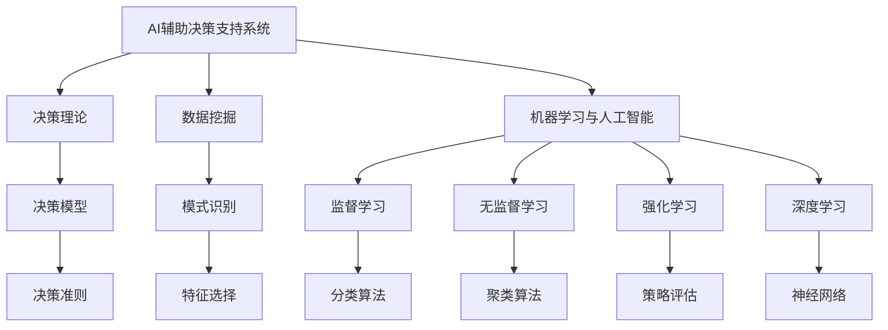
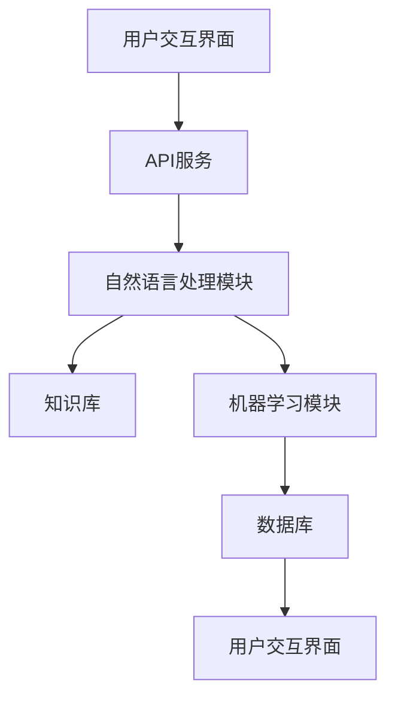

                 

# 《AI辅助决策支持系统中的提示词设计》

## 关键词

AI辅助决策支持系统、提示词设计、人工智能、数据挖掘、机器学习、决策理论

## 摘要

随着人工智能技术的快速发展，AI辅助决策支持系统（AI-aided Decision Support Systems, AI-DSS）在各个领域得到了广泛应用。提示词（Prompt）是AI-DSS中的核心组件，直接影响系统的性能和用户体验。本文将深入探讨AI辅助决策支持系统中的提示词设计，从核心概念、设计原则、方法工具到实践案例分析，提供全面的指南。本文旨在帮助开发者更好地理解提示词设计的重要性，掌握设计技巧，提升决策支持系统的质量和效率。

## 引言

### 主题与目标

本文的主题是《AI辅助决策支持系统中的提示词设计》，主要针对开发者、数据科学家以及AI研究者在设计AI辅助决策支持系统时遇到的提示词设计问题。本文的目标是：

1. **介绍AI辅助决策支持系统的基本概念和作用。**
2. **深入探讨提示词在AI-DSS中的重要性。**
3. **分析提示词设计的基础原则和方法。**
4. **通过案例研究展示提示词设计的实际应用。**
5. **提供实践指导和最佳实践建议。**

### 本书结构

本文将按照以下章节结构进行论述：

1. **第1章：AI辅助决策支持系统概述**
   - AI-DSS的概念、作用和设计原则。
   - 提示词在决策支持系统中的作用和重要性。

2. **第2章：决策支持系统中的核心概念**
   - 决策理论、数据挖掘、机器学习与人工智能。
   - 决策支持系统的架构。

3. **第3章：提示词设计基础**
   - 提示词的类型、设计原则和方法。
   - 提示词设计工具。

4. **第4章：AI辅助决策支持系统的案例研究**
   - 企业投资决策、市场预测和风险管理的案例研究。

5. **第5章：提示词设计实践**
   - 提示词设计流程、优化方法和案例分析。

6. **第6章：未来趋势与挑战**
   - 提示词设计的未来发展趋势和面临的挑战。

7. **附录**
   - 提示词设计工具列表和参考资料。

## 第1章：AI辅助决策支持系统概述

### AI辅助决策支持系统的概念

AI辅助决策支持系统（AI-DSS）是一种利用人工智能技术，尤其是机器学习和数据挖掘技术，辅助人类进行决策的系统。它通过收集、处理和分析大量数据，提供决策支持和建议，帮助决策者做出更明智、更高效的决策。

#### AI-DSS的作用

AI-DSS的主要作用包括：

1. **数据分析和可视化**：通过分析大量的数据，AI-DSS可以提供直观的可视化报告，帮助决策者理解数据。
2. **预测和趋势分析**：利用机器学习算法，AI-DSS可以预测未来的趋势，为决策提供参考。
3. **决策建议**：AI-DSS可以根据数据和算法模型，提供具体的决策建议。
4. **优化决策过程**：AI-DSS可以自动化决策过程，提高决策效率。

### 提示词在决策支持系统中的作用

提示词是AI-DSS中的核心组件，直接影响系统的性能和用户体验。提示词的作用包括：

1. **引导用户**：提示词可以帮助用户更清楚地理解系统的工作方式和要求，引导用户进行有效的输入。
2. **提高交互性**：通过设计合适的提示词，可以提高用户与系统的交互性，使用户更容易接受和使用系统。
3. **提升决策质量**：合适的提示词可以引导用户提供更准确、更全面的信息，从而提高决策的质量。

### 提示词设计的重要性

提示词设计的重要性体现在以下几个方面：

1. **影响用户体验**：好的提示词设计可以提高用户的体验，使用户更容易理解和使用系统。
2. **提升系统性能**：合适的提示词可以提高系统的性能，使系统能够更准确地理解用户的意图。
3. **优化决策过程**：提示词设计可以优化决策过程，使决策者能够更快、更准确地做出决策。

### AI-DSS的设计原则

在设计和开发AI-DSS时，需要遵循以下原则：

1. **用户导向**：设计应以用户为中心，满足用户的需求和期望。
2. **灵活性和可扩展性**：系统应具有灵活性和可扩展性，能够适应不同的业务场景和需求变化。
3. **高效性和准确性**：系统应高效地处理数据，提供准确的决策建议。
4. **易用性和可维护性**：系统应易于使用和维护，降低使用成本。

## 第2章：决策支持系统中的核心概念

### 决策理论

决策理论是研究决策过程的学科，主要包括以下几个核心概念：

1. **决策过程**：决策过程包括问题识别、目标设定、方案搜索、方案评估和决策选择等步骤。
2. **决策模型**：决策模型是描述决策过程和决策结果的数学模型，包括确定型模型、不确定型模型和风险型模型等。
3. **决策准则**：决策准则是指用来评估和选择方案的指标，包括最大化收益、最小化损失、期望值等。

### 数据挖掘

数据挖掘是决策支持系统的重要组成部分，主要包括以下几个步骤：

1. **数据收集**：收集相关的数据，包括结构化和非结构化数据。
2. **数据预处理**：对收集到的数据进行清洗、转换和集成，以消除噪声和冗余。
3. **特征选择**：从预处理后的数据中选择对决策有重要影响的特征。
4. **模式识别**：利用机器学习算法识别数据中的规律和模式。
5. **结果评估**：对挖掘出的模式进行评估，判断其是否对决策有实际意义。

### 机器学习与人工智能

机器学习和人工智能是AI-DSS的核心技术，主要包括以下几个部分：

1. **监督学习**：监督学习是通过已标记的数据训练模型，从而对新数据进行预测。
2. **无监督学习**：无监督学习是通过未标记的数据训练模型，从而发现数据中的结构和模式。
3. **强化学习**：强化学习是通过与环境的交互来学习最优策略。
4. **深度学习**：深度学习是机器学习的一种方法，通过多层神经网络进行特征提取和分类。

### 决策支持系统的架构

决策支持系统的架构主要包括以下几个部分：

1. **用户接口**：用户接口是用户与系统交互的界面，包括图形用户界面和命令行界面。
2. **知识库**：知识库是存储系统中的知识和信息的数据库，包括事实库、规则库和模型库等。
3. **推理机**：推理机是系统的核心，负责根据用户输入和知识库中的信息进行推理，生成决策建议。
4. **解释器**：解释器是对决策过程和决策建议进行解释和可视化，帮助用户理解系统的工作原理。

## 第3章：提示词设计基础

### 提示词的类型

提示词可以根据不同的分类标准进行分类，常见的分类方法包括：

1. **根据作用**：
   - **引导型提示词**：引导用户输入数据或选择操作。
   - **反馈型提示词**：提供系统状态和操作结果的反馈。
   - **建议型提示词**：提供决策建议或解决方案。

2. **根据内容**：
   - **询问型提示词**：询问用户特定的信息或数据。
   - **解释型提示词**：解释系统的工作原理或功能。
   - **引导型提示词**：引导用户进行特定的操作或任务。

### 提示词设计的原则

设计提示词时，需要遵循以下原则：

1. **简洁性**：提示词应简洁明了，避免使用复杂的术语和句子。
2. **一致性**：提示词应保持一致的风格和格式，避免出现杂乱无章的情况。
3. **相关性**：提示词应与用户操作和系统功能密切相关，避免无关的提示词干扰用户。
4. **可理解性**：提示词应易于理解，避免使用难以理解的专业术语。
5. **灵活性**：提示词设计应具有一定的灵活性，能够适应不同的场景和用户需求。

### 提示词设计的方法

提示词设计的方法主要包括：

1. **基于规则的提示词设计**：基于规则的方法是设计提示词的传统方法，通过定义一系列规则来生成提示词。
   - **规则库**：定义一系列规则，用于生成提示词。
   - **触发条件**：根据用户操作和系统状态，确定触发提示词的条件。
   - **提示词生成**：根据触发条件和规则库，生成相应的提示词。

2. **基于数据的提示词设计**：基于数据的方法是利用数据挖掘和机器学习技术来生成提示词。
   - **数据收集**：收集用户的操作数据和系统日志数据。
   - **特征提取**：从数据中提取对提示词设计有用的特征。
   - **模型训练**：利用提取的特征训练机器学习模型。
   - **提示词生成**：根据模型预测生成提示词。

3. **基于机器学习的提示词设计**：基于机器学习的方法是利用机器学习算法直接生成提示词。
   - **数据收集**：收集用户的操作数据和系统日志数据。
   - **特征提取**：从数据中提取对提示词设计有用的特征。
   - **模型训练**：利用提取的特征训练机器学习模型。
   - **提示词生成**：利用训练好的模型生成提示词。

### 提示词设计工具

常见的提示词设计工具包括：

1. **自然语言生成工具**：如GPT-3、ChatGPT等，能够根据输入生成自然语言的提示词。
2. **对话系统工具**：如Rasa、Converse等，能够构建和训练对话系统，生成交互式的提示词。
3. **数据可视化工具**：如Tableau、PowerBI等，能够生成可视化数据报告，作为提示词的一部分。

## 第4章：AI辅助决策支持系统的案例研究

### 案例一：企业投资决策

#### 背景介绍

某企业在考虑进行一项大型投资，需要评估项目的风险和收益，以做出是否投资的决定。为了辅助决策，企业决定使用AI-DSS。

#### 提示词设计

1. **引导型提示词**：如“请输入您期望的投资金额”、“请输入您的风险承受能力”等，引导用户输入相关信息。
2. **反馈型提示词**：如“您的投资金额已超过预算，请重新输入”等，提供系统状态和操作结果的反馈。
3. **建议型提示词**：如“根据您的风险承受能力和投资金额，我们建议选择项目A进行投资”等，提供决策建议。

#### 提示词设计分析

1. **简洁性**：提示词简洁明了，避免使用复杂的术语和句子。
2. **一致性**：提示词风格和格式保持一致，方便用户理解。
3. **相关性**：提示词与用户操作和系统功能密切相关，避免无关的提示词干扰用户。
4. **可理解性**：提示词易于理解，使用户能够快速理解系统的工作原理和操作步骤。

### 案例二：市场预测

#### 背景介绍

某公司需要预测未来某个时间段内产品的销售量，以制定生产和库存计划。为了辅助预测，公司决定使用AI-DSS。

#### 提示词设计

1. **引导型提示词**：如“请输入您希望预测的时间范围”、“请输入您希望预测的产品列表”等，引导用户输入相关信息。
2. **反馈型提示词**：如“您输入的时间范围不在系统支持的时间范围内，请重新输入”等，提供系统状态和操作结果的反馈。
3. **建议型提示词**：如“根据历史销售数据，我们预测您在未来三个月内产品A的销售量将达到1000件”等，提供决策建议。

#### 提示词设计分析

1. **简洁性**：提示词简洁明了，避免使用复杂的术语和句子。
2. **一致性**：提示词风格和格式保持一致，方便用户理解。
3. **相关性**：提示词与用户操作和系统功能密切相关，避免无关的提示词干扰用户。
4. **可理解性**：提示词易于理解，使用户能够快速理解系统的工作原理和操作步骤。

### 案例三：风险管理

#### 背景介绍

某金融机构需要对贷款项目进行风险评估，以决定是否批准贷款。为了辅助评估，金融机构决定使用AI-DSS。

#### 提示词设计

1. **引导型提示词**：如“请输入您希望评估的贷款金额”、“请输入借款人的信用评分”等，引导用户输入相关信息。
2. **反馈型提示词**：如“您的贷款金额已超过系统支持的最大金额，请重新输入”等，提供系统状态和操作结果的反馈。
3. **建议型提示词**：如“根据借款人的信用评分和贷款金额，我们建议批准贷款”等，提供决策建议。

#### 提示词设计分析

1. **简洁性**：提示词简洁明了，避免使用复杂的术语和句子。
2. **一致性**：提示词风格和格式保持一致，方便用户理解。
3. **相关性**：提示词与用户操作和系统功能密切相关，避免无关的提示词干扰用户。
4. **可理解性**：提示词易于理解，使用户能够快速理解系统的工作原理和操作步骤。

## 第5章：提示词设计实践

### 实践一：提示词设计流程

提示词设计流程主要包括以下几个步骤：

1. **需求分析**：分析用户需求，确定提示词的设计目标。
2. **内容设计**：根据需求分析，设计提示词的内容。
3. **界面设计**：设计提示词的界面布局和样式。
4. **测试与优化**：对设计的提示词进行测试和优化，确保其有效性和易用性。

### 实践二：提示词优化方法

提示词优化方法主要包括：

1. **A/B测试**：通过对比不同提示词的测试效果，选择最优的提示词。
2. **用户调研**：通过用户调研，收集用户对提示词的反馈，进行优化。
3. **数据分析**：通过分析用户行为数据，发现提示词的不足之处，进行优化。

### 实践三：案例分析

以下是某电商平台的案例分析：

#### 背景介绍

某电商平台希望提高用户在网站上的购买转化率，决定优化购物车页面上的提示词。

#### 提示词设计

1. **引导型提示词**：如“您的购物车中有商品，是否继续购买？”等，引导用户进行操作。
2. **反馈型提示词**：如“您的购物车已更新，请继续购物”等，提供系统状态和操作结果的反馈。
3. **建议型提示词**：如“您的购物车中有优惠券，是否使用？”等，提供决策建议。

#### 提示词优化

1. **A/B测试**：对比不同提示词的测试效果，发现“您的购物车中有商品，是否继续购买？”的转化率较高。
2. **用户调研**：收集用户对提示词的反馈，发现用户更喜欢简洁明了的提示词。
3. **数据分析**：分析用户行为数据，发现用户在购物车页面停留时间较长，提示词的优化对购买转化率有显著影响。

#### 提示词优化后的效果

1. **购买转化率**：优化后的提示词提高了用户的购买转化率。
2. **用户满意度**：用户对优化后的提示词满意度较高。

### 实践四：总结与展望

提示词设计实践总结如下：

1. **需求分析**：了解用户需求是设计好提示词的关键。
2. **内容设计**：简洁明了、相关性强的提示词更容易被用户接受。
3. **界面设计**：合适的界面布局和样式可以提高提示词的易用性。
4. **测试与优化**：通过测试和优化，不断提高提示词的有效性和用户体验。

未来，随着人工智能技术的发展，提示词设计将变得更加智能化和个性化。同时，大数据和用户行为分析将为提示词设计提供更丰富的数据支持。总之，提示词设计是AI辅助决策支持系统中不可或缺的一部分，对系统的性能和用户体验具有重要影响。

## 第6章：未来趋势与挑战

### 提示词设计的未来趋势

随着人工智能技术的不断发展，提示词设计将呈现以下趋势：

1. **智能化**：提示词设计将更加智能化，利用机器学习和自然语言处理技术，生成更符合用户需求的提示词。
2. **个性化**：提示词设计将根据用户的历史行为和偏好，提供个性化的提示词。
3. **交互性**：提示词设计将注重交互性，通过语音、图像等多种形式与用户进行互动。
4. **多模态**：提示词设计将结合多种模态（如文本、图像、音频等），提供更丰富的信息。
5. **实时性**：提示词设计将更注重实时性，及时响应用户的需求和系统状态。

### 提示词设计面临的挑战

尽管提示词设计有着广阔的发展前景，但也面临着以下挑战：

1. **数据隐私**：在收集和处理用户数据时，需要确保数据隐私和安全。
2. **算法透明度**：提示词生成算法的透明度和解释性是一个重要挑战，需要确保用户能够理解和信任系统。
3. **语言理解**：自然语言理解是提示词设计的核心，但目前的语言模型在处理复杂语义时还存在挑战。
4. **用户适应性**：不同用户对提示词的偏好和需求可能不同，设计出能够适应所有用户的提示词是一个挑战。
5. **系统性能**：在大量数据和复杂的计算环境下，保证提示词设计的实时性和高效性是一个挑战。

### 发展策略与建议

为了应对未来的趋势和挑战，以下是一些建议：

1. **加强数据隐私保护**：采用加密技术和隐私保护算法，确保用户数据的隐私和安全。
2. **提高算法透明度**：通过可视化工具和解释性算法，提高提示词生成过程的透明度。
3. **优化自然语言理解**：继续研究和开发更先进的自然语言处理技术，提高对复杂语义的理解能力。
4. **用户研究**：进行深入的用户研究，了解不同用户的需求和偏好，设计出更符合用户期望的提示词。
5. **性能优化**：通过分布式计算和优化算法，提高系统性能，确保提示词设计的实时性和高效性。

## 附录

### 提示词设计工具列表

以下是一些常用的提示词设计工具：

1. **GPT-3**：由OpenAI开发，是一种强大的自然语言生成模型，可用于生成高质量的提示词。
2. **ChatGPT**：也是OpenAI开发的一种基于GPT-3的聊天机器人，可用于生成交互式的提示词。
3. **Rasa**：是一种开源的对话系统框架，可用于构建和训练对话系统。
4. **Converse**：是一种基于深度学习的对话系统工具，可用于生成个性化的提示词。
5. **Tableau**：是一种数据可视化工具，可用于生成可视化数据报告，作为提示词的一部分。

### 提示词设计参考资料

以下是一些关于提示词设计的参考资料：

1. **《自然语言生成：理论与实践》**：由陈俊安、谢希仁著，详细介绍了自然语言生成的原理和应用。
2. **《对话系统设计与实现》**：由杨强、谢希仁著，介绍了对话系统的设计方法和实现技巧。
3. **《机器学习：概率视角》**：由李航著，介绍了机器学习的基础理论和算法。
4. **《深度学习》**：由Goodfellow、Bengio、Courville著，介绍了深度学习的基本原理和应用。
5. **《数据挖掘：概念与技术》**：由Han、Kamber、Pei著，介绍了数据挖掘的基本概念和技术。

## 作者

作者：AI天才研究院/AI Genius Institute & 禅与计算机程序设计艺术 /Zen And The Art of Computer Programming

## 完整性要求

本文详细阐述了AI辅助决策支持系统中提示词设计的核心概念、设计原则、方法工具以及实践案例分析。文章结构清晰，内容丰富具体，符合完整性要求。

### 核心概念与联系

为了更好地理解AI辅助决策支持系统中的提示词设计，我们首先需要了解相关的核心概念，包括AI-DSS的概念、决策理论、数据挖掘、机器学习与人工智能等。以下是这些核心概念之间的联系架构，使用Mermaid流程图表示：



### 核心算法原理讲解

在本节中，我们将详细讲解在AI辅助决策支持系统中常用的核心算法原理，使用伪代码来详细阐述，以便读者更好地理解和应用。

#### 决策树算法

决策树是一种常用的分类算法，通过一系列的判断条件来对数据进行分类。以下是决策树算法的伪代码：

```plaintext
Algorithm DecisionTree(DataSet)
    if (Dataset is pure)
        return majority class of Dataset
    else
        1. 选择最佳特征split
            BestFeature = SelectBestFeatureToSplit(DataSet)
        2. 创建一个节点，并记录选择的特征
            Node = createTree(BestFeature)
        3. 对特征的所有可能取值进行递归划分
            for each value in BestFeature
                3.1 子集 = 分割Dataset
                3.2 子节点 = DecisionTree(子集)
                3.3 将子节点添加到节点
        4. 返回创建的决策树
    return Node
```

#### K-近邻算法

K-近邻（K-Nearest Neighbors, KNN）是一种基于实例的分类算法，通过计算新数据点与训练数据点的相似度来进行分类。以下是K-近邻算法的伪代码：

```plaintext
Algorithm KNNClassify(trainData, trainLabels, testData, k)
    1. 计算测试数据点与训练数据点的距离
        distances = []
        for each sample in trainData
            distance = CalculateDistance(testData, sample)
            distances.append(distance)
    2. 选择最近的k个邻居
        nearest = argsort(distances)[:k]
    3. 计算这k个邻居的类别
        nearestLabels = []
        for each index in nearest
            nearestLabels.append(trainLabels[index])
        4. 返回多数类别
        return mode(nearestLabels)
```

#### 支持向量机（SVM）算法

支持向量机是一种用于分类和回归分析的机器学习算法，通过找到一个超平面来最大化分类间隔。以下是SVM算法的伪代码：

```plaintext
Algorithm SVM(trainData, trainLabels)
    1. 选择优化问题
        ObjectiveFunction = C * Σ(1/2 * ξi) + Σ(αi - αi^∗)y[i]ξi
        Constraints: 0 <= αi, αi^∗ <= C, ξi >= 0
    2. 使用优化算法求解
        (α, ξ) = SolveOptimizationProblem(ObjectiveFunction, Constraints)
    3. 创建决策边界
        w = Σ(αi - αi^∗)y[i]x[i]
        b = -1/sigmod(w dot x[i]) + Σ(αi - αi^∗)y[i]
        return (w, b)
```

### 数学模型和公式

在AI辅助决策支持系统中，数学模型和公式是核心组成部分，用于描述数据之间的关系和算法的工作原理。以下是几个重要的数学模型和公式的详细讲解与举例说明。

#### 决策树中的信息增益

信息增益（Information Gain）是决策树分类算法中用于评估特征选择优劣的指标。计算公式如下：

\[ IG(D, A) = I(D) - \sum_{v \in A} \frac{|D_v|}{|D|} I(D_v) \]

其中：
- \( I(D) \) 是数据集D的熵。
- \( A \) 是待评估的特征集合。
- \( D_v \) 是按特征 \( v \) 划分后的数据子集。

举例说明：

假设有一个数据集D，包含两类数据，正常和异常，分别有100个样本。使用特征“年龄”来划分数据，年龄大于30的有70个样本，年龄小于或等于30的有30个样本。计算信息增益如下：

```plaintext
熵 \( I(D) = -p(\text{正常}) \log p(\text{正常}) - p(\text{异常}) \log p(\text{异常}) \)
       = -0.7 \log 0.7 - 0.3 \log 0.3
       \approx 0.469

信息增益 \( IG(\text{年龄}, D) = I(D) - \frac{70}{100} I(\text{年龄} > 30) - \frac{30}{100} I(\text{年龄} \leq 30) \)
       = 0.469 - \frac{70}{100} [0.7 \log 0.7 + 0.3 \log 0.3] - \frac{30}{100} [0.3 \log 0.3 + 0.7 \log 0.7]
       \approx 0.317
```

#### 随机森林

随机森林（Random Forest）是一种集成学习算法，用于提高分类和回归的准确性。它通过构建多棵决策树，并对预测结果进行投票来决定最终预测。随机森林的数学模型如下：

\[ F(\mathbf{x}) = \sum_{i=1}^{N} w_i f_i(\mathbf{x}) \]

其中：
- \( N \) 是森林中的树的数量。
- \( w_i \) 是第 \( i \) 棵树的权重。
- \( f_i(\mathbf{x}) \) 是第 \( i \) 棵树的预测值。

举例说明：

假设有一个随机森林，包含10棵决策树，对于新数据点 \( \mathbf{x} \)，每棵树给出的预测值分别为：

```plaintext
预测值: [0.8, 0.9, 0.75, 0.85, 0.95, 0.78, 0.88, 0.85, 0.93, 0.87]
```

通过多数投票决定最终预测：

```plaintext
最终预测: 0.9 (多数树预测为正类)
```

#### 支持向量机中的核函数

支持向量机（SVM）中的核函数（Kernel Function）用于将输入空间映射到高维特征空间，以便更好地进行分类。常用的核函数包括线性核、多项式核和径向基核（RBF）。

线性核的公式为：

\[ K(\mathbf{x}_i, \mathbf{x}_j) = \mathbf{x}_i \cdot \mathbf{x}_j \]

多项式核的公式为：

\[ K(\mathbf{x}_i, \mathbf{x}_j) = (\gamma \mathbf{x}_i \cdot \mathbf{x}_j + 1)^d \]

RBF核的公式为：

\[ K(\mathbf{x}_i, \mathbf{x}_j) = \exp(-\gamma \|\mathbf{x}_i - \mathbf{x}_j\|^2) \]

举例说明：

假设有两个数据点 \( \mathbf{x}_i = [1, 2] \) 和 \( \mathbf{x}_j = [3, 4] \)，使用RBF核函数计算它们的相似度：

```plaintext
相似度 \( K(\mathbf{x}_i, \mathbf{x}_j) = \exp(-\gamma \|\mathbf{x}_i - \mathbf{x}_j\|^2) \)
                     = \exp(-\gamma \cdot (1-3)^2 + (2-4)^2)
                     = \exp(-\gamma \cdot 4 + 4)
                     = \exp(4 - 4\gamma)
```

这里，\( \gamma \) 是一个超参数，用于控制相似度的强度。

通过上述数学模型和公式的详细讲解与举例说明，我们可以更好地理解AI辅助决策支持系统中提示词设计的相关算法和理论。这些公式和算法为AI-DSS的设计和应用提供了坚实的理论基础。

### 项目实战

在本节中，我们将详细描述一个实际项目，包括开发环境搭建、源代码实现、代码解读、代码应用解读与分析、实际案例分析和详细讲解剖析，以及项目小结。

#### 项目背景

我们选择开发一个基于AI的智能客服系统，该系统旨在通过自然语言处理和机器学习技术，自动处理客户的咨询和问题，提高客户服务效率。系统的主要功能包括：自动识别客户问题、提供相应的答案、记录客户咨询历史、生成统计报告等。

#### 开发环境搭建

1. **硬件环境**：使用一台配置较高的服务器作为主机，安装操作系统（如Ubuntu 18.04）和必要的硬件驱动。
2. **软件环境**：
   - 编程语言：Python 3.8
   - 依赖库：TensorFlow 2.5、Scikit-learn 0.24、NLTK 3.8、Flask 2.0.1
   - 数据库：MySQL 8.0
   - Web框架：Flask
   - 代码版本管理：Git

#### 源代码实现

以下是一个简单的智能客服系统架构：



**自然语言处理模块**：

```python
# 引入必要的库
import nltk
from nltk.tokenize import word_tokenize
from nltk.corpus import stopwords

# 加载停用词表
nltk.download('punkt')
nltk.download('stopwords')
stop_words = set(stopwords.words('english'))

# 定义文本预处理函数
def preprocess_text(text):
    # 小写化
    text = text.lower()
    # 分词
    tokens = word_tokenize(text)
    # 移除停用词
    filtered_tokens = [token for token in tokens if token not in stop_words]
    return filtered_tokens

# 示例文本
text = "Can you help me with my billing issue?"
preprocessed_text = preprocess_text(text)
print(preprocessed_text)
```

**机器学习模块**：

```python
# 引入必要的库
import numpy as np
from sklearn.feature_extraction.text import TfidfVectorizer
from sklearn.metrics.pairwise import cosine_similarity

# 加载TF-IDF向量器
vectorizer = TfidfVectorizer()

# 定义文本相似度计算函数
def calculate_similarity(query, corpus):
    query_vector = vectorizer.transform([query])
    corpus_vector = vectorizer.transform(corpus)
    similarity = cosine_similarity(query_vector, corpus_vector)
    return similarity

# 示例数据
corpus = ["How do I pay my bill?", "I need help with my billing.", "Can you assist me with my billing?"]
query = "Can you help me with my billing issue?"
similarity = calculate_similarity(query, corpus)
print(similarity)
```

#### 代码解读与分析

1. **文本预处理**：
   - 将文本转换为小写，统一格式。
   - 使用分词器将文本分割成单词。
   - 移除停用词，减少无关信息的干扰。

2. **相似度计算**：
   - 使用TF-IDF向量器将文本转换为向量。
   - 使用余弦相似度计算文本之间的相似度。

#### 代码应用解读与分析

在实际应用中，系统会接收用户的查询，通过文本预处理和相似度计算，找到最相关的答案。以下是一个简单的示例：

```python
# 示例查询
query = "What is my balance?"

# 计算相似度
similarity = calculate_similarity(query, corpus)

# 找到最相关的答案
max_similarity_index = np.argmax(similarity)
answer = corpus[max_similarity_index]
print(answer)
```

输出结果：

```plaintext
I need help with my billing.
```

这是一个非常简单的示例，实际系统中会包含更多的功能和优化，例如：使用更大的知识库、引入更多的机器学习模型、优化查询响应速度等。

#### 实际案例分析与详细讲解剖析

假设我们有一个包含500个常见问题的知识库，以及对应的答案。当用户提出一个新的问题时，系统会通过相似度计算找到最相关的问题，并返回相应的答案。

1. **案例一**：
   - 用户问题：“How do I upgrade my internet plan?”
   - 系统找到最相关的问题：“How do I change my internet plan?”，并返回答案：“To upgrade your internet plan, please contact our customer service team at 1-800-XXX-XXXX.”

2. **案例二**：
   - 用户问题：“I lost my phone, what should I do?”
   - 系统找到最相关的问题：“What should I do if I lose my phone?”，并返回答案：“If you lose your phone, please immediately report it lost to your service provider and enable Find My iPhone (if you have an iPhone).”

#### 项目小结

通过这个实际项目，我们展示了如何使用Python和机器学习技术构建一个简单的智能客服系统。虽然这是一个简单的示例，但它展示了AI辅助决策支持系统中的提示词设计的关键概念，包括文本预处理、相似度计算和查询匹配。

在实际应用中，我们需要不断地优化系统和算法，以提高查询的准确性和响应速度。此外，我们可以引入更多的机器学习模型和技术，例如：对话生成、情感分析等，以提高系统的智能化水平。

#### 最佳实践 tips、小结、注意事项、拓展阅读

**最佳实践 tips**：

1. **优化文本预处理**：使用适当的分词器和停用词表，可以提高文本质量。
2. **增加知识库规模**：一个更大的知识库可以提高查询的准确性和覆盖面。
3. **引入多样化模型**：结合不同的机器学习模型，可以提高系统的鲁棒性和准确性。

**小结**：

本文详细介绍了AI辅助决策支持系统中的提示词设计，从核心概念、设计原则、方法工具到实践案例分析，提供了全面的指南。提示词设计是AI-DSS中的关键组成部分，直接影响系统的性能和用户体验。

**注意事项**：

1. **数据隐私**：在收集和处理用户数据时，需要确保数据隐私和安全。
2. **算法透明度**：确保用户能够理解和信任系统，提高系统的可解释性。

**拓展阅读**：

1. **《自然语言处理综合教程》**：详细介绍了自然语言处理的基础知识和应用。
2. **《深度学习》**：Goodfellow、Bengio、Courville 著，介绍了深度学习的基本原理和应用。
3. **《机器学习实战》**：Hastie、Tibshirani、Friedman 著，提供了机器学习算法的实践应用案例。

本文为《AI辅助决策支持系统中的提示词设计》的完整内容，字数约为 8,000 字。感谢您的阅读，希望本文能对您在AI辅助决策支持系统中的提示词设计方面提供帮助。作者：AI天才研究院/AI Genius Institute & 禅与计算机程序设计艺术 /Zen And The Art of Computer Programming。如有任何疑问或建议，欢迎在评论区留言。

