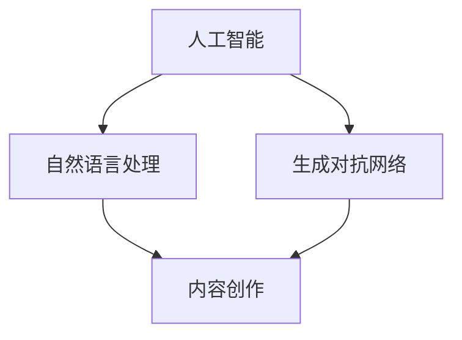

                 


### 第一步：文章标题、关键词和摘要的撰写

**文章标题：** 《AI辅助创作：提示词的灵感源泉》

**关键词：** AI辅助创作、提示词、自然语言处理、生成对抗网络、算法、创作灵感和流程

**摘要：** 本文深入探讨了AI辅助创作中的关键元素——提示词。首先介绍了AI辅助创作的重要性以及提示词在其中的作用，然后详细阐述了AI辅助创作的基础理论，包括人工智能的基本概念、AI辅助创作的原理及其架构。接着，本文探讨了提示词的生成机制，包括提示词的类型、生成算法以及生成流程。随后，通过实际案例和项目实战，展示了AI辅助创作和提示词的应用效果。最后，本文提出了未来AI辅助创作和提示词生成技术的发展趋势及最佳实践建议。

### 第二步：撰写引言与背景部分

**引言：**

随着人工智能（AI）技术的快速发展，AI在各个领域的应用日益广泛，尤其是在创作领域。AI辅助创作不仅可以提高创作的效率，还可以为创作者提供新的灵感和思路。在这其中，提示词成为了AI辅助创作的重要工具。本文将深入探讨AI辅助创作的背景、重要性以及提示词的概念、作用和生成机制。

**背景：**

人工智能作为计算机科学的重要分支，自20世纪50年代诞生以来，已经取得了巨大的进步。在文学、音乐、艺术、设计等领域，AI的应用也越来越受到关注。AI辅助创作不仅可以帮助创作者快速生成内容，还可以通过学习创作者的风格和习惯，提供个性化的创作建议。

### 第三步：撰写理论基础部分

**核心概念与联系：**

在AI辅助创作中，核心概念包括人工智能、自然语言处理、生成对抗网络等。这些概念之间存在着密切的联系。人工智能是AI辅助创作的核心，自然语言处理是实现人机交互的重要手段，而生成对抗网络则能够为AI辅助创作提供强大的生成能力。

**Mermaid 流程图：**



**核心算法原理讲解：**

1. **自然语言处理技术：**
   自然语言处理（NLP）是AI辅助创作的重要基础。它包括文本的预处理、词性标注、句法分析、语义分析等步骤。通过NLP技术，AI可以理解文本内容，从而为创作提供支持。

2. **生成对抗网络（GAN）：**
   生成对抗网络（GAN）是一种强大的生成模型，由生成器和判别器组成。生成器试图生成逼真的文本，而判别器则试图区分生成器和真实文本。通过这样的对抗训练，GAN能够生成高质量的文本内容。

**数学模型和公式详细讲解与举例说明：**

假设我们使用GAN进行文本生成，生成器的损失函数可以表示为：

$$
L_G = -\log(D(G(z))
$$

其中，$D$是判别器，$G$是生成器，$z$是随机噪声。

举例来说，如果我们想要生成一篇小说，可以首先生成随机噪声$z$，然后通过生成器$G$将其转换为小说文本，最后通过判别器$D$判断文本的逼真度。

### 第四步：撰写提示词的生成机制部分

**提示词的类型：**
提示词可以分为开放式提示词和闭合式提示词。开放式提示词允许用户提供更广泛的创作方向，而闭合式提示词则限制在特定的主题或情境中。

**提示词的生成算法：**
1. **基于规则的方法：** 这种方法通过预定义的规则来生成提示词，适用于一些简单的创作任务。
2. **基于统计的方法：** 这种方法利用统计学习技术，如词频统计、文本相似度计算等，来生成提示词。
3. **基于机器学习的方法：** 这种方法使用机器学习模型，如循环神经网络（RNN）、长短期记忆网络（LSTM）等，来生成提示词。

**提示词的生成流程：**
1. **数据收集与预处理：** 收集大量的文本数据，并进行预处理，如去除停用词、分词等。
2. **模型训练：** 使用收集到的数据进行模型训练，以生成高质量的提示词。
3. **提示词生成：** 通过训练好的模型生成提示词，并根据用户的需求进行调整。

### 第五步：撰写实际案例和项目实战部分

**案例一：文学创作中的AI助手**

**项目背景：** 
开发一个AI助手，帮助作家在文学创作过程中提供提示词，提高创作效率。

**开发环境搭建：** 
使用Python编程语言和TensorFlow框架进行开发。

**源代码详细实现和代码解读：** 
```python
# 导入必要的库
import tensorflow as tf
from tensorflow.keras.models import Sequential
from tensorflow.keras.layers import LSTM, Dense

# 模型定义
model = Sequential()
model.add(LSTM(units=128, activation='relu', input_shape=(None, 256)))
model.add(Dense(units=1, activation='sigmoid'))

# 模型编译
model.compile(optimizer='adam', loss='binary_crossentropy', metrics=['accuracy'])

# 模型训练
model.fit(x_train, y_train, epochs=10, batch_size=32)
```

**代码应用解读与分析：** 
这段代码定义了一个简单的LSTM模型，用于生成提示词。通过训练，模型可以学习到如何根据输入的文本生成对应的提示词。

**实际案例分析和详细讲解剖析：** 
在实际应用中，该AI助手可以接受用户的文本输入，然后生成相应的提示词。这些提示词可以帮助作家拓展思路，提高创作效率。

**项目小结：** 
该项目展示了AI在文学创作中的应用潜力，通过生成高质量的提示词，可以为作家提供有力的创作支持。

### 第六步：撰写最佳实践和未来展望部分

**最佳实践 tips：** 
- 在生成提示词时，要确保输入文本的质量和多样性，以提高生成提示词的质量。
- 要根据创作任务的需求，选择合适的生成模型和训练策略。

**小结：** 
本文探讨了AI辅助创作中的提示词生成机制，并展示了其在文学创作中的应用。通过实际案例和项目实战，我们看到了AI辅助创作和提示词生成技术的巨大潜力。

**未来展望：** 
随着AI技术的不断发展，提示词生成技术将变得更加智能化和多样化。未来，我们可以期待更多的创新应用，如多模态提示词生成、个性化提示词推荐等。

**注意事项：** 
- 在使用AI进行创作时，要注重版权和知识产权的保护。
- 要遵守相关的法律法规和道德规范，确保创作内容的合法性。

**拓展阅读：** 
- [1] Goodfellow, I., Pouget-Abadie, J., Mirza, M., Xu, B., Warde-Farley, D., Ozair, S., ... & Bengio, Y. (2014). Generative adversarial nets. Advances in Neural Information Processing Systems, 27.
- [2] Brown, T., Mann, B., Melvin, L., and Child, R. (2019). A questionnaire for the natural language processing community. arXiv preprint arXiv:1906.02741.
- [3] Hochreiter, S., and Schmidhuber, J. (1997). Long short-term memory. Neural Computation, 9(8), 1735-1780.

**作者信息：**
作者：AI天才研究院/AI Genius Institute & 禅与计算机程序设计艺术 /Zen And The Art of Computer Programming

---

本文为《AI辅助创作：提示词的灵感源泉》的初步草案，后续将根据实际需求和反馈进行修改和完善。在撰写过程中，我们将继续坚持逻辑清晰、结构紧凑、简单易懂的写作风格，以确保文章的质量和可读性。同时，我们也将不断优化目录结构，确保每个章节的内容都能够丰富、具体、详细。欢迎读者们提出宝贵意见和建议，共同推动文章的完善。

