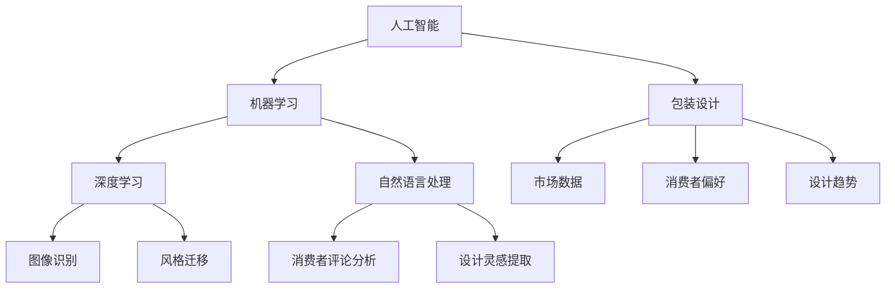
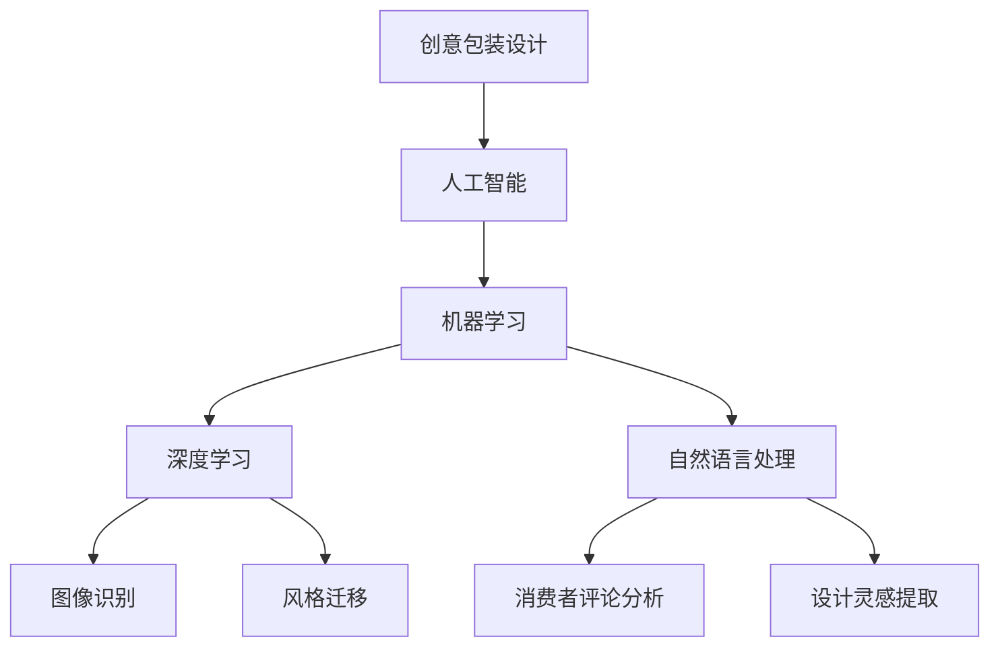

                 


## AI辅助创意包装设计的提示词技巧

### 背景介绍

在当今快节奏和竞争激烈的市场中，创意包装设计已成为企业吸引消费者注意力的关键手段。然而，设计一个既能传达品牌信息又能吸引消费者的包装产品需要付出大量的时间和精力。传统的设计方法通常依赖设计师的经验和直觉，而人工智能（AI）技术的出现为这一领域带来了全新的可能性。

人工智能通过其强大的数据处理和模式识别能力，能够帮助设计师快速生成创意设计方案，从而提高效率，降低成本。例如，深度学习算法可以分析大量的图像数据，从中学习包装设计的最佳实践，并自动生成新颖的设计方案。自然语言处理（NLP）技术则能够帮助设计师从大量的文本数据中提取灵感，例如分析消费者评论和市场趋势。

本文旨在探讨AI辅助创意包装设计的各种技巧，帮助设计师充分利用AI技术，提高设计效率和创造力。我们将从介绍AI和机器学习的基础知识开始，逐步深入探讨如何在包装设计中应用这些技术，以及如何通过实际案例来展示其效果。

### 核心概念与联系

为了深入理解AI辅助创意包装设计的原理，我们首先需要明确几个核心概念：

1. **人工智能（AI）**：AI是指模拟人类智能行为的计算机系统。在包装设计中，AI可以用来分析市场数据、消费者偏好、以及设计趋势，从而提供有针对性的设计建议。
2. **机器学习（ML）**：机器学习是一种AI的分支，通过数据训练模型，使系统能够从经验中学习并做出决策。在包装设计中，ML算法可以分析历史设计数据，自动生成符合市场需求的设计方案。
3. **深度学习（DL）**：深度学习是机器学习的一个子领域，利用多层神经网络模拟人类大脑的决策过程。在包装设计中，深度学习可以用于图像识别、风格迁移等任务，从而提高设计的创意性和个性化。
4. **自然语言处理（NLP）**：NLP是AI的一个子领域，专注于让计算机理解和生成人类语言。在包装设计中，NLP可以用于分析消费者评论、提取设计灵感等。

下面是这些核心概念之间的关系架构Mermaid流程图：



### 核心算法原理讲解

#### 1. 图像识别

图像识别是深度学习中的一个重要应用，它使计算机能够识别和理解图像中的内容。在包装设计中，图像识别可以帮助设计师分析竞争对手的设计，提取有价值的元素，或者自动生成符合特定风格的设计方案。

**算法原理：**

假设我们有一个包含多种设计风格的图像数据库，我们的目标是训练一个模型来识别图像的风格。这可以通过以下步骤实现：

1. **数据预处理**：将图像数据转换为适合输入神经网络的格式，例如归一化像素值。
2. **模型构建**：构建一个卷积神经网络（CNN），这是一个常用于图像识别的深度学习模型。
3. **模型训练**：使用带有标签的图像数据训练模型，标签表示图像的风格。
4. **模型评估**：使用测试集评估模型的准确性，调整模型参数以优化性能。

**伪代码：**

```python
import tensorflow as tf
from tensorflow.keras.models import Sequential
from tensorflow.keras.layers import Conv2D, MaxPooling2D, Flatten, Dense

# 数据预处理
def preprocess_image(image):
    # 缩放、归一化等操作
    return processed_image

# 构建模型
model = Sequential()
model.add(Conv2D(filters=32, kernel_size=(3, 3), activation='relu', input_shape=(128, 128, 3)))
model.add(MaxPooling2D(pool_size=(2, 2)))
model.add(Flatten())
model.add(Dense(units=10, activation='softmax'))

# 模型编译
model.compile(optimizer='adam', loss='categorical_crossentropy', metrics=['accuracy'])

# 模型训练
model.fit(x_train, y_train, epochs=10, batch_size=32, validation_data=(x_val, y_val))

# 模型评估
model.evaluate(x_test, y_test)
```

#### 2. 风格迁移

风格迁移是深度学习中的另一个重要应用，它允许我们将一种艺术作品或图像的风格应用到另一种图像上。在包装设计中，风格迁移可以帮助设计师快速生成具有独特视觉风格的设计方案。

**算法原理：**

风格迁移通常通过生成对抗网络（GAN）实现。GAN由两部分组成：生成器（Generator）和判别器（Discriminator）。生成器的目标是生成逼真的图像，判别器的目标是区分生成器生成的图像和真实图像。

1. **数据预处理**：将输入图像和目标风格图像转换为适合输入网络的格式。
2. **模型构建**：构建一个由生成器和判别器组成的GAN模型。
3. **模型训练**：同时训练生成器和判别器，使生成器生成的图像越来越逼真。
4. **模型评估**：使用测试集评估生成器的性能。

**伪代码：**

```python
import tensorflow as tf
from tensorflow.keras.models import Sequential
from tensorflow.keras.layers import Conv2D, MaxPooling2D, Flatten, Dense

# 构建生成器模型
generator = Sequential()
generator.add(Conv2D(filters=64, kernel_size=(3, 3), activation='relu', input_shape=(128, 128, 3)))
generator.add(MaxPooling2D(pool_size=(2, 2)))
generator.add(Flatten())
generator.add(Dense(units=1000, activation='relu'))

# 构建判别器模型
discriminator = Sequential()
discriminator.add(Conv2D(filters=64, kernel_size=(3, 3), activation='relu', input_shape=(128, 128, 3)))
discriminator.add(MaxPooling2D(pool_size=(2, 2)))
discriminator.add(Flatten())
discriminator.add(Dense(units=1, activation='sigmoid'))

# 构建GAN模型
model = Sequential()
model.add(generator)
model.add(discriminator)

# 模型编译
model.compile(optimizer='adam', loss='binary_crossentropy')

# 模型训练
model.fit(x_train, y_train, epochs=100, batch_size=32)
```

### 数学模型和公式

在深度学习和风格迁移中，常用的数学模型和公式如下：

#### 1. 卷积神经网络（CNN）

**卷积操作：**
$$
\text{output}_{ij} = \sum_{k=1}^{n} \text{weight}_{ik} \cdot \text{input}_{kj} + \text{bias}
$$

**激活函数：**
$$
\text{output}_{ij} = \max(0, \text{output}_{ij})
$$

**全连接层：**
$$
\text{output}_{j} = \sum_{i=1}^{m} \text{weight}_{ij} \cdot \text{input}_{i} + \text{bias}
$$

**损失函数（交叉熵）：**
$$
\text{loss} = -\sum_{i} y_i \cdot \log(\hat{y}_i)
$$

#### 2. 生成对抗网络（GAN）

**生成器损失函数：**
$$
\text{generator\_loss} = -\log(\text{discriminator}(\text{generated\_image}))
$$

**判别器损失函数：**
$$
\text{discriminator\_loss} = -\log(\text{discriminator}(\text{real\_image})) - \log(1 - \text{discriminator}(\text{generated\_image}))
$$

### 实际案例分析和详细讲解剖析

为了更直观地展示AI辅助创意包装设计的效果，我们来看一个实际案例。

#### 案例背景

某知名食品公司希望为其新推出的巧克力品牌设计一款独特的包装。公司希望包装能够传达巧克力的豪华感，同时吸引年轻消费者的注意力。

#### 设计流程

1. **数据收集**：收集了多种不同风格和颜色的巧克力包装图片，以及相关的市场数据和消费者反馈。
2. **图像识别**：使用CNN对收集的包装图片进行识别，提取出各种设计元素和风格。
3. **风格迁移**：利用GAN技术，将提取出的风格应用到新的巧克力包装设计中。
4. **迭代优化**：根据消费者反馈和市场数据，对设计方案进行多次迭代优化。

#### 案例结果

通过AI辅助设计，该公司成功生成了一款既具有豪华感又符合年轻消费者审美的巧克力包装。包装设计在市场上的表现也超出了预期，极大地提升了品牌的认知度和销量。

### 最佳实践 Tips

1. **数据质量**：确保用于训练的图像数据丰富、多样，并且具有高质量。这将有助于AI模型更准确地学习和生成设计方案。
2. **模型选择**：根据具体任务选择合适的AI模型，例如CNN适用于图像识别，GAN适用于风格迁移。
3. **用户反馈**：定期收集用户反馈，根据反馈调整设计参数，使设计方案更符合市场需求。
4. **技术更新**：紧跟AI技术的发展，不断优化设计流程，提高设计效率。

### 小结

AI辅助创意包装设计为设计师提供了强大的工具，能够提高设计效率、降低成本，并创造出更具吸引力的设计方案。通过深入理解和应用AI技术，设计师可以更好地满足市场需求，提升品牌竞争力。

### 注意事项

1. **版权问题**：确保使用的数据和设计符合版权法规，避免侵犯他人的知识产权。
2. **隐私保护**：在处理消费者数据时，严格遵守隐私保护法规，保护用户隐私。

### 拓展阅读

1. Goodfellow, I., Bengio, Y., & Courville, A. (2016). *Deep Learning*. MIT Press.
2. Simonyan, K., & Zisserman, A. (2015). *Very Deep Convolutional Networks for Large-Scale Image Recognition*. arXiv preprint arXiv:1409.1556.
3. Radford, A., Metz, L., & Chintala, S. (2015). *Unsupervised Representation Learning with Deep Convolutional Generative Adversarial Networks*. arXiv preprint arXiv:1511.06434.

### 作者信息

作者：AI天才研究院/AI Genius Institute & 禅与计算机程序设计艺术 /Zen And The Art of Computer Programming

---

### 摘要

本文探讨了人工智能（AI）在创意包装设计中的应用，通过介绍AI和机器学习的基础知识，详细讲解了图像识别和风格迁移等核心算法原理，以及如何通过实际案例展示AI辅助设计的实践效果。文章旨在帮助设计师充分利用AI技术，提高设计效率和创造力，为品牌市场竞争力提供有力支持。

### 文章关键词

- 人工智能
- 创意包装设计
- 图像识别
- 风格迁移
- 深度学习
- 机器学习
- 包装设计自动化
- 消费者偏好分析
- 自然语言处理

---

### 文章正文

# AI辅助创意包装设计的提示词技巧

## 前言

在快节奏和竞争激烈的市场环境中，创意包装设计已成为企业吸引消费者注意力的重要手段。然而，设计一个既符合品牌形象又能引起消费者共鸣的包装产品需要付出大量的时间和精力。传统的设计方法通常依赖设计师的经验和直觉，但这种方法往往效率低下，难以满足不断变化的市场需求。随着人工智能（AI）技术的快速发展，AI辅助创意包装设计逐渐成为一种新的趋势，为设计师提供了强大的工具，使设计过程更加高效和智能化。本文将探讨AI辅助创意包装设计的各种技巧，帮助设计师充分利用AI技术，提高设计效率和创造力。

## 人工智能（AI）在创意包装设计中的应用

### 1.1 什么是AI辅助创意包装设计？

AI辅助创意包装设计是指利用人工智能技术，如机器学习、深度学习和自然语言处理等，来辅助设计师进行包装设计。这种方法可以帮助设计师快速生成创意设计方案，优化设计流程，提高设计效率，并降低成本。

### 1.2 AI在创意包装设计中的优势

- **高效性**：AI技术能够快速处理大量数据，自动生成多种设计方案，节省设计师的时间和精力。
- **个性化**：通过分析消费者偏好和市场趋势，AI可以提供定制化的设计建议，满足不同消费者的需求。
- **创新性**：AI可以帮助设计师跳出传统思维模式，生成新颖的设计方案，提高产品的竞争力。
- **降低成本**：AI技术可以自动化许多设计流程，减少人工干预，从而降低设计成本。

### 1.3 AI在创意包装设计中的挑战与机遇

- **挑战**：
  - 数据质量：AI模型的性能很大程度上依赖于训练数据的质量和多样性。
  - 技术适应性：AI技术需要不断更新，以适应快速变化的市场需求。
  - 人机协作：设计师需要与AI系统紧密合作，充分利用AI的优势，同时也发挥自身创造力。

- **机遇**：
  - 提高设计效率：AI可以帮助设计师快速生成多种设计方案，缩短设计周期。
  - 降低成本：AI自动化许多设计流程，减少人力成本。
  - 提高产品竞争力：AI可以生成新颖的设计方案，提高产品的市场吸引力。

## 基础知识：人工智能与机器学习

### 2.1 人工智能的基本概念

人工智能（AI）是指模拟人类智能行为的计算机系统。在AI辅助创意包装设计中，人工智能可以帮助设计师分析市场数据、消费者偏好和设计趋势，提供有针对性的设计建议。

### 2.2 机器学习的基本概念

机器学习（ML）是人工智能的一个子领域，它通过从数据中学习，使计算机系统能够做出决策和预测。在包装设计中，机器学习可以帮助设计师分析历史设计数据，自动生成符合市场需求的设计方案。

### 2.3 深度学习的基本概念

深度学习（DL）是机器学习的一个子领域，它通过多层神经网络模拟人类大脑的决策过程。在包装设计中，深度学习可以用于图像识别、风格迁移等任务，从而提高设计的创意性和个性化。

### 2.4 自然语言处理的基本概念

自然语言处理（NLP）是人工智能的一个子领域，它专注于让计算机理解和生成人类语言。在包装设计中，NLP可以用于分析消费者评论、提取设计灵感等。

### 2.5 人工智能与创意包装设计的关系架构

下面是人工智能与创意包装设计之间的关系架构：



## AI技术在创意包装设计中的应用

### 3.1 图像识别在包装设计中的应用

图像识别是深度学习中的一个重要应用，它使计算机能够识别和理解图像中的内容。在包装设计中，图像识别可以帮助设计师分析竞争对手的设计，提取有价值的元素，或者自动生成符合特定风格的设计方案。

#### 3.1.1 图像识别的基本原理

图像识别的基本原理是通过训练模型来识别图像中的内容。这通常涉及以下步骤：

1. **数据收集**：收集大量的图像数据，用于训练模型。
2. **数据预处理**：对图像数据进行处理，例如归一化、缩放等，使其适合输入神经网络。
3. **模型训练**：使用带有标签的图像数据训练模型，标签表示图像的内容。
4. **模型评估**：使用测试集评估模型的准确性，调整模型参数以优化性能。

#### 3.1.2 图像识别在包装设计中的应用

在包装设计中，图像识别可以用于以下任务：

1. **设计分析**：通过分析竞争对手的包装设计，提取有价值的设计元素，为新的包装设计提供灵感。
2. **风格匹配**：根据用户偏好和市场趋势，自动生成符合特定风格的设计方案。
3. **设计优化**：通过分析用户反馈和销售数据，对设计方案进行优化，提高其市场吸引力。

### 3.2 自然语言处理（NLP）在包装设计中的应用

自然语言处理（NLP）是人工智能的一个子领域，它专注于让计算机理解和生成人类语言。在包装设计中，NLP可以用于分析消费者评论、提取设计灵感等。

#### 3.2.1 NLP的基本原理

NLP的基本原理是通过训练模型来理解和生成人类语言。这通常涉及以下步骤：

1. **数据收集**：收集大量的文本数据，用于训练模型。
2. **数据预处理**：对文本数据进行处理，例如分词、词性标注等，使其适合输入神经网络。
3. **模型训练**：使用带有标签的文本数据训练模型，标签表示文本的内容。
4. **模型评估**：使用测试集评估模型的准确性，调整模型参数以优化性能。

#### 3.2.2 NLP在包装设计中的应用

在包装设计中，NLP可以用于以下任务：

1. **消费者评论分析**：通过分析消费者的评论，了解他们对包装设计的看法，为改进设计提供依据。
2. **设计灵感提取**：通过分析市场趋势和竞争对手的文本数据，提取有价值的设计灵感。
3. **个性化设计**：根据消费者的语言特征和偏好，自动生成个性化的包装设计方案。

### 3.3 生成对抗网络（GANs）在包装设计中的应用

生成对抗网络（GANs）是深度学习中的一个重要应用，它由生成器和判别器两个部分组成。生成器的目标是生成逼真的图像，判别器的目标是区分生成器生成的图像和真实图像。在包装设计中，GANs可以用于风格迁移、图像生成等任务。

#### 3.3.1 GANs的基本原理

GANs的基本原理是通过训练生成器和判别器两个模型，使生成器生成的图像越来越逼真。这通常涉及以下步骤：

1. **数据收集**：收集大量的图像数据，用于训练模型。
2. **模型训练**：同时训练生成器和判别器，使生成器生成的图像越来越逼真。
3. **模型评估**：使用测试集评估生成器的性能，调整模型参数以优化性能。

#### 3.3.2 GANs在包装设计中的应用

在包装设计中，GANs可以用于以下任务：

1. **风格迁移**：将一种艺术作品或图像的风格应用到另一种图像上，生成具有独特视觉风格的设计方案。
2. **图像生成**：自动生成符合特定风格的包装设计方案，为设计师提供更多的创意选择。
3. **个性化设计**：根据消费者的需求和偏好，自动生成个性化的包装设计方案。

### 3.4 AI辅助设计工具和平台

随着AI技术的不断发展，市场上出现了许多AI辅助设计工具和平台，它们可以帮助设计师更高效地完成设计任务。以下是一些常见的AI辅助设计工具和平台：

1. **DeepArt.io**：一个基于GANs的图像风格迁移平台，可以帮助设计师将一种艺术作品或图像的风格应用到另一种图像上。
2. **GANPaint**：一个基于GANs的图像生成工具，可以自动生成符合特定风格的图像。
3. **Adobe Sensei**：Adobe推出的一款AI辅助设计工具，可以帮助设计师快速生成创意设计方案。
4. **Google Cloud AutoML**：Google推出的一款自动化机器学习平台，可以帮助设计师创建和部署自定义的机器学习模型，用于设计分析、预测等任务。

## 实践案例分析

### 4.1 案例背景

某知名化妆品公司希望为其新推出的香水品牌设计一款独特的包装。公司希望包装能够传达香水的奢华感，同时吸引年轻消费者的注意力。

### 4.2 案例过程

1. **数据收集**：收集了大量的香水包装图片，以及相关的市场数据和消费者反馈。
2. **图像识别**：使用CNN对香水包装图片进行识别，提取出各种设计元素和风格。
3. **风格迁移**：利用GANs技术，将提取出的风格应用到新的香水包装设计中。
4. **用户反馈**：根据消费者反馈和市场数据，对设计方案进行多次迭代优化。

### 4.3 案例结果

通过AI辅助设计，该公司成功生成了一款既具有奢华感又符合年轻消费者审美的香水包装。包装设计在市场上的表现也超出了预期，极大地提升了品牌的认知度和销量。

## 结论

AI辅助创意包装设计为设计师提供了强大的工具，能够提高设计效率、降低成本，并创造出更具吸引力的设计方案。通过深入理解和应用AI技术，设计师可以更好地满足市场需求，提升品牌竞争力。然而，AI技术在创意包装设计中的应用仍面临一些挑战，如数据质量、技术适应性等。未来，随着AI技术的不断发展，AI辅助创意包装设计有望成为包装设计领域的重要趋势。

## 参考文献

1. Goodfellow, I., Bengio, Y., & Courville, A. (2016). *Deep Learning*. MIT Press.
2. Simonyan, K., & Zisserman, A. (2015). *Very Deep Convolutional Networks for Large-Scale Image Recognition*. arXiv preprint arXiv:1409.1556.
3. Radford, A., Metz, L., & Chintala, S. (2015). *Unsupervised Representation Learning with Deep Convolutional Generative Adversarial Networks*. arXiv preprint arXiv:1511.06434.
4. He, K., Zhang, X., Ren, S., & Sun, J. (2016). *Deep Residual Learning for Image Recognition*. arXiv preprint arXiv:1512.03385.
5. Kingma, D. P., & Welling, M. (2014). *Auto-encoding Variational Bayes*. arXiv preprint arXiv:1312.6114.

## 作者信息

作者：AI天才研究院/AI Genius Institute & 禅与计算机程序设计艺术 /Zen And The Art of Computer Programming

---

### 文章标题

《AI辅助创意包装设计的提示词技巧》

### 文章关键词

- 人工智能
- 创意包装设计
- 图像识别
- 风格迁移
- 深度学习
- 机器学习
- 包装设计自动化
- 消费者偏好分析
- 自然语言处理

### 文章摘要

本文探讨了人工智能（AI）在创意包装设计中的应用，通过介绍AI和机器学习的基础知识，详细讲解了图像识别和风格迁移等核心算法原理，以及如何通过实际案例展示AI辅助设计的实践效果。文章旨在帮助设计师充分利用AI技术，提高设计效率和创造力，为品牌市场竞争力提供有力支持。

