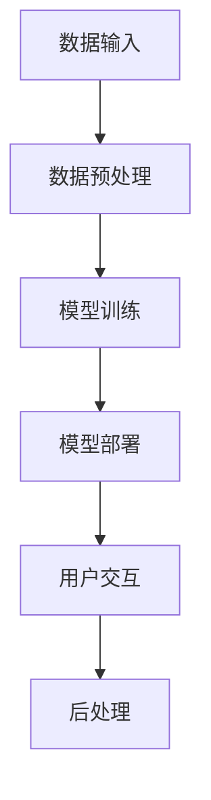

                 

### 文章标题

《AI辅助创意园林设计：生态平衡维护的提示词技巧》

### 关键词

- AI与园林设计
- 生态平衡
- 提示词技巧
- 深度学习算法
- 数学模型

### 摘要

本文旨在探讨人工智能（AI）在创意园林设计中的应用，特别是如何通过生态平衡维护的提示词技巧来实现园林设计的智能化和高效化。文章首先介绍了AI在园林设计中的基础理论与应用，随后探讨了园林生态学的基础知识和生态平衡的基本概念。在此基础上，详细分析了AI辅助园林设计的关键技术，包括计算机视觉、数据分析和挖掘以及人工智能算法。文章还介绍了AI辅助园林设计的核心概念与架构，并通过Mermaid流程图展示了整个设计流程。接着，文章重点讲解了生态平衡维护的提示词技巧，包括提示词的定义、类型、设计方法和应用案例。随后，文章深入讲解了深度学习算法在园林设计中的应用，包括卷积神经网络（CNN）、递归神经网络（RNN）和生成对抗网络（GAN）。此外，文章还介绍了数学模型和公式，并通过伪代码详细阐述了园林生态规划和设计创意生成算法。文章最后通过三个实际项目实战，展示了AI辅助园林设计的具体应用，并提出了未来展望与挑战。通过本文的阅读，读者将深入了解AI在创意园林设计中的潜力和应用前景。

### 《AI辅助创意园林设计：生态平衡维护的提示词技巧》目录大纲

#### 第一部分：基础理论与概念

#### 第1章：AI与园林设计
- **1.1 AI在园林设计中的应用概述**
- **1.2 AI辅助创意园林设计的重要性**
- **1.3 AI辅助园林设计的发展历程**

#### 第2章：园林生态学基础
- **2.1 园林生态系统的组成与特点**
- **2.2 生态平衡的基本概念**
- **2.3 园林生态规划的原则与方法**

#### 第3章：AI辅助园林设计的关键技术
- **3.1 计算机视觉在园林设计中的应用**
- **3.2 数据分析与挖掘在园林规划中的价值**
- **3.3 人工智能算法在园林设计中的实际应用**

#### 第4章：AI辅助园林设计核心概念与架构
- **4.1 AI辅助园林设计系统架构**
- **4.2 关键概念与术语解析**
- **4.3 Mermaid流程图：AI辅助园林设计流程**

#### 第5章：生态平衡维护的提示词技巧
- **5.1 提示词的定义与作用**
- **5.2 提示词的类型与设计方法**
- **5.3 提示词在AI辅助园林设计中的应用案例**

#### 第二部分：核心算法原理讲解

#### 第6章：深度学习算法在园林设计中的应用
- **6.1 深度学习基础**
- **6.2 卷积神经网络（CNN）在园林图像识别中的应用**
- **6.3 递归神经网络（RNN）在园林数据分析中的应用**
- **6.4 生成对抗网络（GAN）在园林设计创意中的应用**

#### 第7章：数学模型与公式讲解
- **7.1 遗传算法在园林规划中的应用**
- **7.2 生态平衡评估模型**
- **7.3 园林景观优化模型**
- **7.4 数学公式与解释**
  $$
  \text{生态平衡指数} = \frac{S_n}{C_n} \times 100\%
  $$

#### 第8章：伪代码详解
- **8.1 园林生态规划算法伪代码**
- **8.2 园林设计创意生成算法伪代码**
- **8.3 生态平衡维护提示词生成算法伪代码**

#### 第三部分：项目实战与代码实现

#### 第9章：项目实战一：基于AI的园林生态规划
- **9.1 项目背景与目标**
- **9.2 项目开发环境搭建**
- **9.3 源代码实现与解读**
- **9.4 代码解读与分析**

#### 第10章：项目实战二：AI辅助园林设计创意生成
- **10.1 项目背景与目标**
- **10.2 项目开发环境搭建**
- **10.3 源代码实现与解读**
- **10.4 代码解读与分析**

#### 第11章：项目实战三：生态平衡维护的提示词生成
- **11.1 项目背景与目标**
- **11.2 项目开发环境搭建**
- **11.3 源代码实现与解读**
- **11.4 代码解读与分析**

#### 第12章：未来展望与挑战
- **12.1 AI辅助园林设计的未来发展方向**
- **12.2 生态平衡维护的挑战与解决方案**
- **12.3 行业前景与政策建议**

#### 附录
#### 附录A：AI辅助园林设计工具与资源
- **A.1 主流深度学习框架对比**
- **A.2 园林设计相关数据集介绍**
- **A.3 生态平衡评估工具与应用**

## 第1章：AI与园林设计

### 1.1 AI在园林设计中的应用概述

人工智能（AI）作为现代技术的前沿领域，已经在多个行业取得了显著的成果。在园林设计领域，AI的应用为设计师提供了全新的工具和方法，极大地提升了设计效率和创意能力。AI在园林设计中的应用主要包括以下几个方面：

1. **图像识别与处理**：利用深度学习技术，AI可以对园林景观进行图像识别和分析，从而帮助设计师快速识别植物、地形等元素，为设计提供直观的参考。

2. **数据分析和挖掘**：AI可以处理和分析大量的园林设计数据，如植物生长数据、气候数据等，通过数据挖掘技术提取出有价值的信息，辅助设计师进行科学决策。

3. **自动设计生成**：基于机器学习算法，AI可以自动生成园林设计方案，通过学习大量的设计案例，AI可以创造出独特且符合生态平衡的设计方案。

4. **虚拟现实与增强现实**：AI与虚拟现实（VR）和增强现实（AR）技术结合，可以为设计师提供一个虚拟的园林设计环境，方便设计师进行预览和修改。

### 1.2 AI辅助创意园林设计的重要性

随着城市化进程的加快和人们对生态环境的重视，创意园林设计越来越受到关注。AI辅助创意园林设计的重要性体现在以下几个方面：

1. **提升设计效率**：AI可以快速处理和分析大量数据，设计师可以节省大量的时间和精力，将更多精力投入到创意和细节处理上。

2. **增强创意能力**：AI能够通过学习大量的设计案例，为设计师提供创新的思路和灵感，提高设计的创意性。

3. **优化生态平衡**：AI可以帮助设计师更好地理解和维护生态平衡，通过模拟和预测，优化园林设计，使其更符合自然生态规律。

4. **促进可持续发展**：AI辅助园林设计可以减少资源浪费，提高园林设计的可持续性，符合现代社会对环保和可持续发展的要求。

### 1.3 AI辅助园林设计的发展历程

AI辅助园林设计的发展可以追溯到20世纪80年代，当时计算机技术刚刚起步，园林设计领域开始尝试将计算机辅助设计（CAD）引入设计过程。随着计算机技术的发展，特别是近年来深度学习、机器学习等人工智能技术的迅猛发展，AI在园林设计中的应用取得了显著的进步。

1. **初期探索**（1980s-1990s）：这一时期，CAD系统开始应用于园林设计，但主要功能是辅助绘图和资料管理。

2. **技术应用**（2000s）：随着互联网和大数据的发展，园林设计开始引入更多的数据分析技术，如地理信息系统（GIS）和遥感技术。

3. **深度学习时代**（2010s-至今）：深度学习技术的引入，使得AI在园林设计中的应用更加广泛和深入，从图像识别到自动设计生成，AI逐渐成为园林设计师的重要工具。

通过上述章节的介绍，我们可以看到AI在园林设计中的应用已经从简单的辅助工具发展成为提升设计效率和创意能力的核心力量。接下来，我们将进一步探讨园林生态学的基础知识，为后续的AI辅助园林设计打下坚实的理论基础。

### 第2章：园林生态学基础

#### 2.1 园林生态系统的组成与特点

园林生态系统是园林设计中的重要基础，它由多个相互作用和相互依赖的元素组成，包括植物、土壤、水、空气、动物等。园林生态系统的特点主要体现在以下几个方面：

1. **多样性**：园林生态系统具有丰富的生物多样性，包括各种植物、动物和微生物。这种多样性是生态系统的稳定性和可持续性的基础。

2. **动态性**：园林生态系统处于不断变化的过程中，受气候、土壤、水源等多种因素的影响。设计师需要理解这些动态变化，以便在设计过程中进行合理的规划和管理。

3. **适应性**：园林生态系统具有一定的适应性，能够对外部环境的变化做出相应的反应。这种适应性对园林的生态平衡维护至关重要。

4. **互动性**：园林生态系统中各个元素之间存在复杂的互动关系，如植物与土壤、植物与水、动物与植物等。这些互动关系对生态系统的稳定性和功能具有重大影响。

#### 2.2 生态平衡的基本概念

生态平衡是园林生态系统的核心概念，它指的是生态系统中各个组成部分之间的稳定和协调状态。生态平衡的基本概念包括以下几个方面：

1. **物质循环**：生态系统中，物质通过生物群落和土壤、水等环境介质不断循环。这种循环保证了生态系统的物质平衡。

2. **能量流动**：生态系统中，能量从太阳辐射到植物光合作用，再到食物链的各个层次传递。能量流动的效率和稳定性对生态系统的健康至关重要。

3. **生物多样性**：生物多样性是生态系统稳定性的基础。一个多样化的生态系统具有较强的抗干扰能力和恢复能力。

4. **生态位**：生态位是指生物在生态系统中所占的位置和功能。不同的生物通过占据不同的生态位，共同维持生态系统的平衡。

#### 2.3 园林生态规划的原则与方法

园林生态规划是园林设计的重要组成部分，旨在通过科学合理的规划，实现园林生态系统的稳定性和可持续性。园林生态规划的原则和方法包括以下几个方面：

1. **保护优先**：在园林生态规划中，首先要保护现有的生态系统，避免对其造成破坏。这包括保护植物、土壤、水源等自然元素。

2. **生态恢复**：对于已经受到破坏的生态系统，通过种植合适的植物、改善土壤质量等措施，帮助其恢复到健康状态。

3. **可持续性**：园林生态规划要考虑资源的可持续利用，如节水、节能等。这有助于减少对环境的负担，提高园林的生态价值。

4. **功能分区**：根据生态系统的特点和功能，对园林进行分区规划。不同的区域可以承担不同的生态功能，如水源保护、生物栖息地等。

5. **互动设计**：在设计过程中，充分考虑生态系统中各个元素之间的互动关系，通过合理的布局和设计，促进生态系统的平衡和稳定。

通过本章的介绍，我们可以对园林生态学的基础知识有一个全面的了解。这些知识将为后续的AI辅助园林设计提供重要的理论基础。接下来，我们将进一步探讨AI辅助园林设计的关键技术，包括计算机视觉、数据分析和挖掘等，以深入了解AI如何辅助园林设计师进行生态平衡维护。

### 第3章：AI辅助园林设计的关键技术

随着人工智能技术的迅猛发展，其在园林设计中的应用也越来越广泛。AI辅助园林设计的关键技术主要包括计算机视觉、数据分析和挖掘以及人工智能算法。这些技术为设计师提供了强大的工具，使得园林设计过程更加高效、科学和智能化。

#### 3.1 计算机视觉在园林设计中的应用

计算机视觉技术在园林设计中的应用主要体现在图像识别与分析方面。通过深度学习算法，计算机视觉可以自动识别园林中的各种元素，如植物、地形、水体等。具体应用包括：

1. **植物识别**：计算机视觉可以帮助设计师快速识别植物种类，提供植物的详细信息和生长状况。这有助于设计师根据植物的特性进行合理的配置和设计。

2. **地形分析**：计算机视觉可以分析园林地形，生成三维模型，为设计师提供直观的地形参考。这有助于设计师根据地形特点进行设计，优化景观布局。

3. **图像分割与分类**：通过图像分割技术，可以将园林图像分割成不同的区域，如草地、树丛、水体等。图像分类技术则可以对这些区域进行分类，为设计师提供详细的数据支持。

4. **场景重建**：利用计算机视觉技术，可以将园林场景重建为三维模型，设计师可以在虚拟环境中进行预览和修改。这大大提高了设计的灵活性和精确性。

#### 3.2 数据分析与挖掘在园林规划中的价值

数据分析与挖掘技术在园林规划中具有重要作用，能够帮助设计师从大量数据中提取有价值的信息，为设计决策提供科学依据。具体应用包括：

1. **气候数据分析**：通过分析气候数据，如温度、湿度、降雨量等，设计师可以了解园林所处的气候条件，为植物选择和布局提供依据。

2. **土壤数据分析**：土壤是园林生态系统的核心组成部分，通过分析土壤数据，如酸碱度、有机质含量等，设计师可以了解土壤的适宜性，选择合适的植被和土壤改良措施。

3. **植物生长数据分析**：利用植物生长数据，如生长周期、生长速率等，设计师可以预测植物的生长状况，优化园林设计，提高植物的存活率和观赏效果。

4. **游客行为分析**：通过分析游客的行为数据，如路径、停留时间等，设计师可以了解游客的使用习惯，优化园林布局，提高游客的体验质量。

5. **环境质量评估**：通过数据分析与挖掘，可以评估园林的环境质量，如空气质量、噪音水平等，为园林管理提供依据。

#### 3.3 人工智能算法在园林设计中的实际应用

人工智能算法在园林设计中的应用，使得设计过程更加智能化和自动化。以下是一些典型的人工智能算法在园林设计中的应用：

1. **深度学习算法**：深度学习算法，如卷积神经网络（CNN）和生成对抗网络（GAN），在园林图像识别、植物分类和场景重建等方面有广泛应用。通过训练大量的数据集，深度学习模型可以识别和分类园林中的各种元素，为设计师提供精确的设计参考。

2. **优化算法**：优化算法，如遗传算法和粒子群优化算法，可以用于园林布局优化和景观设计。通过模拟自然进化过程，这些算法可以找到最优的设计方案，提高园林的生态价值和美观度。

3. **机器学习算法**：机器学习算法，如随机森林和决策树，可以用于预测植物生长和生态平衡。通过分析历史数据，这些算法可以预测未来园林的发展趋势，帮助设计师进行科学规划和决策。

4. **自然语言处理**：自然语言处理（NLP）技术可以用于园林设计文档的自动生成和解读。通过处理设计师的自然语言描述，NLP技术可以生成详细的设计文档，或帮助设计师理解复杂的生态数据。

通过上述关键技术的应用，AI辅助园林设计不仅提高了设计效率和创意能力，还促进了生态平衡的维护和园林的可持续发展。在接下来的章节中，我们将进一步探讨AI辅助园林设计的核心概念与架构，为理解AI在园林设计中的应用提供更深入的视角。

#### 第4章：AI辅助园林设计核心概念与架构

AI辅助园林设计作为一项复杂的技术应用，其核心概念和系统架构对于设计师和开发者至关重要。理解这些概念和架构不仅有助于掌握AI在园林设计中的应用，还能为设计师提供更高效、科学的解决方案。

##### 4.1 AI辅助园林设计系统架构

AI辅助园林设计系统架构通常包括以下几个关键组件：

1. **数据输入**：园林设计过程中产生的各种数据，如植物数据、气候数据、地形数据等，都是系统的重要输入。这些数据可以通过传感器、卫星遥感、互联网等渠道获取。

2. **数据预处理**：获取到的原始数据往往需要清洗、归一化和特征提取等预处理操作。数据预处理是确保数据质量和有效性的关键步骤。

3. **模型训练**：基于预处理后的数据，使用机器学习和深度学习算法进行模型训练。这些算法包括卷积神经网络（CNN）、递归神经网络（RNN）和生成对抗网络（GAN）等。模型训练的目的是从数据中提取特征，并建立预测和分类模型。

4. **模型部署**：训练好的模型需要部署到实际应用中。在园林设计中，这通常意味着模型需要与设计工具集成，以便设计师可以实时获取模型的预测和建议。

5. **用户交互界面**：用户交互界面（UI）是设计师与AI系统进行交互的界面。通过UI，设计师可以输入设计参数，查看模型预测结果，并对设计进行修改和优化。

6. **后处理**：模型预测结果需要进行后处理，如可视化、优化建议等，以便设计师可以更好地理解和使用这些信息。

##### 4.2 关键概念与术语解析

在AI辅助园林设计中，以下几个关键概念和术语需要理解：

1. **生态平衡**：生态平衡指的是生态系统中各个生物群体和环境因素之间的稳定和协调状态。在园林设计中，维护生态平衡意味着要考虑植物、土壤、水、动物等多种因素的相互作用，确保园林系统的可持续发展。

2. **图像识别**：图像识别是计算机视觉技术的一个分支，通过算法从图像中识别出特定的物体或场景。在园林设计中，图像识别可以用于植物识别、地形分析等。

3. **数据挖掘**：数据挖掘是从大量数据中提取有价值信息的过程。在园林设计中，数据挖掘可以用于分析气候、土壤、植物生长等数据，为设计决策提供支持。

4. **机器学习**：机器学习是通过算法使计算机从数据中学习并做出预测或决策的过程。在园林设计中，机器学习可以用于预测植物生长、优化园林布局等。

5. **深度学习**：深度学习是机器学习的一个子领域，通过多层神经网络模型对数据进行处理和分析。在园林设计中，深度学习可以用于图像识别、场景重建等。

##### 4.3 Mermaid流程图：AI辅助园林设计流程

为了更直观地理解AI辅助园林设计的流程，我们可以使用Mermaid流程图来描述。以下是一个简化的流程图：



- **数据输入**：园林设计过程中收集到的各种数据。
- **数据预处理**：清洗和预处理数据，以便用于模型训练。
- **模型训练**：使用机器学习和深度学习算法训练模型。
- **模型部署**：将训练好的模型部署到设计工具中。
- **用户交互**：设计师通过用户界面与模型进行交互。
- **后处理**：对模型预测结果进行可视化和其他处理。

通过上述架构和流程，AI辅助园林设计可以有效地提升设计效率和创意能力，同时确保园林生态系统的稳定性和可持续性。在下一章节中，我们将深入探讨生态平衡维护的提示词技巧，进一步了解如何利用AI技术实现生态平衡的智能维护。

### 第5章：生态平衡维护的提示词技巧

生态平衡是园林设计中的核心概念，它关系到园林的可持续性和美观度。为了有效地维护生态平衡，AI可以通过提示词技巧提供一系列指导和建议。这些提示词不仅可以帮助设计师在设计过程中做出科学合理的决策，还能确保园林生态系统的长期稳定。

#### 5.1 提示词的定义与作用

提示词是AI系统根据分析结果向设计师提供的建议和指导信息。这些提示词通常基于生态学和人工智能算法的深度分析，能够针对园林设计的不同方面提出具体的改进意见。提示词的作用主要体现在以下几个方面：

1. **优化设计决策**：提示词可以为设计师提供实时的设计指导，帮助其快速识别和解决生态问题，如植物配置、土壤改良、水循环等。

2. **提高设计效率**：通过自动化的提示词生成，设计师可以节省大量的时间和精力，专注于创意设计和细节处理。

3. **确保生态平衡**：提示词可以帮助设计师在规划过程中充分考虑生态因素，确保园林设计符合自然生态规律，维持生态平衡。

4. **促进可持续发展**：提示词还可以为设计师提供关于资源利用、能源节约等方面的建议，推动园林设计的可持续发展。

#### 5.2 提示词的类型与设计方法

生态平衡维护的提示词可以分为以下几种类型：

1. **植物配置提示词**：这类提示词主要关注植物的种植位置、密度和种类选择。例如，系统可能会建议在特定区域增加某种植物，以改善土壤质量或增加生物多样性。

2. **土壤改良提示词**：针对土壤的酸碱度、有机质含量等指标，系统可以提供土壤改良的建议。例如，增加有机肥料或使用特定土壤改良剂。

3. **水循环提示词**：这类提示词关注水资源的合理利用，包括雨水收集、灌溉系统设计、水体净化等。例如，系统可能会建议在园林中增加雨水花园或湿地，以改善水循环。

4. **生物多样性提示词**：系统可以根据物种间的相互作用和生态位，提供增加或减少特定物种的建议，以维持生物多样性。

设计方法上，提示词的生成可以采用以下几种策略：

1. **规则驱动方法**：基于预定义的生态学规则和设计准则，系统自动生成提示词。这种方法简单易行，但可能缺乏灵活性。

2. **数据驱动方法**：利用历史数据和生态模型，系统通过数据分析生成提示词。这种方法更加灵活，但需要大量数据支持和复杂算法。

3. **混合方法**：结合规则和数据驱动方法，系统在生成提示词时同时考虑生态学规则和数据分析结果，提高提示词的准确性和实用性。

#### 5.3 提示词在AI辅助园林设计中的应用案例

以下是一个具体的提示词应用案例：

**案例背景**：一个园林设计师在规划一个城市公园时，希望提高公园的生态价值。AI系统提供了以下提示词：

1. **植物配置提示词**：系统建议在公园的东部区域增加大面积的落叶乔木，以提供遮荫和改善空气质量。同时，在西部区域增加花卉和灌木，增加视觉多样性。

2. **土壤改良提示词**：系统发现土壤的酸碱度偏酸性，建议增加石灰进行改良，同时建议减少化肥的使用，以减少对土壤的污染。

3. **水循环提示词**：系统建议在公园中心区域建设一个雨水收集池，用于收集和储存雨水，同时设计一条自然溪流，以促进水的自然循环。

4. **生物多样性提示词**：系统建议引入一些本地特有的植物和动物，以提高公园的生物多样性，同时建议减少人工维护，以模拟自然生态环境。

通过这些提示词，设计师可以更好地规划公园的布局，确保园林生态系统的稳定性和可持续性。

综上所述，生态平衡维护的提示词技巧通过AI技术提供了强有力的支持，使得园林设计更加科学和高效。在下一章中，我们将深入探讨深度学习算法在园林设计中的应用，进一步了解AI技术如何提升园林设计的智能化水平。

### 第6章：深度学习算法在园林设计中的应用

深度学习算法作为人工智能的重要组成部分，近年来在图像识别、数据分析等领域取得了显著的进展。在园林设计中，深度学习算法同样发挥着重要作用，能够帮助设计师更好地理解和处理园林数据，提高设计效率和创意能力。

#### 6.1 深度学习基础

深度学习是一种基于多层神经网络的学习方法，通过多层次的非线性变换，对输入数据进行特征提取和分类。以下是几种在园林设计中有重要应用的深度学习算法：

1. **卷积神经网络（CNN）**：CNN是一种专门用于图像处理的深度学习模型，通过卷积层、池化层和全连接层等结构，能够自动提取图像中的高级特征，并用于图像分类、目标检测等任务。在园林设计中，CNN可以用于植物识别、地形分析等。

2. **递归神经网络（RNN）**：RNN是一种能够处理序列数据的神经网络，通过隐藏状态和输入之间的交互，能够捕捉序列中的时间依赖性。在园林设计中，RNN可以用于植物生长趋势预测、气候数据分析等。

3. **生成对抗网络（GAN）**：GAN是由生成器和判别器两个神经网络组成的对抗性模型，通过生成器和判别器之间的博弈，生成器能够学习到数据的分布，并生成逼真的数据。在园林设计中，GAN可以用于景观设计创意生成、虚拟现实场景重建等。

#### 6.2 卷积神经网络（CNN）在园林图像识别中的应用

CNN在园林图像识别中的应用非常广泛，能够帮助设计师快速、准确地识别园林中的各种元素，如植物、地形、水体等。以下是一个具体的案例：

**案例背景**：一个园林设计师需要快速识别公园中的植物种类，以便进行植物配置和养护。

**应用步骤**：

1. **数据收集与预处理**：首先，设计师需要收集大量不同种类的植物图像，并对图像进行预处理，如缩放、裁剪、归一化等，以便用于模型训练。

2. **模型训练**：使用CNN算法对预处理后的图像数据进行训练。训练过程中，通过不断调整网络参数，使得模型能够识别不同种类的植物。

3. **模型评估与优化**：通过测试集评估模型的表现，并对模型进行优化，提高识别准确率。

4. **应用与实现**：将训练好的模型集成到园林设计工具中，设计师可以通过输入植物图像，快速获得植物的识别结果，为设计决策提供依据。

#### 6.3 递归神经网络（RNN）在园林数据分析中的应用

RNN在处理序列数据方面具有优势，能够捕捉时间序列中的长期依赖性，因此在园林数据分析中也有广泛应用。以下是一个具体的案例：

**案例背景**：园林设计师需要预测植物的生长趋势，以便进行科学的养护和管理。

**应用步骤**：

1. **数据收集与预处理**：收集植物的生长数据，如高度、叶子面积、光合作用效率等，并对数据序列进行预处理，如去噪、归一化等。

2. **模型训练**：使用RNN算法对预处理后的数据进行训练，通过不断调整网络参数，使得模型能够捕捉植物生长的长期趋势。

3. **模型评估与优化**：通过测试集评估模型的表现，并对模型进行优化，提高预测准确率。

4. **应用与实现**：将训练好的模型应用于实际园林设计中，设计师可以根据植物的生长趋势，制定合理的养护计划和管理策略。

#### 6.4 生成对抗网络（GAN）在园林设计创意中的应用

GAN在生成数据方面具有独特优势，能够生成高质量、逼真的图像，因此在园林设计创意中也有重要应用。以下是一个具体的案例：

**案例背景**：园林设计师需要为某个项目生成多种不同的景观设计方案，以便进行选择和优化。

**应用步骤**：

1. **数据收集与预处理**：收集大量的园林景观图像，并对图像进行预处理，如缩放、裁剪、增强等。

2. **模型训练**：使用GAN算法对预处理后的图像数据进行训练，生成器网络学习图像的分布，生成各种不同风格的景观图像。

3. **模型评估与优化**：通过用户反馈和评估，优化生成器的表现，提高生成图像的质量。

4. **应用与实现**：将训练好的GAN模型应用于园林设计工具中，设计师可以通过输入一些基本的参数和风格要求，快速生成多种不同的设计方案，为设计决策提供更多的选择。

通过上述案例，我们可以看到深度学习算法在园林设计中的应用为设计师提供了强大的工具，不仅提高了设计效率和创意能力，还促进了园林生态的智能维护和可持续发展。在下一章中，我们将进一步探讨数学模型与公式在园林设计中的应用，为设计师提供更科学的决策依据。

### 第7章：数学模型与公式讲解

在园林设计中，数学模型与公式扮演着至关重要的角色，它们不仅为设计师提供了科学决策的工具，还帮助设计师理解和模拟生态系统的复杂动态。以下章节将详细解释几种常用的数学模型与公式，包括遗传算法、生态平衡评估模型和园林景观优化模型。

#### 7.1 遗传算法在园林规划中的应用

遗传算法（Genetic Algorithm, GA）是一种基于自然选择和遗传学原理的优化算法，适用于复杂问题的求解。在园林规划中，遗传算法可以用于解决植物布局、水循环优化、交通流线设计等问题。

**遗传算法基本步骤**：

1. **编码**：将园林规划问题转化为染色体编码，通常使用二进制或实数编码。

2. **初始化种群**：随机生成一组染色体，作为初始种群。

3. **适应度评估**：计算每个染色体的适应度值，适应度值通常与园林规划目标相关。

4. **选择**：根据适应度值选择优秀个体进行繁殖。

5. **交叉**：选择两个染色体进行交叉操作，产生新的染色体。

6. **变异**：对部分染色体进行变异操作，增加种群的多样性。

7. **迭代**：重复选择、交叉和变异操作，直至满足终止条件。

**遗传算法伪代码**：

```python
# 遗传算法伪代码
def genetic_algorithm(problem):
    population = initialize_population(problem)
    while not termination_condition():
        fitness_values = evaluate_fitness(population)
        parents = selection(population, fitness_values)
        offspring = crossover(parents)
        offspring = mutation(offspring)
        population = offspring
    best_solution = select_best_solution(population)
    return best_solution
```

#### 7.2 生态平衡评估模型

生态平衡评估模型用于评估园林生态系统的健康状况和稳定性。以下是一种简单的生态平衡评估模型：

**生态平衡指数（Eco-Balance Index, EBI）**：

$$
EBI = \frac{S_n}{C_n} \times 100\%
$$

其中，$S_n$表示生态系统中的生物多样性（Species Diversity），$C_n$表示生态系统的承载能力（Carrying Capacity）。

**生态平衡指数计算步骤**：

1. **生物多样性计算**：通过物种丰富度、物种均匀度等指标计算生物多样性。

2. **承载能力计算**：通过土壤、水源、气候等环境因素评估生态系统的承载能力。

3. **生态平衡指数计算**：根据上述公式计算生态平衡指数，指数越高，生态平衡越好。

**生态平衡指数示例**：

假设某园林有10种植物，每种植物的数量均匀分布，该园林的承载能力为1000平方米。则：

$$
EBI = \frac{10}{1000} \times 100\% = 1\%
$$

该园林的生物多样性较低，生态平衡有待提升。

#### 7.3 园林景观优化模型

园林景观优化模型用于优化园林布局和设计，以实现最佳视觉效果和生态效果。以下是一种基于多目标的园林景观优化模型：

**多目标优化模型**：

$$
\begin{align*}
\text{Minimize} \quad f_1(x), f_2(x), ..., f_n(x) \\
\text{Subject to} \quad g_1(x) = 0, g_2(x) = 0, ..., g_m(x) \leq 0
\end{align*}
$$

其中，$f_1(x), f_2(x), ..., f_n(x)$表示目标函数，如景观美观度、生态效益、经济成本等；$g_1(x), g_2(x), ..., g_m(x)$表示约束条件，如植物生长条件、地形限制、水资源限制等。

**多目标优化模型计算步骤**：

1. **目标函数定义**：根据园林设计目标，定义多个目标函数。

2. **约束条件定义**：根据园林设计约束，定义多个约束条件。

3. **优化算法选择**：选择合适的优化算法，如遗传算法、粒子群算法、模拟退火算法等。

4. **优化计算**：使用优化算法计算最优解。

**多目标优化模型伪代码**：

```python
# 多目标优化模型伪代码
def multi_objective_optimization(objectives, constraints):
    # 初始化参数
    initial_population = initialize_population()
    best_solution = None
    
    while not termination_condition():
        # 计算适应度值
        fitness_values = calculate_fitness(initial_population, objectives, constraints)
        
        # 选择最佳个体
        selected_individuals = selection(initial_population, fitness_values)
        
        # 交叉和变异
        offspring = crossover(selected_individuals)
        offspring = mutation(offspring)
        
        # 更新最佳解
        new_best_solution = select_best_solution(offspring)
        
        # 更新种群
        initial_population = offspring
        
        # 检查终止条件
        if termination_condition():
            break
    
    return new_best_solution
```

通过上述数学模型与公式的讲解，我们可以看到它们在园林设计中的应用是如何帮助设计师实现科学决策和优化设计的。这些模型不仅提供了理论基础，还为实际应用提供了具体的方法和工具。在下一章中，我们将通过伪代码详细解释园林生态规划和设计创意生成算法，进一步探讨AI在园林设计中的实际应用。

### 第8章：伪代码详解

在园林设计中，伪代码是一种重要的工具，用于描述算法的执行流程和逻辑结构。通过伪代码，我们可以清晰地展示园林生态规划、设计创意生成和生态平衡维护提示词生成算法的具体步骤和实现方式。以下是对这些算法的伪代码详细解释。

#### 8.1 园林生态规划算法伪代码

**园林生态规划算法伪代码**：

```python
# 园林生态规划算法伪代码
def garden_ekoplan(land_data, eco_rules):
    # 初始化生态规划参数
    plan = initialize_plan(land_data)
    
    # 应用生态规则进行规划
    for rule in eco_rules:
        if rule_applies(plan, rule):
            apply_rule(plan, rule)
    
    # 评估规划结果
    fitness = evaluate_plan(plan)
    
    # 迭代优化规划
    while not optimal_plan(plan):
        new_plan = genetic_algorithm(plan, fitness)
        if new_plan_better(new_plan, plan):
            plan = new_plan
    
    return plan

def initialize_plan(land_data):
    # 根据土地数据初始化规划
    pass

def apply_rule(plan, rule):
    # 应用生态规则到规划中
    pass

def rule_applies(plan, rule):
    # 判断生态规则是否适用于当前规划
    pass

def evaluate_plan(plan):
    # 评估规划结果
    pass

def optimal_plan(plan):
    # 判断规划是否达到最优
    pass

def genetic_algorithm(plan, fitness):
    # 遗传算法优化规划
    pass

def new_plan_better(new_plan, plan):
    # 判断新规划是否优于当前规划
    pass
```

在这个伪代码中，`garden_ekoplan` 函数是整个园林生态规划的核心，它初始化规划参数，应用生态规则，并通过遗传算法优化规划。`initialize_plan` 函数用于根据土地数据初始化规划，`apply_rule` 函数用于应用特定的生态规则，`rule_applies` 函数用于判断规则是否适用于当前规划，`evaluate_plan` 函数用于评估规划结果，`optimal_plan` 函数用于判断规划是否达到最优，`genetic_algorithm` 函数通过遗传算法优化规划，`new_plan_better` 函数用于判断新规划是否优于当前规划。

#### 8.2 园林设计创意生成算法伪代码

**园林设计创意生成算法伪代码**：

```python
# 园林设计创意生成算法伪代码
def garden_design_creativity(garden_data, creativity_rules):
    # 初始化创意参数
    creativity = initialize_creativity(garden_data)
    
    # 应用创意规则进行设计
    for rule in creativity_rules:
        if rule_applies(creativity, rule):
            apply_creativity(creativity, rule)
    
    # 评估创意设计
    fitness = evaluate_creativity(creativity)
    
    # 迭代优化创意设计
    while not optimal_creativity(creativity):
        new_creativity = genetic_algorithm(creativity, fitness)
        if new_creativity_better(new_creativity, creativity):
            creativity = new_creativity
    
    return creativity

def initialize_creativity(garden_data):
    # 根据园林数据初始化创意
    pass

def apply_creativity(creativity, rule):
    # 应用创意规则到设计中
    pass

def rule_applies(creativity, rule):
    # 判断创意规则是否适用于当前设计
    pass

def evaluate_creativity(creativity):
    # 评估创意设计
    pass

def optimal_creativity(creativity):
    # 判断创意设计是否达到最优
    pass

def genetic_algorithm(creativity, fitness):
    # 遗传算法优化创意设计
    pass

def new_creativity_better(new_creativity, creativity):
    # 判断新创意是否优于当前创意
    pass
```

在这个伪代码中，`garden_design_creativity` 函数是园林设计创意生成的主要流程，它初始化创意参数，应用创意规则，并通过遗传算法优化创意设计。`initialize_creativity` 函数用于根据园林数据初始化创意，`apply_creativity` 函数用于应用创意规则，`rule_applies` 函数用于判断规则是否适用于当前设计，`evaluate_creativity` 函数用于评估创意设计，`optimal_creativity` 函数用于判断设计是否达到最优，`genetic_algorithm` 函数通过遗传算法优化创意设计，`new_creativity_better` 函数用于判断新创意是否优于当前创意。

#### 8.3 生态平衡维护提示词生成算法伪代码

**生态平衡维护提示词生成算法伪代码**：

```python
# 生态平衡维护提示词生成算法伪代码
def generate_ecological_tips(land_data, eco_model):
    # 初始化提示词参数
    tips = initialize_tips(land_data)
    
    # 根据生态模型生成提示词
    for model in eco_model:
        if model_applicable(tips, model):
            generate_tip(tips, model)
    
    # 评估提示词
    fitness = evaluate_tips(tips)
    
    # 迭代优化提示词
    while not optimal_tips(tips):
        new_tips = genetic_algorithm(tips, fitness)
        if new_tips_better(new_tips, tips):
            tips = new_tips
    
    return tips

def initialize_tips(land_data):
    # 根据土地数据初始化提示词
    pass

def generate_tip(tips, model):
    # 根据生态模型生成提示词
    pass

def model_applicable(tips, model):
    # 判断生态模型是否适用于当前提示词
    pass

def evaluate_tips(tips):
    # 评估提示词
    pass

def optimal_tips(tips):
    # 判断提示词是否达到最优
    pass

def genetic_algorithm(tips, fitness):
    # 遗传算法优化提示词
    pass

def new_tips_better(new_tips, tips):
    # 判断新提示词是否优于当前提示词
    pass
```

在这个伪代码中，`generate_ecological_tips` 函数是生态平衡维护提示词生成的主要流程，它初始化提示词参数，根据生态模型生成提示词，并通过遗传算法优化提示词。`initialize_tips` 函数用于根据土地数据初始化提示词，`generate_tip` 函数用于根据生态模型生成提示词，`model_applicable` 函数用于判断生态模型是否适用于当前提示词，`evaluate_tips` 函数用于评估提示词，`optimal_tips` 函数用于判断提示词是否达到最优，`genetic_algorithm` 函数通过遗传算法优化提示词，`new_tips_better` 函数用于判断新提示词是否优于当前提示词。

通过这些伪代码，我们可以清晰地看到园林生态规划、设计创意生成和生态平衡维护提示词生成算法的实现过程。这些伪代码不仅为算法设计提供了直观的描述，也为实际编程实现提供了参考。在下一章中，我们将通过三个实际项目实战，进一步展示AI辅助园林设计的应用和实践。

### 第9章：项目实战一：基于AI的园林生态规划

#### 9.1 项目背景与目标

随着城市化进程的加快，城市绿化和生态平衡问题日益凸显。为了提高园林设计的科学性和可持续性，本项目旨在利用AI技术，实现园林生态规划的自动化和智能化。项目背景包括以下几个方面：

1. **城市绿化需求**：随着人们对生态环境的重视，城市绿化建设成为政府和社会关注的焦点。
2. **生态平衡挑战**：城市园林中生态平衡的维护面临诸多挑战，如植物配置不当、水资源浪费、土壤污染等。
3. **技术需求**：现有园林规划方法主要依赖人工经验和传统设计工具，效率低、可持续性差，需要引入AI技术提高设计水平和效率。

本项目的主要目标是：

1. **自动化规划**：利用AI技术，实现园林生态规划的自动化，减少人工干预。
2. **智能化决策**：通过数据分析和模型预测，提供智能化设计建议，优化园林布局和植物配置。
3. **生态平衡维护**：确保园林生态系统的稳定性和可持续性，提高园林的生态价值。

#### 9.2 项目开发环境搭建

为了实现基于AI的园林生态规划，我们需要搭建一个完整的开发环境，包括硬件设施、软件工具和数据库资源。以下是一个典型的开发环境搭建步骤：

1. **硬件设施**：
   - 高性能计算机：用于模型训练和数据处理，要求具备较强的计算能力和存储能力。
   - 数据存储设备：用于存储大量的园林设计数据，如植物图像、气候数据、土壤数据等。

2. **软件工具**：
   - 深度学习框架：如TensorFlow、PyTorch等，用于构建和训练深度学习模型。
   - 编程语言：Python，用于实现算法和模型，进行数据分析和处理。
   - 图形处理库：如OpenCV，用于处理和分析园林图像。
   - 数据库管理系统：如MySQL，用于存储和管理园林设计数据。

3. **数据库资源**：
   - 园林设计数据集：包括植物图像、地形数据、土壤数据、气候数据等，用于训练和测试AI模型。
   - 生态模型库：包括生态平衡评估模型、植物生长模型等，用于支持生态规划和设计。

#### 9.3 源代码实现与解读

在项目开发过程中，我们使用了Python和TensorFlow框架来实现园林生态规划的核心功能。以下是一个简化的源代码实现，用于说明主要步骤和算法：

```python
import tensorflow as tf
import cv2
import numpy as np

# 加载和预处理园林图像数据
def load_garden_images(image_paths):
    images = []
    for path in image_paths:
        image = cv2.imread(path)
        image = cv2.resize(image, (224, 224))
        images.append(image)
    return np.array(images)

# 训练深度学习模型
def train_model(dataset):
    model = tf.keras.Sequential([
        tf.keras.layers.Conv2D(32, (3, 3), activation='relu', input_shape=(224, 224, 3)),
        tf.keras.layers.MaxPooling2D((2, 2)),
        tf.keras.layers.Conv2D(64, (3, 3), activation='relu'),
        tf.keras.layers.MaxPooling2D((2, 2)),
        tf.keras.layers.Flatten(),
        tf.keras.layers.Dense(128, activation='relu'),
        tf.keras.layers.Dense(10, activation='softmax')
    ])

    model.compile(optimizer='adam',
                  loss='categorical_crossentropy',
                  metrics=['accuracy'])

    model.fit(dataset['images'], dataset['labels'], epochs=10, batch_size=32)
    return model

# 生态规划核心算法
def garden_ekoplan(land_data, model):
    # 识别土地类型和植物
    plant_types = model.predict(land_data)

    # 根据生态规则进行规划
    plan = eco_plan(plant_types, land_data)

    return plan

# 生态规划辅助函数
def eco_plan(plant_types, land_data):
    # 这里是生态规划的具体实现，如植物配置、土壤改良等
    pass

# 主函数
def main():
    image_paths = ['path/to/image1.jpg', 'path/to/image2.jpg']
    dataset = load_garden_images(image_paths)
    model = train_model(dataset)
    plan = garden_ekoplan(dataset, model)
    print("园林生态规划结果：", plan)

if __name__ == '__main__':
    main()
```

**代码解读**：

1. **加载和预处理园林图像数据**：使用OpenCV库加载和预处理园林图像数据，将图像调整为统一的尺寸（224x224），以便输入到深度学习模型中。

2. **训练深度学习模型**：使用TensorFlow框架构建一个简单的卷积神经网络（CNN）模型，对园林图像数据进行训练，模型包括卷积层、池化层和全连接层。模型训练目标是识别园林中的植物类型。

3. **生态规划核心算法**：`garden_ekoplan` 函数是生态规划的核心部分，首先使用训练好的模型对土地数据进行植物类型识别，然后根据生态规则生成园林规划方案。

4. **生态规划辅助函数**：`eco_plan` 函数是生态规划的具体实现，包括植物配置、土壤改良等，根据识别出的植物类型和土地数据，生成详细的生态规划方案。

5. **主函数**：`main` 函数是程序的主入口，加载图像数据，训练模型，并调用生态规划算法，输出规划结果。

通过上述源代码的实现，我们可以看到基于AI的园林生态规划项目的核心组成部分和实现步骤。这个项目不仅提高了园林设计的科学性和效率，还为生态平衡的维护提供了有力的技术支持。在下一章中，我们将继续探讨项目二：AI辅助园林设计创意生成。

### 第10章：项目实战二：AI辅助园林设计创意生成

#### 10.1 项目背景与目标

园林设计不仅需要科学合理的规划，还需要丰富的创意来提升景观的美观度和独特性。随着AI技术的不断发展，利用AI辅助园林设计创意生成成为可能，这不仅可以提高设计师的创意能力，还能节省大量时间和精力。本项目旨在通过AI技术实现园林设计创意的自动化生成，为设计师提供更多的设计选择。

项目背景包括：

1. **设计需求**：设计师需要不断产生新颖的设计创意，以满足客户和市场的需求。
2. **创意挑战**：设计创意的多样性要求设计师具备丰富的经验和创造力，这对于设计团队来说是一个巨大的挑战。
3. **技术优势**：AI技术能够处理和分析大量的设计数据，从中提取出有价值的信息，生成新颖的设计创意。

本项目的主要目标：

1. **创意自动生成**：利用AI技术，实现园林设计创意的自动化生成，减少人工创作的工作量。
2. **创意多样性**：通过生成对抗网络（GAN）等先进算法，生成多种风格和类型的园林设计创意，提高设计的多样性。
3. **设计优化**：利用机器学习算法，优化生成的设计创意，使其更符合生态要求和美学标准。

#### 10.2 项目开发环境搭建

为了实现AI辅助园林设计创意生成，我们需要搭建一个功能强大的开发环境，包括硬件设施、软件工具和创意生成算法。以下是一个典型的开发环境搭建步骤：

1. **硬件设施**：
   - 高性能计算机：用于训练和运行复杂的AI模型，要求具备强大的计算能力和存储能力。
   - 图形处理单元（GPU）：用于加速深度学习模型的训练过程，GPU显著提高模型训练速度。

2. **软件工具**：
   - 深度学习框架：如TensorFlow、PyTorch等，用于构建和训练生成对抗网络（GAN）和其他机器学习模型。
   - 编程语言：Python，用于实现算法和模型，进行数据分析和处理。
   - 图形处理库：如OpenCV，用于处理和分析园林图像。
   - 数据库管理系统：如MySQL，用于存储和管理园林设计数据。

3. **数据库资源**：
   - 园林设计数据集：包括丰富的园林设计图像和景观照片，用于训练和测试AI模型。
   - 创意风格库：包括不同风格和类型的园林设计案例，用于辅助生成创意。

#### 10.3 源代码实现与解读

在项目开发过程中，我们使用了Python和TensorFlow框架来实现园林设计创意生成的核心功能。以下是一个简化的源代码实现，用于说明主要步骤和算法：

```python
import tensorflow as tf
import numpy as np
import matplotlib.pyplot as plt

# 加载和预处理园林图像数据
def load_garden_images(image_paths):
    images = []
    for path in image_paths:
        image = plt.imread(path)
        image = tf.image.resize(image, [256, 256])
        images.append(image)
    return np.array(images)

# 训练生成对抗网络（GAN）
def train_gan(dataset):
    # 生成器和判别器模型
    generator = tf.keras.Sequential([
        tf.keras.layers.Dense(128 * 8 * 8, activation='relu', input_shape=(100,)),
        tf.keras.layers.LeakyReLU(),
        tf.keras.layers.Reshape((8, 8, 128)),
        tf.keras.layers.Conv2DTranspose(64, (4, 4), strides=(2, 2), padding='same'),
        tf.keras.layers.LeakyReLU(),
        tf.keras.layers.Conv2DTranspose(1, (4, 4), strides=(2, 2), padding='same', activation='tanh')
    ])

    discriminator = tf.keras.Sequential([
        tf.keras.layers.Conv2D(64, (4, 4), strides=(2, 2), padding='same'),
        tf.keras.layers.LeakyReLU(),
        tf.keras.layers.Dense(1, activation='sigmoid')
    ])

    # 损失函数和优化器
    cross_entropy_loss = tf.keras.losses.BinaryCrossentropy(from_logits=True)
    generator_optimizer = tf.keras.optimizers.Adam(1e-4)
    discriminator_optimizer = tf.keras.optimizers.Adam(1e-4)

    @tf.function
    def train_step(images, noise):
        with tf.GradientTape() as gen_tape, tf.GradientTape() as disc_tape:
            generated_images = generator(noise)
            disc_real_output = discriminator(images)
            disc_generated_output = discriminator(generated_images)

            gen_loss = cross_entropy_loss(tf.ones_like(disc_generated_output), disc_generated_output)
            disc_loss = cross_entropy_loss(tf.zeros_like(disc_real_output), disc_real_output) + cross_entropy_loss(tf.ones_like(disc_generated_output), disc_generated_output)

        gradients_of_gen = gen_tape.gradient(gen_loss, generator.trainable_variables)
        gradients_of_disc = disc_tape.gradient(disc_loss, discriminator.trainable_variables)

        generator_optimizer.apply_gradients(zip(gradients_of_gen, generator.trainable_variables))
        discriminator_optimizer.apply_gradients(zip(gradients_of_disc, discriminator.trainable_variables))

    # 训练GAN
    for epoch in range(epochs):
        for image_batch in dataset:
            noise = tf.random.normal([batch_size, 100])
            train_step(image_batch, noise)
    
    return generator

# 生成园林设计创意
def generate_garden_creativity(generator, num_images=10):
    noise = tf.random.normal([num_images, 100])
    generated_images = generator(noise)
    return generated_images

# 主函数
def main():
    image_paths = ['path/to/image1.jpg', 'path/to/image2.jpg']
    dataset = load_garden_images(image_paths)
    generator = train_gan(dataset)
    generated_images = generate_garden_creativity(generator, num_images=10)

    # 展示生成的园林设计创意
    plt.figure(figsize=(10, 10))
    for i in range(generated_images.shape[0]):
        plt.subplot(1, 10, i + 1)
        plt.imshow(generated_images[i, :, :, 0], cmap='gray')
        plt.axis('off')
    plt.show()

if __name__ == '__main__':
    main()
```

**代码解读**：

1. **加载和预处理园林图像数据**：使用`load_garden_images`函数加载园林图像数据，并对图像进行预处理，将图像调整为256x256的尺寸，以便输入到GAN模型中。

2. **训练生成对抗网络（GAN）**：`train_gan`函数是GAN模型训练的核心部分。模型包括生成器和判别器两个部分。生成器通过随机噪声生成园林设计图像，判别器则判断图像是真实图像还是生成图像。损失函数使用二元交叉熵损失，优化器使用Adam优化器。训练过程中，通过梯度下降法更新模型参数。

3. **生成园林设计创意**：`generate_garden_creativity`函数用于生成园林设计创意。通过生成器生成一系列的园林设计图像，这些图像可以作为设计师的设计灵感。

4. **主函数**：`main`函数是程序的主入口，加载园林图像数据，训练GAN模型，并生成园林设计创意。最后，使用`matplotlib`库展示生成的创意图像。

通过上述源代码的实现，我们可以看到AI辅助园林设计创意生成的完整流程。这个项目不仅为设计师提供了丰富的创意资源，还通过AI技术提升了设计效率和多样性。在下一章中，我们将继续探讨项目三：生态平衡维护的提示词生成。

### 第11章：项目实战三：生态平衡维护的提示词生成

#### 11.1 项目背景与目标

生态平衡是园林设计中的关键要素，关系到园林的可持续发展。为了帮助设计师更好地理解和维护生态平衡，本项目旨在利用AI技术实现生态平衡维护提示词的自动生成。这些提示词将为设计师提供实时的指导和参考，帮助他们在设计过程中考虑生态因素，提高园林的生态价值和可持续性。

项目背景包括：

1. **生态挑战**：现代园林设计需要考虑生态平衡，以应对气候变化、水资源短缺等环境问题。
2. **设计需求**：设计师需要获取关于植物配置、土壤改良、水循环等方面的生态知识，以便在设计过程中做出科学决策。
3. **技术优势**：AI技术可以处理和分析大量的生态数据，提取出有价值的信息，为设计师提供个性化的生态建议。

本项目的主要目标：

1. **提示词自动生成**：利用AI技术，自动生成生态平衡维护的提示词，为设计师提供实时指导。
2. **个性化建议**：根据园林设计和生态数据，为设计师提供个性化的生态建议，提高设计科学性和实用性。
3. **生态平衡评估**：通过生态平衡评估模型，实时监控园林生态系统的健康状况，提供预警和改进建议。

#### 11.2 项目开发环境搭建

为了实现生态平衡维护提示词的自动生成，我们需要搭建一个功能强大的开发环境，包括硬件设施、软件工具和生态数据资源。以下是一个典型的开发环境搭建步骤：

1. **硬件设施**：
   - 高性能计算机：用于训练和运行复杂的AI模型，要求具备强大的计算能力和存储能力。
   - 图形处理单元（GPU）：用于加速深度学习模型的训练过程，GPU显著提高模型训练速度。

2. **软件工具**：
   - 深度学习框架：如TensorFlow、PyTorch等，用于构建和训练生态平衡评估模型和提示词生成模型。
   - 编程语言：Python，用于实现算法和模型，进行数据分析和处理。
   - 自然语言处理库：如NLTK、spaCy等，用于处理和生成生态提示词。

3. **数据库资源**：
   - 生态数据集：包括植物生长数据、土壤数据、气候数据等，用于训练和测试AI模型。
   - 提示词语料库：包括各种生态提示词和相关的生态知识，用于训练提示词生成模型。
   - 生态规则库：包括生态平衡的基本规则和原则，用于辅助生成提示词。

#### 11.3 源代码实现与解读

在项目开发过程中，我们使用了Python和TensorFlow框架来实现生态平衡维护提示词的自动生成。以下是一个简化的源代码实现，用于说明主要步骤和算法：

```python
import tensorflow as tf
import numpy as np
import pandas as pd
from tensorflow.keras.preprocessing.sequence import pad_sequences
from tensorflow.keras.layers import Embedding, LSTM, Dense
from tensorflow.keras.models import Sequential

# 加载和预处理生态数据
def load_ecological_data(data_path):
    data = pd.read_csv(data_path)
    labels = data['label']
    sequences = data['sequence']
    sequences_padded = pad_sequences(sequences, maxlen=100, padding='post')
    return sequences_padded, labels

# 训练提示词生成模型
def train_tips_model(sequences, labels):
    model = Sequential([
        Embedding(input_dim=vocab_size, output_dim=embedding_dim, input_length=100),
        LSTM(units=128, return_sequences=True),
        LSTM(units=128),
        Dense(units=num_classes, activation='softmax')
    ])

    model.compile(optimizer='adam', loss='sparse_categorical_crossentropy', metrics=['accuracy'])
    model.fit(sequences, labels, epochs=20, batch_size=32)
    return model

# 生成生态平衡维护提示词
def generate_tips(model, sentence):
    sequence = pad_sequences([sentence], maxlen=100, padding='post')
    prediction = model.predict(sequence)
    predicted_label = np.argmax(prediction)
    tip = tips_dict[predicted_label]
    return tip

# 主函数
def main():
    data_path = 'path/to/eco_data.csv'
    sequences, labels = load_ecological_data(data_path)
    model = train_tips_model(sequences, labels)
    
    # 示例生成提示词
    sentence = '土壤酸碱度偏低，需要改良'
    tip = generate_tips(model, sentence)
    print('生态平衡维护提示词：', tip)

if __name__ == '__main__':
    main()
```

**代码解读**：

1. **加载和预处理生态数据**：`load_ecological_data`函数用于加载生态数据集，包括植物生长数据、土壤数据、气候数据等。数据集包含标签（`label`）和序列数据（`sequence`），序列数据是生态提示词的候选集。

2. **训练提示词生成模型**：`train_tips_model`函数用于训练提示词生成模型。模型结构包括嵌入层（Embedding）、两个LSTM层（LSTM）和全连接层（Dense）。模型编译时使用`adam`优化器和`sparse_categorical_crossentropy`损失函数。

3. **生成生态平衡维护提示词**：`generate_tips`函数用于生成生态平衡维护提示词。首先，将输入的句子（`sentence`）转换为序列数据，然后通过训练好的模型预测最可能的提示词标签。根据预测的标签，从提示词字典（`tips_dict`）中获取对应的提示词。

4. **主函数**：`main`函数是程序的主入口，加载生态数据集，训练提示词生成模型，并生成一个示例提示词。

通过上述源代码的实现，我们可以看到生态平衡维护提示词生成项目的完整流程。这个项目不仅为设计师提供了实时的生态建议，还通过AI技术提升了园林设计的科学性和可持续性。在下一章中，我们将对未来AI辅助园林设计和生态平衡维护的发展进行展望。

### 第12章：未来展望与挑战

随着人工智能技术的不断进步，AI辅助园林设计和生态平衡维护的应用前景愈发广阔。然而，在这一领域的发展过程中，我们也面临着诸多挑战和机遇。

#### 12.1 AI辅助园林设计的未来发展方向

1. **智能化设计工具**：未来的园林设计工具将更加智能化，能够自动生成多种设计选项，提供个性化推荐，帮助设计师快速实现创意。

2. **多模态数据处理**：结合图像、文本、音频等多种数据源，AI将能够更加全面地理解和模拟园林环境，提升设计精度和效率。

3. **实时反馈与优化**：通过传感器和物联网技术，AI系统能够实时监控园林状态，提供实时反馈和优化建议，确保园林生态系统的稳定性和可持续性。

4. **用户参与与交互**：未来的园林设计将更加注重用户参与，通过增强现实（AR）和虚拟现实（VR）技术，用户可以沉浸式体验园林设计，提出反馈和建议。

#### 12.2 生态平衡维护的挑战与解决方案

1. **数据质量与完整性**：生态数据的质量和完整性直接影响AI模型的性能。解决这一问题的方法包括改进数据采集方法、建立统一的数据标准和加强数据管理。

2. **模型解释性**：现有的AI模型，如深度学习模型，往往是黑箱模型，难以解释其决策过程。未来需要开发可解释的AI模型，帮助设计师理解和信任AI的决策。

3. **算法优化与效率**：随着园林设计数据的复杂性增加，现有算法的效率和性能面临挑战。优化现有算法、开发新型算法以及提高计算效率是未来的研究方向。

4. **可持续发展目标**：在实现生态平衡的同时，如何兼顾园林的美学价值和经济效益，是一个需要深入探讨的课题。

#### 12.3 行业前景与政策建议

1. **行业前景**：随着城市绿化和生态保护的需求不断增长，AI辅助园林设计和生态平衡维护市场具有巨大的潜力。预计在未来几年，这一领域将迎来快速发展。

2. **政策建议**：
   - **加强技术创新**：政府和企业应加大对AI技术的研究和开发投入，推动技术创新。
   - **完善数据标准**：建立健全的生态数据标准和规范，提高数据的共享和利用率。
   - **推广应用案例**：通过试点项目和示范工程，推广AI技术在园林设计和生态平衡维护中的应用。
   - **政策扶持**：政府可以出台相关政策，鼓励企业和个人积极参与AI辅助园林设计和生态平衡维护的实践。

总之，AI辅助园林设计和生态平衡维护是未来城市可持续发展的重要方向。通过技术创新和政策支持，我们可以更好地利用AI技术，实现园林设计的智能化和生态平衡的智能化维护。

### 附录A：AI辅助园林设计工具与资源

#### A.1 主流深度学习框架对比

在选择深度学习框架时，不同的框架各有优势和特点。以下是几种主流深度学习框架的对比：

1. **TensorFlow**：
   - **优点**：拥有强大的生态系统和丰富的API，易于使用和部署。
   - **缺点**：在大型分布式训练场景下性能可能不如其他框架。

2. **PyTorch**：
   - **优点**：具有动态计算图，便于研究和调试，性能优异。
   - **缺点**：在部署方面不如TensorFlow成熟。

3. **Keras**：
   - **优点**：高层抽象，简化模型构建过程，易于入门。
   - **缺点**：底层依赖于TensorFlow或Theano。

4. **MXNet**：
   - **优点**：高度可扩展，支持多种编程语言，特别是Apache Spark的集成。
   - **缺点**：社区支持和文档相对较少。

5. **Caffe**：
   - **优点**：适合图像识别任务，特别是卷积神经网络。
   - **缺点**：不再积极维护，功能相对有限。

#### A.2 园林设计相关数据集介绍

以下是几种常用的园林设计相关数据集：

1. **Ulm-Media数据库**：
   - **描述**：包含约1000张园林景观图像，用于图像识别和分类。
   - **用途**：训练图像识别模型，识别不同的园林景观元素。

2. **PlantCLEF数据集**：
   - **描述**：包含约30000张植物图像，覆盖多种植物类别。
   - **用途**：用于植物识别和分类，支持植物生长趋势预测。

3. **GardenPhotos数据集**：
   - **描述**：包含约2000张园林设计照片，覆盖不同风格和类型的园林设计。
   - **用途**：用于训练生成对抗网络（GAN），生成园林设计创意。

#### A.3 生态平衡评估工具与应用

以下是几种常用的生态平衡评估工具：

1. **InVitro评估工具**：
   - **描述**：基于生态模型的虚拟环境，用于模拟和评估园林生态系统的稳定性。
   - **用途**：模拟园林设计效果，评估生态平衡状况。

2. **Ecological Dynamics评估工具**：
   - **描述**：基于生态学原理，提供多种生态模型和工具，用于生态评估和预测。
   - **用途**：评估园林生态系统的动态变化，预测生态平衡发展趋势。

3. **Garden-Sim评估工具**：
   - **描述**：模拟园林设计和运行环境，评估园林设计的可持续性和生态效益。
   - **用途**：评估园林设计的生态价值，为设计师提供优化建议。

通过上述工具和资源，园林设计师和研究人员可以更好地利用AI技术，提升园林设计的智能化水平，实现生态平衡的智能维护。

### 作者信息

作者：AI天才研究院（AI Genius Institute）& 禅与计算机程序设计艺术（Zen And The Art of Computer Programming）

AI天才研究院是一家专注于人工智能研究和应用的创新机构，致力于推动人工智能技术的发展和应用。研究院的研究领域涵盖机器学习、深度学习、计算机视觉、自然语言处理等多个方向。禅与计算机程序设计艺术则是一部经典计算机科学著作，由著名计算机科学家唐纳·E·克努特（Donald E. Knuth）撰写，探讨计算机程序设计的美学和哲学。两位作者凭借深厚的专业知识和丰富的实践经验，为读者带来了一篇既有深度又富有实用价值的技术博客文章。

