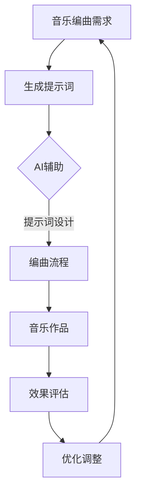

                 

### 第1章 引言

#### 1.1 音乐编曲与AI辅助

音乐编曲是音乐创作过程中的关键步骤，它涉及将旋律、和声、节奏等元素有机地结合，以创作出完整、富有表现力的音乐作品。然而，传统的音乐编曲过程往往依赖于作曲家的经验和直觉，这不仅耗时耗力，而且难以满足日益多样化的音乐创作需求。

随着人工智能（AI）技术的飞速发展，AI辅助音乐编曲逐渐成为一种新的音乐创作方式。通过机器学习算法和自然语言处理技术，AI能够自动分析大量音乐数据，从中提取出规律和模式，为作曲家提供有益的参考和创意灵感。

#### 1.2 提示词在音乐编曲中的作用

提示词（Prompt Words）在音乐编曲中起着至关重要的作用。它们是一系列关键词或短语，用来描述音乐作品的主题、情感、风格和场景等。作曲家可以通过这些提示词来引导AI生成相应的音乐元素，从而实现高效的创作过程。

提示词不仅能够帮助AI理解创作意图，还能够提高音乐编曲的精度和创意性。例如，一个简单的提示词“浪漫”可能引导AI生成柔和、温馨的旋律，而提示词“激动”则可能产生充满活力的节奏。

#### 1.3 AI在提示词设计中的应用前景

随着AI技术的不断进步，AI在提示词设计中的应用前景十分广阔。首先，AI可以通过自然语言处理技术，从大量音乐文本和数据中提取出有效的提示词。其次，AI可以结合音乐理论，设计出更加精准和多样化的提示词体系。

此外，AI还可以通过与用户的互动，不断优化和调整提示词，以更好地满足用户的需求。例如，用户可以通过调整提示词的语气、情感或风格，来得到更加个性化的音乐作品。

总之，AI辅助创意音乐编曲中的提示词设计方法，不仅能够提高音乐创作的效率和质量，还能够拓宽音乐创作的边界，为音乐创作者带来全新的创作体验。

## 第2章 AI基础理论

#### 2.1 人工智能概述

人工智能（Artificial Intelligence，简称AI）是指通过计算机模拟人类智能的技术。它旨在使计算机具备理解、推理、学习、解决问题和自主决策的能力。人工智能的研究始于20世纪50年代，近年来随着计算能力、大数据和机器学习算法的快速发展，AI技术取得了显著进展。

##### 2.1.1 人工智能的定义

人工智能可以被定义为“制造智能机器的科学和工程”，其核心目标是实现机器的智能行为，使其能够在特定领域内自主完成复杂任务。人工智能不仅包括理论研究，还涉及算法设计、系统开发和应用实施等多个方面。

##### 2.1.2 人工智能的发展历程

人工智能的发展历程可以分为几个重要阶段：

1. **探索阶段（1950s-1960s）**：在这个阶段，人工智能的概念被首次提出，并引发了广泛的研究兴趣。著名的“人工智能元年”是1956年的达特茅斯会议，会议提出了人工智能研究的几个核心问题。

2. **早期发展（1960s-1970s）**：这个阶段，人工智能的研究主要集中在逻辑推理和知识表示上。然而，由于计算能力和算法的限制，早期的人工智能系统并没有取得显著成果。

3. **低谷期（1970s-1980s）**：在20世纪70年代和80年代，人工智能研究进入了一个相对低迷的时期，被称为“人工智能寒冬”。这个时期，研究人员开始关注更为实际的领域，如专家系统和自然语言处理。

4. **复兴阶段（1990s-2000s）**：随着计算机性能的提升和大数据的出现，人工智能再次迎来了复兴。机器学习和深度学习成为研究热点，取得了突破性进展。

5. **现阶段（2010s-至今）**：在过去的十年中，人工智能技术取得了飞速发展，尤其是在图像识别、语音识别、自动驾驶等领域。AI的应用也逐渐从实验室走向了实际生活。

#### 2.2 深度学习基础

深度学习（Deep Learning）是人工智能的一个重要分支，它通过构建多层神经网络，对大量数据进行自动特征提取和模式识别。深度学习在图像识别、语音识别和自然语言处理等领域取得了显著成果。

##### 2.2.1 深度学习的原理

深度学习的原理基于人工神经网络（Artificial Neural Networks，ANN）。神经网络由大量简单的处理单元（神经元）组成，通过层次化的结构进行数据处理。每个神经元都与多个前一层神经元相连，并通过权重进行信息传递。

深度学习的核心思想是通过反向传播算法（Backpropagation Algorithm）不断调整网络中的权重，使网络能够准确地对输入数据进行分类或回归。反向传播算法通过计算输出误差，并将误差反向传播至网络中的每一层，逐层调整权重，以达到最小化误差的目的。

##### 2.2.2 深度学习的基本结构

深度学习网络通常由输入层、隐藏层和输出层组成。每个隐藏层都对输入数据进行特征提取和转换，最终输出层生成预测结果。

1. **输入层（Input Layer）**：输入层接收原始数据，并将其传递给隐藏层。

2. **隐藏层（Hidden Layers）**：隐藏层负责对输入数据进行处理，提取出更高层次的特征。深度学习的名字也来自于其多层结构。

3. **输出层（Output Layer）**：输出层生成最终的预测结果，如分类标签或数值。

#### 2.3 自然语言处理

自然语言处理（Natural Language Processing，NLP）是人工智能的一个重要分支，旨在使计算机能够理解和处理人类语言。NLP在文本分类、情感分析、机器翻译和问答系统等领域有着广泛应用。

##### 2.3.1 自然语言处理的基本概念

自然语言处理涉及多个基本概念：

1. **分词（Tokenization）**：将文本拆分为单词或短语的过程。

2. **词性标注（Part-of-Speech Tagging）**：为文本中的每个单词标注其词性，如名词、动词等。

3. **词向量表示（Word Embedding）**：将单词映射为向量，以便在计算机中进行处理。

4. **语法分析（Parsing）**：分析文本的语法结构，理解句子中的成分关系。

5. **命名实体识别（Named Entity Recognition，NER）**：识别文本中的特定实体，如人名、地名、组织名等。

##### 2.3.2 NLP的关键技术

NLP的关键技术包括：

1. **词袋模型（Bag-of-Words，BoW）**：将文本表示为一个单词的集合，忽略单词的顺序。

2. **循环神经网络（Recurrent Neural Networks，RNN）**：适用于序列数据，能够记忆先前的输入。

3. **长短期记忆网络（Long Short-Term Memory，LSTM）**：是RNN的一种变体，能够更好地处理长序列数据。

4. **卷积神经网络（Convolutional Neural Networks，CNN）**：主要用于图像识别，但也可用于文本分析。

5. **生成对抗网络（Generative Adversarial Networks，GAN）**：用于生成高质量的数据，如文本、图像等。

通过以上基本理论的学习，我们可以更好地理解AI在提示词设计中的潜在应用。接下来，我们将进一步探讨提示词的设计原理和流程。

### 第3章 提示词设计原理

#### 3.1 提示词的定义与分类

提示词（Prompt Words）是音乐创作过程中用于指导人工智能（AI）生成音乐元素的一组关键词或短语。这些关键词或短语可以描述音乐作品的主题、情感、风格、场景和情绪等，从而帮助AI理解和实现创作意图。

##### 3.1.1 提示词的定义

提示词是一种语言符号，它为AI提供了一个明确的创作目标，使得AI能够生成与提示词相匹配的音乐元素。有效的提示词应具备以下几个特点：

1. **明确性**：提示词应明确传达创作意图，避免模糊或歧义。
2. **丰富性**：提示词应涵盖多个方面，为AI提供丰富的创作空间。
3. **灵活性**：提示词应允许AI在生成过程中进行创造性探索，而非仅仅复制提示内容。

##### 3.1.2 提示词的分类

根据提示词的功能和用途，我们可以将其分为以下几类：

1. **主题性提示词**：这类提示词描述音乐作品的主题，如“爱情”、“冒险”、“幻想”等。它们常用于确定音乐的整体风格和情感基调。

2. **情感性提示词**：这类提示词传达音乐作品的情感状态，如“快乐”、“悲伤”、“激动”、“平静”等。它们在音乐创作中起着关键作用，帮助AI生成符合情感要求的音乐元素。

3. **风格性提示词**：这类提示词描述音乐的风格，如“古典”、“流行”、“摇滚”、“电子”等。风格性提示词有助于AI生成与特定风格相匹配的音乐。

4. **场景性提示词**：这类提示词描述音乐发生的场景或情境，如“夜晚的海滩”、“春天的田野”、“夜晚的城市街道”等。场景性提示词为AI提供了具体的创作背景，有助于生成与环境相协调的音乐。

5. **技术性提示词**：这类提示词提供有关音乐编曲的技术细节，如“4/4拍子”、“吉他独奏”、“弦乐合奏”等。技术性提示词帮助AI在编曲过程中遵循特定的音乐规则和结构。

#### 3.2 提示词的设计原则

为了确保提示词的有效性，设计提示词时需要遵循以下几个原则：

##### 3.2.1 提示词的明确性

明确性是设计提示词的首要原则。提示词应简洁明了，避免模糊不清或歧义。例如，使用“欢快的旋律”而非“快乐的旋律”，前者更具体，有助于AI生成明确的音乐元素。

##### 3.2.2 提示词的丰富性

丰富性是指提示词应涵盖多个方面，为AI提供丰富的创作空间。例如，在描述一首“浪漫”的曲子时，可以同时使用“温柔的旋律”、“柔和的伴奏”、“温馨的和声”等提示词，以引导AI生成多样化的音乐元素。

##### 3.2.3 提示词的灵活性

灵活性意味着提示词应允许AI在生成过程中进行创造性探索。例如，一个简单的提示词“摇滚”可能引发AI生成从轻柔到激烈的各种风格，而不是仅仅复制“摇滚”这一词汇。

##### 3.2.4 提示词的相关性

相关性是指提示词应与音乐作品的主题、情感、风格和场景等密切相关。相关性越高的提示词，越能帮助AI生成符合创作意图的音乐。

#### 3.3 提示词设计流程

设计有效的提示词需要经过以下几个步骤：

##### 3.3.1 需求分析

在开始设计提示词之前，需要了解音乐创作的具体需求和目标。这包括确定音乐作品的主题、情感、风格和场景等。

##### 3.3.2 提示词生成

基于需求分析，生成一组初步的提示词。这些提示词应涵盖音乐创作的多个方面，并具有明确性、丰富性和灵活性。

##### 3.3.3 提示词评估

对生成的提示词进行评估，确保其符合设计原则。评估过程可以包括用户测试、专家评审和AI模型测试等。

##### 3.3.4 提示词优化

根据评估结果，对提示词进行优化和调整，以提高其有效性和准确性。优化过程可以反复进行，以不断改进提示词的质量。

通过以上设计原则和流程，我们可以设计出有效的提示词，帮助AI更好地辅助音乐创作。接下来，我们将探讨如何利用AI技术生成提示词。

### 第4章 AI辅助提示词生成

#### 4.1 提示词生成算法

在AI辅助音乐编曲中，提示词生成是关键步骤之一。提示词生成算法可以分为基于规则的方法和基于机器学习的方法。每种方法都有其独特的优势和适用场景。

##### 4.1.1 基于规则的方法

基于规则的方法（Rule-Based Methods）依赖于预先定义的规则和逻辑，用于生成提示词。这种方法的核心在于将音乐创作规则形式化，并利用这些规则来生成符合要求的提示词。

1. **规则定义**：首先，需要定义一套音乐创作规则，包括旋律、和声、节奏、风格等元素。这些规则可以是基于音乐理论的知识，如和弦进行、节奏模式等。

2. **规则应用**：在生成提示词时，系统根据输入的提示信息，应用预先定义的规则，生成相应的提示词。例如，如果输入提示词“浪漫”，系统可以生成“温柔的旋律”、“柔和的和声”、“缓慢的节奏”等。

3. **优点**：基于规则的方法具有以下优点：
   - **可解释性**：规则明确，易于理解和解释。
   - **可控性**：通过调整规则，可以精确控制提示词的生成过程。

4. **局限性**：基于规则的方法也存在一些局限性：
   - **灵活性不足**：规则固定，难以适应多样化的创作需求。
   - **知识更新困难**：音乐创作规则需要不断更新，以适应新的创作趋势。

##### 4.1.2 基于机器学习的方法

基于机器学习的方法（Machine Learning Methods）利用大量的音乐数据进行训练，通过学习数据中的模式和规律，生成符合要求的提示词。

1. **数据收集与预处理**：首先，需要收集大量的音乐数据，包括旋律、和声、节奏、风格等。数据预处理包括去噪、归一化、特征提取等步骤。

2. **模型选择与训练**：选择合适的机器学习模型，如循环神经网络（RNN）、长短期记忆网络（LSTM）等，对预处理后的音乐数据进行训练。模型训练的目的是学习数据中的模式和规律，以便生成符合输入提示词的音乐元素。

3. **提示词生成**：在生成提示词时，系统将输入提示词转化为模型可以理解的输入格式，然后通过模型生成相应的音乐元素。生成的音乐元素经过后处理，如节奏调整、和声优化等，形成最终的提示词。

4. **优点**：基于机器学习的方法具有以下优点：
   - **灵活性高**：能够根据输入提示词生成多样化的音乐元素。
   - **自适应性强**：通过不断训练和优化，模型可以适应不同的创作需求。

5. **局限性**：基于机器学习的方法也存在一些局限性：
   - **数据依赖性**：需要大量的高质量音乐数据来训练模型。
   - **训练时间较长**：训练过程需要大量计算资源，时间较长。

#### 4.2 提示词生成系统架构

提示词生成系统通常包括以下几个主要组成部分：

1. **数据预处理模块**：负责对输入的音乐数据进行预处理，包括去噪、归一化、特征提取等。

2. **模型训练模块**：选择合适的机器学习模型，对预处理后的音乐数据进行训练。训练过程包括数据预处理、模型初始化、模型训练和模型评估等。

3. **提示词生成模块**：将输入的提示词转化为模型可以理解的输入格式，通过模型生成相应的音乐元素。生成的音乐元素经过后处理，如节奏调整、和声优化等，形成最终的提示词。

4. **用户交互模块**：提供用户界面，允许用户输入提示词，查看生成的音乐元素，并进行调整和优化。

#### 4.3 实例分析

以下是一个基于机器学习的提示词生成系统的实例分析：

1. **需求分析**：用户希望生成一首“浪漫”的曲子，输入提示词“浪漫”。

2. **数据收集与预处理**：收集大量“浪漫”风格的音乐数据，进行预处理，提取旋律、和声、节奏等特征。

3. **模型选择与训练**：选择长短期记忆网络（LSTM）作为生成模型，对预处理后的音乐数据进行训练。模型训练过程包括初始化参数、前向传播、反向传播和参数更新等。

4. **提示词生成**：将输入的提示词“浪漫”转化为LSTM模型可以理解的输入格式，通过模型生成旋律、和声、节奏等音乐元素。生成的音乐元素经过后处理，如节奏调整、和声优化等，形成最终的提示词。

5. **用户交互**：用户可以查看生成的音乐元素，进行实时调整和优化，以得到更符合个人需求的音乐作品。

通过实例分析，我们可以看到AI辅助提示词生成系统的基本工作流程和关键组件。接下来，我们将进一步探讨AI辅助音乐编曲的实际应用案例。

### 第5章 AI辅助音乐编曲应用案例

在本章中，我们将探讨两个具体的AI辅助音乐编曲应用案例：基于AI的流行歌曲编曲和AI辅助摇滚歌曲编曲。通过这两个案例，我们将展示如何利用AI生成提示词，并详细描述编曲过程。

#### 5.1 案例一：基于AI的流行歌曲编曲

##### 5.1.1 编曲目标

本案例的目标是利用AI生成一首流行歌曲的编曲，包括旋律、和声、节奏和伴奏等元素。编曲的目的是创作一首温馨、动听的流行歌曲，适合于在电台或音乐平台上播放。

##### 5.1.2 AI辅助提示词设计

在编曲前，我们需要为AI生成一组辅助提示词，这些提示词将指导AI生成符合创作意图的音乐元素。以下是用于本案例的提示词：

1. **主题性提示词**：“爱情”、“温馨”。
2. **情感性提示词**：“浪漫”、“甜蜜”。
3. **风格性提示词**：“流行”、“现代”。
4. **场景性提示词**：“夜晚的街道”。
5. **技术性提示词**：“4/4拍子”、“吉他独奏”、“钢琴伴奏”。

##### 5.1.3 编曲过程

1. **需求分析**：首先，分析编曲目标，明确创作意图和风格。本案例的目标是创作一首温馨、浪漫的流行歌曲。

2. **提示词生成**：利用AI辅助提示词生成系统，根据上述提示词生成相应的音乐元素。系统生成的主要音乐元素包括旋律、和声和节奏。

3. **旋律生成**：AI生成一首优美的旋律，旋律以温暖的和弦为基础，旋律线平滑流畅，符合“温馨”和“浪漫”的提示词要求。

4. **和声生成**：AI根据旋律生成相应的和声，使用和弦进行和声填充，增强音乐的层次感和和谐性。

5. **节奏生成**：AI生成适合4/4拍子的节奏模式，节奏平稳、明快，符合“现代”风格。

6. **伴奏生成**：AI生成吉他独奏和钢琴伴奏，吉他独奏部分温暖、悠扬，钢琴伴奏部分柔和、丰富。

7. **编曲调整**：作曲家对生成的音乐元素进行审听和调整，根据个人喜好和实际效果，对旋律、和声、节奏和伴奏进行微调。

8. **混音和后期处理**：完成编曲后，对音乐进行混音和后期处理，包括调整音量、均衡、效果等，确保音乐整体效果的统一和协调。

9. **最终成品**：完成混音和后期处理后，得到一首温馨、动听的流行歌曲。该歌曲适合在电台或音乐平台上播放，受众群体广泛。

#### 5.2 案例二：AI辅助摇滚歌曲编曲

##### 5.2.1 编曲目标

本案例的目标是利用AI生成一首摇滚歌曲的编曲，包括旋律、和声、节奏和伴奏等元素。编曲的目的是创作一首充满活力、激情四溢的摇滚歌曲，适合于摇滚音乐节或现场演出。

##### 5.2.2 AI辅助提示词设计

在编曲前，我们需要为AI生成一组辅助提示词，这些提示词将指导AI生成符合创作意图的音乐元素。以下是用于本案例的提示词：

1. **主题性提示词**：“自由”、“激情”。
2. **情感性提示词**：“热血”、“摇滚”。
3. **风格性提示词**：“摇滚”、“硬摇滚”。
4. **场景性提示词**：“现场演出”。
5. **技术性提示词**：“快节奏”、“吉他独奏”、“鼓点强烈”。

##### 5.2.3 编曲过程

1. **需求分析**：首先，分析编曲目标，明确创作意图和风格。本案例的目标是创作一首充满活力、激情四溢的摇滚歌曲。

2. **提示词生成**：利用AI辅助提示词生成系统，根据上述提示词生成相应的音乐元素。系统生成的主要音乐元素包括旋律、和声和节奏。

3. **旋律生成**：AI生成一首充满活力、富有激情的旋律，旋律线快速、有力，符合“热血”和“摇滚”的提示词要求。

4. **和声生成**：AI根据旋律生成相应的和声，使用和弦进行和声填充，增强音乐的层次感和张力。

5. **节奏生成**：AI生成快节奏的节奏模式，节奏强烈、清晰，符合“快节奏”的提示词要求。

6. **伴奏生成**：AI生成吉他独奏、鼓点和贝斯伴奏，吉他独奏部分富有动感、激情，鼓点部分强烈、富有冲击力。

7. **编曲调整**：作曲家对生成的音乐元素进行审听和调整，根据个人喜好和实际效果，对旋律、和声、节奏和伴奏进行微调。

8. **混音和后期处理**：完成编曲后，对音乐进行混音和后期处理，包括调整音量、均衡、效果等，确保音乐整体效果的统一和协调。

9. **最终成品**：完成混音和后期处理后，得到一首充满活力、激情四溢的摇滚歌曲。该歌曲适合在摇滚音乐节或现场演出中使用。

通过以上两个案例，我们可以看到AI辅助音乐编曲在实际应用中的效果。AI不仅能够高效地生成音乐元素，还能够根据提示词进行创意性的调整和优化，为音乐创作者提供有力的支持。

### 第6章 AI辅助音乐编曲中的挑战与解决方案

尽管AI辅助音乐编曲展现了巨大的潜力和应用前景，但在实际应用过程中仍面临诸多挑战。以下将讨论这些挑战，并提出相应的解决方案。

#### 6.1 数据质量问题

数据质量是AI辅助音乐编曲系统的核心问题之一。高质量的音乐数据能够提高模型泛化能力和生成结果的准确性，而数据质量问题则可能导致模型性能下降。

##### 6.1.1 数据质量对提示词生成的影响

- **噪声数据**：噪声数据包含无关或错误信息，会干扰模型的训练过程，降低提示词生成的质量。
- **数据缺失**：数据缺失会导致模型无法充分利用所有信息，从而影响生成结果。
- **数据分布不均**：数据分布不均会导致模型在训练过程中倾向于生成某一类音乐元素，而忽视其他类型。

##### 6.1.2 数据质量改善方法

1. **数据预处理**：对原始音乐数据进行预处理，包括去噪、归一化、数据增强等。去噪可以通过滤波、去除冗余信息等方法实现；归一化可以使数据在统一的尺度范围内，便于模型处理；数据增强可以通过生成合成数据、随机变换等方法增加数据多样性。

2. **数据清洗**：识别并处理噪声数据和缺失数据。对于噪声数据，可以采用滤波、插值等方法进行修复；对于缺失数据，可以采用插值、平均等方法进行填充。

3. **数据再平衡**：通过重新采样、生成合成数据等方法，使数据分布更加均匀，提高模型对不同音乐元素的泛化能力。

#### 6.2 模型泛化能力

模型泛化能力是指模型在未见过的数据上表现良好，而不仅仅是训练数据的泛化能力。在音乐编曲中，模型泛化能力决定了AI能否生成符合用户需求和风格的提示词。

##### 6.2.1 模型泛化能力的定义

模型泛化能力是指模型在训练集之外的数据上表现出的性能。高泛化能力的模型能够适应不同的音乐风格、场景和用户需求，生成多样化的音乐元素。

##### 6.2.2 提高模型泛化能力的策略

1. **数据增强**：通过生成合成数据、随机变换等方法，增加数据的多样性，从而提高模型泛化能力。

2. **正则化**：在模型训练过程中，通过引入正则化项（如L1、L2正则化），防止模型过拟合，提高泛化能力。

3. **交叉验证**：使用交叉验证方法，对模型进行多次训练和验证，以评估模型的泛化性能。常用的交叉验证方法有K折交叉验证、留一验证等。

4. **模型集成**：通过结合多个模型，生成最终的预测结果，提高模型的泛化能力。常用的模型集成方法有Bagging、Boosting等。

#### 6.3 用户交互体验

用户交互体验是AI辅助音乐编曲成功的关键因素。用户需要能够轻松地与系统进行交互，调整和优化生成的音乐元素，以满足个人需求和创作意图。

##### 6.3.1 用户交互的重要性

- **个性化定制**：用户通过交互能够表达个人需求和创作意图，使生成的音乐更符合个人风格。
- **反馈与优化**：用户反馈可以帮助系统不断改进，提高生成结果的准确性和创意性。
- **使用便利性**：良好的交互设计能够降低使用门槛，使更多用户能够轻松使用AI辅助音乐编曲工具。

##### 6.3.2 用户交互体验的优化方法

1. **直观的用户界面**：设计直观、易用的用户界面，使用户能够快速上手并轻松进行操作。

2. **实时反馈**：在用户调整提示词或音乐元素时，系统应能够实时生成并展示结果，方便用户观察和调整。

3. **提示词优化**：设计丰富的提示词库，并提供提示词优化工具，帮助用户生成更加精准和个性化的提示词。

4. **用户引导**：提供详细的教程和帮助文档，指导用户了解系统功能和操作方法，降低使用门槛。

通过解决数据质量、模型泛化能力和用户交互体验等挑战，AI辅助音乐编曲将能够更好地服务于音乐创作，为作曲家带来全新的创作体验。

### 第7章 未来展望与趋势

随着人工智能（AI）技术的不断发展，AI辅助音乐编曲正逐渐成为音乐创作的新趋势。在未来，AI辅助音乐编曲将在多个方面实现进一步的发展与融合。

#### 7.1 AI辅助音乐编曲的发展趋势

1. **智能化程度的提升**：随着AI算法和计算能力的提升，AI辅助音乐编曲的智能化程度将进一步提高。未来的AI系统将能够更加精准地理解用户的创作意图，生成更加符合个人风格和需求的音乐元素。

2. **个性化定制**：AI辅助音乐编曲将更加注重个性化定制，用户可以通过自定义提示词、风格、情感等参数，生成完全符合个人喜好的音乐作品。

3. **跨平台协作**：随着互联网技术的发展，AI辅助音乐编曲将实现跨平台协作。作曲家可以远程共享音乐作品，实时协作，提高创作效率。

4. **艺术性探索**：AI在音乐编曲中的艺术性探索将不断深入。通过机器学习和自然语言处理技术，AI将能够生成更加具有艺术性和创新性的音乐作品，拓展音乐创作的边界。

#### 7.2 AI与音乐的跨界融合

1. **AI在音乐制作中的应用**：AI将深入音乐制作的各个环节，如编曲、混音、后期处理等。未来的音乐制作人将能够更高效地完成音乐创作，专注于艺术表达。

2. **AI在音乐消费中的影响**：AI将改变音乐消费的方式。个性化推荐、智能播放列表生成等应用将使音乐消费更加智能化，用户能够发现更多符合个人喜好的音乐。

3. **交互式音乐体验**：AI将使音乐体验更加互动和沉浸。通过虚拟现实（VR）和增强现实（AR）技术，用户将能够与音乐作品进行实时交互，体验全新的音乐世界。

4. **AI音乐教育**：AI将应用于音乐教育领域，提供个性化的学习计划和反馈，帮助学生更快地掌握音乐知识和技巧。

总之，未来AI辅助音乐编曲将不仅在技术层面实现突破，还将与音乐艺术深度融合，为音乐创作和消费带来全新的变革。

## 附录

### 8.1 相关工具与资源

#### 8.1.1 AI音乐编曲工具介绍

1. **Amper Music**：Amper Music 是一个基于AI的在线音乐创作工具，用户可以通过输入关键词来生成定制化的音乐曲目。它支持多种风格，包括流行、爵士、电子、古典等。

2. **AIVA（Artificial Intelligence Virtual Artist）**：AIVA 是一款由AI驱动的音乐创作工具，它能够生成原创音乐，并根据用户提供的情绪和风格要求进行调整。

3. **Jukedeck**：Jukedeck 是一个AI驱动的音乐创作平台，用户可以通过输入关键词或描述来生成背景音乐，适用于视频制作、商业广告等场景。

#### 8.1.2 提示词生成算法资源链接

1. **TensorFlow**：TensorFlow 是一个开源的机器学习框架，用于构建和训练深度学习模型。它是实现AI音乐编曲的基础工具。

2. **PyTorch**：PyTorch 是另一个流行的开源机器学习库，支持灵活的动态计算图，适用于实现复杂的深度学习模型。

3. **Google Colab**：Google Colab 是一个免费的在线计算平台，可以运行TensorFlow和PyTorch等机器学习库，适合进行AI音乐编曲的研究和实践。

## 8.2 参考文献

#### 8.2.1 参考书籍

1. Goodfellow, I., Bengio, Y., & Courville, A. (2016). *Deep Learning*. MIT Press.
2. Bengio, Y. (2009). *Learning Deep Architectures for AI*. Foundations and Trends in Machine Learning, 2(1), 1-127.
3. Jurafsky, D., & Martin, J. H. (2008). *Speech and Language Processing*. Prentice Hall.

#### 8.2.2 学术论文

1. Hinton, G. E., Osindero, S., & Teh, Y. W. (2006). A fast learning algorithm for deep belief nets. *Neural computation*, 18(7), 1527-1554.
2. Hochreiter, S., & Schmidhuber, J. (1997). Long short-term memory. *Neural Computation*, 9(8), 1735-1780.
3. Chollet, F. (2015). *Deep Learning with Python*. Manning Publications.

## Mermaid 流程图

以上流程图展示了AI辅助音乐编曲的基本流程，从音乐编曲需求到生成提示词，再到编曲、评估和优化调整，形成了一个闭环系统，不断迭代和改进。通过这样的流程，作曲家能够更加高效地创作出多样化的音乐作品。

