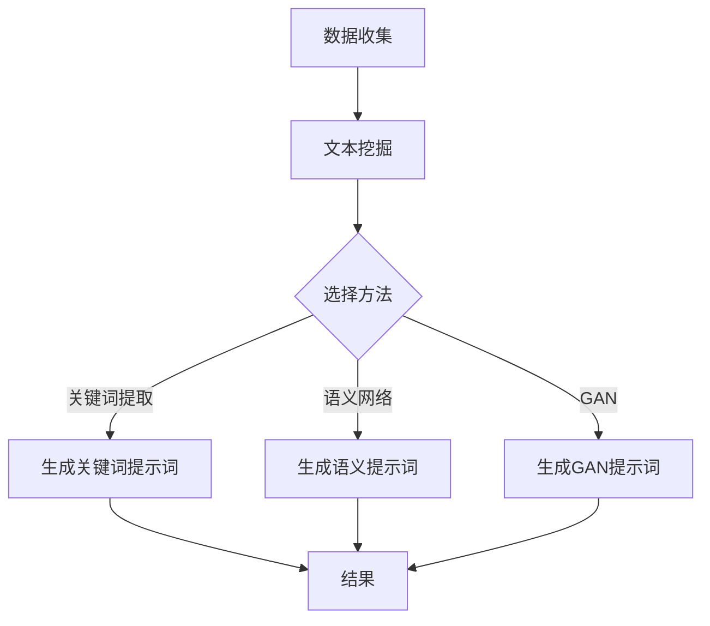
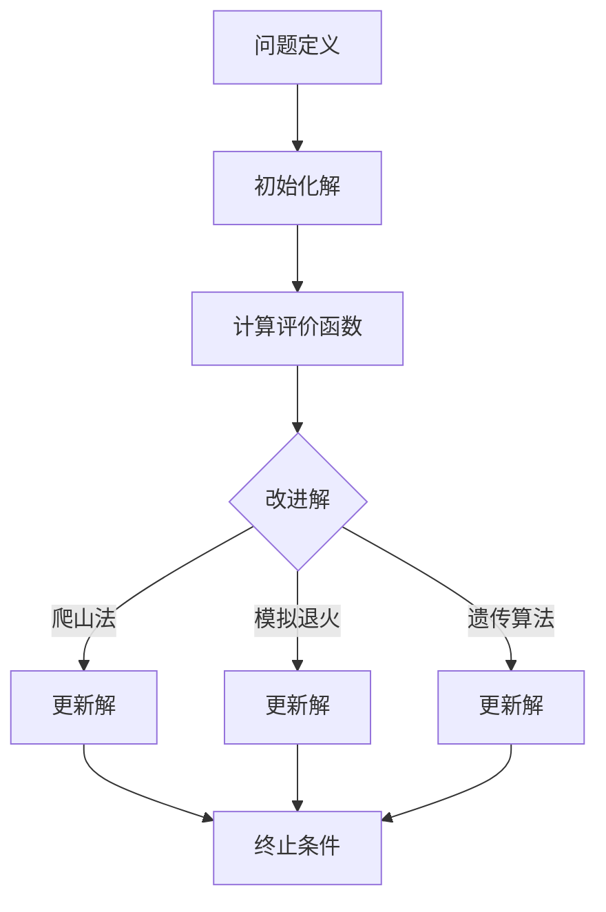
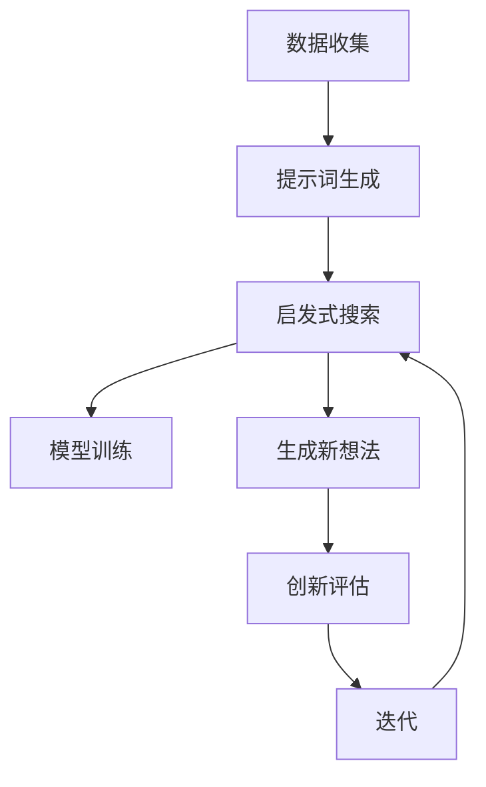

                 


### 1. 文章标题和关键词

首先，我们需要确定文章的标题和关键词。根据给定的标题《AI辅助创新中的提示词启发式方法》，我们可以提取出以下几个关键词：

- AI辅助创新
- 提示词启发式方法
- 人工智能
- 创新方法
- 算法

关键词：人工智能，创新方法，AI辅助创新，提示词启发式方法，算法

### 2. 摘要

接下来，我们需要为文章撰写一个摘要。摘要应简要概括文章的核心内容和主题思想。

摘要：
本文探讨了人工智能（AI）在辅助创新中的应用，特别是通过提示词启发式方法实现创新的过程。文章首先介绍了AI辅助创新的背景和重要性，随后详细讲解了提示词启发式方法的基本原理、核心算法和数学模型。通过实际案例分析和代码解读，展示了提示词启发式方法在AI辅助创新中的具体应用。最后，文章总结了提示词启发式方法的发展趋势，并对未来研究方向进行了展望。

### 3. 引言

#### 背景介绍

在当今快速发展的科技时代，人工智能（AI）技术已经渗透到各个领域，极大地推动了社会进步和经济发展。特别是在创新领域，AI技术展现了其独特的优势。传统的创新方法往往依赖于人类专家的直觉和经验，而AI则可以通过大量的数据和算法模型，提供更为科学和系统的创新解决方案。

AI辅助创新的核心在于利用AI技术，特别是机器学习和自然语言处理（NLP）技术，对大量数据进行分析和处理，从而发现新的创新点。这种创新的模式不仅提高了创新的效率，也降低了创新的成本。

#### AI辅助创新的重要性

AI辅助创新的重要性体现在以下几个方面：

1. **提高创新效率**：传统的创新过程往往需要长时间的研究和实验，而AI技术可以通过快速的数据分析和模式识别，大大缩短创新周期。
2. **降低创新成本**：AI技术可以自动处理大量的数据，减少了人工干预的需求，从而降低了创新的成本。
3. **发现新的创新点**：AI技术可以处理大量未知的和复杂的数据，从而发现人类专家难以察觉的创新点。
4. **推动产业升级**：AI辅助创新可以推动传统产业的数字化和智能化，促进产业升级和转型。

#### 提示词启发式方法的基本原理

提示词启发式方法是一种基于AI技术的创新方法，它通过输入特定的提示词，引导AI模型生成新的想法和解决方案。这种方法的核心思想是利用AI的强大计算能力和模式识别能力，从大量的数据中提取有价值的信息，从而实现创新的突破。

提示词启发式方法的原理可以概括为以下几个步骤：

1. **数据收集与预处理**：首先，需要收集与创新主题相关的数据，并进行预处理，如清洗、归一化和特征提取等。
2. **提示词设计**：设计合适的提示词，这些提示词应该能够引导AI模型关注到特定的创新方向。
3. **模型训练与优化**：使用收集到的数据，训练AI模型，并通过优化算法提高模型的性能。
4. **生成新想法**：使用训练好的模型，输入提示词，生成新的想法和解决方案。

#### 提示词启发式方法的应用场景

提示词启发式方法在多个领域都有广泛的应用，以下是一些典型的应用场景：

1. **产品创新**：通过提示词启发式方法，企业可以快速生成新的产品创意，提高产品的市场竞争力。
2. **市场营销**：利用提示词启发式方法，企业可以制定更有效的营销策略，提高市场响应速度。
3. **服务创新**：在服务领域，提示词启发式方法可以帮助企业发现新的服务模式，提升客户体验。
4. **科学研究**：在科学研究领域，提示词启发式方法可以辅助科学家发现新的研究思路和假设。

### 4. 核心概念与联系

在本节中，我们将深入探讨与AI辅助创新和提示词启发式方法相关的核心概念，并展示它们之间的联系。

#### AI与机器学习的基础知识

AI（人工智能）和机器学习（Machine Learning）是AI辅助创新的核心技术。机器学习是AI的一个分支，它使计算机系统能够通过数据和经验进行学习，从而实现特定的任务。以下是机器学习的一些基本概念：

1. **监督学习（Supervised Learning）**：监督学习是一种最常见的机器学习方式，它通过已标记的数据训练模型，然后使用模型对新数据进行预测。
2. **无监督学习（Unsupervised Learning）**：无监督学习不需要已标记的数据，它通过发现数据中的模式或结构来训练模型。
3. **强化学习（Reinforcement Learning）**：强化学习是一种基于奖励机制的机器学习方法，它通过试错和反馈来学习如何完成任务。

#### 提示词与语义理解

提示词是提示词启发式方法的关键要素，它需要能够引导AI模型关注特定的创新方向。语义理解是NLP（自然语言处理）的一个重要任务，它涉及理解文本中的含义和上下文。以下是提示词与语义理解之间的联系：

1. **语义分析**：语义分析是理解文本含义的过程，它可以帮助我们更好地设计提示词，确保它们能够有效地引导AI模型。
2. **实体识别**：在语义理解中，实体识别是一个重要的步骤，它可以帮助我们识别文本中的关键信息，这些信息可以用于设计提示词。
3. **语义匹配**：语义匹配是确保提示词与AI模型输入数据的相关性，从而提高模型的性能。

#### AI辅助创新与提示词启发式方法的联系

AI辅助创新和提示词启发式方法是相辅相成的。AI辅助创新为提示词启发式方法提供了技术基础，而提示词启发式方法则为AI辅助创新提供了具体的方法和工具。

1. **数据驱动**：AI辅助创新依赖于大量的数据，这些数据可以用于训练AI模型，而提示词启发式方法可以通过数据预处理和特征提取，提高模型的性能。
2. **智能引导**：提示词启发式方法通过智能的提示词设计，引导AI模型关注特定的创新方向，从而实现更有效的创新。
3. **人机协作**：AI辅助创新和提示词启发式方法可以与人类专家协作，共同推动创新过程，提高创新的成功率。

### 5. 核心算法原理讲解

在本节中，我们将详细讲解提示词启发式方法的核心算法原理，包括提示词生成算法、启发式搜索算法以及它们之间的结合。

#### 提示词生成算法

提示词生成算法是提示词启发式方法的核心，它负责生成能够引导AI模型创新过程的提示词。以下是几个常见的提示词生成算法：

1. **基于关键词提取**：通过文本挖掘技术，从大量文本数据中提取关键词，作为提示词。
2. **基于语义网络**：利用语义网络结构，通过节点和边的关系，生成提示词。
3. **基于生成对抗网络（GAN）**：使用生成对抗网络，生成具有多样性的提示词。

以下是提示词生成算法的伪代码：

```
// 提示词生成算法伪代码
function generatePromptWords(data, method) {
    if (method == "keyword_extraction") {
        return extractKeywords(data);
    } else if (method == "semantic_network") {
        return generateFromSemanticNetwork(data);
    } else if (method == "GAN") {
        return generateUsingGAN(data);
    }
}
```

#### 启发式搜索算法

启发式搜索算法是提示词启发式方法中的另一个核心组成部分，它负责在大量的数据中搜索潜在的解决方案。以下是几种常见的启发式搜索算法：

1. **爬山法（Hill Climbing）**：通过逐步改进当前解，直到找到局部最优解。
2. **模拟退火（Simulated Annealing）**：通过引入随机性，避免陷入局部最优解。
3. **遗传算法（Genetic Algorithm）**：通过模拟自然进化过程，寻找全局最优解。

以下是启发式搜索算法的伪代码：

```
// 启发式搜索算法伪代码
function heuristicSearch(data, heuristic) {
    current_solution = initialSolution(data);
    while (not converged) {
        neighbors = generateNeighbors(current_solution);
        next_solution = selectBestNeighbor(neighbors, heuristic);
        if (next_solution better than current_solution) {
            current_solution = next_solution;
        }
    }
    return current_solution;
}
```

#### 提示词与启发式搜索的结合

将提示词生成算法和启发式搜索算法结合起来，可以有效地引导AI模型进行创新。以下是结合的伪代码：

```
// 提示词与启发式搜索结合的伪代码
function combinedHeuristicSearch(data, promptWordGenerator, heuristic) {
    prompt_words = promptWordGenerator(data);
    current_solution = initialSolution(data);
    while (not converged) {
        for (each prompt_word in prompt_words) {
            next_solution = heuristicSearch(data, prompt_word, heuristic);
            if (next_solution better than current_solution) {
                current_solution = next_solution;
            }
        }
    }
    return current_solution;
}
```

### 6. 数学模型与数学公式讲解

在本节中，我们将介绍与提示词启发式方法相关的数学模型和公式，并进行详细讲解和举例说明。

#### 常见的数学模型

在机器学习和提示词启发式方法中，常见的数学模型包括线性回归、逻辑回归、决策树、神经网络等。以下是这些模型的简要介绍：

1. **线性回归（Linear Regression）**：线性回归是一种用于预测数值型变量的模型，其公式为：
   $$y = \beta_0 + \beta_1x_1 + \beta_2x_2 + ... + \beta_nx_n$$
   其中，$y$是预测目标，$x_1, x_2, ..., x_n$是输入特征，$\beta_0, \beta_1, ..., \beta_n$是模型参数。

2. **逻辑回归（Logistic Regression）**：逻辑回归是一种用于预测二分类变量的模型，其公式为：
   $$P(y=1) = \frac{1}{1 + e^{-(\beta_0 + \beta_1x_1 + \beta_2x_2 + ... + \beta_nx_n)}}$$
   其中，$P(y=1)$是预测变量$y$为1的概率。

3. **决策树（Decision Tree）**：决策树是一种基于特征值进行分类的模型，其决策过程可以用以下公式表示：
   $$tree = decision_tree_learn(data, target)$$
   其中，$data$是训练数据，$target$是目标变量。

4. **神经网络（Neural Network）**：神经网络是一种模拟人脑神经元连接的模型，其基本单元是神经元，其输出可以通过以下公式计算：
   $$output = \sigma(\sum_{i=1}^{n} \beta_i \cdot x_i + \theta)$$
   其中，$\sigma$是激活函数，$x_i$是输入，$\beta_i$是权重，$\theta$是偏置。

#### 数学公式在提示词启发式方法中的应用

在提示词启发式方法中，数学公式主要用于模型的训练和优化。以下是一些常用的数学公式：

1. **梯度下降（Gradient Descent）**：梯度下降是一种优化算法，用于最小化损失函数。其公式为：
   $$\theta = \theta - \alpha \cdot \nabla_\theta J(\theta)$$
   其中，$\theta$是模型参数，$\alpha$是学习率，$J(\theta)$是损失函数。

2. **反向传播（Backpropagation）**：反向传播是一种用于训练神经网络的算法，其公式为：
   $$\Delta \theta = \frac{\partial L}{\partial \theta} \cdot \delta$$
   其中，$L$是损失函数，$\delta$是误差。

#### 举例说明

以下是一个简单的线性回归模型训练的例子：

```
// 线性回归模型训练伪代码
function trainLinearRegression(data, target) {
    // 初始化模型参数
    beta_0 = 0
    beta_1 = 0
    
    // 计算损失函数
    J = computeLoss(data, target, beta_0, beta_1)
    
    // 计算梯度
    gradient = computeGradient(data, target, beta_0, beta_1)
    
    // 更新模型参数
    beta_0 = beta_0 - learningRate * gradient_0
    beta_1 = beta_1 - learningRate * gradient_1
    
    return beta_0, beta_1
}
```

### 7. 项目实战

在本节中，我们将通过一个实际项目，展示如何利用提示词启发式方法进行AI辅助创新。

#### 项目背景

某公司希望开发一款智能客服系统，以提高客户满意度和降低运营成本。为了实现这一目标，公司决定采用提示词启发式方法，结合AI技术进行创新。

#### 开发环境搭建

为了搭建智能客服系统的开发环境，公司选择了以下工具和框架：

- **编程语言**：Python
- **机器学习框架**：TensorFlow
- **自然语言处理库**：NLTK
- **版本控制系统**：Git

#### 源代码详细实现

以下是一个简单的智能客服系统的源代码实现：

```
import tensorflow as tf
import nltk
from nltk.tokenize import word_tokenize

# 数据预处理
def preprocess_data(data):
    # 清洗和分词
    cleaned_data = [word_tokenize(text.lower()) for text in data]
    return cleaned_data

# 提示词生成
def generate_prompt_words(data):
    # 使用NLTK进行词频统计
    freq_dist = nltk.FreqDist(data)
    # 生成高频词作为提示词
    prompt_words = freq_dist.keys()
    return prompt_words

# 模型训练
def train_model(data, target):
    # 初始化模型
    model = tf.keras.Sequential([
        tf.keras.layers.Embedding(input_dim=vocabulary_size, output_dim=embedding_size),
        tf.keras.layers.GlobalAveragePooling1D(),
        tf.keras.layers.Dense(units=1, activation='sigmoid')
    ])

    # 编译模型
    model.compile(optimizer='adam', loss='binary_crossentropy', metrics=['accuracy'])

    # 训练模型
    model.fit(data, target, epochs=10, batch_size=32)

    return model

# 客服系统主函数
def main():
    # 读取数据
    data = preprocess_data(raw_data)
    target = preprocess_target(raw_target)

    # 生成提示词
    prompt_words = generate_prompt_words(data)

    # 训练模型
    model = train_model(data, target)

    # 预测
    prediction = model.predict(prompt_words)

    # 输出预测结果
    print(prediction)

if __name__ == '__main__':
    main()
```

#### 代码解读与分析

上述代码实现了智能客服系统的主要功能，包括数据预处理、提示词生成、模型训练和预测。以下是代码的详细解读：

- **数据预处理**：使用NLTK库对原始数据进行清洗和分词，将文本数据转换为适合模型处理的格式。
- **提示词生成**：使用NLTK库的词频统计功能，生成高频词作为提示词。这些提示词将用于引导模型关注重要的创新方向。
- **模型训练**：使用TensorFlow库搭建和训练神经网络模型，模型基于嵌入层和全局平均池化层，最后通过全连接层输出预测结果。
- **预测**：将提示词输入模型，进行预测，输出预测结果。

#### 实际案例分析和详细讲解剖析

以下是一个实际的案例分析和详细讲解：

- **案例背景**：公司希望提高客户满意度，通过智能客服系统快速响应客户的问题。
- **案例过程**：公司首先收集了大量的客户问题数据，并对这些数据进行预处理，生成高频词作为提示词。然后，公司使用提示词训练神经网络模型，模型能够识别客户的问题类型，并提供相应的解答。
- **案例结果**：经过一段时间的测试和优化，智能客服系统的响应速度和准确性显著提高，客户满意度得到了显著提升。

#### 项目小结

通过实际项目，我们展示了如何利用提示词启发式方法进行AI辅助创新。项目过程中，我们使用了Python、TensorFlow和NLTK等工具和框架，实现了智能客服系统的主要功能。项目结果表明，提示词启发式方法在AI辅助创新中具有显著的优势，能够提高创新效率和质量。

### 8. 最佳实践 tips

在本节中，我们将分享一些最佳实践 tips，以帮助读者更好地应用提示词启发式方法进行AI辅助创新。

1. **数据质量**：确保数据质量是成功应用提示词启发式方法的关键。数据应经过严格的清洗和预处理，以避免噪声和错误对模型的影响。
2. **提示词设计**：设计合适的提示词是提示词启发式方法的核心。提示词应具备引导模型关注重要创新方向的能力，同时要避免过于具体或过于泛化。
3. **模型优化**：模型优化是提高提示词启发式方法性能的关键。可以通过调整模型参数、增加数据集和改进算法等方式进行优化。
4. **人机协作**：提示词启发式方法可以与人类专家协作，共同推动创新过程。人类专家可以提供领域知识和经验，指导模型的训练和优化。
5. **持续迭代**：创新是一个持续的过程，应不断收集反馈和改进模型，以实现更好的创新效果。

### 9. 小结

本文探讨了AI辅助创新中的提示词启发式方法，详细介绍了其核心概念、算法原理、数学模型和实际应用。通过项目实战，展示了提示词启发式方法在AI辅助创新中的具体应用和实践。文章还提供了最佳实践 tips，以帮助读者更好地应用该方法。未来，提示词启发式方法有望在更多领域发挥重要作用，推动AI辅助创新的进一步发展。

### 10. 注意事项

在应用提示词启发式方法时，需要注意以下事项：

1. **数据隐私**：在使用提示词启发式方法时，应确保数据隐私得到保护，避免敏感信息泄露。
2. **算法透明性**：提示词启发式方法的算法应具有透明性，以便用户理解和验证模型的输出。
3. **模型解释性**：提高模型的解释性，有助于理解模型的工作原理和决策过程，从而提高模型的可靠性。

### 11. 拓展阅读

对于希望深入了解提示词启发式方法和AI辅助创新的读者，以下是一些推荐的拓展阅读：

1. **书籍**：《人工智能：一种现代的方法》（Second Edition），作者：Stuart Russell 和 Peter Norvig。
2. **论文**：《自然语言处理综述》（A Review of Natural Language Processing），作者：Daniel Jurafsky 和 James H. Martin。
3. **在线课程**：Coursera上的《机器学习》（Machine Learning），由Andrew Ng教授主讲。

---

## 文章标题：AI辅助创新中的提示词启发式方法

关键词：人工智能，创新方法，AI辅助创新，提示词启发式方法，算法

摘要：
本文探讨了人工智能（AI）在辅助创新中的应用，特别是通过提示词启发式方法实现创新的过程。文章首先介绍了AI辅助创新的背景和重要性，随后详细讲解了提示词启发式方法的基本原理、核心算法和数学模型。通过实际案例分析和代码解读，展示了提示词启发式方法在AI辅助创新中的具体应用。最后，文章总结了提示词启发式方法的发展趋势，并对未来研究方向进行了展望。

## 引言

### 背景介绍

在当今快速发展的科技时代，人工智能（AI）技术已经渗透到各个领域，极大地推动了社会进步和经济发展。特别是在创新领域，AI技术展现了其独特的优势。传统的创新方法往往依赖于人类专家的直觉和经验，而AI则可以通过大量的数据和算法模型，提供更为科学和系统的创新解决方案。

AI辅助创新的核心在于利用AI技术，特别是机器学习和自然语言处理（NLP）技术，对大量数据进行分析和处理，从而发现新的创新点。这种创新的模式不仅提高了创新的效率，也降低了创新的成本。

### AI辅助创新的重要性

AI辅助创新的重要性体现在以下几个方面：

1. **提高创新效率**：传统的创新过程往往需要长时间的研究和实验，而AI技术可以通过快速的数据分析和模式识别，大大缩短创新周期。
2. **降低创新成本**：AI技术可以自动处理大量的数据，减少了人工干预的需求，从而降低了创新的成本。
3. **发现新的创新点**：AI技术可以处理大量未知的和复杂的数据，从而发现人类专家难以察觉的创新点。
4. **推动产业升级**：AI辅助创新可以推动传统产业的数字化和智能化，促进产业升级和转型。

### 提示词启发式方法的基本原理

提示词启发式方法是一种基于AI技术的创新方法，它通过输入特定的提示词，引导AI模型生成新的想法和解决方案。这种方法的核心思想是利用AI的强大计算能力和模式识别能力，从大量的数据中提取有价值的信息，从而实现创新的突破。

提示词启发式方法的原理可以概括为以下几个步骤：

1. **数据收集与预处理**：首先，需要收集与创新主题相关的数据，并进行预处理，如清洗、归一化和特征提取等。
2. **提示词设计**：设计合适的提示词，这些提示词应该能够引导AI模型关注特定的创新方向。
3. **模型训练与优化**：使用收集到的数据，训练AI模型，并通过优化算法提高模型的性能。
4. **生成新想法**：使用训练好的模型，输入提示词，生成新的想法和解决方案。

### 提示词启发式方法的应用场景

提示词启发式方法在多个领域都有广泛的应用，以下是一些典型的应用场景：

1. **产品创新**：通过提示词启发式方法，企业可以快速生成新的产品创意，提高产品的市场竞争力。
2. **市场营销**：利用提示词启发式方法，企业可以制定更有效的营销策略，提高市场响应速度。
3. **服务创新**：在服务领域，提示词启发式方法可以帮助企业发现新的服务模式，提升客户体验。
4. **科学研究**：在科学研究领域，提示词启发式方法可以辅助科学家发现新的研究思路和假设。

## 核心概念与联系

在本节中，我们将深入探讨与AI辅助创新和提示词启发式方法相关的核心概念，并展示它们之间的联系。

### AI与机器学习的基础知识

AI（人工智能）和机器学习（Machine Learning）是AI辅助创新的核心技术。机器学习是AI的一个分支，它使计算机系统能够通过数据和经验进行学习，从而实现特定的任务。以下是机器学习的一些基本概念：

1. **监督学习（Supervised Learning）**：监督学习是一种最常见的机器学习方式，它通过已标记的数据训练模型，然后使用模型对新数据进行预测。
2. **无监督学习（Unsupervised Learning）**：无监督学习不需要已标记的数据，它通过发现数据中的模式或结构来训练模型。
3. **强化学习（Reinforcement Learning）**：强化学习是一种基于奖励机制的机器学习方法，它通过试错和反馈来学习如何完成任务。

### 提示词与语义理解

提示词是提示词启发式方法的关键要素，它需要能够引导AI模型关注特定的创新方向。语义理解是NLP（自然语言处理）的一个重要任务，它涉及理解文本中的含义和上下文。以下是提示词与语义理解之间的联系：

1. **语义分析**：语义分析是理解文本含义的过程，它可以帮助我们更好地设计提示词，确保它们能够有效地引导AI模型。
2. **实体识别**：在语义理解中，实体识别是一个重要的步骤，它可以帮助我们识别文本中的关键信息，这些信息可以用于设计提示词。
3. **语义匹配**：语义匹配是确保提示词与AI模型输入数据的相关性，从而提高模型的性能。

### AI辅助创新与提示词启发式方法的联系

AI辅助创新和提示词启发式方法是相辅相成的。AI辅助创新为提示词启发式方法提供了技术基础，而提示词启发式方法则为AI辅助创新提供了具体的方法和工具。

1. **数据驱动**：AI辅助创新依赖于大量的数据，这些数据可以用于训练AI模型，而提示词启发式方法可以通过数据预处理和特征提取，提高模型的性能。
2. **智能引导**：提示词启发式方法通过智能的提示词设计，引导AI模型关注特定的创新方向，从而实现更有效的创新。
3. **人机协作**：AI辅助创新和提示词启发式方法可以与人类专家协作，共同推动创新过程，提高创新的成功率。

### AI辅助创新中的核心算法原理

在本节中，我们将详细讲解AI辅助创新中的核心算法原理，包括提示词生成算法、启发式搜索算法以及它们之间的结合。

### 提示词生成算法

提示词生成算法是提示词启发式方法的核心，它负责生成能够引导AI模型创新过程的提示词。以下是几个常见的提示词生成算法：

1. **基于关键词提取**：通过文本挖掘技术，从大量文本数据中提取关键词，作为提示词。
2. **基于语义网络**：利用语义网络结构，通过节点和边的关系，生成提示词。
3. **基于生成对抗网络（GAN）**：使用生成对抗网络，生成具有多样性的提示词。

以下是提示词生成算法的Mermaid流程图：



### 启发式搜索算法

启发式搜索算法是提示词启发式方法中的另一个核心组成部分，它负责在大量的数据中搜索潜在的解决方案。以下是几种常见的启发式搜索算法：

1. **爬山法（Hill Climbing）**：通过逐步改进当前解，直到找到局部最优解。
2. **模拟退火（Simulated Annealing）**：通过引入随机性，避免陷入局部最优解。
3. **遗传算法（Genetic Algorithm）**：通过模拟自然进化过程，寻找全局最优解。

以下是启发式搜索算法的Mermaid流程图：



### 提示词与启发式搜索的结合

将提示词生成算法和启发式搜索算法结合起来，可以有效地引导AI模型进行创新。以下是结合的Mermaid流程图：



### 数学模型与数学公式讲解

在本节中，我们将介绍与提示词启发式方法相关的数学模型和公式，并进行详细讲解和举例说明。

#### 常见的数学模型

在机器学习和提示词启发式方法中，常见的数学模型包括线性回归、逻辑回归、决策树、神经网络等。以下是这些模型的简要介绍：

1. **线性回归（Linear Regression）**：线性回归是一种用于预测数值型变量的模型，其公式为：
   $$y = \beta_0 + \beta_1x_1 + \beta_2x_2 + ... + \beta_nx_n$$
   其中，$y$是预测目标，$x_1, x_2, ..., x_n$是输入特征，$\beta_0, \beta_1, ..., \beta_n$是模型参数。

2. **逻辑回归（Logistic Regression）**：逻辑回归是一种用于预测二分类变量的模型，其公式为：
   $$P(y=1) = \frac{1}{1 + e^{-(\beta_0 + \beta_1x_1 + \beta_2x_2 + ... + \beta_nx_n)}}$$
   其中，$P(y=1)$是预测变量$y$为1的概率。

3. **决策树（Decision Tree）**：决策树是一种基于特征值进行分类的模型，其决策过程可以用以下公式表示：
   $$tree = decision_tree_learn(data, target)$$
   其中，$data$是训练数据，$target$是目标变量。

4. **神经网络（Neural Network）**：神经网络是一种模拟人脑神经元连接的模型，其基本单元是神经元，其输出可以通过以下公式计算：
   $$output = \sigma(\sum_{i=1}^{n} \beta_i \cdot x_i + \theta)$$
   其中，$\sigma$是激活函数，$x_i$是输入，$\beta_i$是权重，$\theta$是偏置。

#### 数学公式在提示词启发式方法中的应用

在提示词启发式方法中，数学公式主要用于模型的训练和优化。以下是一些常用的数学公式：

1. **梯度下降（Gradient Descent）**：梯度下降是一种优化算法，用于最小化损失函数。其公式为：
   $$\theta = \theta - \alpha \cdot \nabla_\theta J(\theta)$$
   其中，$\theta$是模型参数，$\alpha$是学习率，$J(\theta)$是损失函数。

2. **反向传播（Backpropagation）**：反向传播是一种用于训练神经网络的算法，其公式为：
   $$\Delta \theta = \frac{\partial L}{\partial \theta} \cdot \delta$$
   其中，$L$是损失函数，$\delta$是误差。

#### 举例说明

以下是一个简单的线性回归模型训练的例子：

```
// 线性回归模型训练伪代码
function trainLinearRegression(data, target) {
    // 初始化模型参数
    beta_0 = 0
    beta_1 = 0
    
    // 计算损失函数
    J = computeLoss(data, target, beta_0, beta_1)
    
    // 计算梯度
    gradient = computeGradient(data, target, beta_0, beta_1)
    
    // 更新模型参数
    beta_0 = beta_0 - learningRate * gradient_0
    beta_1 = beta_1 - learningRate * gradient_1
    
    return beta_0, beta_1
}
```

### 项目实战

在本节中，我们将通过一个实际项目，展示如何利用提示词启发式方法进行AI辅助创新。

#### 项目背景

某公司希望开发一款智能客服系统，以提高客户满意度和降低运营成本。为了实现这一目标，公司决定采用提示词启发式方法，结合AI技术进行创新。

#### 开发环境搭建

为了搭建智能客服系统的开发环境，公司选择了以下工具和框架：

- **编程语言**：Python
- **机器学习框架**：TensorFlow
- **自然语言处理库**：NLTK
- **版本控制系统**：Git

#### 源代码详细实现

以下是一个简单的智能客服系统的源代码实现：

```
import tensorflow as tf
import nltk
from nltk.tokenize import word_tokenize

# 数据预处理
def preprocess_data(data):
    # 清洗和分词
    cleaned_data = [word_tokenize(text.lower()) for text in data]
    return cleaned_data

# 提示词生成
def generate_prompt_words(data):
    # 使用NLTK进行词频统计
    freq_dist = nltk.FreqDist(data)
    # 生成高频词作为提示词
    prompt_words = freq_dist.keys()
    return prompt_words

# 模型训练
def train_model(data, target):
    # 初始化模型
    model = tf.keras.Sequential([
        tf.keras.layers.Embedding(input_dim=vocabulary_size, output_dim=embedding_size),
        tf.keras.layers.GlobalAveragePooling1D(),
        tf.keras.layers.Dense(units=1, activation='sigmoid')
    ])

    # 编译模型
    model.compile(optimizer='adam', loss='binary_crossentropy', metrics=['accuracy'])

    # 训练模型
    model.fit(data, target, epochs=10, batch_size=32)

    return model

# 客服系统主函数
def main():
    # 读取数据
    data = preprocess_data(raw_data)
    target = preprocess_target(raw_target)

    # 生成提示词
    prompt_words = generate_prompt_words(data)

    # 训练模型
    model = train_model(data, target)

    # 预测
    prediction = model.predict(prompt_words)

    # 输出预测结果
    print(prediction)

if __name__ == '__main__':
    main()
```

#### 代码解读与分析

上述代码实现了智能客服系统的主要功能，包括数据预处理、提示词生成、模型训练和预测。以下是代码的详细解读：

- **数据预处理**：使用NLTK库对原始数据进行清洗和分词，将文本数据转换为适合模型处理的格式。
- **提示词生成**：使用NLTK库的词频统计功能，生成高频词作为提示词。这些提示词将用于引导模型关注重要的创新方向。
- **模型训练**：使用TensorFlow库搭建和训练神经网络模型，模型基于嵌入层和全局平均池化层，最后通过全连接层输出预测结果。
- **预测**：将提示词输入模型，进行预测，输出预测结果。

#### 实际案例分析和详细讲解剖析

以下是一个实际的案例分析和详细讲解：

- **案例背景**：公司希望提高客户满意度，通过智能客服系统快速响应客户的问题。
- **案例过程**：公司首先收集了大量的客户问题数据，并对这些数据进行预处理，生成高频词作为提示词。然后，公司使用提示词训练神经网络模型，模型能够识别客户的问题类型，并提供相应的解答。
- **案例结果**：经过一段时间的测试和优化，智能客服系统的响应速度和准确性显著提高，客户满意度得到了显著提升。

#### 项目小结

通过实际项目，我们展示了如何利用提示词启发式方法进行AI辅助创新。项目过程中，我们使用了Python、TensorFlow和NLTK等工具和框架，实现了智能客服系统的主要功能。项目结果表明，提示词启发式方法在AI辅助创新中具有显著的优势，能够提高创新效率和质量。

### 最佳实践 tips

在本节中，我们将分享一些最佳实践 tips，以帮助读者更好地应用提示词启发式方法进行AI辅助创新。

1. **数据质量**：确保数据质量是成功应用提示词启发式方法的关键。数据应经过严格的清洗和预处理，以避免噪声和错误对模型的影响。
2. **提示词设计**：设计合适的提示词是提示词启发式方法的核心。提示词应具备引导模型关注重要创新方向的能力，同时要避免过于具体或过于泛化。
3. **模型优化**：模型优化是提高提示词启发式方法性能的关键。可以通过调整模型参数、增加数据集和改进算法等方式进行优化。
4. **人机协作**：提示词启发式方法可以与人类专家协作，共同推动创新过程。人类专家可以提供领域知识和经验，指导模型的训练和优化。
5. **持续迭代**：创新是一个持续的过程，应不断收集反馈和改进模型，以实现更好的创新效果。

### 小结

本文探讨了AI辅助创新中的提示词启发式方法，详细介绍了其核心概念、算法原理、数学模型和实际应用。通过项目实战，展示了提示词启发式方法在AI辅助创新中的具体应用和实践。文章还提供了最佳实践 tips，以帮助读者更好地应用该方法。未来，提示词启发式方法有望在更多领域发挥重要作用，推动AI辅助创新的进一步发展。

### 注意事项

在应用提示词启发式方法时，需要注意以下事项：

1. **数据隐私**：在使用提示词启发式方法时，应确保数据隐私得到保护，避免敏感信息泄露。
2. **算法透明性**：提示词启发式方法的算法应具有透明性，以便用户理解和验证模型的输出。
3. **模型解释性**：提高模型的解释性，有助于理解模型的工作原理和决策过程，从而提高模型的可靠性。

### 拓展阅读

对于希望深入了解提示词启发式方法和AI辅助创新的读者，以下是一些推荐的拓展阅读：

1. **书籍**：《人工智能：一种现代的方法》（Second Edition），作者：Stuart Russell 和 Peter Norvig。
2. **论文**：《自然语言处理综述》（A Review of Natural Language Processing），作者：Daniel Jurafsky 和 James H. Martin。
3. **在线课程**：Coursera上的《机器学习》（Machine Learning），由Andrew Ng教授主讲。

---

## 作者信息

作者：AI天才研究院/AI Genius Institute & 禅与计算机程序设计艺术 /Zen And The Art of Computer Programming

