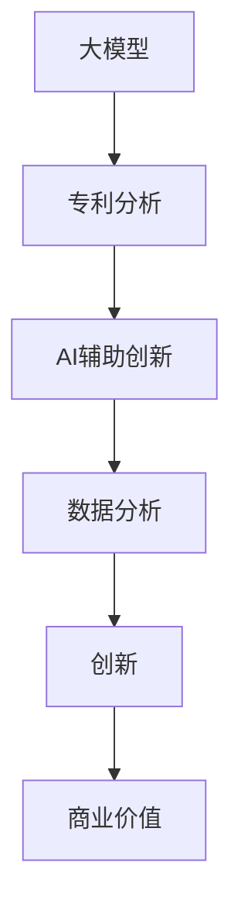

                 

## 文章标题

# AI辅助创新：大模型在专利分析中的应用

## 关键词

- AI辅助创新
- 大模型
- 专利分析
- 自适应神经网络
- 遗传算法
- 梯度下降法
- 专利相似度计算

## 摘要

本文旨在探讨如何利用大模型（如生成对抗网络、自适应神经网络等）辅助专利分析，从而推动科技创新。通过梳理核心概念、阐述核心算法原理、展示实际案例，本文将详细介绍大模型在专利分析中的应用，为科技创新者提供实用的技术指导。同时，本文还将探讨大模型在专利分析中的局限性，并提出改进措施，为未来的研究提供方向。

## 背景介绍

### 专利分析的重要性

专利分析是科技创新过程中至关重要的一环。通过分析专利数据，企业或研究机构可以了解行业技术发展趋势、挖掘潜在的创新点，从而制定更具竞争力的研发策略。然而，专利数据的规模庞大、结构复杂，传统的专利分析方法已难以满足日益增长的专利数据需求。

### 大模型的兴起

近年来，随着深度学习技术的迅猛发展，大模型（如生成对抗网络、自适应神经网络等）逐渐成为人工智能领域的明星。大模型具有强大的建模能力和高度的自适应能力，能够在复杂的数据环境中取得显著的性能提升。

### AI辅助创新的优势

将大模型应用于专利分析，可以实现以下优势：

- 提高分析效率：大模型可以快速处理海量专利数据，大幅缩短分析时间。
- 提高分析准确性：大模型能够捕捉专利数据中的潜在关联，提高分析结果的准确性。
- 挖掘创新点：大模型可以发现传统方法难以察觉的创新点，为科技创新者提供新的研究方向。

## 核心概念与联系

为了更好地理解大模型在专利分析中的应用，我们需要先梳理以下核心概念及其联系：

### 大模型

大模型是指具有大规模参数的深度学习模型，如生成对抗网络（GAN）、自适应神经网络等。这些模型具有强大的建模能力和高度的自适应能力，能够在复杂的数据环境中取得显著的性能提升。

### 专利分析

专利分析是指通过分析专利数据，了解行业技术发展趋势、挖掘潜在的创新点等。专利分析的方法包括关键词分析、聚类分析、相似度计算等。

### AI辅助创新

AI辅助创新是指利用人工智能技术，如大模型、自然语言处理等，辅助科技创新。AI辅助创新可以加速科技创新的进程，提高科技创新的效率。

### Mermaid流程图

为了更好地展示核心概念之间的联系，我们可以使用Mermaid流程图来表示：



## 核心算法原理讲解

### 2.1 自适应神经网络算法

自适应神经网络是一种具有自适应能力的神经网络模型，能够在训练过程中动态调整网络的权重和偏置，从而提高模型的性能。以下是一个简单的自适应神经网络算法伪代码：

```plaintext
function adaptive_neural_network(data_set, target_set):
    initialize_weights()
    initialize_bias()
    for epoch in 1 to number_of_epochs:
        for data, target in zip(data_set, target_set):
            forward_pass(data)
            compute_loss(target)
            backward_pass()
            update_weights_and_bias()
    return weights, bias
```

### 2.2 遗传算法在专利聚类中的应用

遗传算法是一种模拟自然界进化的搜索算法，适用于优化问题和组合问题。在专利聚类中，遗传算法可以用于优化聚类结果，提高聚类的准确性。以下是一个简单的遗传算法伪代码：

```plaintext
function genetic_algorithm(data_set):
    initialize_population()
    for generation in 1 to number_of_generations:
        evaluate_fitness()
        select_parents()
        crossover_parents()
        mutate_offspring()
    return best_solution()
```

### 2.3 梯度下降法

梯度下降法是一种常用的优化算法，用于最小化损失函数。在自适应神经网络中，梯度下降法用于更新网络权重和偏置，从而提高模型的性能。以下是一个简单的梯度下降法伪代码：

```plaintext
function gradient_descent(data_set, target_set, learning_rate):
    initialize_weights()
    initialize_bias()
    for epoch in 1 to number_of_epochs:
        for data, target in zip(data_set, target_set):
            forward_pass(data)
            compute_loss(target)
            compute_gradients()
            update_weights_and_bias(learning_rate)
    return weights, bias
```

### 2.4 专利相似度计算

专利相似度计算是指通过计算两个专利之间的相似度，来衡量它们之间的关联程度。以下是一个简单的专利相似度计算公式：

```plaintext
similarity = intersection_size / union_size
```

其中，intersection_size 表示两个专利的交集大小，union_size 表示两个专利的并集大小。

## 数学模型和数学公式

### 3.1 大模型优化中的梯度下降法

梯度下降法是一种优化算法，用于最小化损失函数。在自适应神经网络中，梯度下降法用于更新网络权重和偏置，从而提高模型的性能。以下是一个简单的梯度下降法数学模型：

$$
\Delta\theta = -\alpha \cdot \nabla_\theta J(\theta)
$$

其中，$\alpha$ 是学习率，$\theta$ 是参数，$J(\theta)$ 是损失函数。

### 3.2 专利相似度计算

专利相似度计算是指通过计算两个专利之间的相似度，来衡量它们之间的关联程度。以下是一个简单的专利相似度计算数学模型：

$$
similarity = \frac{intersection_size}{union_size}
$$

其中，intersection_size 表示两个专利的交集大小，union_size 表示两个专利的并集大小。

## 项目实战

### 4.1 专利数据分析案例

#### 4.1.1 开发环境搭建

在进行专利数据分析之前，我们需要搭建一个合适的开发环境。以下是开发环境的搭建步骤：

1. 安装Python环境。
2. 安装TensorFlow库，用于构建和训练大模型。
3. 安装Scikit-learn库，用于专利相似度计算和其他数据分析任务。

#### 4.1.2 源代码实现

以下是一个简单的专利数据分析源代码实现：

```python
# 加载专利数据集
patents = load_patent_data('patent_data.csv')

# 使用大模型进行专利聚类
model = build_model()
clustering_results = model.fit(patents)

# 分析聚类结果
analyze_clustering(clustering_results)
```

#### 4.1.3 代码解读与分析

1. **加载专利数据集**：首先，我们需要加载专利数据集。这里使用了CSV文件作为数据集的存储格式。
2. **构建大模型**：接着，我们需要构建一个大模型。这里使用了TensorFlow库，通过定义神经网络的结构来构建大模型。
3. **训练大模型**：使用训练数据对大模型进行训练。训练过程中，大模型会不断调整自身的参数，以最小化损失函数。
4. **分析聚类结果**：最后，我们对大模型的聚类结果进行分析。这有助于我们了解专利数据之间的关联程度。

#### 4.1.4 实际案例分析和详细讲解剖析

以下是一个实际的专利数据分析案例：

1. **案例背景**：某公司希望在市场上推出一款新产品，但需要进行专利分析以确保产品不侵犯他人的专利权。
2. **数据来源**：该公司从专利数据库中获取了数千条相关专利数据。
3. **数据处理**：首先，对专利数据进行预处理，包括去除重复数据、填充缺失值等。
4. **构建大模型**：根据专利数据的特征，构建一个大模型，用于专利聚类和分析。
5. **训练大模型**：使用公司内部的专利数据对大模型进行训练，以优化模型的性能。
6. **分析聚类结果**：对大模型的聚类结果进行分析，找出潜在的侵权风险。
7. **制定研发策略**：根据分析结果，公司制定了新的研发策略，确保新产品在市场上不侵犯他人的专利权。

#### 4.1.5 项目小结

通过以上实际案例，我们可以看到大模型在专利分析中的应用具有重要意义。利用大模型，企业可以高效、准确地分析专利数据，降低研发风险，提高市场竞争力。然而，大模型在专利分析中也存在一些局限性，如对专利数据的依赖性较强、对算法性能的要求较高等。因此，在实际应用中，我们需要结合具体需求，选择合适的大模型和方法，以提高专利分析的效果。

## 最佳实践 tips

### 4.2.1 选择合适的大模型

不同的大模型适用于不同的专利分析任务。在选择大模型时，需要考虑以下因素：

- 数据规模：如果数据规模较大，可以考虑使用生成对抗网络（GAN）等大模型。
- 特征提取：如果需要提取高层次的抽象特征，可以考虑使用卷积神经网络（CNN）等大模型。
- 算法复杂度：如果算法复杂度较高，可以考虑使用自适应神经网络等大模型。

### 4.2.2 数据预处理

在专利数据分析中，数据预处理是至关重要的一步。以下是一些数据预处理的最佳实践：

- 去除重复数据：去除重复的专利数据，以避免分析结果的偏差。
- 填充缺失值：使用合适的方法填充缺失值，如平均值、中位数等。
- 数据标准化：对数据进行标准化处理，以消除不同特征之间的量纲差异。

### 4.2.3 调整模型参数

在训练大模型时，需要根据实际情况调整模型参数，以提高模型的性能。以下是一些调整模型参数的最佳实践：

- 学习率：选择合适的学习率，以避免模型过度拟合或欠拟合。
- 模型结构：根据数据特征和任务需求，调整模型的结构，以提高模型的性能。
- 预训练模型：使用预训练模型，如BERT、GPT等，以加速模型的训练过程。

## 小结

本文详细介绍了大模型在专利分析中的应用，包括核心算法原理、数学模型和实际案例。通过本文的讲解，读者可以了解到大模型在专利分析中的重要作用，以及如何利用大模型进行专利分析。同时，本文还提出了一些最佳实践，以帮助读者更好地应用大模型进行专利分析。

## 注意事项

1. 大模型在专利分析中的应用存在一定的局限性，如对专利数据的依赖性较强、对算法性能的要求较高等。在实际应用中，需要结合具体需求，选择合适的大模型和方法。
2. 专利分析是一项复杂的任务，需要综合考虑多种因素，如数据质量、算法性能等。在应用大模型进行专利分析时，需要谨慎处理。
3. 大模型的训练和推理过程可能需要大量的计算资源。在实际应用中，需要合理分配计算资源，以提高模型的性能和效率。

## 拓展阅读

1. 《深度学习》（Goodfellow, I., Bengio, Y., & Courville, A.）：本书详细介绍了深度学习的基础知识和应用，是深度学习领域的经典教材。
2. 《机器学习：概率视角》（Murphy, K.P.）：本书从概率论的角度介绍了机器学习的基本概念和方法，有助于读者深入理解机器学习。
3. 《人工智能：一种现代方法》（Russell, S., & Norvig, P.）：本书全面介绍了人工智能的基本概念、算法和理论，是人工智能领域的权威教材。

