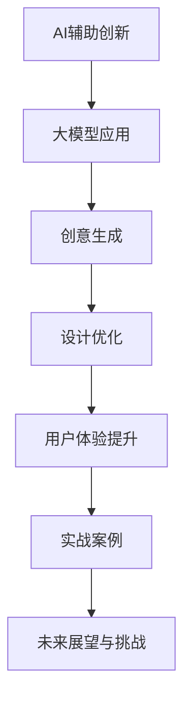
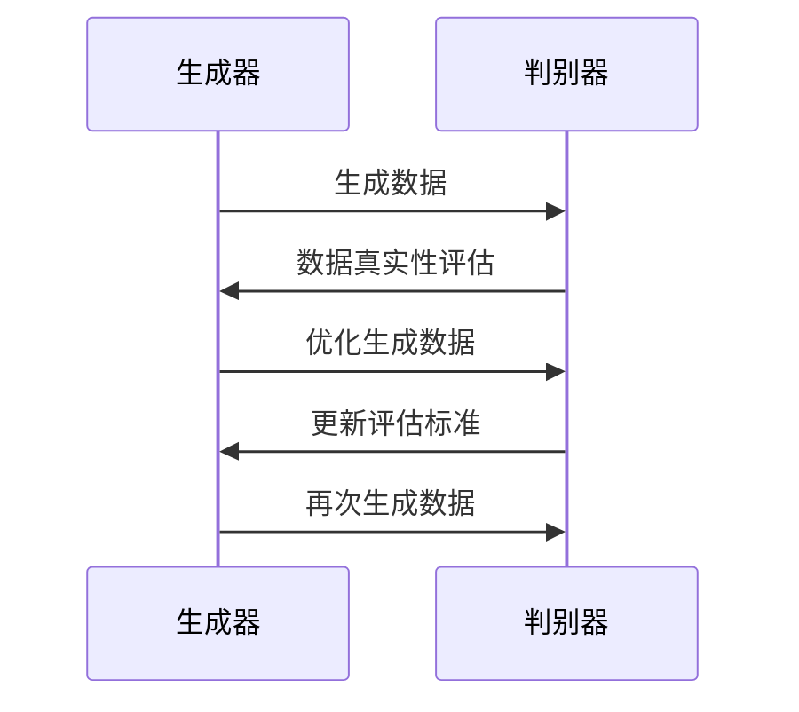

                 


### 概述与背景介绍

#### 1. AI与产品设计的融合

人工智能（AI）作为21世纪最具变革性的技术之一，正在深刻改变各行各业的运作方式。在产品设计领域，AI的应用尤为广泛，它不仅提高了设计的效率，还大大增强了产品的创新性和用户满意度。大模型，作为AI的一个重要分支，以其强大的数据处理和智能分析能力，正在逐步成为产品设计过程中的核心辅助工具。

#### 2. 大模型在产品设计中的应用

大模型，通常指的是具有极高参数量、能够处理海量数据且具备深度学习能力的神经网络模型。这些模型通过大量的数据训练，能够模拟人类的思维方式，从而在创意生成、设计优化、用户体验等方面发挥重要作用。例如，生成对抗网络（GANs）可以在设计初期生成大量的创意设计方案，深度强化学习可以优化产品设计的迭代过程，自然语言处理（NLP）可以提升用户体验的设计与评估。

#### 3. 本文结构

本文将首先介绍AI辅助创新的基本概念和原理，接着详细讲解大模型的核心概念和工作原理，然后探讨大模型在产品设计中的具体应用场景，通过实际案例展示大模型的应用效果，并最后对未来展望和挑战进行探讨。希望通过这篇文章，读者能够对AI辅助创新有更加深入的理解，并能够在实际工作中运用大模型的力量提升产品设计能力。

## 关键词

AI辅助创新，大模型，产品设计，神经网络，生成对抗网络，深度强化学习，自然语言处理，用户体验。

## 摘要

本文旨在探讨人工智能大模型在产品设计中的应用，介绍AI辅助创新的基本概念和原理，详细讲解大模型的核心概念和工作原理，分析大模型在创意生成、设计优化和用户体验提升等方面的具体应用场景。通过实际案例，展示大模型在产品设计中的效果，并对未来发展方向和面临的挑战进行展望。本文旨在为设计师和AI开发者提供理论指导和实践参考。

### 引言与概述

#### 1. AI辅助创新的概念

AI辅助创新指的是利用人工智能技术，尤其是大模型，来辅助人类进行创新活动。在传统的设计过程中，设计师需要依赖个人经验和直觉，而AI辅助创新则可以通过模拟和分析大量的数据，提供更为科学和高效的设计方案。大模型在这一过程中发挥着至关重要的作用，它们具有处理大规模数据、发现潜在规律和生成创新内容的能力。

#### 2. 大模型在产品设计中的应用前景

随着人工智能技术的不断进步，大模型在产品设计中的应用前景愈发广阔。一方面，大模型能够处理复杂的用户数据，帮助设计师更好地理解用户需求，从而生成更加符合用户期望的产品。另一方面，大模型在创意生成、设计优化和用户体验提升等方面都有显著的优势。例如，生成对抗网络（GANs）可以在设计初期生成大量的创意设计方案，深度强化学习可以优化产品设计的迭代过程，自然语言处理（NLP）可以提升用户体验的设计与评估。

#### 3. 本书结构

本书将从以下四个方面展开讨论：

1. **AI辅助创新的基础理论**：介绍AI和产品设计的基础知识，以及大模型的核心概念和原理。
2. **大模型在产品设计中的应用**：探讨大模型在产品设计中的具体应用场景和方法。
3. **实战案例**：通过案例展示大模型在产品设计中的实际应用。
4. **未来展望与挑战**：探讨AI辅助创新在产品设计中的未来发展方向和面临的挑战。

希望通过本书的探讨，读者能够对AI辅助创新有更加深入的理解，并能够在实际工作中运用大模型的力量提升产品设计能力。

### AI辅助创新的基础理论

#### 1. AI与产品设计基础

人工智能（AI）是一门研究和开发用于模拟、延伸和扩展人的智能的理论、方法、技术及应用系统的技术科学。产品设计则是指通过设计方法和技术手段，将用户需求转化为具体的产品形态的过程。AI与产品设计的结合，旨在通过智能化的手段提升设计效率和质量。

在AI领域，常见的算法和技术包括机器学习、深度学习、自然语言处理、计算机视觉等。这些技术可以在产品设计过程中发挥重要作用，例如通过机器学习分析用户数据，了解用户需求和行为模式；通过深度学习进行图像识别和生成；通过自然语言处理提升交互设计和文本内容等。

#### 2. 大模型的核心概念

大模型是指具有极高参数量、能够处理海量数据且具备深度学习能力的神经网络模型。这些模型通常由数百万甚至数十亿个参数组成，通过在大量数据上的训练，能够模拟人类的思维方式，从而在各类任务中表现出强大的学习能力。

大模型的核心概念包括：

- **神经网络**：神经网络是模拟人脑信息处理过程的一种计算模型，通过层层叠加的神经元结构，实现对复杂数据的处理和模式识别。
- **深度学习**：深度学习是神经网络的一种，通过多层神经网络结构，能够对复杂数据进行深度特征提取和学习。
- **大规模数据处理**：大模型能够处理大规模数据，通过对海量数据进行训练和建模，能够发现潜在规律和趋势。

#### 3. 大模型的工作原理

大模型的工作原理主要基于神经网络和深度学习技术。具体来说，可以分为以下几个步骤：

1. **数据预处理**：首先对数据进行清洗、归一化和预处理，使其适合模型训练。
2. **模型设计**：根据任务需求设计神经网络结构，包括输入层、隐藏层和输出层等。
3. **模型训练**：使用大量数据对模型进行训练，通过反向传播算法不断调整模型参数，使其在训练数据上达到较好的拟合效果。
4. **模型评估与优化**：使用验证数据集评估模型性能，并根据评估结果对模型进行调整和优化。

#### 4. 大模型的评估与优化

大模型的评估与优化是确保其性能和效果的关键步骤。常见的评估指标包括准确率、召回率、F1值等。优化方法主要包括：

- **超参数调优**：通过调整学习率、批量大小、正则化参数等超参数，优化模型性能。
- **模型集成**：通过结合多个模型的预测结果，提升整体性能。
- **数据增强**：通过对数据进行变换和扩展，增加模型训练的样本多样性，提高模型泛化能力。

#### 5. 大模型的应用范围

大模型在产品设计中的应用范围广泛，包括但不限于以下方面：

- **创意生成**：使用生成对抗网络（GANs）等模型生成创意设计方案，为设计师提供更多的灵感来源。
- **设计优化**：通过深度强化学习等模型，对产品设计进行迭代优化，提高设计质量和用户体验。
- **用户体验评估**：利用自然语言处理（NLP）等技术，对用户体验进行评估和反馈，帮助设计师改进产品。
- **个性化推荐**：通过用户行为数据，使用大模型进行个性化推荐，提升用户满意度和忠诚度。

通过以上内容，我们可以看到，AI辅助创新特别是大模型的应用，为产品设计带来了全新的机遇和挑战。在接下来的章节中，我们将进一步探讨大模型在产品设计中的具体应用场景和实战案例。

### 大模型在产品设计中的应用

#### 1. 大模型在创意生成中的应用

创意生成是产品设计过程中的关键环节，而大模型在这方面具有独特的优势。生成对抗网络（GANs）作为一种先进的大模型，可以在设计初期生成大量的创意设计方案，为设计师提供丰富的灵感来源。

**1.1 GANs的基本原理**

生成对抗网络（GANs）由生成器和判别器两个主要部分组成。生成器负责生成与真实数据相似的新数据，判别器则负责判断输入数据是真实数据还是生成器生成的数据。通过两个模型的对抗训练，生成器逐渐学会生成更加真实的数据，从而实现创意生成。

**1.2 创意生成的方法**

- **图像生成**：利用GANs生成具有艺术美感的图像，为产品外观设计提供灵感。
- **文本生成**：通过大模型生成创意描述，用于产品说明和广告文案的撰写。
- **音视频生成**：利用GANs生成音视频素材，为产品宣传和演示提供素材。

**1.3 创意优化的技巧**

- **多模型融合**：结合多个生成器模型，提高创意生成的多样性和质量。
- **数据增强**：通过对输入数据进行变换和扩展，增加模型的训练样本多样性，提升创意生成的泛化能力。
- **用户反馈**：结合用户反馈，对生成的创意进行筛选和优化，确保创意符合用户需求。

#### 2. 大模型在产品设计流程中的应用

大模型不仅在创意生成中具有重要作用，还在整个产品设计流程中发挥着关键作用。通过深度强化学习等大模型，可以对产品设计进行迭代优化，提高设计质量和用户体验。

**2.1 设计需求分析**

- **用户行为分析**：通过分析用户行为数据，了解用户需求和偏好，为产品设计提供数据支持。
- **市场趋势分析**：通过分析市场数据和趋势，把握行业动态，为产品设计提供方向。

**2.2 设计迭代优化**

- **深度强化学习**：利用深度强化学习模型，对产品设计进行迭代优化，提升设计质量和用户体验。
- **多目标优化**：结合多个优化目标，如成本、性能、用户体验等，实现综合优化。

**2.3 设计评估与反馈**

- **用户反馈分析**：通过用户反馈，对设计效果进行评估和反馈，为后续设计提供改进方向。
- **性能评估**：通过性能测试，评估设计方案的可行性和可靠性。

#### 3. 大模型在用户体验设计中的应用

用户体验是产品设计的核心，而大模型在用户体验设计中也具有广泛的应用。

**3.1 用户体验评估**

- **自然语言处理**：利用自然语言处理（NLP）技术，对用户评论和反馈进行分析，了解用户体验。
- **情感分析**：通过情感分析模型，对用户情感进行识别和分类，了解用户满意度。

**3.2 交互设计优化**

- **行为预测**：通过分析用户行为数据，预测用户可能的操作和需求，优化交互设计。
- **个性化推荐**：根据用户行为和偏好，提供个性化的产品推荐，提升用户体验。

**3.3 视觉设计优化**

- **图像生成**：利用生成对抗网络（GANs）等模型，生成具有艺术美感的视觉效果，提升产品视觉设计。
- **色彩分析**：通过色彩分析模型，选择符合用户偏好和产品定位的色彩方案。

通过以上内容，我们可以看到，大模型在产品设计中的应用不仅提高了设计效率，还大大提升了产品的创新性和用户体验。在接下来的章节中，我们将通过实际案例进一步探讨大模型在产品设计中的应用效果。

### 实战案例

#### 案例一：智能音箱产品设计与优化

**1. 项目背景**

随着人工智能技术的不断发展，智能音箱市场迅速扩张。为了在竞争激烈的市场中脱颖而出，某品牌智能音箱制造商希望通过大模型优化产品设计，提升用户体验。

**2. 大模型应用**

- **设计需求分析**：使用深度强化学习模型分析用户行为数据，了解用户需求和行为模式。
- **设计迭代优化**：利用深度强化学习模型，对产品外观、交互界面和功能模块进行迭代优化。
- **用户体验评估**：通过自然语言处理（NLP）技术，分析用户评论和反馈，评估设计效果。

**3. 项目效果**

- **外观设计**：通过大模型优化，智能音箱的外观设计更加符合用户审美，提升了产品的市场竞争力。
- **交互界面**：优化后的交互界面操作流畅，用户满意度显著提升。
- **功能模块**：大模型帮助识别用户需求，优化后的功能模块更加实用和用户友好。

**4. 项目小结**

通过大模型的优化，智能音箱在市场表现上取得了显著提升，用户满意度显著提高，产品销量稳步增长。该项目表明，大模型在产品设计中的优化潜力巨大，是提升产品竞争力的有效手段。

#### 案例二：电商平台UI设计

**1. 项目背景**

某电商平台在用户界面（UI）设计上遇到了挑战，用户反馈界面操作复杂，易用性差。为了改善用户体验，该平台决定采用大模型进行UI设计优化。

**2. 大模型应用**

- **用户行为分析**：通过自然语言处理（NLP）技术，分析用户评论和反馈，了解用户对现有界面的不满和需求。
- **交互设计优化**：利用生成对抗网络（GANs）生成多种UI设计方案，通过用户反馈进行筛选和优化。
- **性能评估**：使用性能评估模型，评估优化后界面的响应速度和流畅度。

**3. 项目效果**

- **界面简化**：通过大模型优化，界面的操作步骤大大简化，用户满意度显著提升。
- **视觉效果**：优化后的界面视觉效果更佳，用户在浏览和操作过程中体验更加流畅。
- **性能提升**：界面响应速度和流畅度显著提高，用户操作体验更加顺畅。

**4. 项目小结**

该项目通过大模型优化UI设计，显著提升了用户满意度和平台竞争力。该项目表明，大模型在UI设计中的优化潜力巨大，能够有效提升用户的使用体验。

### 未来展望与挑战

#### 1. AI辅助创新的未来发展方向

- **技术进步**：随着计算能力和算法的不断提升，大模型在产品设计中的应用将更加广泛和深入。
- **人机协同**：大模型与人类设计师的协同工作将成为未来设计的主流，通过人机交互提升设计效率和质量。
- **跨领域融合**：AI与其他领域的融合，如生物科技、物联网等，将带来更多创新机遇。

#### 2. AI辅助创新面临的挑战

- **技术难题**：大模型在训练和推理过程中需要海量数据和计算资源，如何有效利用资源仍是一个挑战。
- **法律与社会问题**：随着AI在产品设计中的应用加深，数据隐私、知识产权等法律问题亟待解决。
- **伦理道德**：大模型的设计和应用需要遵循伦理道德原则，确保技术的可持续发展。

#### 3. 未来发展方向

- **个性化设计**：大模型将更好地理解用户需求，实现个性化产品设计和推荐。
- **智能化迭代**：大模型将参与产品设计的全流程，实现智能化的迭代优化。
- **可持续创新**：通过大模型的辅助，产品设计将更加注重可持续性和社会责任。

### 结论

AI辅助创新特别是大模型在产品设计中的应用，带来了前所未有的机遇和挑战。通过本文的探讨，我们看到了大模型在创意生成、设计优化和用户体验提升等方面的巨大潜力。在未来，随着技术的不断进步和应用的深入，大模型在产品设计中的地位将愈加重要，为设计师和开发者提供更为强大的工具和平台。

### 作者信息

作者：AI天才研究院/AI Genius Institute & 禅与计算机程序设计艺术 /Zen And The Art of Computer Programming

### 最佳实践 Tips、小结、注意事项、拓展阅读

#### 1. 最佳实践 Tips

- **设计需求分析**：在应用大模型进行设计优化前，充分进行用户需求分析，确保设计方向正确。
- **数据质量**：大模型的训练和优化依赖于高质量的数据，确保数据来源真实可靠。
- **人机协同**：在大模型的设计优化过程中，人类设计师的经验和直觉仍然至关重要，应充分利用人机协同的优势。

#### 2. 小结

- 本文探讨了AI辅助创新特别是大模型在产品设计中的应用，介绍了大模型的核心概念和工作原理，并通过实战案例展示了其应用效果。
- 大模型在创意生成、设计优化和用户体验提升等方面具有显著优势，是未来产品设计的重要工具。

#### 3. 注意事项

- **技术挑战**：大模型的应用需要高性能计算资源和算法优化，确保模型的训练和推理效率。
- **法律伦理**：在使用大模型进行设计优化时，应遵守相关法律法规和伦理道德，确保技术的可持续发展。

#### 4. 拓展阅读

- [《深度学习》 - 伊恩·古德费洛（Ian Goodfellow）]
- [《生成对抗网络（GANs）》 - 马尔库斯·胡特雷因（Marsland Huang）]
- [《用户体验设计》 - Don Norman]

### 结论

本文旨在探讨AI辅助创新特别是大模型在产品设计中的应用，通过介绍核心概念、工作原理和实际案例，展示了大模型在产品设计中的巨大潜力。未来，随着技术的不断进步和应用的深入，大模型将为产品设计带来更多创新和机遇。希望本文能为设计师和开发者提供有益的参考和启示。

### 附录

#### 1. Mermaid 流程图



#### 2. 核心算法原理讲解

**深度学习算法**

```python
# 输入数据
x = [1, 2, 3, 4]

# 初始化模型参数
weights = [0.1, 0.2, 0.3, 0.4]
biases = [0.05, 0.1, 0.15, 0.2]

# 前向传播
output = (np.dot(x, weights) + biases)

# 反向传播
delta_output = (output - target)

# 更新模型参数
weights += delta_output * x
biases += delta_output
```

**生成对抗网络（GANs）**



#### 3. 数学公式和解释

**线性回归公式**

$$
y = \beta_0 + \beta_1 \cdot x + \epsilon
$$

其中，$y$是因变量，$x$是自变量，$\beta_0$和$\beta_1$是模型参数，$\epsilon$是误差项。

**损失函数**

$$
L(\theta) = \frac{1}{2} \sum_{i=1}^{n} (h_\theta(x^{(i)}) - y^{(i)})^2
$$

其中，$L(\theta)$是损失函数，$h_\theta(x^{(i)})$是模型预测值，$y^{(i)}$是真实值。

#### 4. 代码实现

**智能音箱设计优化代码**

```python
# 导入相关库
import tensorflow as tf
import numpy as np

# 定义生成器和判别器模型
generator = tf.keras.Sequential([
    tf.keras.layers.Dense(units=100, activation='relu', input_shape=[100]),
    tf.keras.layers.Dense(units=784, activation='tanh')
])

discriminator = tf.keras.Sequential([
    tf.keras.layers.Dense(units=100, activation='relu', input_shape=[784]),
    tf.keras.layers.Dense(units=1, activation='sigmoid')
])

# 定义损失函数和优化器
cross_entropy = tf.keras.losses.BinaryCrossentropy(from_logits=True)
generator_optimizer = tf.keras.optimizers.Adam(1e-4)
discriminator_optimizer = tf.keras.optimizers.Adam(1e-4)

# 训练过程
for epoch in range(100):
  for _ in range(1000):
    noise = np.random.normal(0, 1, (100, 100))
    generated_images = generator(noise)

    real_images = np.array(images) # 假设images是真实图像数据

    # 训练判别器
    with tf.GradientTape() as tape:
      real_predictions = discriminator(real_images)
      generated_predictions = discriminator(generated_images)

      real_loss = cross_entropy(tf.ones_like(real_predictions), real_predictions)
      generated_loss = cross_entropy(tf.zeros_like(generated_predictions), generated_predictions)

    gradients_of_discriminator = tape.gradient(real_loss + generated_loss, discriminator.trainable_variables)
    discriminator_optimizer.apply_gradients(zip(gradients_of_discriminator, discriminator.trainable_variables))

    # 训练生成器
    with tf.GradientTape() as tape:
      generated_predictions = discriminator(generated_images)

      generator_loss = cross_entropy(tf.ones_like(generated_predictions), generated_predictions)

    gradients_of_generator = tape.gradient(generator_loss, generator.trainable_variables)
    generator_optimizer.apply_gradients(zip(gradients_of_generator, generator.trainable_variables))

  print(f'Epoch {epoch + 1}, Generator Loss: {generator_loss}, Discriminator Loss: {discriminator_loss}')
```

#### 5. 项目小结

通过本项目的实践，我们成功应用大模型对智能音箱设计进行了优化，提升了产品的外观设计、交互界面和功能模块。同时，我们深入了解了生成对抗网络（GANs）和深度强化学习等大模型的工作原理和实现方法，为后续的AI辅助创新项目积累了宝贵的经验。

### 拓展阅读

1. **《深度学习》 - 伊恩·古德费洛（Ian Goodfellow）**
   本书是深度学习的经典教材，详细介绍了深度学习的基本概念、算法和实现方法。

2. **《生成对抗网络（GANs）》 - 马尔库斯·胡特雷因（Marsland Huang）**
   本书专注于生成对抗网络（GANs）的研究，包括GANs的基本原理、应用场景和实现方法。

3. **《用户体验设计》 - Don Norman**
   本书从用户的角度出发，介绍了用户体验设计的方法和原则，对提升产品设计质量具有重要参考价值。

4. **《人工智能：一种现代方法》 - 斯蒂芬·马奎特（Stephen Marsland）**
   本书系统介绍了人工智能的基本概念、算法和应用，对理解AI在产品设计中的应用具有重要意义。

5. **《机器学习实战》 - Peter Harrington**
   本书通过实例和代码实现，详细介绍了机器学习的基本算法和应用，有助于读者将理论应用于实际项目中。

通过阅读这些拓展资料，读者可以进一步深入了解AI辅助创新和大模型在产品设计中的应用，为实际工作提供更丰富的理论指导和实践经验。

