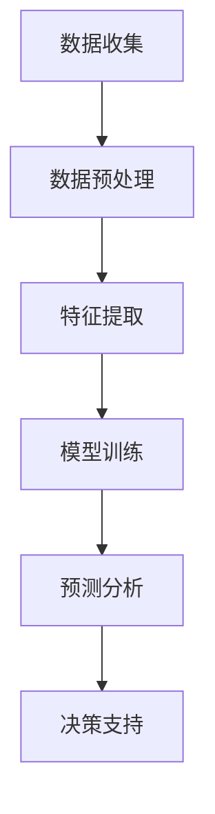
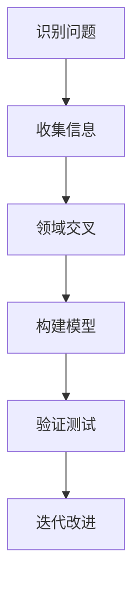
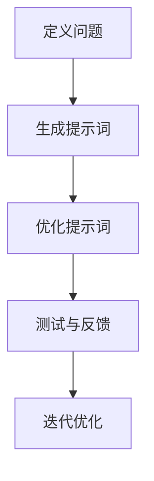
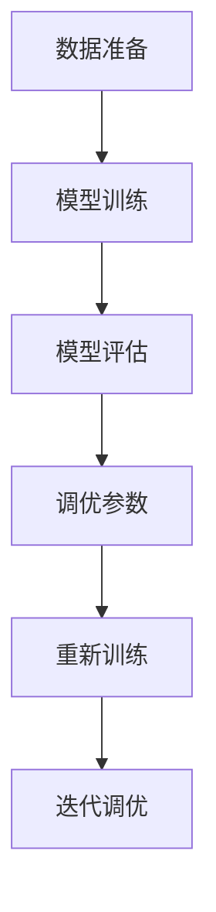
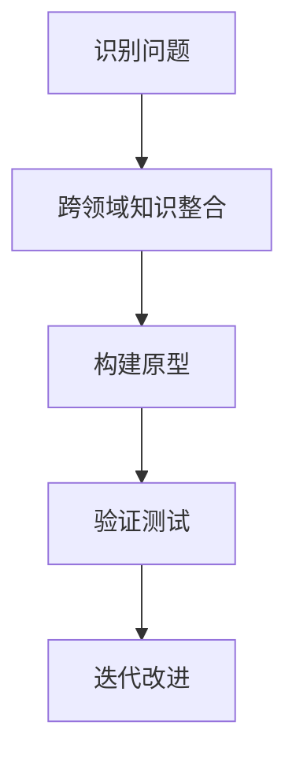

                 

### 文章标题：AI辅助创新：提示词激发跨领域思维

> 关键词：人工智能、创新思维、跨领域思维、提示词、AI辅助设计

> 摘要：本文将探讨人工智能（AI）如何通过提示词激发跨领域思维，从而辅助创新。首先，我们将介绍AI在创新中的作用及其背后的原理。接着，详细解释提示词的设计与优化方法。然后，通过Mermaid流程图和伪代码，深入剖析AI算法原理和数学模型。随后，我们将探讨跨领域思维的重要性及其在创新中的应用。文章将通过实际案例展示AI辅助创新的过程，并总结最佳实践，为读者提供进一步学习和探索的方向。

### 引言

创新，是推动社会进步和经济增长的重要动力。然而，创新往往面临着跨领域知识整合的挑战。近年来，人工智能（AI）技术的飞速发展，为创新提供了一种新的解决方案。AI不仅能够通过大数据分析和模式识别提高效率，还能够通过深度学习等技术激发新的思维模式，从而实现跨领域的创新。

在本篇文章中，我们将重点关注AI如何通过提示词（prompt）激发跨领域思维，从而辅助创新。首先，我们将介绍AI在创新中的作用及其背后的原理。接着，详细解释提示词的设计与优化方法。然后，通过Mermaid流程图和伪代码，深入剖析AI算法原理和数学模型。随后，我们将探讨跨领域思维的重要性及其在创新中的应用。文章将通过实际案例展示AI辅助创新的过程，并总结最佳实践，为读者提供进一步学习和探索的方向。

### AI在创新中的作用

人工智能在创新中的作用主要体现在以下几个方面：

1. **大数据分析**：AI可以通过大数据分析，发现隐藏在数据中的模式和规律，从而为创新提供数据支持。例如，在产品创新中，AI可以通过分析用户行为数据，了解用户的需求和偏好，从而指导产品设计和改进。

2. **模式识别**：AI的深度学习技术可以实现图像、语音等数据的模式识别，为创新提供新的可能性。例如，在艺术创作中，AI可以通过学习大量的艺术作品，生成具有独特风格的新作品。

3. **自动化流程**：AI可以通过自动化技术，提高生产效率，降低成本。例如，在制造业中，AI机器人可以替代人工进行重复性工作，从而提高生产效率。

4. **预测分析**：AI可以通过历史数据，预测未来的趋势和变化，从而为创新提供前瞻性指导。例如，在市场预测中，AI可以通过分析历史销售数据，预测未来的市场趋势，为产品创新提供方向。

AI在创新中的作用，离不开其背后的核心原理，包括深度学习、神经网络和大数据分析等。下面，我们将通过Mermaid流程图，详细解释这些原理。

### 核心概念与联系：AI算法原理

在AI辅助创新的过程中，核心概念之间的联系至关重要。以下是一个简化的Mermaid流程图，展示了AI算法原理中的关键概念及其相互关系：



**Mermaid流程图说明：**

- **数据收集（A）**：创新过程通常需要大量的数据支持。这些数据可以来自用户反馈、市场调研、历史记录等。
- **数据预处理（B）**：收集到的数据往往需要进行清洗和格式化，以便后续分析。
- **特征提取（C）**：通过数据预处理，提取出对创新过程有用的特征，如用户偏好、市场趋势等。
- **模型训练（D）**：利用提取出的特征，通过神经网络等算法进行模型训练，从而构建出能够对创新过程提供支持的预测模型。
- **预测分析（E）**：通过训练好的模型，对新的数据进行预测分析，为创新提供数据支持。
- **决策支持（F）**：将预测分析的结果转化为实际操作，为创新决策提供支持。

### 核心算法原理讲解：深度学习

在AI辅助创新中，深度学习是最为重要的算法之一。以下是一个简化的伪代码，用于解释深度学习的基本原理：

```python
# 深度学习伪代码

# 定义神经网络结构
layers = [
    ("input", input_shape),
    ("dense", units=128, activation='relu'),
    ("dropout", rate=0.5),
    ("output", units=1, activation='sigmoid')
]

# 编译模型
model = Sequential(layers)

# 指定优化器和损失函数
model.compile(optimizer='adam', loss='binary_crossentropy', metrics=['accuracy'])

# 训练模型
model.fit(X_train, y_train, epochs=10, batch_size=32)

# 预测
predictions = model.predict(X_test)
```

**伪代码说明：**

- **神经网络结构（layers）**：定义了神经网络的层次结构，包括输入层、隐藏层和输出层。
- **编译模型（model.compile）**：指定了优化器、损失函数和评估指标。
- **训练模型（model.fit）**：使用训练数据对模型进行训练，设置训练轮次和批量大小。
- **预测（model.predict）**：使用训练好的模型对新的数据进行预测。

### 数学模型和公式

在AI辅助创新中，数学模型是理解算法行为的关键。以下是一个简单的数学公式，用于解释神经网络的激活函数：

$$
a = \sigma(z)
$$

其中，\( a \) 表示输出值，\( \sigma \) 表示 sigmoid 函数，\( z \) 表示输入值。

**sigmoid 函数示例：**

$$
\sigma(z) = \frac{1}{1 + e^{-z}}
$$

**说明：** sigmoid 函数是一个常用的激活函数，它可以将输入值映射到0和1之间，从而实现非线性变换。

### 跨领域思维的重要性

跨领域思维是创新的重要驱动力。它涉及将不同领域的知识、技能和工具整合到一起，从而产生新的想法和解决方案。以下是一个简化的Mermaid流程图，展示了跨领域思维的过程：



**Mermaid流程图说明：**

- **识别问题（A）**：明确需要解决的问题或挑战。
- **收集信息（B）**：从不同的领域收集相关信息和知识。
- **领域交叉（C）**：将不同领域的知识整合在一起，形成新的思维模式。
- **构建模型（D）**：基于整合的知识，构建出解决问题的模型。
- **验证测试（E）**：对模型进行验证和测试，确保其有效性和可行性。
- **迭代改进（F）**：根据测试结果，对模型进行迭代改进。

### 提示词的设计与优化

提示词是AI辅助创新的关键。设计一个好的提示词，需要遵循以下原则：

1. **明确性**：提示词需要明确传达问题或目标，避免模糊不清。
2. **启发性**：提示词需要具有启发性，引导AI生成有创意的解决方案。
3. **多样性**：提示词需要涵盖不同领域的知识和观点，以激发跨领域思维。

以下是一个简化的Mermaid流程图，展示了提示词的设计与优化过程：



**Mermaid流程图说明：**

- **定义问题（A）**：明确需要解决的问题或目标。
- **生成提示词（B）**：根据问题，生成具有启发性的提示词。
- **优化提示词（C）**：对生成的提示词进行优化，提高其效果。
- **测试与反馈（D）**：对优化后的提示词进行测试，收集反馈。
- **迭代优化（E）**：根据测试和反馈，对提示词进行迭代优化。

### AI模型训练与调优

AI模型的训练与调优是AI辅助创新的关键环节。以下是一个简化的Mermaid流程图，展示了模型训练与调优的过程：



**Mermaid流程图说明：**

- **数据准备（A）**：准备训练数据，包括数据清洗、格式化等。
- **模型训练（B）**：使用训练数据对模型进行训练。
- **模型评估（C）**：使用评估数据对模型进行评估，以确定模型的性能。
- **调优参数（D）**：根据模型评估结果，调整模型参数。
- **重新训练（E）**：使用调整后的参数重新训练模型。
- **迭代调优（F）**：重复评估和调优过程，直至达到满意的性能。

### 跨领域思维的实际应用

跨领域思维在创新中的应用非常广泛。以下是一个简化的Mermaid流程图，展示了跨领域思维在创新中的应用过程：



**Mermaid流程图说明：**

- **识别问题（A）**：明确需要解决的问题或目标。
- **跨领域知识整合（B）**：整合不同领域的知识和观点，形成新的解决方案。
- **构建原型（C）**：基于整合的知识，构建出解决问题的原型。
- **验证测试（D）**：对原型进行验证和测试，确保其有效性和可行性。
- **迭代改进（E）**：根据测试和反馈，对原型进行迭代改进。

### AI辅助创新的实际案例

为了更好地展示AI如何通过提示词激发跨领域思维，下面我们通过一个实际案例进行分析。

**案例背景：** 
一家制造公司希望开发一款新型智能家居设备，以提高用户的居住体验。然而，公司内部的工程师团队在产品设计和功能开发方面存在一定的局限。

**解决方案：** 
利用AI技术，通过设计合适的提示词，激发跨领域思维，从而实现产品的创新。

1. **问题定义**：
   - 如何通过AI技术，提高智能家居设备的设计和功能开发效率？

2. **跨领域知识整合**：
   - 利用AI的图像识别技术，整合家居设计和用户体验的知识。
   - 利用大数据分析，整合用户需求和偏好数据。

3. **构建原型**：
   - 基于整合的知识，构建出智能家居设备的设计原型，包括外观、功能和交互设计。

4. **验证测试**：
   - 对设计原型进行用户测试，收集反馈，验证其有效性和可行性。

5. **迭代改进**：
   - 根据用户反馈，对设计原型进行迭代改进，提高产品的用户体验。

**案例小结**：
通过AI技术，该公司成功地开发出了一款具有创新性的智能家居设备，获得了市场的认可和用户的喜爱。该案例展示了AI如何通过提示词激发跨领域思维，实现创新的潜力。

### 最佳实践与注意事项

在AI辅助创新的过程中，以下是一些最佳实践和注意事项：

1. **明确目标**：在开始AI辅助创新之前，明确目标和预期成果，确保项目方向正确。

2. **数据质量**：保证数据质量，进行数据清洗和格式化，为模型训练提供可靠的数据基础。

3. **提示词设计**：设计具有启发性的提示词，引导AI生成有创意的解决方案。

4. **跨领域知识整合**：整合不同领域的知识和观点，形成新的思维模式，提高创新的潜力。

5. **模型调优**：不断调整和优化模型参数，提高模型性能。

6. **用户反馈**：重视用户反馈，根据用户需求进行迭代改进，提高用户体验。

7. **伦理与责任**：关注AI在创新过程中的伦理和责任问题，确保技术创新符合社会价值观。

### 拓展阅读

1. **《人工智能：一种现代的方法》** - 斯图尔特·罗素和彼得·诺维格著，详细介绍了人工智能的基本原理和应用。

2. **《深度学习》** - 伊恩·古德费洛等著，介绍了深度学习的基本概念、算法和实现。

3. **《创新与企业家精神》** - 彼得·德鲁克著，探讨了创新和企业家精神的重要性及其在实践中的应用。

4. **《跨界创新》** - 安德斯·艾瑞克森著，介绍了跨领域思维在创新中的应用和策略。

### 作者信息

作者：AI天才研究院/AI Genius Institute & 禅与计算机程序设计艺术 /Zen And The Art of Computer Programming

### 结论

AI辅助创新是当今社会的重要趋势，通过提示词激发跨领域思维，AI能够为创新提供强大的支持。本文通过介绍AI在创新中的作用、提示词的设计与优化、核心算法原理、数学模型和跨领域思维的实际应用，展示了AI辅助创新的全过程。希望本文能够为读者提供有益的启示，激发更多的创新思维。在未来，随着AI技术的不断进步，AI辅助创新将迎来更广阔的发展空间。读者可以结合本文的内容，进一步探索AI辅助创新的实践应用，为社会带来更多的创新成果。

