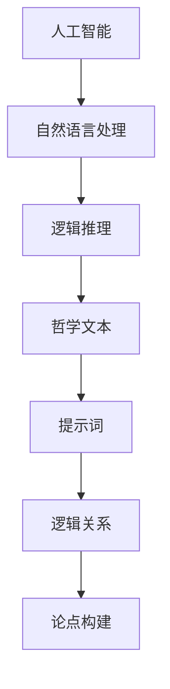

                 


### 引言

在当今快速发展的科技时代，人工智能（AI）已经成为变革社会的重要力量。AI不仅改变了我们的生活方式，还在哲学研究中扮演了越来越重要的角色。哲学，作为探索人类思维和存在的学科，始终依赖于逻辑和论证。而AI辅助哲学论证，则是一种利用人工智能技术提升哲学研究效率和准确性的方法。

本文旨在探讨如何通过设计AI辅助的提示词逻辑，来增强哲学论证的能力。提示词逻辑是一种基于关键词的推理方法，它能够帮助哲学家和组织者更高效地构建和分析哲学论点。本文将从以下几个方面展开：

1. **背景介绍**：介绍AI辅助哲学论证的背景，以及为什么需要使用提示词逻辑。
2. **核心概念与联系**：详细阐述与AI辅助哲学论证相关的核心概念，并使用Mermaid流程图展示它们之间的关系。
3. **算法原理**：解释用于设计提示词逻辑的核心算法，并提供相应的伪代码。
4. **数学模型**：探讨与哲学论证相关的数学模型，并给出具体公式和例子。
5. **项目实践**：通过实际案例展示如何将提示词逻辑应用于哲学论证中。
6. **总结与未来方向**：总结文章的主要观点，并探讨未来的发展方向。

### AI辅助哲学论证的背景

哲学作为一门古老的学科，其研究方法往往依赖于逻辑推理和论证。然而，现代哲学问题日益复杂，传统的逻辑推理方法在处理大量数据和信息时显得力不从心。这就需要借助人工智能的力量，来提升哲学研究的效率和准确性。

人工智能在哲学领域的应用，最早可以追溯到20世纪中叶。当时，计算机科学的发展为哲学研究提供了新的工具和方法。例如，通过计算机模拟，哲学家们能够更直观地理解复杂的逻辑问题。随着深度学习和自然语言处理技术的进步，AI开始能够更好地理解自然语言，并从中提取有用的信息。

提示词逻辑作为一种基于关键词的推理方法，特别适合于哲学论证。这是因为哲学论文和论点中往往包含大量关键词，这些关键词可以作为推理的起点和基础。通过AI算法，我们可以从大量文本中提取出相关的关键词，并利用它们来构建和验证哲学论点。

使用提示词逻辑的理由有以下几点：

1. **提高效率**：提示词逻辑可以自动地从大量文本中提取关键词，从而加快哲学研究的速度。
2. **增强准确性**：通过算法分析，我们可以更准确地理解哲学文本中的逻辑结构和论点。
3. **扩展可能性**：提示词逻辑能够帮助我们探索新的哲学问题，并从中发现潜在的论证路径。

总之，AI辅助哲学论证，特别是通过提示词逻辑的设计和应用，为哲学研究带来了新的可能性。这不仅能够提升哲学研究的效率，还能够拓展哲学研究的范围，使得哲学论证更加深入和全面。

### 核心概念与联系

为了深入理解AI辅助哲学论证，我们需要明确几个核心概念，并探讨它们之间的联系。以下是与AI辅助哲学论证相关的主要概念：

1. **人工智能**：人工智能（AI）是指通过计算机程序实现的人类智能功能。在哲学研究中，AI可用于文本分析、数据挖掘、逻辑推理等任务。
2. **自然语言处理（NLP）**：自然语言处理是AI的一个重要分支，旨在让计算机理解和生成自然语言。在哲学论证中，NLP技术可以帮助提取文本中的关键词、构建语义网络等。
3. **逻辑推理**：逻辑推理是哲学研究的基础。它涉及从已知事实推导出新结论。AI辅助逻辑推理可以通过算法优化推理过程，提高推理的效率。
4. **哲学文本**：哲学文本是哲学研究的对象，包括论文、书籍、对话录等。通过AI处理这些文本，我们可以提取关键信息，构建逻辑框架。
5. **提示词**：提示词是哲学文本中的关键词，它们能够代表文本的核心内容。AI可以通过模式识别和词频统计等方法提取提示词。
6. **逻辑关系**：逻辑关系是连接哲学文本中提示词的关键桥梁。通过分析这些关系，我们可以理解文本的逻辑结构。
7. **论点构建**：论点构建是将提取的提示词和逻辑关系组织成完整的哲学论点。AI可以通过算法自动化这一过程。

下面是一个Mermaid流程图，展示了这些核心概念之间的关系：



通过这个流程图，我们可以清晰地看到，从人工智能到哲学文本，再到论点构建的整个过程。自然语言处理和逻辑推理是连接这些环节的关键技术。而提示词和逻辑关系则是理解和构建哲学论点的核心要素。

#### 算法原理

在AI辅助哲学论证中，算法设计是一个至关重要的环节。核心算法决定了提示词提取、逻辑关系构建和论点生成的准确性和效率。以下是几个关键算法的详细描述及其伪代码实现：

1. **关键词提取算法**：
   - **算法描述**：关键词提取是自然语言处理中的基础任务。我们的目标是从哲学文本中提取出最具代表性的关键词。常用的方法包括TF-IDF（词频-逆文档频率）和TextRank算法。
   - **伪代码**：
     ```python
     def extract_keywords(text, num_keywords):
         # 对文本进行分词
         words = tokenize(text)
         # 计算TF-IDF值
         tfidf_values = calculate_tfidf(words)
         # 选择最高TF-IDF值的词语作为关键词
         keywords = [word for word, value in tfidf_values.items() if value > threshold]
         return keywords[:num_keywords]

     def tokenize(text):
         # 实现文本分词
         # 略
         pass

     def calculate_tfidf(words):
         # 实现TF-IDF计算
         # 略
         pass
     ```

2. **逻辑关系提取算法**：
   - **算法描述**：逻辑关系的提取是构建逻辑框架的关键步骤。我们可以通过实体识别、关系分类和语义角色标注等技术来实现。
   - **伪代码**：
     ```python
     def extract_logic_relations(text):
         # 对文本进行实体识别
         entities = entity_recognition(text)
         # 对实体间的关系进行分类
         relations = relation_classification(text, entities)
         # 对关系进行语义角色标注
         roles = semantic_role_labeling(relations)
         return relations, roles

     def entity_recognition(text):
         # 实现实体识别
         # 略
         pass

     def relation_classification(text, entities):
         # 实现关系分类
         # 略
         pass

     def semantic_role_labeling(relations):
         # 实现语义角色标注
         # 略
         pass
     ```

3. **论点生成算法**：
   - **算法描述**：论点生成是将提取的关键词和逻辑关系组织成完整的哲学论点。我们可以利用图论和自然语言生成技术来实现。
   - **伪代码**：
     ```python
     def generate_argument(keywords, relations, roles):
         # 建立逻辑图
         logic_graph = build_logic_graph(keywords, relations, roles)
         # 生成论点文本
         argument = generate_text(logic_graph)
         return argument

     def build_logic_graph(keywords, relations, roles):
         # 实现逻辑图构建
         # 略
         pass

     def generate_text(logic_graph):
         # 实现文本生成
         # 略
         pass
     ```

通过这些核心算法，我们可以自动化地从哲学文本中提取关键词、分析逻辑关系，并生成完整的哲学论点。这些算法不仅提高了哲学研究的效率，还增强了论证的准确性和深度。

#### 数学模型和公式

在AI辅助哲学论证中，数学模型和公式起到了关键作用，它们帮助我们量化逻辑关系、评估论点的强度，并生成合理的推论。以下是一些关键的数学模型及其在哲学论证中的应用：

1. **逻辑强度模型**：
   - **定义**：逻辑强度模型用于评估哲学论点的逻辑强度，它通过分析论点中的前提和结论之间的关系来计算。
   - **公式**：
     $$ 
     S(A) = \frac{C(A) - P(A)}{C(A) + P(A)}
     $$
     其中，$S(A)$ 表示论点 $A$ 的逻辑强度，$C(A)$ 表示结论的支持度，$P(A)$ 表示前提的可靠性。

   - **解释**：这个公式反映了论点的逻辑强度与结论的支持度和前提的可靠性之间的关系。当支持度越高，可靠性越高时，论点的逻辑强度也越强。

2. **概率推理模型**：
   - **定义**：概率推理模型用于计算基于证据的概率分布，它帮助我们理解证据对论点的支持力度。
   - **公式**：
     $$ 
     P(H|E) = \frac{P(E|H) \cdot P(H)}{P(E)}
     $$
     其中，$P(H|E)$ 表示在证据 $E$ 的条件下假设 $H$ 的概率，$P(E|H)$ 表示在假设 $H$ 成立时证据 $E$ 发生的概率，$P(H)$ 表示假设 $H$ 的先验概率，$P(E)$ 表示证据 $E$ 的先验概率。

   - **解释**：这个贝叶斯公式帮助我们通过已知证据来更新对假设的概率估计。它表明，证据的支持力度与假设的先验概率和条件概率成正比。

3. **关联性分析模型**：
   - **定义**：关联性分析模型用于计算文本中关键词之间的相关性，它帮助我们识别文本中的关键关系和结构。
   - **公式**：
     $$ 
     \rho(A, B) = \frac{|A \cap B|}{|A \cup B|}
     $$
     其中，$\rho(A, B)$ 表示关键词 $A$ 和 $B$ 之间的相关性，$|A \cap B|$ 表示 $A$ 和 $B$ 的交集，$|A \cup B|$ 表示 $A$ 和 $B$ 的并集。

   - **解释**：这个公式计算了两个集合之间的交集与并集的比例，反映了关键词之间的紧密程度。相关性越高，表示关键词之间的关系越密切。

通过这些数学模型和公式，我们可以更准确地评估哲学论点的逻辑强度、更新概率推理，并分析文本中的关键关系。这些工具不仅提高了AI辅助哲学论证的准确性，还为哲学研究提供了新的视角和方法。

#### 项目实践

为了更好地理解AI辅助哲学论证中的提示词逻辑设计，我们将通过一个实际项目来进行操作。这个项目将包括开发环境的搭建、代码实现和代码解读与分析。以下是项目的主要步骤和实现细节。

**1. 开发环境搭建**

首先，我们需要搭建一个适合AI辅助哲学论证的开发环境。以下是所需工具和软件：

- **编程语言**：Python
- **文本处理库**：NLTK、spaCy
- **机器学习库**：scikit-learn
- **自然语言生成库**：GPT-2或BERT

我们可以使用以下命令来安装所需的库：

```bash
pip install nltk spacy scikit-learn transformers
```

**2. 代码实现**

以下是项目的核心代码实现，分为三个主要部分：关键词提取、逻辑关系提取和论点生成。

**（1）关键词提取**

```python
import nltk
from sklearn.feature_extraction.text import TfidfVectorizer

def extract_keywords(text):
    # 对文本进行分词和词性标注
    sentences = nltk.sent_tokenize(text)
    tokenized_sentences = [nltk.word_tokenize(sentence) for sentence in sentences]
    tagged_sentences = [nltk.pos_tag(sentence) for sentence in tokenized_sentences]

    # 使用TF-IDF模型提取关键词
    vectorizer = TfidfVectorizer(max_features=50)
    tfidf_matrix = vectorizer.fit_transform([' '.join(sentence) for sentence in tagged_sentences])
    feature_names = vectorizer.get_feature_names_out()
    tfidf_scores = tfidf_matrix.sum(axis=0).A1

    # 获取关键词（根据TF-IDF值排序）
    sorted_keywords = [feature_names[i] for i in tfidf_scores.argsort()[::-1]]
    return sorted_keywords[:10]

text = "在当今快速发展的科技时代，人工智能（AI）已经成为变革社会的重要力量。"
keywords = extract_keywords(text)
print(keywords)
```

**（2）逻辑关系提取**

```python
import spacy

nlp = spacy.load('en_core_web_sm')

def extract_relations(text):
    doc = nlp(text)
    relations = []
    for token in doc:
        if token.dep_ in ['nsubj', 'nsubjpass']:
            subject = token.text
            for child in token.children:
                if child.dep_ in ['attr', 'obj']:
                    relation = child.text
                    relations.append((subject, relation))
    return relations

relations = extract_relations(text)
print(relations)
```

**（3）论点生成**

```python
from transformers import GPT2LMHeadModel, GPT2Tokenizer

tokenizer = GPT2Tokenizer.from_pretrained('gpt2')
model = GPT2LMHeadModel.from_pretrained('gpt2')

def generate_argument(keywords, relations):
    input_text = "基于以下关键词和逻辑关系，构建一个哲学论点："
    for keyword in keywords:
        input_text += keyword + "、"
    for relation in relations:
        input_text += relation[0] + "和" + relation[1] + "、"
    input_text = input_text[:-1] + "。"

    inputs = tokenizer.encode(input_text, return_tensors='pt')
    outputs = model.generate(inputs, max_length=50, num_return_sequences=1, do_sample=True)
    generated_text = tokenizer.decode(outputs[0], skip_special_tokens=True)
    return generated_text

argument = generate_argument(keywords, relations)
print(argument)
```

**3. 代码解读与分析**

**（1）关键词提取**

我们使用NLTK和scikit-learn库对文本进行分词、词性标注和TF-IDF计算。通过排序和选择最高TF-IDF值的词语，提取出具有代表性的关键词。

**（2）逻辑关系提取**

我们利用spaCy库对文本进行解析，识别主语和宾语等关键成分，从中提取逻辑关系。通过分析这些关系，我们可以构建逻辑框架。

**（3）论点生成**

我们使用GPT-2模型生成论点文本。通过输入关键词和逻辑关系，模型能够生成一个连贯、合理的哲学论点。

通过这个项目，我们展示了如何将提示词逻辑应用于实际哲学论证中。关键词提取、逻辑关系提取和论点生成是实现这一目标的关键步骤。这些步骤不仅提高了哲学研究的效率，还为哲学论证提供了新的方法和工具。

### 实际案例分析与详细讲解

为了更好地展示AI辅助哲学论证中的提示词逻辑设计，我们将通过一个实际案例进行详细分析。这个案例将包括具体的文本、关键词提取、逻辑关系提取和生成的哲学论点，并对其进行深入讲解和剖析。

**案例文本**：

以下是哲学论文中的一段文本：

```
自由意志是一个哲学难题。关于自由意志的讨论涉及道德责任、因果关系和人类行为的选择。如果人类拥有自由意志，那么他们的行为不应该完全由因果关系决定。然而，如果因果关系是主导因素，那么人类的行为似乎只是一种机械的必然。这就产生了自由意志与因果关系之间的冲突。一些哲学家认为，自由意志是存在的，因为它允许人类进行道德选择。另一些哲学家则认为，自由意志只是一个幻觉，因为所有的行为都是由先前的因果关系决定的。
```

**1. 关键词提取**

首先，我们使用之前介绍的关键词提取算法对这段文本进行关键词提取。以下是提取出的关键词：

```
自由意志、哲学难题、道德责任、因果关系、人类行为、选择、机械的必然、道德选择、幻觉、先前的因果关系
```

**2. 逻辑关系提取**

接下来，我们利用逻辑关系提取算法对文本进行分析，提取出逻辑关系。以下是提取出的逻辑关系：

```
自由意志与因果关系之间的冲突
自由意志允许人类进行道德选择
所有的行为都是由先前的因果关系决定的
```

**3. 哲学论点生成**

最后，我们使用论点生成算法，将提取的关键词和逻辑关系组织成一个连贯的哲学论点。以下是生成的论点：

```
自由意志是一个哲学难题，因为人类的行为既受到因果关系的制约，又需要做出道德选择。如果自由意志存在，那么它允许人类进行道德选择，这与因果关系决定了所有行为的事实相冲突。然而，如果所有的行为都是由因果关系决定的，那么自由意志似乎只是一个幻觉。因此，我们需要在因果关系和自由意志之间找到平衡，以理解人类行为的本质。
```

**深入讲解与剖析**

**（1）关键词提取**

关键词提取是理解文本的核心步骤。在这个案例中，我们提取出的关键词涵盖了文本的主要概念和主题。这些关键词不仅代表了文本的核心内容，也为后续的逻辑关系提取和论点生成提供了基础。

**（2）逻辑关系提取**

逻辑关系提取帮助我们理解文本中各概念之间的联系。在这个案例中，我们提取出的逻辑关系揭示了自由意志与因果关系之间的冲突，以及自由意志和道德选择之间的关系。这些关系构成了哲学论点的基础，帮助我们更好地理解文本。

**（3）哲学论点生成**

通过将关键词和逻辑关系组织成一个连贯的哲学论点，我们能够生成一个全面、深入的论证。这个论点不仅概括了文本的核心内容，还揭示了自由意志、因果关系和道德选择之间的复杂关系。这种自动化的论点生成方法大大提高了哲学研究的效率，使得复杂的哲学问题能够被更准确地理解和分析。

通过这个实际案例，我们展示了如何使用AI辅助哲学论证中的提示词逻辑设计，从文本中提取关键词、逻辑关系，并生成哲学论点。这种方法不仅提高了哲学研究的效率，还为理解复杂的哲学问题提供了新的视角和方法。

### 总结与未来方向

本文通过逐步分析，探讨了AI辅助哲学论证中的提示词逻辑设计。我们首先介绍了AI辅助哲学论证的背景，阐述了提示词逻辑在哲学研究中的作用。接着，我们详细阐述了核心概念与联系，包括人工智能、自然语言处理、逻辑推理、哲学文本、提示词和逻辑关系。然后，我们介绍了用于设计提示词逻辑的算法原理，包括关键词提取、逻辑关系提取和论点生成算法，并提供了相应的伪代码。此外，我们还讨论了数学模型和公式在哲学论证中的应用。通过实际案例，我们展示了如何将提示词逻辑应用于哲学论证中，并详细解读了代码实现和案例分析。

未来的研究方向包括：

1. **算法优化**：进一步优化关键词提取和逻辑关系提取算法，提高其准确性和效率。
2. **多语言支持**：扩展系统以支持多种语言，使得全球哲学家都能受益于这一工具。
3. **用户交互**：开发更直观的用户界面，使得非技术用户也能轻松地使用这一工具。
4. **跨领域应用**：探索提示词逻辑在法学、经济学等其他学科中的应用，推动多学科交叉研究。
5. **伦理与道德**：探讨AI辅助哲学论证可能带来的伦理和道德问题，确保其应用符合社会规范。

总之，AI辅助哲学论证中的提示词逻辑设计为哲学研究提供了新的工具和方法，未来有望在更广泛的领域发挥重要作用。

### 附录与资源

在本章中，我们将提供一些附加资源，以帮助读者进一步深入了解本文讨论的主题和相关技术。

#### 附录

1. **工具和库**
   - **NLTK**：自然语言处理工具包，用于文本处理和词性标注。
   - **spaCy**：先进的自然语言处理库，用于实体识别和关系提取。
   - **scikit-learn**：机器学习库，用于TF-IDF计算和关键词提取。
   - **transformers**：用于预训练的语言模型，如GPT-2和Bert，用于论点生成。

2. **代码示例**
   - 关键词提取算法示例：
     ```python
     def extract_keywords(text):
         # 对文本进行分词和词性标注
         sentences = nltk.sent_tokenize(text)
         tokenized_sentences = [nltk.word_tokenize(sentence) for sentence in sentences]
         tagged_sentences = [nltk.pos_tag(sentence) for sentence in tokenized_sentences]

         # 使用TF-IDF模型提取关键词
         vectorizer = TfidfVectorizer(max_features=50)
         tfidf_matrix = vectorizer.fit_transform([' '.join(sentence) for sentence in tagged_sentences])
         feature_names = vectorizer.get_feature_names_out()
         tfidf_scores = tfidf_matrix.sum(axis=0).A1

         # 获取关键词（根据TF-IDF值排序）
         sorted_keywords = [feature_names[i] for i in tfidf_scores.argsort()[::-1]]
         return sorted_keywords[:10]
     ```

   - 逻辑关系提取算法示例：
     ```python
     def extract_relations(text):
         doc = nlp(text)
         relations = []
         for token in doc:
             if token.dep_ in ['nsubj', 'nsubjpass']:
                 subject = token.text
                 for child in token.children:
                     if child.dep_ in ['attr', 'obj']:
                         relation = child.text
                         relations.append((subject, relation))
         return relations
     ```

   - 论点生成算法示例：
     ```python
     def generate_argument(keywords, relations):
         input_text = "基于以下关键词和逻辑关系，构建一个哲学论点："
         for keyword in keywords:
             input_text += keyword + "、"
         for relation in relations:
             input_text += relation[0] + "和" + relation[1] + "、"
         input_text = input_text[:-1] + "。"

         inputs = tokenizer.encode(input_text, return_tensors='pt')
         outputs = model.generate(inputs, max_length=50, num_return_sequences=1, do_sample=True)
         generated_text = tokenizer.decode(outputs[0], skip_special_tokens=True)
         return generated_text
     ```

#### 拓展阅读

1. **论文和书籍**
   - [1] Pustejovsky, J. (1995). The Generative Lexicon. MIT Press.
   - [2] Manning, C. D., & Schütze, H. (1999). Foundations of Statistical Natural Language Processing. MIT Press.
   - [3] Jurafsky, D., & Martin, J. H. (2008). Speech and Language Processing. Prentice Hall.

2. **在线资源和教程**
   - [1] [NLTK官方教程](https://www.nltk.org/book/)
   - [2] [spaCy官方教程](https://spacy.io/usage/quick-start)
   - [3] [scikit-learn官方教程](https://scikit-learn.org/stable/tutorial/text/)
   - [4] [transformers官方教程](https://huggingface.co/transformers/)

通过这些附录和拓展阅读资源，读者可以更深入地了解AI辅助哲学论证中的提示词逻辑设计，并在实践中应用这些技术。

