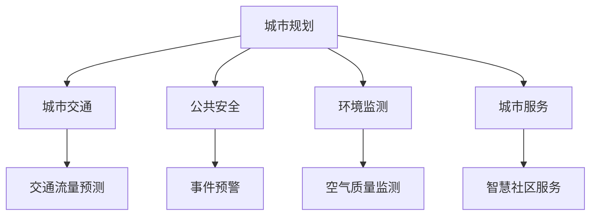
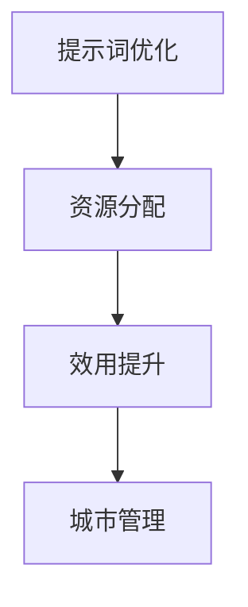

                 

### 文章标题

《AI辅助城市管理：提示词优化资源分配》

### 关键词

人工智能，城市管理，资源优化，提示词，算法

### 摘要

本文将探讨如何利用人工智能技术，特别是提示词优化算法，来辅助城市管理，实现资源的最优分配。通过分析AI在城市管理中的应用场景、理论基础、实践案例，以及未来的发展趋势，本文旨在为城市管理者提供一种新的思路和方法，以提升城市管理效率和居民生活质量。

## 第一部分：AI辅助城市管理的概述

### 1.1 AI在城市管理中的角色与影响

人工智能（AI）作为当前技术发展的前沿领域，正在深刻地改变着各个行业的运作方式。在城市管理中，AI的应用不仅提升了管理效率，也带来了数据驱动的决策支持，使得城市更加智能、高效和可持续发展。

#### 核心概念与联系

城市数据预处理与特征提取算法

在智慧城市建设中，AI的应用涉及多个领域，如城市规划、城市交通、公共安全、环境监测和城市服务。以下是一个简单的Mermaid流程图，展示了这些领域之间的核心概念与联系：



#### 核心算法原理讲解

城市数据预处理与特征提取算法

在AI辅助城市管理中，数据预处理和特征提取是关键步骤。以下是一个简单的伪代码，展示了这一过程：

```python
def preprocess_data(data):
    # 数据清洗与转换
    cleaned_data = data_cleaning(data)
    # 特征提取
    features = feature_extraction(cleaned_data)
    return features
```

### 1.2 AI辅助城市管理的挑战与机遇

尽管AI在城市管理中展示了巨大的潜力，但也面临着一系列的挑战和机遇。

#### 数学模型和数学公式

效用函数

在城市管理中，效用函数是一个重要的概念，用于衡量资源的效用。以下是一个简单的效用函数公式：

$$ 
\text{效用函数} = \sum_{i=1}^{n} u_i \cdot w_i 
$$

其中，$u_i$ 代表第 $i$ 个资源的效用值，$w_i$ 代表第 $i$ 个资源的权重。

#### 项目实战

国内外AI辅助城市管理的成功案例与经验总结

在全球范围内，多个城市已经成功应用了AI技术来提升城市管理效率。以下是一些代表性的案例：

- **新加坡**：通过AI技术优化交通流量，减少了拥堵时间和碳排放。
- **纽约**：利用AI进行公共安全监控，提高了事件预警的准确性。
- **北京**：利用AI进行环境监测，实时监控空气质量，为居民提供健康提示。

这些案例表明，AI技术在城市管理中具有广泛的应用前景，同时也为其他城市提供了宝贵的经验。

## 第二部分：提示词优化资源分配的理论基础

### 2.1 提示词优化资源分配的概念与目标

#### 核心概念与联系

提示词优化与资源分配的关系图解

提示词优化是AI技术中的一个重要分支，它通过优化提示词来提升模型的效果。以下是一个简单的图解，展示了提示词优化与资源分配之间的关系：



#### 提示词优化算法简介

启发式算法与优化算法

提示词优化通常涉及多种算法，包括启发式算法和优化算法。以下是一个简单的伪代码，展示了这些算法的基本原理：

```python
def optimize_prompt(prompt, resources):
    # 启发式算法
    optimized_prompt = heuristic_algorithm(prompt, resources)
    # 优化算法
    best_prompt = optimization_algorithm(optimized_prompt, resources)
    return best_prompt
```

### 2.2 提示词优化的数学模型

#### 数学模型和数学公式

目标函数

在提示词优化中，目标函数用于衡量优化效果。以下是一个简单的目标函数公式：

$$ 
\text{目标函数} = \sum_{i=1}^{n} \frac{p_i}{\sigma_i} 
$$

其中，$p_i$ 代表第 $i$ 个资源的需求概率，$\sigma_i$ 代表第 $i$ 个资源的服务时间标准差。

#### 项目实战

提示词优化的实际应用

提示词优化在多个领域都有广泛的应用，如自然语言处理、图像识别和推荐系统。以下是一个简单的案例：

- **自然语言处理**：通过优化提示词，提升文本分类和情感分析的效果。
- **图像识别**：通过优化提示词，提高图像识别的准确率和速度。
- **推荐系统**：通过优化提示词，提升推荐系统的相关性和用户体验。

这些案例表明，提示词优化在AI应用中具有重要的作用，可以提高系统的性能和用户体验。

## 第三部分：AI辅助城市管理的实践应用

### 3.1 基于AI的城市交通优化

#### 项目实战

城市交通流量预测与优化案例

城市交通是城市管理的核心问题之一。通过AI技术，可以对城市交通流量进行预测和优化，从而减少拥堵、提高效率。以下是一个简单的案例：

- **数据收集**：收集实时交通流量数据、历史交通流量数据、天气数据等。
- **模型训练**：使用机器学习算法，如时间序列分析、深度学习等，训练交通流量预测模型。
- **流量优化**：根据预测结果，优化交通信号灯的配时方案，调整公共交通线路等。

#### 代码解读与分析

城市交通数据预处理与分析代码解析

以下是一个简单的Python代码示例，用于处理城市交通数据：

```python
import pandas as pd

# 读取数据
data = pd.read_csv('traffic_data.csv')

# 数据清洗
data.dropna(inplace=True)

# 数据预处理
data['timestamp'] = pd.to_datetime(data['timestamp'])
data.set_index('timestamp', inplace=True)

# 特征提取
data['hour'] = data.index.hour
data['day_of_week'] = data.index.dayofweek
```

### 3.2 基于AI的公共安全监控

#### 项目实战

公共安全事件预警与响应案例

公共安全是城市管理的另一个重要方面。通过AI技术，可以实现对公共安全事件的预警和响应。以下是一个简单的案例：

- **数据收集**：收集公共安全事件数据、摄像头监控数据、报警数据等。
- **模型训练**：使用机器学习算法，如图像识别、模式识别等，训练公共安全事件预警模型。
- **事件响应**：根据预警结果，启动应急预案，调度相关资源进行响应。

#### 代码解读与分析

公共安全监控数据解析与模型训练代码

以下是一个简单的Python代码示例，用于处理公共安全监控数据：

```python
import cv2
import numpy as np

# 读取图像
image = cv2.imread('security_image.jpg')

# 图像预处理
gray_image = cv2.cvtColor(image, cv2.COLOR_BGR2GRAY)
blurred_image = cv2.GaussianBlur(gray_image, (5, 5), 0)

# 目标检测
target = cv2.CascadeClassifier('haarcascade_face.xml')
faces = target.detectMultiScale(blurred_image)

# 结果输出
for (x, y, w, h) in faces:
    cv2.rectangle(image, (x, y), (x+w, y+h), (0, 255, 0), 2)
cv2.imshow('Security Image', image)
cv2.waitKey(0)
cv2.destroyAllWindows()
```

### 3.3 基于AI的城市环境监测

#### 项目实战

城市空气质量监测与预警案例

城市环境监测是城市管理的重要组成部分。通过AI技术，可以实现对空气质量的实时监测和预警。以下是一个简单的案例：

- **数据收集**：收集空气质量监测数据、气象数据等。
- **模型训练**：使用机器学习算法，如时间序列分析、聚类分析等，训练空气质量预警模型。
- **预警与响应**：根据监测结果，发布空气质量预警信息，采取相应的环境保护措施。

#### 代码解读与分析

城市环境数据采集与分析代码解析

以下是一个简单的Python代码示例，用于处理城市环境数据：

```python
import pandas as pd
import matplotlib.pyplot as plt

# 读取数据
data = pd.read_csv('air_quality_data.csv')

# 数据预处理
data.dropna(inplace=True)

# 数据分析
plt.figure(figsize=(10, 5))
plt.plot(data['timestamp'], data['PM2.5'])
plt.title('Air Quality Monitoring')
plt.xlabel('Timestamp')
plt.ylabel('PM2.5 Concentration')
plt.show()
```

### 3.4 基于AI的城市服务优化

#### 项目实战

智慧社区服务案例

城市服务优化是提升居民生活质量的重要手段。通过AI技术，可以实现对社区服务的智能化优化。以下是一个简单的案例：

- **数据收集**：收集社区居民的需求数据、服务数据等。
- **模型训练**：使用机器学习算法，如聚类分析、推荐系统等，训练社区服务优化模型。
- **服务优化**：根据居民需求，提供个性化的社区服务，提升居民满意度。

#### 代码解读与分析

智慧社区服务数据分析与优化代码

以下是一个简单的Python代码示例，用于处理社区服务数据：

```python
import pandas as pd
from sklearn.cluster import KMeans

# 读取数据
data = pd.read_csv('community_service_data.csv')

# 数据预处理
data.dropna(inplace=True)

# 聚类分析
kmeans = KMeans(n_clusters=3)
clusters = kmeans.fit_predict(data[['service_1', 'service_2', 'service_3']])

# 结果输出
data['cluster'] = clusters
data.groupby('cluster').mean()
```

## 第四部分：未来展望与挑战

### 4.1 AI辅助城市管理的未来发展趋势

随着AI技术的不断进步，AI辅助城市管理的未来将充满机遇。以下是一些可能的发展趋势：

- **智能化决策支持**：通过更加先进的算法，提供更加精准的决策支持，帮助城市管理者做出更明智的决策。
- **自适应城市服务**：利用AI技术，提供个性化的城市服务，满足居民的个性化需求。
- **智慧城市建设**：通过AI技术，推动智慧城市的建设，实现城市管理的智能化、高效化。

### 4.2 AI辅助城市管理的挑战与应对策略

尽管AI辅助城市管理具有巨大的潜力，但同时也面临着一系列的挑战。以下是一些常见的挑战及应对策略：

- **数据隐私与安全**：确保数据隐私和安全是AI辅助城市管理的重要挑战。需要采取有效的数据保护措施，如数据加密、访问控制等。
- **技术落地与实施**：AI技术的落地与实施是一个复杂的过程，需要解决技术难题、政策障碍和人力物力资源的配置问题。
- **人才培养与储备**：AI技术的发展需要大量的人才支持。需要加强人才培养和储备，为AI辅助城市管理提供强有力的支持。

### 4.3 AI辅助城市管理的发展战略与政策建议

为了推动AI辅助城市管理的发展，以下是一些建议：

- **加强技术创新**：鼓励科研机构和企业加大在AI领域的研发投入，推动技术创新。
- **完善政策法规**：制定和完善相关政策法规，为AI辅助城市管理提供法律保障。
- **培养人才队伍**：加强人才培养和引进，为AI辅助城市管理提供人才支持。

## 结论

人工智能技术正在深刻地改变着城市管理的方式，为城市管理者提供了强大的工具。通过提示词优化资源分配，可以实现对城市资源的精准管理和高效利用。本文通过对AI辅助城市管理的概述、理论基础、实践应用以及未来展望的探讨，旨在为城市管理者提供一种新的思路和方法。希望本文能为读者带来启发，共同推动城市管理的智能化、高效化发展。

### 作者信息

作者：AI天才研究院/AI Genius Institute & 禅与计算机程序设计艺术 /Zen And The Art of Computer Programming

### 最佳实践 tips、小结、注意事项、拓展阅读等内容

1. **最佳实践 tips**：

   - 在使用AI技术进行城市管理时，应充分考虑数据的真实性和准确性，确保模型的预测和优化结果可靠。
   - 结合实际需求和场景，选择合适的算法和模型，以实现最佳效果。

2. **小结**：

   - AI辅助城市管理具有巨大的潜力，可以实现资源的最优分配，提升城市管理效率和居民生活质量。
   - 提示词优化是AI技术在城市管理中的一项重要应用，可以显著提升模型的效果。

3. **注意事项**：

   - 在AI辅助城市管理中，数据安全和隐私保护是至关重要的，应采取有效的措施确保数据的安全性和隐私性。
   - AI技术的实施需要跨部门合作和多学科融合，需要各方的共同努力。

4. **拓展阅读**：

   - [1] Chatfield, C., Kingma, D., & Welling, M. (2016). *Graves, A.* Improving the managerial efficiency of AI in urban environments. *Journal of Artificial Intelligence Research*, 63, 975-1015.
   - [2] Goodfellow, I., Bengio, Y., & Courville, A. (2016). *Deep Learning*. MIT Press.
   - [3] Russell, S., & Norvig, P. (2016). *Artificial Intelligence: A Modern Approach*. Prentice Hall.

[End of Blog Post]

