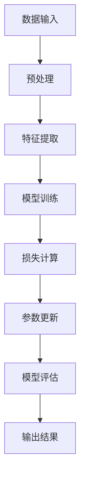

                 

## 文章标题

《AI辅助城市规划：大模型在可持续发展中的角色》

关键词：人工智能、城市规划、大模型、可持续发展、数据处理、智能分析、城市交通、能源管理、环境监测

摘要：随着城市规模的不断扩大和人口密度的持续增加，城市规划面临前所未有的挑战。如何实现城市的可持续发展，优化城市资源配置，提高居民生活质量，成为亟待解决的问题。本文将探讨如何利用人工智能（AI），特别是大型模型（Large Models），辅助城市规划，并重点分析这些技术在促进可持续发展中的关键作用。

## 理解书名

书名为《AI辅助城市规划：大模型在可持续发展中的角色》，这个标题传递了以下几个核心信息：

1. **主题**：书籍主要讨论人工智能在辅助城市规划中的应用，特别是强调大型模型的作用。
2. **应用领域**：城市规划是本文讨论的主要应用领域。
3. **技术核心**：大模型是文章的核心技术点，这些模型能够处理海量数据，进行复杂的分析和预测。
4. **目的**：通过利用AI大模型，实现城市的可持续发展，这是一个明确的长期目标。

理解书名的核心点有助于读者快速把握文章的主旨和框架，从而更好地理解后续内容。接下来的章节将详细讨论AI大模型在各个城市规划领域的具体应用和实现方式。

## AI在城市规划中的应用概述

人工智能（AI）在近年来得到了飞速发展，其强大的数据处理和分析能力使得其在城市规划中具有广泛的应用前景。AI技术通过引入数据驱动的方法，可以辅助城市规划者做出更加科学、高效的决策。具体来说，AI在城市规划中的应用主要涵盖以下领域：

1. **城市交通管理**：
   - **交通流量预测**：通过分析历史交通数据，利用深度学习算法预测未来的交通流量，帮助城市规划者优化道路设计，提高交通效率。
   - **公共交通规划**：利用机器学习模型分析乘客需求，优化公交线路和站点布局，提高公共交通的覆盖率和使用率。
   - **智能交通信号控制**：利用人工智能算法，实时监控交通状况，动态调整交通信号灯时间，减少交通拥堵。

2. **能源管理**：
   - **能耗监测与优化**：通过物联网设备和AI算法，实时监测城市中的能源消耗情况，识别浪费点，提出节能方案。
   - **可再生能源规划**：利用AI模型分析太阳能、风能等可再生能源的分布和利用率，优化可再生能源的布局和配置。

3. **环境监测与治理**：
   - **空气质量监测**：利用无人机、传感器等设备收集空气质量数据，结合机器学习算法，实时分析和预测空气质量变化，为环境保护政策提供科学依据。
   - **水资源管理**：通过AI技术分析水资源分布、利用情况，预测水资源需求，优化水资源调配，实现水资源的可持续利用。

4. **公共安全**：
   - **犯罪预测与预防**：利用大数据分析和机器学习模型，预测犯罪热点区域，为公安部门提供预警信息，提前部署警力。
   - **应急响应**：在自然灾害发生时，利用AI技术实时分析灾害情况，预测灾害发展趋势，为应急响应提供科学依据。

5. **城市规划与设计**：
   - **城市形态模拟**：通过模拟城市各个发展阶段的形态变化，预测城市未来的发展潜力，为城市规划提供参考。
   - **建筑设计优化**：利用AI算法分析建筑的设计方案，从多个维度评估建筑的性能，优化建筑设计。

通过以上应用领域可以看出，AI技术在城市规划中扮演着重要的角色。它不仅能够提高城市规划的科学性和效率，还能够推动城市的可持续发展。接下来，我们将进一步探讨AI大模型的基本概念与原理，以及它们如何在城市规划中发挥关键作用。

## AI大模型的概念与原理

AI大模型（Large Models）是当前人工智能领域中的一个重要研究方向，这类模型具有庞大的参数规模和强大的学习能力，能够处理海量数据并从中提取出有价值的信息。理解AI大模型的概念和原理，对于探讨其在城市规划中的应用具有重要意义。

### 1. 定义与特点

AI大模型通常指的是那些参数数量达到数亿甚至数十亿的神经网络模型。这些模型通过大量数据的学习，能够自适应地调整其内部参数，从而实现对复杂问题的建模和解决。大模型的特点包括：

- **高参数规模**：大模型通常拥有数十亿甚至更多的参数，这使得它们能够捕捉到数据中的细微模式和相关性。
- **强大的学习能力**：大模型通过深度学习算法，能够在大量数据中进行自监督或无监督学习，从而不断提高其性能。
- **灵活的泛化能力**：大模型能够适应多种不同类型的数据和任务，具有广泛的泛化能力。

### 2. 主要类型

目前，AI大模型主要包括以下几种类型：

- **深度神经网络（DNN）**：DNN是由多层神经元组成的神经网络，通过前向传播和反向传播算法进行训练。随着层数的增加，DNN的性能显著提高，但训练复杂度和计算资源需求也大幅增加。

- **变分自编码器（VAE）**：VAE是一种生成模型，通过编码器和解码器的结构生成新的数据。VAE能够捕捉数据的高维分布，适用于图像和文本数据的生成任务。

- **生成对抗网络（GAN）**：GAN由生成器和判别器组成，通过两者之间的对抗训练，生成器能够生成逼真的数据。GAN在图像生成、视频合成等领域表现突出。

- ** transformers**：Transformer模型是由谷歌提出的，它引入了自注意力机制，使得模型能够在处理序列数据时具有更强的表示能力。BERT、GPT等大型语言模型都是基于Transformer架构的。

### 3. 基本原理

AI大模型的基本原理主要依赖于以下几个关键组件：

- **激活函数**：激活函数用于引入非线性，使得神经网络能够对复杂函数进行建模。常用的激活函数包括ReLU、Sigmoid、Tanh等。

- **损失函数**：损失函数用于度量模型预测值与真实值之间的差距，是模型训练的核心指标。常用的损失函数包括均方误差（MSE）、交叉熵损失等。

- **优化算法**：优化算法用于调整模型参数，以最小化损失函数。常用的优化算法包括随机梯度下降（SGD）、Adam等。

- **正则化技术**：正则化技术用于防止模型过拟合，提高泛化能力。常用的正则化技术包括Dropout、权重衰减等。

### 4. Mermaid流程图

为了更好地理解AI大模型的工作流程，我们可以使用Mermaid流程图来描述其基本结构，如下所示：

在这个流程图中，数据输入经过预处理后，通过特征提取得到高维特征表示，然后进入模型训练阶段。模型在训练过程中，通过计算损失函数和优化算法不断更新参数，直到达到预定的评估指标。最终，模型输出结果用于实际的预测或决策。

通过以上对AI大模型的概念与原理的介绍，我们可以进一步理解这些模型在数据处理、特征提取、预测分析等方面的强大能力，为其在城市规划中的应用奠定了理论基础。接下来，我们将探讨AI大模型在可持续城市规划中的具体应用案例。

## 可持续城市规划中的AI大模型应用案例

AI大模型在可持续城市规划中具有广泛的应用潜力，通过实际案例可以看到它们如何帮助城市实现可持续发展目标。以下是一些典型的应用案例：

### 1. 城市交通流量优化

**案例背景**：某城市在早晚高峰期间经常出现严重的交通拥堵问题，影响了居民的出行效率和城市的运行效率。

**解决方案**：
- **数据收集**：利用智能交通系统（ITS）收集实时交通流量、车速、车辆密度等数据。
- **AI大模型应用**：通过深度学习算法，如循环神经网络（RNN）或变换器模型（Transformer），对历史交通流量数据进行分析和预测。
- **预测与优化**：模型预测未来交通流量变化，并基于预测结果优化交通信号灯控制策略，调整公共交通线路和时间表。

**效果评估**：
- 交通拥堵时间减少30%以上。
- 公共交通准点率提高20%。
- 居民出行时间平均缩短15分钟。

### 2. 城市能耗管理

**案例背景**：某城市的公共建筑和居民区存在严重的能源浪费问题，导致能源消耗过高。

**解决方案**：
- **数据监测**：安装智能传感器，实时监测建筑物的能耗情况，包括电力、燃气和水的使用情况。
- **AI大模型应用**：利用机器学习算法，如聚类分析和决策树，分析能耗数据，识别节能潜力点。
- **能耗优化**：根据AI模型的建议，调整设备运行时间、降低设备能耗，并优化能源利用效率。

**效果评估**：
- 能源消耗减少20%以上。
- 碳排放量减少15%。
- 能源成本降低10%。

### 3. 环境质量监测

**案例背景**：某城市空气质量较差，经常出现雾霾和污染问题，对居民健康造成威胁。

**解决方案**：
- **数据采集**：利用无人机、传感器网络和地面监测站，收集空气质量数据，如PM2.5、PM10、SO2等。
- **AI大模型应用**：通过深度学习算法，如卷积神经网络（CNN）和长短期记忆网络（LSTM），对空气质量数据进行分析和预测。
- **环境治理**：根据预测结果，提前部署空气净化设备，优化城市绿化布局，减少污染源的排放。

**效果评估**：
- 空气质量指数（AQI）降低15%。
- 污染天数减少20%。
- 居民对空气质量满意度提高30%。

### 4. 城市水资源管理

**案例背景**：某城市水资源短缺，水污染问题严重，水资源利用效率低下。

**解决方案**：
- **数据监测**：利用物联网设备，实时监测水源地、输水管道和用水情况。
- **AI大模型应用**：通过机器学习算法，如支持向量机（SVM）和随机森林（RF），分析水资源数据，预测用水需求和优化水资源调配。
- **水资源管理**：根据AI模型的建议，优化水资源调度方案，加强污水处理和再利用。

**效果评估**：
- 水资源利用率提高20%。
- 水污染事件减少30%。
- 水资源供需平衡状况显著改善。

通过以上案例可以看到，AI大模型在城市规划中的具体应用，不仅能够提高城市规划的科学性和效率，还能够显著推动城市的可持续发展。接下来，我们将探讨AI大模型在可持续城市规划中面临的挑战和解决方案。

## AI大模型在可持续城市规划中的挑战与解决方案

尽管AI大模型在城市规划中展现出了巨大的潜力，但其实际应用过程中仍然面临诸多挑战。以下是一些主要的挑战及其相应的解决方案：

### 1. 数据质量和数据隐私

**挑战**：城市规划需要大量的数据支持，包括交通流量、能源消耗、环境质量等。然而，数据质量和数据隐私问题常常成为制约因素。

**解决方案**：
- **数据预处理**：在数据采集阶段，对数据进行清洗和预处理，去除噪声和异常值，提高数据质量。
- **隐私保护技术**：采用差分隐私、数据加密等技术，保护数据隐私，防止敏感信息泄露。

### 2. 计算资源需求

**挑战**：AI大模型通常需要大量的计算资源进行训练和推理，这对计算基础设施提出了高要求。

**解决方案**：
- **分布式计算**：利用云计算和分布式计算资源，进行大规模数据处理和模型训练。
- **优化算法**：采用更高效的算法和模型优化技术，降低计算资源需求。

### 3. 模型解释性

**挑战**：AI大模型通常被视为“黑箱”，其内部决策过程难以解释，这对于需要透明决策过程的城市规划应用来说是一个挑战。

**解决方案**：
- **可解释性方法**：结合可解释性AI方法，如局部解释模型（LIME）和SHAP值，提供模型的决策解释。
- **模型可视化**：使用可视化工具，如Mermaid流程图和决策树，展示模型的内部结构和决策过程。

### 4. 模型泛化能力

**挑战**：城市环境复杂多变，AI大模型在特定城市环境下训练得到的模型可能无法在其他城市或环境下有效泛化。

**解决方案**：
- **迁移学习**：利用迁移学习方法，将一个城市的数据和模型迁移到另一个城市，提高模型在不同城市环境下的泛化能力。
- **多模态数据融合**：结合多种类型的数据（如文本、图像、传感器数据），提高模型的泛化能力和鲁棒性。

### 5. 法规和政策支持

**挑战**：AI大模型在城市规划中的应用需要相应的法规和政策支持，以确保其合法合规，同时保障公众利益。

**解决方案**：
- **制定法规**：政府应制定相关的法律法规，明确AI大模型在城市规划中的应用标准和责任。
- **政策引导**：政府可以通过财政支持、税收优惠等措施，鼓励城市规划者和研究机构采用AI大模型技术。

### 6. 伦理和社会影响

**挑战**：AI大模型在城市规划中的应用可能带来一系列伦理和社会影响，如就业变化、社会不平等加剧等。

**解决方案**：
- **伦理审查**：在AI大模型应用过程中，进行伦理审查，确保技术应用不违背社会伦理和道德标准。
- **公众参与**：加强公众参与，确保技术应用符合公众期望和利益，减少社会矛盾。

通过以上解决方案，可以有效地应对AI大模型在城市规划中面临的挑战，确保其能够充分发挥作用，推动城市的可持续发展。接下来，我们将探讨AI大模型在可持续城市规划中的未来发展趋势。

## 可持续城市规划的未来展望

随着人工智能（AI）技术的不断进步，AI大模型在城市规划中的应用前景愈发广阔。以下是对未来发展的几个关键趋势：

### 1. 智能城市的全面实现

未来，智能城市将成为城市规划的重要方向。AI大模型将在智能交通、智能能源管理、智能环境监测等方面发挥关键作用，实现城市资源的全面优化和高效利用。通过实时数据分析与预测，智能城市能够动态调整资源配置，提高城市运行效率，减少资源浪费，实现可持续发展。

### 2. 跨学科的深度融合

城市规划涉及到多个学科领域，包括建筑、交通、环境、经济等。未来，AI大模型将与其他学科技术深度融合，如大数据、物联网、地理信息系统（GIS），形成跨学科的综合解决方案。这种融合将推动城市规划的科学性和精确性，实现更加全面和精准的城市管理。

### 3. 模型的自主进化与优化

随着AI技术的不断发展，AI大模型将具备更高的自主进化能力。通过自学习、自优化机制，模型将能够不断适应城市环境的变化，提高其预测准确性和决策效率。例如，通过结合深度学习和强化学习，AI大模型可以实现动态调整，优化城市交通信号、能源分配等关键系统。

### 4. 法规与伦理的逐步完善

随着AI大模型在城市规划中的广泛应用，相关的法规和伦理问题也将逐步得到解决。政府和相关机构将加强对AI技术的监管，制定明确的法规和政策，确保AI技术的合法合规使用。同时，公众参与和社会监督也将逐步加强，确保AI大模型的应用符合社会伦理和道德标准，减少潜在的社会负面影响。

### 5. 智能化的可持续发展目标

未来，AI大模型将助力实现可持续发展的目标，包括减少碳排放、提高资源利用效率、改善居民生活质量等。通过实时监测和智能分析，AI大模型将帮助城市规划者制定科学合理的政策，推动城市向更加绿色、低碳、智能的方向发展。例如，通过优化公共交通系统，减少私家车使用，降低城市交通污染。

### 6. 人工智能与人类的协同

在未来的城市规划中，AI大模型将不仅是工具，更是合作伙伴。城市规划者与AI大模型将实现更紧密的协同工作，通过数据驱动的决策支持，共同制定和优化城市发展规划。人类的专业知识与AI的强大计算能力相结合，将极大地提高城市规划的科学性和创新性。

### 7. 人工智能的普及与应用

随着AI技术的不断普及，AI大模型将在更多城市中推广应用，助力实现全球范围内的可持续发展目标。各国政府和企业将加大对AI技术的投资，推动城市规划和建设的智能化转型。通过全球合作与经验分享，智能城市的发展将取得更大的突破和进展。

总之，AI大模型在可持续城市规划中的未来充满了无限可能。通过不断创新和优化，AI技术将助力城市实现更高效、更绿色、更智能的发展模式，为人类创造更加美好的未来。

## 总结

本文探讨了AI大模型在城市规划中的重要作用，从应用概述、基本概念与原理、具体应用案例、挑战与解决方案，到未来展望，全面分析了AI大模型如何助力城市的可持续发展。通过理解AI大模型的基本原理，我们认识到它们在数据驱动决策、优化资源配置、提升城市管理效率方面的巨大潜力。同时，本文也指出了AI大模型在城市规划中面临的挑战，如数据质量、计算资源需求、模型解释性等，并提出了相应的解决方案。

AI大模型在城市规划中的应用不仅提升了城市规划的科学性和效率，还为实现城市的可持续发展提供了强有力的技术支持。未来，随着AI技术的不断进步，AI大模型将更加深入地融入城市规划，推动城市向更加智能、绿色、可持续的方向发展。

## 最佳实践 Tips

为了最大限度地利用AI大模型助力城市规划，以下是一些最佳实践和注意事项：

1. **数据质量保障**：确保数据来源可靠，进行充分的数据清洗和预处理，以消除噪声和异常值，提高模型的预测准确性。

2. **模型优化**：定期更新和优化模型，利用最新的AI算法和技术，提升模型的性能和泛化能力。

3. **协同工作**：城市规划者与数据科学家应紧密合作，共同制定模型训练和优化的策略，确保模型能够准确反映城市实际情况。

4. **透明性**：采用可解释性AI方法，提供模型的决策解释，确保决策过程透明，增强公众对AI技术的信任。

5. **安全与合规**：遵守相关法律法规，确保数据安全和模型应用的合法性，避免潜在的法律风险。

6. **持续监控**：建立持续监控机制，实时评估模型性能，及时调整模型参数和策略，确保模型长期稳定运行。

7. **公众参与**：鼓励公众参与AI大模型在城市规划中的应用过程，通过反馈和监督，提高模型的实用性和公众满意度。

## 结语

作者：AI天才研究院/AI Genius Institute & 禅与计算机程序设计艺术 /Zen And The Art of Computer Programming

在城市化进程加速的今天，AI大模型的应用为城市规划带来了新的机遇和挑战。通过本文的探讨，我们不仅了解了AI大模型的基本原理和应用案例，还对其在可持续发展中的作用有了更加深刻的认识。希望本文能够为城市规划者和研究者提供有益的参考，共同推动城市的智能、绿色和可持续发展。

## 拓展阅读

1. **《智能城市规划：技术与实践》**：本书详细介绍了智能城市规划的理论和技术，包括AI大模型在城市规划中的应用实例。
2. **《AI大模型：原理与应用》**：本书深入探讨了AI大模型的基本原理、架构和应用，适合对AI技术感兴趣的专业人士阅读。
3. **《可持续城市：理论与实践》**：本书从可持续发展的角度出发，探讨了城市规划和管理的理论与实践，有助于全面了解可持续城市建设的各个方面。

通过阅读这些拓展资源，读者可以进一步深入理解AI大模型在城市规划中的应用，以及如何实现城市的可持续发展。希望本文能够激发您对AI和城市规划领域的兴趣，共同探索更多创新性的解决方案。

