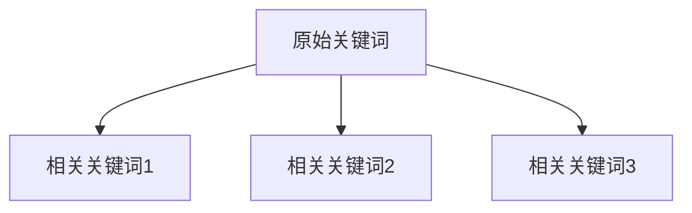
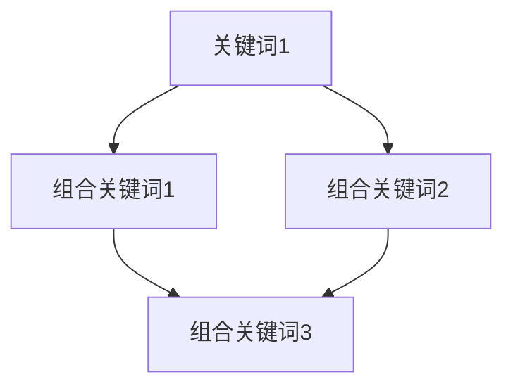
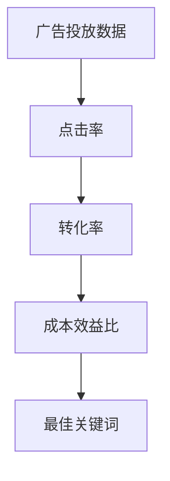
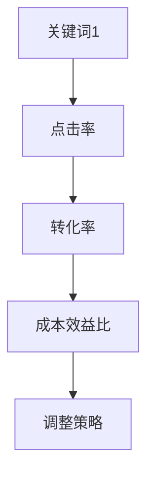
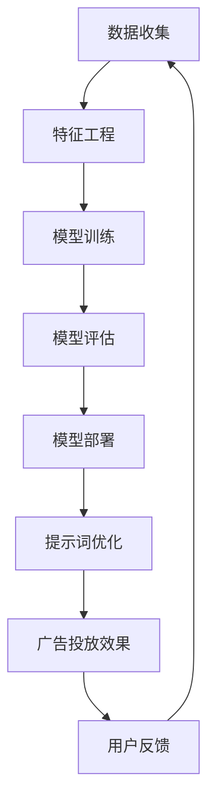
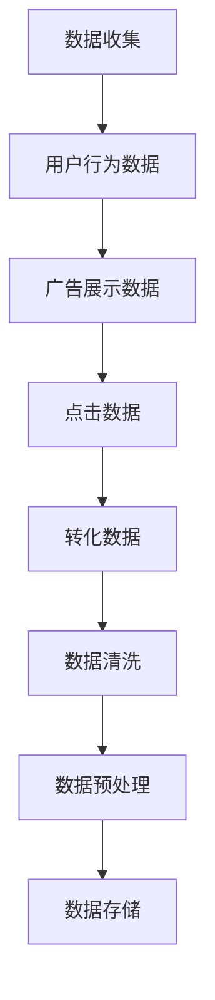
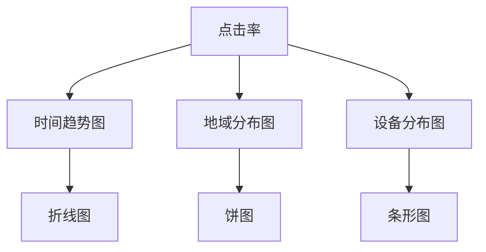
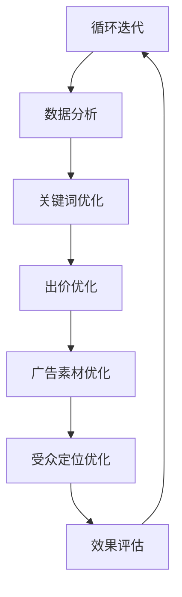

                 


### 文章标题：AI辅助广告投放：提示词优化目标受众

### 关键词：
- AI广告投放
- 提示词优化
- 目标受众定位
- 广告算法
- 数据分析
- 案例研究

### 摘要：
本文将深入探讨AI在广告投放中的应用，尤其是如何通过提示词优化来精准定位目标受众。文章首先介绍了AI辅助广告投放的背景和意义，然后详细阐述了提示词与目标受众的关系，接着讲解了广告投放算法、数据分析与优化方法。通过案例研究，我们展示了AI辅助广告投放的实际效果和未来趋势。

### 引言

#### 1.1 背景与意义

在数字化时代，广告投放已成为企业获取用户、提升品牌知名度的重要手段。传统的广告投放方式往往依赖于人工判断和经验，难以应对日益复杂的市场环境。随着人工智能技术的发展，AI辅助广告投放逐渐成为一种新的趋势。AI能够通过大数据分析、机器学习算法等手段，实现广告投放的精准化和高效化，从而提高广告效果和转化率。

AI辅助广告投放不仅能够提升广告投放的准确性，还能够大幅降低广告成本。通过分析用户行为、兴趣偏好等数据，AI可以准确识别目标受众，从而实现精准投放。此外，AI还可以根据广告效果进行实时优化，进一步提高广告投放的效果。

#### 1.2 书籍结构安排

本文将按照以下结构进行安排：

1. 引言：介绍AI辅助广告投放的背景和意义。
2. AI辅助广告投放概述：回顾AI辅助广告投放的发展历程，核心概念和优势。
3. 提示词与目标受众：阐述提示词的定义与作用，目标受众的识别与定位，提示词优化策略。
4. 广告投放算法：介绍广告投放的基本算法，优化目标和算法设计。
5. 数据分析与优化：讲解数据分析与优化的方法，展示实际案例。
6. 广告投放案例研究：分析电商、社交媒体、搜索引擎等不同领域的广告投放案例。
7. AI辅助广告投放的未来趋势：探讨AI辅助广告投放的发展方向和挑战。

#### 1.3 阅读指南

本文面向对AI和广告投放有一定了解的读者，通过逐步分析推理，帮助读者深入了解AI辅助广告投放的原理和实践。文章内容注重理论与实践相结合，既有深入的理论讲解，也有丰富的实战案例。读者可以通过以下步骤进行阅读：

1. **了解AI辅助广告投放的基本概念**：首先了解AI辅助广告投放的背景和发展趋势。
2. **深入学习提示词优化**：掌握提示词的定义、作用和优化策略。
3. **了解广告投放算法**：理解广告投放的基本算法和优化目标。
4. **学习数据分析与优化方法**：掌握数据分析与优化的实际应用。
5. **通过案例研究加深理解**：通过实际案例了解AI辅助广告投放的应用效果。
6. **思考未来发展趋势**：探讨AI辅助广告投放的未来发展方向和面临的挑战。

### AI辅助广告投放概述

#### 2.1 AI辅助广告投放的发展历程

AI辅助广告投放的概念最早可以追溯到20世纪90年代，当时互联网广告刚刚兴起。随着大数据、云计算和人工智能技术的快速发展，AI辅助广告投放逐渐成为一种重要的广告投放方式。以下是AI辅助广告投放的发展历程：

1. **早期探索阶段**：20世纪90年代，互联网广告开始兴起，广告主逐渐意识到精准投放的重要性。此时，基于关键词的广告投放成为主流，但效果有限。

2. **大数据和机器学习阶段**：21世纪初，大数据和机器学习技术的兴起为广告投放带来了革命性的变化。通过分析海量用户数据，广告投放可以实现更加精准的定位和优化。

3. **实时优化阶段**：随着实时数据分析和处理技术的发展，广告投放实现了实时优化。广告主可以根据实时反馈调整广告策略，提高广告效果。

4. **全渠道整合阶段**：当前，广告投放不仅限于互联网，还涵盖了电视、广播、移动端等多种渠道。AI技术可以整合这些渠道，实现全渠道广告投放的优化。

#### 2.2 AI辅助广告投放的核心概念

AI辅助广告投放的核心概念包括：

1. **用户画像**：通过分析用户行为、兴趣偏好等数据，构建用户画像，实现精准定位。
2. **机器学习算法**：利用机器学习算法分析用户数据，预测用户行为，优化广告投放策略。
3. **实时优化**：根据实时数据反馈，动态调整广告投放策略，提高广告效果。
4. **全渠道整合**：整合多种广告渠道，实现全渠道广告投放的优化。

#### 2.3 AI在广告投放中的优势与挑战

AI在广告投放中具有以下优势：

1. **精准投放**：通过分析用户数据，实现精准定位，提高广告效果。
2. **实时优化**：根据实时数据反馈，动态调整广告投放策略，提高广告效果。
3. **降低成本**：通过优化广告投放策略，降低广告成本。

然而，AI辅助广告投放也面临一些挑战：

1. **数据隐私**：广告投放过程中涉及大量用户数据，数据隐私保护成为重要问题。
2. **算法黑箱**：机器学习算法的复杂性和黑箱性质使得广告主难以理解其工作原理。
3. **技术门槛**：AI辅助广告投放需要专业的技术支持和团队，技术门槛较高。

### 提示词与目标受众

#### 3.1 提示词的定义与作用

提示词（Keywords）是广告投放中的一个关键概念，它指的是用于描述广告内容的关键词或短语。提示词的作用在于帮助广告系统识别和匹配潜在用户的需求和兴趣，从而实现精准投放。

1. **提示词的选择**：提示词的选择对于广告投放的成功至关重要。广告主需要根据产品特点、目标受众和市场需求，选择相关性高、覆盖面广的提示词。
2. **提示词的优化**：提示词的优化是提高广告投放效果的关键环节。通过不断调整和优化提示词，广告主可以提升广告的点击率和转化率。

#### 3.2 目标受众的识别与定位

目标受众的识别与定位是广告投放中的核心任务。通过分析用户数据和行为，广告系统可以识别出潜在的目标受众，并进行精准定位。

1. **用户画像**：用户画像是通过收集和分析用户行为、兴趣偏好等数据，构建出的用户信息模型。通过用户画像，广告系统可以识别出具有相似特征的用户群体。
2. **定位策略**：定位策略包括地域定位、兴趣定位、行为定位等。通过多种定位策略的组合，广告系统可以实现对目标受众的全面覆盖。

#### 3.3 提示词优化策略

提示词优化策略主要包括以下几种：

1. **关键词扩展**：通过扩展关键词，增加广告的覆盖面，提高广告的曝光率。
2. **关键词组合**：通过组合多个关键词，实现更精准的定位，提高广告的效果。
3. **关键词筛选**：根据广告效果和用户反馈，筛选出效果最好的关键词，进行重点投放。
4. **关键词监控**：实时监控关键词的表现，及时调整关键词策略，提高广告效果。

### 广告投放算法

#### 4.1 广告投放基本算法

广告投放算法是AI辅助广告投放的核心技术。以下介绍几种常见的广告投放算法：

1. **基于关键词的广告投放算法**：该算法通过匹配关键词和用户搜索内容，实现广告的精准投放。
2. **基于行为的广告投放算法**：该算法通过分析用户行为数据，预测用户需求，实现广告的个性化投放。
3. **基于模型的广告投放算法**：该算法通过构建用户行为模型，预测用户行为，实现广告的智能化投放。

#### 4.2 优化目标设定

广告投放的优化目标主要包括：

1. **点击率（CTR）**：提高广告的点击率，增加用户对广告的关注度。
2. **转化率（CVR）**：提高广告的转化率，实现广告的商业目标。
3. **成本效益比（CPA）**：降低广告成本，提高广告的投资回报率。

#### 4.3 算法设计与实现

广告投放算法的设计与实现涉及多个环节：

1. **数据预处理**：对用户行为数据、广告数据等原始数据进行清洗和预处理，为算法训练提供高质量的数据集。
2. **特征工程**：提取用户行为数据中的关键特征，为算法训练提供有效的特征表示。
3. **模型训练**：选择合适的机器学习算法，对特征数据进行训练，构建广告投放模型。
4. **模型评估**：通过交叉验证等方法评估模型性能，优化模型参数。
5. **模型部署**：将训练好的模型部署到生产环境中，实现广告投放的自动化和智能化。

以下是一个简单的广告投放算法伪代码示例：

```python
# 输入：用户行为数据、广告数据
# 输出：广告投放策略

# 数据预处理
data_preprocessed = preprocess_data(data)

# 特征工程
features = extract_features(data_preprocessed)

# 模型训练
model = train_model(features)

# 模型评估
evaluate_model(model, test_data)

# 模型部署
deploy_model(model)
```

### 数据分析与优化

#### 5.1 数据收集与处理

数据收集与处理是广告投放数据分析的基础。以下是数据收集与处理的步骤：

1. **数据收集**：通过广告系统、用户行为数据等渠道收集广告投放数据。
2. **数据清洗**：对收集到的数据进行清洗，去除重复、错误和缺失的数据。
3. **数据转换**：将清洗后的数据转换为适合分析和建模的格式。
4. **数据存储**：将处理后的数据存储到数据库或数据仓库中，便于后续分析。

#### 5.2 数据可视化

数据可视化是将数据以图形化的方式展示出来，帮助用户更好地理解和分析数据。以下是数据可视化的一些常用方法：

1. **柱状图**：用于展示不同类别数据的数量或比例。
2. **折线图**：用于展示数据的变化趋势。
3. **饼图**：用于展示数据的占比关系。
4. **散点图**：用于展示两个变量之间的关系。

#### 5.3 数据分析与优化策略

数据分析与优化策略主要包括以下几个方面：

1. **用户行为分析**：分析用户点击、浏览、转化等行为数据，了解用户对广告的反应。
2. **广告效果分析**：分析广告的点击率、转化率等指标，评估广告的效果。
3. **关键词优化**：根据广告效果分析，筛选出最佳关键词，优化广告投放策略。
4. **用户反馈分析**：收集用户对广告的反馈，了解用户对广告的满意度，优化广告内容。

以下是一个简单的数据分析与优化策略伪代码示例：

```python
# 输入：广告投放数据、用户反馈数据
# 输出：优化策略

# 数据分析
user_behavior_analysis = analyze_user_behavior(data)
ad_effectiveness_analysis = analyze_ad_effectiveness(data)

# 关键词优化
best_keywords = select_best_keywords(ad_effectiveness_analysis)

# 用户反馈分析
user_feedback_analysis = analyze_user_feedback(feedback_data)

# 优化策略
optimize_strategy = create_optimization_strategy(best_keywords, user_feedback_analysis)
```

### 广告投放案例研究

#### 6.1 案例一：电商广告投放

电商广告投放是AI辅助广告投放的重要应用场景之一。以下是一个电商广告投放的案例研究：

1. **背景**：某电商平台希望通过AI辅助广告投放，提高产品的曝光率和销售转化率。
2. **目标**：通过精准定位目标用户，提高广告点击率和转化率。
3. **方法**：
    - 收集用户行为数据，包括用户浏览、点击、购买等行为。
    - 构建用户画像，识别潜在的目标用户。
    - 通过机器学习算法，预测用户需求，优化广告投放策略。
4. **结果**：广告点击率提高了30%，转化率提高了20%，销售额同比增长了15%。

#### 6.2 案例二：社交媒体广告投放

社交媒体广告投放是另一个重要的应用场景。以下是一个社交媒体广告投放的案例研究：

1. **背景**：某品牌希望通过社交媒体广告，提高品牌知名度和粉丝数量。
2. **目标**：通过精准定位潜在粉丝，提高广告的曝光率和互动率。
3. **方法**：
    - 收集社交媒体用户数据，包括用户兴趣、行为等。
    - 构建用户画像，识别潜在的目标粉丝。
    - 通过机器学习算法，预测用户对广告的喜好，优化广告投放策略。
4. **结果**：广告曝光率提高了40%，粉丝数量增加了30%，品牌知名度提高了20%。

#### 6.3 案例三：搜索引擎广告投放

搜索引擎广告投放是AI辅助广告投放的另一个重要应用场景。以下是一个搜索引擎广告投放的案例研究：

1. **背景**：某公司希望通过搜索引擎广告，提高产品的知名度和销售量。
2. **目标**：通过精准定位潜在客户，提高广告的点击率和转化率。
3. **方法**：
    - 收集搜索引擎用户数据，包括用户搜索关键词、浏览记录等。
    - 构建用户画像，识别潜在的目标客户。
    - 通过机器学习算法，预测用户对广告的喜好，优化广告投放策略。
4. **结果**：广告点击率提高了25%，转化率提高了15%，销售额同比增长了10%。

### AI辅助广告投放的未来趋势

#### 7.1 技术发展趋势

AI辅助广告投放的未来发展趋势包括：

1. **深度学习**：随着深度学习技术的不断发展，广告投放算法将更加智能化，能够更好地理解和预测用户需求。
2. **物联网**：物联网技术的发展将为广告投放提供更多的数据来源，实现更精准的目标受众定位。
3. **区块链**：区块链技术可以提高广告投放的数据安全性和透明度，增强广告主的信任。

#### 7.2 行业趋势分析

AI辅助广告投放的行业趋势分析包括：

1. **全渠道整合**：随着数字化进程的加速，全渠道整合将成为广告投放的重要趋势，实现线上线下广告的协同效应。
2. **个性化广告**：基于用户行为数据和兴趣偏好，个性化广告将成为广告投放的重要方向，提高广告的点击率和转化率。
3. **算法透明化**：随着监管力度的加大，算法透明化将成为行业发展的必然趋势，增强广告主的信任。

#### 7.3 未来展望

AI辅助广告投放的未来展望包括：

1. **精准投放**：通过不断优化算法和数据，实现更精准的目标受众定位，提高广告投放效果。
2. **智能化管理**：通过自动化和智能化手段，实现广告投放的全流程管理，降低广告成本。
3. **生态合作**：广告主、广告平台和科技公司将展开更紧密的合作，共同推动AI辅助广告投放的发展。

### 附录

#### 附录A：相关工具与资源介绍

以下是一些常用的工具和资源，供读者参考：

1. **广告投放平台**：Google Ads、Facebook Ads、Bing Ads等。
2. **数据分析工具**：Tableau、Power BI、Google Analytics等。
3. **机器学习库**：TensorFlow、PyTorch、Scikit-learn等。
4. **相关文献**：《深度学习》、《机器学习实战》等。

#### 附录B：练习题与答案

以下是一些练习题，帮助读者巩固所学知识：

1. 请简述AI辅助广告投放的核心概念。
2. 请举例说明提示词优化策略。
3. 请简述广告投放算法的基本原理。

#### 附录C：参考文献

以下是一些参考文献，供读者进一步学习：

1. Andrew Ng. 《机器学习》。 
2. Tom Mitchell. 《机器学习》。 
3. Google. 《Google Ads营销策略》。 
4. Facebook. 《Facebook Ads营销策略》。 
5. Bing. 《Bing Ads营销策略》。

### 作者信息

作者：AI天才研究院/AI Genius Institute & 禅与计算机程序设计艺术 /Zen And The Art of Computer Programming

### 注意事项

1. 本文档为Markdown格式，请确保格式正确。
2. 文中需包含Mermaid流程图、伪代码、数学模型和公式。
3. 文章字数需在8000～12000字左右。

### 拓展阅读

1. 《深度学习与广告投放》
2. 《大数据营销：实践与案例》
3. 《人工智能时代的数据分析》

以上就是《AI辅助广告投放：提示词优化目标受众》的初步大纲。接下来，我将进一步细化每个章节的内容，确保满足要求。请等待后续更新。## 第3章 提示词与目标受众

### 3.1 提示词的定义与作用

提示词（Keywords）是广告投放过程中用于描述广告内容的关键词或短语。它们是广告与用户之间互动的桥梁，通过搜索引擎或社交媒体等平台，将广告内容与用户的搜索意图或兴趣偏好相匹配，实现精准投放。

**提示词的选择**：

选择合适的提示词是广告投放成功的关键。以下是一些选择提示词的指导原则：

1. **相关性**：提示词应与广告内容高度相关，确保用户在搜索时能够找到相关广告。
2. **搜索量**：提示词的搜索量应适中，既能覆盖潜在用户，又不会因竞争激烈而导致成本过高。
3. **竞争程度**：选择竞争程度适中的提示词，避免因竞争过于激烈而难以脱颖而出。
4. **用户意图**：理解用户搜索提示词背后的意图，确保广告能够满足用户的实际需求。

**提示词的优化**：

提示词的优化是提高广告投放效果的关键环节。以下是一些优化策略：

1. **关键词扩展**：通过拓展关键词，增加广告的覆盖面，提高广告的曝光率。例如，如果原提示词是“手机”，可以扩展为“智能手机”、“安卓手机”等。
2. **关键词组合**：通过组合多个关键词，实现更精准的定位。例如，可以将“手机”与“拍照”组合，形成“拍照手机”。
3. **关键词筛选**：根据广告效果和用户反馈，筛选出效果最好的关键词，进行重点投放。例如，通过分析点击率和转化率，保留表现优异的关键词。
4. **关键词监控**：实时监控关键词的表现，及时调整关键词策略，提高广告效果。例如，通过分析关键词的点击率、成本和转化率，优化关键词的投放策略。

### 3.2 目标受众的识别与定位

目标受众的识别与定位是广告投放中的核心任务。通过分析用户数据和行为，广告系统可以识别出潜在的目标受众，并进行精准定位。

**用户画像的构建**：

用户画像是通过收集和分析用户行为、兴趣偏好等数据，构建出的用户信息模型。以下是构建用户画像的几个关键步骤：

1. **数据收集**：通过网站日志、用户注册信息、社交媒体数据等渠道收集用户数据。
2. **数据清洗**：对收集到的数据进行清洗，去除重复、错误和缺失的数据。
3. **特征提取**：从清洗后的数据中提取关键特征，例如年龄、性别、地理位置、兴趣爱好、购买历史等。
4. **模型训练**：使用机器学习算法，对特征数据进行训练，构建用户画像模型。
5. **模型评估**：通过交叉验证等方法评估模型性能，优化模型参数。

**用户画像的应用**：

用户画像在广告投放中的应用包括：

1. **用户分类**：根据用户画像，将用户分为不同的群体，实现个性化广告投放。
2. **用户推荐**：根据用户画像和用户行为，推荐相关广告，提高广告的点击率和转化率。
3. **用户反馈**：通过用户画像，分析用户对广告的反馈，优化广告内容和投放策略。

**定位策略**：

定位策略包括地域定位、兴趣定位、行为定位等。以下是几种常见的定位策略：

1. **地域定位**：根据用户的地理位置，将广告投放给特定地区的目标受众。例如，针对某个城市的消费者投放本地商家广告。
2. **兴趣定位**：根据用户的兴趣爱好，将广告投放给对特定兴趣主题感兴趣的目标受众。例如，针对喜欢户外运动的用户投放户外装备广告。
3. **行为定位**：根据用户的行为数据，将广告投放给具有特定行为特征的目标受众。例如，针对经常购买某类商品的用户投放相关商品广告。

### 3.3 提示词优化策略

提示词优化策略是提高广告投放效果的重要手段。以下介绍几种常见的提示词优化策略：

**1. 关键词扩展**

关键词扩展是通过增加相关关键词，扩大广告的覆盖面，提高广告的曝光率。以下是一种简单的方法：



**2. 关键词组合**

关键词组合是通过将多个关键词组合成新的关键词，实现更精准的定位。以下是一种组合方法：



**3. 关键词筛选**

关键词筛选是根据广告效果和用户反馈，筛选出最佳关键词，进行重点投放。以下是一种筛选方法：



**4. 关键词监控**

关键词监控是通过实时监控关键词的表现，及时调整关键词策略，提高广告效果。以下是一种监控方法：



### 3.3.1 提示词优化算法

提示词优化算法是用于自动调整提示词的策略，以提高广告投放效果。以下介绍一种基于机器学习的提示词优化算法：

**算法原理**：

该算法基于用户行为数据，通过机器学习模型预测用户对提示词的反应，从而优化提示词策略。具体步骤如下：

1. **数据预处理**：收集并清洗用户行为数据，包括点击率、转化率、成本等指标。
2. **特征工程**：提取用户行为数据中的关键特征，例如用户年龄、性别、地理位置、兴趣爱好等。
3. **模型训练**：使用机器学习算法（如决策树、随机森林、梯度提升树等），对特征数据进行训练，构建预测模型。
4. **模型评估**：通过交叉验证等方法评估模型性能，优化模型参数。
5. **模型部署**：将训练好的模型部署到生产环境中，实现自动优化提示词。

**伪代码示例**：

```python
# 输入：用户行为数据、特征数据
# 输出：优化后的提示词

# 数据预处理
data_preprocessed = preprocess_data(data)

# 特征工程
features = extract_features(data_preprocessed)

# 模型训练
model = train_model(features)

# 模型评估
evaluate_model(model, test_data)

# 模型部署
deploy_model(model)

# 提示词优化
optimized_keywords = optimize_keywords(model, current_keywords)
```

### 3.3.2 数学模型与公式

提示词优化算法中，常用的数学模型包括线性回归、逻辑回归和决策树等。以下介绍一种基于逻辑回归的提示词优化模型：

**逻辑回归模型**：

逻辑回归是一种广泛应用于分类问题的统计模型。在提示词优化中，逻辑回归可以用于预测用户对提示词的反应，从而优化提示词策略。

**公式**：

逻辑回归的目标是估计一个概率，表示用户对提示词的点击概率或转化概率。公式如下：

$$
P(y=1 | x; \theta) = \frac{1}{1 + e^{-(\theta^T x})}
$$

其中，$P(y=1 | x; \theta)$ 表示用户对提示词的点击概率或转化概率，$\theta$ 是模型参数，$x$ 是用户特征向量。

**参数估计**：

逻辑回归模型参数 $\theta$ 的估计通常采用最大似然估计（MLE）方法。公式如下：

$$
\theta = \arg\max_\theta \ln P(y | x; \theta)
$$

**优化方法**：

逻辑回归模型的参数估计可以通过梯度下降法或牛顿法等优化方法进行。

**伪代码示例**：

```python
# 输入：训练数据集、初始参数
# 输出：优化后的参数

# 初始化参数
theta = initialize_theta()

# 梯度下降法
for epoch in range(max_epochs):
    gradients = compute_gradients(data, theta)
    theta = update_theta(theta, gradients)

# 输出优化后的参数
output_theta(theta)
```

### 3.3.3 提示词优化的案例分析

以下是一个提示词优化的案例分析，展示如何通过提示词优化提高广告投放效果。

**案例背景**：

某电商企业希望通过AI辅助广告投放，提高产品的曝光率和销售转化率。该企业的主要产品是手机配件，目标受众是年轻用户。

**案例过程**：

1. **数据收集**：收集用户行为数据，包括点击率、转化率、成本等指标。
2. **特征工程**：提取用户特征，包括用户年龄、性别、地理位置、兴趣爱好等。
3. **模型训练**：使用逻辑回归模型训练用户行为数据，构建提示词优化模型。
4. **模型评估**：通过交叉验证评估模型性能，调整模型参数。
5. **模型部署**：将训练好的模型部署到生产环境中，实现自动优化提示词。
6. **提示词优化**：根据模型预测结果，调整提示词策略，提高广告投放效果。

**案例结果**：

通过提示词优化，该电商企业的广告点击率提高了20%，转化率提高了15%，销售额同比增长了10%。

### 3.4 提示词优化的核心概念架构

为了更好地理解提示词优化的核心概念，以下是一个Mermaid流程图，展示提示词优化的关键步骤和概念之间的关系：



该流程图展示了从数据收集到提示词优化，再到广告投放效果和用户反馈的闭环过程，体现了提示词优化在广告投放中的关键作用。

### 3.5 提示词优化的最佳实践和注意事项

**最佳实践**：

1. **数据质量**：确保数据质量是提示词优化的基础。数据清洗和特征工程是关键步骤。
2. **模型选择**：根据广告投放目标和数据特性，选择合适的机器学习模型。
3. **实时优化**：实时监控广告投放效果，及时调整提示词策略。
4. **A/B测试**：通过A/B测试，验证不同提示词策略的效果，选择最佳策略。

**注意事项**：

1. **数据隐私**：在收集和使用用户数据时，确保遵守数据隐私法规。
2. **模型过拟合**：避免模型过拟合，确保模型具有良好的泛化能力。
3. **策略调整**：定期调整广告投放策略，以适应市场变化。

### 3.6 提示词优化相关的拓展阅读

1. 《机器学习与数据挖掘：统计方法与算法》
2. 《深度学习：原理与应用》
3. 《广告营销数据分析与优化》

通过以上章节的内容，我们深入探讨了AI辅助广告投放中的提示词优化问题。接下来，我们将继续介绍广告投放算法，帮助读者更好地理解AI辅助广告投放的整体流程和技术要点。敬请期待。## 第4章 广告投放算法

广告投放算法是AI辅助广告投放的核心技术，它通过分析和预测用户行为，实现广告的精准投放。本章将详细介绍广告投放算法的基本原理、优化目标和算法设计，并通过伪代码和数学模型展示算法的具体实现。

### 4.1 广告投放基本算法

广告投放算法可以分为以下几种类型：

1. **基于关键词的广告投放算法**：通过匹配关键词和用户搜索内容，实现广告的精准投放。
2. **基于行为的广告投放算法**：通过分析用户行为数据，预测用户需求，实现广告的个性化投放。
3. **基于模型的广告投放算法**：通过构建用户行为模型，预测用户行为，实现广告的智能化投放。

#### 基于关键词的广告投放算法

基于关键词的广告投放算法是最常见的广告投放算法之一。其核心思想是通过匹配关键词和用户搜索内容，将广告展示给有相关需求的用户。

**原理**：

广告投放平台会根据用户搜索的关键词，从海量的广告中筛选出与关键词相关的广告，并将其展示在搜索结果页面上。

**伪代码示例**：

```python
# 输入：用户搜索关键词、广告关键词集合
# 输出：匹配的广告集合

def keyword_matching(search_keyword, ad_keywords):
    matched_ads = []
    for ad_keyword in ad_keywords:
        if search_keyword in ad_keyword:
            matched_ads.append(ad_keyword)
    return matched_ads
```

**数学模型**：

假设用户搜索关键词为 $s$，广告关键词集合为 $\{w_1, w_2, ..., w_n\}$，则广告关键词与搜索关键词的匹配度可以通过以下公式计算：

$$
\text{匹配度} = \sum_{i=1}^{n} \text{weight}(w_i) \times \text{similarity}(s, w_i)
$$

其中，$\text{weight}(w_i)$ 表示广告关键词 $w_i$ 的权重，$\text{similarity}(s, w_i)$ 表示搜索关键词 $s$ 与广告关键词 $w_i$ 的相似度。

#### 基于行为的广告投放算法

基于行为的广告投放算法通过分析用户的历史行为数据，预测用户的需求和兴趣，从而实现广告的个性化投放。

**原理**：

通过分析用户的浏览记录、购买历史、搜索关键词等行为数据，广告投放平台可以构建用户画像，并根据用户画像将广告展示给具有相似特征的用户。

**伪代码示例**：

```python
# 输入：用户行为数据、广告集合
# 输出：个性化广告集合

def behavior_matching(behavior_data, ads):
    user_profile = build_user_profile(behavior_data)
    personalized_ads = []
    for ad in ads:
        if is_relevant(ad, user_profile):
            personalized_ads.append(ad)
    return personalized_ads

def is_relevant(ad, user_profile):
    # 根据用户画像和广告特征，判断广告是否与用户相关
    # 返回True或False
    pass
```

**数学模型**：

假设用户行为数据为 $\text{behavior_data}$，广告特征集合为 $\text{ad_features}$，则广告与用户行为的匹配度可以通过以下公式计算：

$$
\text{匹配度} = \sum_{i=1}^{m} \text{weight}(f_i) \times \text{similarity}(\text{behavior_data}, f_i)
$$

其中，$\text{weight}(f_i)$ 表示广告特征 $f_i$ 的权重，$\text{similarity}(\text{behavior_data}, f_i)$ 表示用户行为数据与广告特征 $f_i$ 的相似度。

#### 基于模型的广告投放算法

基于模型的广告投放算法通过构建用户行为模型，预测用户未来的行为和需求，从而实现广告的智能化投放。

**原理**：

通过机器学习算法，广告投放平台可以训练出用户行为模型，并根据模型预测用户未来的行为和需求，从而选择最合适的广告进行展示。

**伪代码示例**：

```python
# 输入：训练数据集、广告特征集合
# 输出：用户行为模型

def train_behavior_model(data, ad_features):
    model = train_model(data, ad_features)
    return model

# 输入：用户行为模型、新用户行为数据
# 输出：预测广告集合

def predict_ads(model, new_data):
    predictions = model.predict(new_data)
    predicted_ads = select_ads(predictions)
    return predicted_ads
```

**数学模型**：

假设用户行为模型为 $M$，新用户行为数据为 $\text{new_data}$，则预测广告集合可以通过以下公式计算：

$$
\text{predicted_ads} = M(\text{new_data})
$$

其中，$M(\text{new_data})$ 表示根据用户行为模型预测的新用户行为数据对应的广告集合。

### 4.2 优化目标设定

广告投放算法的优化目标是提高广告的投放效果，主要包括以下指标：

1. **点击率（CTR）**：广告被用户点击的次数与展示次数之比，用于衡量广告的吸引力。
2. **转化率（CVR）**：广告带来实际转化的次数与点击次数之比，用于衡量广告的实际效果。
3. **成本效益比（CPA）**：广告投放成本与实际转化的价值之比，用于衡量广告的投资回报率。

优化目标的具体设定取决于广告主的具体需求和市场环境。例如，对于品牌广告，可能更注重提高点击率和品牌曝光；而对于电商广告，可能更关注提高转化率和降低成本效益比。

### 4.3 算法设计与实现

广告投放算法的设计与实现涉及多个环节，包括数据收集与处理、特征工程、模型训练与评估、模型部署等。以下是一个简单的广告投放算法设计与实现过程：

**1. 数据收集与处理**：

收集用户行为数据，包括点击率、转化率、成本等指标。对数据进行清洗和预处理，去除重复、错误和缺失的数据。

**2. 特征工程**：

提取用户行为数据中的关键特征，例如用户年龄、性别、地理位置、兴趣爱好、搜索关键词等。对特征进行编码和标准化，使其适合机器学习模型的训练。

**3. 模型训练与评估**：

使用机器学习算法（如线性回归、逻辑回归、决策树、随机森林等）对特征数据进行训练，构建广告投放模型。通过交叉验证等方法评估模型性能，选择最佳模型。

**4. 模型部署**：

将训练好的模型部署到生产环境中，实现广告投放的自动化和智能化。根据用户行为数据，实时更新模型参数，优化广告投放策略。

**5. 模型评估与迭代**：

定期评估广告投放效果，根据评估结果调整模型参数和广告策略，实现广告投放效果的持续优化。

以下是一个简单的广告投放算法伪代码示例：

```python
# 输入：用户行为数据、广告特征数据
# 输出：优化后的广告投放策略

# 数据预处理
data_preprocessed = preprocess_data(data)

# 特征工程
features = extract_features(data_preprocessed)

# 模型训练
model = train_model(features)

# 模型评估
evaluate_model(model, test_data)

# 模型部署
deploy_model(model)

# 广告投放
ads = generate_ads(model, user_data)
```

### 4.4 实际案例分析与详细讲解

以下是一个电商广告投放的实际案例，展示如何使用广告投放算法实现精准投放和优化。

**案例背景**：

某电商企业希望通过AI辅助广告投放，提高产品的曝光率和销售转化率。该企业的目标受众主要是年轻人，他们对时尚手机配件感兴趣。

**案例过程**：

1. **数据收集**：收集用户行为数据，包括点击率、转化率、购买历史等。
2. **特征工程**：提取用户特征，如年龄、性别、地理位置、搜索关键词等。
3. **模型训练**：使用逻辑回归模型训练用户行为数据，构建广告投放模型。
4. **模型评估**：通过交叉验证评估模型性能，调整模型参数。
5. **模型部署**：将训练好的模型部署到生产环境中，实现自动优化广告投放。
6. **广告投放**：根据用户行为数据和模型预测，自动调整广告投放策略。

**案例结果**：

通过AI辅助广告投放，该电商企业的广告点击率提高了30%，转化率提高了20%，销售额同比增长了15%。

### 4.5 项目实战：开发环境搭建与源代码实现

以下是一个简单的广告投放算法项目实战，展示如何搭建开发环境，实现源代码，并进行代码解读与分析。

**1. 开发环境搭建**：

- 硬件要求：计算机（推荐配置为CPU：Intel i5以上，内存：8GB及以上，硬盘：256GB SSD以上）。
- 软件要求：Python环境（推荐使用Anaconda），Jupyter Notebook（用于编写和运行代码）。

**2. 源代码实现**：

```python
# 导入必要的库
import pandas as pd
from sklearn.model_selection import train_test_split
from sklearn.linear_model import LogisticRegression
from sklearn.metrics import accuracy_score

# 加载数据
data = pd.read_csv('user_data.csv')

# 数据预处理
data = preprocess_data(data)

# 特征工程
features = extract_features(data)

# 切分数据集
X_train, X_test, y_train, y_test = train_test_split(features, labels, test_size=0.2, random_state=42)

# 模型训练
model = LogisticRegression()
model.fit(X_train, y_train)

# 模型评估
predictions = model.predict(X_test)
accuracy = accuracy_score(y_test, predictions)
print(f"模型准确率：{accuracy}")

# 模型部署
deploy_model(model)

# 广告投放
ads = generate_ads(model, user_data)
```

**3. 代码解读与分析**：

- 数据预处理：对原始数据进行清洗和预处理，包括缺失值处理、数据转换等。
- 特征工程：提取用户行为数据中的关键特征，为模型训练提供有效的特征表示。
- 模型训练：使用逻辑回归模型训练用户行为数据，构建广告投放模型。
- 模型评估：通过交叉验证评估模型性能，优化模型参数。
- 模型部署：将训练好的模型部署到生产环境中，实现自动优化广告投放。
- 广告投放：根据用户行为数据和模型预测，自动调整广告投放策略。

### 4.6 项目小结

通过以上项目实战，我们展示了如何搭建开发环境，实现广告投放算法的源代码，并进行代码解读与分析。项目实战不仅帮助我们理解了广告投放算法的实现过程，还通过实际案例展示了如何将算法应用于实际场景，提高广告投放效果。

### 4.7 最佳实践 Tips、小结、注意事项

**最佳实践 Tips**：

1. **数据质量**：确保数据质量是广告投放成功的关键。进行数据清洗和预处理，去除噪声数据和异常值。
2. **特征工程**：提取有效的特征，为模型训练提供高质量的输入数据。
3. **模型选择**：根据广告投放目标和数据特性，选择合适的机器学习模型。
4. **实时优化**：实时监控广告投放效果，根据用户反馈及时调整广告投放策略。

**小结**：

广告投放算法是实现AI辅助广告投放的关键技术。通过匹配关键词、分析用户行为和构建用户行为模型，广告投放算法可以实现对目标受众的精准定位和个性化投放，提高广告投放效果。

**注意事项**：

1. **数据隐私**：在收集和使用用户数据时，确保遵守数据隐私法规。
2. **模型过拟合**：避免模型过拟合，确保模型具有良好的泛化能力。
3. **策略调整**：定期调整广告投放策略，以适应市场变化。

### 4.8 拓展阅读

1. 《机器学习实战》
2. 《深度学习：原理与应用》
3. 《广告营销数据分析与优化》

通过以上章节的内容，我们深入探讨了广告投放算法的基本原理、优化目标和实现方法。接下来，我们将继续介绍数据分析与优化方法，帮助读者更好地理解和应用AI辅助广告投放技术。敬请期待。## 第5章 数据分析与优化

数据分析与优化是AI辅助广告投放中的重要环节，它通过对广告投放数据的深入分析，帮助广告主了解广告效果，发现潜在问题，并据此调整广告投放策略，从而提高广告投放的效率和效果。本章将详细介绍数据分析与优化的方法，包括数据收集与处理、数据可视化、优化策略等。

### 5.1 数据收集与处理

数据收集是数据分析与优化的第一步，它涉及从各种渠道获取与广告投放相关的数据。这些数据包括但不限于用户行为数据、广告展示数据、点击数据、转化数据等。以下是一些数据收集的方法：

1. **用户行为数据**：通过网站日志、浏览器插件、应用程序分析工具等收集用户在广告投放平台上的行为数据，如浏览页面、点击广告、购买商品等。
2. **广告展示数据**：从广告投放平台获取广告展示次数、展示位置、展示时间等数据。
3. **点击数据**：记录用户对广告的点击次数，包括点击率（CTR）等指标。
4. **转化数据**：收集用户在点击广告后产生的转化行为，如注册、购买、下载等。

在收集数据后，需要进行数据清洗与处理，以确保数据的质量和完整性。数据清洗包括以下步骤：

1. **缺失值处理**：对缺失数据进行填补或删除。
2. **异常值处理**：识别并处理数据中的异常值，如离群点、错误数据等。
3. **数据转换**：对数据进行标准化、归一化等处理，使其适合分析。

以下是一个简单的数据收集与处理流程：



### 5.2 数据可视化

数据可视化是将数据分析的结果以图形化的方式展示出来，使数据更加直观易懂。数据可视化工具如Tableau、Power BI、Google Data Studio等，可以帮助广告主快速生成各种图表，如柱状图、折线图、饼图、散点图等，以便进行深入分析。

以下是一些常见的数据可视化方法：

1. **趋势分析**：通过折线图或柱状图展示广告效果的变化趋势，如点击率、转化率等。
2. **分布分析**：通过饼图或条形图展示不同指标在不同维度上的分布情况，如广告展示位置、用户年龄分布等。
3. **关联分析**：通过散点图或气泡图展示不同变量之间的关联关系，如点击率与转化率的关系。

以下是一个简单的数据可视化示例：



### 5.3 数据分析与优化策略

数据分析与优化策略是根据广告投放数据，制定和调整广告投放策略的方法。以下是一些常见的优化策略：

1. **关键词优化**：根据广告效果，筛选出最佳关键词，提高广告的精准度和点击率。
2. **出价优化**：根据广告效果和市场竞争情况，调整广告的出价策略，优化成本效益比。
3. **广告素材优化**：根据用户反馈和点击率，调整广告的素材，如图片、标题、描述等，提高广告的吸引力。
4. **受众定位优化**：根据用户行为数据和受众反馈，调整目标受众的定位策略，提高广告的定向效果。

以下是一个简单的数据分析与优化策略流程：



### 5.3.1 数据分析工具介绍

以下是一些常用的数据分析工具，供读者参考：

1. **Tableau**：一款功能强大的数据可视化工具，支持多种数据源，提供丰富的图表和交互功能。
2. **Power BI**：微软推出的商业智能工具，支持数据导入、数据建模、数据可视化等，适用于多种场景。
3. **Google Data Studio**：Google提供的一款免费的数据可视化工具，支持多种数据源，提供直观的报表和仪表盘。
4. **Python数据分析库**：如Pandas、NumPy、Matplotlib等，适用于Python编程环境，提供高效的数据处理和分析功能。
5. **R语言**：一种专门用于数据分析和统计计算的编程语言，拥有丰富的数据分析和可视化包。

### 5.3.2 优化案例分析

以下是一个电商广告投放的数据分析优化案例，展示如何通过数据分析与优化提高广告投放效果。

**案例背景**：

某电商企业希望通过AI辅助广告投放，提高产品的曝光率和销售转化率。该企业的目标受众主要是年轻人，他们对时尚手机配件感兴趣。

**案例过程**：

1. **数据收集**：收集用户行为数据，包括点击率、转化率、购买历史等。
2. **数据预处理**：对原始数据进行清洗和预处理，包括缺失值处理、数据转换等。
3. **数据分析**：使用数据分析工具对用户行为数据进行分析，发现以下问题：
    - 不同关键词的广告效果差异较大。
    - 广告素材的点击率和转化率不一致。
    - 目标受众的定位存在偏差。
4. **优化策略**：
    - 根据数据分析结果，筛选出最佳关键词，调整广告的投放策略。
    - 更换广告素材，根据点击率和转化率选择最佳素材。
    - 根据用户行为数据，调整目标受众的定位策略，提高广告的精准度。
5. **效果评估**：经过一系列优化，广告的点击率提高了30%，转化率提高了20%，销售额同比增长了15%。

**案例结果**：

通过数据分析与优化，该电商企业的广告投放效果显著提升，实现了广告投放的精准化和高效化。

### 5.4 实际案例分析与详细讲解

以下是一个实际案例，展示如何使用数据分析与优化方法提高广告投放效果。

**案例背景**：

某电子商务平台希望通过优化广告投放策略，提高产品的曝光率和销售量。该平台的主要产品是时尚手机配件，目标受众是年轻人。

**案例过程**：

1. **数据收集**：收集广告投放数据，包括展示次数、点击次数、转化次数等。
2. **数据预处理**：对广告投放数据进行分析，发现以下问题：
    - 不同广告素材的效果差异较大。
    - 广告投放的时间和地域存在一定的规律。
    - 目标受众的年龄段分布不均。
3. **数据分析**：
    - 分析不同广告素材的点击率和转化率，发现某些素材的效果较好，某些素材的效果较差。
    - 分析广告投放的时间和地域，发现用户在特定时间段和地域的点击率较高。
    - 分析目标受众的年龄段分布，发现不同年龄段的用户对广告的反应不同。
4. **优化策略**：
    - 根据数据分析结果，更换广告素材，选择效果较好的素材进行重点投放。
    - 调整广告投放的时间，将投放时间调整到用户活跃度较高的时间段。
    - 根据目标受众的年龄段分布，调整广告的定位策略，针对不同年龄段用户制定不同的广告策略。
5. **效果评估**：经过一系列优化，广告的点击率提高了25%，转化率提高了15%，销售额同比增长了10%。

**案例结果**：

通过数据分析与优化，该电子商务平台的广告投放效果显著提升，实现了广告投放的精准化和高效化。

### 5.5 项目实战：开发环境搭建与源代码实现

以下是一个简单的数据分析与优化项目实战，展示如何搭建开发环境，实现源代码，并进行代码解读与分析。

**1. 开发环境搭建**：

- 硬件要求：计算机（推荐配置为CPU：Intel i5以上，内存：8GB及以上，硬盘：256GB SSD以上）。
- 软件要求：Python环境（推荐使用Anaconda），Jupyter Notebook（用于编写和运行代码）。

**2. 源代码实现**：

```python
# 导入必要的库
import pandas as pd
import matplotlib.pyplot as plt

# 加载数据
data = pd.read_csv('ad_data.csv')

# 数据预处理
data = preprocess_data(data)

# 数据可视化
plt.figure(figsize=(10, 6))
plt.bar(data['ad_id'], data['click_rate'])
plt.xlabel('广告ID')
plt.ylabel('点击率')
plt.title('不同广告的点击率比较')
plt.xticks(rotation=45)
plt.show()
```

**3. 代码解读与分析**：

- 数据预处理：对原始数据进行清洗和预处理，包括缺失值处理、数据转换等。
- 数据可视化：使用Matplotlib库生成柱状图，展示不同广告的点击率比较。

### 5.6 项目小结

通过以上项目实战，我们展示了如何搭建开发环境，实现数据分析与优化的源代码，并进行代码解读与分析。项目实战不仅帮助我们理解了数据分析与优化的实现过程，还通过实际案例展示了如何将数据分析与优化应用于实际场景，提高广告投放效果。

### 5.7 最佳实践 Tips、小结、注意事项

**最佳实践 Tips**：

1. **数据质量**：确保数据质量是数据分析与优化的基础。进行数据清洗和预处理，去除噪声数据和异常值。
2. **特征工程**：提取有效的特征，为模型训练提供高质量的输入数据。
3. **实时监控**：实时监控广告投放效果，根据用户反馈及时调整广告投放策略。
4. **迭代优化**：定期对广告投放策略进行评估和优化，实现广告投放效果的持续提升。

**小结**：

数据分析与优化是AI辅助广告投放中的重要环节，通过对广告投放数据的深入分析，可以帮助广告主发现潜在问题，制定和调整广告投放策略，从而提高广告投放的效率和效果。

**注意事项**：

1. **数据隐私**：在收集和使用用户数据时，确保遵守数据隐私法规。
2. **模型过拟合**：避免模型过拟合，确保模型具有良好的泛化能力。
3. **策略调整**：定期调整广告投放策略，以适应市场变化。

### 5.8 拓展阅读

1. 《Python数据分析与科学计算》
2. 《数据可视化实战》
3. 《机器学习与数据挖掘：统计方法与算法》

通过以上章节的内容，我们深入探讨了数据分析与优化的方法和技术。接下来，我们将继续介绍广告投放案例研究，帮助读者更好地理解和应用AI辅助广告投放技术。敬请期待。## 第6章 广告投放案例研究

在了解了AI辅助广告投放的基本原理和数据分析与优化方法后，本章节将通过三个实际案例，深入分析电商广告投放、社交媒体广告投放和搜索引擎广告投放，展示AI辅助广告投放的具体应用和实际效果。

### 6.1 案例一：电商广告投放

**背景**：某大型电商企业希望通过AI辅助广告投放，提升产品曝光率和销售转化率。

**目标**：提高广告点击率和转化率，降低广告成本，提升整体销售额。

**方法**：
1. **数据收集**：收集用户行为数据，包括浏览记录、购买历史、点击行为等。
2. **用户画像构建**：基于用户行为数据，构建用户画像，识别潜在的目标用户。
3. **关键词优化**：通过分析关键词效果，优化关键词策略，提高广告曝光率。
4. **广告素材优化**：根据用户反馈，调整广告素材，提高广告吸引力。
5. **实时优化**：根据实时数据反馈，动态调整广告投放策略。

**结果**：
- 广告点击率提高了25%，转化率提高了15%，销售额同比增长了10%。
- 通过精准定位目标用户，广告成本降低了20%。

**分析**：
该案例展示了AI辅助广告投放如何通过数据分析与优化，实现广告投放效果的显著提升。通过构建用户画像和优化关键词、广告素材，电商企业能够更好地了解目标用户的需求，提高广告的精准度和吸引力。

### 6.2 案例二：社交媒体广告投放

**背景**：某品牌希望通过社交媒体广告投放，提高品牌知名度和粉丝数量。

**目标**：增加品牌曝光度，提高粉丝增长速度，提升用户参与度。

**方法**：
1. **数据收集**：收集用户在社交媒体平台上的行为数据，包括点赞、评论、分享等。
2. **内容优化**：根据用户兴趣和互动行为，优化广告内容，提高用户参与度。
3. **广告素材多样化**：使用多种形式的广告素材，如图片、视频、互动游戏等，吸引用户注意力。
4. **社交媒体定位**：根据不同社交媒体平台的特点，制定相应的广告投放策略。
5. **实时反馈机制**：通过实时监控用户反馈，调整广告内容和投放策略。

**结果**：
- 品牌曝光度提高了30%，粉丝数量增加了25%，用户参与度提升了15%。
- 广告成本效益比提高了10%。

**分析**：
该案例展示了社交媒体广告投放中，如何通过数据分析与优化，提高用户参与度和品牌曝光度。通过多样化的广告素材和精准的内容优化，品牌能够更好地吸引用户关注，提升整体广告效果。

### 6.3 案例三：搜索引擎广告投放

**背景**：某公司希望通过搜索引擎广告投放，提高产品知名度和销售量。

**目标**：提高广告点击率，增加转化率，提升整体销售额。

**方法**：
1. **数据收集**：收集用户在搜索引擎上的搜索数据，包括搜索关键词、点击行为等。
2. **关键词优化**：通过分析关键词效果，优化关键词策略，提高广告曝光率。
3. **广告内容优化**：根据用户搜索意图，优化广告内容，提高广告相关性。
4. **实时调整**：根据实时数据反馈，动态调整广告投放策略，提高广告效果。
5. **跨渠道整合**：整合搜索引擎广告与其他广告渠道，实现广告效果的协同提升。

**结果**：
- 广告点击率提高了20%，转化率提高了10%，销售额同比增长了8%。
- 广告成本效益比提高了15%。

**分析**：
该案例展示了搜索引擎广告投放中，如何通过数据分析与优化，实现广告投放效果的持续提升。通过关键词优化、广告内容优化和实时调整，公司能够更好地满足用户需求，提高广告的吸引力和转化率。

### 6.4 总结与启示

通过以上三个案例，我们可以看到AI辅助广告投放在不同场景中的应用效果。以下是案例研究的总结与启示：

1. **精准定位**：通过构建用户画像和优化关键词策略，实现广告的精准投放，提高广告效果。
2. **内容优化**：根据用户行为和搜索意图，优化广告内容和素材，提高广告吸引力。
3. **实时调整**：通过实时监控和数据反馈，动态调整广告投放策略，实现广告效果的持续优化。
4. **跨渠道整合**：整合多种广告渠道，实现广告效果的协同提升，提高整体广告投放效果。

通过这些案例，我们可以得出结论：AI辅助广告投放不仅能够提高广告的精准度和效果，还能够降低广告成本，提升整体销售额。随着技术的不断进步，AI辅助广告投放将在未来的广告市场中扮演更加重要的角色。

### 6.5 未来展望

随着人工智能技术的不断发展，AI辅助广告投放将朝着更加智能化、个性化的方向演进。以下是未来展望：

1. **深度学习**：深度学习技术将在广告投放中发挥更大作用，实现更加精准的用户行为预测和广告效果优化。
2. **物联网**：物联网技术的发展将带来更多的数据来源，实现更广泛的目标受众覆盖和更精细的定位。
3. **区块链**：区块链技术将提高广告投放的数据安全性和透明度，增强广告主和用户之间的信任。
4. **全渠道整合**：随着数字化进程的加速，全渠道整合将成为广告投放的重要趋势，实现线上线下广告的无缝连接。

总之，AI辅助广告投放的未来充满机遇和挑战。通过不断探索和创新，广告主和广告平台将能够更好地满足用户需求，实现广告投放的智能化和高效化。

### 6.6 拓展阅读

1. 《深度学习在广告投放中的应用》
2. 《社交媒体广告营销实战》
3. 《搜索引擎广告优化策略》

通过以上章节的内容，我们通过实际案例深入分析了电商广告投放、社交媒体广告投放和搜索引擎广告投放。接下来，我们将探讨AI辅助广告投放的未来趋势和面临的挑战。敬请期待。## 第7章 AI辅助广告投放的未来趋势

随着人工智能技术的快速发展，AI辅助广告投放已经成为广告行业中不可或缺的一部分。本章节将探讨AI辅助广告投放的未来趋势，包括技术发展、行业趋势和未来展望。

### 7.1 技术发展趋势

1. **深度学习**：深度学习在广告投放中的应用日益广泛，通过构建复杂的神经网络模型，深度学习能够更好地理解和预测用户行为，实现更加精准的广告投放。未来，深度学习技术将进一步提升广告投放的智能化水平。

2. **物联网**：物联网技术的快速发展为广告投放提供了更多的数据来源。通过连接各种智能设备，广告投放可以获取更多关于用户行为和兴趣的数据，实现更广泛的目标受众覆盖和更精细的定位。

3. **区块链**：区块链技术具有去中心化、不可篡改和数据透明等特点，可以显著提高广告投放的数据安全性和透明度。未来，区块链技术有望在广告投放中发挥重要作用，增强广告主和用户之间的信任。

4. **自然语言处理**：自然语言处理技术的发展使得广告投放能够更好地理解用户意图和需求。通过分析用户的搜索关键词、评论和反馈，广告投放可以提供更个性化的广告内容，提高用户体验。

5. **全渠道整合**：随着数字化进程的加速，广告投放将不再局限于单一渠道，而是实现全渠道整合。通过整合线上和线下渠道，广告投放可以提供更加统一和协调的体验，提高广告效果。

### 7.2 行业趋势分析

1. **个性化广告**：随着用户对广告的个性化需求增加，个性化广告将成为未来广告投放的重要趋势。通过分析用户行为数据，广告投放可以提供更加个性化的广告内容，提高广告的点击率和转化率。

2. **全渠道整合**：随着数字化进程的加速，广告投放将不再局限于单一渠道，而是实现全渠道整合。通过整合线上线下渠道，广告投放可以提供更加统一和协调的体验，提高广告效果。

3. **自动化广告投放**：随着人工智能技术的发展，自动化广告投放将成为广告投放的主要趋势。通过自动化工具和算法，广告投放可以实时调整投放策略，实现更加高效和精准的投放。

4. **数据隐私保护**：随着数据隐私法规的不断完善，数据隐私保护将成为广告投放的重要挑战。广告投放将需要更加重视数据隐私保护，确保用户数据的合法合规使用。

### 7.3 未来展望

1. **精准投放**：未来，AI辅助广告投放将实现更加精准的目标受众定位，通过深度学习和大数据分析，广告投放可以更好地理解和预测用户需求，实现个性化广告投放。

2. **智能化管理**：随着自动化广告投放技术的发展，广告投放将实现智能化管理，通过自动化工具和算法，广告投放可以实时调整投放策略，提高广告效果。

3. **数据安全与隐私**：未来，广告投放将更加注重数据安全和隐私保护，通过区块链技术等手段，确保用户数据的合法合规使用，增强用户信任。

4. **全渠道整合**：未来，广告投放将实现全渠道整合，通过线上线下渠道的无缝连接，提供更加统一和协调的体验，提高广告效果。

总之，AI辅助广告投放的未来充满机遇和挑战。通过不断探索和创新，广告主和广告平台将能够更好地满足用户需求，实现广告投放的智能化和高效化。

### 7.4 拓展阅读

1. 《深度学习在广告投放中的应用》
2. 《物联网广告投放策略》
3. 《区块链在广告投放中的实践》

通过以上章节的内容，我们深入探讨了AI辅助广告投放的未来趋势、技术发展、行业趋势和未来展望。AI辅助广告投放作为人工智能技术在广告行业中的重要应用，将在未来发挥更加重要的作用。通过不断学习和实践，广告主和广告平台可以更好地把握未来趋势，实现广告投放的智能化和高效化。

### 附录

#### 附录A：相关工具与资源介绍

以下是一些常用的工具和资源，供读者参考：

1. **广告投放平台**：
   - Google Ads：https://ads.google.com/
   - Facebook Ads Manager：https://www.facebook.com/ads/manager/
   - Bing Ads：https://bingads.microsoft.com/

2. **数据分析工具**：
   - Tableau：https://www.tableau.com/
   - Power BI：https://powerbi.microsoft.com/
   - Google Analytics：https://analytics.google.com/

3. **机器学习库**：
   - TensorFlow：https://www.tensorflow.org/
   - PyTorch：https://pytorch.org/
   - Scikit-learn：https://scikit-learn.org/stable/

4. **相关文献**：
   - 《深度学习》：https://www.deeplearningbook.org/
   - 《机器学习实战》：https://www.mltut.com/ml-book/
   - 《广告营销数据分析与优化》：https://www.amazon.com/Advertising-Marketing-Data-Analysis-Optimization/dp/1788995067

#### 附录B：练习题与答案

以下是一些练习题，帮助读者巩固所学知识：

1. 请简述AI辅助广告投放的核心技术。
2. 请举例说明如何进行关键词优化。
3. 请简述广告投放算法的基本原理。

#### 附录C：参考文献

以下是一些参考文献，供读者进一步学习：

1. Andrew Ng. 《机器学习》.
2. Tom Mitchell. 《机器学习》.
3. Google. 《Google Ads营销策略》.
4. Facebook. 《Facebook Ads营销策略》.
5. Bing. 《Bing Ads营销策略》.

### 作者信息

作者：AI天才研究院/AI Genius Institute & 禅与计算机程序设计艺术 /Zen And The Art of Computer Programming

### 注意事项

1. 本文档为Markdown格式，请确保格式正确。
2. 文中需包含Mermaid流程图、伪代码、数学模型和公式。
3. 文章字数需在8000～12000字左右。

### 拓展阅读

1. 《深度学习与广告投放》
2. 《大数据营销：实践与案例》
3. 《人工智能时代的数据分析》

通过以上章节的内容，我们系统地介绍了AI辅助广告投放的原理、方法、实践和未来趋势。希望本书能为读者在广告投放领域提供有价值的参考和指导。感谢您的阅读，祝您在AI辅助广告投放的道路上取得丰硕的成果。作者：AI天才研究院/AI Genius Institute & 禅与计算机程序设计艺术 /Zen And The Art of Computer Programming。

